# ChannelForge System Context

- **Specification version:** 0.1
- **Status:** Draft
- **Last updated:** 2026-07-26

## Purpose

This document defines the system boundary of ChannelForge, the people and
systems that interact with it, and the logical runtime components contained
inside a ChannelForge deployment.

This is a system-level view. Detailed domain entities, database tables, API
routes, scheduling algorithms, and plugin contracts are defined in later
documents.

## System of Interest

ChannelForge is a self-hosted virtual television programming and playout
platform.

It imports media information from supported media servers, maintains a
normalized catalog, models television networks, generates deterministic
schedules, executes live playout, and exposes channel and guide information to
compatible clients.

The initial deployment target is a single Docker container with persistent local
storage.

ChannelForge is a modular monolith. Its internal responsibilities must remain
separated through explicit application and module boundaries even when they run
inside the same process or container.

## Responsibilities Owned by ChannelForge

ChannelForge owns:

- User and instance configuration
- Network definitions
- Channel definitions
- Network profiles
- Dayparts
- Programming blocks
- Scheduling rules
- Schedule plans
- Approved lineups
- Normalized catalog records
- Media-source bindings
- Branding configuration
- Presentation-asset configuration
- Network-health metrics
- Programming Director recommendations
- IPTV playlist generation
- XMLTV generation
- HDHomeRun-compatible discovery and lineup data
- Live playout coordination
- ChannelForge-owned identifiers
- Import, synchronization, and background-job state
- Migration state for inherited Tunarr data

## Responsibilities Not Owned by ChannelForge

ChannelForge does not own:

- The original media files managed by Plex, Jellyfin, or Emby
- The availability or integrity of external media servers
- Client DVR databases
- Client playback implementations
- Third-party metadata-service availability
- Host operating-system security
- Docker host configuration
- Reverse-proxy configuration
- Network routing outside the ChannelForge deployment
- Public distribution infrastructure for community packs or plugins
- Media acquisition or downloading
- Digital-rights-management circumvention

## Human Actors

| Actor | Primary responsibilities |
| --- | --- |
| Administrator | Configures the instance, users, media sources, secrets, storage, output settings, and system-level policies |
| Operator | Creates and manages networks, programming rules, schedules, branding, health recommendations, and playout |
| Viewer | Uses permitted read-only management views such as schedules, guide information, and network health |
| API Client | Uses the REST API for approved automation or integration workflows |

An individual user may hold more than one role. Exact authorization rules are
defined in the security specification.

## External Systems

### Plex

Plex may interact with ChannelForge in two separate roles:

1. As a media source from which ChannelForge imports libraries and resolves
   playback.
2. As a Live TV or DVR client that consumes ChannelForge tuner, stream, and
   guide output.

These roles must remain logically separate even when they refer to the same Plex
installation.

### Jellyfin

Jellyfin may act as:

1. A media source.
2. A Live TV client consuming M3U, XMLTV, or compatible tuner output.

### Emby

Emby may act as:

1. A media source.
2. A Live TV client consuming supported IPTV and guide output.

### IPTV and Media Clients

Compatible clients may consume:

- M3U or M3U8 playlists
- Live channel streams
- XMLTV guide data
- HDHomeRun-compatible discovery and lineup endpoints

Clients do not receive direct database access or unrestricted media-source
credentials.

### Metadata Providers

Future integrations may enrich normalized metadata using external providers
such as TMDb or TVDB.

Metadata enrichment is optional and must preserve provenance. External metadata
must not silently replace explicit user overrides.

### Reverse Proxy

A reverse proxy may provide:

- TLS termination
- Hostname routing
- External authentication integration
- Access restrictions
- Request logging

ChannelForge must not require a reverse proxy for ordinary local deployment.

### Community Content Sources

Users may obtain templates, programming packs, or plugins from external
community sources.

Imported community content is untrusted input and must be validated before it
can affect active networks, schedules, files, or runtime behavior.

### Docker Host

The Docker host provides:

- CPU
- Memory
- Storage
- Network interfaces
- Device access
- Optional hardware-transcoding devices
- Container lifecycle management

ChannelForge must expose sufficient diagnostics for the operator to distinguish
application failures from host-resource failures.

## System Context Diagram

```mermaid
flowchart LR
    Admin[Administrator]
    Operator[Operator]
    Viewer[Viewer]
    Automation[API Client]

    Plex[Plex]
    Jellyfin[Jellyfin]
    Emby[Emby]
    IPTV[IPTV and Media Clients]
    Metadata[Metadata Providers]
    Community[Community Content Sources]
    Proxy[Reverse Proxy]
    Host[Docker Host]

    subgraph ChannelForge["ChannelForge Deployment"]
        Web["Management Web Interface"]
        API["Fastify API and Application Core"]
        Jobs["Background Job Runtime"]
        Programming["Programming Engine"]
        Health["Network Health and Recommendations"]
        Playout["Playout and Stream Runtime"]
        Outputs["Output Adapters"]
        Database[("SQLite Database")]
        Storage[("Persistent File Storage")]
        FFmpeg["FFmpeg Processes"]
    end

    Admin --> Web
    Operator --> Web
    Viewer --> Web
    Automation --> API

    Web --> API
    Proxy --> API

    API --> Database
    API --> Storage
    API --> Jobs
    API --> Programming
    API --> Health

    Jobs --> Plex
    Jobs --> Jellyfin
    Jobs --> Emby
    Jobs --> Metadata
    Jobs --> Database

    Programming --> Database
    Health --> Database

    Playout --> Plex
    Playout --> Jellyfin
    Playout --> Emby
    Playout --> FFmpeg
    FFmpeg --> Outputs

    API --> Outputs
    Database --> Outputs

    Outputs --> Plex
    Outputs --> Jellyfin
    Outputs --> Emby
    Outputs --> IPTV

    Community --> API

    Host --> API
    Host --> Storage
    Host --> FFmpeg
```

## Logical Runtime Components

### Management Web Interface

The management interface provides browser-based access to ChannelForge.

It is responsible for:

- Network management
- Programming configuration
- Schedule review
- Branding
- Library inspection
- Template and pack workflows
- Health and recommendation views
- Instance administration

The web interface communicates through the public application API. It must not
access the database, media-server credentials, or FFmpeg processes directly.

The inherited Tunarr React interface may remain available during migration, but
new ChannelForge functionality must use ChannelForge terminology and API
contracts.

### API and Application Core

The API and application core are hosted by Fastify in the initial architecture.

This component is responsible for:

- Request validation
- Authentication
- Authorization
- Application-service orchestration
- REST API contracts
- Configuration management
- Transaction boundaries
- Error normalization
- Module coordination
- Serving production web assets where applicable

API routes must call application services rather than directly coordinating
database queries, scheduling logic, and FFmpeg operations inside route handlers.

### Background Job Runtime

The background-job runtime executes asynchronous work such as:

- Media-source imports
- Media synchronization
- Metadata enrichment
- Schedule generation
- Guide regeneration
- Network-health calculation
- Cleanup
- Backups
- Migration jobs

The initial implementation may run jobs inside the main ChannelForge container.

A separate worker service is not required for version 1. The job boundary must
still be explicit so jobs can later move to separate processes without
redesigning the domain model.

### Programming Engine

The Programming Engine generates schedule plans from:

- Network configuration
- Channel configuration
- Dayparts
- Programming blocks
- Scheduling rules
- Catalog eligibility
- Schedule history
- Planning horizon
- Random seed
- Existing approved schedule state

The Programming Engine must not:

- Start FFmpeg
- Resolve active stream URLs
- Serve client sessions
- Modify approved schedules without an explicit application command
- Depend directly on HTTP route objects

### Network Health and Recommendations

The health subsystem calculates metrics from network configuration, catalog
eligibility, schedules, and airing history.

The Programming Director converts supported evidence into explainable
recommendations.

Recommendations must not silently alter active configuration.

### Playout and Stream Runtime

The playout subsystem converts approved schedule state into active stream
output.

It is responsible for:

- Determining the currently airing schedule entry
- Resolving a playable media-source variant
- Starting and supervising FFmpeg
- Applying remuxing or transcoding configuration
- Handling presentation assets
- Recovering from unavailable media
- Tracking playout state
- Serving or coordinating stream sessions

Playout consumes approved scheduling results. It does not decide the editorial
identity of the network.

### Output Adapters

Output adapters expose channel and guide state through supported formats and
protocols.

Initial adapters include:

- IPTV playlist output
- XMLTV guide output
- HDHomeRun-compatible discovery and lineup output
- Live stream endpoints

All output adapters must use the same canonical ChannelForge channel
identifiers.

### Persistence

SQLite is the initial transactional source of truth.

The database stores persistent application state including:

- Catalog records
- Source bindings
- Networks
- Channels
- Rules
- Schedule plans
- Schedule entries
- Users and authorization data
- Job state
- Health results
- Revisions
- Migration state

Database access must be isolated behind repository or persistence interfaces.
New domain services must not depend directly on SQLite-specific SQL behavior
unless the dependency is explicitly documented.

### Persistent File Storage

Persistent storage contains non-database application files such as:

- Database files
- Database backups
- Uploaded logos
- Branding assets
- Imported pack files
- Generated artifacts
- Logs
- Temporary runtime files that must survive process restarts where required

The exact directory layout is defined in the deployment and migration
specifications.

### FFmpeg

FFmpeg is an external executable managed by the ChannelForge runtime.

It runs within the deployment boundary but outside the Node.js application
process.

ChannelForge is responsible for:

- Building valid FFmpeg commands
- Starting processes
- Monitoring processes
- Capturing diagnostics
- Terminating abandoned processes
- Applying configured hardware acceleration
- Recovering from process failure

FFmpeg is not permitted to modify ChannelForge scheduling or catalog state
directly.

## Version 1 Deployment Topology

The canonical version 1 deployment consists of:

- One ChannelForge Docker container
- One persistent data volume
- Configurable HTTP exposure
- UDP exposure where required for tuner discovery
- Optional hardware-device mappings
- Access to configured Plex, Jellyfin, or Emby servers

Version 1 does not require:

- PostgreSQL
- Redis
- A separate worker container
- A cloud control plane
- A Kubernetes cluster
- A public community registry

Docker Compose is the canonical deployment definition.

The Unraid Community Applications template must represent the same container
configuration rather than defining a separate architecture.

## Trust Boundaries

### Browser and API Boundary

All browser and API input is untrusted.

ChannelForge must validate:

- Request structure
- Identifiers
- Permissions
- File uploads
- Template data
- Pack data
- Plugin manifests
- Path values
- URLs
- Scheduling expressions

The browser must never receive media-source access tokens unless a narrowly
defined integration requires it and an accepted security decision permits it.

### Media-Source Boundary

Plex, Jellyfin, and Emby responses are external data.

ChannelForge must tolerate:

- Missing fields
- Changed metadata
- Deleted media
- Duplicate identifiers
- Unavailable servers
- Expired tokens
- Invalid playback URLs
- Partial synchronization
- Rate limits
- Version differences

An integration failure must not corrupt the normalized catalog or active
schedule state.

### Community-Content Boundary

Templates, packs, artwork, and plugins from community sources are untrusted.

Import must occur through validation and staging before activation.

A pack must not automatically receive:

- Database access
- Arbitrary filesystem access
- Process execution
- Network access
- Secret access
- Permission to overwrite active networks

### Filesystem Boundary

User-supplied paths and archive contents must be normalized and constrained.

ChannelForge must prevent:

- Directory traversal
- Accidental overwrite of unrelated host files
- Archive extraction outside approved directories
- Executable content masquerading as ordinary assets
- Secret inclusion in exported packs

### Streaming-Client Boundary

Streaming clients are not trusted management users.

Access to live streams must not imply access to:

- Administrative APIs
- Media-source tokens
- User records
- Pack imports
- Scheduling controls
- Host diagnostics containing secrets

## Data Ownership and Authority

| Data | Authority |
| --- | --- |
| Network configuration | ChannelForge |
| Channel configuration | ChannelForge |
| Schedule plans | ChannelForge |
| Approved lineups | ChannelForge |
| Playout state | ChannelForge runtime |
| Normalized catalog fields | ChannelForge, with recorded provenance |
| Source item identifiers | External media source |
| Original media files | Plex, Jellyfin, Emby, or local storage owner |
| User overrides | ChannelForge |
| Imported template definition | Imported source until copied into a network snapshot |
| Template snapshot | ChannelForge |
| Media-source credentials | ChannelForge secret storage |
| Client DVR recordings | Client system |
| Host resource limits | Docker host |

## Primary Interaction Flows

### Instance Setup

1. An administrator opens the management interface.
2. ChannelForge establishes or verifies the initial administrative identity.
3. The administrator configures storage, media sources, and output settings.
4. ChannelForge validates connectivity before activating each integration.

### Media Import and Synchronization

1. An administrator or operator starts an import or scheduled synchronization.
2. The job runtime requests media data from a source adapter.
3. Source data is normalized into ChannelForge catalog records.
4. Source bindings retain external identifiers.
5. Catalog changes are committed transactionally.
6. Deleted or unavailable source items are marked according to synchronization
   policy rather than silently destroying schedule history.

### Schedule Generation

1. An operator requests schedule generation for a network, channel, and horizon.
2. ChannelForge loads the relevant configuration revisions and catalog snapshot.
3. Hard constraints filter ineligible candidates.
4. Soft constraints and placement policies score and position candidates.
5. Deterministic randomization uses a recorded seed.
6. The Programming Engine produces a schedule plan.
7. The plan is validated and presented for review or automatic approval,
   depending on network policy.
8. Approval materializes the active lineup used by guide and playout systems.

### Guide and Playlist Publication

1. An output adapter reads canonical channel and approved schedule state.
2. ChannelForge generates XMLTV, M3U, or HDHomeRun-compatible output.
3. Compatible clients retrieve the output.
4. Every adapter uses the same ChannelForge channel identity mapping.

### Live Playback

1. A client requests a channel stream.
2. ChannelForge identifies the active schedule entry.
3. Playout resolves an available playback variant.
4. ChannelForge starts or joins the required stream session.
5. FFmpeg remuxes or transcodes when necessary.
6. Stream output is delivered to the client.
7. Failures are recorded and recovery policy selects fallback behavior.

### Template or Pack Import

1. A user selects a local template or programming pack.
2. ChannelForge reads the manifest without activating content.
3. Schema, version, paths, assets, and permissions are validated.
4. The user reviews proposed changes.
5. Accepted content is copied into ChannelForge-owned records or storage.
6. Existing networks remain unchanged unless the user explicitly applies an
   update.

## Failure Isolation Requirements

### Media-Source Failure

A failed media source must not prevent management of unrelated networks or
sources.

Previously imported catalog records remain available for inspection, but
playout eligibility must reflect current source availability policy.

### Schedule-Generation Failure

A failed generation attempt must not replace the active approved schedule.

The failure must retain:

- Network and channel identifiers
- Input revision identifiers
- Random seed
- Failed rule or stage
- Diagnostic message
- Timestamp

### Playout Failure

A failed program must not corrupt the approved schedule plan.

Playout recovery may:

- Retry the source
- Select another playback variant
- Insert configured filler
- Display an error stream
- Advance to the next eligible entry

Recovery behavior must be recorded separately from editorial schedule state.

### Guide-Generation Failure

A failed XMLTV or playlist regeneration must not delete the last valid published
artifact until a valid replacement is available.

### Background-Job Failure

Jobs must expose status and diagnostics.

A failed job must not remain indefinitely marked as running after process
restart.

## System Invariants

1. The management interface does not access SQLite directly.
2. API routes do not contain the scheduling algorithm.
3. The Programming Engine does not start FFmpeg.
4. Playout does not silently rewrite network editorial rules.
5. Media-source identifiers are not used as canonical ChannelForge identifiers.
6. An imported template does not become active without validation.
7. Updating a template does not silently mutate existing networks.
8. Failed schedule generation does not replace an approved schedule.
9. All output adapters use a shared canonical channel identity.
10. Secrets are excluded from ordinary API responses and exported packs.
11. Community content is treated as untrusted input.
12. The application remains operable without Redis or PostgreSQL in version 1.
13. Docker and Unraid deployments use the same application architecture.
14. Inherited Tunarr runtime behavior is isolated behind explicit compatibility
    or application boundaries as migration proceeds.

## Version 1 Non-Goals

Version 1 does not attempt to provide:

- A hosted ChannelForge cloud service
- A public plugin marketplace
- A public programming-pack registry
- Multi-node distributed playout
- Automatic media acquisition
- DRM removal
- A replacement for Plex, Jellyfin, or Emby
- A general-purpose video editor
- A broadcast-grade hardware automation system
- Mandatory external database infrastructure
- Unrestricted third-party plugin execution

## Deferred Decisions

The following decisions are intentionally deferred to later specification
documents or ADRs:

- Exact authentication mechanism
- Initial administrator bootstrap process
- Password and session storage design
- Plugin process isolation mechanism
- Remote community-registry protocol
- PostgreSQL support
- Distributed worker support
- Multi-host playout
- Search-index implementation
- Exact persistent directory layout
- Exact hardware-transcoding support matrix
- Public API versioning schedule
