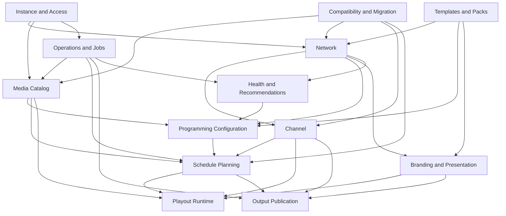

# ChannelForge Domain Model

- **Specification version:** 0.1
- **Status:** Draft
- **Last updated:** 2026-07-27

## Purpose

This document defines the conceptual domain model for ChannelForge.

It establishes:

- Aggregate boundaries
- Entity ownership
- Canonical identifiers
- Revision behavior
- Lifecycle states
- Cross-domain references
- Core invariants
- The separation between editorial planning and runtime playout

This is not a physical database schema. Table names, indexes, migration syntax,
and storage-specific constraints are defined in the persistence specification.

## Modeling Level

The model in this document is implementation-oriented but storage-neutral.

It is intended to guide:

- TypeScript domain types
- Application services
- Repository interfaces
- API resources
- Database design
- Scheduling-engine inputs and outputs
- Migration from inherited Tunarr records

A later implementation may combine closely related records into fewer SQLite
tables or split them for performance. Such changes must preserve the aggregate
boundaries and invariants defined here.

## Modeling Conventions

### Entity

An entity has a stable ChannelForge-owned identity and a lifecycle.

Examples include:

- Network
- Channel
- Catalog Item
- Schedule Plan
- Schedule Entry
- User
- Background Job

### Value Object

A value object is identified by its content rather than an independent identity.

Examples include:

- Time range
- Channel number
- Rule weight
- Metadata value with provenance
- Playback decision
- Schedule horizon
- Color and typography settings

Value objects should be immutable where practical.

### Aggregate

An aggregate is a consistency boundary.

An aggregate root:

- Owns changes to the entities and value objects inside the aggregate
- Enforces aggregate-level invariants
- Is loaded and saved through a repository boundary
- Is referenced by other aggregates through identifiers rather than mutable
  object graphs

A single user action may coordinate multiple aggregates through an application
service, but it must not bypass the rules of those aggregates.

### Snapshot

A snapshot is an immutable capture of data used to make a decision reproducible.

Examples include:

- Programming configuration snapshot
- Catalog eligibility snapshot
- Template application snapshot
- Approved schedule plan
- Health-calculation input snapshot

### Revision

A revision is an immutable version of mutable configuration.

Revisions allow ChannelForge to answer:

- Which configuration generated this schedule?
- Which network profile was active when this guide was published?
- Which rules were used when this recommendation was calculated?
- Has the user changed configuration since a draft was generated?

## Universal Identity Rules

### ChannelForge IDs

Every persistent entity owned by ChannelForge must have a ChannelForge-generated
identifier.

ChannelForge IDs must:

- Remain stable for the entity's lifetime
- Be independent of database row numbers
- Be independent of Plex, Jellyfin, or Emby identifiers
- Be safe to expose in API paths where authorization permits
- Be unique within the ChannelForge instance
- Survive export and import where identity preservation is explicitly supported

UUIDs or another collision-resistant opaque format are preferred.

The exact identifier format is an implementation decision, but domain code must
not assume identifiers are sequential integers.

### External IDs

Identifiers from media sources and metadata providers are stored as source
bindings or provenance references.

An external ID must always be qualified by:

- Provider or source type
- Configured source instance
- External entity type where necessary
- External identifier value

The same external identifier string may legally occur in more than one source
instance.

### Human-Readable Keys

Names, slugs, channel numbers, and call signs are not primary identifiers.

They may be mutable and may have uniqueness rules within a defined scope.

Examples:

- A channel number may be unique within an instance's active channel lineup.
- A network slug may be unique among non-archived networks.
- A template name may repeat across different publishers or imports.

## Universal Time Rules

All persisted instants must use UTC.

A network or channel may define an IANA time-zone identifier for editorial
interpretation.

The time zone is required when evaluating:

- Dayparts
- Calendar dates
- Weekdays
- Seasonal programming
- Holiday rules
- Schedule horizons presented to operators

Durations must be stored or calculated with sufficient precision to prevent
cumulative schedule drift.

Local wall-clock times must not be persisted without their time-zone context.

Daylight-saving transitions must be handled explicitly by the scheduling
specification.

## Universal Lifecycle Rules

Persistent records should use one of these lifecycle strategies:

1. **Immutable:** Created once and never edited.
2. **Revisioned:** Changes create a new immutable revision.
3. **Mutable with audit fields:** Operational state changes in place.
4. **Archived:** Removed from ordinary active use without destroying history.
5. **Ephemeral:** Runtime-only state that may be reconstructed.

Hard deletion is reserved for:

- Never-activated drafts where history is not required
- Temporary artifacts
- User-requested removal where retention policy permits it
- Records whose parent aggregate has never been referenced
- Explicit administrative cleanup

Historical schedule, playout, and migration records must not disappear merely
because current configuration is archived.

## Domain Overview



## Aggregate Summary

| Aggregate root | Owns | Primary purpose |
| --- | --- | --- |
| Instance | Instance settings and access policy references | Defines system-wide behavior |
| User | User identity and role assignments | Controls management access |
| Media Source | Source configuration and secret references | Connects to Plex, Jellyfin, or Emby |
| Catalog Item | Normalized metadata, source bindings, playback variants | Represents programmable media |
| Network | Editorial identity and network-level settings | Models a television network |
| Channel | Broadcast identity and output-facing configuration | Represents a tuneable channel |
| Programming Configuration Revision | Dayparts, blocks, rules, and policy settings | Defines how schedules are generated |
| Schedule Plan | Immutable schedule entries and generation evidence | Represents a generated lineup |
| Schedule Publication | Approved-plan and guide publication state | Controls what downstream systems consume |
| Branding Profile | Network and channel presentation configuration | Defines visual and on-air identity |
| Template | Reusable versioned configuration | Provides reusable network patterns |
| Programming Pack | Portable bundle and manifest | Moves templates and assets between instances |
| Playout Session | Active stream lifecycle and recovery events | Executes approved schedule state |
| Background Job | Job state and attempts | Tracks asynchronous operations |
| Health Snapshot | Metrics and recommendation evidence | Evaluates network quality |
| Migration Run | Imported identifiers and conversion results | Tracks inherited data migration |

## Instance and Access Domain

### Instance Aggregate

The Instance aggregate represents one ChannelForge installation.

#### Instance

Required conceptual fields:

- `instanceId`
- Display name
- Default time zone
- Initial setup state
- Application version
- Schema version
- Feature flags
- Default locale
- Default schedule horizon
- Default output settings reference
- Created timestamp
- Updated timestamp

The Instance aggregate does not contain plaintext integration credentials.

#### Instance Settings

Instance settings may include:

- Public base URL
- Trusted proxy policy
- Default stream behavior
- Default transcoding behavior
- Guide-generation defaults
- Retention policies
- Backup policy
- Logging level
- Experimental-feature flags

Settings that materially affect generated schedules or playout must be copied
into the relevant immutable snapshot or revision.

#### Instance Invariants

1. Exactly one active Instance aggregate exists per deployment.
2. The instance must have a valid default IANA time zone.
3. Setup cannot be marked complete without an administrative identity.
4. Secret values must be stored through a secret-storage boundary.
5. A schema downgrade must not occur implicitly.
6. Global defaults must not retroactively modify immutable plans.

### User Aggregate

#### User

Required conceptual fields:

- `userId`
- Login identity
- Display name
- Status
- Authentication-method reference
- Created timestamp
- Last successful authentication timestamp
- Archived timestamp, when applicable

Suggested user states:

- `INVITED`
- `ACTIVE`
- `SUSPENDED`
- `ARCHIVED`

#### Role Assignment

A role assignment associates a user with one or more permissions or named roles.

Initial roles:

- Administrator
- Operator
- Viewer
- API Client

The security specification may implement roles as fixed role names, permission
sets, or both.

#### API Credential

An API credential is owned by a user or service identity.

It includes:

- Credential ID
- Owner identity
- Credential label
- Hashed secret or secret reference
- Allowed scopes
- Created timestamp
- Expiration timestamp
- Last-used timestamp
- Revocation timestamp

The raw credential value is returned only at creation time.

#### User Invariants

1. At least one active administrator must remain after setup.
2. A suspended or archived user cannot create new authenticated sessions.
3. Credential scopes cannot exceed the owner's allowed permissions.
4. Revoked credentials cannot be reactivated by changing an expiration date.
5. User archival must preserve audit references.

## Media Source Domain

### Media Source Aggregate

A Media Source represents one configured Plex, Jellyfin, or Emby installation.

#### Media Source

Required conceptual fields:

- `mediaSourceId`
- Source type
- Display name
- Base URL
- Secret reference
- Connection status
- Enabled state
- Capability snapshot
- Last successful synchronization timestamp
- Last connection error
- Created timestamp
- Updated timestamp
- Archived timestamp

Suggested source types:

- `PLEX`
- `JELLYFIN`
- `EMBY`

Local-file support may be added later through the same adapter boundary.

#### Source Capability Snapshot

Capabilities may include:

- Supported library kinds
- Direct-stream support
- Transcode support
- Image endpoints
- Item version identifiers
- Search features
- Pagination behavior
- Server version
- Adapter version

Capabilities are observations, not permanent assumptions.

#### Library Binding

A library binding identifies which external libraries are eligible for import.

It includes:

- External library identifier
- Library kind
- Include or exclude state
- Synchronization policy
- Optional import filters

#### Media Source States

Suggested states:

- `UNVERIFIED`
- `AVAILABLE`
- `DEGRADED`
- `UNAVAILABLE`
- `AUTHENTICATION_FAILED`
- `DISABLED`
- `ARCHIVED`

#### Media Source Invariants

1. A source has exactly one source type.
2. External IDs are interpreted only in the context of their source instance.
3. A disabled source is not synchronized or selected for new playout.
4. Archiving a source does not delete historical source bindings.
5. Connection testing must not write catalog changes.
6. Synchronization must tolerate partial external responses.
7. Secret material must not appear in logs, API payloads, exports, or pack
   manifests.

## Media Catalog Domain

### Catalog Item Aggregate

A Catalog Item is ChannelForge's normalized representation of programmable media.

It is the primary aggregate root of the media catalog.

#### Catalog Item

Required conceptual fields:

- `catalogItemId`
- Media kind
- Canonical title
- Sort title
- Original title, when known
- Summary
- Release date or year
- Duration
- Content rating
- Genres
- Tags
- Series hierarchy references
- Normalized artwork references
- Availability state
- Created timestamp
- Updated timestamp
- Archived timestamp

Suggested media kinds:

- `MOVIE`
- `SERIES`
- `SEASON`
- `EPISODE`
- `SPECIAL`
- `MUSIC_VIDEO`
- `TRAILER`
- `BUMPER`
- `IDENT`
- `ADVERTISEMENT`
- `FILLER`
- `OTHER`

The exact supported kinds may be narrower in version 1.

#### Catalog Hierarchy

Series content uses ChannelForge-owned hierarchy references:

- Series owns or references seasons.
- Season references one series.
- Episode references one series and may reference one season.
- Specials may belong to a series without a conventional season.
- Movies do not require a parent hierarchy.

Hierarchy is normalized independently of any one media-source structure.

#### Source Binding

A Source Binding connects a Catalog Item to one item on one Media Source.

Required conceptual fields:

- `sourceBindingId`
- `catalogItemId`
- `mediaSourceId`
- External item identifier
- External item type
- External parent identifiers
- External version or update token
- Source path or key
- Availability state
- First-seen timestamp
- Last-seen timestamp
- Last-synchronized timestamp
- Missing-since timestamp
- Source metadata snapshot reference

A Catalog Item may have more than one Source Binding.

This supports:

- The same title on multiple media servers
- Multiple encodes
- Migration between sources
- Failover
- Source-specific availability tracking

#### Playback Variant

A Playback Variant represents one playable realization of a Catalog Item.

Required conceptual fields:

- `playbackVariantId`
- Owning Source Binding
- Container
- Video codec
- Audio codec or codecs
- Subtitle characteristics
- Width
- Height
- Frame rate
- Bit rate
- Duration
- HDR characteristics
- Interlace state
- Audio channels
- Direct-play eligibility observations
- Updated timestamp

A Playback Variant does not expose a permanent stream URL. Stream URLs are
resolved at playout time.

#### Metadata Value and Provenance

Normalized metadata must preserve provenance.

A metadata value conceptually contains:

- Field name
- Value
- Source type
- Source reference
- Confidence or precedence
- Observed timestamp
- User-override state

Precedence should normally be:

1. Explicit user override
2. ChannelForge-owned normalized decision
3. Preferred configured metadata provider
4. Media-source metadata
5. Derived metadata
6. Fallback or unknown value

Changing provider priority must not erase user overrides.

#### Catalog Availability

Suggested Catalog Item availability states:

- `AVAILABLE`
- `PARTIALLY_AVAILABLE`
- `UNAVAILABLE`
- `ARCHIVED`

A Catalog Item is available when at least one eligible Source Binding can provide
a usable Playback Variant under current policy.

#### Catalog Item Invariants

1. Every Catalog Item has a ChannelForge-owned identifier.
2. A Source Binding belongs to exactly one Catalog Item and one Media Source.
3. A source instance and external item ID pair cannot bind to multiple active
   Catalog Items without an explicit conflict record.
4. A Playback Variant belongs to exactly one Source Binding.
5. Permanent source URLs are not treated as stable catalog identity.
6. Synchronization does not erase user metadata overrides.
7. Missing source items are marked before historical records are removed.
8. Schedule history may continue to reference unavailable Catalog Items.
9. A Catalog Item must not become playable solely because metadata exists.
10. Media duration used for scheduling must have recorded provenance.

### Catalog Conflict

A Catalog Conflict records ambiguity requiring resolution.

Examples:

- One external item matches multiple Catalog Items.
- Two imported items appear to represent the same title.
- Duration differs materially between sources.
- Series hierarchy is inconsistent.
- A source reuses an external identifier for different content.

A conflict includes:

- Conflict ID
- Conflict type
- Related entity IDs
- Evidence
- Detection timestamp
- Resolution state
- Resolution decision
- Resolving user
- Resolution timestamp

Conflicts must not be silently resolved by destructive merging.

## Network Domain

### Network Aggregate

A Network represents the editorial identity of a virtual television network.

A Network is not itself a tuneable output endpoint. One or more Channels may
broadcast programming under the Network.

#### Network

Required conceptual fields:

- `networkId`
- Name
- Slug
- Status
- Primary time zone
- Network profile revision reference
- Programming configuration revision reference
- Branding profile revision reference
- Default catalog policy reference
- Created timestamp
- Updated timestamp
- Archived timestamp

Suggested network states:

- `DRAFT`
- `ACTIVE`
- `PAUSED`
- `ARCHIVED`

#### Network Profile Revision

The Network Profile describes the network's identity.

It may include:

- Display name
- Short name
- Description
- Call sign or brand code
- Editorial mission
- Target audience
- Content boundaries
- Default language
- Default content-rating policy
- Default scheduling characteristics
- Default guide-description policy

A Network Profile Revision is immutable after activation.

#### Editorial Profile

The Editorial Profile describes what belongs on the network.

It may include:

- Preferred genres
- Excluded genres
- Preferred eras
- Excluded eras
- Allowed media kinds
- Desired novelty
- Desired familiarity
- Franchise behavior
- Series-completion behavior
- Movie-to-episode balance
- Seasonal behavior
- Content-rating limits
- Original-programming labels
- Network-specific tags

Editorial Profile values guide programming. They do not directly start playout.

#### Audience Profile

The Audience Profile represents intended viewers rather than authenticated
ChannelForge users.

It may include:

- General audience description
- Age-band constraints
- Household suitability
- Language expectations
- Desired pacing
- Desired repeat tolerance
- Daypart-specific suitability

Audience Profile data must not become behavioral tracking of actual viewers
without a separate accepted privacy design.

#### Network Relationships

A Network:

- Has one active Network Profile Revision
- Has one active Programming Configuration Revision
- Has zero or one active Branding Profile Revision
- Owns one or more Channels when active
- Has many historical Schedule Plans through its Channels
- Has many Health Snapshots
- May originate from a Template Snapshot
- May reference shared presentation assets

#### Network Invariants

1. An active Network has at least one non-archived Channel.
2. An active Network has a valid time zone.
3. Network identity changes create or activate a new profile revision.
4. Archiving a Network does not delete its Channels, schedules, or playout
   history.
5. A Network cannot directly contain source-specific media IDs in programming
   rules.
6. Recommendations cannot modify a Network without an explicit accepted command.
7. A Template update cannot silently mutate an existing Network.
8. Network slugs are unique within the active instance scope.

## Channel Domain

### Channel Aggregate

A Channel represents a tuneable broadcast output.

A Channel belongs to exactly one Network in version 1.

#### Channel

Required conceptual fields:

- `channelId`
- `networkId`
- Display name
- Short name
- Channel number
- Call sign
- Status
- Time zone override, when needed
- Active schedule publication reference
- Output configuration reference
- Branding override reference
- Created timestamp
- Updated timestamp
- Archived timestamp

Suggested channel states:

- `DRAFT`
- `ACTIVE`
- `PAUSED`
- `MAINTENANCE`
- `ARCHIVED`

#### Channel Number

A Channel Number is a value object.

It may contain:

- Major number
- Optional minor number
- Canonical display string
- Sort representation

Examples:

- `7`
- `7.1`
- `102`
- `500.25`

Version 1 may limit accepted formats according to client compatibility.

#### Output Identity

Output identity includes values used by M3U, XMLTV, and HDHomeRun-compatible
adapters.

It includes:

- Canonical ChannelForge channel ID
- Guide channel ID
- Tuner lineup identifier
- Display number
- Display name
- Optional logo reference

Every output format must derive from the same Output Identity.

#### Channel Output Configuration

This configuration may include:

- Stream mode
- Transcode profile reference
- Fallback behavior
- Maximum concurrent sessions
- Guide publication state
- Tuner publication state
- Stream access policy
- Startup buffering policy

Output configuration changes do not rewrite approved schedule entries.

#### Channel Invariants

1. A Channel belongs to exactly one Network.
2. An active Channel belongs to an active or paused Network.
3. Active channel numbers are unique within the configured output scope.
4. Every published Channel has one canonical Output Identity.
5. Output adapters must not invent independent channel identifiers.
6. A Channel cannot reference an unapproved Schedule Plan as active output.
7. Pausing playout does not delete the active approved schedule.
8. Archiving a Channel preserves schedule and guide history.
9. Network-level configuration applies unless an explicit channel override
   exists.
10. Channel overrides must not mutate the underlying Network revision.

## Branding and Presentation Domain

### Branding Profile Aggregate

A Branding Profile defines persistent visual and on-air identity.

It may be attached to a Network and overridden by a Channel.

#### Branding Profile Revision

Required conceptual fields:

- `brandingProfileRevisionId`
- Owner type
- Owner ID
- Version number
- Logo asset reference
- Wordmark asset reference
- Color palette
- Typography settings
- Guide-image policy
- On-screen graphic policy
- Watermark policy
- Ident policy
- Bumper policy
- Created timestamp
- Created by
- Activation timestamp

Branding revisions are immutable after activation.

#### Presentation Asset

A Presentation Asset is a managed asset used during guide generation or playout.

Suggested asset kinds:

- Network logo
- Channel logo
- Wordmark
- Watermark
- Ident
- Bumper
- Interstitial
- Promo
- Rating card
- Technical-difficulty card
- Slate
- Filler clip
- Guide image

Required conceptual fields:

- `presentationAssetId`
- Asset kind
- Managed storage reference
- MIME type
- File size
- Media duration, where applicable
- Dimensions, where applicable
- Checksum
- Validation state
- Provenance
- Created timestamp
- Archived timestamp

#### Asset Assignment

An Asset Assignment determines where and when an asset is eligible.

It may include:

- Owner Network or Channel
- Asset reference
- Placement role
- Weight
- Valid date range
- Eligible dayparts
- Cooldown
- Priority
- Enabled state

#### Branding Invariants

1. Branding configuration never embeds arbitrary host filesystem paths in public
   API responses.
2. Uploaded assets are validated before activation.
3. An activated branding revision is immutable.
4. Deleting an unused asset must not break historical schedule or playout
   records.
5. Channel overrides are explicit and do not mutate the Network profile.
6. Presentation assets used in playout have verified media duration.
7. Exported packs exclude secret or host-specific paths.

## Programming Configuration Domain

### Programming Configuration Revision Aggregate

A Programming Configuration Revision is the complete editorial input used to
generate schedules for a Network or Channel.

It is immutable after activation or use in a Schedule Plan.

Required conceptual fields:

- `programmingConfigurationRevisionId`
- Owner Network ID
- Optional Channel ID
- Version number
- Status
- Effective time range
- Dayparts
- Programming blocks
- Rule sets
- Global repetition policy
- Global timing policy
- Filler policy
- Randomization policy
- Created timestamp
- Created by
- Activated timestamp
- Superseded timestamp

Suggested states:

- `DRAFT`
- `ACTIVE`
- `SUPERSEDED`
- `ARCHIVED`

### Daypart

A Daypart is a named recurring local-time interval.

Required conceptual fields:

- `daypartId`
- Name
- Days of week
- Start local time
- End local time
- Priority
- Time-zone interpretation
- Optional date-range restriction

Examples:

- Weekday Morning
- Prime Time
- Late Night
- Saturday Cartoons

Overlapping dayparts require deterministic precedence.

### Programming Block

A Programming Block defines a scheduling segment and its intent.

Required conceptual fields:

- `programmingBlockId`
- Name
- Eligible dayparts or explicit time windows
- Duration or boundary behavior
- Selector references
- Rule-set references
- Placement policy
- Repeat policy overrides
- Presentation policy
- Priority
- Enabled state

A block may describe:

- A recurring genre block
- A movie night
- A series marathon
- A weekday strip
- A seasonal event
- A filler window
- A special presentation

### Rule Set

A Rule Set groups rules for reuse and precedence.

Required conceptual fields:

- `ruleSetId`
- Name
- Scope
- Priority
- Evaluation mode
- Rules
- Enabled state

Suggested scopes:

- Network
- Channel
- Daypart
- Block
- Selector
- Schedule horizon

### Programming Rule

A Programming Rule describes one constraint, preference, or placement behavior.

Required conceptual fields:

- `ruleId`
- Rule type
- Classification
- Parameters
- Priority
- Weight, for soft constraints
- Enabled state
- Explanation template

Rule classifications:

- Hard constraint
- Soft constraint
- Placement rule
- Spacing rule
- Sequence rule
- Quota rule
- Timing rule
- Presentation rule

### Catalog Selector

A Catalog Selector identifies eligible Catalog Items through normalized
criteria.

Selector criteria may include:

- Media kind
- Genre
- Tag
- Series
- Franchise
- Release year
- Runtime range
- Content rating
- Source availability
- Language
- Custom collection
- User-maintained inclusion list
- User-maintained exclusion list

Selectors reference ChannelForge Catalog Item fields, not raw source queries.

### Constraint

A hard constraint determines eligibility.

Examples:

- Content rating must not exceed a limit.
- Item must be currently playable.
- Episode must belong to an allowed series.
- Item must fit within an unbreakable time window.
- Item must not have aired inside a minimum exclusion interval.

Failure to satisfy a hard constraint makes a candidate ineligible.

### Preference

A soft constraint contributes to a score rather than absolute eligibility.

Examples:

- Prefer items not aired recently.
- Prefer a target genre balance.
- Prefer chronological series progression.
- Prefer titles with unused promotional assets.
- Prefer a target runtime distribution.

Weights are meaningful only inside a documented scoring model.

### Placement Policy

A Placement Policy controls how selected items occupy time.

Examples:

- Start exactly at a block boundary.
- Fill until the next boundary.
- Allow overrun.
- Trim filler only.
- Insert bumpers between programs.
- Preserve episode order.
- Alternate media kinds.
- Place one movie followed by shorts.

### Programming Configuration Invariants

1. An activated revision is immutable.
2. A Schedule Plan records the exact revision used.
3. Rules reference normalized catalog concepts.
4. Hard and soft constraints are distinguishable in stored configuration.
5. Rule precedence is deterministic.
6. Overlapping Dayparts have deterministic resolution.
7. Invalid rules cannot be activated.
8. A disabled rule has no effect but remains available for audit and editing.
9. Editing a draft does not alter an active revision.
10. Channel overrides are applied as a documented overlay rather than mutating
    the Network revision.
11. Randomized behavior records its seed and algorithm version.
12. A rule must be able to produce a human-readable explanation.

## Schedule Planning Domain

### Schedule Plan Aggregate

A Schedule Plan is an immutable generated result for one Channel and planning
horizon.

Required conceptual fields:

- `schedulePlanId`
- `networkId`
- `channelId`
- Planning start instant
- Planning end instant
- Channel time zone
- Status
- Programming configuration revision ID
- Network profile revision ID
- Branding profile revision ID, when relevant
- Catalog snapshot reference or eligibility fingerprint
- Generator version
- Random seed
- Generation request ID
- Created timestamp
- Created by or triggering job
- Validation result
- Failure record, when applicable

Suggested plan states:

- `GENERATING`
- `GENERATED`
- `VALIDATED`
- `REJECTED`
- `APPROVED`
- `SUPERSEDED`
- `FAILED`

A failed generation may use a separate Generation Attempt record rather than a
persisted failed Schedule Plan. The implementation must preserve equivalent
diagnostic evidence.

### Schedule Entry

A Schedule Entry represents one planned interval.

Required conceptual fields:

- `scheduleEntryId`
- `schedulePlanId`
- Sequence number
- Start instant
- End instant
- Duration
- Entry kind
- Catalog Item ID, where applicable
- Preferred Playback Variant or Source Binding hint, when policy permits
- Programming Block ID
- Rule evidence
- Presentation instructions
- Continuity metadata
- Guide metadata snapshot
- Fallback classification

Suggested entry kinds:

- `PROGRAM`
- `BUMPER`
- `IDENT`
- `PROMO`
- `ADVERTISEMENT`
- `FILLER`
- `SLATE`
- `OFF_AIR`

A Schedule Entry references a Catalog Item when media-backed. It does not own the
Catalog Item.

### Rule Evidence

Rule Evidence explains why an entry was placed.

It may include:

- Candidate score
- Satisfied hard constraints
- Applied preferences
- Placement rule
- Relevant airing-history window
- Selector membership
- Tie-breaking information
- Random-seed contribution
- Rejected alternatives summary

Full candidate matrices may be retained only for diagnostics because they may be
large.

### Catalog Eligibility Snapshot

Reproducibility requires a record of the catalog state considered during
generation.

Version 1 may implement this as one of:

- Immutable list of eligible Catalog Item IDs and relevant versions
- Content-addressed snapshot
- Query fingerprint plus item revision map
- Generation input archive with bounded retention

The chosen method must allow ChannelForge to determine whether a later catalog
change makes a plan stale.

### Schedule Validation

Validation checks may include:

- Complete horizon coverage
- No unintended gaps
- No unintended overlaps
- Positive entry durations
- Valid Catalog Item references
- Required media availability
- Rule compliance
- Daypart compliance
- Guide-data completeness
- Output compatibility
- Boundary behavior
- Presentation-asset availability

Validation does not imply approval.

### Schedule Approval

Approval is an explicit application command.

Approval records:

- Plan ID
- Approving user or policy
- Approval timestamp
- Approval mode
- Validation result
- Optional note
- Replaced publication reference

Automatic approval is permitted only when configured and must still produce an
approval record.

### Schedule Plan Invariants

1. A Schedule Plan belongs to exactly one Channel.
2. The plan has a bounded, non-empty horizon.
3. Schedule Entry times are expressed as UTC instants.
4. Entries are ordered deterministically.
5. Entries do not overlap unless a documented overlay model explicitly permits
   it.
6. Required coverage gaps are represented explicitly.
7. Approved plans are immutable.
8. Approval requires successful validation.
9. A failed generation does not replace the active approved plan.
10. The plan records generator version and random seed.
11. The plan records the programming revision used.
12. Catalog changes do not mutate existing entries.
13. Guide text used by an approved plan is reproducible.
14. Playout recovery does not rewrite Schedule Entries.
15. Superseding a plan preserves its history.

## Schedule Publication Domain

### Schedule Publication Aggregate

Schedule Publication controls which approved plan downstream systems consume.

It separates immutable planning from mutable operational selection.

#### Schedule Publication

Required conceptual fields:

- `schedulePublicationId`
- `channelId`
- Approved Schedule Plan ID
- Publication state
- Effective start instant
- Effective end instant
- Published timestamp
- Published by
- Guide artifact reference
- Playlist artifact reference
- Publication revision
- Superseded publication ID
- Last successful regeneration timestamp
- Last publication error

Suggested states:

- `PENDING`
- `ACTIVE`
- `SUPERSEDED`
- `WITHDRAWN`
- `FAILED`

#### Published Artifact

A Published Artifact represents a generated consumable file or response
snapshot.

Suggested kinds:

- XMLTV
- M3U
- HDHomeRun lineup
- Guide JSON
- Static preview

Required conceptual fields:

- Artifact ID
- Artifact kind
- Publication ID
- Content checksum
- Generated timestamp
- Validity interval
- Managed storage reference, when materialized
- Generation version

#### Schedule Publication Invariants

1. Only an approved Schedule Plan can be published.
2. A Channel has at most one active publication for an instant.
3. Publication changes do not mutate the referenced plan.
4. A failed artifact generation does not delete the last valid artifact.
5. All output artifacts use the Channel's canonical Output Identity.
6. Publication history remains auditable.
7. Withdrawing a publication requires explicit fallback behavior.

## Playout Runtime Domain

### Playout Session Aggregate

A Playout Session represents active delivery of one Channel stream.

It is operational state, not editorial schedule state.

Required conceptual fields:

- `playoutSessionId`
- `channelId`
- Active publication ID
- Requested output profile
- Session state
- Start timestamp
- Last activity timestamp
- Viewer or client-session count
- Active Schedule Entry ID
- Active Playback Variant ID
- FFmpeg process reference
- Recovery state
- End timestamp
- End reason

Suggested states:

- `STARTING`
- `RUNNING`
- `RECOVERING`
- `STOPPING`
- `STOPPED`
- `FAILED`

### Playout Decision

A Playout Decision records how a Schedule Entry was resolved at runtime.

It includes:

- Schedule Entry ID
- Catalog Item ID
- Selected Source Binding
- Selected Playback Variant
- Resolution timestamp
- Direct play, remux, or transcode decision
- Applied output profile
- Fallback reason, when applicable

A Playout Decision may differ from a preferred source hint stored on the
Schedule Entry because current availability can change.

### Airing Record

An Airing Record captures what actually occurred.

Required conceptual fields:

- `airingRecordId`
- Channel ID
- Schedule Publication ID
- Schedule Entry ID
- Catalog Item ID, when applicable
- Planned start and end
- Actual start and end
- Outcome
- Selected Playback Variant
- Recovery actions
- Interruption duration
- Created timestamp

Suggested outcomes:

- `COMPLETED`
- `PARTIAL`
- `SKIPPED`
- `FAILED`
- `FALLBACK_PLAYED`
- `OFF_AIR`

Airing Records provide history for repetition rules and health calculations.

### Recovery Event

A Recovery Event records one operational response to failure.

Examples:

- Retry source
- Select alternate variant
- Select alternate source
- Insert filler
- Display error slate
- Advance to next entry
- Restart FFmpeg
- Terminate abandoned session

It includes:

- Event ID
- Playout Session ID
- Schedule Entry ID
- Failure classification
- Action
- Result
- Timestamp
- Diagnostic reference

### Playout Invariants

1. Playout reads an active Schedule Publication.
2. Playout does not change Programming Configuration.
3. Playout does not mutate approved Schedule Entries.
4. Runtime source selection is recorded.
5. FFmpeg process identity is not a domain identity.
6. Failed media resolution invokes configured recovery behavior.
7. Recovery actions are separate from editorial schedule history.
8. Airing Records distinguish planned time from actual time.
9. A stopped session cannot retain an active FFmpeg process.
10. Client disconnects do not necessarily stop a shared Channel stream.
11. Secret-bearing source URLs are not persisted in ordinary diagnostics.
12. Restart recovery must prevent duplicate unmanaged FFmpeg processes.

## Template Domain

### Template Aggregate

A Template is a reusable, versioned definition for creating or updating
ChannelForge configuration.

Suggested template kinds:

- Network template
- Programming template
- Branding template
- Daypart template
- Rule-set template
- Channel template

#### Template

Required conceptual fields:

- `templateId`
- Name
- Publisher identity
- Description
- Template kind
- Compatibility range
- Current version reference
- Provenance
- Trust state
- Created timestamp
- Archived timestamp

#### Template Version

A Template Version is immutable.

It includes:

- Template version ID
- Semantic version
- Schema version
- Configuration payload
- Required capabilities
- Optional asset references
- Changelog
- Content checksum
- Created timestamp

#### Applied Template Snapshot

When a Template is applied, ChannelForge creates an Applied Template Snapshot.

It records:

- Template ID and version
- Imported content checksum
- Application timestamp
- Applying user
- Target entity
- Resolved parameters
- Created entity and revision IDs
- User modifications made during application

Existing Networks operate from ChannelForge-owned revisions, not live links to
mutable Template definitions.

### Template Invariants

1. Template versions are immutable.
2. Applying a Template creates or updates ChannelForge-owned configuration
   through explicit commands.
3. Updating a Template does not silently mutate existing Networks.
4. Template application is validated before activation.
5. Template content cannot include secrets.
6. Template references to local assets are resolved into managed storage.
7. Applied snapshots preserve provenance.
8. Template compatibility is checked before application.

## Programming Pack Domain

### Programming Pack Aggregate

A Programming Pack is a portable bundle containing one or more templates,
metadata, and approved assets.

#### Pack Manifest

Required conceptual fields:

- Pack identifier
- Pack name
- Publisher
- Pack version
- Manifest schema version
- Minimum and maximum ChannelForge compatibility
- Included template descriptors
- Included asset descriptors
- Checksums
- Requested capabilities
- License information
- Attribution information
- Optional signature information

#### Pack Import Session

A Pack Import Session tracks staged validation.

Suggested states:

- `UPLOADED`
- `INSPECTING`
- `INVALID`
- `READY_FOR_REVIEW`
- `APPROVED`
- `IMPORTED`
- `REJECTED`
- `FAILED`

It includes:

- Import session ID
- Uploaded artifact reference
- Manifest snapshot
- Validation findings
- Proposed changes
- User decisions
- Import result
- Cleanup state

#### Programming Pack Invariants

1. Packs are untrusted input.
2. Archive paths are normalized and constrained.
3. Checksums are validated before activation.
4. A Pack cannot obtain process execution merely through import.
5. A Pack cannot receive arbitrary database, network, filesystem, or secret
   access.
6. Import is staged before application.
7. Existing configuration changes require explicit confirmation.
8. Imported assets move into ChannelForge-managed storage.
9. License and attribution data are preserved.
10. Import failure leaves active Networks unchanged.

## Operations Domain

### Background Job Aggregate

A Background Job represents asynchronous work requested by a user, schedule, or
system event.

Required conceptual fields:

- `backgroundJobId`
- Job type
- Requested by
- Related entity references
- Priority
- State
- Idempotency key, where applicable
- Created timestamp
- Scheduled timestamp
- Started timestamp
- Completed timestamp
- Progress
- Result summary
- Error classification
- Cancellation state

Suggested states:

- `QUEUED`
- `RUNNING`
- `SUCCEEDED`
- `FAILED`
- `CANCEL_REQUESTED`
- `CANCELLED`
- `ABANDONED`

Suggested job types:

- Media-source synchronization
- Metadata enrichment
- Schedule generation
- Schedule validation
- Guide publication
- Playlist publication
- Health calculation
- Backup
- Cleanup
- Pack import
- Migration

### Job Attempt

A Job Attempt records one execution of a Background Job.

It includes:

- Attempt ID
- Attempt number
- Worker identity
- Start timestamp
- Heartbeat timestamp
- End timestamp
- Outcome
- Error details
- Retry decision
- Diagnostic reference

### Job Invariants

1. A Job has one current state.
2. State transitions are monotonic except for documented retry behavior.
3. A process restart can identify abandoned running attempts.
4. Retrying creates a new Job Attempt.
5. Idempotent jobs do not duplicate committed effects.
6. Cancellation does not imply rollback of already committed work.
7. Errors are classified without exposing secrets.
8. Job progress is advisory and cannot exceed completed work.
9. Successful completion records the resulting entity or artifact references.
10. Schedule-generation failure cannot change the active publication.

## Health and Recommendation Domain

### Health Snapshot Aggregate

A Health Snapshot is an immutable evaluation of one Network or Channel at a
point in time.

Required conceptual fields:

- `healthSnapshotId`
- Target type
- Target ID
- Evaluation timestamp
- Evaluation horizon
- Input revision references
- Metric values
- Findings
- Overall classification
- Evaluator version

Potential metrics include:

- Schedule coverage
- Catalog depth
- Unique program count
- Repeat frequency
- Genre balance
- Daypart compliance
- Unavailable media exposure
- Filler percentage
- Guide completeness
- Playout failure rate
- Source concentration
- Runtime variance
- Stale schedule risk

### Health Finding

A Health Finding contains:

- Finding ID
- Metric or rule
- Severity
- Summary
- Evidence
- Affected time range
- Related entity IDs
- Remediation category

Suggested severities:

- `INFO`
- `NOTICE`
- `WARNING`
- `CRITICAL`

### Recommendation

A Recommendation is an explainable proposed action derived from evidence.

Required conceptual fields:

- `recommendationId`
- Health Snapshot ID
- Target entity
- Recommendation type
- Summary
- Explanation
- Evidence references
- Proposed changes
- Confidence
- State
- Created timestamp
- Reviewed timestamp
- Reviewing user
- Decision note

Suggested states:

- `OPEN`
- `ACCEPTED`
- `DISMISSED`
- `APPLIED`
- `EXPIRED`
- `SUPERSEDED`

Accepting a Recommendation authorizes an application command. It does not mean
the Recommendation directly edits data.

### Health Invariants

1. Health Snapshots are immutable.
2. Metrics record their evaluator version.
3. Recommendations cite evidence.
4. Recommendations do not silently modify active configuration.
5. Applying a Recommendation creates ordinary revisions and audit records.
6. Dismissal does not erase the original finding.
7. Stale recommendations are marked when referenced revisions change.
8. Health calculations distinguish planned schedules from actual Airing Records.
9. Missing metrics are not represented as zero unless zero is semantically valid.
10. Severity is derived through documented thresholds.

## Compatibility and Migration Domain

### Migration Run Aggregate

A Migration Run tracks conversion from inherited Tunarr state or an older
ChannelForge schema.

Required conceptual fields:

- `migrationRunId`
- Migration type
- Source version
- Target version
- State
- Started timestamp
- Completed timestamp
- Input backup reference
- Converted entity counts
- Warning count
- Error count
- Verification result
- Rollback information

Suggested states:

- `PLANNED`
- `BACKING_UP`
- `CONVERTING`
- `VERIFYING`
- `SUCCEEDED`
- `SUCCEEDED_WITH_WARNINGS`
- `FAILED`
- `ROLLED_BACK`

### Legacy Identifier Mapping

A Legacy Identifier Mapping associates an inherited identifier with a
ChannelForge entity.

It includes:

- Mapping ID
- Legacy system
- Legacy entity type
- Legacy identifier
- ChannelForge entity type
- ChannelForge identifier
- Migration Run ID
- Created timestamp

Mappings are migration aids and must not become canonical application identity.

### Compatibility Record

A Compatibility Record documents a retained inherited behavior.

It may include:

- Compatibility record ID
- Feature or route
- Inherited behavior
- ChannelForge target behavior
- Current status
- Removal condition
- Related ADR
- Introduced version
- Removed version

### Migration Invariants

1. Migration begins with a recoverable backup.
2. Legacy identifiers do not replace ChannelForge identifiers.
3. A failed migration does not leave an apparently successful schema version.
4. Migration warnings remain inspectable.
5. Verification occurs before old state is discarded.
6. Re-running an idempotent migration does not duplicate entities.
7. Compatibility behavior is explicitly tracked.
8. Historical schedule relationships are preserved where source data permits.
9. Secrets are migrated through the secret-storage boundary.
10. Migration logs redact credential values.

## Revision Model

### Revision Ownership

Revisioned configuration includes:

- Network Profile
- Programming Configuration
- Branding Profile
- Channel output settings when changes affect reproducibility
- Instance defaults when copied into generated results

Each revision has:

- Revision ID
- Owner entity ID
- Version number
- Parent revision ID, when applicable
- Created timestamp
- Created by
- Change summary
- Content checksum
- State
- Activation timestamp
- Superseded timestamp

### Revision States

Suggested states:

- `DRAFT`
- `ACTIVE`
- `SUPERSEDED`
- `ARCHIVED`

### Revision Rules

1. Active revisions are immutable.
2. Editing begins from a copy into a Draft revision.
3. Activating a Draft does not alter the previous revision.
4. A Schedule Plan references revisions by immutable ID.
5. Deleting a Draft is allowed only when nothing references it.
6. Superseded revisions remain available for history and reproducibility.
7. Checksums are calculated from canonicalized revision content.
8. Concurrent edits use optimistic concurrency or an equivalent conflict check.

## Audit Model

### Audit Record

Security-sensitive and configuration-changing commands produce an Audit Record.

It includes:

- Audit record ID
- Actor identity
- Command type
- Target entity
- Timestamp
- Request correlation ID
- Before revision or state reference
- After revision or state reference
- Outcome
- Optional user note
- Redacted metadata

Audit records should cover:

- User and role changes
- Media-source changes
- Secret replacement
- Network activation or archival
- Channel publication changes
- Schedule approval
- Recommendation application
- Template or Pack import
- Migration execution
- Backup and restore
- Security-setting changes

Audit records do not store plaintext secrets.

## Domain Events

Domain Events describe committed facts that other modules may react to.

Potential events include:

- `MediaSourceConfigured`
- `MediaSourceSynchronizationCompleted`
- `CatalogItemAvailabilityChanged`
- `NetworkActivated`
- `ProgrammingConfigurationActivated`
- `SchedulePlanGenerated`
- `SchedulePlanApproved`
- `SchedulePublicationActivated`
- `GuideArtifactPublished`
- `PlayoutSessionStarted`
- `AiringCompleted`
- `HealthSnapshotCalculated`
- `RecommendationAccepted`
- `PackImported`
- `MigrationCompleted`

Version 1 may dispatch events in process.

Domain Event design must still support:

- Stable event names
- Event versioning
- Correlation IDs
- Causation IDs
- Idempotent handlers
- Transactional consistency appropriate to SQLite

Events are not a substitute for the source-of-truth aggregates.

## Cross-Aggregate Reference Rules

1. Aggregates reference other aggregates through IDs.
2. Domain services may load multiple aggregates through repositories.
3. Schedule Entries reference Catalog Items but do not embed mutable Catalog
   Item objects.
4. Channels reference active publication IDs rather than embedding entire plans.
5. Networks reference active revision IDs.
6. Jobs reference their targets without owning them.
7. Health Snapshots reference immutable input revisions.
8. Templates create snapshots rather than live mutable links.
9. Migration mappings are consulted only by compatibility and migration layers.
10. External source identifiers never serve as cross-aggregate primary keys.

## Transaction Boundaries

A transaction should normally contain one application command and its directly
required aggregate changes.

Examples of valid transaction boundaries:

- Create a Network and its initial Draft revisions.
- Activate a Programming Configuration Revision.
- Approve a Schedule Plan and create its approval record.
- Activate a Schedule Publication pointer.
- Commit a synchronized batch of Catalog Items and Source Bindings.
- Accept a Recommendation and create the resulting Draft revision.
- Complete a Pack import and create imported Template records.

Long-running work must not hold a SQLite write transaction while:

- Calling media servers
- Running FFmpeg
- Downloading metadata
- Generating large schedules
- Extracting archives
- Waiting for user review

Long-running workflows use staged records and short commit transactions.

## Concurrency Rules

Version 1 runs as a modular monolith but must defend against overlapping
requests and jobs.

Required protections include:

- Optimistic revision checks for configuration editing
- Idempotency for retried commands
- Per-source synchronization exclusion or coordination
- Per-channel publication coordination
- Per-channel playout-session coordination
- Job heartbeat and abandonment detection
- Atomic active-revision pointer changes
- Atomic active-publication pointer changes
- Database busy handling appropriate to SQLite

A global process lock must not be the only correctness mechanism.

## Archival and Deletion Rules

### Archive

Archiving removes an entity from ordinary active use while preserving history.

Archive is the default removal operation for:

- Networks
- Channels
- Media Sources
- Users
- Templates
- Presentation Assets with historical references
- Catalog Items with schedule or airing history

### Delete

Deletion may be allowed for:

- Unused Draft revisions
- Failed temporary uploads
- Unapplied Pack Import Sessions after retention
- Unreferenced managed assets
- Test data
- Expired generated artifacts after retention
- Catalog conflicts resolved as duplicates, after safe merge rules

### Referential Preservation

An archived or deleted parent must not create broken historical references.

Where full retention is unnecessary, ChannelForge may preserve a tombstone with:

- Entity ID
- Entity type
- Display label
- Deleted timestamp
- Deletion reason

## Derived Data

Derived data may be recalculated from authoritative records.

Examples:

- Search indexes
- Cached guide responses
- Channel-health summaries
- Catalog statistics
- Schedule preview summaries
- Output artifact caches
- Dashboard counts

Derived data must be identifiable as derived and must not become the only copy of
authoritative state.

## Sensitive Data Classification

### Secrets

Examples:

- Plex tokens
- Jellyfin API keys
- Emby API keys
- API credential secrets
- Session signing keys
- Encryption keys

Secrets are stored through the secret-storage boundary.

### Restricted Operational Data

Examples:

- Internal source URLs
- Host paths
- FFmpeg command diagnostics
- User authentication metadata
- Private network topology details

Restricted operational data requires administrative permission or redaction.

### Ordinary Configuration Data

Examples:

- Network names
- Channel numbers
- Dayparts
- Programming rules
- Branding selections
- Schedule entries

Ordinary configuration may still require authentication depending on instance
policy.

## Minimum Version 1 Aggregate Set

The first production-capable ChannelForge release requires these aggregate roots:

- Instance
- User
- Media Source
- Catalog Item
- Network
- Channel
- Programming Configuration Revision
- Schedule Plan
- Schedule Publication
- Branding Profile Revision
- Presentation Asset
- Playout Session
- Background Job
- Health Snapshot
- Recommendation
- Migration Run

Templates and Programming Packs may be implemented after the core scheduling and
playout path, but their boundaries must not be collapsed into Network records.

## Required End-to-End Relationships

The minimum successful programming path is:

```text
Media Source
  -> Source Binding
  -> Catalog Item
  -> Programming Configuration Revision
  -> Schedule Plan
  -> Schedule Entry
  -> Schedule Approval
  -> Schedule Publication
  -> Playout Decision
  -> Airing Record
```

The minimum network identity path is:

```text
Network
  -> Network Profile Revision
  -> Channel
  -> Output Identity
  -> Published Guide and Stream
```

The minimum operational path is:

```text
Background Job
  -> Job Attempt
  -> Resulting Aggregate or Published Artifact
```

## Core Domain Invariants

1. ChannelForge owns the canonical identity of every domain entity.
2. External media IDs are always qualified source bindings.
3. A Network and a Channel are distinct entities.
4. A Channel belongs to one Network in version 1.
5. Programming configuration is revisioned.
6. Activated revisions are immutable.
7. Schedule generation is deterministic for recorded inputs, seed, and generator
   version.
8. A Schedule Plan is separate from active Schedule Publication.
9. Only approved plans may be published.
10. Failed generation cannot replace active output.
11. Approved Schedule Plans are immutable.
12. Playout consumes schedule state but does not rewrite editorial policy.
13. Runtime recovery does not mutate Schedule Entries.
14. Actual Airing Records remain distinct from planned entries.
15. Catalog synchronization preserves user overrides and historical references.
16. Output adapters share one canonical Channel identity.
17. Imported community content is validated before activation.
18. Template updates do not silently alter existing Networks.
19. Recommendations require explicit acceptance before changes are applied.
20. Secrets never appear in ordinary exported configuration.
21. Long-running external work does not hold open database transactions.
22. Historical references survive archival.
23. Migration mappings never become canonical identity.
24. Derived caches are replaceable.
25. Every material configuration or publication change is attributable to an
    actor or system policy.

## Deferred Domain Decisions

The following decisions remain open:

- Whether a Channel may belong to multiple Networks in a future release
- Whether Catalog Item deduplication is automatic, assisted, or manual by default
- Exact Catalog Item hierarchy implementation
- Exact rule-type registry
- Exact scoring representation for soft constraints
- Exact schedule-plan catalog snapshot format
- Whether guide metadata is fully embedded per entry or content-addressed
- Whether Playout Sessions are persisted continuously or summarized at end
- Exact retention period for Airing Records
- Exact secret-storage implementation
- Exact role and permission model
- Exact authentication entities
- Exact community publisher identity model
- Exact Pack signature and trust model
- Exact tombstone requirements
- Exact event persistence model
- PostgreSQL-specific concurrency behavior after version 1
- Multi-node ownership and lease entities
