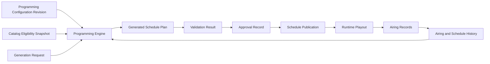

# ChannelForge Scheduling Specification

- **Specification version:** 0.1
- **Status:** Draft
- **Last updated:** 2026-07-27

## Purpose

This document defines how ChannelForge converts network programming intent and
catalog availability into deterministic schedule plans.

It specifies:

- Scheduling inputs
- Planning horizons
- Time-zone interpretation
- Daypart resolution
- Programming blocks
- Candidate selection
- Hard constraints
- Soft constraints and scoring
- Repetition controls
- Series progression
- Placement and boundary behavior
- Filler and presentation assets
- Deterministic randomization
- Validation
- Approval and publication
- Regeneration
- Failure behavior
- Observability
- Performance expectations
- Testing requirements

This document governs schedule planning. Runtime source selection, FFmpeg
execution, client stream handling, and recovery during playback are defined in
the playout specification.

## Scheduling Mission

ChannelForge schedules television networks, not unordered playlists.

A valid schedule must express a coherent editorial identity over time.

The scheduler must therefore consider more than whether media can fit into an
empty interval. It must account for:

- Network identity
- Audience expectations
- Daypart suitability
- Program sequencing
- Repetition tolerance
- Catalog depth
- Program duration
- Series continuity
- Seasonal intent
- Presentation assets
- Guide quality
- Operational availability

The result must be understandable, reproducible, reviewable, and safe to publish.

## Scope

This specification covers generation of Schedule Plans for one Channel.

Network-level planning may coordinate multiple Channels through an application
service, but each resulting Schedule Plan remains associated with one Channel.

Version 1 supports:

- Linear continuous schedules
- Local-time editorial rules
- Repeating dayparts
- Recurring programming blocks
- Catalog selectors
- Hard and soft constraints
- Series-order policies
- Cooldowns
- Quotas and balance targets
- Deterministic weighted selection
- Fixed and flexible boundaries
- Filler and presentation insertion
- Draft generation
- Validation
- Manual or policy-based approval
- Partial or full regeneration

Version 1 does not require:

- Real-time audience optimization
- Advertising-auction systems
- Distributed multi-node planning
- Machine-learned recommendation models
- Live-event rights management
- Frame-accurate broadcast automation
- Dynamic schedules that mutate for each viewer
- Automatic media acquisition

## Core Separation

ChannelForge separates:

1. **Programming configuration**
2. **Schedule generation**
3. **Schedule approval**
4. **Schedule publication**
5. **Runtime playout**
6. **Actual airing history**

These stages must not collapse into one mutable playlist.



## Scheduling Terms

### Planning Horizon

The Planning Horizon is the half-open interval:

```text
[startInstant, endInstant)
```

A Schedule Plan covers one Planning Horizon for one Channel.

The start is inclusive. The end is exclusive.

### Schedule Cursor

The Schedule Cursor is the next UTC instant the generator must fill.

The cursor advances only when an entry is committed to the draft plan.

### Candidate

A Candidate is a Catalog Item or presentation asset considered for placement at
the current cursor.

### Eligible Candidate

An Eligible Candidate satisfies every applicable hard constraint.

### Candidate Score

A Candidate Score is the deterministic numeric result of applicable soft
constraints, preferences, quotas, and tie-breaking inputs.

### Placement

Placement converts a selected Candidate into one or more Schedule Entries with
specific start and end instants.

### Coverage

Coverage is the percentage or interval set within the Planning Horizon occupied
by explicit Schedule Entries.

### Gap

A Gap is an uncovered interval in a plan that requires continuous coverage.

### Overrun

An Overrun occurs when an entry extends beyond an intended soft boundary.

### Boundary

A Boundary is an editorial or technical instant that may affect placement.

Examples:

- Start or end of a daypart
- Start or end of a block
- Top of hour
- Half hour
- Planning-horizon end
- Fixed special-event start
- Publication handoff point

### Schedule History

Schedule History contains prior approved or generated Schedule Entries used for
repeat, sequence, and balance evaluation.

### Airing History

Airing History contains actual Airing Records.

Scheduling policy must define whether a rule evaluates planned history, actual
history, or both.

## Scheduling Inputs

A generation request must resolve a complete immutable input set.

### Required Inputs

- Channel ID
- Network ID
- Planning start instant
- Planning end instant
- Channel editorial time zone
- Programming Configuration Revision ID
- Network Profile Revision ID
- Channel override revision, when applicable
- Catalog eligibility snapshot or fingerprint
- Relevant prior Schedule Plans
- Relevant Airing Records
- Generator version
- Rule implementation versions
- Random seed
- Generation mode
- Requesting actor or policy
- Requested approval behavior

### Optional Inputs

- Existing Schedule Plan to preserve or extend
- Locked Schedule Entries
- Fixed events
- Manual placements
- Seasonal calendar
- Holiday calendar
- Imported schedule segments
- Previous failed-generation diagnostics
- Maximum runtime budget
- Maximum candidate-evaluation budget
- Preview-only flag

### Input Snapshot Requirement

All inputs capable of changing generation results must be represented by an
immutable identifier, version, snapshot, or content checksum.

The generator must not read mutable configuration repeatedly during one
generation.

The generator may load data in pages for performance, but all pages must be
consistent with the same input snapshot.

## Generation Request

A Generation Request is the application command that starts planning.

Required conceptual fields:

- `generationRequestId`
- Channel ID
- Horizon start
- Horizon end
- Generation mode
- Configuration revision IDs
- Existing plan reference, when applicable
- Locked interval references
- Random seed
- Requested by
- Requested timestamp
- Approval policy
- Diagnostic verbosity
- Runtime budget
- Candidate-evaluation budget
- Idempotency key, when applicable

Suggested generation modes:

- `FULL`
- `EXTEND`
- `REGENERATE_RANGE`
- `REPAIR_GAPS`
- `PREVIEW`
- `SIMULATE`

## Generation Modes

### Full Generation

Full generation creates a new plan for the entire requested horizon.

It does not mutate an existing approved plan.

### Extend

Extend preserves an existing approved or generated prefix and adds entries after
its end.

The extension must verify that:

- The existing plan belongs to the same Channel.
- The input revisions are compatible with extension policy.
- The extension begins exactly at or after the preserved plan boundary.
- Relevant historical context includes the preserved plan tail.

### Regenerate Range

Regenerate Range replaces a specified interval in a new draft derived from an
existing plan.

Entries outside the regeneration interval are copied as immutable references or
equivalent snapshots.

The new draft receives a new Schedule Plan ID.

### Repair Gaps

Repair Gaps fills uncovered intervals while preserving surrounding entries.

Repair must respect:

- Locked entries
- Existing approved boundaries
- Repeat history
- Minimum filler duration
- Neighboring continuity constraints

### Preview

Preview generates a complete draft and validation result without making it
eligible for publication.

### Simulate

Simulate evaluates scheduling behavior and metrics without requiring all
publication or playout constraints.

Simulation results must be clearly identified and cannot be approved directly
unless converted through a normal validated generation flow.

## Time Model

### UTC Storage

Every Schedule Entry start and end is stored as a UTC instant.

### Editorial Time Zone

Dayparts, weekdays, local dates, holidays, and seasonal rules are evaluated in
the Channel's editorial IANA time zone.

A Channel may inherit the Network time zone or specify an explicit override.

### Local-Time Conversion

For each scheduling decision, ChannelForge may derive:

- Local date
- Local weekday
- Local wall-clock time
- UTC offset
- Daylight-saving status
- Applicable holiday
- Applicable season
- Daypart membership

These values are derived from the cursor instant and the recorded IANA time-zone
identifier.

### Daylight-Saving Spring Transition

When a local wall-clock interval does not exist because clocks move forward:

- The nonexistent interval contributes no schedulable elapsed duration.
- A block defined entirely inside the nonexistent interval is skipped unless its
  policy explicitly relocates it.
- Fixed local starts inside the nonexistent interval require a declared
  resolution policy.
- The default resolution policy moves the start to the first valid instant after
  the transition and records a warning.

### Daylight-Saving Fall Transition

When a local wall-clock interval occurs twice because clocks move backward:

- Each occurrence is a distinct UTC interval.
- Daypart evaluation applies to both occurrences unless configured otherwise.
- Fixed local starts require a fold policy.

Suggested fold policies:

- `FIRST_OCCURRENCE`
- `SECOND_OCCURRENCE`
- `BOTH`
- `REJECT_AMBIGUOUS`

The default for recurring blocks is `BOTH`.

The default for fixed events is `FIRST_OCCURRENCE` with a validation warning
unless explicitly configured.

### Time-Zone Changes

Changing a Channel's editorial time zone creates or activates a new relevant
configuration revision.

Existing approved plans retain their original time-zone context.

### Duration Precision

Scheduling calculations must use integer milliseconds or a finer integer unit.

Floating-point accumulation must not determine Schedule Entry boundaries.

Media durations imported from sources must be normalized to the scheduling
precision before generation.

## Planning Horizon Rules

### Horizon Bounds

The horizon must:

- Have a start earlier than its end
- Respect configured minimum and maximum duration
- Fit within supported timestamp ranges
- Not exceed configured generation limits
- Align with regeneration rules when preserving existing entries

### Recommended Defaults

A practical initial default is a rolling horizon of several days to two weeks.

The exact default is an instance setting.

Long horizons increase:

- Generation time
- Snapshot size
- Staleness risk
- Review burden
- Repetition-history complexity

### Horizon End Behavior

The last entry may:

- End exactly at the horizon
- Extend beyond the horizon when the selected boundary policy permits overrun
- Be trimmed only when the media kind and policy permit trimming
- Be replaced with filler to achieve exact coverage

The Schedule Plan records both:

- Requested horizon
- Actual covered interval

## Scheduling Pipeline

The canonical generation pipeline is:

```text
1. Validate request
2. Resolve immutable inputs
3. Build temporal context
4. Resolve active daypart and block stack
5. Build candidate set
6. Apply hard constraints
7. Calculate soft scores
8. Apply deterministic tie-breaking
9. Select candidate
10. Place candidate
11. Insert required presentation entries
12. Update working history and quota state
13. Advance cursor
14. Repeat until completion or terminal failure
15. Validate complete plan
16. Persist plan and diagnostics
```

## Generator State

The generator maintains mutable in-memory Working State while producing an
immutable result.

Working State may include:

- Current cursor
- Draft entries
- Active temporal context
- Recent planned-airing index
- Recent actual-airing index
- Series progression state
- Quota counters
- Runtime totals
- Genre totals
- Media-kind totals
- Block coverage
- Candidate exclusion reasons
- Random-number generator state
- Warnings
- Performance counters
- Backtracking checkpoints

Working State is not authoritative until the resulting plan is persisted.

## Temporal Context

At each cursor instant, the generator resolves Temporal Context.

Temporal Context contains:

- UTC instant
- Local instant
- Local date
- Weekday
- Time-zone offset
- Daylight-saving fold
- Active holiday or seasonal labels
- Applicable dayparts
- Applicable programming blocks
- Upcoming hard and soft boundaries
- Active fixed events
- Active manual locks
- Applicable network and channel overrides

Temporal Context must be reproducible from recorded inputs.

## Dayparts

### Daypart Definition

A Daypart includes:

- Daypart ID
- Name
- Applicable weekdays
- Local start time
- Local end time
- Priority
- Effective date range
- Optional holiday or season filters
- Optional channel scope
- Time-zone interpretation
- Enabled state

### Daypart Duration

A Daypart may:

- Begin and end on the same local date
- Cross local midnight
- Cover an entire day
- Apply only on selected weekdays
- Apply only during an effective date range

### Cross-Midnight Dayparts

A daypart with an end time earlier than its start time crosses midnight.

Example:

```text
Late Night: 22:00 through 03:00
```

The weekday association policy must be explicit.

The default association is the local date on which the Daypart starts.

Thus Friday Late Night may extend into early Saturday while retaining Friday's
editorial identity.

### Overlapping Dayparts

Overlapping Dayparts are permitted only with deterministic resolution.

Resolution order:

1. Explicit fixed-event context
2. Higher Daypart priority
3. More specific applicability
4. Narrower duration
5. Stable Daypart ID ordering

A configuration that leaves unresolved equal-precedence conflicts cannot be
activated.

### Daypart Stack

More than one Daypart may contribute rules when configured as composable.

Each Daypart declares a combination mode:

- `EXCLUSIVE`
- `OVERLAY`

An Exclusive Daypart selects one primary context.

Overlay Dayparts add rules without replacing the primary Daypart.

### Default Daypart

Every active Channel must have a fallback programming context for instants not
covered by explicit Dayparts.

This may be:

- A default Daypart
- A default Programming Block
- A network-wide fallback selector
- An explicit off-air policy

## Programming Blocks

### Block Definition

A Programming Block defines an editorial segment.

It includes:

- Block ID
- Name
- Priority
- Recurrence or explicit interval
- Applicable Dayparts
- Selector set
- Rule sets
- Placement policy
- Boundary policy
- Repeat overrides
- Presentation policy
- Quota targets
- Enabled state

### Block Types

Suggested block types:

- `RECURRING`
- `FIXED_EVENT`
- `MARATHON`
- `STRIP`
- `MOVIE_WINDOW`
- `SEASONAL`
- `FILLER`
- `OFF_AIR`
- `IMPORTED`
- `MANUAL`

### Block Activation

A block becomes active when:

- Its recurrence or explicit interval contains the cursor.
- Its effective date range applies.
- Its Daypart requirements are satisfied.
- Its holiday or season filters are satisfied.
- Its Channel scope applies.
- It is enabled.

### Block Precedence

Block precedence is deterministic.

Recommended order:

1. Locked manual placement
2. Fixed event
3. Imported protected segment
4. Higher explicit priority
5. More specific Channel scope
6. More specific calendar applicability
7. Narrower interval
8. Stable Block ID ordering

### Block Combination Modes

A block declares how it combines with lower-precedence context:

- `REPLACE`
- `OVERLAY_RULES`
- `OVERLAY_PRESENTATION`
- `FALLBACK_ONLY`

### Block Boundaries

A block may have:

- Hard start
- Soft start
- Hard end
- Soft end
- No explicit boundary
- Fixed target duration
- Fill-until-next-boundary behavior

Hard boundaries must not be crossed by ordinary program entries.

Soft boundaries may permit overrun according to policy.

## Fixed Events

A Fixed Event reserves a specific interval or start instant.

Examples:

- Scheduled movie premiere
- Holiday special
- Weekly live-style program
- Imported event
- Operator-locked program

A Fixed Event includes:

- Event ID
- Channel ID
- Start specification
- Optional end specification
- Catalog Item or selector
- Placement policy
- Conflict policy
- Lock state
- Guide metadata override
- Presentation policy

### Fixed Event Conflict Policies

Suggested policies:

- `FAIL_GENERATION`
- `REPLACE_LOWER_PRIORITY`
- `SHIFT_WITHIN_TOLERANCE`
- `SKIP_EVENT`
- `TRUNCATE_FILLER_ONLY`

The default is `FAIL_GENERATION` for equal or higher-priority conflicts.

### Fixed Event Lead-In

The generator must consider upcoming fixed starts when placing earlier content.

It may:

- Select content that ends before the event
- Insert filler
- Use a breakable program only when allowed
- Permit configured soft overrun
- Fail if no valid bridge exists

## Manual and Locked Entries

An operator may lock a Schedule Entry or interval.

Locked content is treated as immutable input during regeneration.

A lock includes:

- Entry or interval ID
- Lock scope
- Lock reason
- Locked by
- Locked timestamp
- Optional expiration

Suggested lock scopes:

- `ENTRY`
- `TIME_RANGE`
- `BLOCK`
- `PROGRAM_SEQUENCE`

The generator must validate locked entries even though it cannot replace them.

A locked invalid entry causes a warning or failure according to generation mode
and policy.

## Candidate Construction

### Candidate Sources

Candidate sets are created from:

- Catalog Selectors
- Explicit Catalog Item lists
- Series progression queues
- Collections
- Presentation Asset assignments
- Filler policies
- Manual recommendations
- Imported program pools

### Selector Evaluation

Selectors operate on normalized ChannelForge catalog fields.

A selector may filter by:

- Media kind
- Series
- Season
- Franchise
- Genre
- Tag
- Release year
- Runtime
- Content rating
- Language
- Source availability
- Artwork availability
- Custom collection membership
- User inclusion list
- User exclusion list
- Derived programming labels

### Candidate Deduplication

A Catalog Item appearing through multiple selectors is one Candidate unless the
programming model intentionally represents separate weighted memberships.

When multiple selector memberships apply, the Candidate records all memberships
for scoring and explanation.

### Candidate Availability

A Candidate may be included only when availability policy is satisfied.

Policies may require:

- At least one currently available Source Binding
- At least one validated Playback Variant
- A minimum remaining source confidence
- A preferred source
- Any source
- A locally cached or prevalidated source

The scheduler does not resolve final stream URLs.

### Candidate Duration

The scheduler uses normalized scheduling duration.

Duration precedence:

1. Explicit user scheduling override
2. Verified derived duration
3. Preferred Playback Variant duration
4. Source-reported duration
5. Catalog normalized duration

A Candidate without usable duration is ineligible unless its media kind has a
defined synthetic duration.

## Hard Constraints

Hard constraints determine eligibility.

A Candidate failing any applicable hard constraint is excluded.

### Hard Constraint Requirements

Every hard constraint implementation must provide:

- Stable rule type
- Rule version
- Deterministic evaluation
- Input parameters
- Boolean result
- Human-readable exclusion reason
- Relevant evidence
- Cost classification for optimization

### Common Hard Constraints

#### Media Kind

Candidate media kind must be allowed.

#### Catalog Membership

Candidate must belong to the required selector, collection, series, franchise,
or explicit list.

#### Availability

Candidate must satisfy current availability policy.

#### Content Rating

Candidate must not exceed configured audience or Daypart limits.

#### Genre Exclusion

Candidate must not contain excluded genres or tags.

#### Runtime Fit

Candidate must fit inside a hard boundary after required presentation assets are
included.

#### Minimum Runtime

Candidate must meet minimum useful duration.

#### Maximum Runtime

Candidate must not exceed block or policy maximum.

#### Repeat Cooldown

Candidate must not have aired or been scheduled within a configured cooldown.

#### Series Repeat Cooldown

Another episode from the same series must not violate series-level spacing.

#### Franchise Cooldown

Another item in the same franchise must not violate franchise-level spacing.

#### Episode Order

Candidate must be the next allowed episode under the active series-order policy.

#### Date Eligibility

Candidate must satisfy release-date, season, holiday, or effective-date rules.

#### Source Policy

Candidate must have an eligible source under configured source restrictions.

#### Language

Candidate must satisfy language rules.

#### Required Metadata

Candidate must have required guide or classification metadata.

#### Presentation Compatibility

Required associated bumpers, idents, slates, or rating cards must be available.

#### Manual Exclusion

Candidate must not be manually excluded.

#### Locked Conflict

Candidate placement must not overlap a locked interval.

### Hard Constraint Ordering

For efficiency, hard constraints should be evaluated in increasing expected
cost while preserving deterministic results.

Recommended classes:

1. Static indexed catalog predicates
2. Duration and boundary checks
3. Recent-history checks
4. Sequence checks
5. Presentation checks
6. Expensive derived checks

Evaluation order must not change eligibility.

### Exclusion Diagnostics

The generator records exclusion counts by reason.

For ordinary generation, it may retain:

- Aggregate counts
- Representative examples
- Final-stage exclusions
- Exclusions contributing to failure

Debug generation may retain candidate-level exclusion details with bounded size.

## Soft Constraints and Preferences

Soft constraints score eligible Candidates.

A low score does not make a Candidate ineligible unless a later threshold rule
explicitly does so.

### Soft Constraint Requirements

Every soft constraint implementation must provide:

- Stable rule type
- Rule version
- Deterministic evaluation
- Input parameters
- Raw metric
- Normalized contribution
- Weight
- Weighted contribution
- Human-readable explanation

### Score Representation

Scores should use fixed-point integers or rational arithmetic where practical.

Floating-point scoring may be used only if:

- Rounding rules are explicit
- Sorting behavior is stable
- The same supported runtime produces reproducible ordering
- Stored diagnostics include normalized values

A recommended normalized contribution range is:

```text
-1,000,000 through +1,000,000
```

The exact range is implementation-specific.

### Weighted Score

Conceptually:

```text
candidateScore =
    baseScore
    + sum(normalizedContribution(rule) * ruleWeight)
    + quotaAdjustment
    + continuityAdjustment
    + deterministicTieBreak
```

The deterministic tie-break must not dominate meaningful preference scores.

### Common Soft Constraints

#### Recency Preference

Prefer Candidates not recently scheduled or aired.

#### Novelty Preference

Prefer never-aired or infrequently aired content.

#### Familiarity Preference

Prefer established recurring content according to network identity.

Novelty and familiarity may coexist as weighted goals.

#### Genre Balance

Prefer Candidates that move the current horizon closer to target genre shares.

#### Media-Kind Balance

Prefer target proportions of movies, episodes, shorts, specials, or other kinds.

#### Runtime Distribution

Prefer a target distribution of short, medium, and long programs.

#### Series Continuity

Prefer continuation of a recently started series or block.

#### Series Diversity

Prefer avoiding too many consecutive entries from one series outside a marathon.

#### Franchise Diversity

Prefer spacing related properties.

#### Era Balance

Prefer target release-year or decade distribution.

#### Rating Balance

Prefer the desired content-rating mix.

#### Source Diversity

Prefer reducing dependency on one media source when equivalent content exists.

Source diversity must not override better editorial identity unless configured.

#### Asset Readiness

Prefer Candidates with complete artwork and presentation assets.

#### Guide Quality

Prefer Candidates with complete guide metadata.

#### Block Theme Match

Prefer stronger matches to the active block's theme.

#### Boundary Efficiency

Prefer Candidates that leave a useful remainder before the next boundary.

#### Filler Minimization

Prefer placements that reduce filler while respecting editorial constraints.

#### Unused Content

Prefer content not yet used during a configured evaluation window.

### Negative Scores

Eligible Candidates may have negative total scores.

Selection still chooses the highest-ranked Candidate unless:

- A minimum score threshold is configured.
- A fallback selector takes precedence below the threshold.
- The block fails when editorial quality is insufficient.

### Score Explanation

For a selected Candidate, ChannelForge must be able to explain:

- Why it was eligible
- Which preferences helped
- Which preferences hurt
- Relevant quota state
- Relevant history
- Tie-breaking result
- Why the placement fit

## Quotas and Balance Targets

### Quota Definition

A Quota defines a target amount or share over a scope.

It includes:

- Quota ID
- Metric
- Target value
- Scope
- Evaluation window
- Tolerance
- Priority
- Hard or soft classification

Examples:

- 30% movies during Prime Time
- At least two different series per four-hour block
- No more than 20% filler per day
- One classic film each weekend
- At least one ident per hour
- No more than three consecutive episodes of a series

### Quota Scopes

Suggested scopes:

- Block
- Daypart
- Local day
- Week
- Planning horizon
- Rolling duration
- Entry count
- Airtime duration

### Airtime-Based Quotas

Airtime-based quotas use scheduled duration, not entry count.

Presentation entries may be included or excluded according to quota definition.

### Quota Progress

Working State tracks:

- Target
- Current amount
- Remaining scope duration
- Remaining possible candidates
- Projected deficit or surplus

### Hard Quotas

Hard quotas are permitted only when feasibility can be evaluated sufficiently.

An impossible hard quota must produce a validation or generation failure rather
than silently degrading into a soft preference.

### Soft Quotas

Soft quotas adjust Candidate scores based on current deficit or surplus.

The adjustment must be bounded to avoid pathological domination unless the
configured priority intentionally makes the quota decisive.

## Repetition Controls

### Repeat Dimensions

Repeat policy may apply to:

- Exact Catalog Item
- Episode
- Movie
- Series
- Season
- Franchise
- Genre
- Collection
- Programming block
- Presentation asset
- Guide title
- Custom grouping key

### Repeat History Sources

A policy declares which history it uses:

- `PLANNED`
- `AIRED`
- `PLANNED_AND_AIRED`
- `APPROVED_ONLY`
- `ANY_GENERATED`

The default for viewer-facing repetition is `PLANNED_AND_AIRED`, with duplicate
records deduplicated by Schedule Entry or equivalent lineage.

### Cooldown

A cooldown prevents or discourages repeat placement for a duration.

Cooldown may be:

- Hard
- Soft
- Exact-item
- Series-level
- Franchise-level
- Daypart-specific
- Block-specific

### Repeat Window

A repeat window is evaluated backward from proposed placement start.

The generator may also evaluate forward within already-generated Working State.

### Maximum Airings

A policy may set a maximum number of airings during a scope.

Examples:

- No more than twice per local week
- No more than once per 48 hours
- No more than three episodes from one series per block

### Minimum Separation

Minimum separation may be expressed as:

- Elapsed duration
- Number of intervening entries
- Number of intervening unique titles
- Number of local days
- Number of block occurrences

### Presentation Asset Repetition

Idents, bumpers, and promos need separate repeat policies.

Their shorter duration must not allow the same asset to repeat excessively.

## Series Progression

### Series Policy

Each series-selector context declares a Series Policy.

Suggested policies:

- `CHRONOLOGICAL`
- `AIR_DATE`
- `DVD_ORDER`
- `ABSOLUTE_ORDER`
- `RANDOM_EPISODE`
- `RANDOM_SEASON_THEN_EPISODE`
- `SHUFFLED_CYCLE`
- `MANUAL_QUEUE`
- `LATEST_UNAIRED`
- `CUSTOM`

### Progression Scope

Series progression state may be scoped to:

- Network
- Channel
- Programming Block
- Selector
- Template application

Version 1 should default to Channel plus selector or block identity to prevent
unrelated programming contexts from corrupting each other's progression.

### Progression Cursor

A Progression Cursor records:

- Scope key
- Series ID
- Ordering policy
- Last selected episode
- Next expected episode
- Cycle number
- Last updated plan
- Last actual airing, when relevant
- Reset policy

### Planned Versus Aired Progression

Policy must specify when progression advances:

- On schedule approval
- On publication
- On actual successful airing
- On any attempted airing

Recommended version 1 default:

- Planning uses the latest approved progression plus entries already placed in
  the current draft.
- Actual failed airings create an exception that may be considered during later
  regeneration.
- Approval, not mere draft generation, commits the planned progression lineage.

### Specials

Specials may be handled by:

- Air-date insertion
- Separate specials queue
- Manual ordering
- Seasonal eligibility
- Exclusion from ordinary progression

### Missing Episodes

When the next episode is unavailable, policy may:

- Stop series progression
- Skip temporarily
- Select another series
- Use a later episode
- Insert filler
- Fail the block

Skipping must be recorded and must not silently mark the missing episode as
completed.

### Series Cycle

A completed series may:

- Stop
- Restart from the beginning
- Restart after cooldown
- Shuffle into a new deterministic cycle
- Archive from selector eligibility

## Sequencing Rules

Sequencing rules evaluate adjacency or recent order.

Examples:

- Do not place two movies consecutively.
- Alternate comedy and drama.
- Follow a two-episode block with a bumper.
- Place an ident before the first program of each hour.
- Keep multi-part episodes together.
- Pair a short with a feature.
- Avoid repeating the same series in adjacent blocks.
- Preserve imported double-feature order.

A sequencing rule may be:

- Hard
- Soft
- Placement-producing
- Presentation-producing

Sequencing evidence must be recorded for selected entries.

## Candidate Ranking

### Stable Ordering

Eligible Candidates are ranked by:

1. Total preference score
2. Explicit selector priority
3. Boundary efficiency
4. Sequence preference
5. Deterministic random tie-break
6. Stable Catalog Item ID ordering

The exact ordering may be configured, but it must be recorded by generator
version.

### Deterministic Random Tie-Break

The tie-break derives from:

- Generation random seed
- Channel ID
- Cursor instant
- Block ID
- Candidate ID
- Generator algorithm version

It must not depend on:

- Database row-return order
- Thread scheduling
- Object hash randomization
- Current wall-clock time
- Unordered map iteration
- Unrecorded process state

### Weighted Random Selection

A block may request weighted random selection among eligible Candidates.

Weighted random selection must:

- Use the recorded deterministic random generator
- Derive nonnegative effective weights
- Define zero-weight behavior
- Record selected weight and draw
- Use stable Candidate ordering before the draw

Weights must not be interpreted as probabilities until normalized within the
current candidate set.

### Candidate Pools

For performance, the generator may rank a bounded top pool before deterministic
random selection.

The pool-size policy is part of generator versioning and diagnostics.

## Deterministic Randomization

### Seed

Every Generation Request has a random seed.

The seed may be:

- User supplied
- Derived from an idempotency key
- Generated once by ChannelForge and persisted
- Derived from Channel ID and horizon for a repeatable policy

The actual seed used is always stored.

### Random Generator

The pseudo-random-number generator algorithm is versioned.

Changing the algorithm changes generator version or randomization version.

### Random Streams

Independent random streams should be derived for separate concerns:

- Candidate tie-breaking
- Weighted selection
- Presentation asset selection
- Filler selection
- Template variation

This prevents adding one random decision from shifting every later decision.

### Reproducibility Contract

Given identical:

- Generator version
- Rule versions
- Randomization version
- Input revisions
- Catalog snapshot
- Relevant history
- Horizon
- Seed
- Generation mode
- Locked entries

ChannelForge must generate the same ordered Schedule Entries and diagnostics,
subject only to explicitly documented nonsemantic metadata.

## Placement

### Placement Inputs

Placement considers:

- Candidate duration
- Cursor
- Upcoming boundaries
- Required lead-in or lead-out assets
- Block policy
- Daypart policy
- Trim eligibility
- Overrun tolerance
- Minimum useful gap
- Filler availability
- Locked intervals
- Fixed events

### Placement Result

A Placement Result includes:

- One or more proposed Schedule Entries
- New cursor
- Boundary interaction
- Filler requirement
- Presentation entries
- Warnings
- Applied policy
- Rejection reason, when placement fails

### Exact Placement

Exact placement starts at the cursor and uses the Candidate's full scheduling
duration.

### Aligned Placement

Aligned placement targets a boundary such as:

- Top of hour
- Half hour
- Quarter hour
- Block start
- Fixed-event start

Alignment may use filler before the Candidate.

### Trimmed Placement

Trimming is allowed only for media explicitly designated trim-safe.

Examples may include:

- Generated slates
- Loopable filler
- Bumpers with multiple cut points
- Technical filler

Ordinary movies and episodes are not trim-safe by default.

### Overrun Placement

Overrun permits content to pass a soft boundary.

Policy includes:

- Maximum overrun duration
- Allowed media kinds
- Affected boundary types
- Whether following block is shortened
- Whether guide times reflect overrun
- Whether approval warning is required

### Carry-In

A plan beginning inside a program from an earlier publication may represent a
Carry-In entry.

Carry-In requires:

- Reference to the original Schedule Entry or content
- Original planned start
- Horizon-visible start
- Remaining duration
- Publication continuity evidence

### Carry-Out

A final entry may continue past the requested horizon when policy permits.

The plan records the full entry interval, while requested-horizon coverage
metrics consider only intersection with the horizon.

## Boundary Policies

Suggested boundary policies:

- `HARD_STOP`
- `MUST_START_AT`
- `MUST_END_AT`
- `PREFER_START_AT`
- `PREFER_END_AT`
- `ALLOW_OVERRUN`
- `FILL_TO_BOUNDARY`
- `IGNORE`

### Hard Stop

No ordinary entry may cross the boundary.

### Must Start At

The target entry or block begins exactly at the boundary.

The preceding interval must be filled or explicitly off-air.

### Must End At

The selected sequence must end exactly at the boundary.

### Prefer Start or End

Alignment contributes to score but may be violated with a recorded warning.

### Fill to Boundary

The generator inserts eligible filler or presentation content until the
boundary.

## Filler

### Filler Purpose

Filler provides intentional coverage when ordinary programs cannot fit.

Filler may include:

- Shorts
- Trailers
- Promos
- Bumpers
- Idents
- Music videos
- Slates
- Loopable visual material
- Explicit off-air entries

### Filler Policy

A Filler Policy includes:

- Eligible asset or Catalog Item selectors
- Minimum and maximum filler interval
- Repeat policy
- Priority
- Trim behavior
- Loop behavior
- Audio policy
- Guide representation
- Maximum filler share
- Failure fallback

### Filler Selection

Filler selection is deterministic.

It considers:

- Remaining gap duration
- Asset duration
- Repeat cooldown
- Presentation role
- Network identity
- Exact-fit preference
- Maximum number of entries
- Trim or loop capability

### Filler Packing

Filling a gap may be treated as a bounded packing problem.

Version 1 may use deterministic heuristics:

1. Exact fit
2. Largest valid item leaving a fillable remainder
3. Smallest remainder
4. Lowest repetition penalty
5. Deterministic tie-break

The generator must limit search depth and record fallback decisions.

### Explicit Off-Air

An Off-Air Schedule Entry is valid only when configured.

An Off-Air entry must have:

- Start and end
- Guide representation
- Playout behavior
- Optional slate
- Reason or policy reference

An uncovered gap is not equivalent to intentional Off-Air.

## Presentation Insertion

### Presentation Roles

Presentation may occur:

- Before a program
- After a program
- Between programs
- At block start
- At block end
- At hour boundary
- On rating transition
- During filler
- On failure

### Presentation Policy

A Presentation Policy includes:

- Eligible asset assignments
- Trigger
- Probability or cadence
- Priority
- Repeat cooldown
- Duration budget
- Boundary behavior
- Required or optional state

### Required Presentation

If required presentation cannot be resolved:

- The Candidate may become ineligible.
- The block may fail.
- A configured fallback asset may be used.
- A validation error may be raised.

### Optional Presentation

Optional presentation may be omitted when it would violate a hard boundary.

### Guide Visibility

Each presentation kind declares whether it:

- Appears as a separate guide entry
- Is merged into adjacent program guide time
- Is hidden from guide output
- Uses a generic guide label

Guide visibility must remain consistent with actual Schedule Entry timing.

## Guide Metadata Snapshot

Each approved media-backed Schedule Entry must have reproducible guide metadata.

The snapshot may include:

- Display title
- Episode title
- Series title
- Summary
- Season and episode number
- Release year
- Content rating
- Genres
- Artwork reference
- Original air date
- New or repeat indicator
- Program icon reference

Guide metadata changes in the Catalog do not mutate an approved plan.

A later publication may intentionally refresh guide snapshots only through a
versioned and auditable process.

## Backtracking

### Need for Backtracking

Greedy selection can create an unfillable remainder before a hard boundary.

The generator may use bounded backtracking.

### Backtracking Checkpoint

A checkpoint contains:

- Cursor
- Draft entry count
- Candidate ranking state
- Working quota state
- Working repeat state
- Random stream positions
- Tried Candidate IDs
- Diagnostic context

### Bounds

Backtracking must be bounded by:

- Maximum depth
- Maximum alternatives per checkpoint
- Maximum total candidate evaluations
- Maximum elapsed generation time
- Maximum memory budget

### Failure After Backtracking

When no valid path exists, the generator returns a structured failure including:

- Unfillable interval
- Active block and boundary
- Applicable constraints
- Candidate counts
- Exclusion summary
- Backtracking limits reached
- Suggested remediation categories

## Schedule Completion

Generation completes when:

- The cursor reaches the requested horizon end.
- A permitted Carry-Out covers the horizon end.
- An explicit Off-Air entry covers the remaining interval.
- Generation terminates with a structured failure.

A generator must not silently return a partial successful plan when continuous
coverage is required.

## Validation

Validation occurs after generation and before approval.

### Structural Validation

Checks include:

- Valid plan identity
- Valid horizon
- Ordered entries
- Positive durations
- No duplicate Schedule Entry IDs
- Valid Channel and Network references
- Valid revision references

### Temporal Validation

Checks include:

- Required horizon coverage
- Gap detection
- Overlap detection
- Boundary compliance
- Fixed-event compliance
- Locked-entry preservation
- Daylight-saving handling
- Carry-In and Carry-Out validity

### Catalog Validation

Checks include:

- Catalog Item existence
- Media kind compatibility
- Scheduling duration presence
- Required source availability policy
- Required metadata
- Required presentation assets

Approval policy may tolerate later source availability changes, but initial
validation must use the recorded snapshot.

### Rule Validation

Checks include:

- Hard constraint compliance
- Series order
- Repeat cooldowns
- Quotas
- Sequence rules
- Daypart rules
- Block rules
- Filler limits
- Presentation cadence

Soft target misses become findings unless configured as approval-blocking.

### Output Validation

Checks include:

- Canonical Channel identity
- Guide metadata completeness
- Supported channel-number format
- XMLTV-safe values
- Output-profile compatibility
- Maximum title and description policies where applicable

### Validation Severity

Suggested severities:

- `INFO`
- `WARNING`
- `ERROR`
- `FATAL`

Approval requires no unresolved `ERROR` or `FATAL` findings.

Warnings may require explicit acknowledgment according to policy.

### Validation Result

A Validation Result includes:

- Result ID
- Plan ID
- Validator version
- Timestamp
- Overall status
- Findings
- Metrics
- Input checksum
- Approval eligibility

## Schedule Metrics

Generated plans should expose metrics such as:

- Horizon duration
- Covered duration
- Gap duration
- Overlap duration
- Program duration
- Presentation duration
- Filler duration
- Off-air duration
- Unique Catalog Item count
- Unique series count
- Repeat counts
- Genre distribution
- Media-kind distribution
- Daypart compliance
- Block fulfillment
- Quota variance
- Average candidate pool size
- Candidate evaluations
- Backtracking count
- Generation elapsed time

Metrics support review and Health Snapshots.

## Approval

### Manual Approval

An authorized user reviews:

- Schedule timeline
- Validation findings
- Metrics
- Repetition analysis
- Rule explanations
- Source availability warnings
- Configuration and catalog staleness

The user may:

- Approve
- Reject
- Regenerate
- Lock selected entries
- Change configuration through a new revision
- Request range regeneration

### Automatic Approval

Automatic approval requires an explicit policy.

The policy may require:

- Successful validation
- No warnings above threshold
- Maximum filler share
- Maximum repeat rate
- Minimum catalog depth
- No stale inputs
- Generation completed within policy
- No manual-review flags

Automatic approval produces the same Approval Record as manual approval.

### Approval Record

Approval records:

- Plan ID
- Approving actor or policy
- Timestamp
- Validation Result ID
- Warning acknowledgments
- Approval mode
- Optional note
- Input staleness state
- Content checksum

### Rejection

Rejection does not delete the plan.

A Rejection Record includes:

- Plan ID
- Rejecting actor
- Timestamp
- Reason category
- Note
- Suggested action

## Publication Handoff

Approval does not automatically imply publication unless policy says so.

Publication selects an approved plan as active for a Channel.

The publication layer handles:

- Effective interval
- Replacement of prior publication
- Artifact generation
- Guide publication
- Playlist publication
- Rollback to last valid artifact

The scheduler provides immutable plan data and does not serve streams.

## Staleness

### Staleness Causes

A generated plan may become stale when:

- Programming configuration changes
- Network profile changes
- Channel output constraints change
- Catalog availability changes
- Catalog metadata affecting rules changes
- A required presentation asset is archived
- A fixed event is added
- A locked entry changes
- Relevant Airing History changes
- Generator or validator version changes
- Time-zone configuration changes

### Staleness Classification

Suggested classifications:

- `CURRENT`
- `METADATA_STALE`
- `AVAILABILITY_STALE`
- `CONFIGURATION_STALE`
- `HISTORY_STALE`
- `VALIDATOR_STALE`
- `GENERATOR_STALE`
- `CRITICAL_STALE`

### Approval of Stale Plans

A stale plan may be approved only according to explicit policy.

Configuration-stale or critical-stale plans should normally require
regeneration.

Metadata-only staleness may permit approval with warning if guide snapshots are
complete.

### Publication of Stale Plans

A publication may continue using a stale approved plan while replacement is
prepared.

Staleness alone must not create a guide outage.

## Regeneration

### Immutable Regeneration

Regeneration always creates a new Schedule Plan.

It does not edit the original plan.

### Preserved Entries

Entries may be preserved when:

- Outside the requested regeneration range
- Locked
- Already aired
- Inside a protected publication window
- Explicitly selected by the operator

Preserved entries retain lineage to the original plan.

### Regeneration Window

The effective regeneration window may expand beyond the requested interval to
satisfy:

- Series continuity
- Repeat cooldowns
- Fixed boundaries
- Block integrity
- Presentation sequences
- Carry-In or Carry-Out
- Minimum stable publication lead time

The UI must show the effective window before execution when practical.

### Publication Freeze Window

A Channel may define a freeze window near current playout time.

Inside the freeze window:

- Automatic regeneration cannot change entries.
- Manual changes require elevated confirmation.
- Already-started entries cannot be replaced.
- Guide publication behavior must be explicit.

### Regeneration History

A regenerated plan records:

- Source plan ID
- Requested range
- Effective range
- Preserved entry count
- Replaced entry count
- Reason
- Requesting actor
- Configuration changes
- Catalog changes
- New seed or reused seed

## Incremental Planning

ChannelForge may maintain a rolling horizon.

A scheduler job may:

1. Inspect active publication coverage.
2. Determine the required extension.
3. Verify configuration compatibility.
4. Generate an extension draft.
5. Validate the combined effective schedule.
6. Approve according to policy.
7. Publish atomically.

Incremental planning must include sufficient history before the extension point
for repeat and sequence rules.

## Failure Model

### Request Failure

Examples:

- Invalid horizon
- Missing configuration revision
- Unauthorized actor
- Unsupported generation mode

No Schedule Plan is created.

### Input Resolution Failure

Examples:

- Missing Catalog snapshot
- Missing Channel
- Invalid time zone
- Missing locked-entry source plan

A Generation Attempt records failure.

### No Eligible Candidate

The generator records:

- Cursor
- Temporal context
- Active block
- Selector sizes
- Hard-constraint exclusion counts
- Relevant boundary
- Fallback attempts

Policy may then:

- Try fallback block
- Try fallback selector
- Insert filler
- Insert Off-Air
- Backtrack
- Fail generation

### Unfillable Gap

An interval before a hard boundary cannot be filled under current policy.

The generator may attempt:

- Alternative prior Candidate
- Filler packing
- Trim-safe filler
- Configured Off-Air
- Bounded overrun if boundary is soft

Otherwise it fails.

### Runtime Budget Exceeded

The generator stops safely and records:

- Elapsed time
- Cursor reached
- Candidate evaluations
- Backtracking state
- Largest candidate pools
- Active block
- Partial draft diagnostics

A partial draft is not approval-eligible.

### Candidate Budget Exceeded

The generator fails or degrades according to explicit policy.

Silent random sampling outside deterministic policy is prohibited.

### Persistence Failure

A generated in-memory plan is not considered successful until transactionally
persisted.

Failure to persist leaves the active publication unchanged.

## Fallback Hierarchy

A block may define an ordered fallback hierarchy.

Example:

```text
1. Primary selector
2. Secondary selector
3. Network-wide fallback selector
4. Filler policy
5. Off-Air policy
6. Fail generation
```

Each fallback transition is recorded.

Fallback must not bypass non-overridable safety constraints such as:

- Content rating
- Manual exclusion
- Source availability requirement
- Locked intervals
- Hard fixed events

## Explainability

Every selected program should have a concise explanation.

Example structure:

```text
Selected because:
- Eligible for Weekday Prime Time
- Next episode in chronological order
- Has not aired in 14 days
- Improves drama quota toward 35%
- Fits before the 22:00 block boundary

Not selected alternatives:
- Episode B: repeat cooldown
- Movie C: exceeds remaining block duration
- Episode D: lower score due recent airing
```

Explainability data may be summarized for storage efficiency.

The UI must distinguish:

- Eligibility
- Preference
- Placement
- Fallback
- Random tie-break
- Manual lock

## Programming Director Interaction

The Programming Director analyzes configuration, generated plans, and history.

It may recommend:

- Broader selectors
- Longer or shorter cooldowns
- Revised quotas
- Additional filler
- Different boundary policies
- More catalog depth
- Relaxed series constraints
- Replacement of unavailable media
- Regeneration of stale ranges

The Programming Director does not directly alter generation inputs.

Accepted recommendations create ordinary Draft revisions or generation
requests.

## Scheduling API Concepts

The API specification will define exact routes.

Required conceptual commands include:

- Create Generation Request
- Read Generation Attempt
- Read Schedule Plan
- Read Schedule Entry
- Validate Schedule Plan
- Approve Schedule Plan
- Reject Schedule Plan
- Regenerate Range
- Lock Entry
- Unlock Entry
- Compare Plans
- Read Generation Explanation
- Read Plan Metrics
- Publish Approved Plan

Long-running generation should return a Background Job or Generation Attempt
identifier.

## Persistence Expectations

The persistence layer must support:

- Loading relevant history efficiently
- Querying Candidate eligibility fields
- Stable pagination
- Atomic plan persistence
- Immutable entry storage
- Plan lineage
- Revision references
- Validation results
- Approval records
- Locks
- Metrics
- Generation diagnostics
- Staleness tracking

The scheduler must not depend on SQLite row-return order.

## Performance Requirements

### Target Scale

Version 1 should support practical home-server catalogs and channels.

A representative design target may include:

- Tens of thousands of Catalog Items
- Dozens of Channels
- Planning horizons of days or weeks
- Thousands of Schedule Entries per Channel
- Multiple media sources
- Several concurrent background jobs with controlled serialization

Exact benchmarks will be established during implementation.

### Performance Principles

- Filter indexed hard constraints before expensive scoring.
- Load only relevant history windows.
- Cache immutable normalized rule inputs during one generation.
- Use stable bounded candidate pools where configured.
- Bound backtracking.
- Bound diagnostic retention.
- Avoid per-candidate external network calls.
- Avoid long SQLite write transactions.
- Persist only after generation or in explicit checkpoints.
- Expose timing by generation stage.

### External Calls

The generator must not depend on live external API calls for each Candidate.

Media-source and metadata synchronization occur before generation.

A generation may perform bounded availability verification only through an
explicit preflight stage, not inside arbitrary scoring loops.

## Concurrency

### Per-Channel Generation

Only one publication-changing generation workflow should own a Channel at a
time.

Preview or simulation jobs may run concurrently when resource limits permit.

### Configuration Changes During Generation

Generation uses immutable revision IDs.

A later configuration activation does not mutate the running job.

The completed plan may be marked configuration-stale.

### Catalog Changes During Generation

Generation uses a snapshot or equivalent consistency mechanism.

Later synchronization does not alter the running Candidate set.

### Approval Race

Approval must verify:

- Plan remains approval-eligible.
- Validation Result matches the plan checksum.
- Required warnings are acknowledged.
- No conflicting active publication change invalidates the command.
- Staleness policy is satisfied.

### Publication Race

Activating a publication uses optimistic concurrency or an equivalent atomic
compare-and-swap on the Channel's active publication reference.

## Security

Scheduling commands require authorization.

The scheduler must treat these as untrusted:

- Rule parameters
- Selector definitions
- Imported schedules
- Pack-provided templates
- Manual guide metadata
- Time-zone identifiers
- Calendar expressions
- Uploaded assets

Validation must prevent:

- Unbounded recursive expressions
- Excessive candidate expansion
- Path injection through asset references
- Arbitrary code execution
- Secret disclosure in diagnostics
- Denial of service through unreasonable horizons or budgets

## Audit Requirements

Audit records are required for:

- Programming revision activation
- Generation requests
- Manual locks and unlocks
- Fixed-event changes
- Plan approval
- Plan rejection
- Publication activation
- Range regeneration
- Override of stale-plan warnings
- Override of freeze-window protections
- Automatic policy actions

Audit records must reference immutable entity IDs and checksums where relevant.

## Observability

### Generation Logs

Structured logs should include:

- Generation Request ID
- Background Job ID
- Channel ID
- Plan ID
- Generator version
- Seed
- Stage
- Cursor progress
- Candidate counts
- Backtracking counts
- Warning and error codes
- Elapsed time

Logs must not include media-source secrets.

### Metrics

Operational metrics may include:

- Generation duration
- Candidate evaluations
- Eligible-candidate ratio
- Backtracking frequency
- Failure rate
- Validation failure rate
- Average filler share
- Stale-plan count
- Approval latency
- Publication latency

### Tracing

Long generation stages should use correlation IDs.

Potential spans include:

- Input resolution
- Temporal-context construction
- Candidate query
- Hard-constraint filtering
- Scoring
- Placement
- Backtracking
- Validation
- Persistence

## Rule Registry

Rule implementations should be registered through a typed internal registry.

Each registration includes:

- Rule type
- Rule version
- Classification
- Parameter schema
- Evaluator
- Explanation formatter
- Cost classification
- Compatibility range
- Migration function, when needed

Unknown rule types cannot be activated.

Imported unknown rules may remain in a disabled preserved state for inspection.

## Algorithm Versioning

The generator records:

- Overall generator version
- Candidate-query version
- Scoring version
- Randomization version
- Placement version
- Backtracking version
- Validator version

A release may combine these into one semantic generator version while retaining
internal component versions for diagnostics.

Version changes that can alter schedule output must be visible in plan metadata.

## Compatibility with Inherited Tunarr Scheduling

Inherited Tunarr scheduling behavior may remain available during migration.

Compatibility behavior must be isolated behind:

- Compatibility adapters
- Imported legacy rule representations
- Explicit migration functions
- Legacy generation mode, when temporarily required

New ChannelForge domain services must not encode legacy database shapes as their
canonical model.

A migrated legacy channel may:

1. Retain its current operational schedule.
2. Receive ChannelForge-owned Network and Channel identities.
3. Convert legacy programming inputs into a Draft Programming Configuration
   Revision.
4. Generate a preview ChannelForge Schedule Plan.
5. Compare legacy and ChannelForge output.
6. Switch publication only after validation and approval.

## Test Strategy

### Unit Tests

Required unit-test categories:

- Daypart membership
- Cross-midnight Dayparts
- Daylight-saving transitions
- Block precedence
- Selector evaluation
- Hard constraints
- Soft scoring
- Quota adjustment
- Repeat history
- Series progression
- Deterministic randomization
- Boundary fit
- Filler packing
- Backtracking
- Validation findings
- Staleness classification

### Determinism Tests

Given fixed input fixtures, tests must assert:

- Identical Schedule Entry sequence
- Identical start and end instants
- Identical selected Catalog Item IDs
- Identical presentation entries
- Identical warnings
- Identical relevant explanation values
- Identical content checksum

Determinism fixtures must be versioned.

### Property Tests

Useful properties include:

- No positive-duration entry ends before it starts.
- Hard-boundary plans contain no crossing entries.
- Complete plans have no required gaps.
- Approved plans never reference Draft revisions.
- Same seed and inputs produce same output.
- Different database iteration order does not change output.
- Filler entries never exceed their gap unless loop or Carry-Out policy permits.
- Locked entries are preserved.
- Regeneration does not mutate the source plan.

### Integration Tests

Integration tests should cover:

- SQLite repositories
- Generation Background Jobs
- Configuration revision loading
- Catalog snapshot loading
- Plan persistence
- Approval
- Publication handoff
- Restart and abandoned-job recovery
- Migration preview

### Golden Schedule Tests

Golden tests store expected plans for representative scenarios.

Required scenarios:

- Continuous mixed network
- Chronological series channel
- Movie channel with top-of-hour alignment
- Children's Daypart restrictions
- Weekend marathon
- Seasonal block
- Sparse catalog with filler
- Missing episode
- Media-source outage
- Spring daylight-saving transition
- Fall daylight-saving transition
- Fixed event
- Range regeneration with locks
- Hard quota impossible
- Backtracking required
- Stale configuration after generation

### Performance Tests

Performance tests should measure:

- Catalog filtering
- Candidate scoring
- History queries
- Full-horizon generation
- Backtracking worst cases
- Filler packing
- Validation
- Plan persistence

Performance tests must use deterministic fixtures.

## Reference Generation Example

Assume:

- Channel time zone: `America/Los_Angeles`
- Horizon: Monday 18:00 through Tuesday 02:00 local
- Prime Time: 18:00 through 22:00
- Late Night: 22:00 through 02:00
- Fixed movie start: 20:00
- Movie duration: 110 minutes
- Prime-Time episode pool: 42-minute episodes
- Bumpers: 30 seconds
- Filler: 5-, 10-, and 15-minute shorts

A valid high-level sequence may be:

```text
18:00:00  Episode A
18:42:00  Bumper
18:42:30  Episode B
19:24:30  Bumper
19:25:00  15-minute filler
19:40:00  10-minute filler
19:50:00  10-minute filler
20:00:00  Fixed Movie
21:50:00  Bumper
21:50:30  9.5-minute trim-safe filler
22:00:00  Late Night programming begins
```

The explanation must identify:

- Why Episode A and B were selected
- Why another episode could not fit before 20:00
- Why filler was used
- Why the fixed movie took precedence
- How the 22:00 boundary was achieved
- Whether the movie and filler affected Prime-Time quotas

## Reference Failure Example

Assume:

- Hard fixed event at 21:00
- Cursor at 20:20
- Only eligible program is 55 minutes
- No filler
- No Off-Air policy
- No overrun
- Candidate cannot be trimmed

Generation fails for interval:

```text
20:20 through 21:00
```

The failure reports:

- Active block
- Upcoming fixed event
- Candidate pool size
- Runtime-fit exclusion
- Filler policy absence
- Backtracking attempts
- Earliest prior checkpoint
- Suggested remediation:
  - Add filler
  - Permit another selector
  - Relax earlier placement
  - Move fixed event
  - Permit Off-Air

## Version 1 Required Behaviors

The version 1 scheduler must:

1. Generate one immutable Schedule Plan per Channel and horizon.
2. Use UTC instants for entries.
3. Evaluate editorial rules in an IANA time zone.
4. Handle daylight-saving transitions deterministically.
5. Resolve overlapping Dayparts and blocks deterministically.
6. Distinguish hard constraints from soft preferences.
7. Record rule versions.
8. Use a recorded random seed.
9. Avoid dependence on database result order.
10. Support repeat cooldowns.
11. Support chronological series progression.
12. Support fixed events and manual locks.
13. Support hard and soft boundaries.
14. Support filler and explicit Off-Air policy.
15. Use bounded backtracking.
16. Produce structured failure diagnostics.
17. Validate before approval.
18. Keep approval separate from publication.
19. Preserve existing approved output on failure.
20. Regenerate by creating a new plan.
21. Mark stale plans.
22. Record explanations for selected entries.
23. Expose metrics for review and health analysis.
24. Avoid external per-Candidate network calls.
25. Remain operable with SQLite and one application container.

## Scheduling Invariants

1. A Schedule Plan belongs to exactly one Channel.
2. A plan records its requested horizon.
3. Every entry has a positive duration.
4. Entry ordering is deterministic.
5. Unapproved plans cannot be published.
6. Approved plans are immutable.
7. Failed generation cannot replace active publication.
8. Hard constraints are never bypassed by score.
9. Soft constraints never silently become hard constraints.
10. The random seed is persisted.
11. The random algorithm is versioned.
12. Same recorded inputs produce the same schedule.
13. Daypart evaluation uses recorded time-zone context.
14. Daylight-saving ambiguity has an explicit resolution.
15. Locked entries survive permitted regeneration.
16. Runtime playout recovery does not rewrite the plan.
17. Actual airings are separate from planned entries.
18. Catalog changes do not mutate existing plans.
19. Guide metadata for approved entries is reproducible.
20. Gaps are explicit and validated.
21. Off-Air is an entry, not missing data.
22. Filler is governed by repetition and duration rules.
23. Hard boundaries cannot be crossed without an explicit compatible policy.
24. Fixed-event conflicts are resolved deterministically or fail.
25. Candidate selection does not depend on source query order.
26. Unknown rule types cannot be activated.
27. Every fallback transition is recorded.
28. Backtracking is bounded.
29. Long-running generation does not hold an SQLite write transaction.
30. Material scheduling actions are auditable.

## Deferred Scheduling Decisions

The following decisions remain open:

- Exact pseudo-random-number generator
- Exact fixed-point score scale
- Exact quota-adjustment formula
- Exact bounded-backtracking algorithm
- Exact filler-packing heuristic
- Default planning horizon
- Default publication freeze window
- Default repeat-history source
- Default series-progression commit point
- Exact catalog snapshot representation
- Exact plan content-checksum format
- Exact guide-snapshot storage model
- Exact rule-registry module interface
- Whether simultaneous multi-Channel generation uses a shared network quota
- Whether future versions support dynamic schedule joins
- Whether live events can extend schedules automatically
- Whether operator drag-and-drop edits create locked entries or a manual plan
  revision
- Exact legacy Tunarr schedule comparison tooling
- Exact retention policy for generation diagnostics
- Exact performance service-level objectives
