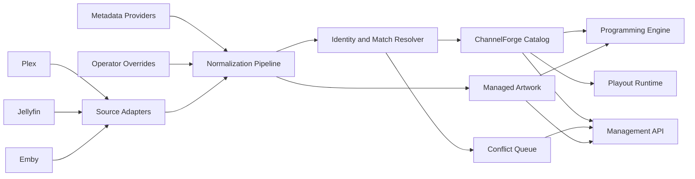

# ChannelForge Media Catalog Specification

- **Specification version:** 0.1
- **Status:** Draft
- **Last updated:** 2026-07-27

## Purpose

This document defines the ChannelForge media catalog.

It specifies how ChannelForge:

- Imports media from external sources
- Assigns canonical ChannelForge identities
- Normalizes metadata
- Preserves source provenance
- Tracks source bindings
- Represents playback variants
- Evaluates availability
- Resolves duplicate and conflicting records
- Stores artwork and presentation references
- Exposes catalog queries to scheduling and administration
- Preserves historical references
- Synchronizes safely with Plex, Jellyfin, and Emby

This document does not define:

- Final FFmpeg command construction
- Runtime stream URL resolution
- Live session management
- Schedule-generation algorithms
- Physical SQLite table layouts
- Public REST route syntax

Those concerns are defined in later specifications.

## Catalog Mission

The ChannelForge catalog is the normalized programming inventory used by the
Scheduling Engine.

It must allow ChannelForge to answer:

- What media exists?
- Which source or sources provide it?
- Is it currently playable?
- What is its reliable duration?
- What normalized metadata should programming rules use?
- Which metadata came from which source?
- Which titles are duplicates or alternate versions?
- Which artwork and presentation assets are usable?
- Can historical schedules still explain what was planned after source data
  changes?

The catalog must not behave as a thin live proxy over one media server.

## Core Principles

1. ChannelForge owns canonical catalog identity.
2. External source identifiers are qualified bindings, not primary identity.
3. Normalized metadata and source metadata are distinct.
4. User overrides have explicit precedence.
5. Synchronization is additive and reconciling, not destructively replacing.
6. Historical references survive source deletion and archival.
7. Playback availability is evaluated separately from descriptive metadata.
8. Final stream URLs are resolved at playout time.
9. The scheduler queries normalized, local catalog state.
10. External source failures must not corrupt unrelated catalog state.
11. Deduplication must be explainable and reversible where practical.
12. Catalog state must be suitable for deterministic schedule generation.

## Scope

Version 1 supports catalog import from:

- Plex
- Jellyfin
- Emby

Version 1 may represent:

- Movies
- Series
- Seasons
- Episodes
- Specials
- Trailers
- Music videos
- Bumpers
- Idents
- Advertisements
- Filler
- Other media kinds

The first implementation may expose a narrower subset in the user interface, but
the domain model must not assume all media are movies or episodes.

Version 1 does not require:

- Automatic media downloading
- File-system crawling outside configured source adapters
- Public catalog federation
- Cloud-hosted metadata storage
- Cross-instance global IDs
- Machine-learning deduplication
- DRM circumvention
- Permanent source stream URLs

## Catalog Architecture



## Catalog Boundary

The catalog owns:

- Catalog Item identity
- Normalized metadata
- Catalog hierarchy
- Source Bindings
- Playback Variants
- Metadata provenance
- User metadata overrides
- Availability state
- Synchronization observations
- Catalog conflicts
- Match decisions
- Artwork references
- Custom collections
- Catalog labels
- Search and filter projections
- Catalog revision metadata

The catalog does not own:

- Original source media files
- Media-server user accounts
- Media-server library permissions
- Client DVR recordings
- Final active stream URLs
- FFmpeg process state
- Schedule Plans
- Live client sessions

## Catalog Aggregate

The Catalog Item is the principal aggregate root.

A Catalog Item represents one logical piece of programmable media.

Examples:

- One movie
- One television series
- One season
- One episode
- One trailer
- One bumper
- One ident
- One filler clip

A Catalog Item may be connected to multiple external source items.

## Catalog Item Identity

### Canonical Identity

Every Catalog Item has a ChannelForge-owned `catalogItemId`.

The identifier must:

- Be opaque
- Be stable for the entity's lifetime
- Be unique within the instance
- Be independent of database row order
- Be independent of source provider
- Remain valid after source archival
- Remain valid after metadata corrections
- Remain valid after source migration
- Be safe to expose through authorized API responses

### Identity Is Not Title

A title change does not create a new Catalog Item by itself.

Examples:

- Correcting a typo
- Changing localized title
- Updating punctuation
- Replacing a placeholder name
- Adjusting sort title

### Identity Is Not Source Location

A change to:

- Plex server
- Jellyfin server
- Emby server
- Library
- Path
- Playback URL
- Container
- Encoding

does not automatically create a new logical Catalog Item.

### Identity Split

A Catalog Item must be split when records previously merged as one are
determined to represent distinct works or distinct programmable units.

Examples:

- Two films with the same title and year
- A movie and its extended edition when treated as separate programming titles
- Two episodes incorrectly matched
- A trailer incorrectly merged with a feature
- A special incorrectly merged with a regular episode

A split must preserve lineage and historical references.

### Identity Merge

Two Catalog Items may be merged when they represent the same logical work.

A merge must:

- Choose one surviving Catalog Item ID
- Preserve alias IDs or tombstones
- Reassign eligible Source Bindings
- Reassign metadata provenance
- Preserve audit history
- Preserve schedule and airing references
- Record the merge decision
- Permit conflict review
- Avoid duplicate active bindings

## Media Kinds

Suggested media kinds:

- `MOVIE`
- `SERIES`
- `SEASON`
- `EPISODE`
- `SPECIAL`
- `TRAILER`
- `MUSIC_VIDEO`
- `BUMPER`
- `IDENT`
- `ADVERTISEMENT`
- `FILLER`
- `SLATE`
- `OTHER`

### Kind Semantics

#### Movie

A standalone feature or short film not modeled as an episode.

#### Series

A logical episodic program container.

#### Season

An ordered grouping inside a Series.

#### Episode

An individual installment of a Series.

#### Special

An installment associated with a Series but not necessarily part of ordinary
season progression.

#### Trailer

Promotional media associated with another work or used independently.

#### Music Video

A music-oriented short-form program.

#### Bumper

A short transition asset.

#### Ident

A network or channel identity asset.

#### Advertisement

A commercial or sponsorship asset.

#### Filler

A media item intended to fill schedule gaps.

#### Slate

A static or motion technical card, holding screen, or off-air presentation.

### Kind Changes

Changing media kind may require:

- Hierarchy changes
- Schedule eligibility changes
- Metadata validation
- Source Binding review
- Conflict review
- Audit record

A kind change must not silently invalidate historical Schedule Entries.

## Catalog Hierarchy

### Series Hierarchy

A normal episodic hierarchy is:

```text
Series
  -> Season
    -> Episode
```

### Required Relationships

- A Season belongs to exactly one Series.
- An Episode belongs to exactly one Series.
- An Episode may belong to one Season.
- A Special may belong to a Series without belonging to an ordinary Season.
- A Movie does not require a Series parent.
- Presentation media does not require episodic hierarchy.

### Hierarchy Identity

Hierarchy uses ChannelForge IDs.

Source parent IDs are stored in Source Bindings and import snapshots.

### Hierarchy Corrections

Correcting hierarchy must:

- Preserve Catalog Item identity where possible
- Record previous parent references
- Update progression indexes
- Mark affected generated plans stale where required
- Avoid mutating approved Schedule Entries

### Orphaned Children

An Episode may temporarily exist without a resolved Series during import.

Suggested hierarchy states:

- `RESOLVED`
- `PENDING_PARENT`
- `CONFLICT`
- `ORPHANED`
- `MANUALLY_ASSIGNED`

An unresolved hierarchy item may be excluded from series-order scheduling.

## Core Catalog Item Fields

Required conceptual fields:

- `catalogItemId`
- Media kind
- Canonical title
- Sort title
- Original title
- Alternate titles
- Summary
- Tagline
- Release date
- Release year
- Original air date
- Duration
- Content rating
- Genres
- Tags
- Languages
- Countries
- Studios
- Credits
- Series ID
- Season ID
- Season number
- Episode number
- Absolute episode number
- Availability state
- Metadata completeness state
- Artwork state
- Created timestamp
- Updated timestamp
- Archived timestamp
- Content revision
- Provenance references

Fields not applicable to a media kind remain absent rather than fabricated.

## Title Model

### Canonical Title

The Canonical Title is the primary display and programming title.

Precedence:

1. User override
2. Accepted normalized decision
3. Preferred metadata provider
4. Preferred source
5. First valid source value
6. Generated placeholder

### Sort Title

Sort Title supports stable ordering.

It may:

- Remove leading articles
- Normalize punctuation
- Apply locale-aware rules
- Use explicit user override

Sort Title is not a primary identity key.

### Original Title

Original Title stores the title in the original release language where known.

### Alternate Titles

Alternate Titles preserve:

- Localized titles
- Abbreviations
- Prior names
- Source-specific titles
- Search aliases

Each Alternate Title records:

- Value
- Locale
- Type
- Provenance
- Confidence
- Active state

## Description Model

### Summary

Summary is the standard guide-length description.

### Long Description

A long description may be retained for management views.

### Tagline

Tagline is a short promotional phrase.

### Description Precedence

Description fields use the same provenance and override model as title fields.

Generated summaries must be clearly identified as generated or derived.

## Release and Air Date Model

Possible date fields:

- Release date
- Original air date
- Digital release date
- Physical release date
- Year-only fallback

A partial date must preserve precision.

Examples:

- Exact date
- Year and month
- Year only
- Unknown

The catalog must not invent January 1 for a year-only date without preserving
that the original precision was year-only.

## Duration Model

### Scheduling Duration

The scheduler consumes a normalized duration.

Duration precedence:

1. Explicit scheduling override
2. Verified measured duration
3. Preferred Playback Variant duration
4. Source-reported duration
5. Metadata-provider duration
6. Unknown

### Duration Value

A duration record includes:

- Integer duration
- Precision unit
- Provenance
- Observed timestamp
- Confidence
- Override state
- Variance from other observations

### Duration Conflict

A duration conflict exists when observations differ beyond tolerance.

Possible causes:

- Alternate cuts
- Intro or credits handling
- Source rounding
- Bad metadata
- Different editions
- Corrupt media

Conflict policy may:

- Prefer measured variant duration
- Keep per-variant duration
- Use explicit scheduling override
- Split editions
- Require operator review

### Synthetic Duration

Presentation or generated items may use synthetic duration when defined by their
runtime producer.

Synthetic duration must be explicit.

## Content Rating Model

A rating record includes:

- Raw rating
- Normalized rating system
- Normalized value
- Region
- Age floor, where applicable
- Provenance
- Override state

ChannelForge must preserve unknown or unmapped ratings.

A missing rating is not equivalent to unrestricted content.

## Genre and Tag Model

### Genre

Genres are normalized editorial classifications.

Each genre association records:

- Normalized genre ID or key
- Display label
- Source label
- Provenance
- Confidence
- User override state

### Tag

Tags are flexible labels.

Tags may represent:

- Source tags
- User labels
- Programming labels
- Imported pack labels
- Derived labels

Tag namespace must be preserved.

Examples:

- `source:plex:holiday`
- `user:comfort-watch`
- `programming:late-night`
- `pack:classic-horror`
- `derived:short-runtime`

### Genre Mapping

Source-specific labels may map to canonical genres.

Mappings must be:

- Versioned
- Reversible
- Auditable
- Non-destructive

Raw source labels remain preserved.

## Credits Model

Credits may include:

- Person or organization name
- Role
- Character
- Billing order
- Source reference
- External person ID
- Provenance

Version 1 may store credits in a normalized but simplified form.

Credits are useful for:

- Search
- Programming selectors
- Guide display
- Franchise analysis

Credits do not require a full person-identity graph in version 1.

## Studio and Network Metadata

Catalog metadata may include:

- Production studio
- Distributor
- Original network
- Production company

These values are descriptive metadata.

They are not ChannelForge Network entities.

The API and UI must distinguish:

- Original television network metadata
- ChannelForge virtual Network

## Language Model

Language records may apply to:

- Original language
- Audio streams
- Subtitle streams
- Metadata locale
- Guide locale

Languages should use standard language tags where possible.

Unknown raw source values must be preserved.

## Country Model

Countries should use stable normalized codes where possible.

Raw source labels may be retained for provenance.

Country data may drive programming selectors but must not be inferred from
language alone.

## External Source Binding

A Source Binding links one Catalog Item to one item in one Media Source.

Required conceptual fields:

- `sourceBindingId`
- `catalogItemId`
- `mediaSourceId`
- External item ID
- External item type
- External library ID
- External parent IDs
- External path or key
- External version token
- Source metadata checksum
- Source availability state
- First seen timestamp
- Last seen timestamp
- Last synchronized timestamp
- Missing since timestamp
- Archived timestamp
- Match state
- Match confidence
- Match decision reference

## Source Binding Identity

A Source Binding is unique by:

```text
mediaSourceId + externalItemType + externalItemId
```

The exact uniqueness key may include library scope when required by an adapter.

An external ID reused by a source for a different item must create a conflict.

## Source Binding States

Suggested states:

- `ACTIVE`
- `MISSING`
- `UNAVAILABLE`
- `DISABLED`
- `CONFLICT`
- `ARCHIVED`

### Active

The source item was observed and is eligible under source policy.

### Missing

The item was not observed during synchronization but is inside a grace period.

### Unavailable

The source item exists but cannot currently provide usable playback.

### Disabled

The Source Binding has been excluded manually or by source policy.

### Conflict

The binding is involved in unresolved identity or metadata conflict.

### Archived

The binding is retained only for history.

## Match State

Suggested match states:

- `NEW`
- `AUTO_MATCHED`
- `MANUALLY_MATCHED`
- `MANUALLY_CREATED`
- `REVIEW_REQUIRED`
- `REJECTED_MATCH`
- `SPLIT`
- `MERGED`

## Source Snapshot

Each synchronization may retain a normalized source snapshot.

A Source Snapshot includes:

- Source Binding ID
- Adapter version
- Source server version
- Raw or normalized source payload reference
- Payload checksum
- Observed timestamp
- Parse warnings
- Field observations
- Child relationships
- Playback observations

Raw payload retention may be bounded by policy.

The normalized field observations required for provenance must remain available.

## Playback Variant

A Playback Variant represents one playable realization of a Catalog Item through
one Source Binding.

Required conceptual fields:

- `playbackVariantId`
- `sourceBindingId`
- External media-part ID
- Container
- Video codec
- Audio codecs
- Subtitle codecs
- Width
- Height
- Aspect ratio
- Frame rate
- Scan type
- Bit rate
- HDR format
- Color characteristics
- Audio channel count
- Audio language tracks
- Subtitle language tracks
- Duration
- File size
- Source path or key
- Direct-play observations
- Direct-stream observations
- Transcode observations
- Availability state
- Last verified timestamp
- Variant checksum or version token

## Variant Identity

A Playback Variant identity is stable while the source considers it the same
media part or version.

Replacing the underlying file may:

- Update the existing variant when the source version token changes
- Create a new variant when the source exposes a new identity
- Archive the prior variant
- Trigger duration and capability reevaluation

## Playback Variant States

Suggested states:

- `AVAILABLE`
- `UNVERIFIED`
- `MISSING`
- `UNPLAYABLE`
- `DISABLED`
- `ARCHIVED`

## Playback Capability Observation

A capability observation is not a permanent guarantee.

It may include:

- Client or output profile
- Direct play allowed
- Direct stream allowed
- Transcode required
- Container compatibility
- Codec compatibility
- Bit-rate compatibility
- Subtitle burn requirement
- Observation timestamp
- Source version
- ChannelForge version

Final runtime decision occurs during playout.

## Stream URL Handling

Permanent stream URLs must not be stored as canonical variant identity.

Short-lived URLs may be cached only with:

- Expiration
- Source Binding
- Security controls
- Redaction in logs
- Explicit runtime cache classification

Source access tokens must not be embedded in ordinary catalog API responses.

## Availability Model

Catalog availability is derived from Source Bindings and Playback Variants.

Suggested Catalog Item states:

- `AVAILABLE`
- `PARTIALLY_AVAILABLE`
- `UNAVAILABLE`
- `UNKNOWN`
- `ARCHIVED`

### Available

At least one eligible Source Binding has at least one usable Playback Variant.

### Partially Available

Some expected Source Bindings or variants are unavailable, but at least one
usable option remains.

### Unavailable

No eligible usable Playback Variant remains.

### Unknown

Availability has not been verified or synchronization is incomplete.

### Archived

The Catalog Item is not eligible for new programming but remains for history.

## Availability Policy

Availability may depend on:

- Media Source enabled state
- Source Binding state
- Playback Variant state
- Source health
- Library inclusion
- Manual exclusion
- Output-profile requirements
- Preflight verification age
- Required local accessibility
- Required container or codec compatibility

The scheduler may use a conservative availability policy.

## Availability Changes

When availability changes:

- The Catalog Item state is recalculated.
- A domain event may be emitted.
- Future generated plans may use new state.
- Existing approved plans are not mutated.
- Affected plans may be marked stale.
- Playout may select alternate variants.
- Health findings may be recalculated.

## Metadata Provenance

Every normalized field must be traceable to a source or decision.

Suggested provenance types:

- `USER_OVERRIDE`
- `SOURCE`
- `METADATA_PROVIDER`
- `DERIVED`
- `MIGRATED`
- `PACK_IMPORT`
- `SYSTEM_DEFAULT`

A provenance record includes:

- Provenance ID
- Catalog Item ID
- Field name
- Value or value reference
- Provenance type
- Source entity
- Source field
- Observed timestamp
- Confidence
- Precedence
- Accepted state
- Superseded timestamp
- Decision reference

## Metadata Precedence

Default precedence:

1. Explicit user override
2. Accepted manual conflict resolution
3. ChannelForge normalized decision
4. Preferred metadata provider
5. Preferred Media Source
6. Other Media Sources
7. Derived value
8. System fallback

Precedence may be field-specific.

Example:

- Duration may prefer measured Playback Variant.
- Artwork may prefer user upload.
- Content rating may prefer region-specific metadata provider.
- Episode order may prefer explicit series-order policy.

## User Overrides

A user override:

- Targets one field or relationship
- Records the prior effective value
- Records the new value
- Records the actor
- Records the timestamp
- May include a note
- Remains until removed or superseded

Synchronization cannot silently overwrite an active user override.

Removing an override causes effective value recalculation from remaining
provenance.

## Normalization Pipeline

The canonical import pipeline is:

```text
1. Fetch source records
2. Parse adapter payload
3. Validate source identity
4. Normalize field observations
5. Resolve hierarchy candidates
6. Resolve or create Catalog Item identity
7. Upsert Source Binding
8. Upsert Playback Variants
9. Recalculate effective metadata
10. Recalculate availability
11. Detect conflicts
12. Commit transactionally
13. Emit domain events
14. Update search projections
```

## Normalization Requirements

Normalization must be:

- Deterministic
- Versioned
- Idempotent
- Source-aware
- Locale-aware where required
- Non-destructive
- Explainable
- Safe under partial source data

## Text Normalization

Text normalization may include:

- Unicode normalization
- Whitespace normalization
- Control-character removal
- Safe HTML stripping
- Punctuation normalization
- Locale-aware case folding for search
- Preservation of original value

Canonical display text must not be aggressively altered without retaining the
source value.

## Date Normalization

Date normalization must preserve:

- Value
- Precision
- Time zone, when supplied
- Source
- Parse warnings

Invalid dates are preserved as raw observations and excluded from normalized
effective values.

## Numeric Normalization

Numeric normalization must define:

- Unit conversion
- Rounding
- Precision
- Valid range
- Missing versus zero
- Overflow handling

Examples:

- Duration
- Bit rate
- File size
- Frame rate
- Season number
- Episode number

## Identifier Normalization

External IDs are stored as strings unless an adapter guarantees another stable
representation.

Leading zeros and case must not be changed unless source semantics permit it.

## Source Adapter Contract

Every Media Source adapter must provide:

- Source identity
- Server capability discovery
- Library enumeration
- Item enumeration
- Item detail retrieval
- Hierarchy relationships
- Media-part enumeration
- Artwork references
- Version or change tokens where supported
- Pagination handling
- Error classification
- Authentication handling
- Rate-limit handling
- Deletion or missing-item semantics

## Adapter Output

Adapters emit source-neutral import records.

An import record should include:

- Source item identity
- Source item kind
- Parent identities
- Field observations
- Artwork observations
- Playback Variant observations
- Source timestamps
- Source version token
- Parse warnings

The normalization pipeline must not depend directly on Plex-, Jellyfin-, or
Emby-specific response objects.

## Full Synchronization

A Full Synchronization enumerates all included source libraries.

Steps:

1. Establish synchronization run.
2. Capture source capability snapshot.
3. Enumerate included libraries.
4. Enumerate source items with stable pagination.
5. Normalize and stage records.
6. Commit bounded batches.
7. Mark observed bindings.
8. Identify previously active bindings not observed.
9. Apply missing-item grace policy.
10. Recalculate affected Catalog Items.
11. Complete verification.
12. Record counts and warnings.

## Incremental Synchronization

Incremental synchronization may use:

- Source update tokens
- Updated-since timestamps
- Webhook-derived hints
- Library change IDs
- Item version tokens

Incremental synchronization must tolerate missed events.

A periodic Full Synchronization remains necessary unless the source provides a
provably complete change feed.

## Missing-Item Grace Policy

A source item not observed in one run is not necessarily deleted immediately.

Reasons include:

- Partial API failure
- Permission changes
- Library scan in progress
- Pagination interruption
- Temporary source outage
- Adapter defect

Suggested stages:

- First missed observation: `MISSING`
- Grace period: retain previous metadata and history
- Repeated verified absence: `UNAVAILABLE`
- Explicit source deletion or administrative decision: `ARCHIVED`

The exact thresholds are configurable.

## Deletion Semantics

Source deletion does not automatically delete Catalog Item identity.

When the final Source Binding disappears:

- Catalog Item becomes unavailable.
- Historical references remain valid.
- User metadata remains.
- Schedule history remains.
- The item may later reconnect to a new source.
- Administrative archival may occur.

Hard deletion is permitted only when safe and policy allows it.

## Synchronization Transaction Model

Synchronization must not hold one long write transaction while calling an
external source.

Recommended stages:

1. Fetch external data outside write transaction.
2. Normalize in memory or staging storage.
3. Commit bounded batches.
4. Record synchronization checkpoint.
5. Continue.
6. Run final reconciliation transaction.

A failed batch must not corrupt prior committed batches.

The Synchronization Run records partial completion.

## Synchronization Run

Required conceptual fields:

- `synchronizationRunId`
- Media Source ID
- Synchronization mode
- State
- Adapter version
- Source server version
- Started timestamp
- Completed timestamp
- Last checkpoint
- Items observed
- Items created
- Items updated
- Items unchanged
- Bindings missing
- Variants created
- Variants updated
- Conflicts created
- Warnings
- Error classification
- Retry information

Suggested states:

- `QUEUED`
- `CONNECTING`
- `ENUMERATING`
- `NORMALIZING`
- `COMMITTING`
- `RECONCILING`
- `SUCCEEDED`
- `SUCCEEDED_WITH_WARNINGS`
- `FAILED`
- `CANCELLED`
- `ABANDONED`

## Idempotency

Reprocessing the same source state must not:

- Duplicate Catalog Items
- Duplicate Source Bindings
- Duplicate Playback Variants
- Duplicate provenance records unnecessarily
- Recreate resolved conflicts
- Change effective metadata without input changes
- Change availability without input changes

Content checksums and source version tokens may reduce unnecessary writes.

## Catalog Matching

Matching determines whether an imported source item:

- Connects to an existing Catalog Item
- Creates a new Catalog Item
- Requires review

## Match Inputs

Potential match inputs:

- Source-provided metadata-provider IDs
- Series and episode hierarchy
- Title
- Original title
- Release year
- Original air date
- Season number
- Episode number
- Absolute episode number
- Runtime
- Studio
- Credits
- Content type
- File fingerprint, where available
- User mappings
- Prior migration mappings

## Strong Match Keys

Strong evidence may include:

- Same qualified metadata-provider ID
- Existing manual mapping
- Existing Source Binding lineage
- Same verified file fingerprint
- Same series ID plus stable episode coordinates

Strong evidence must still be type-compatible.

## Weak Match Keys

Weak evidence includes:

- Similar title
- Same year
- Similar runtime
- Similar summary
- Shared genre
- Shared studio

Weak evidence alone should not auto-merge ambiguous items.

## Match Score

A Match Score may support ranking.

The score must be:

- Deterministic
- Versioned
- Explainable
- Type-aware
- Thresholded
- Accompanied by evidence

Suggested outcomes:

- Above auto-match threshold: connect automatically
- Between thresholds: review required
- Below minimum threshold: create new Catalog Item

## Match Prohibitions

Items must not auto-match when:

- Media kinds are incompatible
- Series parentage conflicts materially
- Episode coordinates conflict
- Metadata-provider IDs disagree
- Runtime difference suggests distinct editions
- Manual rejection exists
- One item is presentation media and the other is ordinary program media

## Duplicate Detection

Duplicate detection may occur:

- During import
- After metadata enrichment
- After user correction
- During migration
- On demand

A Duplicate Candidate record includes:

- Candidate Catalog Item IDs
- Match evidence
- Match score
- Detection version
- State
- Resolution decision
- Resolver
- Timestamp

## Edition Model

Different cuts may be represented as:

1. One Catalog Item with multiple Playback Variants, or
2. Separate Catalog Items connected by an edition relationship.

Use one Catalog Item when editorial identity and guide presentation are intended
to be the same.

Use separate Catalog Items when:

- Runtime differs materially
- Content differs materially
- Guide title differs
- Ratings differ
- Scheduling rules should treat them independently
- Operator explicitly separates them

Edition relationships may include:

- Theatrical
- Extended
- Director's cut
- Unrated
- Remastered
- Alternate language
- Broadcast edit

## Catalog Conflict

A Catalog Conflict captures unresolved inconsistency.

Suggested conflict types:

- `IDENTITY_AMBIGUITY`
- `DUPLICATE_CANDIDATE`
- `EXTERNAL_ID_REUSE`
- `KIND_MISMATCH`
- `HIERARCHY_MISMATCH`
- `DURATION_MISMATCH`
- `DATE_MISMATCH`
- `RATING_MISMATCH`
- `TITLE_MISMATCH`
- `VARIANT_COLLISION`
- `SOURCE_DELETION_AMBIGUITY`
- `METADATA_PRECEDENCE_AMBIGUITY`

Required conceptual fields:

- `catalogConflictId`
- Conflict type
- Related Catalog Item IDs
- Related Source Binding IDs
- Evidence
- Severity
- State
- Detection version
- Created timestamp
- Resolved timestamp
- Resolving actor
- Resolution type
- Resolution note

Suggested states:

- `OPEN`
- `DEFERRED`
- `RESOLVED`
- `DISMISSED`
- `SUPERSEDED`

## Conflict Resolution Actions

Possible actions:

- Accept existing match
- Create new Catalog Item
- Merge Catalog Items
- Split Catalog Item
- Reassign Source Binding
- Override field
- Prefer source
- Archive binding
- Mark distinct editions
- Defer
- Dismiss false positive

Every action must be auditable.

## Metadata Provider Enrichment

Metadata providers may enrich:

- Titles
- Summaries
- Release dates
- Ratings
- Genres
- Credits
- Artwork
- External IDs
- Episode order
- Franchise relationships

Provider enrichment is optional.

## Provider Binding

A Provider Binding connects a Catalog Item to one provider entity.

Required conceptual fields:

- Provider type
- Provider instance or configuration
- External entity ID
- Entity type
- Match state
- Confidence
- First seen
- Last refreshed
- Provider version, where available

## Provider Precedence

Provider precedence is configurable by field.

Example:

- TMDb artwork preferred for movies
- TVDB episode order preferred for selected series
- Media Source summary retained for local edits
- User override always wins

## Provider Failure

Provider failure must not:

- Make playable media unavailable
- Remove user overrides
- Destroy source metadata
- Block unrelated synchronization
- Delete prior accepted provider values immediately

Stale provider metadata is marked with refresh status.

## Artwork Model

### Artwork Types

Suggested artwork types:

- Poster
- Background
- Banner
- Logo
- Thumbnail
- Episode still
- Square image
- Clear logo
- Icon
- Guide image

### Artwork Record

Required conceptual fields:

- `artworkId`
- Catalog Item ID
- Artwork type
- Source
- Source URL or source key
- Managed storage reference
- MIME type
- Width
- Height
- File size
- Checksum
- Locale
- Rating or suitability
- Preferred state
- Validation state
- First seen
- Last verified
- Archived timestamp

## Artwork States

Suggested states:

- `REMOTE`
- `CACHED`
- `MANAGED`
- `MISSING`
- `INVALID`
- `ARCHIVED`

## Artwork Selection

Effective artwork selection considers:

1. User-selected artwork
2. Network or Channel override
3. Preferred provider
4. Preferred Media Source
5. Best validated dimensions
6. Locale
7. Deterministic stable ordering

## Artwork Caching

Artwork may be:

- Proxied
- Cached
- Imported into managed storage
- Referenced remotely

Caching policy must consider:

- Source authentication
- URL expiration
- Client access
- Storage use
- Provider terms
- Offline guide generation

Secrets must not appear in public artwork URLs.

## Artwork Validation

Validation may include:

- MIME type
- Actual file signature
- Dimensions
- Maximum size
- Corrupt-file detection
- Path safety
- Unsupported animation
- Content policy where applicable

## Presentation Assets Versus Catalog Artwork

Catalog artwork describes programs.

Presentation Assets represent ChannelForge network and on-air identity.

The two models may share storage infrastructure but remain distinct domain
concepts.

## Custom Collections

A Custom Collection groups Catalog Items for programming.

Required conceptual fields:

- `collectionId`
- Name
- Description
- Owner
- Membership mode
- Static members
- Dynamic selector
- Sort policy
- Created timestamp
- Updated timestamp
- Archived timestamp

Suggested membership modes:

- `STATIC`
- `DYNAMIC`
- `HYBRID`

## Collection Membership

Static membership is explicit.

Dynamic membership is evaluated from normalized metadata.

Hybrid membership combines dynamic results with explicit include and exclude
overrides.

## Collection Invariants

1. Collections reference Catalog Item IDs.
2. Source-specific collection IDs do not become canonical identity.
3. Dynamic evaluation is deterministic for a catalog snapshot.
4. Archived Catalog Items remain visible in historical collection snapshots.
5. Collection changes may mark dependent plans stale.

## Catalog Labels

Catalog labels support programming-specific classification.

Examples:

- Holiday
- Family
- Late-night
- Comfort
- Premiere
- Classic
- Local
- Original
- Short-form
- High-priority

A label includes:

- Label ID
- Namespace
- Name
- Description
- Color or UI hint
- Owner
- Created timestamp
- Archived timestamp

Label assignment records:

- Catalog Item ID
- Label ID
- Provenance
- Effective date range
- Created timestamp
- Removed timestamp

## Franchise Relationships

A franchise groups related works.

Required conceptual fields:

- `franchiseId`
- Name
- Description
- Member Catalog Item IDs
- Membership roles
- Ordering hints
- Provenance

Franchise relationships support:

- Repeat spacing
- Themed blocks
- Sequels
- Spin-offs
- Shared universes

Franchise membership must not imply series hierarchy.

## Search

Catalog search should support:

- Title
- Alternate title
- Series title
- Summary
- Genre
- Tag
- Label
- Cast and crew
- Studio
- Year
- Media kind
- Source
- Availability
- Collection
- Franchise
- External ID
- Catalog Item ID

## Search Normalization

Search may use:

- Case folding
- Diacritic folding
- Tokenization
- Prefix matching
- Phrase matching
- Stable ranking

Search indexes are derived data.

The authoritative Catalog Item remains the source of truth.

## Filter Semantics

Filters must distinguish:

- Missing
- Empty
- Unknown
- Explicit false
- Zero
- Archived
- Unavailable

Example:

- `duration = 0` is not the same as `duration unknown`.
- `rating missing` is not the same as `unrestricted`.
- `source unavailable` is not the same as `source disabled`.

## Sort Semantics

Supported stable sorts may include:

- Title
- Sort title
- Release date
- Original air date
- Duration
- Recently added
- Recently synchronized
- Availability
- Series order
- Randomized deterministic order

Every sort must include a stable final tie-break by Catalog Item ID.

## Pagination

Catalog APIs must use stable pagination.

Cursor-based pagination is preferred for large mutable catalogs.

Offset pagination may be used for bounded administrative views.

A page must not depend on nondeterministic database ordering.

## Catalog Snapshot

Scheduling requires a stable catalog view.

A Catalog Snapshot may include:

- Snapshot ID
- Creation timestamp
- Catalog revision watermark
- Included Catalog Item IDs
- Relevant metadata revisions
- Availability revisions
- Selector-evaluation version
- Content checksum
- Expiration or retention state

## Snapshot Strategies

Possible implementation strategies:

- Materialized immutable membership list
- Revision watermark plus item revision map
- Content-addressed selector result
- Database snapshot abstraction
- Exported generation input bundle

The selected strategy must support deterministic schedule reproduction.

## Catalog Revision

A catalog revision or watermark changes when scheduling-relevant state changes.

Scheduling-relevant changes include:

- Catalog Item creation
- Catalog Item archival
- Effective title if used by guide snapshot
- Media kind
- Duration
- Rating
- Genre
- Tag
- Label
- Hierarchy
- Availability
- Collection membership
- Franchise membership
- Source Binding eligibility
- Playback Variant eligibility

Changes unrelated to scheduling may use separate revision tracking.

## Historical Preservation

Approved Schedule Entries must remain interpretable even if:

- Catalog Item title changes
- Source Binding disappears
- Artwork changes
- Catalog Item is archived
- Series hierarchy is corrected
- A merge or split occurs
- Metadata provider changes

Historical preservation relies on:

- Stable IDs
- Guide metadata snapshots
- Lineage records
- Merge and split aliases
- Archived provenance
- Tombstones where needed

## Merge Lineage

A merge record includes:

- Surviving Catalog Item ID
- Merged Catalog Item IDs
- Reason
- Actor
- Timestamp
- Conflict reference
- Reassigned bindings
- Historical-reference policy

Old IDs may resolve to a tombstone indicating the surviving ID.

## Split Lineage

A split record includes:

- Original Catalog Item ID
- New Catalog Item IDs
- Source Bindings assigned to each
- Metadata copied
- Historical-reference policy
- Actor
- Timestamp
- Conflict reference

Historical Schedule Entries remain attached to the identity that existed when
the plan was approved unless an explicit migration is performed.

## Archival

Archiving a Catalog Item:

- Removes it from ordinary scheduling eligibility
- Preserves identity
- Preserves metadata
- Preserves Source Bindings
- Preserves history
- Preserves audit references
- May preserve artwork according to retention policy

Unarchiving requires validation of current metadata and availability.

## Hard Deletion

Hard deletion is allowed only when:

- The item has no Schedule Entry references
- The item has no Airing Record references
- The item has no audit requirements
- The item has no active Source Bindings
- The item has no dependent collection or franchise references
- Policy permits deletion

Otherwise archival or tombstone is required.

## Catalog API Concepts

Exact routes are defined later.

Required conceptual operations include:

- List Catalog Items
- Read Catalog Item
- Search Catalog
- Filter Catalog
- Read Source Bindings
- Read Playback Variants
- Read metadata provenance
- Set user override
- Remove user override
- Archive Catalog Item
- Unarchive Catalog Item
- Create manual Catalog Item
- Resolve hierarchy
- Merge Catalog Items
- Split Catalog Item
- Reassign Source Binding
- Read conflicts
- Resolve conflict
- List synchronization runs
- Start synchronization
- Compare source observations
- Manage collections
- Manage labels
- Read catalog metrics
- Create Catalog Snapshot

## Manual Catalog Items

An operator may create a Catalog Item manually.

Manual items may represent:

- Future programming placeholders
- Off-air slates
- Locally managed presentation media
- Media awaiting source binding
- Imported schedules with unresolved content
- Custom guide entries

A manual item without a playable Source Binding is unavailable unless its media
kind has a runtime generator.

## Manual Source Binding

Manual binding connects an existing Catalog Item to an external source item.

The action requires:

- Source selection
- Source item selection
- Match preview
- Conflict check
- Actor confirmation
- Audit record

## Imported Schedule Placeholders

Imported schedules may refer to unresolved programs.

A Placeholder Catalog Item includes:

- Provisional title
- Imported external reference
- Expected start and duration
- Provenance
- Resolution state

Suggested states:

- `UNRESOLVED`
- `MATCHED`
- `MANUALLY_RESOLVED`
- `EXPIRED`
- `ARCHIVED`

Unresolved placeholders are not generally playable.

## Catalog Metrics

Suggested metrics:

- Total Catalog Items
- Items by media kind
- Available items
- Unavailable items
- Items with conflicts
- Items missing duration
- Items missing rating
- Items missing artwork
- Items missing summary
- Duplicate candidates
- Orphaned episodes
- Items by source
- Items with multiple sources
- Playback Variants by codec
- Duration distribution
- Recently missing bindings
- Stale metadata-provider records
- Archived items
- Collection counts
- Label counts

## Catalog Health Findings

Potential findings:

- Source not synchronized
- Excessive missing items
- Large duration conflicts
- Unresolved duplicate candidates
- Orphaned episodic hierarchy
- Unavailable items in active plans
- Missing guide metadata
- Missing artwork
- Source concentration risk
- Unsupported codecs
- Stale availability verification
- High conflict rate after migration

Health findings must cite evidence.

## Security

### Credential Isolation

Source credentials must be stored through secret storage.

Catalog records may reference a secret identifier but not expose the secret.

### URL Redaction

URLs containing tokens or signatures must be:

- Redacted in logs
- Excluded from ordinary API responses
- Avoided in persistent diagnostics
- Cached only through secure runtime storage

### Import Validation

Source and provider text is untrusted.

Validation must address:

- Unsafe HTML
- Control characters
- Oversized fields
- Invalid encodings
- Malformed URLs
- Path traversal attempts
- Unsupported image types
- Resource exhaustion
- Recursive hierarchy
- Excessive child counts

### Authorization

Sensitive catalog operations require appropriate authorization.

Examples:

- Merge
- Split
- Override
- Archive
- Delete
- Reassign Source Binding
- Resolve conflicts
- Trigger full synchronization
- View source diagnostics

## Audit Requirements

Audit records are required for:

- User metadata override
- Override removal
- Catalog Item archival
- Catalog Item unarchival
- Hard deletion
- Merge
- Split
- Source Binding reassignment
- Manual match
- Match rejection
- Conflict resolution
- Collection change
- Label change
- Source inclusion change
- Metadata-provider precedence change

Synchronization-generated changes may use structured system audit or
Synchronization Run records rather than one user-facing record per field.

## Observability

Structured catalog logs should include:

- Synchronization Run ID
- Media Source ID
- Adapter version
- Stage
- Page or checkpoint
- Item counts
- Binding counts
- Variant counts
- Conflict counts
- Warning codes
- Error classification
- Duration by stage

Logs must exclude secrets and signed URLs.

## Catalog Events

Potential events:

- `CatalogItemCreated`
- `CatalogItemUpdated`
- `CatalogItemArchived`
- `CatalogItemAvailabilityChanged`
- `CatalogItemMerged`
- `CatalogItemSplit`
- `SourceBindingCreated`
- `SourceBindingMissing`
- `SourceBindingReassigned`
- `PlaybackVariantChanged`
- `CatalogConflictCreated`
- `CatalogConflictResolved`
- `CollectionChanged`
- `CatalogSnapshotCreated`
- `SynchronizationCompleted`

Event handlers must be idempotent.

## Performance Requirements

### Representative Scale

Version 1 should support:

- Tens of thousands of Catalog Items
- Multiple Source Bindings per item
- Multiple Playback Variants per binding
- Large episodic libraries
- Multiple concurrent source imports with controlled writes
- Scheduling queries over bounded snapshots

### Performance Principles

- Index source identity keys.
- Index normalized media kind.
- Index hierarchy references.
- Index availability.
- Index duration.
- Index common selector fields.
- Use bounded synchronization batches.
- Avoid N+1 source calls.
- Avoid per-item external calls during scheduling.
- Maintain derived search projections.
- Keep writes short under SQLite.
- Use stable pagination.
- Recalculate only affected effective fields where possible.

## SQLite Considerations

Version 1 uses SQLite.

The catalog design must account for:

- One primary writer at a time
- Short transactions
- WAL mode where appropriate
- Busy timeout and retry policy
- Batch-size control
- Foreign-key enforcement
- Deterministic query ordering
- Checkpointing
- Backup consistency
- Migration safety

Synchronization concurrency must be coordinated to avoid prolonged write
contention.

## Repository Boundaries

Suggested repository interfaces:

- `CatalogItemRepository`
- `MediaSourceRepository`
- `SourceBindingRepository`
- `PlaybackVariantRepository`
- `CatalogConflictRepository`
- `CollectionRepository`
- `ArtworkRepository`
- `CatalogSnapshotRepository`
- `SynchronizationRunRepository`

Domain services should not issue arbitrary SQL directly.

## Query Services

Read-heavy catalog operations may use dedicated query services or projections.

Examples:

- Catalog search
- Faceted filters
- Collection membership
- Source availability dashboard
- Conflict queue
- Scheduler candidate query
- Metadata completeness report
- Variant capability report

Query services may return optimized projections rather than full aggregates.

## Scheduler Candidate Projection

The scheduler requires a stable projection containing fields such as:

- Catalog Item ID
- Media kind
- Duration
- Series ID
- Season ID
- Episode coordinates
- Rating
- Genres
- Tags
- Labels
- Collections
- Franchise IDs
- Availability
- Source eligibility
- Guide metadata completeness
- Presentation readiness
- Relevant metadata revision

The projection must be derived from authoritative catalog state.

## Playout Catalog Projection

Playout requires:

- Catalog Item ID
- Eligible Source Bindings
- Eligible Playback Variants
- Current source health
- Variant capability observations
- Runtime resolution hints
- Secret references
- Availability timestamps

Playout receives secret access through the integration boundary, not ordinary
catalog API responses.

## Catalog Versioning

The catalog subsystem records:

- Normalization version
- Match algorithm version
- Genre mapping version
- Rating mapping version
- Search projection version
- Artwork selection version
- Availability calculation version
- Snapshot format version

Version changes that affect scheduling must update the catalog revision model.

## Migration from Tunarr

Migration must convert inherited media references into:

- ChannelForge Catalog Items
- Source Bindings
- Playback Variants where evidence exists
- Legacy identifier mappings
- Normalized metadata provenance
- Availability state
- Conflict records where identity is ambiguous

Migration must not assume one legacy row equals one logical Catalog Item without
verification.

## Legacy Reference Preservation

Inherited schedule and channel records may reference source-specific IDs.

Migration should:

1. Create or resolve a Catalog Item.
2. Create Source Binding.
3. Create Legacy Identifier Mapping.
4. Rewrite new ChannelForge records to use Catalog Item ID.
5. Preserve compatibility lookup during transition.
6. Record unresolved references.

## Catalog Test Strategy

### Unit Tests

Required categories:

- Identity key parsing
- Source Binding uniqueness
- Media kind mapping
- Hierarchy normalization
- Duration precedence
- Rating normalization
- Genre mapping
- Tag namespace
- Metadata precedence
- User override
- Availability calculation
- Match scoring
- Duplicate thresholds
- Merge
- Split
- Artwork selection
- Missing-item grace policy
- Catalog revision updates

### Adapter Contract Tests

Each source adapter requires contract fixtures for:

- Library enumeration
- Movies
- Series
- Seasons
- Episodes
- Specials
- Multiple media parts
- Missing metadata
- Deleted items
- Authentication failure
- Pagination
- Source version differences
- Artwork
- Invalid payloads

### Determinism Tests

Given fixed source records and configuration, normalization must produce:

- Same Catalog Item decisions
- Same effective metadata
- Same match results
- Same conflict results
- Same availability
- Same checksums
- Same stable ordering

### Property Tests

Useful properties:

- A Source Binding has one Catalog Item.
- One qualified external identity cannot have two active bindings.
- User override always outranks source refresh.
- Reprocessing identical input is idempotent.
- Archiving a source does not delete historical Catalog Items.
- Merge preserves historical references.
- Split does not duplicate active Source Bindings.
- Missing is not immediately archived.
- Unknown duration is not zero.
- Search ordering is stable.
- Catalog snapshot membership is immutable.

### Integration Tests

Integration tests should cover:

- SQLite repositories
- Batch synchronization
- Interrupted synchronization
- Restart recovery
- Conflict persistence
- Merge and split transactions
- Snapshot creation
- Scheduler candidate projection
- Playout variant projection
- Migration from legacy identifiers

### Performance Tests

Performance tests should measure:

- Full import
- Incremental import
- Catalog search
- Selector query
- Availability recalculation
- Duplicate detection
- Snapshot generation
- Large series hierarchy
- Multi-source merge
- SQLite contention under controlled jobs

## Reference Import Example

Assume:

- Plex Source A contains Movie X in 1080p.
- Jellyfin Source B contains Movie X in 4K.
- Both expose the same TMDb ID.
- Titles differ slightly.
- Runtime differs by 12 seconds.
- Artwork differs.
- Plex is configured as preferred metadata source.
- Jellyfin 4K is preferred for compatible playout.

Expected result:

```text
Catalog Item: Movie X
  Source Binding: Plex Source A
    Playback Variant: 1080p
  Source Binding: Jellyfin Source B
    Playback Variant: 4K
```

Effective metadata may use Plex title and summary.

Playout may select Jellyfin 4K for a compatible output profile.

The two sources do not create duplicate Catalog Items.

## Reference Conflict Example

Assume:

- Plex contains "The Return" from 1995.
- Emby contains "The Return" from 1995.
- Runtime differs by 28 minutes.
- Cast differs.
- No shared provider ID exists.
- File fingerprints differ.
- Summaries describe different plots.

Expected outcome:

- Two Catalog Items, or
- Review-required conflict

The system must not auto-merge solely because title and year match.

## Reference Missing-Item Example

Assume:

- Jellyfin synchronization previously observed Episode 4.
- One incremental run does not return it.
- The source is partially degraded.
- Episode 4 appears in an approved plan.

Expected behavior:

- Source Binding becomes `MISSING`.
- Catalog Item remains historically valid.
- Approved Schedule Entry remains unchanged.
- Availability may become `UNKNOWN` or `PARTIALLY_AVAILABLE`.
- Health warning may be created.
- Playout may use another source binding if available.
- The item is not deleted.

## Version 1 Required Behaviors

The version 1 catalog must:

1. Assign ChannelForge-owned Catalog Item IDs.
2. Support Plex, Jellyfin, and Emby Source Bindings.
3. Preserve qualified external IDs.
4. Normalize movies, series, seasons, and episodes.
5. Represent presentation media kinds.
6. Preserve source metadata provenance.
7. Support user metadata overrides.
8. Track Playback Variants.
9. Track availability independently from metadata.
10. Support multiple sources for one Catalog Item.
11. Use deterministic matching.
12. Create reviewable conflicts.
13. Support merge and split lineage.
14. Preserve historical references.
15. Support full and incremental synchronization.
16. Use missing-item grace policy.
17. Avoid long external-call write transactions.
18. Expose stable search and filters.
19. Create stable scheduler candidate projections.
20. Create playout variant projections.
21. Support immutable Catalog Snapshots.
22. Track catalog revision.
23. Secure credentials and signed URLs.
24. Remain operable with SQLite.
25. Support migration from inherited Tunarr identifiers.

## Catalog Invariants

1. Every Catalog Item has a ChannelForge-owned identity.
2. Every Source Binding belongs to one Catalog Item and one Media Source.
3. Qualified external identity is unique among active Source Bindings.
4. Every Playback Variant belongs to one Source Binding.
5. User overrides are not overwritten by synchronization.
6. External IDs never become canonical ChannelForge identity.
7. Missing is distinct from deleted.
8. Unavailable is distinct from archived.
9. Unknown duration is distinct from zero.
10. Source metadata is preserved separately from effective metadata.
11. Availability derives from eligible Source Bindings and Playback Variants.
12. Final stream URLs are not permanent catalog identity.
13. Approved Schedule Entries remain interpretable after catalog changes.
14. Merge and split actions preserve lineage.
15. Catalog snapshots are immutable.
16. Search projections are derived data.
17. Source failures do not corrupt unrelated catalog state.
18. Synchronization is idempotent for identical input.
19. Match decisions are deterministic for recorded inputs and version.
20. Conflict resolution is auditable.
21. Artwork selection is deterministic.
22. Secrets are excluded from ordinary catalog responses.
23. Scheduler queries do not require per-item external calls.
24. Archived items are excluded from new programming by default.
25. Hard deletion requires referential safety.
26. Hierarchy uses ChannelForge IDs.
27. Studio or original network metadata is not a ChannelForge Network.
28. Catalog revision changes when scheduling-relevant state changes.
29. All stable query orders end with Catalog Item ID.
30. Version 1 remains compatible with SQLite constraints.

## Deferred Catalog Decisions

The following decisions remain open:

- Exact Catalog Item ID format
- Exact match-scoring formula
- Auto-match thresholds
- Default missing-item grace period
- Exact raw source payload retention
- Exact edition-versus-variant policy
- Exact person and credit normalization depth
- Exact metadata-provider set
- Exact provider field precedence defaults
- Exact artwork caching policy
- Exact artwork storage layout
- Exact search-index implementation
- Exact Catalog Snapshot representation
- Exact catalog revision watermark implementation
- Exact merge tombstone behavior
- Exact split historical-reference policy
- Exact provider-binding refresh schedule
- Exact source webhook support
- Exact file-fingerprint support
- Exact dynamic collection expression language
- Exact rating normalization matrix
- Exact genre normalization taxonomy
- Exact scheduler candidate projection storage
- Exact playout projection caching
- Exact legacy Tunarr media mapping rules
