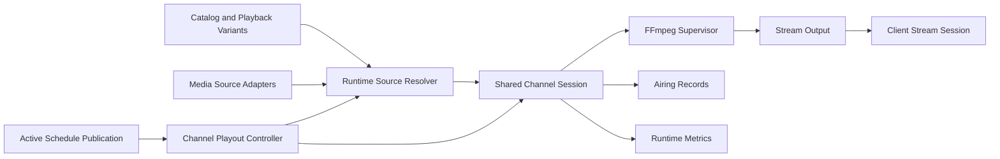

# ChannelForge Playout and Output Specification

- **Specification version:** 0.1
- **Status:** Draft
- **Last updated:** 2026-07-27

## Purpose

This document defines how ChannelForge turns an approved Schedule Publication
into live television output.

It specifies:

- Playout control
- Schedule Entry activation
- Source and Playback Variant resolution
- Shared Channel Sessions
- Client Stream Sessions
- FFmpeg process management
- Direct play, remux, and transcode decisions
- Continuity and timing
- Failure recovery
- Presentation assets
- Filler, Off-Air, and error slates
- IPTV playlist output
- XMLTV guide output
- HDHomeRun-compatible output
- Stream endpoint behavior
- Output identity
- Publication artifacts
- Resource controls
- Security
- Observability
- Persistence expectations
- Testing requirements

This document does not define:

- Media-source adapter payloads
- Catalog synchronization
- Schedule-generation algorithms
- REST route syntax
- Physical SQLite schemas

Those concerns are defined in the media catalog, scheduling, integrations, API,
and persistence specifications.

## Playout Mission

ChannelForge must deliver a stable linear channel from approved schedule state.

Playout must:

- Follow the active Schedule Publication
- Start at the correct point in the scheduled program
- Resolve a currently playable source
- Produce client-compatible output
- Maintain continuity across program boundaries
- Recover predictably from source and process failures
- Preserve the editorial schedule without rewriting it
- Record what actually aired
- Expose diagnostics without leaking credentials

The playout runtime is operational machinery. It does not decide what the
Network should program.

## Scope

Version 1 supports:

- One active logical Channel stream per Channel
- Shared Channel Sessions
- Multiple Client Stream Sessions joining one Channel Session
- On-demand Channel Session startup
- Optional prewarming
- Direct source proxying where safe
- Remuxing
- Video transcoding
- Audio transcoding
- MPEG transport stream output
- HLS output where supported
- IPTV M3U output
- XMLTV output
- HDHomeRun-compatible discovery and lineup output
- Presentation assets
- Filler
- Off-Air
- Error slates
- Source fallback
- Playback Variant fallback
- FFmpeg supervision
- Airing Records

Version 1 does not require:

- Distributed multi-host playout
- Frame-accurate broadcast automation
- SCTE-35 insertion
- DRM removal
- Per-viewer personalized schedules
- Cloud transcoding
- Multi-region failover
- Broadcast SDI output
- Automatic rights enforcement
- A commercial ad auction platform

## Architectural Separation



The separation is:

1. Schedule Publication says what should be airing.
2. Catalog says which source bindings and variants may be used.
3. Integration adapters resolve source-specific playback access.
4. Playout selects and executes a runtime decision.
5. FFmpeg or a direct proxy produces output.
6. Client sessions consume the output.
7. Airing Records capture what actually occurred.

## Core Principles

1. Playout consumes approved schedule state.
2. Playout never silently rewrites Schedule Entries.
3. Runtime source selection is independent of scheduling identity.
4. Final playback URLs are resolved as late as practical.
5. One logical Channel timeline is shared across viewers.
6. Joining a Channel does not restart the program.
7. FFmpeg processes are supervised and attributable.
8. Source and process failures invoke explicit recovery policy.
9. Every recovery action is recorded.
10. Output identity is consistent across M3U, XMLTV, HDHomeRun, and streams.
11. Guide publication and stream publication are separately observable.
12. Credentials and signed URLs are redacted.
13. The last valid guide or playlist remains available after regeneration failure.
14. Runtime state is reconstructable after process restart where practical.
15. Version 1 remains operable in one container with SQLite.

## Playout Terms

### Channel Playout Controller

The Channel Playout Controller determines what should currently be airing and
coordinates the Channel Session.

### Channel Session

A Channel Session is the shared runtime execution of one Channel timeline.

It may exist with zero or more attached Client Stream Sessions.

### Client Stream Session

A Client Stream Session represents one client consuming a Channel output.

### Playout Decision

A Playout Decision records how one Schedule Entry was resolved at runtime.

### Playback Variant

A Playback Variant is one playable realization of a Catalog Item.

### Output Profile

An Output Profile defines the required stream characteristics.

### Direct Play

Direct Play passes source media without container or codec transformation.

### Remux

Remux changes the container or stream packaging without re-encoding the primary
media streams.

### Transcode

Transcode re-encodes video, audio, subtitles, or some combination.

### Runtime Offset

Runtime Offset is the elapsed position within the active Schedule Entry at the
time playout begins or resumes.

### Continuity Boundary

A Continuity Boundary is the transition from one Schedule Entry to the next.

### Recovery Policy

Recovery Policy defines actions after source, process, or timing failure.

### Published Artifact

A Published Artifact is a materialized XMLTV, M3U, lineup, or related output
associated with a Schedule Publication.

## Playout Inputs

Required inputs include:

- Channel ID
- Active Schedule Publication ID
- Current UTC instant
- Schedule Entry sequence
- Catalog Item references
- Presentation instructions
- Output Configuration
- Output Profile
- Media Source health
- Eligible Source Bindings
- Eligible Playback Variants
- Source credentials through secret references
- Runtime recovery policy
- Hardware-transcoding configuration
- Channel branding and slates
- Client protocol request

Optional inputs include:

- Preferred Source Binding hint
- Preferred Playback Variant hint
- Warm session state
- Prior Playout Decision
- Recent source failures
- Client capability hints
- Direct-play observations
- Resume checkpoint
- Maintenance override
- Manual operator action

## Time Authority

### UTC Clock

Playout uses a monotonic-capable system clock anchored to UTC.

Schedule Entry activation is based on persisted UTC start and end instants.

### Monotonic Timing

Elapsed process and session timing should use a monotonic clock where available.

Wall-clock changes must not cause negative elapsed durations.

### Clock Drift

ChannelForge must detect material drift between:

- System wall clock
- Monotonic elapsed time
- Expected Schedule Entry position
- FFmpeg reported progress
- Output segment timestamps

Drift thresholds are configurable.

### Time Synchronization Dependency

ChannelForge does not provide host NTP.

The Docker host is responsible for accurate time.

ChannelForge must expose a warning when detected clock anomalies threaten
schedule alignment.

## Active Schedule Resolution

At any instant, the Channel Playout Controller resolves:

- Active Schedule Publication
- Active Schedule Entry
- Entry start
- Entry end
- Entry kind
- Catalog Item
- Runtime Offset
- Upcoming entry
- Upcoming continuity boundary
- Current publication revision

The lookup must be deterministic.

## Entry Selection Rules

For a valid active publication:

- The active entry contains the current instant.
- Entry intervals are treated as half-open.
- Exact end instant belongs to the next entry.
- A Carry-In entry may begin before the publication's visible horizon.
- A Carry-Out entry may extend beyond the requested horizon.
- Explicit Off-Air entries remain active entries.
- An uncovered interval is a publication defect, not implicit Off-Air.

## Runtime Offset

Conceptually:

```text
runtimeOffset = currentInstant - scheduleEntry.startInstant
```

Runtime Offset is clamped only according to explicit recovery policy.

If the source cannot seek to the required offset:

- Another Playback Variant may be tried.
- A transcode path may be used.
- The entry may be skipped.
- A fallback may be inserted.
- The session may begin at source start only when policy allows it.

## Joining in Progress

A client joining an active Channel must receive the current program at the
current timeline position.

Joining must not:

- Restart the program
- Create a viewer-specific schedule
- Mutate the Schedule Publication
- Advance the shared Channel timeline

A shared Channel Session is preferred when output requirements are compatible.

## Channel Session Lifecycle

Suggested states:

- `IDLE`
- `PREPARING`
- `STARTING`
- `RUNNING`
- `TRANSITIONING`
- `RECOVERING`
- `DRAINING`
- `STOPPING`
- `STOPPED`
- `FAILED`

### Idle

No Channel Session is running.

### Preparing

Inputs, publication, source options, and output resources are being resolved.

### Starting

The source and output pipeline are starting.

### Running

Output is being produced.

### Transitioning

The session is moving between Schedule Entries.

### Recovering

A failure policy is being executed.

### Draining

No new clients are accepted while existing buffered output completes.

### Stopping

Processes and resources are being terminated.

### Stopped

No active runtime resources remain.

### Failed

The session could not recover within policy.

## Channel Session Identity

A Channel Session includes:

- `playoutSessionId`
- Channel ID
- Active Publication ID
- Output Profile ID
- Session state
- Started timestamp
- Current Schedule Entry ID
- Current Playout Decision ID
- FFmpeg process reference
- Output endpoint reference
- Client count
- Last activity timestamp
- Recovery count
- End timestamp
- End reason

A restarted Channel Session receives a new session ID.

## On-Demand Startup

Version 1 may start a Channel Session when the first client requests the stream.

Startup flow:

1. Authorize request.
2. Resolve Channel and active publication.
3. Acquire per-Channel session coordination.
4. Reuse compatible running session when available.
5. Resolve active Schedule Entry.
6. Resolve source and Playback Variant.
7. Calculate Runtime Offset.
8. Build output pipeline.
9. Start process or direct proxy.
10. Confirm output readiness.
11. Attach client.
12. Record session and Playout Decision.

## Prewarming

A Channel may be prewarmed before:

- Expected client access
- Fixed event
- Schedule boundary
- Publication activation
- Planned maintenance end

Prewarming may:

- Resolve source access
- Start FFmpeg
- Buffer initial output
- Validate hardware resources

Prewarming must not create duplicate Channel timelines.

## Idle Shutdown

A Channel Session may stop after:

- No attached clients
- Configured idle timeout
- No prewarm requirement
- No recording or monitoring consumer
- Safe continuity boundary
- No operator hold-open

Idle shutdown policy must balance resource use and startup latency.

## Persistent Always-On Channels

A Channel may be configured as always-on.

Always-on policy may be useful for:

- Faster joins
- Continuous monitoring
- Stable upstream client behavior
- External recording systems

Resource limits still apply.

## Client Stream Session

Required conceptual fields:

- `clientSessionId`
- Channel Session ID
- Client protocol
- Client identity or anonymous token
- Remote address classification
- Start timestamp
- Last activity timestamp
- Output profile
- Bytes sent
- Disconnect timestamp
- Disconnect reason

Client identity must be handled according to privacy and retention policy.

## Shared Versus Dedicated Sessions

A shared Channel Session may serve multiple clients when:

- Output protocol is compatible
- Output Profile is compatible
- Access policy permits sharing
- Timeline position is common
- Buffer strategy supports fan-out

A dedicated session may be required when:

- Client requires a different codec
- Client requires a different resolution
- Client requires a different subtitle treatment
- Client seeks independently
- Client uses incompatible protocol
- Access policy requires isolation

Dedicated sessions still follow the same Channel Schedule Publication.

## Output Profiles

An Output Profile defines target characteristics.

Suggested fields:

- Profile ID
- Name
- Container
- Transport
- Video codec
- Audio codec
- Maximum width
- Maximum height
- Maximum frame rate
- Maximum video bit rate
- Audio channel policy
- Subtitle policy
- Segment duration
- Latency target
- Hardware acceleration preference
- Client compatibility labels
- Stream mode preference

## Stream Mode Preference

Suggested modes:

- `AUTO`
- `DIRECT`
- `REMUX`
- `TRANSCODE`
- `TRANSCODE_VIDEO_ONLY`
- `TRANSCODE_AUDIO_ONLY`

`AUTO` evaluates compatibility and policy.

## Compatibility Evaluation

Compatibility considers:

- Source container
- Video codec
- Audio codec
- Subtitle format
- Resolution
- Frame rate
- Bit rate
- HDR format
- Interlace state
- Audio channels
- Client protocol
- Output transport
- Hardware support
- Watermark or overlay requirement
- Required seek behavior

Compatibility decisions must be recorded.

## Direct Play

Direct Play is allowed only when:

- Source access can begin at the required offset
- Container is acceptable
- Codecs are acceptable
- Timing is stable
- Client or shared output supports the source
- No required transformation applies
- Credentials can remain protected
- Recovery monitoring is sufficient

Direct Play may still use a controlled proxy.

## Direct Proxy

A Direct Proxy forwards source bytes through ChannelForge.

Benefits:

- Hides source credentials
- Centralizes authorization
- Records session metrics
- Normalizes client endpoint
- Supports cancellation

A Direct Proxy must avoid unbounded buffering.

## Remux

Remux is preferred when codecs are compatible but packaging is not.

Typical transformations may include:

- Source container to MPEG-TS
- Source container to HLS segments
- Timestamp normalization
- Stream selection
- Subtitle removal
- Audio track selection
- Metadata cleanup

Remux does not guarantee zero CPU cost.

## Transcode

Transcode is used when required by:

- Codec incompatibility
- Resolution limit
- Bit-rate limit
- Frame-rate limit
- HDR conversion
- Interlace handling
- Audio incompatibility
- Subtitle burn-in
- Presentation overlays
- Watermarks
- Source seek limitations
- Output continuity constraints

## Video Transcode Policy

A Video Transcode Policy may define:

- Encoder
- Hardware device
- Pixel format
- Profile
- Level
- Rate-control mode
- Target bit rate
- Maximum bit rate
- Buffer size
- GOP length
- Keyframe interval
- Scaling behavior
- Deinterlace behavior
- HDR handling
- Color conversion
- Thread limits

## Audio Transcode Policy

An Audio Transcode Policy may define:

- Encoder
- Target bit rate
- Channel layout
- Sample rate
- Loudness normalization
- Language preference
- Downmix policy
- Passthrough policy

## Subtitle Policy

Suggested policies:

- `DISABLED`
- `PASSTHROUGH_WHEN_SUPPORTED`
- `EXTERNAL_WHEN_SUPPORTED`
- `BURN_SELECTED`
- `BURN_FORCED_ONLY`
- `AUTO`

Subtitle treatment must be part of compatibility evaluation.

## Audio Track Selection

Audio selection may consider:

- Preferred language
- Original language
- Default flag
- Commentary exclusion
- Descriptive-audio preference
- Channel-count policy
- Codec compatibility
- User or Channel override

The selected track is recorded in the Playout Decision.

## Subtitle Track Selection

Subtitle selection may consider:

- Preferred language
- Forced flag
- Hearing-impaired flag
- Default flag
- Compatibility
- Burn-in requirement

## FFmpeg Boundary

FFmpeg is treated as an external supervised process.

ChannelForge owns:

- Command construction
- Process launch
- Environment
- Standard input
- Standard output
- Standard error
- Progress parsing
- Timeouts
- Termination
- Resource association
- Diagnostics
- Cleanup

FFmpeg does not own:

- Schedule state
- Catalog identity
- User authorization
- Source credentials beyond process input
- Publication decisions

## FFmpeg Command Builder

The command builder must use typed input structures.

It must not concatenate unvalidated arbitrary command fragments from users,
templates, or packs.

Inputs include:

- Source access descriptor
- Runtime Offset
- Input format hints
- Selected streams
- Filters
- Output Profile
- Hardware configuration
- Presentation requirements
- Output transport
- Logging mode
- Progress reporting

## Command Argument Safety

Arguments must be passed as an argument array where supported.

Validation must prevent:

- Shell injection
- Arbitrary file access
- Unapproved protocols
- Unapproved network destinations
- Unsafe filter expressions
- Secret leakage
- Output path traversal
- Excessive resource requests

## FFmpeg Environment

The process environment should include only required variables.

Secrets should be supplied through the safest available mechanism.

The environment must not inherit unrelated sensitive host variables without
explicit need.

## Progress Reporting

FFmpeg progress should be parsed through a machine-readable progress channel
where supported.

Observed values may include:

- Process time
- Output time
- Frames
- Speed
- Bit rate
- Dropped frames
- Duplicated frames
- Total size
- End state

Progress parsing must tolerate partial and malformed output.

## Standard Error Handling

FFmpeg standard error is diagnostic data.

It must be:

- Captured with bounded retention
- Structured where practical
- Redacted
- Associated with session and attempt IDs
- Available to authorized operators
- Excluded from ordinary client responses

## Process Identity

A process record includes:

- Process reference ID
- Operating-system process ID
- Playout Session ID
- Schedule Entry ID
- Command checksum
- Start timestamp
- Last progress timestamp
- Exit timestamp
- Exit code
- Termination reason

Operating-system process ID is not a stable domain identity.

## Process Startup Timeout

A startup timeout detects:

- Source connection stall
- Hardware initialization failure
- Invalid command
- Missing executable
- Permission failure
- No output produced

Startup timeout invokes recovery policy.

## Process Stall Detection

A process is stalled when:

- No progress arrives within threshold
- Output time does not advance
- Output bytes stop unexpectedly
- Segment publication stops
- Source remains connected but inactive

Stall detection must account for intentionally static slates.

## Process Termination

Termination sequence may include:

1. Stop accepting new clients.
2. Request graceful process stop.
3. Wait configured grace period.
4. Send termination signal.
5. Wait configured force period.
6. Force kill.
7. Close pipes and files.
8. Release hardware reservation.
9. Record outcome.

## Orphan Detection

On application startup, ChannelForge must detect or avoid unmanaged FFmpeg
processes created by prior application instances.

Possible strategies:

- Process-group ownership
- PID files with start-time verification
- Parent-death behavior
- Container lifecycle cleanup
- Session lease records
- Command identity markers

A stale PID alone is insufficient proof of process ownership.

## Hardware Acceleration

Version 1 may support configured hardware acceleration such as:

- Intel Quick Sync
- VA-API
- NVIDIA NVENC
- VideoToolbox
- Other supported FFmpeg backends

Exact support is deployment-dependent.

## Hardware Device Configuration

Configuration may include:

- Device type
- Device path
- Encoder names
- Decoder names
- Filter compatibility
- Maximum concurrent sessions
- Preferred profiles
- Fallback to software
- Health state

## Hardware Reservation

A hardware reservation protects finite encoder capacity.

A reservation includes:

- Reservation ID
- Device ID
- Session ID
- Encoder class
- Start timestamp
- Last heartbeat
- Release timestamp

## Hardware Fallback

When hardware initialization fails, policy may:

- Retry
- Use another hardware device
- Fall back to software
- Reduce output profile
- Use remux
- Fail session

Fallback is recorded.

## Resource Management

Resources to control include:

- CPU
- Memory
- Hardware encoder slots
- Network bandwidth
- Open files
- Process count
- Segment storage
- Client count
- Source connections

## Resource Policy

Policy may define:

- Maximum concurrent Channel Sessions
- Maximum dedicated client sessions
- Maximum transcodes
- Maximum software transcodes
- Per-Channel client limit
- Per-source connection limit
- Queue timeout
- Priority
- Preemption behavior

## Session Priority

Suggested priority inputs:

- Always-on Channel
- Active viewer count
- Manual operator priority
- Output profile cost
- Fixed event
- Health monitoring
- Background preview

Version 1 should avoid automatic preemption unless explicitly configured.

## Source Resolution

The Runtime Source Resolver selects an eligible Source Binding and Playback
Variant.

Inputs include:

- Catalog Item ID
- Output Profile
- Runtime Offset
- Source health
- Binding state
- Variant state
- Recent failures
- Preferred source
- Preferred variant
- Direct-play capability
- Transcode capability
- Required credentials
- Source connection limits

## Source Ranking

Recommended ranking factors:

1. Eligible and available
2. Compatible with output
3. Preferred source policy
4. Direct play or remux suitability
5. Verified recent success
6. Required offset seekability
7. Variant quality
8. Source load
9. Recent failure penalty
10. Stable deterministic tie-break

## Source Resolver Output

A source resolution includes:

- Source Binding ID
- Playback Variant ID
- Access method
- Expiration
- Required headers
- Required cookies
- Seek method
- Compatibility result
- Expected duration
- Selected streams
- Source adapter version
- Resolution timestamp

Sensitive values are kept in restricted runtime structures.

## Source Access Descriptor

A Source Access Descriptor may contain:

- URL
- Local path
- Headers
- Cookies
- Token reference
- Protocol
- Expiration
- Seek support
- Range support
- Input format hint

It must never be returned through ordinary management APIs.

## Source Verification

Before starting, ChannelForge may verify:

- Source availability
- Access authorization
- Media-part existence
- Seek support
- Expected duration
- Range support
- Source response type

Verification must be bounded.

## Preferred Variant Hint

A Schedule Entry may carry a preferred source or variant hint.

The hint is advisory.

Runtime may select another option when:

- Preferred source is unavailable
- Preferred variant is incompatible
- Output profile changed
- Hardware availability changed
- Seek support is insufficient
- Recent failure policy applies

## Playout Decision

Required conceptual fields:

- `playoutDecisionId`
- Playout Session ID
- Schedule Entry ID
- Catalog Item ID
- Source Binding ID
- Playback Variant ID
- Output Profile ID
- Stream mode
- Runtime Offset
- Video decision
- Audio decision
- Subtitle decision
- Hardware decision
- Resolution timestamp
- Source adapter version
- Reason summary
- Fallback lineage

## Playout Attempt

A Playout Decision may have multiple attempts.

An attempt includes:

- Attempt ID
- Decision ID
- Attempt number
- Source Binding ID
- Playback Variant ID
- FFmpeg process reference
- Start timestamp
- End timestamp
- Outcome
- Failure classification
- Recovery action

## Attempt Outcomes

Suggested outcomes:

- `STARTED`
- `COMPLETED`
- `SOURCE_FAILED`
- `PROCESS_FAILED`
- `STALLED`
- `TIMED_OUT`
- `CANCELLED`
- `REPLACED`
- `SKIPPED`

## Schedule Entry Activation

When a new Schedule Entry becomes active:

1. Confirm active publication has not changed unexpectedly.
2. Finalize previous Airing Record.
3. Resolve the new entry.
4. Create Playout Decision.
5. Start or transition output.
6. Confirm output readiness.
7. Mark entry actual start.
8. Update session state.
9. Prepare upcoming transition.

## Transition Strategy

Suggested strategies:

- `HARD_CUT`
- `SEAMLESS_RESTART`
- `PREBUFFERED_SWITCH`
- `CONCAT_PIPELINE`
- `CROSSFADE`
- `FADE_TO_BLACK`
- `SLATE_BRIDGE`

Version 1 may initially use hard cuts or controlled process restarts.

## Hard Cut

The current source ends and the next source starts.

Hard Cut is simple but may create:

- Brief client buffering
- Timestamp discontinuity
- Audio pop
- Segment boundary delay

## Seamless Restart

A stable output layer remains while the input process changes.

This may use:

- Persistent segmenter
- Named pipes
- Intermediate transport
- Supervisor-managed handoff

## Prebuffered Switch

The next source is opened before the boundary.

Prebuffering must:

- Respect source connection limits
- Avoid premature airing
- Bound memory
- Validate readiness
- Release unused resources

## Concat Pipeline

Multiple inputs may be prepared for continuous FFmpeg processing.

This can improve continuity but complicates:

- Dynamic failures
- Source authentication
- Long-running command state
- Regeneration
- Publication changes

## Crossfade

Crossfade is optional and requires:

- Compatible audio and video
- Sufficient overlap
- Explicit presentation policy
- Transcode path
- Known durations

Crossfade must not alter scheduled guide boundaries without policy.

## Timestamp Continuity

Output timestamps must remain valid for the chosen transport.

The runtime may:

- Regenerate timestamps
- Normalize discontinuities
- Reset segment sequence under protocol rules
- Mark HLS discontinuities
- Restart transport stream

Client compatibility testing determines defaults.

## Drift Management

Potential drift sources:

- Source duration mismatch
- FFmpeg processing speed
- Startup latency
- Buffering
- Incorrect source timestamps
- Transition latency
- Hardware behavior

## Drift Measurement

The runtime compares:

- Scheduled elapsed time
- Actual output elapsed time
- FFmpeg progress
- Segment timestamps
- Entry source duration

## Drift Correction

Policies may include:

- Adjust next Runtime Offset
- Trim only trim-safe filler
- Extend or shorten filler
- Skip expired presentation asset
- Restart at exact next boundary
- Insert slate
- Record uncorrected drift

Ordinary program media must not be silently time-stretched or trimmed unless
explicitly configured.

## Late Startup

When a Channel Session starts after an entry began:

- Calculate Runtime Offset.
- Seek to the current point.
- Start output.
- Record actual session start separately from planned entry start.

The Airing Record may represent only the portion actually output by that session
unless an always-on monitoring source confirms prior airing.

## Early Source End

A source may end before the scheduled entry end.

Policy may:

- Try alternate variant
- Retry from expected offset
- Insert filler for remaining interval
- Show error slate
- Advance early to next entry if allowed
- Mark partial airing
- Fail session

The Schedule Entry remains unchanged.

## Source Overrun

A source may continue beyond expected duration.

ChannelForge should stop it at the scheduled boundary unless:

- Schedule Entry explicitly permits Carry-Out
- Publication timing changed
- Operator override applies

## Schedule Publication Change

When active publication changes:

- New clients use the new publication.
- Existing Channel Session evaluates handoff policy.
- Already-started entry may be protected.
- Freeze-window policy applies.
- Guide and stream output must converge predictably.
- Publication change is auditable.

## Publication Handoff Policies

Suggested policies:

- `AT_NEXT_ENTRY`
- `AT_EXACT_EFFECTIVE_TIME`
- `AFTER_CURRENT_PROGRAM`
- `MANUAL_RESTART`

The selected policy is part of Schedule Publication activation.

## Already-Started Entry Protection

By default, a publication change does not interrupt an already-started ordinary
program unless the new publication explicitly requires an exact handoff.

## Airing Record

An Airing Record captures actual runtime outcome.

Required conceptual fields:

- `airingRecordId`
- Channel ID
- Publication ID
- Schedule Plan ID
- Schedule Entry ID
- Catalog Item ID
- Planned start
- Planned end
- Actual start
- Actual end
- Outcome
- Playout Decision ID
- Source Binding ID
- Playback Variant ID
- Recovery events
- Interruption duration
- Output profile
- Created timestamp

## Airing Outcomes

Suggested outcomes:

- `COMPLETED`
- `PARTIAL`
- `SKIPPED`
- `FAILED`
- `FALLBACK_PLAYED`
- `OFF_AIR`
- `SLATE_PLAYED`
- `NOT_OBSERVED`

## Airing Observation

A Channel Session that starts late cannot prove that earlier content aired.

The Airing Record must distinguish:

- Actual output observed by ChannelForge
- Planned but not observed
- Inferred continuous output
- Client-attached output only

## Presentation Assets

Presentation entries include:

- Bumpers
- Idents
- Promos
- Advertisements
- Rating cards
- Slates
- Watermarks
- Technical messages

They follow the same source resolution and process supervision principles.

## Presentation Asset Validation

Before activation, assets must have:

- Valid managed reference
- Known duration where required
- Supported format
- Safe path
- Expected checksum
- Valid dimensions
- Applicable assignment

## Watermarks and Overlays

Watermarks may require transcode.

Configuration may include:

- Asset
- Position
- Opacity
- Scale
- Margin
- Time range
- Burn-in policy
- Channel or Network scope

The output decision must record when overlays forced transcode.

## Rating Cards

Rating cards may be inserted before applicable programs.

The scheduling layer should normally create explicit Schedule Entries for cards
that consume timeline duration.

Runtime-only overlays must not cause hidden schedule drift.

## Filler

Filler is scheduled content.

Runtime filler may also be used as recovery content when policy permits.

Recovery filler must be recorded separately from planned filler.

## Recovery Filler

Recovery filler selection considers:

- Remaining entry interval
- Current Channel identity
- Duration
- Repeat policy
- Availability
- Trim or loop capability
- Output compatibility

## Off-Air

Off-Air is an explicit Schedule Entry or operational override.

Off-Air output may be:

- Static slate
- Motion slate
- Silent black
- Color bars
- Configured loop
- HTTP status response

The selected behavior must be client-compatible.

## Error Slate

An Error Slate informs viewers of a technical failure.

It may include:

- Channel branding
- Generic technical message
- Expected recovery behavior
- No sensitive diagnostics

Detailed errors belong in management diagnostics.

## Maintenance Mode

A Channel may enter maintenance mode.

Maintenance behavior includes:

- Stop ordinary source resolution
- Serve maintenance slate
- Preserve active publication
- Reject or allow clients according to policy
- Record maintenance interval
- Resume at current timeline position

## Failure Classification

Suggested failure classes:

- `NO_ACTIVE_PUBLICATION`
- `NO_ACTIVE_ENTRY`
- `CATALOG_ITEM_MISSING`
- `NO_ELIGIBLE_SOURCE`
- `SOURCE_AUTHENTICATION`
- `SOURCE_UNAVAILABLE`
- `SOURCE_TIMEOUT`
- `SOURCE_SEEK_FAILED`
- `VARIANT_INCOMPATIBLE`
- `FFMPEG_NOT_FOUND`
- `FFMPEG_START_FAILED`
- `FFMPEG_EXITED`
- `FFMPEG_STALLED`
- `HARDWARE_UNAVAILABLE`
- `OUTPUT_WRITE_FAILED`
- `CLIENT_DISCONNECTED`
- `RESOURCE_LIMIT`
- `PUBLICATION_CHANGED`
- `CLOCK_ANOMALY`
- `UNKNOWN`

## Recovery Hierarchy

A recommended recovery hierarchy:

1. Retry current source access.
2. Retry current Playback Variant.
3. Select alternate Playback Variant.
4. Select alternate Source Binding.
5. Change stream mode.
6. Fall back from hardware to software.
7. Reduce output profile if policy permits.
8. Insert recovery filler.
9. Serve error slate.
10. Advance to next eligible Schedule Entry.
11. Stop Channel Session.

Each transition is recorded.

## Retry Policy

Retry policy defines:

- Maximum attempts
- Initial delay
- Backoff multiplier
- Maximum delay
- Retryable failures
- Non-retryable failures
- Jitter policy
- Source cooldown
- Attempt budget

Jitter must be deterministic or operationally bounded where reproducibility is
not required.

## Circuit Breaker

A Media Source may enter degraded runtime state after repeated failures.

Circuit-breaker states:

- `CLOSED`
- `OPEN`
- `HALF_OPEN`

The breaker is operational state and does not rewrite Catalog availability
history.

## Source Failure Penalty

Recent source failure may lower source ranking.

Penalty includes:

- Failure class
- Failure count
- Last failure time
- Success since failure
- Source-wide versus item-specific scope

## Recovery Window

Recovery actions must respect remaining scheduled time.

A lengthy retry near entry end may be worse than advancing or inserting a slate.

## Maximum Recovery Time

A policy may define maximum recovery time per entry.

After the limit, the runtime selects terminal fallback.

## Client Disconnection

A client disconnect does not necessarily indicate Channel Session failure.

For shared sessions:

- Client count decreases.
- Session may continue.
- Idle shutdown policy applies.

## Output Write Failure

Output failure may indicate:

- Broken pipe
- Segment storage failure
- Client disconnect
- Reverse-proxy timeout
- Disk full
- Permission failure

Shared output infrastructure must distinguish one client failure from Channel
Session failure.

## IPTV Playlist Output

ChannelForge publishes an M3U or M3U8 playlist describing active Channels.

## Playlist Entry

Each Channel playlist entry includes:

- Canonical Channel ID
- Display name
- Channel number
- Group or Network name
- Logo URL
- Stream URL
- Guide channel ID
- Optional metadata supported by clients

## Playlist Identity

The playlist and XMLTV must use matching guide channel identifiers.

Channel IDs must remain stable across publication regeneration.

## Playlist Ordering

Default ordering:

1. Channel major number
2. Channel minor number
3. Display name
4. Channel ID

Ordering is deterministic.

## Playlist URL Construction

URLs use configured public base URL or request-aware safe construction.

Reverse-proxy headers are trusted only according to trusted-proxy policy.

## Playlist Artifact

A materialized playlist includes:

- Artifact ID
- Publication set or instance revision
- Content checksum
- Generated timestamp
- Channel count
- Base URL context
- Generator version
- Storage reference, when cached

## Playlist Regeneration

Playlist regeneration is triggered by:

- Channel activation
- Channel archival
- Channel-number change
- Display-name change
- Logo change
- Stream endpoint change
- Access policy change
- Output configuration change

A failed regeneration must not delete the last valid playlist.

## XMLTV Output

XMLTV describes Channels and scheduled programs.

## XMLTV Channel

Each Channel element derives from canonical Output Identity.

It may include:

- Guide channel ID
- Display names
- Channel number
- Icon
- Source URL metadata where appropriate

## XMLTV Programme

Each Programme derives from an approved Schedule Entry guide snapshot.

It may include:

- Start
- Stop
- Channel ID
- Title
- Subtitle
- Description
- Category
- Episode number
- Original air date
- Release year
- Rating
- Icon
- New or repeat indicator
- Credits
- Language
- Previously shown information

## XMLTV Time Format

XMLTV timestamps include explicit UTC offset or normalized UTC according to
generator policy.

The output must be valid across daylight-saving transitions.

## XMLTV Entry Inclusion

Policy defines whether to include:

- Programs
- Bumpers
- Idents
- Promos
- Advertisements
- Filler
- Off-Air
- Error slates

Hidden presentation entries may be merged into adjacent guide intervals only
when the published guide remains temporally consistent.

## Guide Snapshot Authority

Approved Schedule Entry guide snapshots are authoritative for published XMLTV.

Later Catalog metadata changes do not silently alter an existing publication.

## XML Escaping

All XML values must be safely escaped.

Invalid control characters must be rejected or normalized.

## XMLTV Artifact

Required conceptual fields:

- Artifact ID
- Publication revision
- Channel set revision
- Generator version
- Generated timestamp
- Validity interval
- Content checksum
- Programme count
- Validation result
- Storage reference

## XMLTV Validation

Validation includes:

- Well-formed XML
- Valid timestamps
- Known Channel IDs
- Nonnegative programme duration
- No impossible ordering
- Required title presence
- Safe encoding
- Artifact size bounds

## XMLTV Regeneration

Regeneration is triggered by:

- Schedule Publication activation
- Guide snapshot correction through explicit workflow
- Channel identity change
- Horizon extension
- Artifact expiration
- Generator version change

The last valid artifact remains available until replacement succeeds.

## Guide Horizon

The XMLTV horizon may include:

- Current program
- Previous buffer
- Future approved schedule range
- Configured maximum days

Unapproved plans are excluded.

## HDHomeRun-Compatible Output

ChannelForge may expose HDHomeRun-compatible discovery and lineup behavior.

Exact routes are defined in the API specification.

## Device Identity

HDHomeRun-compatible identity includes:

- Device ID
- Friendly name
- Model number
- Firmware name or compatibility label
- Base URL
- Lineup URL
- Tuner count
- Device authentication policy

The device identity is ChannelForge-owned.

## Discovery

Discovery may require:

- HTTP discovery document
- UDP broadcast response
- Configured network interface behavior
- Public or local base URL
- Stable Device ID

Docker and Unraid networking must document UDP requirements.

## Lineup

Lineup entries include:

- Channel number
- Channel name
- Stream URL
- Optional guide or logo data
- DRM state, normally false for supported local media
- Favorite or disabled state where applicable

## Tuner Count

Tuner count represents advertised concurrent stream capacity.

It must align with configured resource policy.

Advertising unlimited tuners when the host cannot support them is prohibited.

## Tuner Allocation

A tuner allocation may map to:

- Shared Channel Session attachment
- Dedicated client session
- Resource reservation
- Client lease

## Lineup Status

Lineup status may expose:

- Scan state
- Source type
- Channel count
- Last update
- Compatibility status

ChannelForge does not perform a physical RF scan.

## IPTV Stream Endpoint

A Channel stream endpoint resolves the active Channel timeline.

It must:

- Authorize the request
- Resolve or create compatible Channel Session
- Attach Client Stream Session
- Return correct content type
- Handle disconnect
- Expose bounded error responses
- Avoid leaking source URLs

## Stream Protocols

Potential version 1 protocols:

- MPEG-TS over HTTP
- HLS
- Direct controlled proxy

Exact enabled protocols depend on implementation and client testing.

## MPEG-TS Output

MPEG-TS is broadly compatible with IPTV clients.

Requirements include:

- Stable packet flow
- Valid timestamps
- Program mapping
- Continuity handling
- Client disconnect detection
- Bounded buffering

## HLS Output

HLS output may include:

- Master playlist
- Media playlist
- Segments
- Sequence numbers
- Target duration
- Discontinuity markers
- Cache headers
- Segment cleanup

## HLS Segment Storage

Segments may be stored:

- In memory
- In temporary managed storage
- Through a local segment service

Storage policy defines:

- Maximum retained duration
- Maximum bytes
- Cleanup cadence
- Crash cleanup
- Client grace period

## HLS Join Behavior

A joining client receives a live window around the current Channel timeline.

The client must not receive segments from an unrelated prior publication after
handoff.

## HLS Discontinuity

A discontinuity marker may be required when:

- Codec parameters change
- Timestamp sequence resets
- Source switches
- FFmpeg restarts
- Publication handoff occurs

## HTTP Response Behavior

Stream responses should define:

- Content type
- Cache policy
- Connection behavior
- Range support
- CORS policy
- Authentication requirements
- Timeout behavior
- Error status mapping

## Range Requests

Range support is generally not appropriate for an infinite live Channel stream.

Source range behavior is internal to runtime resolution.

## CORS

Cross-origin stream access is disabled or restricted by default.

Configuration may allow trusted origins.

## Cache Control

Live stream responses should normally prevent inappropriate intermediary
caching.

Guide and playlist artifacts may use conditional caching with checksums or
entity tags.

## Public Base URL

Output artifacts need a stable base URL.

Configuration may include:

- Scheme
- Host
- Port
- Base path
- Trusted proxy policy
- External hostname
- Internal hostname

The application must not blindly trust arbitrary forwarded headers.

## Output Identity

Every active Channel has one canonical Output Identity.

Required conceptual fields:

- Channel ID
- Guide Channel ID
- Tuner lineup ID
- Display number
- Display name
- Short name
- Network name
- Logo reference
- Stream path
- Active state

## Output Identity Invariants

- M3U uses the same Guide Channel ID as XMLTV.
- HDHomeRun lineup refers to the same Channel identity.
- Stream paths resolve the same Channel timeline.
- Display number changes do not change Channel ID.
- Channel archival removes it from new artifacts without destroying history.

## Output Publication Set

An Output Publication Set groups consistent artifacts.

It may include:

- Active Channel identities
- M3U artifact
- XMLTV artifact
- HDHomeRun lineup artifact
- Publication timestamp
- Content checksums
- Generator versions
- Validity interval

## Atomic Artifact Publication

Artifact generation should use:

1. Generate temporary artifact.
2. Validate.
3. Calculate checksum.
4. Persist metadata.
5. Atomically replace active pointer.
6. Retain prior valid artifact according to policy.

Clients must not receive partially written artifacts.

## Artifact Retention

Retention may include:

- Current artifact
- Previous valid artifact
- Recent historical artifacts
- Failed-generation diagnostics
- Temporary files

Retention is bounded by time and storage.

## Artifact Conditional Requests

Artifacts may support:

- ETag
- Last-Modified
- If-None-Match
- If-Modified-Since

Checksums must be stable for identical content.

## Output Regeneration Jobs

Guide and playlist regeneration run as Background Jobs.

Jobs must be:

- Idempotent
- Observable
- Restart-safe
- Bounded
- Independent of client requests where practical

## Publication Consistency

A Channel stream and guide should reference the same active Schedule Publication
revision.

Temporary propagation lag must be measurable and bounded.

## Guide Versus Actual Airing

XMLTV reflects approved planned schedule.

Airing Records reflect actual runtime outcome.

Version 1 does not rewrite historical guide artifacts after every runtime
failure.

A future now/next status endpoint may expose actual runtime state separately.

## Now/Next Projection

A Now/Next projection may include:

- Channel ID
- Current Schedule Entry
- Current actual Playout Decision
- Planned start and end
- Actual session state
- Next Schedule Entry
- Recovery state
- Source health summary

The projection must not expose credentials.

## Health and Status Output

Management status may include:

- Channel Session state
- Current entry
- Runtime Offset
- Source selected
- Stream mode
- FFmpeg progress
- Client count
- Recent recovery events
- Drift
- Output bit rate
- Hardware use
- Guide artifact freshness
- Playlist artifact freshness

## Security

### Stream Authorization

Possible policies:

- Local network only
- Authenticated session
- API token
- Signed stream token
- Reverse-proxy authentication
- Public access

The default should avoid accidental public exposure.

### Signed Stream Tokens

A signed token may include:

- Channel ID
- Allowed protocol
- Expiration
- Audience
- Nonce
- Optional client binding

Tokens must not embed source credentials.

### Token Validation

Validation must check:

- Signature
- Expiration
- Channel scope
- Protocol scope
- Revocation policy
- Clock tolerance

### Credential Handling

Media-source credentials:

- Remain server-side
- Are resolved through secret storage
- Are not included in M3U unless an explicit ChannelForge access token is used
- Are not logged
- Are not sent to clients
- Are not embedded in XMLTV

### Path Safety

All output and segment paths must remain inside managed storage.

### Protocol Safety

FFmpeg input protocols and output protocols must be allowlisted.

### SSRF Protection

Source URLs originate from configured adapters.

Runtime must prevent arbitrary user-controlled URLs from becoming FFmpeg inputs.

### Diagnostic Redaction

Diagnostics must redact:

- Tokens
- Cookies
- Authorization headers
- Signed URLs
- Local secret paths
- Session secrets

## Reverse Proxy

A reverse proxy may handle:

- TLS
- Authentication
- Compression for guide artifacts
- Connection timeouts
- External hostname
- Access logging

Stream proxy settings must avoid:

- Response buffering
- Short idle timeouts
- Request-body limits that break HLS control requests
- Cache behavior that mixes authenticated streams

## Docker Networking

Version 1 deployment may require:

- TCP port for HTTP
- UDP exposure for tuner discovery
- Host or bridged networking depending on discovery
- Access to media-server addresses
- Hardware device mappings
- Persistent volume
- Temporary storage

Exact mappings are defined in deployment documentation.

## Unraid

The Unraid template must represent the same runtime architecture.

It may expose configuration for:

- HTTP port
- Discovery UDP port
- Data path
- Temporary path
- Hardware devices
- Public base URL
- PUID and PGID where supported
- Time zone
- Resource limits

## Persistence

Persistent playout data includes:

- Playout Sessions
- Playout Decisions
- Playout Attempts
- Airing Records
- Recovery Events
- Process summaries
- Hardware reservations
- Artifact metadata
- Output Publication Sets
- Runtime source penalties
- Maintenance intervals

Ephemeral data includes:

- Active pipes
- In-memory buffers
- Live socket objects
- Temporary source descriptors
- Raw signed URLs
- Process handles

## Restart Recovery

On application restart:

1. Mark stale running sessions for reconciliation.
2. Detect owned or orphaned processes.
3. Reconcile active publication pointers.
4. Release stale hardware reservations.
5. Mark abandoned attempts.
6. Rebuild artifact pointers.
7. Resume always-on Channels according to policy.
8. Leave approved schedule state unchanged.

## Session Lease

A Session Lease may identify runtime ownership.

It includes:

- Session ID
- Application instance ID
- Acquired timestamp
- Heartbeat
- Expiration
- Channel ID

Version 1 may use process-local coordination plus persistent reconciliation.

## Concurrency

### Per-Channel Coordination

Only one shared Channel Session may own a specific Channel and Output Profile
combination unless dedicated behavior is intentional.

### Process Startup Race

Concurrent first-client requests must converge on one session.

### Publication Race

Session startup verifies active publication before and after acquiring ownership.

### Client Attach Race

Client attachment must not occur before output readiness.

### Stop Race

A new client arriving during idle shutdown may:

- Cancel shutdown
- Attach to a replacement session
- Receive bounded retry response

Behavior must be deterministic.

## Resource Cleanup

Cleanup must cover:

- FFmpeg processes
- Pipes
- Sockets
- HLS segments
- Temporary files
- Hardware reservations
- Source connections
- Client records
- Timers
- Leases

Cleanup operations must be idempotent.

## Observability

### Structured Logs

Logs should include:

- Channel ID
- Session ID
- Client Session ID where appropriate
- Publication ID
- Schedule Entry ID
- Playout Decision ID
- Attempt ID
- Source Binding ID
- Playback Variant ID
- Output Profile
- Stream mode
- FFmpeg process reference
- Recovery action
- Error classification
- Duration
- Bytes
- Drift

### Metrics

Suggested metrics:

- Active Channel Sessions
- Active Client Sessions
- Active FFmpeg processes
- Transcode count
- Remux count
- Direct count
- Startup latency
- First-byte latency
- Transition latency
- Recovery count
- Source failure count
- FFmpeg exit count
- Stall count
- Output bit rate
- CPU use
- Hardware encoder use
- Segment storage
- Guide artifact age
- Playlist artifact age
- Clock drift
- Unobserved airing duration

### Tracing

Potential spans:

- Authorize stream
- Resolve publication
- Resolve active entry
- Resolve source
- Resolve variant
- Build command
- Acquire hardware
- Start process
- Wait for output
- Attach client
- Transition entry
- Recover
- Generate XMLTV
- Generate M3U
- Generate lineup

## Alerting

Potential alerts:

- Channel repeatedly failing
- No valid active publication
- Guide artifact stale
- Playlist generation failed
- Hardware exhausted
- FFmpeg missing
- Segment storage full
- Source authentication failed
- Clock anomaly
- Excessive drift
- Orphan process
- No available fallback
- Discovery unavailable

## Playout API Concepts

Exact routes are defined later.

Required conceptual operations include:

- Read Channel runtime status
- Start Channel Session
- Stop Channel Session
- Restart Channel Session
- Attach live stream
- Read current Playout Decision
- Read recent attempts
- Read Airing Records
- Enter maintenance mode
- Exit maintenance mode
- Read hardware status
- Read output artifacts
- Regenerate XMLTV
- Regenerate M3U
- Regenerate lineup
- Read now/next
- Test Output Profile
- Test source resolution
- Download diagnostics

## Operator Controls

Authorized operators may:

- Restart a Channel
- Force source reselection
- Force software fallback
- Enter maintenance
- Stop always-on session
- Regenerate artifacts
- View FFmpeg diagnostics
- Clear source failure penalty
- Test a Channel without publication change

Operator actions must be audited.

## Audit Requirements

Audit records are required for:

- Maintenance mode changes
- Manual session start or stop
- Forced restart
- Forced source selection
- Output Profile changes
- Hardware policy changes
- Public access changes
- Tuner count changes
- Artifact publication rollback
- Freeze or handoff override
- Diagnostic export

Automatic runtime events use structured operational records.

## Compatibility with Tunarr Runtime

The inherited Tunarr runtime may continue to provide:

- FFmpeg command construction
- Stream handling
- XMLTV generation
- M3U generation
- HDHomeRun compatibility
- Existing client behavior

During migration, ChannelForge must isolate inherited behavior behind explicit
interfaces.

New ChannelForge modules should depend on:

- `PlayoutController`
- `RuntimeSourceResolver`
- `ProcessSupervisor`
- `OutputArtifactPublisher`
- `TunerOutputAdapter`
- `GuideOutputAdapter`
- `PlaylistOutputAdapter`

They should not depend directly on legacy database rows or route handlers.

## Compatibility Mode

A migrated Channel may temporarily use a legacy runtime mode.

Compatibility mode must record:

- Legacy runtime version
- Legacy channel mapping
- Output differences
- Removal condition
- Diagnostics
- Migration status

## Playout Repository Boundaries

Suggested repositories:

- `PlayoutSessionRepository`
- `PlayoutDecisionRepository`
- `AiringRecordRepository`
- `RecoveryEventRepository`
- `OutputArtifactRepository`
- `HardwareReservationRepository`
- `MaintenanceIntervalRepository`

## Runtime Services

Suggested services:

- `ChannelTimelineService`
- `RuntimeSourceResolver`
- `OutputCompatibilityService`
- `FfmpegCommandBuilder`
- `FfmpegProcessSupervisor`
- `ChannelSessionManager`
- `ClientSessionManager`
- `TransitionCoordinator`
- `RecoveryCoordinator`
- `AiringRecorder`
- `XmltvGenerator`
- `PlaylistGenerator`
- `HdHomeRunAdapter`
- `OutputPublicationService`

## Test Strategy

### Unit Tests

Required categories:

- Active Schedule Entry lookup
- Runtime Offset
- Output compatibility
- Source ranking
- Variant ranking
- Direct, remux, and transcode decision
- Audio selection
- Subtitle selection
- Command argument construction
- Redaction
- Retry policy
- Circuit breaker
- Drift calculation
- Recovery hierarchy
- Output identity
- Playlist ordering
- XMLTV timestamp formatting
- XML escaping
- HLS segment cleanup
- Tuner allocation
- Artifact checksum

### Process Tests

Process tests should cover:

- Successful startup
- Startup timeout
- Invalid input
- Source authentication failure
- Hardware initialization failure
- Process crash
- Stall
- Graceful stop
- Forced kill
- Orphan reconciliation
- Standard-error bounding
- Progress parsing
- Secret redaction

### Integration Tests

Integration tests should cover:

- Shared Channel Session
- Multiple client attachments
- Client disconnect
- Idle shutdown
- Always-on session
- Late join
- Entry transition
- Publication handoff
- Source fallback
- Variant fallback
- Hardware fallback
- Recovery filler
- Error slate
- Maintenance mode
- XMLTV publication
- M3U publication
- HDHomeRun lineup
- Restart recovery
- SQLite persistence

### Client Compatibility Tests

Representative clients should include:

- Jellyfin Live TV
- Plex DVR or Live TV
- Emby Live TV
- VLC
- IPTV applications
- HDHomeRun-compatible consumers

Exact supported versions are documented separately.

### Golden Artifact Tests

Golden tests should store expected:

- M3U
- XMLTV
- HDHomeRun discovery documents
- HDHomeRun lineup
- Output identity projections
- Now/next responses

### Timing Tests

Timing tests should cover:

- Exact entry boundary
- Late join
- Early source end
- Source overrun
- Transition startup latency
- Clock adjustment
- Drift threshold
- Carry-In
- Carry-Out
- Publication handoff
- Daylight-saving publication data

### Property Tests

Useful properties:

- Joining does not restart the Channel timeline.
- Playout never mutates Schedule Entries.
- Runtime source failure does not change approved plan.
- One shared Channel Session owns one compatible timeline.
- Stopped sessions own no process or hardware reservation.
- Output identity matches across artifact types.
- XMLTV Programme duration is nonnegative.
- Playlist ordering is stable.
- Secrets never appear in redacted diagnostics.
- Failed artifact generation preserves previous valid artifact.
- Recovery actions are recorded.
- Airing Records distinguish planned and actual times.

### Performance Tests

Performance tests should measure:

- First-byte latency
- Channel startup
- Source resolution
- FFmpeg startup
- Client fan-out
- Transition latency
- HLS segment generation
- Artifact generation
- Concurrent Channel Sessions
- Hardware capacity
- Software transcode limits
- Segment cleanup
- SQLite write contention

## Reference Direct-Play Example

Assume:

- Active program is 12 minutes into a movie.
- Jellyfin provides an H.264/AAC MP4.
- Client accepts H.264/AAC MPEG-TS.
- Source supports offset seek.
- No watermark is required.

Expected decision:

- Resolve Jellyfin Source Binding.
- Select the compatible Playback Variant.
- Seek to 12 minutes.
- Remux to MPEG-TS if required.
- Start shared Channel Session.
- Attach client.
- Record Playout Decision and actual start.

## Reference Variant-Fallback Example

Assume:

- Plex 4K variant is preferred.
- Hardware HEVC decode fails.
- Jellyfin has a 1080p H.264 variant.
- Output Profile supports 1080p H.264.

Expected recovery:

1. Record hardware failure.
2. Penalize failed attempt.
3. Resolve alternate Playback Variant.
4. Start Jellyfin 1080p path.
5. Record fallback lineage.
6. Continue same Schedule Entry at corrected Runtime Offset.
7. Keep Schedule Publication unchanged.

## Reference Early-End Example

Assume:

- Scheduled episode duration is 44 minutes.
- Source ends at 42 minutes.
- Two-minute recovery filler is available.

Expected behavior:

- Mark episode Airing Record partial or completed-with-short-source according to
  policy.
- Insert recovery filler for two minutes.
- Record Recovery Event.
- Start next Schedule Entry at its planned boundary.
- Do not rewrite the Schedule Plan.

## Reference Artifact-Failure Example

Assume:

- A new XMLTV artifact is generated.
- XML validation fails because of invalid source text.
- A prior valid XMLTV artifact exists.

Expected behavior:

- Reject new artifact.
- Retain prior artifact as active.
- Record Background Job failure.
- Create diagnostic finding.
- Keep stream output available.
- Avoid serving partial XML.

## Version 1 Required Behaviors

The version 1 playout and output subsystem must:

1. Consume active approved Schedule Publications.
2. Resolve the current Schedule Entry by UTC time.
3. Calculate Runtime Offset.
4. Support late joining.
5. Share compatible Channel Sessions.
6. Track Client Stream Sessions.
7. Resolve eligible Source Bindings.
8. Resolve eligible Playback Variants.
9. Support direct proxy, remux, and transcode decisions.
10. Supervise FFmpeg.
11. Detect startup failure and stall.
12. Terminate abandoned processes.
13. Support source and variant fallback.
14. Support hardware fallback.
15. Record Playout Decisions.
16. Record attempts and recovery events.
17. Record Airing Records.
18. Preserve Schedule Entries unchanged.
19. Support presentation assets.
20. Support planned filler.
21. Support recovery filler.
22. Support explicit Off-Air.
23. Support maintenance slate.
24. Publish M3U.
25. Publish XMLTV.
26. Publish HDHomeRun-compatible discovery and lineup.
27. Use one canonical Channel identity.
28. Preserve last valid artifacts on regeneration failure.
29. Protect source credentials.
30. Remain operable in one Docker container with SQLite.

## Playout Invariants

1. Playout reads approved publication state.
2. Playout does not modify Programming Configuration.
3. Playout does not modify approved Schedule Entries.
4. A client join does not restart the program.
5. Runtime Offset derives from current time and entry start.
6. Final source URLs are resolved at runtime.
7. A Playout Decision records selected source and variant.
8. Recovery actions are separate from editorial schedule.
9. Every owned FFmpeg process belongs to a tracked session.
10. A stopped session owns no active FFmpeg process.
11. A stopped session owns no hardware reservation.
12. Process startup and termination are bounded.
13. Secrets are excluded from ordinary logs and responses.
14. M3U and XMLTV share Guide Channel IDs.
15. HDHomeRun lineup uses the same Channel identity.
16. Failed artifact generation preserves prior valid artifact.
17. XMLTV uses approved guide snapshots.
18. Uncovered schedule gaps are not implicit Off-Air.
19. Recovery filler is recorded.
20. Source failure does not alter Catalog identity.
21. Hardware failure does not alter Schedule Publication.
22. Existing clients and new clients follow explicit publication handoff policy.
23. Output ordering is deterministic.
24. Artifact replacement is atomic.
25. Client disconnect is distinct from Channel failure.
26. Shared output is not stopped while active clients remain unless forced.
27. Runtime diagnostics are attributable.
28. Restart reconciliation is idempotent.
29. Resource limits are enforced before unbounded process creation.
30. Version 1 remains compatible with SQLite and a modular monolith.

## Deferred Playout and Output Decisions

The following decisions remain open:

- Default stream protocol
- Exact HLS implementation
- Exact MPEG-TS continuity strategy
- Exact transition strategy
- Whether one persistent segmenter serves all entry transitions
- Exact direct-play eligibility rules
- Exact output codec defaults
- Exact hardware support matrix
- Exact software-transcode limits
- Default client limit
- Default advertised tuner count
- Default idle shutdown timeout
- Default prewarm interval
- Exact publication handoff default
- Exact drift thresholds
- Exact early-end policy
- Exact recovery filler selection
- Exact error-slate implementation
- Exact signed stream-token format
- Exact UDP discovery implementation
- Exact HDHomeRun compatibility surface
- Exact XMLTV field set
- Exact playlist metadata extensions
- Exact artifact retention
- Exact HLS segment retention
- Exact process-ownership strategy
- Exact session lease implementation
- Exact legacy Tunarr runtime adapter boundaries
- Exact compatibility test matrix
