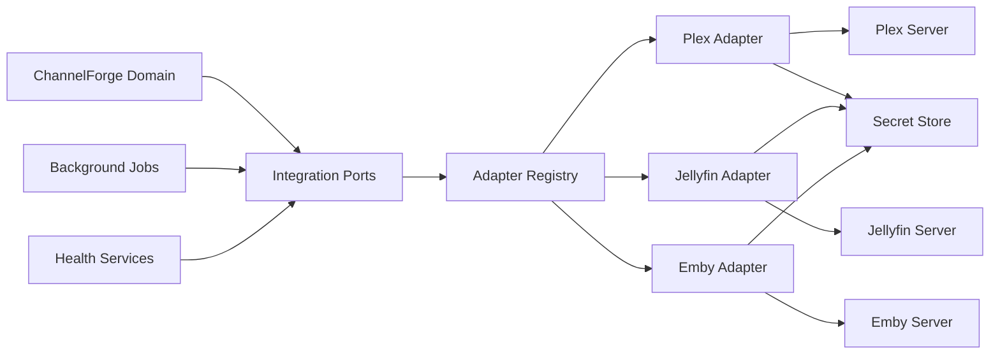

# ChannelForge Integrations Specification

- **Specification version:** 0.1
- **Status:** Draft
- **Last updated:** 2026-07-27

## Purpose

This document defines how ChannelForge integrates with external systems.

It specifies:

- Media Source adapter boundaries
- Plex integration
- Jellyfin integration
- Emby integration
- Authentication and credential handling
- Capability discovery
- Library discovery
- Catalog synchronization
- Artwork access
- Playback source resolution
- Health monitoring
- Incremental synchronization
- Webhook and event handling
- Retry behavior
- Compatibility isolation
- Adapter versioning
- Adapter testing
- Future integration contracts

This document does not define:

- Canonical Catalog Item semantics
- Schedule generation
- FFmpeg command construction
- Public REST routes
- Physical database tables
- Docker deployment details

Those concerns are defined in the media catalog, scheduling, playout, API,
persistence, and deployment specifications.

## Integration Mission

ChannelForge must communicate with external media systems without allowing their
provider-specific models to become the ChannelForge domain model.

An integration must:

- Authenticate securely
- Discover provider capabilities
- Enumerate relevant libraries
- Normalize provider data
- Resolve playback access at runtime
- Report provider failures accurately
- Preserve provider identity and provenance
- Degrade without corrupting unrelated state
- Remain replaceable
- Remain testable without a live provider

The application must not treat Plex, Jellyfin, or Emby as the owner of
ChannelForge identity.

## Scope

Version 1 includes Media Source adapters for:

- Plex
- Jellyfin
- Emby

The integration architecture also supports future adapters for:

- Local file indexes
- Network storage catalogs
- Metadata providers
- Artwork providers
- Scheduling imports
- Monitoring systems
- Authentication providers
- Notification systems
- Backup destinations
- Plugin-provided sources

The exact set enabled in a release depends on implementation maturity.

## Integration Boundary



The domain depends on integration ports.

Adapters depend on provider APIs.

The domain must not depend directly on:

- Plex response types
- Jellyfin response types
- Emby response types
- Provider-specific URL formats
- Provider-specific authentication headers
- Provider-specific pagination structures
- Provider-specific error payloads

## Core Principles

1. External systems are replaceable dependencies.
2. Provider-specific identity remains qualified by Media Source.
3. Provider payloads are normalized before entering the domain.
4. Credentials remain inside restricted integration boundaries.
5. Runtime playback URLs are resolved late.
6. External calls are bounded by timeouts and cancellation.
7. Retries are explicit and classified.
8. Synchronization is idempotent.
9. Adapter behavior is versioned.
10. Provider failures do not mutate unrelated source state.
11. Health is observed separately from catalog availability history.
12. Webhooks are hints, not unquestioned truth.
13. Full reconciliation remains authoritative.
14. Adapters expose capabilities rather than forcing provider assumptions.
15. Compatibility behavior is testable through recorded fixtures.

## Integration Terms

### Integration

An Integration is a configured connection between ChannelForge and an external
system.

### Media Source

A Media Source is an Integration that provides media libraries, metadata,
artwork, and playback access.

### Adapter

An Adapter implements one or more ChannelForge integration ports for a provider.

### Provider

A Provider is the external product or service.

### Provider Instance

A Provider Instance is one configured server or service account.

### Capability

A Capability is a provider behavior detected or declared for one Provider
Instance.

### Credential Reference

A Credential Reference points to secret material without embedding it in normal
domain records.

### Source Descriptor

A Source Descriptor is the normalized configuration required to contact a
Provider Instance.

### Integration Observation

An Integration Observation is a timestamped result from an external call.

### Integration Health

Integration Health summarizes current operational reachability and capability.

### Synchronization Hint

A Synchronization Hint indicates that provider state may have changed.

### Provider Cursor

A Provider Cursor is an opaque provider-specific change or pagination token.

## Integration Aggregate

A Media Source is the principal integration aggregate root.

Required conceptual fields:

- `mediaSourceId`
- Provider type
- Display name
- Base address
- Credential Reference
- Enabled state
- Trust policy
- Connection policy
- Included libraries
- Preferred metadata priority
- Playback priority
- Synchronization policy
- Health state
- Capability snapshot
- Adapter version
- Created timestamp
- Updated timestamp
- Archived timestamp

## Provider Types

Suggested built-in provider types:

- `PLEX`
- `JELLYFIN`
- `EMBY`

Future provider types may include:

- `LOCAL_INDEX`
- `GENERIC_HTTP`
- `METADATA_PROVIDER`
- `CUSTOM_PLUGIN`

Provider type values are stable domain identifiers.

They must not be inferred from display names.

## Source Identity

Every Media Source has a ChannelForge-owned `mediaSourceId`.

Changing:

- Display name
- Hostname
- Port
- Scheme
- Credential
- Preferred source priority

does not automatically create a new Media Source.

A new Media Source is required when the configured provider instance should be
treated as independently addressable and auditable.

## Source Descriptor

A Source Descriptor includes:

- Provider type
- Base URI
- Optional externally reachable URI
- Optional internal URI
- Credential Reference
- TLS policy
- Proxy policy
- Timeout policy
- Custom headers allowed by adapter
- Included library IDs
- Excluded library IDs
- Source labels
- Enabled state

The descriptor must not contain decrypted credential material in ordinary
serialization.

## Internal and External Addresses

A Media Source may require more than one address.

Examples:

- Internal Docker address for server-to-server calls
- External client address
- Reverse-proxy address
- Local LAN address

Address purpose must be explicit.

ChannelForge must not assume one provider URL is appropriate for every context.

## Base URI Validation

Validation must check:

- Supported scheme
- Host presence
- Port range
- Path normalization
- No embedded credentials
- No unapproved fragment
- No unsafe protocol
- No loopback restriction violation under policy
- No link-local or metadata-service address under restricted deployments
- Valid trusted-host policy

## Secret Boundary

Credential material is accessed only through a secret service.

Adapters receive secret material in restricted runtime objects.

Secrets must not be:

- Stored in catalog records
- Returned through normal API responses
- Included in schedule data
- Included in generated M3U unless ChannelForge access tokens are intentional
- Logged
- Included in exceptions
- Embedded in audit notes
- Included in diagnostics exports without explicit redaction

## Credential Types

Possible provider credential types:

- API token
- Access token
- Username and password
- Device authorization result
- OAuth-style refresh credential
- Client certificate
- Custom header secret

Version 1 should prefer provider-issued tokens over reusable account passwords.

## Credential Rotation

Credential rotation must:

- Create or update secret material atomically
- Preserve Media Source identity
- Trigger connection verification
- Avoid exposing prior secret
- Record audit event
- Recalculate health
- Avoid deleting catalog state on transient failure

## Credential Revocation

Revocation marks the Media Source unavailable for new external calls.

Existing approved plans remain intact.

Runtime may continue only if a valid cached access descriptor remains and policy
allows it.

## Adapter Registry

The Adapter Registry maps provider type and adapter version to implementation.

Each registration includes:

- Provider type
- Adapter version
- Supported integration ports
- Configuration schema
- Capability declarations
- Provider-version compatibility range
- Fixture version
- Migration support
- Deprecation state

Unknown provider types cannot be activated.

## Integration Ports

Suggested core ports:

- `ConnectionProbePort`
- `CapabilityDiscoveryPort`
- `LibraryDiscoveryPort`
- `CatalogEnumerationPort`
- `CatalogItemDetailPort`
- `ArtworkAccessPort`
- `PlaybackResolutionPort`
- `ChangeFeedPort`
- `WebhookVerificationPort`
- `ProviderHealthPort`
- `ProviderIdentityPort`

An adapter may implement only the ports supported by its provider type.

## Connection Probe Port

The connection probe verifies that ChannelForge can reach and authenticate to a
Provider Instance.

Input:

- Media Source descriptor
- Credential Reference
- Timeout
- Cancellation signal

Output:

- Reachability
- Authentication result
- Provider identity
- Provider version
- Server time where available
- Latency
- TLS observation
- Warning list
- Error classification

## Capability Discovery Port

Capability discovery returns a normalized Capability Snapshot.

Potential capabilities:

- Library enumeration
- Incremental updates
- Webhooks
- Artwork access
- Direct stream
- Transcode endpoint
- Byte ranges
- Offset seek
- Multiple media parts
- Multiple versions
- Audio track selection
- Subtitle track selection
- Server-side transcoding
- User-scoped visibility
- Library filtering
- Update tokens
- Item version tokens
- Deletion events
- Remote access
- Local path exposure

Capabilities must be observations, not permanent provider assumptions.

## Capability Snapshot

A Capability Snapshot includes:

- Snapshot ID
- Media Source ID
- Adapter version
- Provider version
- Observed timestamp
- Capability values
- Confidence
- Warnings
- Expiration policy
- Content checksum

A later provider upgrade may produce a different snapshot.

## Capability States

Suggested states:

- `SUPPORTED`
- `UNSUPPORTED`
- `UNKNOWN`
- `DEGRADED`
- `REQUIRES_CONFIGURATION`

## Library Discovery Port

Library discovery returns normalized library descriptors.

A Library Descriptor includes:

- External library ID
- Name
- Library type
- Included media kinds
- Item count estimate
- Enabled or hidden state
- Last updated provider timestamp
- Parent scope
- Access state
- Provider metadata
- Warning list

## Library Types

Suggested normalized library types:

- `MOVIES`
- `TV`
- `MIXED`
- `MUSIC`
- `PHOTOS`
- `OTHER`

Version 1 catalog import may exclude unsupported types.

Unsupported libraries remain visible for diagnostics where practical.

## Library Inclusion

Library inclusion is explicit.

A newly discovered library may default to:

- Included
- Excluded
- Pending operator review

The default is an instance policy.

Changing inclusion triggers synchronization.

## Catalog Enumeration Port

Catalog enumeration emits source-neutral import records.

Inputs:

- Media Source
- Included libraries
- Synchronization mode
- Provider Cursor
- Page size
- Cancellation signal
- Adapter options

Outputs:

- Import records
- Next cursor
- Completion state
- Provider checkpoint
- Warnings
- Rate-limit observation
- Source timestamp

## Import Record

A normalized import record includes:

- Qualified external identity
- External item type
- Parent external identities
- Library identity
- Field observations
- Artwork observations
- Playback Variant observations
- Provider version token
- Provider timestamps
- Raw reference
- Parse warnings

The import record must not contain provider SDK objects.

## Detail Retrieval Port

Some providers expose summary records and detail records separately.

Detail retrieval may be:

- Required for every item
- Batched
- Lazy
- Conditional on version change
- Deferred until playback

The adapter declares its strategy.

## Artwork Access Port

Artwork access resolves provider artwork references.

It may return:

- Authorized provider URL
- Required headers
- Expiration
- MIME type
- Dimensions
- Checksum where available
- Cache recommendation

Secrets remain server-side.

## Playback Resolution Port

Playback resolution returns a restricted runtime Source Access Descriptor.

Inputs:

- Media Source
- Source Binding
- Playback Variant
- Runtime offset
- Output intent
- Selected tracks
- Client-independent playback policy
- Cancellation signal

Outputs:

- Access URL or local path
- Required headers
- Required cookies
- Expiration
- Input protocol
- Seek method
- Range support
- Provider transcode option where supported
- Input format hints
- Warnings

## Change Feed Port

A Change Feed Port reads provider-supported incremental changes.

Outputs may include:

- Added item
- Updated item
- Deleted item
- Library changed
- Artwork changed
- Playback Variant changed
- Provider Cursor
- Reset-required indication

Provider events are normalized before scheduling synchronization work.

## Webhook Verification Port

Webhook verification validates:

- Signature
- Source identity
- Timestamp
- Replay tolerance
- Event type
- Payload structure

A webhook accepted as authentic is still only a synchronization hint.

## Provider Health Port

Provider health may test:

- Reachability
- Authentication
- Library visibility
- Playback resolution
- Artwork access
- Clock skew
- Provider version
- Rate limiting
- Latency

Health checks must avoid excessive provider load.

## Provider Identity Port

Provider identity retrieves stable provider-instance observations.

Potential fields:

- Machine identifier
- Server identifier
- Friendly name
- Provider version
- Platform
- Public address hints
- Time zone
- Server time

Provider identity changes may create a conflict if a configured Media Source
appears to point to a different server.

## Provider Instance Replacement

If the same Media Source configuration begins returning a different stable
provider identifier, ChannelForge must not silently accept it as the original
server.

Policy may require:

- Operator confirmation
- New Media Source creation
- Explicit replacement workflow
- Binding migration review

## Error Model

Adapters convert provider failures into normalized error classifications.

Suggested classes:

- `CONFIGURATION_INVALID`
- `DNS_FAILURE`
- `CONNECTION_REFUSED`
- `CONNECTION_TIMEOUT`
- `TLS_FAILURE`
- `AUTHENTICATION_FAILED`
- `AUTHORIZATION_FAILED`
- `NOT_FOUND`
- `RATE_LIMITED`
- `PROVIDER_UNAVAILABLE`
- `PROVIDER_MAINTENANCE`
- `UNSUPPORTED_PROVIDER_VERSION`
- `CAPABILITY_UNAVAILABLE`
- `INVALID_PROVIDER_RESPONSE`
- `PAGINATION_FAILURE`
- `CURSOR_EXPIRED`
- `PLAYBACK_RESOLUTION_FAILED`
- `ARTWORK_RESOLUTION_FAILED`
- `CANCELLED`
- `UNKNOWN`

## Error Properties

A normalized integration error includes:

- Error class
- Retryable state
- Provider type
- Media Source ID
- Operation
- HTTP or transport status where safe
- Provider error code where safe
- Correlation ID
- Occurred timestamp
- Redacted diagnostic message
- Suggested action category

## Retryability

Retryability must be explicit.

Typical retryable categories may include:

- Timeout
- Temporary provider unavailable
- Rate limiting
- Connection reset
- Selected server errors
- Cursor transient failure

Typical non-retryable categories may include:

- Invalid configuration
- Authentication failed
- Authorization failed
- Unsupported provider version
- Invalid permanent identifier
- Explicit item not found

Provider-specific exceptions are mapped by the adapter.

## Timeout Policy

Timeout categories may include:

- Connection timeout
- Request timeout
- Streaming response timeout
- Idle read timeout
- Full-operation budget

Large library synchronization must not use one unbounded request.

## Cancellation

Every external operation used by a Background Job must accept cancellation.

Cancellation must:

- Stop further pagination
- Close response bodies
- Release sockets
- Mark job state
- Preserve completed checkpoints
- Avoid corrupting source state

## Retry Policy

Retry policy includes:

- Maximum attempts
- Backoff
- Maximum delay
- Jitter
- Retryable classes
- Rate-limit handling
- Operation budget
- Cancellation

Retry state is recorded in job diagnostics.

## Rate Limiting

Adapters must respect provider rate limits where exposed.

Rate-limit observations may include:

- Remaining requests
- Reset time
- Retry-after duration
- Provider-specific quota

ChannelForge may apply its own per-source request limiter.

## Request Concurrency

Per-source concurrency is bounded.

Different operation classes may have separate limits:

- Catalog listing
- Item detail
- Artwork
- Playback resolution
- Health check

## Connection Pooling

HTTP clients should be reused per provider policy.

Connection pooling must account for:

- TLS
- DNS changes
- Proxy settings
- Provider connection limits
- Idle expiration
- Credential rotation

## HTTP Client Boundary

Adapters use a controlled HTTP client abstraction.

The abstraction supports:

- Timeouts
- Cancellation
- Redaction
- Correlation IDs
- Retry hooks
- Metrics
- TLS policy
- Proxy policy
- Response-size limits
- Streaming
- Test substitution

## Response Size Limits

Adapters must bound:

- Metadata response size
- Error body size
- Artwork size
- Webhook payload size
- Pagination page size

Large expected streams use streaming APIs rather than full buffering.

## TLS Policy

TLS policy may include:

- Normal certificate validation
- Custom trust store
- Explicit self-signed certificate trust
- Certificate pinning
- Insecure mode for isolated local networks

Insecure mode must:

- Be disabled by default
- Display warning
- Be auditable
- Avoid applying globally
- Apply only to the configured Media Source

## Proxy Policy

A Media Source may use:

- Direct connection
- Instance HTTP proxy
- Source-specific proxy
- No proxy for local addresses

Proxy credentials are secrets.

## DNS and Address Rebinding

ChannelForge should resolve and validate addresses according to deployment
security policy.

A source configured for local access must not be allowed to redirect to
untrusted destinations without policy.

## Redirect Policy

Redirect behavior is adapter-controlled.

The adapter must define:

- Maximum redirects
- Cross-host redirect policy
- Scheme downgrade policy
- Credential forwarding policy

Authorization headers must not be forwarded to an unrelated host.

## Authentication State

Suggested states:

- `UNCONFIGURED`
- `UNVERIFIED`
- `VALID`
- `EXPIRED`
- `REVOKED`
- `INVALID`
- `INSUFFICIENT_SCOPE`

## Connection Setup Workflow

A standard setup flow:

1. User selects provider type.
2. User enters base address.
3. User provides or authorizes credential.
4. ChannelForge validates address.
5. Connection probe runs.
6. Provider identity is shown.
7. Capability discovery runs.
8. Libraries are listed.
9. User selects libraries.
10. Configuration is saved.
11. Initial synchronization is queued.
12. Health state is established.

## Connection Test

A connection test must not mutate the Catalog.

It may persist:

- Test timestamp
- Result
- Provider identity
- Capability observation
- Latency
- Error classification

## Source Activation

A Media Source becomes active only after:

- Valid configuration
- Successful identity resolution or explicit override
- Valid credential
- Adapter compatibility
- At least one supported library or explicit source purpose
- No blocking conflict

## Source Disable

Disabling a Media Source:

- Stops new synchronization
- Stops new runtime selection
- Preserves Catalog Items
- Preserves Source Bindings
- Preserves history
- Recalculates availability
- May mark plans stale
- Does not delete credentials automatically

## Source Archive

Archiving a Media Source:

- Disables it
- Preserves identity
- Preserves historical bindings
- Removes it from normal management lists
- Requires explicit restoration

## Plex Integration

### Plex Adapter Purpose

The Plex adapter connects ChannelForge to one Plex server instance.

It provides:

- Server identity
- Authentication
- Library discovery
- Movie and episodic metadata
- Artwork references
- Media parts and versions
- Playback resolution
- Health observations
- Change hints where supported

### Plex Source Identity

Plex-specific identifiers are stored as qualified external identifiers.

They do not become ChannelForge Catalog Item IDs.

The adapter should preserve:

- Server identity
- Library identity
- Item identity
- Parent identities
- Media-part identities
- Provider metadata IDs where present

### Plex Authentication

The adapter accepts a configured provider-issued access credential.

Credential acquisition flow is separate from ordinary synchronization.

The credential must remain server-side.

### Plex Connection Probe

The probe should verify:

- Base address reachability
- Authentication
- Server identity
- Basic library access
- Provider version compatibility
- Response parsing
- Timeouts

### Plex Library Discovery

The adapter normalizes Plex library sections into Library Descriptors.

Unsupported sections remain excluded from catalog synchronization.

### Plex Media Kinds

The adapter should normalize provider item types into:

- Movie
- Series
- Season
- Episode
- Special where inferable
- Trailer or extra where configured
- Other

Provider-specific extras must not automatically enter programming inventory.

### Plex Hierarchy

The adapter preserves parent relationships sufficient to resolve:

```text
Series -> Season -> Episode
```

Missing parent records create hierarchy warnings rather than fabricated
identities.

### Plex Metadata Observations

Potential observations include:

- Title
- Sort title
- Original title
- Summary
- Tagline
- Year
- Original air date
- Rating
- Genres
- Studios
- Countries
- Languages
- Credits
- Provider metadata IDs
- Artwork keys
- Duration
- Added timestamp
- Updated timestamp

The adapter preserves source values and parsing warnings.

### Plex Media Parts

Each usable media part or version becomes a Playback Variant observation.

The adapter should preserve:

- Media-part identity
- Container
- Video codec
- Audio codec
- Resolution
- Bit rate
- Duration
- File size
- Stream information
- Source path or key
- Version token

### Plex Playback Resolution

Playback resolution may produce:

- Direct media access
- Provider-mediated direct stream
- Provider-mediated transcode
- Required headers or query credentials
- Offset or seek parameters

ChannelForge decides whether provider-side transcoding is allowed.

### Plex Provider Transcoding

Provider-side transcoding may be disabled, preferred, or used as fallback.

Policy must consider:

- Server capacity
- ChannelForge FFmpeg capacity
- Quality
- Subtitle behavior
- Runtime seek
- Network topology
- Observability
- Credential handling

### Plex Artwork

Artwork access must hide provider credentials from clients.

ChannelForge may proxy or cache provider artwork.

### Plex Incremental Change Strategy

The adapter may use provider change observations where supported.

Periodic full reconciliation remains required.

### Plex Failure Isolation

One invalid item or response must not fail the entire synchronization unless
continued enumeration is unsafe.

### Plex Compatibility Notes

Provider-version-specific behavior belongs inside the adapter and contract
fixtures.

It must not leak into Catalog or Scheduling domain services.

## Jellyfin Integration

### Jellyfin Adapter Purpose

The Jellyfin adapter connects ChannelForge to one Jellyfin server instance.

It provides:

- Server identity
- Authentication
- Library discovery
- Catalog metadata
- Artwork references
- Playback information
- User-scoped visibility
- Health observations
- Change hints where supported

### Jellyfin Source Identity

Jellyfin item identifiers remain qualified by Media Source.

The adapter preserves:

- Server identity
- Library identity
- Item identity
- Parent identity
- Media source identity
- Provider metadata IDs
- Version observations

### Jellyfin Authentication

The adapter uses a provider-supported API credential or authenticated token.

The selected account must have access to included libraries and playback
information.

### Jellyfin Connection Probe

The probe should verify:

- Reachability
- Authentication
- Server identity
- User identity where relevant
- Library visibility
- Provider version compatibility
- Basic item query
- Playback information access where permitted

### Jellyfin Library Discovery

The adapter normalizes visible libraries.

User-specific library access is part of the source configuration.

### Jellyfin Media Kinds

The adapter normalizes supported item types into ChannelForge media kinds.

Unsupported item kinds are preserved as diagnostics or ignored according to
policy.

### Jellyfin Hierarchy

Parent relationships are normalized into Series, Season, and Episode hierarchy.

Virtual or provider-generated folders must not be mistaken for canonical
ChannelForge Seasons without type validation.

### Jellyfin Metadata Observations

Potential observations include:

- Name
- Original title
- Sort name
- Overview
- Tagline
- Production year
- Premiere date
- Community rating
- Official rating
- Genres
- Tags
- Studios
- People
- Provider IDs
- Image tags
- Run time
- Date created
- Date last saved

The adapter preserves precision and provenance.

### Jellyfin Media Sources

Provider media-source options become Playback Variant observations.

The adapter should preserve:

- Media source identity
- Path or remote key
- Container
- Protocol
- Run time
- Bit rate
- Video streams
- Audio streams
- Subtitle streams
- Direct-play observations
- Transcode observations
- Version token where available

### Jellyfin Playback Resolution

Playback resolution may use provider playback information to obtain:

- Direct stream access
- Direct play access
- Provider transcode access
- Stream selection
- Required token handling
- Offset behavior
- Container hints

### Jellyfin Provider Transcoding

Provider-side transcoding is controlled by source policy.

ChannelForge may instead resolve direct media and perform local FFmpeg work.

### Jellyfin Artwork

Artwork references may require tokenized access.

Client-visible artwork must use a ChannelForge proxy, cache, or safe managed URL.

### Jellyfin Incremental Change Strategy

The adapter may process provider change hints or update timestamps.

Periodic full reconciliation remains authoritative.

### Jellyfin User Scope

Catalog visibility depends on the configured Jellyfin user or credential scope.

A permission change may cause items to become missing without being deleted.

The missing-item grace policy applies.

### Jellyfin Failure Isolation

Provider errors are normalized without exposing raw credentials or internal
paths.

## Emby Integration

### Emby Adapter Purpose

The Emby adapter connects ChannelForge to one Emby server instance.

It provides:

- Server identity
- Authentication
- Library discovery
- Catalog metadata
- Artwork references
- Media source observations
- Playback resolution
- Health observations
- Change hints where supported

### Emby Source Identity

Emby identifiers remain qualified by Media Source.

The adapter preserves provider hierarchy and media source identities.

### Emby Authentication

The adapter uses a provider-supported token or authenticated credential.

Credentials remain inside the secret boundary.

### Emby Connection Probe

The probe should verify:

- Reachability
- Authentication
- Provider identity
- User access
- Library visibility
- Provider compatibility
- Basic media queries
- Playback resolution access

### Emby Library Discovery

Visible libraries are normalized into ChannelForge Library Descriptors.

### Emby Media Kinds

Supported provider types map to ChannelForge media kinds.

Unrecognized types remain unsupported until the adapter version explicitly maps
them.

### Emby Hierarchy

Series, Season, and Episode relationships are normalized through provider
identifiers and type validation.

### Emby Metadata Observations

Potential observations include:

- Name
- Original title
- Sort name
- Overview
- Tagline
- Production year
- Premiere date
- Ratings
- Genres
- Tags
- Studios
- People
- Provider IDs
- Image references
- Run time
- Creation and update timestamps

### Emby Media Sources

Provider media-source records become Playback Variant observations.

The adapter preserves:

- Variant identity
- Protocol
- Path or key
- Container
- Duration
- Bit rate
- Streams
- Direct-play support observations
- Transcode support observations
- Provider version state

### Emby Playback Resolution

Playback resolution returns a restricted Source Access Descriptor.

Provider-side transcoding remains policy-controlled.

### Emby Artwork

Artwork access must avoid leaking provider credentials.

### Emby Incremental Change Strategy

The adapter may use provider update hints where available.

Full reconciliation remains required.

### Emby Failure Isolation

One provider failure must not alter Plex or Jellyfin source state.

## Plex, Jellyfin, and Emby Common Contract

All three built-in adapters must satisfy the same normalized behaviors for:

- Media Source identity
- Library discovery
- Item enumeration
- Hierarchy
- Metadata observations
- Playback Variants
- Artwork references
- Playback resolution
- Error classification
- Health
- Cancellation
- Pagination
- Versioning
- Test fixtures

## Provider Differences

Differences remain inside adapters.

Examples:

- Authentication format
- Library model
- Item type names
- Pagination
- Provider IDs
- Artwork URL construction
- Playback information
- Transcode support
- Event systems
- Error payloads
- Version behavior

The ChannelForge domain consumes normalized outputs.

## Provider-Side Transcoding Policy

A Media Source may declare:

- `DISABLED`
- `ALLOWED`
- `PREFERRED`
- `FALLBACK_ONLY`

Policy evaluation considers:

- Source server load
- ChannelForge hardware
- Network topology
- Required output
- Subtitle handling
- Runtime offset
- Provider capability
- Quality

## Local Path Access

Some providers expose file paths.

ChannelForge may use a local path only when:

- The path is explicitly trusted
- The container can access it
- Path mapping is configured
- The file remains inside allowed roots
- Provider identity matches
- Runtime policy permits direct file input

## Path Mapping

A Path Mapping maps provider-reported paths to ChannelForge container paths.

Required conceptual fields:

- Path Mapping ID
- Media Source ID
- Provider path prefix
- ChannelForge path prefix
- Case-sensitivity policy
- Platform style
- Enabled state
- Validation state

## Path Mapping Safety

Validation must prevent:

- Escaping allowed roots
- Ambiguous overlapping mappings
- Empty prefixes
- Relative destination paths
- Credential-like path content
- Unintended host filesystem access

## Path Mapping Precedence

Most-specific matching prefix wins.

Equal-specificity conflicts are configuration errors.

## Path Verification

A mapped path may be verified for:

- Existence
- Read access
- File type
- Expected size
- Optional checksum
- Symlink policy

Path verification failure may fall back to provider HTTP access.

## Remote Versus Local Source Preference

Policy may prefer:

1. Local mapped path
2. Provider direct stream
3. Provider direct play URL
4. Provider transcode
5. Alternate Media Source

The order is configurable.

## Library Synchronization Policy

A Synchronization Policy includes:

- Full synchronization cadence
- Incremental cadence
- Startup synchronization
- Webhook behavior
- Maximum concurrency
- Page size
- Batch size
- Missing-item grace period
- Detail retrieval policy
- Artwork prefetch policy
- Provider health requirement
- Retry policy
- Maintenance window

## Initial Synchronization

Initial synchronization may be long-running.

It must expose:

- Progress
- Current library
- Items observed
- Items committed
- Warnings
- Conflicts
- Estimated completion where defensible
- Cancellation

## Full Synchronization

Full synchronization enumerates all included libraries.

It is authoritative for detecting missing source items.

## Incremental Synchronization

Incremental synchronization processes bounded provider changes.

It is not authoritative for deletion unless the provider guarantees complete
deletion events and the adapter explicitly supports that guarantee.

## Startup Synchronization

Startup synchronization may:

- Verify provider health
- Resume incomplete job
- Process change cursor
- Defer full scan
- Mark source stale

Startup must not block the entire application indefinitely.

## Synchronization Scheduling

Synchronization jobs are coordinated to avoid:

- Duplicate concurrent full scans
- Excessive SQLite writes
- Provider overload
- Playback starvation
- Artwork request storms

## Synchronization Priority

Suggested priority:

1. Runtime playback resolution
2. Manual connection test
3. Webhook-triggered targeted synchronization
4. Incremental synchronization
5. Full synchronization
6. Artwork prefetch

## Playback Priority Protection

Catalog synchronization must not consume all provider connections needed for
playout.

## Synchronization Checkpoint

A checkpoint includes:

- Media Source ID
- Run ID
- Library ID
- Provider Cursor
- Last committed external identity
- Page count
- Item count
- Adapter version
- Timestamp

A checkpoint is adapter-specific but stored through normalized job metadata.

## Cursor Expiration

When a provider cursor expires:

- Mark incremental run failed with `CURSOR_EXPIRED`.
- Queue a full reconciliation.
- Preserve existing Catalog state.
- Reset cursor only through explicit adapter behavior.

## Partial Synchronization

A partially completed run records committed progress.

It must not mark unobserved items missing until authoritative reconciliation
completes.

## Webhooks

Webhooks may reduce synchronization latency.

They do not replace periodic reconciliation.

## Webhook Endpoint Identity

Each webhook configuration includes:

- Media Source ID
- Webhook secret reference
- Allowed event types
- Enabled state
- Replay window
- Last received timestamp
- Last accepted event
- Failure count

## Webhook Processing

Webhook flow:

1. Bound request body.
2. Identify Media Source.
3. Verify signature or source policy.
4. Check replay tolerance.
5. Parse event.
6. Normalize Synchronization Hint.
7. Persist receipt metadata.
8. Queue targeted synchronization.
9. Return bounded response.

Long synchronization work must not run inside the webhook request.

## Webhook Replay Protection

Replay protection may use:

- Provider event ID
- Timestamp
- Nonce
- Payload checksum
- Bounded recent-event cache

## Unauthenticated Webhooks

An adapter may support unauthenticated provider webhooks only when:

- Source network policy restricts access
- Payload cannot trigger unsafe direct mutations
- Events are treated only as hints
- Rate limits apply
- Full reconciliation verifies changes

## Event Deduplication

Duplicate webhook events must not create duplicate catalog mutations.

## Polling

Polling remains the fallback when webhooks or change feeds are unavailable.

Polling cadence should account for:

- Provider load
- Catalog size
- User expectations
- Playback priority
- Recent changes
- Failure state

## Adaptive Polling

Future versions may adjust polling based on observed activity.

Version 1 may use configured static intervals.

## Health Model

Suggested Media Source health states:

- `UNKNOWN`
- `HEALTHY`
- `DEGRADED`
- `UNREACHABLE`
- `AUTHENTICATION_FAILED`
- `AUTHORIZATION_FAILED`
- `UNSUPPORTED`
- `DISABLED`
- `ARCHIVED`

## Health Dimensions

Health may include:

- Network reachability
- Authentication
- Provider identity
- Provider compatibility
- Library access
- Catalog synchronization freshness
- Playback resolution
- Artwork access
- Latency
- Error rate
- Clock skew

## Health Observation

A Health Observation includes:

- Observation ID
- Media Source ID
- Check type
- Started timestamp
- Completed timestamp
- Outcome
- Latency
- Error class
- Provider version
- Capability changes
- Diagnostic summary

## Health Aggregation

Overall health is derived from dimension severity.

A failed artwork check should not necessarily mark playback unavailable.

A failed authentication check normally affects all authenticated operations.

## Health Check Cadence

Health checks are bounded and configurable.

A degraded source may use backoff.

Runtime success may contribute positive health evidence.

## Health Versus Availability

Integration Health is current operational status.

Catalog availability is derived catalog state.

They are related but not identical.

A brief source timeout may mark health degraded without immediately marking every
Catalog Item unavailable.

## Staleness

A Media Source may be stale when:

- Synchronization age exceeds policy
- Health has not been observed recently
- Provider version changed
- Adapter version changed
- Capability snapshot expired
- Credential changed
- Library inclusion changed

## Source Staleness States

Suggested states:

- `CURRENT`
- `CATALOG_STALE`
- `HEALTH_STALE`
- `CAPABILITY_STALE`
- `CREDENTIAL_RECHECK_REQUIRED`
- `FULL_RECONCILIATION_REQUIRED`

## Capability Change

When capability changes:

- Store new snapshot.
- Compare with prior snapshot.
- Recalculate affected policies.
- Mark plans or catalog state stale where necessary.
- Create health finding.
- Preserve prior snapshot.

## Provider Upgrade

A provider upgrade may alter:

- API behavior
- Authentication
- Item fields
- Playback support
- Pagination
- Event behavior

The adapter must detect unsupported changes and fail safely.

## Adapter Compatibility Range

An adapter registration may declare:

- Minimum provider version
- Maximum tested provider version
- Known unsupported versions
- Compatibility warnings
- Feature-specific version gates

Unknown newer versions may run with warning according to policy.

## Adapter Versioning

Every adapter has a version.

Adapter version changes when behavior affecting normalized output changes.

Examples:

- Metadata field mapping
- Match identity inputs
- Hierarchy interpretation
- Playback resolution
- Error mapping
- Pagination
- Capability detection

## Adapter Migration

An adapter upgrade may require:

- Resynchronization
- Capability rediscovery
- Source Binding revision
- Playback Variant refresh
- Catalog conflict generation
- Provider cursor reset

Migration behavior must be explicit.

## Raw Provider Payloads

Raw payload retention is optional and bounded.

Potential uses:

- Debugging
- Adapter regression tests
- Conflict review
- Migration

Raw payloads may contain sensitive data and require restricted access.

## Payload Redaction

Before retention or export, redact:

- Tokens
- Cookies
- Authorization headers
- Signed URLs
- User account data not required for diagnostics
- Local paths where policy treats them as sensitive

## Diagnostic Bundle

An integration diagnostic bundle may include:

- Media Source configuration with secrets removed
- Adapter version
- Provider version
- Capability snapshot
- Recent health observations
- Recent normalized errors
- Synchronization summary
- Redacted sample payloads
- Correlation IDs

Diagnostic export requires authorization and audit.

## Observability

### Structured Logs

Integration logs should include:

- Media Source ID
- Provider type
- Adapter version
- Operation
- Correlation ID
- Synchronization Run ID
- Library ID
- External item identity when safe
- Attempt
- Latency
- Result
- Error class
- Rate-limit observation

### Metrics

Suggested metrics:

- Request count
- Request latency
- Request failures
- Authentication failures
- Rate-limit events
- Synchronization duration
- Items per second
- Pages processed
- Webhooks received
- Webhooks rejected
- Playback-resolution latency
- Artwork-resolution latency
- Health state
- Cursor resets
- Provider-version changes
- Connection pool use

### Tracing

Potential spans:

- Connection probe
- Capability discovery
- Library discovery
- Catalog page fetch
- Item detail fetch
- Artwork resolve
- Playback resolve
- Webhook verify
- Health check
- Provider retry
- Path verification

## Correlation IDs

Every external operation should have a correlation ID.

Provider request IDs may be recorded separately where available.

## Audit Requirements

Audit records are required for:

- Media Source creation
- Media Source update
- Media Source enable or disable
- Media Source archive or restore
- Credential rotation
- TLS trust override
- Insecure TLS activation
- Proxy change
- Library inclusion change
- Path Mapping change
- Provider-side transcode policy change
- Manual provider identity replacement
- Webhook configuration change
- Diagnostic export
- Manual synchronization start or cancellation

## Authorization

Suggested permissions:

- View Media Sources
- Create Media Source
- Edit Media Source
- Test connection
- Manage credentials
- Manage libraries
- Start synchronization
- Cancel synchronization
- View integration diagnostics
- Export diagnostics
- Manage TLS policy
- Manage Path Mappings
- Archive Media Source

## Security

### SSRF Protection

Media Source configuration can cause server-side network requests.

Controls must include:

- Scheme allowlist
- Host validation
- Address classification
- Redirect restrictions
- Port policy
- DNS rebinding defenses where practical
- Metadata-service blocking in restricted deployments
- Explicit local-network configuration
- Audit

### Credential Isolation

Adapters receive only credentials required for that source.

### Header Allowlist

Custom headers are provider-specific and allowlisted.

Users cannot add arbitrary authorization forwarding behavior.

### URL Logging

Full source URLs are not logged when they may contain secrets.

### Local Path Safety

Provider-reported paths are untrusted until mapped and validated.

### Webhook Safety

Webhook payloads are untrusted.

They cannot directly execute:

- Catalog deletion
- Source credential changes
- Arbitrary URL fetches
- Filesystem access
- FFmpeg commands

### Denial-of-Service Protection

Controls include:

- Request body limits
- Page limits
- Item limits
- Synchronization budgets
- Backoff
- Per-source concurrency
- Webhook rate limits
- Bounded diagnostics
- Cancellation

## Privacy

Provider user information must be minimized.

ChannelForge should retain only what is required for:

- Authentication reference
- Authorization diagnostics
- Library scope
- Audit

Provider viewing history is outside version 1 scope unless explicitly imported
in a future feature.

## Integration API Concepts

Exact routes are defined later.

Required conceptual operations include:

- List Media Sources
- Read Media Source
- Create Media Source
- Update Media Source
- Test connection
- Discover capabilities
- Discover libraries
- Set included libraries
- Rotate credential
- Enable Media Source
- Disable Media Source
- Archive Media Source
- Restore Media Source
- Start full synchronization
- Start incremental synchronization
- Cancel synchronization
- Read synchronization status
- Read health
- Read capability snapshot
- Manage Path Mappings
- Read normalized errors
- Export diagnostic bundle
- Configure webhook

## Background Jobs

Integration jobs may include:

- Initial synchronization
- Full synchronization
- Incremental synchronization
- Targeted item refresh
- Artwork refresh
- Capability refresh
- Health check
- Provider cursor reset
- Path verification

## Job Concurrency

Recommended constraints:

- One full synchronization per Media Source
- One cursor-mutating incremental synchronization per Media Source
- Multiple bounded item detail operations where supported
- Runtime playback resolution outside synchronization queue
- Artwork work at lower priority

## Job Idempotency

An idempotency key may include:

- Media Source ID
- Operation type
- Requested scope
- Provider cursor
- Trigger event ID
- Time bucket where appropriate

## Integration Persistence Expectations

Persistence must support:

- Media Source configuration
- Secret references
- Capability snapshots
- Provider identity observations
- Library descriptors
- Synchronization policy
- Synchronization runs
- Provider cursors
- Health observations
- Normalized errors
- Path Mappings
- Webhook receipts
- Adapter migration state
- Audit references

## Repository Boundaries

Suggested repositories:

- `MediaSourceRepository`
- `CapabilitySnapshotRepository`
- `ProviderIdentityRepository`
- `SourceLibraryRepository`
- `SynchronizationRunRepository`
- `ProviderCursorRepository`
- `IntegrationHealthRepository`
- `PathMappingRepository`
- `WebhookReceiptRepository`

## Integration Services

Suggested services:

- `MediaSourceService`
- `ConnectionProbeService`
- `CapabilityDiscoveryService`
- `LibraryDiscoveryService`
- `CatalogSynchronizationService`
- `PlaybackResolutionService`
- `ArtworkResolutionService`
- `IntegrationHealthService`
- `WebhookIngestionService`
- `ProviderCursorService`
- `PathMappingService`
- `IntegrationDiagnosticService`

## Plugin Integration Boundary

Future plugin-provided integrations must implement the same normalized ports.

A plugin adapter must not receive unrestricted application access.

Potential controls:

- Declared permissions
- Network host allowlist
- Secret scope
- CPU and memory budget
- Operation timeout
- Version compatibility
- Signed package policy
- Audit
- Disable switch

The plugin specification defines the exact model.

## Metadata Provider Integrations

A metadata provider adapter may implement:

- Search
- Entity lookup
- Metadata enrichment
- Artwork lookup
- Provider ID mapping
- Rate-limit observations

Metadata providers do not provide playback unless they also implement Media
Source ports.

## Notification Integrations

Future notification adapters may publish:

- Synchronization failure
- Source health degradation
- Plan publication failure
- Playout failure
- Credential expiration

Notification delivery must remain outside core domain state transitions.

## Schedule Import Integrations

Future schedule import adapters may provide:

- XMLTV import
- CSV import
- JSON import
- Third-party programming feeds

Imported data is normalized into draft or compatibility models.

It does not bypass validation.

## Monitoring Integrations

Future monitoring adapters may expose:

- Metrics
- Logs
- Traces
- Health endpoints
- Alert delivery

Monitoring adapters must not gain source credentials unnecessarily.

## Backup Integrations

Future backup adapters may target:

- Local path
- Network storage
- Object storage

Backup integration is distinct from Media Source integration.

## Test Strategy

### Adapter Unit Tests

Required categories:

- Configuration validation
- Base URI normalization
- Authentication header construction
- Provider identity parsing
- Capability mapping
- Library mapping
- Media kind mapping
- Hierarchy mapping
- Metadata field mapping
- Playback Variant mapping
- Artwork mapping
- Playback resolution
- Error classification
- Retryability
- Redaction
- Pagination
- Cursor handling
- Cancellation

### Contract Fixtures

Each built-in adapter requires recorded or synthetic fixtures for:

- Successful server identity
- Invalid credential
- Permission denied
- Empty libraries
- Movie library
- Television library
- Mixed library
- Multi-version media
- Multiple media parts
- Missing duration
- Missing parent
- Deleted item
- Malformed item
- Pagination
- Rate limiting
- Server error
- Provider upgrade variation
- Artwork
- Playback resolution
- Direct stream
- Provider transcode
- Unsupported media type

### Plex Contract Tests

Plex fixtures must cover:

- Server identity
- Library sections
- Movies
- Series
- Seasons
- Episodes
- Media parts
- Multiple versions
- Artwork references
- Provider IDs
- Authentication failure
- Playback access
- Pagination or batched enumeration
- Missing parent
- Unsupported extras

### Jellyfin Contract Tests

Jellyfin fixtures must cover:

- Server identity
- User scope
- Virtual folders
- Movies
- Series
- Seasons
- Episodes
- Media sources
- Streams
- Artwork references
- Provider IDs
- Authentication failure
- Playback information
- Permission change
- Missing item
- Unsupported item type

### Emby Contract Tests

Emby fixtures must cover:

- Server identity
- User scope
- Libraries
- Movies
- Series
- Seasons
- Episodes
- Media sources
- Streams
- Artwork
- Provider IDs
- Authentication failure
- Playback information
- Missing item
- Unsupported item type

### HTTP Behavior Tests

Tests should cover:

- Timeout
- Cancellation
- Redirect
- Cross-host redirect
- TLS failure
- Custom trust
- Proxy
- DNS failure
- Connection reset
- Oversized body
- Malformed JSON or XML
- Retry-after
- Bounded error body
- Secret redaction

### Synchronization Tests

Tests should cover:

- Initial synchronization
- Full synchronization
- Incremental synchronization
- Interrupted pagination
- Cursor expiration
- Resume from checkpoint
- Duplicate webhook
- Missed webhook
- Partial provider outage
- Permission change
- Library exclusion
- Source disable
- Source archive
- Adapter upgrade

### Path Mapping Tests

Tests should cover:

- Windows provider path to Linux container path
- Linux provider path
- Case sensitivity
- Overlapping prefixes
- Missing target
- Path escape
- Symlink policy
- Fallback to HTTP
- Most-specific mapping

### Determinism Tests

Given fixed provider fixtures and configuration, adapters must produce:

- Same normalized import records
- Same qualified external identities
- Same hierarchy
- Same Playback Variants
- Same error classifications
- Same capability snapshots
- Same stable ordering

### Property Tests

Useful properties:

- Credentials never appear in normalized import records.
- External IDs remain qualified by Media Source.
- Pagination preserves every item exactly once under stable provider input.
- Identical provider input produces idempotent normalized output.
- Webhook duplicates do not duplicate synchronization mutation.
- Full reconciliation does not mark unseen items missing until completion.
- Source disable does not delete Catalog Items.
- One provider failure does not modify another Media Source.
- Redirects do not forward credentials to untrusted hosts.
- Path Mapping cannot escape allowed roots.
- Runtime URLs do not enter ordinary API responses.
- Cancellation closes external response bodies.

### Live Compatibility Tests

Optional controlled tests may run against representative provider installations.

Live tests must:

- Use dedicated test credentials
- Avoid production mutation
- Record provider version
- Avoid storing secrets
- Be skippable in normal CI
- Produce compatibility reports

### Migration Tests

Migration tests should cover:

- Existing Tunarr Plex source
- Existing Tunarr Jellyfin source
- Existing Tunarr Emby source
- Legacy credentials
- Legacy server URLs
- Legacy media identifiers
- Existing channel playback references
- Invalid legacy source
- Duplicate legacy source
- Source replacement

## Reference Plex Import Example

Assume:

- One Plex server
- One movie library
- One television library
- Movie A exists in 1080p and 4K
- Episode B has one media part
- A Plex token is configured

Expected integration output:

- One Media Source
- Two included Library Descriptors
- One Import Record for Movie A
- Two Playback Variant observations for Movie A
- Series, Season, and Episode Import Records for Episode B
- Artwork references without client-visible token
- Qualified Plex external identities
- No ChannelForge Catalog IDs generated inside the adapter

## Reference Jellyfin Permission Change Example

Assume:

- A Jellyfin user previously saw 5,000 items.
- Library permission changes.
- The next incremental query returns fewer items.
- No authoritative full reconciliation completed.

Expected behavior:

- Media Source health may show authorization or scope warning.
- Existing Source Bindings are not immediately archived.
- A full synchronization is queued.
- Missing-item grace applies.
- Existing approved schedules remain unchanged.

## Reference Emby Playback Example

Assume:

- Emby exposes two media-source options.
- One direct-play option cannot seek.
- One provider stream can seek to the required Runtime Offset.

Expected adapter output:

- Both Playback Variant observations remain in the Catalog.
- Playback resolution returns the seek-capable option for the current request.
- The selection reason is available to the playout layer.
- Source credentials remain restricted.

## Reference Webhook Example

Assume:

- Plex sends an event indicating an item changed.
- The event is duplicated three times.
- The item identity is valid.

Expected behavior:

- All webhook requests are bounded and verified according to policy.
- One effective targeted synchronization job is queued.
- Catalog change is verified through provider fetch.
- Duplicate receipts are recorded or deduplicated.
- No direct Catalog mutation occurs from webhook payload alone.

## Reference Provider Replacement Example

Assume:

- A configured Jellyfin URL now points to a newly installed server.
- The stable server identity differs.
- The credential is valid.

Expected behavior:

- Connection probe reports provider identity mismatch.
- Automatic synchronization is blocked.
- Existing Source Bindings remain attached to the prior Media Source identity.
- Operator chooses replacement, new source, or corrected URL.
- The decision is audited.

## Version 1 Required Behaviors

The version 1 integrations subsystem must:

1. Provide Plex, Jellyfin, and Emby adapters.
2. Use ChannelForge-owned Media Source IDs.
3. Qualify provider external IDs by Media Source.
4. Store credentials through secret references.
5. Validate source addresses.
6. Probe connection and authentication.
7. Discover provider identity.
8. Discover capabilities.
9. Discover libraries.
10. Support explicit library inclusion.
11. Emit source-neutral import records.
12. Normalize hierarchy.
13. Normalize Playback Variants.
14. Resolve artwork access.
15. Resolve runtime playback access.
16. Support full synchronization.
17. Support incremental synchronization where feasible.
18. Treat webhooks as synchronization hints.
19. Support cancellation.
20. Classify provider errors.
21. Apply bounded retry.
22. Respect rate limiting.
23. Track health separately from catalog state.
24. Detect provider identity replacement.
25. Support Path Mappings.
26. Redact secrets and signed URLs.
27. Version adapter behavior.
28. Use contract fixtures.
29. Isolate provider differences inside adapters.
30. Remain operable in one Docker container with SQLite.

## Integration Invariants

1. The domain does not depend on provider response types.
2. Every provider identifier is qualified by Media Source.
3. Credentials remain inside the integration secret boundary.
4. Runtime playback URLs are not canonical identity.
5. Provider payloads are untrusted input.
6. Synchronization is idempotent for identical provider state.
7. Webhooks do not directly mutate canonical Catalog state.
8. Full reconciliation remains authoritative for absence.
9. One source failure does not modify another source.
10. Source disable does not delete Catalog Items.
11. Provider identity mismatch requires explicit handling.
12. Adapter output is source-neutral.
13. Unsupported provider types cannot be activated.
14. Unknown adapter versions cannot silently change normalized semantics.
15. External calls are bounded by timeout and cancellation.
16. Redirects cannot leak credentials.
17. Logs and diagnostics redact secrets.
18. Path Mappings cannot escape configured roots.
19. Provider-side transcoding is policy-controlled.
20. Provider health is distinct from Catalog availability.
21. Capability snapshots are timestamped and versioned.
22. Synchronization checkpoints are provider-specific but normalized in job state.
23. Cursor expiration triggers reconciliation rather than destructive reset.
24. Partial synchronization cannot mark unseen items deleted.
25. Library inclusion is explicit.
26. New provider libraries do not silently enter programming scope unless policy
    permits it.
27. Runtime playback resolution has priority over background synchronization.
28. Adapter fixture behavior is deterministic.
29. Integration operations are auditable.
30. Version 1 remains compatible with the modular monolith and SQLite.

## Deferred Integration Decisions

The following decisions remain open:

- Exact credential storage implementation
- Exact Plex credential acquisition workflow
- Exact Jellyfin credential setup workflow
- Exact Emby credential setup workflow
- Exact provider-version support matrix
- Exact provider-side transcode defaults
- Exact local path preference defaults
- Exact webhook support per provider
- Exact incremental cursor strategy per provider
- Exact full synchronization cadence
- Exact health-check cadence
- Exact retry and backoff defaults
- Exact per-source concurrency defaults
- Exact library auto-inclusion policy
- Exact raw payload retention policy
- Exact TLS custom trust workflow
- Exact insecure-TLS warning and confirmation workflow
- Exact SSRF address policy for local deployments
- Exact provider identity replacement workflow
- Exact capability expiration policy
- Exact adapter plugin packaging model
- Exact live compatibility test infrastructure
- Exact metadata-provider adapters
- Exact notification integration set
- Exact schedule import adapters
- Exact legacy Tunarr source migration rules
