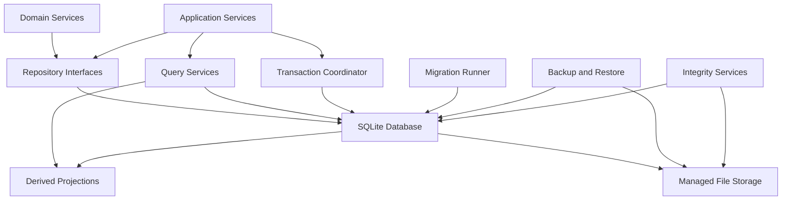

# ChannelForge Persistence Specification

- **Specification version:** 0.1
- **Status:** Draft
- **Last updated:** 2026-07-27

## Purpose

This document defines persistence architecture for ChannelForge version 1.

It specifies:

- SQLite as the version 1 database
- Persistence boundaries
- Repository contracts
- Transaction rules
- Aggregate storage
- Revision storage
- Schedule Plan storage
- Catalog storage
- Integration storage
- Playout storage
- Background Job storage
- Audit storage
- Derived projections
- Concurrency and locking
- Migrations
- Backups
- Restore
- Retention
- Archival
- Data integrity
- Failure recovery
- Performance
- Testing
- Compatibility with inherited Tunarr persistence

This document does not define:

- Exact public API routes
- Exact user-interface behavior
- Provider-specific adapter payloads
- FFmpeg command construction
- Deployment-specific filesystem layout
- Plugin runtime execution

Those concerns are defined in later specifications.

## Persistence Mission

ChannelForge must preserve editorial intent, operational state, and historical
traceability without turning the database schema into the domain model.

Persistence must:

- Store authoritative domain state safely
- Preserve immutable revisions and plans
- Support deterministic scheduling
- Support current runtime operations
- Keep SQLite transactions short
- Avoid provider calls while holding write locks
- Preserve last-known-good output
- Support migration and rollback
- Survive normal process crashes
- Detect integrity problems
- Remain inspectable and recoverable by an operator
- Avoid irreversible destructive cleanup by default

## Scope

Version 1 uses SQLite as the authoritative relational database.

Version 1 may also use managed filesystem storage for:

- Artwork
- Presentation assets
- Generated XMLTV
- Generated M3U
- HDHomeRun artifacts
- Temporary HLS segments
- Diagnostic bundles
- Backup archives
- Migration snapshots

The database stores authoritative references and checksums for managed files.

Version 1 does not require:

- PostgreSQL
- MySQL
- Distributed transactions
- Multi-primary writes
- Cross-region replication
- External message queues
- Event sourcing as the primary persistence model
- Object storage as a required dependency
- Distributed locks
- Horizontal application scaling

## Core Principles

1. SQLite is the authoritative version 1 database.
2. Domain services depend on repositories, not raw tables.
3. Transactions align with aggregate and application-service boundaries.
4. External network calls occur outside database write transactions.
5. Approved revisions and Schedule Plans are immutable.
6. Historical references survive archival.
7. Derived projections can be rebuilt.
8. Background Jobs are resumable or reconcilable.
9. Runtime ephemeral objects are not treated as durable state.
10. Destructive operations require referential safety.
11. Migrations are ordered, idempotently tracked, and auditable.
12. Backups include database and referenced managed assets.
13. Restore is a defined operational workflow.
14. Persistence failures cannot silently replace active publication.
15. Database queries use explicit deterministic ordering.

## Persistence Architecture



## Persistence Boundary

The persistence layer owns:

- Database connections
- Transaction execution
- SQL
- Mapping between persistence records and domain objects
- Repository implementations
- Query services
- Projection maintenance
- Migration state
- Backup metadata
- Integrity checks
- Managed file references
- Retention execution
- Database health metrics

The persistence layer does not own:

- Business decisions
- Schedule selection
- Media-source authentication
- FFmpeg policy
- API authorization
- UI state
- Domain validation rules

## SQLite Version 1 Decision

SQLite is selected for version 1 because ChannelForge targets:

- Home servers
- Docker
- Unraid
- Single-instance operation
- Low administrative overhead
- Portable backups
- Compatibility with inherited Tunarr architecture

The design must keep migration to another relational database possible.

## SQLite Operating Mode

Recommended settings include:

- Foreign keys enabled
- WAL journaling where deployment storage supports it
- Busy timeout
- Explicit transaction modes
- Bounded retry on busy errors
- Periodic checkpointing
- Synchronous mode chosen through durability policy
- Temporary storage policy
- Page-cache configuration
- Integrity checks

Exact defaults are implementation decisions validated through testing.

## Foreign Keys

Foreign-key enforcement must be enabled for every database connection.

Startup must fail or degrade visibly when foreign-key enforcement cannot be
confirmed.

Foreign-key actions must be explicit.

Suggested defaults:

- `RESTRICT` for authoritative historical references
- `SET NULL` only where missing optional relationship remains meaningful
- `CASCADE` for strictly owned child records
- No implicit orphaning

## Write Model

Version 1 assumes one application instance is the primary database writer.

Multiple asynchronous jobs may request writes, but the application coordinates
them through:

- Short transactions
- Per-resource job serialization
- Write queues where useful
- Busy retry
- Optimistic concurrency
- Job priorities

## Read Model

Concurrent reads are expected.

Read paths should:

- Use indexed queries
- Avoid unnecessary long-lived read transactions
- Use stable pagination
- Avoid loading entire catalogs when a projection suffices
- Avoid N+1 queries
- Return immutable read models where practical

## Connection Management

The persistence implementation must define:

- Connection pool or connection reuse
- Read connection behavior
- Write connection behavior
- Busy timeout
- Connection initialization
- Transaction isolation behavior
- Shutdown
- Migration exclusivity
- Test isolation

SQLite connection count must remain bounded.

## Connection Initialization

Every connection must apply and verify required pragmas.

Potential initialization includes:

- `foreign_keys`
- `busy_timeout`
- `journal_mode`
- `synchronous`
- `temp_store`
- `cache_size`
- `trusted_schema`
- `recursive_triggers` where required

Pragma selection must be documented and tested.

## Transaction Model

### Transaction Boundary

A transaction groups persistence changes that must succeed or fail together.

Transactions should align with:

- One aggregate mutation
- One application command
- One bounded synchronization batch
- One plan persistence
- One publication pointer change
- One merge or split operation
- One migration step
- One audit-plus-state change

### Transaction Prohibitions

A write transaction must not remain open while:

- Calling Plex
- Calling Jellyfin
- Calling Emby
- Downloading artwork
- Waiting for FFmpeg
- Waiting for a client
- Running long schedule generation
- Building large output artifacts
- Sleeping for retry
- Waiting for user input
- Performing slow filesystem copies

### Read-Then-Write

Read-then-write workflows must use:

- Optimistic version checks
- Explicit expected revision
- Transactional revalidation
- Idempotency keys
- Resource ownership checks

### Nested Transactions

Domain code must not assume independent nested transactions.

A repository participating in an existing transaction uses that transaction.

Savepoints may be used internally but must not obscure application semantics.

## Transaction Coordinator

A Transaction Coordinator provides:

- Begin
- Commit
- Rollback
- Transaction context
- Repository participation
- Error translation
- Retry classification
- Metrics

Domain services should not issue transaction-control SQL directly.

## Transaction Modes

Potential modes:

- Deferred
- Immediate
- Exclusive

Typical write commands should prefer a mode that detects write contention early
without blocking readers unnecessarily.

Migration and restore operations may require stronger exclusivity.

## Optimistic Concurrency

Mutable aggregates include a version or revision number.

An update conceptually requires:

```text
WHERE id = expectedId
AND version = expectedVersion
```

Successful mutation increments the version.

A zero-row update produces a concurrency conflict.

## Concurrency Conflict

A concurrency conflict is not automatically retried for user-facing commands.

The caller may:

- Reload
- Compare
- Reapply
- Reject
- Prompt user

Background maintenance operations may retry when behavior remains idempotent.

## Immutable Records

The following are immutable after creation or terminalization, except for
explicit lifecycle metadata:

- Approved Network Profile Revision
- Approved Programming Configuration Revision
- Generated Schedule Plan
- Schedule Entry
- Validation Result
- Approval Record
- Published guide snapshot
- Airing Record after finalization
- Audit Record
- Migration history record
- Content-addressed artifact metadata

Correction creates a new record or superseding lineage.

## Mutable Records

Examples of mutable records:

- Draft revisions
- Media Source configuration
- Current health state
- Background Job state
- Active publication pointer
- Catalog effective metadata
- Runtime session state
- User preferences
- Locks
- Source failure penalties

Mutable state requires version or equivalent concurrency control where races are
possible.

## Identity Storage

All domain identities are stored as opaque strings or binary identifiers
according to implementation choice.

Requirements:

- Stable
- Unique within instance
- Independent of row ID
- Safe for API exposure where authorized
- Not reused after deletion
- Not derived from mutable labels
- Not dependent on external IDs

Internal numeric surrogate keys may be used for performance but never replace
domain identity.

## Timestamp Storage

Authoritative timestamps are stored as UTC instants.

Required semantics:

- Explicit precision
- No local-time ambiguity
- Consistent serialization
- Stable comparison
- Database and application agreement

Editorial time zones are stored separately as IANA identifiers.

## Duration Storage

Durations use integer units.

Recommended unit:

- Milliseconds

A finer unit may be used if FFmpeg integration requires it.

Floating-point duration storage is prohibited for authoritative schedule
boundaries.

## Enumerations

Enumeration values are stored as stable text or stable numeric codes.

Text values improve inspection and migration safety.

Removing or renaming an enumeration value requires migration and compatibility
handling.

## JSON Columns

JSON may be used for:

- Versioned rule parameters
- Provider capability snapshots
- Diagnostic details
- Optional metadata
- Immutable evidence
- Future-compatible extension fields

JSON must not replace relational structure for frequently queried authoritative
relationships.

## JSON Requirements

Every stored JSON document should have:

- Schema or type discriminator
- Version
- Validation
- Size limit
- Stable serialization where checksums matter
- Migration strategy
- Unknown-field policy

## Binary Data

Large binary data should not be stored directly in SQLite unless justified.

Artwork, video, backup archives, and large diagnostic files belong in managed
file storage.

Small checksums, thumbnails, or compact tokens may be stored as binary values.

## Managed File Storage

Managed files include:

- Uploaded artwork
- Network logos
- Presentation assets
- Generated artifacts
- Backup bundles
- Temporary export bundles
- Optional cached provider artwork

Each durable managed file has a database record.

## Managed File Record

Required conceptual fields:

- `managedFileId`
- File category
- Relative managed path
- MIME type
- Size
- Checksum
- Created timestamp
- Verification timestamp
- Ownership reference
- Retention class
- Archived timestamp
- Encryption state where applicable

## Managed Path Rules

Managed paths must:

- Be relative to configured storage root
- Be normalized
- Avoid traversal
- Avoid reserved names
- Avoid case-collision ambiguity
- Be generated by ChannelForge
- Never contain raw secrets
- Remain stable or have migration lineage

## Atomic File Publication

Durable file creation uses:

1. Write temporary file inside managed filesystem.
2. Flush and close.
3. Validate size and checksum.
4. Create or update database metadata transactionally.
5. Atomically move or replace active path.
6. Update active pointer.
7. Remove temporary file on failure.

The exact ordering may vary by platform, but partial active files must not be
served.

## File and Database Consistency

Because SQLite and filesystem writes are not one transaction, workflows must be
recoverable.

Potential reconciliation states:

- Metadata without file
- File without metadata
- Temporary file after crash
- Active pointer to invalid file
- Duplicate content-addressed file

Startup or maintenance jobs reconcile these states.

## Content Addressing

Some managed files may use checksum-based storage.

Benefits:

- Deduplication
- Integrity
- Stable artifact identity
- Safe atomic publication

Content-addressed storage is optional for version 1.

## Repository Pattern

Repositories expose domain-oriented persistence operations.

Repositories must not expose arbitrary query builders to domain services.

Suggested behavior:

- Load aggregate
- Save aggregate
- Create immutable record
- Archive aggregate
- Check expected version
- Query by stable domain keys
- Participate in transaction context

## Repository Return Values

Repositories return:

- Domain objects
- Domain-specific persistence errors
- Stable identifiers
- Paging results
- Version metadata

Repositories do not return raw database rows outside the persistence module.

## Repository Errors

Normalized persistence errors include:

- `NOT_FOUND`
- `ALREADY_EXISTS`
- `CONCURRENCY_CONFLICT`
- `FOREIGN_KEY_CONFLICT`
- `UNIQUE_CONFLICT`
- `CHECK_CONSTRAINT`
- `DATABASE_BUSY`
- `DATABASE_READ_ONLY`
- `DATABASE_CORRUPT`
- `MIGRATION_REQUIRED`
- `STORAGE_UNAVAILABLE`
- `FILE_INTEGRITY_FAILED`
- `TRANSACTION_FAILED`
- `UNKNOWN`

## Aggregate Repositories

Suggested repositories include:

- `InstanceRepository`
- `UserRepository`
- `MediaSourceRepository`
- `CatalogItemRepository`
- `NetworkRepository`
- `ChannelRepository`
- `NetworkProfileRevisionRepository`
- `ProgrammingConfigurationRevisionRepository`
- `SchedulePlanRepository`
- `SchedulePublicationRepository`
- `PlayoutSessionRepository`
- `TemplateRepository`
- `ProgrammingPackRepository`
- `BackgroundJobRepository`
- `AuditRepository`

## Query Services

Query services provide optimized read models.

Examples:

- Catalog search
- Schedule timeline
- Network dashboard
- Channel health
- Conflict queue
- Background Job list
- Audit timeline
- Publication history
- Runtime status
- Migration status

Query services may use joins and projections not represented as aggregates.

## Command and Query Separation

Version 1 uses pragmatic command-query separation.

It does not require separate databases.

Command paths use repositories and domain validation.

Query paths may use specialized SQL projections.

## Domain Mapping

Persistence records are mapped into domain types at the persistence boundary.

Mapping must validate:

- Required fields
- Enumeration values
- Revision state
- Timestamps
- Relationships
- JSON schema versions
- Invariants that protect against corrupted state

Unexpected stored data produces explicit integrity errors.

## Instance and Access Persistence

Persistence must support:

- Instance settings
- Initial setup state
- User accounts
- Roles
- Permissions
- Sessions
- API tokens
- Password credential references
- Security events

Sensitive credential storage is defined further in the security specification.

## User Records

A User record may include:

- User ID
- Username
- Display name
- Credential reference
- Role assignments
- Enabled state
- Created timestamp
- Updated timestamp
- Last login timestamp
- Archived timestamp
- Version

## Session Records

Session persistence may include:

- Session ID
- User ID
- Created timestamp
- Last activity
- Expiration
- Revocation
- Client metadata
- Token hash

Raw session tokens must not be stored.

## API Token Records

API tokens are stored as:

- Token ID
- Owner
- Token hash
- Prefix for identification
- Scopes
- Created timestamp
- Expiration
- Last used timestamp
- Revocation timestamp

The full secret is shown only at creation.

## Media Source Persistence

Media Source persistence includes:

- Source identity
- Provider type
- Addresses
- Credential reference
- Enabled state
- Included libraries
- Synchronization policy
- Capability snapshot reference
- Provider identity
- Health summary
- Version

Provider credentials are stored separately.

## Source Library Persistence

Source library records include:

- Media Source ID
- External library ID
- Name
- Type
- Inclusion state
- Last observed timestamp
- Version token
- Archived state

## Catalog Persistence

Catalog persistence includes:

- Catalog Items
- Hierarchy
- Effective metadata
- Field provenance
- Source Bindings
- Playback Variants
- Artwork
- Labels
- Collections
- Franchise relationships
- Conflicts
- Merge and split lineage
- Catalog revisions
- Catalog snapshots

## Catalog Item Storage

A Catalog Item record should separate:

- Identity and lifecycle
- Common normalized metadata
- Hierarchy references
- Availability summary
- Scheduling revision
- Search revision

Frequently filtered fields should not be buried only in JSON.

## Catalog Metadata Tables

Normalized relational tables may represent:

- Genres
- Tags
- Languages
- Countries
- Studios
- Credits
- Ratings
- Alternate titles
- Artwork assignments
- External provider IDs

The exact schema may balance normalization and query cost.

## Metadata Provenance Storage

Provenance records include:

- Catalog Item
- Field name
- Source type
- Source reference
- Observed value
- Confidence
- Precedence
- Effective state
- First observed
- Last observed
- Superseded timestamp

Large values may be referenced rather than duplicated.

## Source Binding Storage

Source Binding records enforce uniqueness for the qualified external identity.

The database must prevent two active bindings for the same qualified external
identity.

Archived historical duplicates may require partial unique indexes or explicit
state-aware constraints.

## Playback Variant Storage

Playback Variant storage includes:

- Source Binding
- External variant identity
- Technical metadata
- Stream observations
- Availability
- Version token
- Last verified timestamp
- Archived state

Track lists may use child tables or versioned JSON depending on query needs.

## Catalog Snapshot Storage

A Catalog Snapshot must be immutable.

Potential representations:

- Snapshot header plus item membership table
- Content-addressed item revision manifest
- Selector result manifest
- Revision watermark plus immutable inputs

The selected representation must permit deterministic schedule reproduction.

## Network Persistence

Network storage includes:

- Network identity
- Lifecycle
- Active profile revision
- Channel membership
- Branding references
- Defaults
- Version

## Channel Persistence

Channel storage includes:

- Channel identity
- Network ID
- Channel number
- Display name
- Time zone
- Active programming revision
- Active publication
- Output identity
- Lifecycle
- Version

## Channel Number Constraints

Channel number storage must support:

- Major number
- Optional minor number
- Stable sorting
- Instance-level uniqueness policy
- String display format

The database should enforce configured uniqueness where practical.

## Revision Persistence

Revision families include:

- Network Profile Revision
- Programming Configuration Revision
- Template Revision
- Pack Revision
- Output Configuration Revision where required

A revision record includes:

- Revision ID
- Owner aggregate ID
- Revision number
- State
- Created by
- Created timestamp
- Approved by
- Approved timestamp
- Superseded reference
- Content checksum
- Schema version

## Revision Content

Revision content may use:

- Relational child records
- Versioned JSON
- Hybrid representation

Frequently queried rule fields may have relational projections even when the
immutable canonical document is JSON.

## Draft Revision Mutation

Draft revisions may be edited.

Each edit:

- Validates expected version
- Updates content checksum
- Increments mutable version
- Updates timestamp
- Records audit information as required

## Approved Revision Immutability

Approval creates or transitions to immutable approved state.

After approval:

- Content cannot change
- Child rows cannot change
- Checksum remains stable
- Superseding requires a new revision

## Schedule Plan Persistence

A Schedule Plan is persisted after generation completes in memory.

Persistence should occur in a bounded transaction.

Required stored data:

- Plan identity
- Channel
- Horizon
- Actual coverage
- Input revision IDs
- Catalog Snapshot
- Generator version
- Rule versions
- Random seed
- Generation mode
- Source plan lineage
- Status
- Content checksum
- Metrics
- Created timestamp
- Created by
- Staleness state

## Schedule Entry Persistence

Schedule Entry records include:

- Entry ID
- Plan ID
- Sequence number
- Start instant
- End instant
- Entry kind
- Catalog Item ID
- Presentation Asset ID
- Block ID
- Daypart ID
- Guide snapshot
- Placement evidence
- Source hints
- Locked lineage
- Carry-In or Carry-Out state

## Schedule Entry Ordering

Within one plan, sequence order must be unique and deterministic.

The database should enforce:

- Unique plan plus sequence
- Positive duration
- Start before end
- Unique Entry ID
- Valid owner plan

Overlap validation may occur in application logic plus integrity checks.

## Schedule Plan Persistence Strategy

For large plans:

1. Generate in memory.
2. Validate.
3. Begin bounded write transaction.
4. Insert Plan header.
5. Batch insert entries.
6. Insert metrics and summaries.
7. Insert validation result.
8. Insert lineage.
9. Commit.
10. Publish only through a later command.

The transaction must not include generation.

## Schedule Validation Storage

Validation storage includes:

- Validation Result
- Plan ID
- Validator version
- Overall status
- Findings
- Metrics
- Input checksum
- Created timestamp

Findings may use relational rows with versioned detail JSON.

## Approval Storage

Approval records are immutable.

A plan may have:

- Approval
- Rejection
- Superseding decision

The database must prevent multiple active approvals with incompatible semantics.

## Publication Persistence

Schedule Publication storage includes:

- Publication ID
- Channel ID
- Approved Plan ID
- Effective interval
- Activation mode
- Activated by
- Activated timestamp
- Superseded publication
- Artifact references
- State
- Version

## Active Publication Pointer

The active publication pointer is mutable Channel state.

Activation must use optimistic concurrency.

Conceptually:

```text
UPDATE channel
SET active_publication_id = newPublication,
    version = version + 1
WHERE channel_id = expectedChannel
AND version = expectedVersion
AND active_publication_id = expectedPrior
```

## Artifact Persistence

Artifact records include:

- Artifact ID
- Type
- Publication reference
- Content checksum
- Managed File ID
- Generated timestamp
- Generator version
- Validation state
- Active state
- Superseded artifact
- Retention class

## Last Valid Artifact

The database maintains an active pointer to the last valid artifact.

Failed artifact generation does not clear it.

## Playout Persistence

Persistent runtime records include:

- Playout Session
- Client Session summary
- Playout Decision
- Playout Attempt
- Airing Record
- Recovery Event
- Hardware Reservation
- Maintenance Interval
- Runtime source penalty

## Runtime State Durability

Runtime state is operationally durable, not editorially authoritative.

A crash may leave records in transitional states.

Startup reconciliation finalizes or marks them abandoned.

## Playout Session Storage

A Playout Session record includes:

- Session ID
- Channel
- Publication
- Output Profile
- State
- Current entry
- Application instance
- Started timestamp
- Last heartbeat
- End timestamp
- End reason
- Version

## Session Heartbeat

Heartbeats must be bounded to avoid excessive writes.

A heartbeat interval is configured.

Missing heartbeat after expiration causes reconciliation.

## Client Session Storage

High-frequency per-client updates should not create unnecessary database load.

Possible approach:

- Persist start
- Periodically aggregate
- Persist end
- Keep high-frequency counters in memory
- Flush bounded summaries

## Playout Decision Storage

Playout Decisions and Attempts preserve:

- Selected source
- Selected variant
- Stream mode
- Runtime offset
- Hardware decision
- Failure lineage
- Timing
- Outcome

Sensitive runtime URLs are excluded.

## Airing Record Storage

Airing Records are immutable after finalization.

A provisional airing may be updated until finalized.

Finalization records:

- Actual start
- Actual end
- Outcome
- Interruption
- Source lineage
- Recovery summary
- Final timestamp

## Integration Persistence

Integration persistence includes:

- Capability snapshots
- Provider identity observations
- Synchronization runs
- Provider cursors
- Health observations
- Path mappings
- Webhook receipts
- Normalized errors
- Adapter migration state

## Synchronization Run Storage

Synchronization Run state includes:

- Job identity
- Media Source
- Mode
- State
- Adapter version
- Cursor
- Checkpoint
- Counts
- Warnings
- Error
- Started timestamp
- Completed timestamp
- Version

## Synchronization Batch Transaction

A bounded batch should:

1. Load current relevant bindings.
2. Insert or update normalized records.
3. Update provenance.
4. Update variants.
5. Update batch checkpoint.
6. Commit.
7. Release write lock.
8. Continue external enumeration.

## Missing Reconciliation Storage

Unobserved source bindings are not marked missing until authoritative full
reconciliation completes.

A synchronization run may use:

- Run marker
- Last observed run ID
- Observation table
- Temporary staging table

The approach must avoid loading all source IDs into application memory.

## Provider Cursor Storage

Provider cursors are opaque bytes or strings associated with:

- Media Source
- Adapter version
- Cursor type
- Created timestamp
- Last successful use
- Expiration state

Cursor content is not interpreted by domain code.

## Webhook Receipt Storage

Webhook receipts may store:

- Receipt ID
- Media Source
- Provider event ID
- Payload checksum
- Received timestamp
- Verification state
- Event type
- Deduplication state
- Queued Job ID
- Redacted metadata

Raw payload retention is optional and bounded.

## Background Job Persistence

Background Jobs include:

- Schedule generation
- Synchronization
- Artifact generation
- Health checks
- Backup
- Restore preparation
- Catalog maintenance
- Projection rebuild
- Integrity verification
- Migration assistance

## Background Job Record

Required conceptual fields:

- `backgroundJobId`
- Job type
- Owner reference
- State
- Priority
- Idempotency key
- Requested by
- Requested timestamp
- Started timestamp
- Heartbeat
- Completed timestamp
- Progress
- Checkpoint
- Attempt count
- Maximum attempts
- Error classification
- Cancellation requested
- Worker identity
- Version

## Job States

Suggested states:

- `QUEUED`
- `CLAIMED`
- `RUNNING`
- `WAITING`
- `SUCCEEDED`
- `SUCCEEDED_WITH_WARNINGS`
- `FAILED`
- `CANCELLED`
- `ABANDONED`

## Job Claiming

Version 1 may claim jobs within one application instance.

The claim still records worker identity and lease for crash recovery.

Claiming uses an atomic update with expected state.

## Job Lease

A Job Lease includes:

- Worker identity
- Claimed timestamp
- Heartbeat
- Lease expiration

Expired running jobs become candidates for reconciliation.

## Job Checkpoint

Checkpoint data must be:

- Versioned
- Bounded
- Validated
- Safe to resume
- Independent of in-memory object identity

## Job Idempotency

An idempotency key prevents duplicate effective jobs.

Uniqueness may apply to active states only.

Completed job reuse policy is operation-specific.

## Job Cancellation

Cancellation sets a durable request flag.

The worker checks at safe boundaries.

Cancellation does not require force-killing arbitrary database operations.

## Audit Persistence

Audit records are append-only.

Required conceptual fields:

- `auditRecordId`
- Timestamp
- Actor
- Action
- Target type
- Target ID
- Correlation ID
- Request ID
- Prior version
- New version
- Summary
- Detail reference
- Source address classification
- Outcome

## Audit Detail

Sensitive fields must be redacted.

Audit may record:

- Changed field names
- Old and new nonsecret values
- Revision IDs
- Approval IDs
- Reason
- Override state

## Audit Retention

Audit retention should be long-lived.

Deletion requires explicit policy and should preserve minimum compliance and
operational history.

## Domain Event Persistence

Version 1 may use a transactional Outbox.

The Outbox records domain events created in the same transaction as state
changes.

## Outbox Record

Required conceptual fields:

- Event ID
- Event type
- Aggregate type
- Aggregate ID
- Aggregate version
- Payload
- Schema version
- Created timestamp
- Dispatch state
- Attempt count
- Last error
- Dispatched timestamp

## Outbox Purpose

The Outbox supports reliable internal follow-up such as:

- Projection updates
- Health recalculation
- Artifact regeneration
- Notification enqueueing
- Staleness propagation
- Search-index updates

## Outbox Delivery

Delivery is at least once.

Handlers must be idempotent.

## Inbox or Deduplication

External and plugin events may use an Inbox or deduplication table.

A deduplication record includes:

- Source
- External event ID
- Payload checksum
- First seen
- Last seen
- Processing outcome

## Derived Projections

Derived projections improve query performance.

Examples:

- Catalog search index
- Scheduler candidate projection
- Channel dashboard
- Plan metrics summary
- Current publication projection
- Runtime now/next
- Source health summary
- Conflict counts
- Guide horizon summary

## Projection Authority

Derived projections are not authoritative.

They must be rebuildable from authoritative records.

## Projection Versioning

Each projection has:

- Projection type
- Projection schema version
- Builder version
- Last rebuild timestamp
- Source watermark
- Health state

## Projection Update Modes

Projections may update through:

- Transactional write-through
- Outbox event handlers
- Periodic rebuild
- On-demand repair
- Full migration rebuild

## Projection Lag

Projection lag must be observable.

Critical command paths must not rely on stale projection state when authoritative
validation is required.

## Search Index

SQLite full-text search may be used for catalog search.

Search index behavior must be:

- Rebuildable
- Versioned
- Consistent enough for administration
- Excluded from authoritative backups only when rebuild is guaranteed

## Materialized Scheduler Projection

A scheduler projection may include:

- Catalog Item ID
- Kind
- Duration
- Hierarchy
- Rating
- Genres
- Tags
- Labels
- Availability
- Source eligibility
- Metadata completeness
- Scheduling revision

Generation must record the projection or Catalog Snapshot revision used.

## Caching

In-memory caches may reduce database load.

Cached values must have:

- Key
- Source version
- Expiration
- Invalidation strategy
- Maximum size
- Metrics

A cache miss or restart must not change correctness.

## Cache Prohibitions

Do not cache decrypted secrets beyond required operation scope.

Do not use cache-only state for:

- Approval
- Publication activation
- Authorization
- Immutable plan identity
- Audit
- Migration state

## Data Integrity

Integrity is protected through:

- Foreign keys
- Unique constraints
- Check constraints
- Optimistic versions
- Checksums
- Immutable-state enforcement
- Application validation
- Periodic integrity checks
- Managed-file verification

## Check Constraints

Useful checks include:

- Positive durations
- Valid revision numbers
- Nonnegative counts
- Start before end
- Valid lifecycle combinations
- Valid minor channel number
- Valid attempt count
- Valid lease expiration
- Valid file size

Complex domain invariants remain in application validation.

## Unique Constraints

Important uniqueness includes:

- Domain ID
- Qualified external source identity
- Plan plus entry sequence
- Owner plus revision number
- Active API-token prefix where required
- Active job idempotency key
- Channel number under configured scope
- Active publication identity
- Managed relative path
- Content checksum under content-addressed policy

## Checksums

Checksums may protect:

- Revision documents
- Schedule Plans
- Output artifacts
- Managed files
- Catalog Snapshots
- Backup manifests
- Diagnostic bundles

The checksum algorithm and canonical serialization are versioned.

## Database Integrity Checks

Operational checks may include:

- Quick integrity check
- Full integrity check
- Foreign-key check
- Index verification
- Migration-state verification
- Orphan query checks
- Sequence consistency
- Managed-file reconciliation

## Integrity Check Cadence

Suggested uses:

- Startup quick verification
- Scheduled periodic check
- Before backup
- After restore
- After migration
- On operator request
- After abnormal shutdown warning

Full checks may be resource-intensive.

## Corruption Handling

When corruption is detected:

- Stop destructive writes.
- Preserve database file.
- Record diagnostic state.
- Attempt read-only export if safe.
- Recommend restore.
- Avoid automatic replacement without operator confirmation.
- Preserve managed files.
- Record incident metadata outside the damaged database where practical.

## Database Busy Handling

SQLite busy errors are expected under contention.

Policy includes:

- Busy timeout
- Bounded retry
- Backoff
- Operation classification
- Metrics
- User-facing conflict translation

## Busy Retry

Retry is safe only when the operation is:

- Idempotent, or
- Re-executed from a transaction boundary with expected versions

A partially committed operation must not be blindly repeated.

## Write Queue

Version 1 may use an application write queue for heavy background writes.

Priority examples:

1. Publication activation
2. Runtime finalization
3. User commands
4. Targeted synchronization
5. Full synchronization
6. Projection rebuild
7. Maintenance cleanup

The queue must not become an unbounded memory structure.

## Long Readers

Long read transactions can delay WAL checkpointing.

Large exports and reports should:

- Page reads
- Use snapshot strategy
- Release transactions
- Avoid retaining database cursors during network writes

## WAL Checkpointing

Checkpoint policy should consider:

- WAL size
- Active readers
- Backup timing
- Idle periods
- Disk capacity
- Container shutdown

Checkpoint failures are observable.

## Vacuum

Vacuum or incremental vacuum may reclaim space.

Vacuum operations:

- Run as maintenance jobs
- Require storage headroom
- Avoid active playout peak periods
- Are cancellable where possible
- Record result

## Analyze

Statistics maintenance may run after:

- Large synchronization
- Migration
- Significant deletion
- Projection rebuild

## Index Design

Indexes should support:

- Stable ID lookup
- Qualified external IDs
- Catalog filters
- Hierarchy
- Availability
- Duration
- Schedule timeline
- Active publication
- Background Job queues
- Health summaries
- Audit chronology
- Synchronization reconciliation

Every index adds write cost and must have a query justification.

## Query Plans

Critical queries should have tested query plans.

Examples:

- Active entry lookup
- Scheduler candidate query
- Catalog search
- Source reconciliation
- Next queued job
- Current Channel publication
- Recent Airing Records

## Pagination

Large queries use stable pagination.

Preferred strategies:

- Keyset pagination
- Composite cursor
- Stable final ID tie-break

Offset pagination is acceptable for bounded administrative lists.

## Retention

Retention policies classify data.

Suggested classes:

- Permanent
- Historical
- Operational
- Diagnostic
- Temporary
- Cache
- Legal or audit hold

## Permanent or Long-Lived Data

Examples:

- Domain identities
- Approved revisions
- Approved Schedule Plans
- Publication history
- Audit
- Merge and split lineage
- Migration history
- Backup metadata

## Operational Retention

Examples:

- Playout Sessions
- Client Session summaries
- Background Jobs
- Health observations
- Synchronization Runs
- Runtime penalties

Retention duration is configurable.

## Diagnostic Retention

Examples:

- FFmpeg logs
- Provider error bodies
- Raw payload samples
- Failed artifact data
- Debug generation evidence

Diagnostic retention must be bounded.

## Temporary Data

Examples:

- HLS segments
- Temporary artifacts
- Upload staging
- Incomplete backup files
- Interrupted exports

Temporary cleanup must be crash-safe.

## Retention Execution

A retention job:

1. Computes eligible records.
2. Excludes protected references.
3. Excludes legal or audit hold.
4. Deletes in bounded batches.
5. Cleans managed files.
6. Records metrics.
7. Reconciles failures.
8. Never holds a long transaction across filesystem deletion.

## Archival Versus Deletion

Archival preserves identity and history.

Deletion removes records only when safe.

The default for user-facing entities is archival.

## Tombstones

A tombstone may preserve:

- Former ID
- Entity type
- Merge target
- Split lineage
- Deleted timestamp
- Reason
- Minimal audit reference

Tombstones prevent accidental ID reuse.

## Backup

A valid backup must include:

- Consistent SQLite database image
- Managed durable files
- Backup manifest
- Application version
- Schema version
- Timestamp
- Instance ID
- Checksums
- Encryption state
- Backup result

## Backup Types

Suggested types:

- Full backup
- Database-only diagnostic backup
- Configuration export
- Pre-migration backup
- Pre-restore safety backup

A database-only backup may not be sufficient for full restore.

## Consistent SQLite Backup

Use a supported SQLite online backup mechanism or a safe application quiescence
workflow.

Copying only the main database file while WAL contains uncheckpointed changes is
not a valid backup.

## Backup Workflow

Recommended workflow:

1. Acquire backup coordination.
2. Record backup job.
3. Verify database health.
4. Create consistent database copy.
5. Enumerate durable managed files.
6. Copy or package files.
7. Create manifest.
8. Calculate checksums.
9. Optionally encrypt.
10. Atomically finalize backup.
11. Verify archive.
12. Apply retention.

## Backup Manifest

The manifest includes:

- Backup format version
- Instance ID
- Application version
- Schema version
- Created timestamp
- Database checksum
- Managed file entries
- File checksums
- Encryption metadata
- Compression metadata
- Completion state

## Backup Destination

Version 1 may support:

- Local managed backup path
- Mounted network path
- User-downloaded archive

Future integrations may support object storage.

## Backup Encryption

Backup encryption is recommended when backups contain:

- Credentials
- User accounts
- API-token hashes
- Private metadata
- Network addresses

Exact encryption design is defined in security and deployment specifications.

## Backup Retention

Retention may use:

- Maximum count
- Daily count
- Weekly count
- Monthly count
- Maximum age
- Maximum storage
- Manual protection

Deletion must not remove the only valid backup.

## Backup Verification

Verification includes:

- Manifest parse
- Database checksum
- File checksums
- SQLite integrity on copied database
- Required file presence
- Encryption metadata
- Format compatibility

## Restore

Restore is an explicit administrative operation.

It must not occur while ordinary application writes continue.

## Restore Workflow

Recommended workflow:

1. Authenticate and authorize operator.
2. Inspect backup manifest.
3. Verify checksums.
4. Verify format compatibility.
5. Create pre-restore safety backup.
6. Stop background jobs.
7. Stop playout sessions.
8. Enter maintenance mode.
9. Close database connections.
10. Restore database to staging path.
11. Restore managed files to staging path.
12. Run migrations if permitted.
13. Run integrity checks.
14. Atomically switch active storage.
15. Restart application state.
16. Reconcile runtime records.
17. Record restore audit.

## Restore Compatibility

Restore policy must define:

- Same application version
- Older backup into newer application
- Newer backup into older application
- Schema migration
- Plugin compatibility
- Secret-store compatibility
- Path compatibility

Restoring newer schema into older application is prohibited.

## Restore Failure

If restore fails before activation:

- Keep current instance state.
- Preserve staging data for diagnostics.
- Record failure.
- Leave maintenance state explicit.

If failure occurs after activation, rollback uses the pre-restore safety backup
where safe.

## Disaster Recovery

Operator recovery should be possible with:

- Backup archive
- ChannelForge image or package
- Persistent storage
- Documented restore command
- Secret or encryption key

## Export

Exports are not equivalent to backups.

Exports may include:

- Network configuration
- Channel configuration
- Templates
- Packs
- Catalog metadata
- Schedule data
- Audit reports

Exports may omit secrets and operational state.

## Import

Imports must:

- Validate format
- Validate schema version
- Resolve identity collisions
- Preserve provenance
- Produce preview
- Avoid direct destructive overwrite
- Record audit

## Schema Migrations

Migrations transform persisted structure and data.

Every migration has:

- Ordered identifier
- Name
- Application version
- Up operation
- Verification
- Optional down operation
- Checksum
- Applied timestamp
- Duration
- Result

## Migration Table

The migration table records:

- Migration ID
- Checksum
- Applied timestamp
- Application version
- Execution duration
- Success state where supported

A checksum mismatch is a startup error.

## Migration Startup Behavior

At startup:

1. Open database.
2. Verify basic database access.
3. Read schema version.
4. Compare required migrations.
5. Acquire migration lock or exclusivity.
6. Create pre-migration backup according to policy.
7. Apply migrations in order.
8. Verify each migration.
9. Run post-migration checks.
10. Start application services.

## Migration Exclusivity

Ordinary application services must not run while schema migration is active.

## Migration Transactionality

A migration should run transactionally when SQLite operations permit it.

Large migrations may require staged phases.

Each phase must be restart-safe.

## Expand-and-Contract

For risky changes:

1. Add new structure.
2. Backfill in bounded batches.
3. Dual-read or compatibility-read.
4. Verify.
5. Switch writes.
6. Remove old structure in a later migration.

## Data Backfill

Backfills must:

- Be resumable
- Be bounded
- Record progress
- Avoid provider calls
- Avoid unbounded memory
- Validate results
- Preserve prior data until verification

## Migration Failure

On failure:

- Stop startup.
- Preserve database.
- Preserve pre-migration backup.
- Record external diagnostic.
- Do not continue with partially compatible application services.
- Provide recovery instructions.

## Migration Rollback

Automatic down migrations are not assumed safe.

Preferred recovery is restore from pre-migration backup.

## Legacy Tunarr Migration

ChannelForge inherits Tunarr persistence.

Migration must preserve:

- Existing channels
- Existing source configurations
- Existing schedules where usable
- Existing media mappings
- Existing output settings
- Existing user intent
- Existing runtime compatibility

## Legacy Boundary

Legacy tables and models may remain temporarily.

New ChannelForge domain services must access them through compatibility
repositories or migration services.

## Legacy Identifier Mapping

A mapping table may connect:

- Legacy entity type
- Legacy ID
- ChannelForge entity type
- ChannelForge ID
- Migration status
- Created timestamp
- Conflict reference

## Legacy Read Compatibility

During transition, a repository may:

- Read ChannelForge tables first
- Fall back to legacy mapping
- Materialize migrated state
- Record compatibility use
- Avoid creating new legacy-only records

## Legacy Write Policy

New features should not write directly to legacy structures unless a
compatibility adapter requires it.

Dual-write must be explicit and temporary.

## Legacy Migration Phases

Potential phases:

1. Baseline schema capture
2. Add ChannelForge identity tables
3. Add mappings
4. Migrate Networks and Channels
5. Migrate Media Sources
6. Migrate Catalog identity
7. Migrate schedule configuration
8. Migrate active output
9. Verify compatibility
10. Remove legacy write paths
11. Retain read compatibility
12. Remove obsolete tables in later release

## Migration Verification

Verification includes:

- Row counts
- Identity mappings
- Foreign-key validity
- Active Channel count
- Active source count
- Schedule continuity
- Output artifact behavior
- Unresolved conflicts
- Checksum comparisons where available

## Schema Ownership

Every table belongs to a module.

Suggested module prefixes or schema documentation categories:

- Instance and access
- Integration
- Catalog
- Network and Channel
- Programming
- Scheduling
- Publication
- Playout
- Operations
- Audit
- Migration
- Projections

SQLite does not provide separate schemas, so ownership must be documented.

## Naming Conventions

Persistence naming should be consistent.

Suggested conventions:

- Snake case table and column names
- Singular or plural table policy applied uniformly
- `_id` for domain references
- `_at` for timestamps
- `_version` for optimistic versions
- `_state` for lifecycle state
- `_json` only when content is actually JSON
- No provider-specific names in canonical domain tables

## Soft Delete

Soft-delete columns may include:

- Archived timestamp
- Archived by
- Archive reason

Queries must explicitly define whether archived records are included.

## Default Scopes

Repository methods must not hide archival behavior through implicit global
filters that are difficult to override.

Method names should distinguish:

- Active only
- Include archived
- Historical lookup

## Multi-Tenancy

Version 1 is single-instance and not multi-tenant.

The schema should not add unnecessary tenant IDs.

Future multi-instance hosting would require a separate architecture decision.

## Configuration Persistence

Instance configuration may be stored in:

- Typed tables
- Versioned configuration document
- Environment variables
- Secret references

Runtime-critical configuration should have:

- Validation
- Version
- Audit
- Reload policy

## Environment Versus Database

Environment variables are appropriate for:

- Bootstrap paths
- Database path
- Public base URL bootstrap
- Secret-encryption key reference
- Deployment mode

Database configuration is appropriate for:

- Networks
- Channels
- Source settings
- Scheduling policy
- Output profiles
- Retention
- Backup policy

## Secret Storage Persistence

Secret storage may use:

- Encrypted database values
- External secret file
- Platform secret mechanism
- Environment-provided master key

The database stores only encrypted secret material or references.

Exact cryptography is defined in the security specification.

## Error Recovery

Persistence workflows must distinguish:

- Retryable busy error
- Concurrency conflict
- Disk full
- Read-only filesystem
- Permission failure
- Missing managed file
- Corrupt database
- Migration mismatch
- Foreign-key conflict
- Invalid stored data

## Disk Full

On disk-full detection:

- Stop nonessential writes.
- Preserve active publication.
- Stop artifact generation.
- Stop large synchronization commits.
- Serve existing valid artifacts where possible.
- Raise critical health finding.
- Avoid repeated write storms.

## Read-Only Degraded Mode

A future or emergency read-only mode may:

- Serve existing guide artifacts
- Serve existing playlist
- Continue some playout using persisted plan
- Block configuration changes
- Block synchronization
- Block approval
- Block publication activation
- Expose critical status

Version 1 may implement only partial degraded support.

## Filesystem Permission Failure

Managed-file permission failure must not corrupt database pointers.

Artifact activation occurs only after file verification.

## Missing Managed File

When metadata references a missing file:

- Mark integrity finding.
- Avoid serving invalid pointer.
- Use previous valid artifact where available.
- Queue repair or regeneration.
- Preserve metadata for diagnosis.

## Startup Sequence

Persistence startup should:

1. Validate storage paths.
2. Open database.
3. Apply connection pragmas.
4. Verify migration table.
5. Apply migrations.
6. Run quick integrity checks.
7. Reconcile managed files.
8. Reconcile abandoned jobs.
9. Reconcile runtime sessions.
10. Validate active publication pointers.
11. Validate active artifact pointers.
12. Start application services.

## Shutdown Sequence

Graceful shutdown should:

1. Stop accepting new writes.
2. Request Background Job cancellation.
3. Stop or hand off playout.
4. Flush pending audit and outbox records.
5. Finalize runtime sessions.
6. Checkpoint WAL according to policy.
7. Close database connections.
8. Release storage locks.

## Observability

### Persistence Logs

Logs should include:

- Operation
- Repository
- Transaction ID
- Duration
- Rows affected
- Retry count
- Busy error
- Migration ID
- Backup ID
- Restore ID
- Integrity check ID
- Background Job ID
- Correlation ID

SQL text should be logged only in safe diagnostic modes.

### Persistence Metrics

Suggested metrics:

- Query duration
- Transaction duration
- Busy retries
- Busy failures
- Database size
- WAL size
- Checkpoint duration
- Open connections
- Write queue depth
- Migration duration
- Backup duration
- Restore duration
- Integrity failures
- Managed file count
- Managed file bytes
- Orphan file count
- Projection lag
- Background Job queue depth
- Audit write failures

### Slow Query Logging

Slow-query thresholds are configurable.

Sensitive values must be redacted.

## Health

Persistence health dimensions include:

- Database reachable
- Database writable
- Schema current
- Foreign keys enabled
- Integrity status
- WAL status
- Disk capacity
- Managed storage writable
- Backup freshness
- Projection freshness
- Job queue health

## Persistence API Concepts

Exact routes are defined later.

Required conceptual operations include:

- Read storage health
- Run integrity check
- Start backup
- List backups
- Verify backup
- Restore backup
- Download backup
- Delete backup
- Run projection rebuild
- Read migration status
- Read database size
- Read retention status
- Run retention
- Read managed-file integrity
- Export diagnostics

## Authorization

Sensitive persistence operations require authorization.

Examples:

- Backup
- Restore
- Migration recovery
- Integrity repair
- Hard delete
- Retention override
- Diagnostic database export
- Projection rebuild
- Read audit details

## Audit Requirements

Audit records are required for:

- Backup creation
- Backup deletion
- Restore
- Hard deletion
- Retention override
- Migration recovery
- Integrity repair
- Projection rebuild
- Manual job abandonment
- Database diagnostic export
- Managed-file repair
- Configuration changes affecting durability

## Security

Persistence security must address:

- File permissions
- Secret encryption
- Backup encryption
- Path traversal
- Database download authorization
- Diagnostic redaction
- Temporary file cleanup
- Symlink safety
- Malicious imported JSON
- Untrusted migration or plugin data

## File Permissions

The data directory should be accessible only to the configured application user
and administrators.

## Database Download

Direct database download should be disabled by default.

A diagnostic export should:

- Require authorization
- Redact or exclude secrets when possible
- Record audit
- Use temporary managed storage
- Expire automatically

## Backup Secret Handling

Backups may include encrypted secrets.

A restore requires the corresponding encryption key.

The manifest must not expose the key.

## Test Strategy

### Repository Unit Tests

Required categories:

- Create
- Read
- Update
- Archive
- Concurrency conflict
- Unique conflict
- Foreign-key conflict
- Transaction rollback
- Mapping validation
- Immutable-state enforcement
- Pagination
- Stable ordering

### Transaction Tests

Tests should cover:

- Successful commit
- Exception rollback
- Multiple repository participation
- Savepoint behavior where used
- Busy retry
- Dead operation cancellation
- Optimistic version failure
- Audit-plus-state atomicity
- Outbox-plus-state atomicity

### SQLite Integration Tests

Tests should cover:

- Foreign keys enabled
- WAL behavior
- Busy timeout
- Multiple readers
- Competing writers
- Checkpointing
- Vacuum
- Integrity check
- Read-only filesystem
- Disk-full simulation where feasible
- Crash recovery
- Connection shutdown

### Migration Tests

Every migration requires tests for:

- Empty database
- Realistic prior schema
- Interrupted migration
- Reapplication detection
- Checksum mismatch
- Data verification
- Backup creation
- Unsupported downgrade
- Large data volume where relevant

### Backup Tests

Tests should cover:

- Consistent backup under reads
- Backup under bounded writes
- WAL inclusion
- Managed files
- Checksums
- Encryption
- Retention
- Corrupt archive
- Missing file
- Insufficient space
- Cancellation
- Verification

### Restore Tests

Tests should cover:

- Valid restore
- Older schema restore with migration
- Newer incompatible backup
- Wrong instance policy
- Missing encryption key
- Corrupt database
- Missing managed file
- Activation failure
- Rollback to pre-restore backup
- Runtime reconciliation

### Schedule Persistence Tests

Tests should cover:

- Large plan insert
- Entry sequence uniqueness
- Positive duration
- Immutable plan
- Validation result
- Approval
- Active publication compare-and-swap
- Last valid artifact
- Regeneration lineage
- Staleness

### Catalog Persistence Tests

Tests should cover:

- Qualified Source Binding uniqueness
- Multiple Playback Variants
- Provenance
- Merge
- Split
- Archive
- Snapshot immutability
- Source reconciliation
- Search projection rebuild
- Large episodic hierarchy

### Job Persistence Tests

Tests should cover:

- Claim
- Lease
- Heartbeat
- Expiration
- Resume checkpoint
- Cancellation
- Idempotency
- Abandonment reconciliation
- Priority ordering
- Concurrent claim attempt

### Managed File Tests

Tests should cover:

- Atomic publish
- Checksum
- Missing file
- Orphan file
- Path traversal
- Case collision
- Failed move
- Crash temporary file
- Retention cleanup
- Content-addressed deduplication where used

### Property Tests

Useful properties:

- Failed transactions leave no partial authoritative state.
- Approved revisions cannot be changed.
- Schedule Plan entries remain ordered and uniquely sequenced.
- Identical idempotency keys do not create duplicate active jobs.
- Archival does not break historical references.
- Foreign-key checks remain clean after normal commands.
- Projection rebuild produces equivalent query results.
- Backup verification detects changed bytes.
- Restore never activates an unverified database.
- Source synchronization cannot mark unseen items missing before authoritative
  reconciliation.
- Active publication changes only through expected-version update.
- Last valid artifact remains referenced after generation failure.
- Managed paths remain inside the configured root.
- Outbox events are not lost when state commits.
- Outbox handlers may safely run more than once.

### Performance Tests

Performance tests should measure:

- Catalog import batches
- Scheduler candidate query
- Large Schedule Plan insert
- Active-entry lookup
- Catalog search
- Audit append
- Background Job claim
- Projection rebuild
- Backup
- Restore verification
- Retention batches
- SQLite contention
- WAL growth
- Managed-file reconciliation

## Reference Schedule Publication Transaction

A valid publication activation transaction may:

1. Load Channel with expected version.
2. Verify approved Plan.
3. Insert Schedule Publication.
4. Update Channel active publication pointer.
5. Insert Audit Record.
6. Insert Outbox event.
7. Commit.

Artifact generation occurs outside this transaction.

Artifact activation uses a separate transaction after validation.

## Reference Synchronization Batch

A valid synchronization batch may:

1. Begin transaction.
2. Upsert Source Bindings.
3. Upsert Catalog Items.
4. Upsert Playback Variants.
5. Update provenance.
6. Update observation marker.
7. Update checkpoint.
8. Insert Outbox events.
9. Commit.
10. Fetch next provider page outside transaction.

## Reference Failed Artifact Generation

Assume:

- XMLTV generation starts.
- Temporary file is created.
- Validation fails.
- Previous valid XMLTV exists.

Expected persistence behavior:

- Failed artifact job records error.
- Temporary file is removed or retained only as diagnostic.
- No active artifact pointer changes.
- Previous artifact remains active.
- Audit or health finding is recorded.
- Schedule Publication remains active.

## Reference Crash During Job

Assume:

- Full synchronization job is `RUNNING`.
- Application process crashes.
- Last checkpoint was committed.

Expected recovery:

- Job lease expires.
- Startup reconciliation marks job `ABANDONED` or requeues it according to
  policy.
- Completed batches remain.
- Unobserved bindings are not marked missing.
- Resume begins from safe checkpoint or restarts full reconciliation.
- No duplicate canonical state is created.

## Version 1 Required Behaviors

The version 1 persistence subsystem must:

1. Use SQLite as the authoritative database.
2. Enable foreign-key enforcement.
3. Use bounded transactions.
4. Avoid external calls inside write transactions.
5. Support optimistic concurrency.
6. Store immutable approved revisions.
7. Store immutable Schedule Plans.
8. Store Schedule Entries with stable sequence.
9. Store Catalog Items, Source Bindings, and Playback Variants.
10. Store active publication pointers atomically.
11. Preserve last valid artifacts.
12. Store runtime decisions and Airing Records.
13. Persist Background Jobs and checkpoints.
14. Persist append-only audit records.
15. Support an Outbox or equivalent reliable follow-up mechanism.
16. Support rebuildable projections.
17. Support managed file references and checksums.
18. Reconcile database and filesystem state.
19. Support migrations.
20. Create pre-migration backups according to policy.
21. Support full backup.
22. Verify backups.
23. Support restore.
24. Support retention.
25. Prefer archival over deletion.
26. Detect integrity failures.
27. Handle SQLite busy errors.
28. Recover abandoned jobs and sessions.
29. Preserve inherited Tunarr data through migration.
30. Remain operable in one Docker container.

## Persistence Invariants

1. Every authoritative entity has stable domain identity.
2. Foreign-key enforcement is enabled.
3. Approved revisions are immutable.
4. Approved Schedule Plans are immutable.
5. Schedule Entries cannot exist without a Schedule Plan.
6. A Schedule Entry has positive duration.
7. Plan sequence is unique within a Schedule Plan.
8. Active publication references an approved Plan.
9. Publication activation uses optimistic concurrency.
10. Failed artifact generation does not clear the active artifact.
11. User commands do not hold transactions across external calls.
12. Synchronization batches are bounded.
13. Partial synchronization cannot perform authoritative absence reconciliation.
14. Source Binding external identity is unique within Media Source scope.
15. User overrides survive synchronization.
16. Runtime URLs and decrypted secrets are not persisted in ordinary records.
17. Audit records are append-only.
18. Outbox state changes atomically with domain state.
19. Derived projections are rebuildable.
20. Managed file paths remain inside managed storage.
21. Backup manifests include checksums.
22. Restore activates only verified data.
23. Migration checksums are stable.
24. Failed migration prevents incompatible startup.
25. Archival preserves historical references.
26. Hard deletion requires referential safety.
27. Background Job claiming is atomic.
28. Expired leases are reconciled.
29. Database busy retry is bounded.
30. Query ordering is explicit and deterministic.
31. WAL-aware backup is required.
32. Database corruption stops destructive writes.
33. Temporary files are not active artifacts.
34. Projection lag is observable.
35. Version 1 remains portable to a future relational database through repository
    boundaries.

## Deferred Persistence Decisions

The following decisions remain open:

- Exact SQLite library and ORM usage
- Exact connection-pool strategy
- Exact pragma defaults
- Exact synchronous mode
- Exact WAL checkpoint policy
- Exact busy timeout and retry policy
- Exact domain ID format
- Exact timestamp storage format
- Exact JSON canonicalization format
- Exact checksum algorithm
- Exact revision-document storage strategy
- Exact Catalog Snapshot representation
- Exact scheduler projection storage
- Exact search-index implementation
- Exact Outbox implementation
- Exact Job Lease interval
- Exact Background Job priority queue
- Exact managed-file directory layout
- Exact content-addressing policy
- Exact backup archive format
- Exact backup encryption design
- Exact backup retention defaults
- Exact restore user experience
- Exact retention periods
- Exact audit retention
- Exact hard-delete administrative workflow
- Exact legacy Tunarr table migration order
- Exact compatibility repository lifespan
- Exact database-corruption recovery tooling
- Exact read-only degraded mode
- Exact PostgreSQL migration threshold
