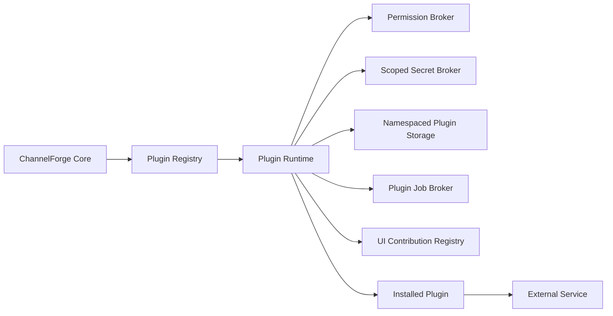

# ChannelForge Plugin Architecture Specification

- **Specification version:** 0.1
- **Status:** Draft
- **Last updated:** 2026-07-27

## Purpose

This document defines the ChannelForge plugin architecture.

It specifies:

- Plugin package structure
- Plugin manifests
- Extension points
- Plugin permissions
- Capability declarations
- Installation
- Activation
- Upgrade
- Disablement
- Uninstallation
- Compatibility
- Isolation
- Secrets
- Plugin storage
- Plugin background jobs
- Plugin-provided integrations
- Plugin-provided rules
- Plugin-provided outputs
- Plugin-provided user-interface contributions
- Observability
- Signing and trust
- Failure containment
- Migration
- Testing
- Versioning
- Removal behavior

This document defines the extension boundary.

It does not define:

- The exact built-in Plex, Jellyfin, and Emby adapters
- Exact REST route syntax
- Exact database table layout
- Exact deployment package format
- Exact browser component framework
- Exact operating-system sandbox technology

Those concerns are defined in the integrations, API, persistence, deployment, and
implementation specifications.

## Plugin Mission

Plugins allow ChannelForge to gain new capabilities without allowing arbitrary
extension code to become indistinguishable from the core application.

A plugin must:

- Declare what it provides
- Declare what it requires
- Receive only approved permissions
- Use stable extension interfaces
- Remain version-compatible
- Fail without corrupting core state
- Be observable
- Be disableable
- Be removable
- Preserve data ownership and provenance
- Avoid direct access to internal database structures
- Avoid unrestricted access to secrets
- Avoid unrestricted command execution
- Avoid bypassing domain validation

The plugin system must favor safety and clear boundaries over unrestricted
flexibility.

## Scope

Version 1 may support plugins that provide:

- Media Source adapters
- Metadata provider adapters
- Artwork provider adapters
- Schedule importers
- Schedule exporters
- Programming rules
- Programming templates
- Programming Packs
- Output artifact generators
- Notification adapters
- Health checks
- Diagnostic analyzers
- Backup destinations
- Limited UI contributions
- Background maintenance tasks

Version 1 does not require:

- Native binary plugins
- In-process unrestricted Node.js packages
- Arbitrary shell-command plugins
- Browser extensions
- Remote marketplace installation
- Dynamic database schema access
- Per-request untrusted code execution
- Multi-tenant plugin isolation
- Kernel-level sandboxing
- Arbitrary FFmpeg filter injection
- Arbitrary SQL execution
- Arbitrary filesystem access

## Core Principles

1. Plugins extend declared ports.
2. Plugins do not access internal database tables directly.
3. Plugins do not bypass application-service validation.
4. Plugins receive least privilege.
5. Permissions are explicit and reviewable.
6. Plugin code is versioned and attributable.
7. Plugin failures are contained.
8. Plugin state is namespaced.
9. Plugin secrets are scoped.
10. Plugin jobs are bounded.
11. Plugin network access is declared.
12. Plugin output is validated before activation.
13. Plugin upgrades are reversible where practical.
14. Disabling a plugin stops new execution.
15. Uninstalling a plugin does not silently destroy historical data.
16. Built-in capabilities may use the same ports as external plugins.
17. The plugin system must not become a remote-code-execution interface.
18. Plugin compatibility is checked before activation.
19. Plugin events and actions are auditable.
20. Core operation remains possible when optional plugins fail.

## Architectural Boundary



The core exposes approved extension ports.

Plugins consume those ports.

Plugins do not import arbitrary core implementation modules.

## Plugin Terms

### Plugin

A Plugin is an installed extension package with one stable Plugin ID.

### Plugin Package

A Plugin Package is the distributable artifact containing manifest, executable
content, schemas, assets, documentation, and signatures.

### Plugin Manifest

A Plugin Manifest declares identity, version, compatibility, extension points,
permissions, configuration, and package integrity.

### Plugin Registration

A Plugin Registration is the instance-level record of an installed plugin.

### Plugin Instance

A Plugin Instance is one configured use of a plugin.

A plugin may support one or multiple instances.

### Extension Point

An Extension Point is a stable ChannelForge contract that a plugin may
implement.

### Capability

A Capability is a declared behavior provided by a plugin.

### Permission

A Permission grants access to a bounded ChannelForge or host capability.

### Plugin Runtime

The Plugin Runtime loads, validates, starts, supervises, and stops plugin code.

### Plugin State

Plugin State is durable data owned by one Plugin Registration or Plugin
Instance.

### Plugin Secret

A Plugin Secret is encrypted or externally managed secret material scoped to one
plugin and optional instance.

### Plugin Job

A Plugin Job is bounded asynchronous work executed through ChannelForge job
coordination.

### Plugin Contribution

A Plugin Contribution is a registered route, rule, adapter, field, command,
view, artifact generator, or other approved extension.

## Plugin Identity

Every plugin has a stable Plugin ID.

Recommended format:

```text
publisher.plugin-name
```

Example:

```text
channel-forge.example-metadata
```

The Plugin ID must:

- Be globally unique within an installation
- Be lowercase or normalized according to one rule
- Remain stable across versions
- Not contain mutable display text
- Not be reused for an unrelated plugin
- Be included in signatures and provenance
- Namespace plugin storage and secrets

## Plugin Version

Plugin versions use semantic versioning or an equivalent ordered version model.

A version change communicates:

- Patch: compatible fixes
- Minor: backward-compatible capabilities
- Major: potentially incompatible plugin behavior

ChannelForge compatibility is declared separately.

## Plugin Registration Identity

An installed plugin has a ChannelForge-owned `pluginRegistrationId`.

This identity remains stable across:

- Enable
- Disable
- Compatible upgrade
- Configuration changes

Reinstall behavior depends on uninstall retention policy.

## Plugin Instance Identity

A plugin supporting multiple configurations has one `pluginInstanceId` per
configuration.

Examples:

- Two metadata provider accounts
- Two notification destinations
- Multiple output destinations
- Multiple custom media sources

## Built-In Versus External Plugins

Built-in adapters may be registered through the same extension interfaces.

Built-in plugins differ in distribution and trust:

- Shipped with ChannelForge
- Tested as part of the release
- Signed or embedded by the project
- May receive preapproved permissions
- Cannot be removed if required by core compatibility

Built-in status does not justify direct domain or database bypass.

## Plugin Package Structure

A package may contain:

```text
plugin-package/
  channel-forge-plugin.json
  dist/
  schemas/
  assets/
  migrations/
  docs/
  LICENSE
  NOTICE
  SIGNATURE
```

Exact archive format remains an implementation decision.

## Required Package Files

Required:

- Manifest
- Executable entrypoint or declarative contribution
- License metadata
- Package checksum data

Optional:

- Configuration schemas
- UI assets
- Plugin-owned migrations
- Documentation
- Localization
- Test metadata
- Signature
- Notices
- Source map policy

## Plugin Manifest

The manifest is a versioned, validated document.

Required conceptual fields:

- Manifest schema version
- Plugin ID
- Display name
- Plugin version
- Publisher
- Description
- License
- ChannelForge compatibility range
- Runtime type
- Entrypoint
- Extension points
- Capabilities
- Required permissions
- Optional permissions
- Configuration schemas
- Secret schemas
- Resource limits
- Network declarations
- Storage declarations
- UI contributions
- Migration declarations
- Signature metadata
- Package checksum

## Manifest Example

```json
{
  "manifestVersion": 1,
  "pluginId": "example.schedule-importer",
  "displayName": "Example Schedule Importer",
  "version": "1.2.0",
  "publisher": "Example",
  "channelForge": {
    "minimumVersion": "1.0.0",
    "maximumTestedVersion": "1.x"
  },
  "runtime": {
    "type": "ISOLATED_PROCESS",
    "entrypoint": "dist/main.js"
  },
  "extensions": [
    {
      "type": "SCHEDULE_IMPORTER",
      "id": "example-csv"
    }
  ],
  "permissions": {
    "required": [
      "CATALOG_READ",
      "PLUGIN_STORAGE_WRITE"
    ],
    "optional": [
      "NETWORK_OUTBOUND"
    ]
  }
}
```

## Manifest Validation

Validation includes:

- Schema version
- Plugin ID format
- Version format
- Entrypoint existence
- Extension-point validity
- Permission validity
- Duplicate declarations
- Configuration-schema validity
- Path safety
- Resource limits
- Network declarations
- Package checksum
- Signature state
- Compatibility
- Unsupported fields
- Maximum manifest size

## Unknown Manifest Fields

Unknown fields are rejected unless the manifest schema explicitly allows
extension objects.

This prevents silent permission or behavior typos.

## Package Integrity

Every package has a content checksum.

The checksum covers:

- Manifest
- Executable content
- Schemas
- Assets
- Migrations
- Notices

The exact canonical archive and checksum algorithm are versioned.

## Package Signing

A plugin package may be:

- Project signed
- Trusted publisher signed
- Locally signed
- Unsigned

## Signature States

Suggested states:

- `VERIFIED_PROJECT`
- `VERIFIED_PUBLISHER`
- `VERIFIED_LOCAL`
- `UNSIGNED`
- `INVALID`
- `UNKNOWN_PUBLISHER`
- `REVOKED`

## Trust Policy

Instance policy may allow:

- Project-signed only
- Trusted publishers
- Locally approved unsigned plugins
- Development plugins
- No external plugins

Unsigned plugin installation should require explicit elevated confirmation.

## Publisher Trust

A publisher record may include:

- Publisher ID
- Display name
- Public key
- Trust state
- Added by
- Added timestamp
- Revocation timestamp
- Notes

## Signature Revocation

When a publisher or package is revoked:

- Block new installation.
- Warn on installed versions.
- Disable automatically only according to explicit security policy.
- Preserve plugin state.
- Record audit.
- Provide remediation.

## Package Source

A plugin package may originate from:

- Local upload
- Managed directory
- Project repository
- Future marketplace
- Development path

Package source is recorded for provenance.

## Installation Lifecycle

Suggested installation states:

- `UPLOADED`
- `VALIDATING`
- `AWAITING_APPROVAL`
- `INSTALLING`
- `INSTALLED`
- `ENABLING`
- `ENABLED`
- `DISABLING`
- `DISABLED`
- `UPGRADING`
- `UNINSTALLING`
- `UNINSTALLED`
- `FAILED`
- `QUARANTINED`

## Installation Workflow

1. Upload or select package.
2. Bound package size.
3. Inspect archive safely.
4. Validate manifest.
5. Verify checksum.
6. Verify signature.
7. Evaluate compatibility.
8. Evaluate permissions.
9. Display review.
10. Obtain administrator approval.
11. Extract into managed plugin storage.
12. Run package validation.
13. Create Plugin Registration.
14. Apply plugin-owned storage migration if allowed.
15. Register contributions.
16. Keep plugin disabled until configured or explicitly enabled.
17. Record audit.

## Safe Archive Extraction

Extraction must prevent:

- Path traversal
- Absolute paths
- Symlink escapes
- Device files
- Excessive file count
- Excessive decompressed size
- Filename collisions
- Case-collision attacks
- Nested archive bombs

## Installation Review

The administrator must see:

- Plugin ID
- Publisher
- Version
- Signature state
- ChannelForge compatibility
- Required permissions
- Optional permissions
- Network access
- Storage use
- UI contributions
- Background jobs
- Migration behavior
- Uninstall behavior
- Known warnings

## Permission Approval

Required permissions must be approved for activation.

Optional permissions may be denied.

The plugin must handle denied optional permissions.

## Activation

Activation requires:

- Installed package
- Compatible version
- Valid manifest
- Approved required permissions
- Valid configuration
- Valid secrets where required
- Successful initialization
- No blocking health findings
- No quarantine state

## Activation Workflow

1. Acquire plugin lifecycle lock.
2. Verify current package checksum.
3. Verify compatibility.
4. Load configuration.
5. Resolve permission grant.
6. Start Plugin Runtime.
7. Call initialization.
8. Register contributions.
9. Run health probe.
10. Mark enabled.
11. Emit PluginEnabled event.
12. Record audit.

## Deactivation

Deactivation stops new plugin work.

Workflow:

1. Mark disabling.
2. Reject new calls.
3. Request job cancellation.
4. Drain bounded in-flight calls.
5. Unregister contributions.
6. Stop runtime.
7. Release resources.
8. Mark disabled.
9. Preserve state and configuration.
10. Record audit.

## Forced Deactivation

When graceful deactivation fails:

- Terminate isolated runtime.
- Mark in-flight plugin jobs abandoned or failed.
- Release leases.
- Preserve diagnostics.
- Mark health failed.
- Disable plugin.
- Record forced action.

## Plugin Configuration

Configuration is distinct from secrets.

A plugin declares one or more JSON schemas.

Configuration may be scoped to:

- Plugin Registration
- Plugin Instance
- Channel
- Network
- User
- Output Profile

Only declared scopes are permitted.

## Configuration Validation

Validation includes:

- JSON schema
- Size
- Required fields
- Enumeration values
- URL policy
- Path policy
- Cross-field constraints
- Permission-dependent fields
- Secret-reference existence
- Plugin-defined validation through bounded call

## Configuration Versioning

Each configuration document includes:

- Schema version
- Plugin version
- Mutable version
- Created timestamp
- Updated timestamp
- Migration state

## Configuration Migration

A plugin upgrade may migrate configuration.

Migration must:

- Be declared
- Be versioned
- Be deterministic
- Be bounded
- Be restart-safe
- Preserve prior configuration until success
- Support preview where changes are material
- Record audit

## Secret Schema

A plugin may declare secret fields.

Examples:

- API token
- Password
- Client secret
- Signing key
- Webhook secret

The manifest declares purpose and scope.

## Plugin Secret Storage

Plugin secrets are stored through ChannelForge secret storage.

A plugin receives secret values only during approved operations.

## Secret Access

Secret access requires:

- Declared secret name
- Granted permission
- Matching Plugin ID
- Matching Plugin Instance
- Runtime call context
- Audit or access metrics where appropriate

## Secret Prohibitions

A plugin may not:

- Enumerate other plugin secrets
- Read core Media Source secrets unless an extension contract explicitly grants
  a scoped operation
- Export raw secrets
- Log secrets
- Persist decrypted secrets
- Include secrets in UI state
- Include secrets in diagnostics
- Include secrets in domain events

## Secret Rotation

Rotation:

- Stores new secret
- Verifies configuration
- Notifies plugin through lifecycle hook
- Invalidates cached access
- Preserves prior secret only according to rollback policy
- Records audit

## Extension Point Registry

The Extension Point Registry defines all supported plugin contribution types.

Each extension point includes:

- Stable type ID
- Contract version
- Input schema
- Output schema
- Permission requirements
- Timeout
- Cancellation behavior
- Error contract
- Idempotency rules
- Lifecycle hooks
- Compatibility range
- Test kit

## Version 1 Extension Points

Potential extension points:

- `MEDIA_SOURCE_ADAPTER`
- `METADATA_PROVIDER`
- `ARTWORK_PROVIDER`
- `SCHEDULE_IMPORTER`
- `SCHEDULE_EXPORTER`
- `PROGRAMMING_RULE`
- `PROGRAMMING_TEMPLATE_PROVIDER`
- `PROGRAMMING_PACK_PROVIDER`
- `OUTPUT_ARTIFACT_GENERATOR`
- `NOTIFICATION_ADAPTER`
- `BACKUP_DESTINATION`
- `HEALTH_CHECK`
- `DIAGNOSTIC_ANALYZER`
- `UI_PANEL`
- `UI_FIELD`
- `BACKGROUND_TASK`

Not every extension point must ship in the first implementation release.

## Media Source Adapter Extension

A Media Source plugin may implement the normalized integration ports defined in
`07-integrations.md`.

It must not:

- Return provider SDK objects
- Store credentials itself
- Generate ChannelForge Catalog IDs
- Mutate Catalog tables directly
- Return permanent signed URLs as identity
- Bypass playback resolution policy

## Metadata Provider Extension

A Metadata Provider may implement:

- Search
- Entity lookup
- Metadata enrichment
- Artwork lookup
- Provider ID mapping
- Rate-limit observations

It receives only approved Catalog fields.

## Artwork Provider Extension

An Artwork Provider may:

- Search artwork
- Resolve artwork references
- Return metadata
- Recommend caching

It may not write arbitrary files.

Managed artwork enters ChannelForge storage through the core validation path.

## Schedule Importer Extension

A Schedule Importer converts an external format into a normalized draft import
model.

It must:

- Preserve source provenance
- Report unresolved programs
- Avoid direct publication
- Avoid direct Schedule Plan mutation
- Produce validation findings
- Support preview

## Schedule Exporter Extension

A Schedule Exporter receives approved plan projections.

It may generate:

- CSV
- JSON
- XML
- Provider-specific schedule documents

Output is validated and stored through managed artifact services.

## Programming Rule Extension

A Programming Rule plugin supplies deterministic rule evaluation.

A rule declaration includes:

- Rule type
- Rule version
- Parameter schema
- Hard or soft classification
- Input fields required
- Determinism declaration
- Cost classification
- Explanation formatter
- Compatibility range

## Rule Determinism

A rule must not depend on:

- Wall-clock time not supplied in input
- Unseeded randomness
- Network calls during evaluation
- Database row order
- Hidden mutable state
- Process-specific hash order

## Rule Execution

Rule execution receives an immutable bounded context.

It returns:

- Eligibility result or score contribution
- Evidence
- Explanation data
- Warnings
- Execution metrics

## Rule Timeout

A rule exceeding its timeout:

- Is aborted
- Produces structured failure
- May fail generation when required
- Cannot continue in background
- Increments plugin health failure

## Rule Failure Policy

A plugin rule declares whether it is:

- Required
- Optional
- Fallback-capable

A required hard rule failure should fail generation rather than silently allow
content.

## Template Provider Extension

A Template Provider contributes draftable templates.

Templates are imported as ChannelForge-owned revision data.

The plugin does not retain hidden control over applied templates.

## Programming Pack Provider

A Pack Provider may distribute:

- Templates
- Rule defaults
- Branding references
- Example Networks
- Programming configuration

Pack data is untrusted and validated.

## Output Artifact Generator

An Output Artifact Generator may produce a custom artifact from approved
ChannelForge projections.

It receives no raw database access.

Output passes through:

- Size limits
- MIME validation
- Checksum
- Managed storage
- Activation policy
- Security review

## Notification Adapter

A Notification Adapter may send bounded notifications.

It receives only approved event summaries.

It must not:

- Receive source credentials
- Receive raw audit secrets
- Block core transaction completion
- Directly mutate domain state

Delivery occurs asynchronously.

## Backup Destination Extension

A Backup Destination may receive a verified backup archive.

It receives:

- Backup metadata
- Managed file stream or path capability
- Destination-scoped secret
- Cancellation
- Progress reporting

It may not inspect decrypted application secrets unless the backup format
contains them by design and permission explicitly acknowledges it.

## Health Check Extension

A Health Check plugin returns observations.

It may not mark core entities healthy or unhealthy directly.

Core aggregation interprets the observation.

## Diagnostic Analyzer

A Diagnostic Analyzer receives redacted bounded diagnostic input.

It returns findings and recommendations.

It cannot execute repair actions without a separate authorized command.

## Background Task Extension

A Background Task plugin may declare periodic or on-demand jobs.

The declaration includes:

- Job type
- Trigger policy
- Required permission
- Concurrency
- Timeout
- Retry policy
- Checkpoint schema
- Resource limits

## UI Panel Extension

A UI Panel contribution is declarative or isolated.

It may add:

- Settings panel
- Status panel
- Resource detail panel
- Dashboard card
- Form section

## UI Isolation

Plugin UI must not receive unrestricted access to the first-party application
runtime.

Potential approaches:

- Declarative schema-driven UI
- Sandboxed iframe
- Restricted component registry
- Server-rendered safe schema

Version 1 should prefer declarative UI.

## Declarative UI

A declarative UI contribution may specify:

- Fields
- Labels
- Descriptions
- Validation
- Grouping
- Data source
- Commands
- Visibility permission
- Help links
- Status indicators

## UI Command Binding

Plugin UI commands invoke registered plugin or core commands.

They do not call arbitrary internal functions.

## UI Asset Safety

Plugin assets must be:

- Served from managed paths
- Content-type validated
- Subject to Content Security Policy
- Free of inline script unless explicitly allowed by isolation model
- Size bounded
- Checksum verified

## UI Styling

Plugin UI must use approved design tokens or isolated styles.

It must not globally override core styles.

## UI Navigation

A plugin may request navigation placement.

The registry controls:

- Label
- Icon
- Order
- Permission
- Route namespace
- Visibility
- Disabled state

## Route Namespace

Plugin management routes are namespaced.

Example:

```text
/api/v1/plugins/{pluginRegistrationId}/...
```

Provider or contribution routes may receive stable core aliases only when
approved.

## Plugin API Handlers

A plugin may register bounded API operations through a typed contract.

It may not register arbitrary raw server middleware.

## Plugin API Input

Inputs pass through:

- Authentication
- Authorization
- Schema validation
- Size limits
- Request ID
- Rate limits
- Timeout
- Cancellation

## Plugin API Output

Outputs pass through:

- Schema validation
- Secret redaction
- Size limits
- Error translation
- Content-type validation

## Permission Model

Permissions are stable identifiers.

Suggested categories:

- Catalog
- Networks and Channels
- Scheduling
- Runtime
- Integration
- Files
- Network
- Secrets
- Jobs
- UI
- Audit
- Backup
- Diagnostics

## Suggested Permissions

### Catalog

- `CATALOG_READ`
- `CATALOG_METADATA_PROPOSE`
- `CATALOG_COLLECTION_READ`
- `CATALOG_COLLECTION_WRITE`
- `CATALOG_ARTWORK_PROPOSE`

### Networks and Channels

- `NETWORK_READ`
- `CHANNEL_READ`
- `NETWORK_TEMPLATE_PROPOSE`
- `CHANNEL_CONFIGURATION_PROPOSE`

### Scheduling

- `SCHEDULE_READ`
- `SCHEDULE_IMPORT_PROPOSE`
- `SCHEDULE_EXPORT`
- `SCHEDULING_RULE_EXECUTE`

### Runtime

- `RUNTIME_STATUS_READ`
- `RUNTIME_CONTROL_REQUEST`
- `OUTPUT_ARTIFACT_PROPOSE`

### Integrations

- `MEDIA_SOURCE_ADAPTER`
- `METADATA_PROVIDER`
- `ARTWORK_PROVIDER`

### Files

- `PLUGIN_STORAGE_READ`
- `PLUGIN_STORAGE_WRITE`
- `MANAGED_ARTIFACT_PROPOSE`
- `TEMPORARY_FILE_USE`

### Network

- `NETWORK_OUTBOUND`
- `NETWORK_INBOUND_WEBHOOK`

### Secrets

- `PLUGIN_SECRET_READ`
- `PLUGIN_SECRET_WRITE`

### Jobs

- `PLUGIN_JOB_REGISTER`
- `PLUGIN_JOB_EXECUTE`

### UI

- `UI_PANEL_REGISTER`
- `UI_COMMAND_REGISTER`

### Audit and Diagnostics

- `AUDIT_SUMMARY_READ`
- `DIAGNOSTIC_INPUT_READ`
- `DIAGNOSTIC_FINDING_PROPOSE`

### Backup

- `BACKUP_ARCHIVE_RECEIVE`
- `BACKUP_DESTINATION_REGISTER`

## Permission Granularity

Permissions may include constraints.

Examples:

```json
{
  "permission": "NETWORK_OUTBOUND",
  "constraints": {
    "hosts": [
      "api.example.com"
    ],
    "ports": [
      443
    ],
    "schemes": [
      "https"
    ]
  }
}
```

## Permission Grants

A Permission Grant includes:

- Plugin Registration ID
- Permission ID
- Constraints
- Required or optional state
- Approved by
- Approved timestamp
- Expiration where applicable
- Revocation timestamp
- Grant version

## Permission Changes

Increasing required permissions during upgrade requires new approval.

Reducing permissions does not require additional approval.

Changing constraints to broader access requires approval.

## Permission Revocation

Revocation:

- Stops new calls requiring permission
- Cancels or fails affected jobs
- May disable plugin if required permission is revoked
- Preserves state
- Records audit

## Permission Broker

The Permission Broker evaluates every privileged plugin operation.

It must not rely solely on manifest declarations.

## Capability Tokens

Internal capability tokens may provide time-bounded operation authority.

A token may be scoped to:

- Plugin Registration
- Plugin Instance
- Permission
- Resource ID
- Operation
- Expiration

## Network Access

Outbound network access is denied by default for external plugins.

A network declaration includes:

- Hosts
- Schemes
- Ports
- Redirect policy
- DNS policy
- Request limits
- Response size
- Credential use
- Purpose

## Dynamic Hosts

Plugins requiring dynamic hosts need a broader reviewed permission.

Broad network permission should be visibly high risk.

## Network Broker

The safest model routes plugin HTTP through a ChannelForge network broker.

The broker applies:

- Allowlist
- Timeouts
- Cancellation
- Redaction
- Rate limits
- Response-size limits
- Metrics
- TLS policy
- Redirect policy

## Direct Socket Access

Direct unrestricted socket access should not be available in version 1.

## Inbound Network Access

Plugins do not bind arbitrary ports.

Inbound plugin behavior uses ChannelForge-controlled routes.

## Webhook Registration

A plugin webhook contribution declares:

- Route suffix
- Authentication scheme
- Body limit
- Event schema
- Replay policy
- Rate limit
- Processing job type

## Filesystem Access

Direct arbitrary filesystem access is denied.

Plugins use:

- Namespaced durable storage
- Namespaced temporary storage
- Managed artifact proposal
- Approved local-source adapter capability where explicitly supported

## Plugin Storage

Plugin storage is namespaced by Plugin ID and registration.

A plugin cannot traverse into another plugin's storage.

## Storage Classes

Suggested classes:

- Durable state
- Cache
- Temporary
- Artifact staging
- Diagnostic
- Migration backup

## Storage Quotas

Each plugin may have:

- Durable byte limit
- Cache byte limit
- Temporary byte limit
- File count limit
- Maximum individual file size

## Storage Record

A plugin-managed durable file may record:

- Plugin Registration
- Plugin Instance
- Relative path
- Class
- Size
- Checksum
- Created timestamp
- Updated timestamp
- Retention state

## Plugin Key-Value State

Small plugin state may use a namespaced key-value service.

Requirements:

- Key length limit
- Value size limit
- Version
- Optimistic concurrency
- Encryption classification
- Enumeration limits
- Backup inclusion

## Plugin Relational State

Version 1 should avoid arbitrary plugin-created core database tables.

Potential approaches:

- Versioned JSON documents
- Namespaced key-value records
- Approved plugin state tables managed by core
- Separate plugin SQLite database
- Isolated plugin storage file

The exact approach remains open.

## Separate Plugin Database

A separate plugin database may improve isolation.

It introduces:

- Backup coordination
- Migration management
- Transaction separation
- File count
- Restore complexity

## Plugin State Ownership

Plugin state belongs to the plugin, but ChannelForge owns lifecycle and storage
coordination.

## State Backup

Durable plugin state is included in full backup unless:

- Manifest declares rebuildable cache
- Administrator excludes it
- Plugin is quarantined with unsafe format

## State Export

Before uninstall, the administrator may export plugin state.

## Runtime Isolation

Potential runtime modes:

- `DECLARATIVE_ONLY`
- `ISOLATED_PROCESS`
- `WASM`
- `BUILT_IN`
- `DEVELOPMENT_IN_PROCESS`

## Declarative-Only Plugins

Declarative plugins contain no executable code.

They may provide:

- Templates
- Packs
- Schemas
- Static mappings
- UI forms
- Output definitions

This is the lowest-risk plugin type.

## Isolated Process

An isolated process communicates through a typed protocol.

Benefits:

- Crash containment
- Memory limits
- Process termination
- Dependency isolation
- Reduced module access

Risks:

- Operating-system variation
- Startup cost
- IPC complexity
- Filesystem exposure
- Network exposure

## WebAssembly

WASM may provide stronger portability and capability-based execution.

Version 1 may defer WASM until runtime needs justify it.

## Built-In Runtime

Built-in plugins execute as trusted application modules.

They still register extension contracts.

## Development In-Process Runtime

Development mode may allow in-process loading.

It must:

- Be disabled in normal production
- Display warning
- Require explicit configuration
- Never accept untrusted packages
- Avoid being used as a marketplace path

## IPC Protocol

An isolated plugin runtime uses a versioned protocol.

It defines:

- Handshake
- Plugin identity
- Manifest checksum
- Capability registration
- Request
- Response
- Error
- Cancellation
- Progress
- Heartbeat
- Shutdown
- Health

## IPC Message Requirements

Messages are:

- Size bounded
- Schema validated
- Correlated
- Versioned
- Timeout controlled
- Free of raw secret leakage unless a scoped secret operation requires it

## Runtime Handshake

Handshake verifies:

- Plugin ID
- Plugin version
- Runtime protocol version
- Package checksum
- Granted permissions
- Extension contracts
- Configuration schema
- Process identity

## Runtime Lease

A running plugin may hold a lease.

Lease includes:

- Plugin Registration
- Application instance
- Runtime process
- Started timestamp
- Heartbeat
- Expiration
- State

## Runtime Heartbeat

Missing heartbeat causes:

- Runtime health degradation
- Call rejection
- Process termination
- Plugin disable or restart according to policy

## Runtime Restart Policy

Suggested policies:

- Never restart automatically
- Restart on crash
- Restart with bounded attempts
- Quarantine after repeated crash

## Crash Loop

A crash loop is detected through:

- Crash count
- Time window
- Startup failure
- Heartbeat failure
- Exit code

Crash-loop policy should disable or quarantine the plugin.

## Resource Limits

A plugin may be limited by:

- Memory
- CPU
- Execution time
- Concurrent calls
- Background jobs
- Storage
- Network requests
- Response size
- Log volume
- File descriptors

## Timeout Classes

Suggested classes:

- Initialization
- Request
- Rule evaluation
- Health check
- Shutdown
- Job checkpoint
- Migration

## Cancellation

Plugin calls must accept cancellation.

A plugin that ignores cancellation may be terminated in isolated mode.

## Plugin Logs

Plugins emit structured logs through ChannelForge.

Required fields:

- Plugin ID
- Plugin version
- Plugin Registration ID
- Plugin Instance ID
- Severity
- Message
- Correlation ID
- Operation
- Timestamp

## Log Redaction

Plugin logs pass through redaction and size limits.

Plugins cannot write directly into core log files.

## Log Rate Limit

Excessive plugin logs are throttled.

Dropped log counts are recorded.

## Plugin Metrics

Plugins may emit declared metrics.

Metric declarations include:

- Name
- Type
- Unit
- Labels
- Cardinality limits
- Description

Unbounded dynamic labels are prohibited.

## Plugin Tracing

Plugin operations may participate in tracing through correlation context.

Plugins cannot create arbitrary unbounded spans.

## Plugin Health

Suggested health states:

- `UNKNOWN`
- `HEALTHY`
- `DEGRADED`
- `FAILED`
- `DISABLED`
- `QUARANTINED`
- `INCOMPATIBLE`

## Health Dimensions

Plugin health may include:

- Runtime availability
- Configuration validity
- Secret validity
- Extension registration
- External dependency
- Migration state
- Job failures
- Crash count
- Permission state
- Package integrity

## Health Probe

A health probe is bounded and permission-aware.

It returns observations rather than mutating core health directly.

## Health Failure

A plugin health failure may:

- Warn
- Disable contribution
- Disable plugin
- Quarantine package
- Block dependent operation

Policy depends on severity and whether the plugin is required.

## Dependency Model

A plugin may depend on:

- ChannelForge version
- Extension contract version
- Another plugin capability
- Another plugin ID and version
- Optional capability

## Dependency Declaration

Dependencies must be explicit in the manifest.

Circular required dependencies are invalid.

## Dependency Activation

A plugin cannot activate until required dependencies are active and compatible.

## Dependency Disable

Disabling a dependency may disable dependent contributions.

The UI must show impact before confirmation.

## Optional Dependencies

Optional dependencies add capabilities when present.

Absence must not prevent activation.

## Plugin Ordering

When multiple plugins provide the same capability, resolution must be explicit.

Possible policies:

- Operator-selected priority
- One active provider
- Ordered fallback
- All providers
- Context-specific selection

## Extension Conflict

An Extension Conflict occurs when:

- Two plugins claim a unique extension ID
- Route namespace collides
- Rule type collides
- UI slot collides incompatibly
- Provider type collides
- Output artifact type collides
- Required permission cannot be granted

Conflicts block activation until resolved.

## Plugin Background Jobs

Plugin jobs use the core Background Job system.

A plugin may not create unmanaged long-running threads as durable work.

## Plugin Job Definition

A definition includes:

- Plugin ID
- Job type
- Input schema
- Checkpoint schema
- Result schema
- Timeout
- Retry
- Concurrency
- Permission
- Resource limits
- Cancellation behavior

## Plugin Job State

Core persistence stores:

- Job identity
- Plugin identity
- State
- Input checksum
- Progress
- Checkpoint
- Result reference
- Error
- Attempt
- Lease
- Timing

## Job Execution

A plugin job receives:

- Validated input
- Granted capability context
- Cancellation
- Progress reporter
- Checkpoint service
- Namespaced storage
- Scoped secrets

## Plugin Job Recovery

After restart:

- Reconcile lease.
- Resume only if job declares resumable behavior.
- Otherwise mark abandoned or requeue.
- Preserve checkpoint.
- Avoid duplicate effects through idempotency.

## Scheduled Plugin Tasks

A plugin may request periodic tasks.

ChannelForge controls:

- Minimum cadence
- Maximum concurrency
- Maintenance windows
- Disabled behavior
- Missed-run behavior
- Jitter
- Priority

## Minimum Cadence

The plugin system should prevent high-frequency schedules that overload the
instance.

## Event Subscription

A plugin may subscribe to approved domain events.

Examples:

- Schedule published
- Source health changed
- Catalog synchronization completed
- Channel runtime failed
- Backup completed
- Plugin state changed

## Event Payload

Payloads are bounded projections.

They do not expose unrestricted aggregate state.

## Event Delivery

Delivery is at least once.

Plugin handlers must be idempotent.

## Event Permission

Subscription requires a declared permission.

## Event Backpressure

A slow plugin cannot block core event dispatch indefinitely.

Events may queue through Background Jobs or Outbox-driven delivery.

## Plugin Domain Mutations

Plugins cannot mutate domain state directly.

They may:

- Propose metadata
- Propose artwork
- Submit import preview
- Request command execution
- Produce recommendations
- Produce artifacts

Core application services validate and apply accepted changes.

## Proposal Model

A Plugin Proposal includes:

- Plugin identity
- Contribution type
- Target resource
- Proposed change
- Provenance
- Confidence
- Validation
- Created timestamp
- Expiration
- Acceptance state

## Proposal Acceptance

Acceptance is:

- Manual
- Policy-based
- Audited
- Applied through ordinary domain command
- Reversible through domain revision where possible

## Automatic Proposal Policy

Automatic acceptance requires explicit instance policy.

## Plugin Provenance

Data produced by a plugin records:

- Plugin ID
- Plugin version
- Contribution ID
- Operation ID
- Timestamp
- Input checksum where useful
- Confidence
- Acceptance state

## Plugin-Generated Identifiers

Plugins may generate their own internal IDs.

ChannelForge-owned resources receive ChannelForge IDs.

Plugin IDs cannot replace canonical domain identity.

## Plugin Migrations

Plugin package upgrades may include state migrations.

## Migration Declaration

A migration includes:

- Plugin ID
- From version
- To version
- Migration ID
- Checksum
- Runtime requirement
- Input schema
- Output schema
- Estimated size
- Rollback support
- Backup requirement

## Migration Workflow

1. Disable plugin contributions.
2. Create plugin-state backup.
3. Verify package.
4. Run migration in bounded isolated context.
5. Validate state.
6. Activate new version.
7. Run health probe.
8. Commit version pointer.
9. Retain rollback package according to policy.
10. Record audit.

## Migration Failure

On failure:

- Keep prior active package.
- Restore prior state where safe.
- Mark upgrade failed.
- Preserve diagnostics.
- Leave plugin disabled if state safety is uncertain.
- Do not affect unrelated plugins.

## Core Migration Interaction

Core database migrations and plugin migrations are separate.

A core migration may update plugin framework tables but must not execute
arbitrary plugin code during application schema migration.

## Upgrade

A plugin upgrade requires:

- Same Plugin ID
- New version
- Valid package
- Compatible ChannelForge version
- Permission comparison
- State migration compatibility
- Dependency compatibility
- Signature verification

## Upgrade Preview

The administrator should see:

- Version change
- Permission changes
- New network hosts
- New secrets
- New extension points
- Removed extension points
- State migration
- Configuration migration
- Compatibility warnings
- Rollback support

## Upgrade Activation

Activation should be atomic at the Plugin Registration level.

Only one package version is active.

## Rollback

Rollback may be possible when:

- Prior package retained
- State migration reversible or unchanged
- Configuration compatible
- Core version compatible

Rollback is not guaranteed after destructive plugin-state migration.

## Downgrade

Downgrade is treated as a rollback with explicit compatibility validation.

## Disablement

Disabling a plugin preserves:

- Registration
- Package
- Configuration
- Secrets
- State
- Provenance
- Historical references
- Audit

It removes active contributions.

## Effects of Disablement

Dependent resources may become:

- Unavailable
- Degraded
- Read-only
- Orphaned but preserved
- Pending replacement

The impact must be shown before disablement.

## Uninstallation

Uninstallation removes executable package and active contributions.

It does not automatically delete:

- Historical provenance
- Audit
- Applied Schedule Plans
- Catalog Items
- Artifacts used by active publication
- Plugin state when retention is requested
- Secrets when retention is requested

## Uninstall Modes

Suggested modes:

- `REMOVE_PACKAGE_KEEP_STATE`
- `REMOVE_PACKAGE_AND_CONFIGURATION`
- `REMOVE_ALL_SAFE_DATA`
- `PURGE`

`PURGE` requires elevated confirmation and referential safety.

## Uninstall Impact Analysis

Before uninstall, ChannelForge identifies:

- Active plugin instances
- Dependent configurations
- Active rules
- Active templates
- Scheduled jobs
- Stored artifacts
- Secrets
- State
- Historical references
- Dependent plugins

## Uninstall Workflow

1. Analyze impact.
2. Require confirmation.
3. Disable plugin.
4. Cancel plugin jobs.
5. Remove contributions.
6. Stop runtime.
7. Export state if requested.
8. Remove package.
9. Apply selected state retention.
10. Revoke secret access.
11. Preserve provenance tombstone.
12. Record audit.

## Plugin Tombstone

A tombstone preserves:

- Plugin ID
- Last installed version
- Publisher
- Signature state
- Install timestamp
- Uninstall timestamp
- Retention mode
- Historical provenance mapping

## Reinstallation

Reinstall may reconnect retained state only when:

- Plugin ID matches
- State schema is compatible
- Administrator confirms
- Package trust is acceptable

## Quarantine

Quarantine prevents execution.

Reasons may include:

- Invalid signature
- Revoked publisher
- Package checksum mismatch
- Malware finding
- Repeated crash loop
- Permission violation
- Protocol violation
- Storage escape attempt
- Secret exfiltration attempt
- Incompatible version
- Corrupt migration

## Quarantine Behavior

- Stop runtime.
- Disable contributions.
- Block jobs.
- Preserve package for diagnosis according to policy.
- Revoke capability tokens.
- Preserve state.
- Create security finding.
- Require administrator action.

## Permission Violation

A denied privileged operation is recorded.

Repeated violations may quarantine the plugin.

## Protocol Violation

Examples:

- Oversized IPC message
- Invalid schema
- Unknown correlation ID
- Secret field in unapproved output
- Repeated timeout
- Invalid path
- Unapproved network destination

## Plugin Security Events

Potential events:

- Installation approved
- Unsigned plugin approved
- Permission granted
- Permission revoked
- Signature invalid
- Publisher revoked
- Runtime crashed
- Quarantine
- Secret access denied
- Network destination denied
- Storage escape blocked
- Migration failed
- Purge completed

## Plugin API Resources

Suggested management resources:

- Plugin Packages
- Plugin Registrations
- Plugin Instances
- Permission Grants
- Plugin Health
- Plugin Jobs
- Plugin Logs
- Plugin Metrics
- Plugin State Exports
- Publisher Trust Records

## Plugin API Concepts

Exact routes are defined in the API implementation.

Required conceptual operations include:

- List installed plugins
- Upload plugin package
- Validate package
- Read installation preview
- Install
- Enable
- Disable
- Upgrade
- Roll back
- Uninstall
- Purge
- Read manifest
- Read permissions
- Grant permission
- Revoke permission
- Read configuration
- Update configuration
- Rotate plugin secret
- Read health
- Read jobs
- Cancel plugin job
- Export plugin state
- Import retained state
- Quarantine
- Release quarantine
- Read publisher trust
- Add trusted publisher
- Revoke publisher trust

## Plugin API Authentication

All plugin management operations require authenticated access.

Installation, permission, quarantine, and purge require administrator-level
authorization.

## Plugin API Sensitive Fields

Responses must not include:

- Plugin secret values
- Raw core credentials
- Internal capability tokens
- Unredacted network headers
- Unmanaged filesystem paths
- Private signing keys

## Plugin Error Codes

Suggested codes:

- `PLUGIN_PACKAGE_INVALID`
- `PLUGIN_SIGNATURE_INVALID`
- `PLUGIN_PUBLISHER_UNTRUSTED`
- `PLUGIN_INCOMPATIBLE`
- `PLUGIN_PERMISSION_REQUIRED`
- `PLUGIN_PERMISSION_DENIED`
- `PLUGIN_DEPENDENCY_MISSING`
- `PLUGIN_EXTENSION_CONFLICT`
- `PLUGIN_CONFIGURATION_INVALID`
- `PLUGIN_SECRET_MISSING`
- `PLUGIN_START_FAILED`
- `PLUGIN_TIMEOUT`
- `PLUGIN_CRASHED`
- `PLUGIN_QUARANTINED`
- `PLUGIN_STORAGE_LIMIT`
- `PLUGIN_NETWORK_DENIED`
- `PLUGIN_PROTOCOL_VIOLATION`
- `PLUGIN_MIGRATION_FAILED`
- `PLUGIN_UNINSTALL_BLOCKED`

## Persistence Expectations

Persistence must support:

- Plugin Registration
- Installed package versions
- Manifest
- Package checksum
- Signature state
- Permission Grants
- Plugin Instances
- Configuration
- Secret references
- State
- Runtime lease
- Health
- Jobs
- Migrations
- Dependencies
- Extension registrations
- Tombstones
- Audit

## Plugin Registry Repository

Suggested repositories:

- `PluginRegistrationRepository`
- `PluginPackageRepository`
- `PluginPermissionRepository`
- `PluginInstanceRepository`
- `PluginStateRepository`
- `PluginMigrationRepository`
- `PluginHealthRepository`
- `PluginPublisherRepository`

## Plugin State and Core Transactions

Plugin state does not participate in arbitrary core aggregate transactions.

A plugin proposal is persisted separately and applied through a core command.

## Outbox Integration

Plugin event delivery may use the core Outbox.

Delivery records include:

- Event ID
- Plugin Registration
- Contribution ID
- Delivery state
- Attempt
- Error
- Timestamp

## Backup

Full backup includes:

- Plugin registrations
- Manifests
- Permission grants
- Configuration
- Secret references or encrypted secrets
- Durable state
- Installed package metadata
- Package archives according to policy
- Migration records
- Tombstones

## Restore

Restore must validate:

- Plugin package availability
- Package checksum
- ChannelForge compatibility
- Signature policy
- State schema
- Permission grants
- Secret availability

A restored plugin may remain disabled until verified.

## Package Retention

The instance may retain:

- Active package
- Previous rollback package
- Installed package archive
- Quarantined package
- Uninstalled package metadata

Retention is configurable.

## Observability

### Logs

Plugin logs are tagged with:

- Plugin ID
- Version
- Registration ID
- Instance ID
- Contribution ID
- Operation
- Request ID
- Correlation ID
- Job ID
- Severity

### Metrics

Suggested metrics:

- Installed plugin count
- Enabled plugin count
- Quarantined plugin count
- Plugin call latency
- Plugin call failures
- Plugin timeouts
- Plugin crashes
- Plugin restarts
- Permission denials
- Network denials
- Storage use
- Job count
- Event delivery lag
- Log drops
- Health state

### Tracing

Potential spans:

- Package validation
- Signature verification
- Plugin start
- Extension call
- Secret resolution
- Network broker call
- Plugin job
- Plugin migration
- Plugin shutdown
- Plugin uninstall

## Audit Requirements

Audit records are required for:

- Package upload
- Installation
- Unsigned approval
- Permission grant
- Permission revocation
- Configuration change
- Secret rotation
- Enable
- Disable
- Upgrade
- Rollback
- Quarantine
- Quarantine release
- Uninstall
- Purge
- Publisher trust addition
- Publisher revocation
- State export
- State import
- Forced runtime termination

## Privacy

Plugins receive only data required by their extension contract.

A plugin should not receive:

- User account details
- Client IP addresses
- Viewing history
- Audit details
- Source credentials
- Personal metadata

unless a specific permission and contract require it.

## Data Minimization

Every extension contract defines the minimum input projection.

## Plugin Documentation

A plugin package should provide:

- Description
- Publisher
- License
- Permissions
- Configuration guide
- Data handling
- Network destinations
- Uninstall behavior
- Troubleshooting
- Compatibility
- Support contact
- Source repository where applicable

## Marketplace

A future marketplace may provide:

- Search
- Version discovery
- Publisher trust
- Package download
- Update notification
- Security advisories
- Compatibility data

Marketplace support is not required for version 1.

## Update Discovery

Version 1 may support manually checking a declared update source.

Automatic installation of updates should be disabled by default.

## Security Advisories

ChannelForge may record plugin advisory state:

- Affected version
- Severity
- Fixed version
- Recommended action
- Publisher statement
- Project blocklist state

## Plugin Development Kit

A Plugin Development Kit should include:

- Manifest schema
- Extension interfaces
- Generated types
- Test harness
- Mock brokers
- Fixture utilities
- Packaging tool
- Signature tool guidance
- Compatibility checker
- Example plugins
- Documentation

## Development Server

A development workflow may support:

- Local plugin path
- Hot reload
- Verbose protocol logs
- Test permissions
- Mock secrets
- Mock external service
- Disabled signature requirement

Development mode must not be enabled accidentally in production.

## Contract Test Kit

Every extension point should provide reusable contract tests.

## Plugin Certification

A future certification process may verify:

- Manifest
- Permissions
- Determinism
- Resource limits
- Secret handling
- Network declarations
- Uninstall behavior
- Compatibility
- License
- Security

Certification is not required for local development.

## Compatibility

### ChannelForge Compatibility

The manifest declares:

- Minimum supported ChannelForge version
- Maximum tested version
- Required extension contract versions
- Optional feature flags

### Runtime Protocol Compatibility

The Plugin Runtime negotiates one protocol version.

### Extension Contract Compatibility

Each contribution declares supported contract version.

### Unknown Core Version

A plugin tested only against an older core may:

- Run with warning
- Require confirmation
- Be blocked

Policy depends on compatibility declaration.

## Deprecation

An extension point may be deprecated.

Deprecation includes:

- Replacement
- First deprecated version
- Planned removal
- Migration guide
- Runtime warning
- Development kit warning

## Removed Extension Point

A plugin requiring a removed extension point is incompatible.

## Plugin Compatibility Matrix

The instance may display:

- Plugin version
- Core version
- Runtime protocol
- Extension contracts
- Status
- Warnings
- Tested range

## Failure Containment

Plugin failure must not:

- Corrupt core database state
- Replace active publication
- Expose secrets
- Stop unrelated plugins
- Stop unrelated Media Sources
- Leave unmanaged processes
- Leave unbounded jobs
- Modify approved revisions
- Bypass authorization

## Required Plugin Failure

A required plugin may block a dependent operation.

Example:

- A required scheduling rule fails.

It should not crash the entire application.

## Optional Plugin Failure

Optional contribution failure may:

- Record warning
- Use fallback
- Skip contribution
- Mark plugin degraded

## Core Startup with Plugin Failure

Core startup should continue when an optional plugin fails.

The plugin remains disabled or quarantined.

## Plugin Runtime Startup Order

Suggested order:

1. Load core.
2. Apply core migrations.
3. Reconcile plugin registrations.
4. Validate package integrity.
5. Restore grants and configuration.
6. Start required built-in plugins.
7. Start enabled external plugins.
8. Register contributions.
9. Start plugin jobs.
10. Publish health.

## Core Shutdown

Shutdown order:

1. Reject new plugin calls.
2. Request plugin job cancellation.
3. Drain bounded calls.
4. Stop plugin runtimes.
5. Release leases.
6. Flush plugin logs and metrics.
7. Close storage.
8. Complete core shutdown.

## Test Strategy

### Manifest Tests

Required categories:

- Valid manifest
- Missing field
- Invalid Plugin ID
- Invalid version
- Unknown permission
- Unknown extension
- Duplicate extension
- Unsafe entrypoint path
- Oversized manifest
- Invalid configuration schema
- Invalid package checksum
- Invalid signature

### Package Tests

Tests should cover:

- Safe archive
- Path traversal
- Symlink
- Absolute path
- Duplicate path
- Case collision
- Archive bomb
- Excessive file count
- Missing license
- Missing entrypoint
- Corrupt package

### Permission Tests

Tests should cover:

- Required grant
- Optional denial
- Revocation
- Constraint enforcement
- Cross-plugin secret denial
- Network host denial
- Filesystem escape denial
- UI permission
- Job permission
- Audit visibility

### Runtime Tests

Tests should cover:

- Successful handshake
- Wrong Plugin ID
- Wrong checksum
- Protocol mismatch
- Startup timeout
- Request timeout
- Cancellation
- Crash
- Crash loop
- Heartbeat loss
- Graceful shutdown
- Forced termination
- Oversized message
- Invalid response schema

### Extension Contract Tests

Each extension point requires:

- Valid input
- Valid output
- Error mapping
- Timeout
- Cancellation
- Permission
- Determinism where required
- Idempotency
- Resource limits
- Unknown field handling

### Scheduling Rule Tests

Tests should cover:

- Deterministic output
- Same seed and input
- No network call
- Hard-rule failure
- Soft-score contribution
- Explanation
- Timeout
- Plugin disable
- Rule version change

### Plugin Job Tests

Tests should cover:

- Registration
- Queue
- Claim
- Progress
- Checkpoint
- Cancellation
- Retry
- Timeout
- Crash recovery
- Idempotency
- Disable during run
- Uninstall with queued job

### UI Contribution Tests

Tests should cover:

- Declarative schema
- Invalid field
- Permission visibility
- Route namespace
- Asset MIME
- CSP
- Global-style isolation
- Command binding
- Plugin disabled

### Upgrade Tests

Tests should cover:

- Compatible upgrade
- Permission increase
- Dependency change
- Configuration migration
- State migration
- Failed migration
- Rollback
- Downgrade blocked
- Signature change
- Revoked publisher

### Uninstall Tests

Tests should cover:

- Keep state
- Remove configuration
- Safe data removal
- Purge blocked by references
- Dependent plugin
- Active job
- Active contribution
- State export
- Tombstone
- Reinstall retained state

### Security Tests

Tests should cover:

- Secret exfiltration attempt
- Unauthorized network host
- Redirect credential leak
- Storage traversal
- Arbitrary shell command
- Arbitrary SQL attempt
- Oversized log
- Metric cardinality abuse
- Webhook replay
- Package tampering
- Signature revocation
- Protocol fuzzing

### Property Tests

Useful properties:

- A plugin cannot read another plugin's secrets.
- A plugin cannot write outside its storage namespace.
- A disabled plugin receives no new extension calls.
- An uninstalled package executes no code.
- Plugin proposals do not mutate domain state without a core command.
- Approved Schedule Plans remain immutable when plugins fail.
- Replaying an idempotent plugin job does not duplicate effects.
- Same deterministic rule input produces the same output.
- Permission revocation blocks subsequent privileged operations.
- Package checksum mismatch prevents activation.
- Failed upgrade preserves prior active version.
- Quarantined plugin cannot start.
- Plugin output never becomes active without validation.
- Core startup continues after optional plugin failure.
- Unknown extension contracts cannot activate.

### Performance Tests

Performance tests should measure:

- Plugin startup
- IPC latency
- Rule evaluation
- Event delivery
- Job throughput
- Network broker overhead
- Storage quota enforcement
- UI schema loading
- Package validation
- Signature verification
- Many installed disabled plugins
- Multiple enabled plugins

## Reference Metadata Plugin

Assume a plugin provides metadata enrichment.

It declares:

- `METADATA_PROVIDER`
- `CATALOG_READ`
- `CATALOG_METADATA_PROPOSE`
- `NETWORK_OUTBOUND` limited to one HTTPS host
- One scoped API token secret

Expected behavior:

- The plugin receives bounded Catalog projections.
- It calls the approved host through the network broker.
- It returns metadata proposals.
- ChannelForge records provenance.
- Policy or an operator accepts proposals.
- The plugin never writes Catalog records directly.
- The plugin never receives Plex, Jellyfin, or Emby credentials.

## Reference Scheduling Rule Plugin

Assume a plugin adds a seasonal rotation rule.

It declares:

- `PROGRAMMING_RULE`
- Rule type `EXAMPLE_SEASONAL_ROTATION`
- Deterministic evaluation
- No network access
- No secret access

Expected behavior:

- Parameters are validated.
- Generator supplies current local date and candidate metadata.
- Plugin returns fixed-point score and explanation.
- Same inputs produce the same result.
- Rule timeout fails the dependent generation according to policy.
- Plugin cannot inspect unrelated Catalog Items.

## Reference Notification Plugin

Assume a plugin sends a message when publication fails.

It declares:

- `NOTIFICATION_ADAPTER`
- Event subscription to publication failure
- Outbound HTTPS host
- One webhook secret

Expected behavior:

- Core commits failure state first.
- Event delivery occurs asynchronously.
- Plugin receives a redacted summary.
- Delivery failure does not roll back core state.
- Retries are bounded.
- Secret remains scoped.

## Reference Malicious Package

Assume an uploaded package contains:

```text
../../data/channel-forge.db
```

Expected behavior:

- Package validation rejects archive extraction.
- No file is written outside staging.
- Plugin Registration is not created.
- Security event is recorded.
- Package may be quarantined for diagnostics.
- No executable content runs.

## Reference Upgrade Permission Change

Assume plugin version 1 requires:

- Catalog read

Version 2 additionally requires:

- Outbound network access to any host

Expected behavior:

- Automatic upgrade is blocked.
- Administrator sees expanded permission.
- Existing version remains active.
- Version 2 activates only after explicit approval.
- Denial leaves version 1 unchanged.

## Version 1 Required Behaviors

The version 1 plugin subsystem must:

1. Use stable Plugin IDs.
2. Validate versioned manifests.
3. Validate package integrity.
4. Record package provenance.
5. Support signed and explicitly approved unsigned packages.
6. Declare extension points.
7. Declare required and optional permissions.
8. Enforce permissions through a broker.
9. Namespace plugin storage.
10. Scope plugin secrets.
11. Deny arbitrary filesystem access.
12. Deny arbitrary direct network access.
13. Support bounded outbound network brokering.
14. Support plugin enable and disable.
15. Support plugin upgrade.
16. Support safe uninstall.
17. Preserve historical provenance.
18. Support plugin Background Jobs.
19. Support cancellation and timeout.
20. Contain plugin crashes.
21. Detect crash loops.
22. Quarantine unsafe plugins.
23. Version extension contracts.
24. Support deterministic Programming Rule extensions.
25. Validate plugin-generated artifacts.
26. Support declarative UI contributions.
27. Record plugin health.
28. Record audit events.
29. Include durable plugin state in backup.
30. Keep core operation available when optional plugins fail.

## Plugin Invariants

1. A Plugin ID is stable across versions.
2. A package checksum identifies exact executable content.
3. An invalid package cannot activate.
4. An incompatible plugin cannot activate.
5. Required permissions must be granted before activation.
6. Optional permission denial must not silently grant access.
7. Permission checks occur at operation time.
8. A plugin cannot access another plugin's secret.
9. A plugin cannot access another plugin's storage.
10. A plugin cannot access core database tables directly.
11. A plugin cannot execute arbitrary SQL through an extension contract.
12. A plugin cannot execute arbitrary shell commands.
13. A plugin cannot register arbitrary raw server middleware.
14. A plugin cannot bind arbitrary network ports.
15. Plugin network access is declared and bounded.
16. Plugin file access is namespaced.
17. Plugin jobs use core job coordination.
18. Disabled plugins receive no new calls.
19. Quarantined plugins cannot execute.
20. Uninstalled packages cannot execute.
21. Plugin failure cannot mutate approved Schedule Plans.
22. Plugin output requires validation before activation.
23. Scheduling rules are deterministic for recorded inputs.
24. Plugin proposals require core validation before domain mutation.
25. Plugin provenance survives disablement and uninstall.
26. Permission expansion requires approval.
27. Package upgrade is atomic at the registration level.
28. Failed upgrade preserves the prior package when safe.
29. Plugin state migration is versioned.
30. Plugin state is backed up according to retention policy.
31. Secrets are excluded from logs and diagnostics.
32. Plugin logs are bounded.
33. Plugin metrics have bounded cardinality.
34. Extension conflicts block activation.
35. Optional plugin failure does not prevent core startup.
36. Plugin lifecycle actions are auditable.
37. Development in-process loading is not a production trust path.
38. Built-in plugins use the same domain-facing contracts where practical.
39. Historical resources do not become unreadable solely because a plugin is
    disabled.
40. Version 1 remains operable in one Docker container.

## Deferred Plugin Decisions

The following decisions remain open:

- Exact plugin archive format
- Exact package-signing format
- Exact trusted-publisher model
- Exact runtime isolation technology
- Exact IPC protocol
- Exact process sandbox implementation
- Exact WASM support
- Exact plugin state storage model
- Exact separate-database strategy
- Exact storage quotas
- Exact CPU and memory limits
- Exact network broker implementation
- Exact host allowlist syntax
- Exact UI contribution framework
- Exact CSP for plugin assets
- Exact plugin API route model
- Exact extension points shipped in version 1
- Exact Programming Rule execution model
- Exact plugin job minimum cadence
- Exact event subscription set
- Exact package retention
- Exact rollback retention
- Exact unsigned-plugin warning flow
- Exact marketplace design
- Exact update discovery
- Exact security advisory feed
- Exact development kit language support
- Exact plugin certification process
- Exact built-in adapter packaging
- Exact legacy Tunarr extension compatibility
