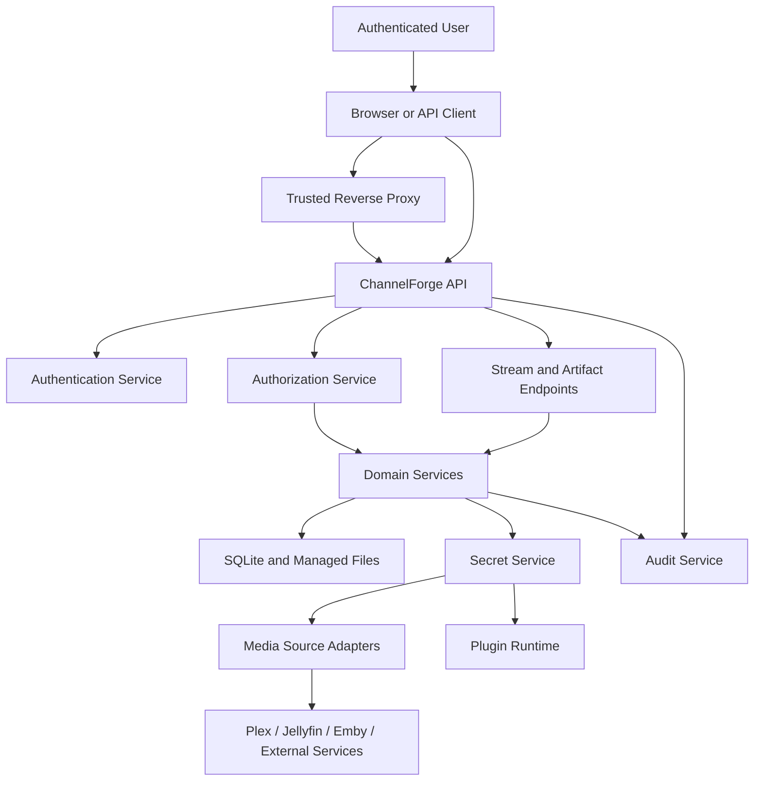

# ChannelForge Security Specification

- **Specification version:** 0.1
- **Status:** Draft
- **Last updated:** 2026-07-27

## Purpose

This document defines the security architecture for ChannelForge version 1.

It specifies:

- Trust boundaries
- Threat model
- Authentication
- Authorization
- Roles and permissions
- Browser sessions
- API tokens
- Initial setup
- Password handling
- Secret storage
- Encryption
- Key management
- Media Source credentials
- Plugin permissions
- Stream authorization
- Webhook security
- Network controls
- SSRF defenses
- CSRF
- CORS
- TLS
- Reverse-proxy trust
- File and upload security
- Backup security
- Audit
- Logging and redaction
- Privacy
- Supply-chain controls
- Container hardening
- Incident response
- Security testing
- Recovery

This document defines security requirements across the system.

It does not define:

- Exact UI layouts
- Exact database table structures
- Exact reverse-proxy product configuration
- Exact cryptographic library choices
- Exact plugin runtime technology
- Exact package-signing implementation
- Exact deployment platform policy

Those choices must implement the requirements defined here.

## Security Mission

ChannelForge must protect:

- Administrator accounts
- API tokens
- Media Source credentials
- Plugin secrets
- Backup contents
- Network topology
- Catalog and schedule integrity
- Active publication state
- Runtime control
- Audit history
- Managed files
- Generated artifacts
- Host resources

Security must not depend on the assumption that the application is reachable
only from a trusted LAN.

A local-first deployment still requires:

- Authentication
- Authorization
- Secret protection
- Input validation
- Network request controls
- Audit
- Safe defaults
- Upgrade hygiene

## Scope

Version 1 security covers:

- Single-instance Docker or Unraid deployment
- Local or reverse-proxied HTTPS access
- Browser sessions
- Scoped API tokens
- Plex, Jellyfin, and Emby credentials
- Plugin permissions
- SQLite and managed-file protection
- XMLTV, M3U, and live stream access
- HDHomeRun-compatible outputs
- Backup and restore
- Administrative diagnostics
- Local network discovery
- Background Jobs
- Plugin installation and execution
- Webhooks
- Imported configuration and Packs

Version 1 does not require:

- Enterprise SAML
- Enterprise OIDC
- Hardware security modules
- Multi-tenant isolation
- Dedicated secrets service
- FIPS certification
- Mandatory MFA
- Certificate authority management
- Host-based intrusion detection
- Zero-trust service mesh
- Remote attestation

These may be added later.

## Security Principles

1. Deny by default.
2. Apply least privilege.
3. Separate authentication from authorization.
4. Store no plaintext reusable secrets where avoidable.
5. Never log secret values.
6. Validate every external input.
7. Treat provider payloads as untrusted.
8. Treat plugin packages as untrusted until verified.
9. Treat local network requests as potentially hostile.
10. Use explicit trust boundaries.
11. Keep management APIs authenticated by default.
12. Keep public outputs separately configurable.
13. Use short-lived capability where possible.
14. Preserve auditability.
15. Fail closed for privileged actions.
16. Fail safe without corrupting active publication.
17. Bound work, memory, files, and network activity.
18. Make insecure deployment choices visible.
19. Support rotation and revocation.
20. Keep security controls testable.

## Security Architecture



## Trust Boundaries

Primary trust boundaries:

1. Browser or API client to ChannelForge
2. Reverse proxy to ChannelForge
3. ChannelForge to Media Sources
4. ChannelForge to plugin runtime
5. ChannelForge to managed filesystem
6. ChannelForge to SQLite
7. ChannelForge to backup destination
8. Public output clients to stream and artifact endpoints
9. Webhook senders to webhook ingress
10. Host operating system to container
11. Package source to plugin installer
12. Imported file to import pipeline

Every boundary requires explicit validation and authorization.

## Protected Assets

### Identity Assets

- Password verifiers
- Session tokens
- API tokens
- Setup token
- Recovery credentials
- Role assignments
- Permission grants

### Integration Assets

- Plex tokens
- Jellyfin API keys or tokens
- Emby API keys or tokens
- Provider cookies
- Provider client certificates
- Provider transcode credentials
- Path mappings
- Internal addresses

### Plugin Assets

- Plugin package
- Signature metadata
- Plugin secret values
- Permission grants
- Plugin state
- Network allowlists
- Publisher trust records

### Editorial Assets

- Network Profiles
- Programming Configuration
- Schedule Plans
- Approval records
- Publication pointers
- Templates
- Programming Packs

### Runtime Assets

- Stream tokens
- Active session control
- FFmpeg command plans
- Source access descriptors
- HLS segments
- Runtime diagnostics
- Hardware reservations

### Persistence Assets

- SQLite database
- Managed files
- Backups
- Audit records
- Migration state
- Encryption key material

## Threat Actors

Potential threat actors include:

- Unauthenticated internet user
- Unauthenticated local-network user
- Authenticated low-privilege user
- Compromised administrator session
- Stolen API token holder
- Malicious plugin publisher
- Compromised plugin package source
- Malicious or compromised Media Source
- Malicious webhook sender
- Malicious imported configuration
- Compromised reverse proxy
- User with filesystem access
- User with Docker host access
- Malware on the host
- Supply-chain attacker
- Accidental operator

## Threat Categories

ChannelForge security must address:

- Credential theft
- Session hijacking
- Brute-force authentication
- Privilege escalation
- Cross-site request forgery
- Cross-site scripting
- Server-side request forgery
- Command injection
- SQL injection
- Path traversal
- File upload abuse
- Plugin escape
- Secret leakage
- Log leakage
- Backup leakage
- Unauthorized stream access
- Unauthorized runtime control
- Schedule tampering
- Publication tampering
- Provider impersonation
- Webhook replay
- Denial of service
- Dependency compromise
- Package tampering
- Downgrade attacks
- Data corruption
- Insecure restore
- Audit deletion or forgery

## Security Zones

Suggested logical zones:

- Public output zone
- Authenticated management zone
- Elevated administration zone
- Integration zone
- Plugin zone
- Persistence zone
- Backup zone
- Host zone

Security controls vary by zone.

## Management API Default

The Management API is authenticated by default.

Unauthenticated access is limited to:

- Liveness
- Initial setup bootstrap under strict conditions
- Public output endpoints explicitly enabled
- HDHomeRun-compatible discovery if enabled
- Webhook endpoints with provider-specific verification

## Public Output Default

XMLTV, M3U, and live streams should not be public by default.

Instance policy may enable:

- Local-network access
- Signed token access
- API-token access
- Reverse-proxy authentication
- Public access

Public access requires explicit confirmation and warning.

## Authentication Model

Version 1 supports:

- Browser sessions
- Scoped API tokens
- Initial setup token
- Optional trusted reverse-proxy authentication

Future versions may support:

- OIDC
- Passkeys
- MFA
- Client certificates

## User Identity

Every user has a ChannelForge-owned User ID.

Authentication identifiers include:

- Username
- Optional email
- API token prefix
- Reverse-proxy subject

User identity is not derived from display name.

## Username Requirements

Username policy must define:

- Length
- Allowed characters
- Case normalization
- Uniqueness
- Reserved names
- Change policy

Username comparison should be normalized and deterministic.

## Password Authentication

Password authentication requires:

- Strong password hashing
- Per-password salt
- Configurable work factor
- Constant-time comparison
- Rate limiting
- Generic failure messages
- Secure password reset or administrator reset
- Password change invalidation policy

## Password Hashing

Use a modern password-hashing function.

Preferred classes:

- Argon2id
- scrypt
- PBKDF2 only when required by platform constraints

Plain fast hashes are prohibited.

Prohibited examples:

- MD5
- SHA-1
- Unsalted SHA-256
- Reversible encryption as password storage

## Password Hash Parameters

Parameters must be:

- Versioned
- Stored with verifier
- Upgradeable
- Tuned for deployment class
- Bounded against memory exhaustion

## Password Rehash

On successful login, if parameters are outdated:

- Rehash with current parameters
- Replace verifier atomically
- Preserve session
- Record security event only if policy requires

## Password Policy

Version 1 should favor length over complex character rules.

Policy may include:

- Minimum length
- Maximum length
- Block known breached passwords where feasible
- Reject username-equivalent passwords
- Permit password managers
- Permit spaces and Unicode
- Avoid forced periodic expiration without cause

## Password Input Handling

Passwords:

- Are never trimmed silently
- Are never logged
- Are never included in validation echoes
- Are accepted only over protected transport where remote access is used
- Are cleared from transient UI state where practical

## Login Rate Limiting

Login attempts are rate-limited by:

- Source address classification
- Username key
- Instance-wide threshold
- Token bucket or equivalent policy

Rate limiting must avoid permanent account denial by attackers.

## Login Failure Message

Use a generic message such as:

```text
Authentication failed.
```

Do not reveal whether:

- Username exists
- Account is disabled
- Password is wrong
- Role is insufficient

Detailed reason may be recorded internally.

## Login Lockout

Hard lockout is optional.

A safer default may use:

- Progressive delay
- Temporary cooldown
- Rate limiting
- Security alert after threshold

Permanent lockout requires administrator recovery.

## Browser Session

A browser session includes:

- Session ID
- User ID
- Created timestamp
- Last activity
- Expiration
- Authentication strength
- Revocation state
- Client metadata summary
- Token hash or server-side opaque reference

## Session Token

Session tokens must be:

- Cryptographically random
- High entropy
- Opaque
- Unpredictable
- Stored only as a secure hash where server-side storage is used
- Rotated after authentication state changes where appropriate

## Session Cookie

Recommended cookie attributes:

- `HttpOnly`
- `Secure` when HTTPS is used
- `SameSite=Lax` or stricter according to UI needs
- Narrow path
- No Domain attribute unless required
- Bounded lifetime

## Session Expiration

Policies may include:

- Idle timeout
- Absolute timeout
- Remember-me timeout
- Administrative maximum
- Reauthentication requirement for sensitive actions

## Session Rotation

Rotate session identity after:

- Login
- Privilege elevation
- Password change
- Role change where applicable
- Security-sensitive account change

## Session Revocation

Session revocation may occur after:

- Sign out
- Password reset
- User disable
- Administrator revocation
- Suspicious activity
- Token theft report
- Backup restore into new instance policy

## Session Listing

Users should be able to view active sessions with:

- Approximate client
- Created time
- Last activity
- Address classification
- Current session indicator

Sensitive fingerprinting details should be minimized.

## Reauthentication

Sensitive actions may require recent authentication.

Examples:

- Create administrator
- Change password
- Rotate encryption key
- Restore backup
- Purge plugin
- Disable authentication
- Enable public access
- Export sensitive diagnostics

## API Tokens

API tokens provide non-browser access.

A token includes:

- Token ID
- Owner
- Prefix
- Secret hash
- Scopes
- Created timestamp
- Expiration
- Last used timestamp
- Revocation
- Description

## API Token Secret

The full token is shown only at creation.

ChannelForge stores:

- Secure hash
- Identifying prefix
- Metadata

## API Token Entropy

Tokens must have sufficient random entropy.

Do not use:

- Sequential IDs
- UUID alone as secret
- User-chosen secrets
- Reversible encrypted token values unless operationally required

## API Token Scope

Scopes must be least-privilege.

Suggested high-level scopes:

- `catalog:read`
- `catalog:write`
- `networks:read`
- `networks:write`
- `schedules:generate`
- `schedules:approve`
- `schedules:publish`
- `runtime:read`
- `runtime:control`
- `sources:read`
- `sources:write`
- `plugins:read`
- `plugins:manage`
- `backups:read`
- `backups:manage`
- `audit:read`
- `admin`

## API Token Expiration

Tokens should support expiration.

Long-lived tokens require explicit confirmation.

## API Token Revocation

Revocation is immediate for new requests.

Cached authorization must not outlive revocation beyond a short bounded interval.

## API Token Display

The UI may display:

- Prefix
- Description
- Owner
- Scopes
- Created
- Expires
- Last used
- Revoked

It must not display the original secret.

## Initial Setup

Initial setup is a privileged bootstrap phase.

It must prevent arbitrary remote users from claiming the instance.

## Setup States

Suggested states:

- `UNINITIALIZED`
- `SETUP_IN_PROGRESS`
- `INITIALIZED`
- `RECOVERY_REQUIRED`

## Setup Token

A setup token may be provided through:

- Console output
- Environment variable
- Mounted secret
- Local file readable by administrator
- Localhost-only bootstrap page

## Setup Token Requirements

The setup token must be:

- High entropy
- Single use
- Time bounded or initialization bounded
- Removed or invalidated after setup
- Never logged after initial controlled display
- Not stored in browser history where avoidable

## Remote Setup

Remote setup should require explicit deployment configuration.

Default setup may be limited to:

- Localhost
- Local subnet under warning
- Console-confirmed token

## First Administrator

Initial setup creates the first administrator.

The operation must be atomic.

## Setup Completion

After setup:

- Setup endpoints are disabled.
- Setup token is invalidated.
- Administrator session is established.
- Audit begins.
- Security posture is summarized.
- Insecure configuration warnings are shown.

## Setup Recovery

Recovery may require:

- Host filesystem access
- Console command
- Mounted recovery secret
- Backup restore

A network-only unauthenticated reset endpoint is prohibited.

## Authorization Model

Authorization is role- and permission-based.

It may include resource-state checks.

## Authorization Decision

An authorization decision considers:

- User or token
- Role assignments
- Token scopes
- Resource
- Command
- Resource state
- Plugin permission context
- Deployment policy
- Recent reauthentication where required

## Roles

Suggested built-in roles:

### Administrator

Can:

- Manage users
- Manage security
- Manage Media Sources
- Manage plugins
- Manage backups
- Approve and publish schedules
- Control runtime
- Read audit
- Configure public access

### Program Director

Can:

- Manage Networks
- Manage Channels
- Manage programming configuration
- Generate schedules
- Review schedules
- Approve schedules where policy permits
- Publish schedules where granted

### Operator

Can:

- Read Networks and schedules
- Read runtime status
- Restart Channels
- Enter maintenance mode
- View operational diagnostics
- Start approved jobs

### Read Only

Can:

- Read authorized resources
- View status
- Export non-sensitive reports where granted

### Viewer

May access limited first-party viewing surfaces if implemented.

## Permission Families

Suggested permission families:

- Instance
- Users
- Security
- Media Sources
- Catalog
- Networks
- Channels
- Programming
- Scheduling
- Approval
- Publication
- Runtime
- Plugins
- Backups
- Audit
- Diagnostics
- Output access

## Permission Examples

- `INSTANCE_READ`
- `INSTANCE_MANAGE`
- `USER_READ`
- `USER_MANAGE`
- `SECURITY_MANAGE`
- `MEDIA_SOURCE_READ`
- `MEDIA_SOURCE_MANAGE`
- `CATALOG_READ`
- `CATALOG_MANAGE`
- `NETWORK_READ`
- `NETWORK_MANAGE`
- `CHANNEL_READ`
- `CHANNEL_MANAGE`
- `PROGRAMMING_MANAGE`
- `SCHEDULE_GENERATE`
- `SCHEDULE_APPROVE`
- `SCHEDULE_PUBLISH`
- `RUNTIME_READ`
- `RUNTIME_CONTROL`
- `PLUGIN_READ`
- `PLUGIN_MANAGE`
- `BACKUP_READ`
- `BACKUP_MANAGE`
- `AUDIT_READ`
- `DIAGNOSTICS_READ`
- `OUTPUT_ACCESS`

## Role Assignment

Role assignment requires:

- Administrator permission
- Expected user version
- Audit
- Optional reauthentication
- Prevention of accidental last-administrator removal

## Last Administrator Protection

The system must prevent:

- Disabling the last active administrator
- Removing the last administrator role
- Archiving the last administrator

Recovery requires explicit host-level procedure.

## Permission Evaluation

Permission checks must occur:

- At route boundary
- In application service
- At plugin broker boundary
- At sensitive repository or secret boundary where defense in depth is useful

## Authorization Failure

Authorization failure returns:

- `403` or concealed `404`
- Stable error code
- Request ID
- No sensitive resource details

## Service Accounts

Version 1 may represent automation through API tokens owned by users.

Dedicated service accounts may be added later.

## Privilege Escalation Protection

A user cannot grant permissions they do not possess unless Administrator policy
explicitly allows delegated administration.

## Secret Categories

Secret categories include:

- Password verifiers
- Session token hashes
- API token hashes
- Media Source credentials
- Plugin secrets
- Webhook secrets
- Backup encryption keys
- Signing private keys
- Stream signing keys
- Cookie signing keys
- Recovery secrets

## Secret Storage Model

Secrets are stored through a Secret Service.

The Secret Service provides:

- Create
- Read for scoped operation
- Rotate
- Revoke
- Delete where safe
- Metadata
- Audit
- Encryption
- Key versioning

## Secret Reference

Domain records store a Secret Reference.

A Secret Reference includes:

- Secret ID
- Category
- Owner type
- Owner ID
- Created timestamp
- Rotated timestamp
- Revocation state
- Key version
- Metadata

It does not contain plaintext.

## Encryption at Rest

Reusable credential values should be encrypted at rest.

Examples:

- Plex token
- Jellyfin token
- Emby token
- Plugin API key
- Webhook signing secret
- Backup destination credential

## Password Verifiers

Password verifiers are hashed, not encrypted.

## API Token Values

API token secrets are hashed when verification can use one-way comparison.

## Encryption Key

A master key or key-encryption key must not be stored unprotected beside the
encrypted database values it protects.

Possible sources:

- Environment variable
- Mounted secret file
- Container secret
- Host keyring
- External secret service

## Key Material Requirements

Key material must be:

- High entropy
- Correct length
- Versioned
- Access restricted
- Excluded from logs
- Excluded from backups unless explicitly protected
- Available for restore

## Key Hierarchy

A possible hierarchy:

- Master key
- Data-encryption keys by version
- Per-secret nonce
- Authenticated encryption metadata

Exact cryptographic construction is deferred.

## Authenticated Encryption

Secret encryption must provide:

- Confidentiality
- Integrity
- Nonce safety
- Versioning
- Associated data binding where appropriate

Unauthenticated encryption is prohibited.

## Associated Data

Associated data may bind ciphertext to:

- Instance ID
- Secret ID
- Owner type
- Owner ID
- Secret category
- Key version

## Encryption Metadata

Stored metadata includes:

- Algorithm version
- Key version
- Nonce
- Ciphertext
- Authentication tag where separate
- Created timestamp

## Key Rotation

Key rotation workflow:

1. Introduce new active key version.
2. Continue decrypting old versions.
3. Encrypt new secrets with new version.
4. Re-encrypt existing secrets in bounded job.
5. Verify.
6. Retire old key only after completion.
7. Record audit.

## Key Loss

If the encryption key is lost:

- Encrypted secrets cannot be recovered.
- Catalog and schedule data may remain readable.
- Media Sources require credential reentry.
- Plugin secrets require reentry.
- Encrypted backups may be unrecoverable.

This must be documented clearly.

## Secret Rotation

Secret rotation should not require deleting the owning resource.

Examples:

- Rotate Plex token
- Rotate plugin API key
- Rotate webhook secret
- Rotate stream signing key

## Secret Revocation

Revoked secrets:

- Cannot be read for new operations
- Remain in audit metadata
- May remain encrypted until retention cleanup
- Trigger dependent health findings

## Secret Access Logging

Secret values are not logged.

Access metadata may include:

- Secret ID
- Owner
- Operation
- Request ID
- Plugin ID
- Timestamp
- Outcome

High-frequency access may use aggregated metrics rather than full audit.

## Secret Redaction

Redaction must cover:

- Authorization headers
- Cookies
- Query tokens
- Signed URLs
- Password fields
- API key fields
- Provider tokens
- Private keys
- Secret JSON fields
- Environment variables marked secret

## Redaction Strategy

Use structured redaction by field and context.

Do not rely only on regular expressions after string formatting.

## Media Source Credentials

Media Source credentials are scoped to one Media Source.

An adapter receives them only for:

- Connection test
- Synchronization
- Artwork access
- Playback resolution
- Health check

## Provider Token Exposure

Provider tokens must not appear in:

- Management API responses
- M3U
- XMLTV
- Channel logos
- Client stream redirects
- Audit details
- FFmpeg logs
- Error messages

## Provider URL Handling

Provider URLs may contain query credentials.

They must be:

- Held in restricted runtime structures
- Redacted before logging
- Not persisted as canonical identity
- Not returned to clients
- Expired according to provider policy

## Local File Credentials

Path access may rely on host permissions rather than explicit credentials.

ChannelForge still treats provider-reported paths as untrusted.

## Plugin Security

Plugin security requirements from `10-plugins.md` are mandatory.

## Plugin Trust Levels

Suggested trust levels:

- Built-in trusted
- Project signed
- Trusted publisher
- Locally approved unsigned
- Development
- Quarantined

## Plugin Permission Enforcement

Plugin permissions must be enforced at runtime, not only installation.

## Plugin Secret Isolation

A plugin receives only secrets owned by:

- Its Plugin Registration
- Its Plugin Instance
- An explicitly granted integration capability

## Plugin Network Isolation

Plugin outbound access is denied by default.

Approved access should use a broker with:

- Host allowlist
- Scheme allowlist
- Port allowlist
- Redirect restrictions
- Timeout
- Response-size limits
- DNS and address validation
- Redaction
- Metrics

## Plugin Filesystem Isolation

Plugins use namespaced storage.

They cannot read:

- SQLite database
- Core secret files
- Other plugin storage
- Host paths
- Managed media paths

unless a specific extension contract provides a controlled capability.

## Plugin Process Isolation

External plugins should not run with unrestricted in-process access in
production.

## Plugin Package Installation

Package validation must occur before executable content runs.

## Plugin Supply Chain

Plugin package trust includes:

- Signature
- Publisher
- Checksum
- Source
- Version
- Advisory state
- Permissions
- Compatibility

## Plugin Quarantine

A quarantined plugin cannot:

- Start
- Register contributions
- Run jobs
- Access secrets
- Access network
- Serve routes

## Stream Authorization

Live Channel output may require:

- Authenticated session
- API token
- Signed stream token
- Local network policy
- Reverse-proxy authentication

## Signed Stream Token

A signed stream token may include:

- Token ID or nonce
- Channel ID
- Protocol
- Audience
- Issued time
- Expiration
- Optional client binding
- Optional one-time state

## Stream Token Requirements

Tokens must be:

- Signed with a dedicated key
- Short lived
- Scope limited
- Revocable where practical
- Excluded from logs
- Avoided in referrer leakage
- Avoided in browser history where possible

## Query Token Risk

When clients require query tokens:

- Use short expiration
- Redact query string
- Use no-referrer policy
- Avoid embedding on third-party pages
- Prefer path or header alternatives where client compatibility permits

## Stream Token Rotation

Stream signing keys support versioning and overlap.

## Local Network Access

A local-network policy may authorize requests by address range.

This is weaker than authenticated access.

Warnings must explain:

- VPN exposure
- Wi-Fi guest access
- Reverse-proxy bypass
- Container network behavior
- IPv6 exposure

## XMLTV and M3U Access

Artifact access policies may differ from live stream access.

Possible modes:

- Authenticated
- Static access token
- Signed URL
- Local network
- Public

## Artifact Access Token

A static artifact token should be:

- Revocable
- Rotatable
- Scoped
- High entropy
- Hidden from logs

## HDHomeRun-Compatible Security

Some HDHomeRun-compatible clients assume unauthenticated local access.

When enabled:

- Restrict to trusted interfaces or networks where possible.
- Warn about exposure.
- Avoid embedding provider credentials.
- Advertise only intended Channels.
- Limit tuner capacity.
- Keep management API protected.

## Discovery Security

UDP discovery can reveal:

- Device identity
- Base URL
- Channel availability
- Host address

Discovery should be configurable by interface.

## Runtime Control Security

Runtime control commands require elevated permission.

Examples:

- Restart Channel
- Stop session
- Force source
- Enter maintenance
- Exit maintenance
- Change tuner count
- Change public output

## Schedule Integrity

Editorial state transitions require:

- Authentication
- Authorization
- Optimistic concurrency
- Validation
- Audit
- Immutable approved records

## Approval Separation

An instance may optionally require separate people for:

- Authoring
- Approval
- Publication

Version 1 may support this through permissions, even if not mandatory.

## Publication Protection

Publication requires:

- Approved Plan
- Expected current publication
- Authorized actor
- Idempotency
- Audit
- Optional reauthentication

## Runtime Versus Editorial Separation

Operational recovery cannot silently change:

- Programming Configuration
- Approved Schedule Plan
- Approval record
- Publication history

## CSRF

Cookie-authenticated mutation endpoints require CSRF protection.

## CSRF Defenses

Potential defenses:

- SameSite cookies
- Synchronizer token
- Double-submit token
- Origin checking
- Referer checking as supplemental control
- Custom header for same-origin requests

## CSRF Token

A CSRF token must be:

- Session bound
- Unpredictable
- Compared safely
- Required for mutation
- Excluded from logs

## Origin Validation

For browser mutations, validate:

- Origin
- Trusted host
- Scheme
- Proxy trust

Missing Origin behavior must be deliberate.

## Bearer Tokens and CSRF

Bearer tokens in Authorization headers are not automatically sent by browsers
across origins.

They do not use cookie CSRF semantics, but CORS and XSS remain relevant.

## CORS

CORS is disabled by default for management APIs.

## Allowed Origins

Allowed origins must be:

- Explicit
- Scheme-specific
- Host-specific
- Port-specific
- Validated

Wildcard origins with credentials are prohibited.

## CORS Methods

Allow only required methods.

## CORS Headers

Allow only required request headers.

## Preflight Caching

Preflight caching should be bounded.

## XSS

The first-party web interface must prevent cross-site scripting.

Controls include:

- Contextual output escaping
- Safe templating
- Sanitized rich text
- Content Security Policy
- No unsafe HTML from providers
- No direct rendering of plugin strings as HTML
- No executable uploaded files
- Safe URL schemes

## Provider Text

Provider metadata is untrusted.

Descriptions, titles, tags, and filenames must be escaped in UI.

## Markdown or Rich Text

If Markdown is supported:

- Sanitize output
- Disable raw HTML by default
- Restrict links and images
- Apply safe URL policies

## Content Security Policy

The web UI should use a Content Security Policy.

It should restrict:

- Script sources
- Style sources
- Frame ancestors
- Object sources
- Base URI
- Form actions
- Connections
- Images

Plugin UI may require separate policy or sandboxing.

## Clickjacking

Administrative UI must prevent unauthorized framing.

Use:

- `frame-ancestors`
- Legacy header where needed

## MIME Sniffing

Use `X-Content-Type-Options: nosniff` where applicable.

## Referrer Policy

Use a restrictive Referrer Policy to avoid token leakage.

## Open Redirects

Redirect targets must be:

- Local and allowlisted
- Relative
- Or validated against explicit trusted origins

## SSRF

Server-side requests are a major trust boundary.

Sources include:

- Media Source URLs
- Plugin network calls
- Artwork URLs
- Webhook callbacks
- Metadata providers
- Import references
- Backup destinations

## SSRF Defenses

Controls include:

- Scheme allowlist
- Host validation
- Port policy
- DNS resolution checks
- Redirect validation
- Address classification
- Cloud metadata blocking
- Link-local blocking where appropriate
- Loopback policy
- UNIX socket prohibition
- Response-size limits
- Timeouts
- No arbitrary user headers
- Credential forwarding restrictions

## Local Network Exception

ChannelForge intentionally connects to local Plex, Jellyfin, and Emby servers.

Therefore SSRF policy must distinguish:

- Approved configured Media Source
- Arbitrary user-provided URL
- Plugin-declared host
- Artwork provider URL
- Import reference

## DNS Rebinding

Where practical:

- Resolve host before connection.
- Validate resolved address.
- Revalidate redirects.
- Avoid forwarding credentials across host changes.
- Use connection destination checks.

## Redirect Security

Redirect policy must prevent:

- HTTPS downgrade
- Credential forwarding to another host
- Redirect loops
- Excessive redirects
- Redirect to disallowed address class

## HTTP Header Security

Custom headers are allowlisted by integration type.

Users cannot configure arbitrary headers that impersonate internal services.

## Command Injection

User input must not become shell command text.

FFmpeg invocation must use:

- Argument arrays
- Typed options
- Allowlisted protocols
- Validated filters
- Managed paths

## Shell Execution

Core features should avoid shell invocation.

When unavoidable:

- Use fixed executable
- Use argument array
- Never interpolate untrusted input into shell script
- Bound environment
- Record executable identity
- Validate path

## FFmpeg Security

FFmpeg is a complex parser and network client.

Controls include:

- Protocol allowlist
- Input source validation
- Output path control
- Filter allowlist
- Timeout
- Process isolation
- Resource limits
- Updated build
- No arbitrary user command fragments

## FFmpeg Protocols

Only required protocols should be enabled.

Potential allowed protocols:

- File
- HTTP
- HTTPS
- Pipe
- Provider-specific safe protocols where required

Potentially dangerous protocols should be disabled unless justified.

## SQL Injection

All SQL uses parameter binding.

Prohibited:

- Concatenating user input into SQL
- Raw filter fragments from API
- Plugin SQL
- Provider-supplied column names
- Arbitrary ORDER BY without allowlist

## Dynamic Sorting

Sort fields map through an allowlist to fixed SQL expressions.

## Database File Protection

The SQLite file must be protected by filesystem permissions.

## SQLite Security

Controls include:

- Foreign keys enabled
- Trusted schema policy
- No arbitrary extension loading
- Migration checksum validation
- No user-supplied SQL
- No public database download
- Backup authorization

## Managed File Security

Managed file paths are generated by ChannelForge.

## Path Traversal

Reject:

- `..`
- Absolute paths
- Drive paths where not allowed
- UNC paths where not allowed
- Encoded traversal
- Null bytes
- Symlink escapes
- Case-collision ambiguity

## Symlinks

Managed storage should avoid following untrusted symlinks.

## Upload Security

Uploads are untrusted.

## Upload Controls

- Size limit
- File count limit
- MIME allowlist
- Signature validation
- Extension normalization
- Safe filename
- Image dimension limit
- Decompression limits
- Temporary storage
- Checksum
- Malware scanning policy where available
- Non-executable serving

## Image Security

Image uploads may contain:

- Parser exploits
- Huge dimensions
- Metadata leakage
- Polyglot content
- SVG scripts

SVG should be sanitized or disallowed for untrusted uploads.

## Archive Security

Plugin and import archives require:

- Path traversal defense
- Symlink defense
- File count limit
- Decompressed-size limit
- Nested archive policy
- Duplicate path detection
- Case-collision detection

## Download Security

Downloads use:

- Safe Content-Type
- Safe Content-Disposition
- No path exposure
- Authorization
- Audit for sensitive exports
- Expiration for temporary bundles

## Temporary Files

Temporary files:

- Use managed temp root
- Use random names
- Use restrictive permissions
- Are cleaned after failure
- Are reconciled after crash
- Never become executable by default

## Backup Security

Backups may contain the entire security state.

## Backup Confidentiality

Backup archives should be encrypted when they include:

- Encrypted secret database values
- User accounts
- API token hashes
- Network topology
- Audit
- Plugin state
- Managed files

## Backup Encryption

Backup encryption must use:

- Authenticated encryption
- Versioned format
- Strong key derivation for passphrase-based mode
- Random salt
- Integrity verification
- No plaintext key inside archive

## Backup Passphrase

If passphrase-based encryption is supported:

- Minimum strength
- No logging
- No storage unless explicitly configured
- Confirmation
- Recovery warning
- Memory-hard key derivation

## Backup Destination Credentials

Destination credentials are secrets.

## Backup Access

Only authorized users may:

- Create
- List
- Download
- Delete
- Verify
- Restore

## Backup Download

Backup download requires:

- Recent authentication
- Audit
- No shared-cache storage
- Safe filename
- Optional one-time URL
- Short expiration

## Restore Security

Restore is a privileged destructive operation.

## Restore Controls

- Administrator permission
- Recent authentication
- Verified backup
- Compatibility check
- Confirmation
- Pre-restore safety backup
- Maintenance mode
- Audit
- No arbitrary archive extraction
- Secret-key availability check

## Restore Trust

A backup from another instance may contain:

- Users
- API tokens
- Plugins
- Trusted publishers
- Public access settings

Restore preview must show security impact.

## Cross-Instance Restore

Cross-instance restore may require:

- New administrator confirmation
- Token invalidation
- Session invalidation
- Stream key rotation
- Provider credential revalidation
- Plugin disablement

## Audit

Security-relevant actions require audit.

## Audit Security Events

Examples:

- Login success
- Login failure threshold
- Session revocation
- Password change
- API token creation
- API token revocation
- Role assignment
- Last-administrator protection event
- Setup completion
- Public access enabled
- Media Source credential rotation
- Plugin installation
- Unsigned plugin approval
- Permission grant
- Plugin quarantine
- Backup download
- Restore
- Encryption key rotation
- Security setting change
- Diagnostic export
- Repeated denied access
- Provider identity mismatch

## Audit Record Integrity

Audit records are append-only.

## Audit Content

Audit includes:

- Actor
- Action
- Target
- Time
- Outcome
- Request ID
- Correlation ID
- Reason
- Prior and new version where applicable
- Address classification
- Authentication method

## Audit Redaction

Audit must not contain:

- Password
- API token
- Session token
- Provider token
- Plugin secret
- Backup passphrase
- Private key
- Full signed URL

## Audit Access

Audit access requires elevated permission.

## Audit Retention

Security audit retention should be long-lived.

## Audit Export

Audit export requires:

- Permission
- Bounded time range
- Redaction
- Audit of export
- Safe temporary file

## Logging Security

Logs are operational data and may be sensitive.

## Log Categories

- Application
- Security
- Integration
- Plugin
- Playout
- Persistence
- HTTP access
- Audit

## Log Redaction

Redact before serialization where possible.

## URL Logging

Do not log full query strings when they may contain tokens.

## Header Logging

Never log:

- Authorization
- Cookie
- Set-Cookie
- Provider token headers
- Plugin secret headers

## Body Logging

Request and response bodies are disabled by default.

## Diagnostic Mode

Diagnostic mode may enable additional logging.

It must:

- Warn administrator
- Expire automatically
- Preserve redaction
- Limit duration and size
- Avoid raw secret capture

## Log Retention

Retention is bounded and configurable.

## Log Access

Detailed logs require permission.

## Privacy

ChannelForge should minimize personal data.

## Personal Data Examples

- Username
- Email
- Client address
- Session metadata
- Audit actor
- Provider account identity
- Viewing session metadata

## Data Minimization

Collect only what is necessary for:

- Authentication
- Authorization
- Security diagnostics
- Audit
- Operation

## Client Address Handling

Client addresses may be:

- Classified as local or remote
- Truncated
- Hashed for aggregation
- Retained for limited time
- Excluded from ordinary UI

## Viewing Data

Version 1 should not build user viewing profiles unless explicitly required.

## Privacy and Plugins

Plugins receive only minimum projections.

## Privacy and Diagnostics

Diagnostic bundles must be redacted.

## Data Export

User data export is not a primary version 1 requirement, but the system should
make account and audit data identifiable for future support.

## Data Deletion

Deleting a user may preserve audit identity through tombstone or pseudonymous
reference.

## TLS

Remote access should use HTTPS.

## TLS Termination

TLS may terminate at:

- ChannelForge
- Trusted reverse proxy

## Direct HTTP

Plain HTTP may be acceptable only on trusted local networks.

The UI should warn when:

- Management access is remote over HTTP
- Secure cookies cannot be used
- API tokens may traverse plaintext
- Public exposure is detected

## HSTS

HSTS is appropriate only when the deployment is reliably HTTPS.

## Certificate Validation

Outbound HTTPS validates certificates by default.

## Self-Signed Providers

A Media Source may explicitly trust:

- Custom certificate authority
- Specific certificate
- Insecure TLS mode

## Insecure TLS

Insecure TLS mode:

- Is source-specific
- Is disabled by default
- Requires warning and confirmation
- Is auditable
- Must not disable validation globally

## Reverse Proxy Trust

Forwarded headers are trusted only from configured proxy addresses.

## Trusted Headers

Potential trusted headers:

- Forwarded client address
- Host
- Scheme
- Authenticated user
- Request ID

## Header Spoofing

Direct requests must not be able to inject trusted proxy identity headers.

## Host Validation

The application validates Host and public URL construction.

## Proxy Authentication

Reverse-proxy authentication requires:

- Explicit enablement
- Trusted proxy address
- Identity header
- Header stripping at proxy
- Direct-access policy
- User mapping
- Audit

## Direct Bypass

When proxy authentication is enabled, direct access must:

- Be disabled, or
- Ignore proxy identity headers, or
- Require normal ChannelForge authentication

## Webhook Security

Webhook payloads are untrusted.

## Webhook Verification

Possible verification:

- Shared secret
- HMAC signature
- Provider token
- Client certificate
- Network allowlist
- Replay timestamp
- Event ID

## Webhook Body Limit

Each webhook endpoint has a body limit.

## Webhook Replay

Use:

- Event ID
- Timestamp
- Nonce
- Payload checksum
- Replay window

## Webhook Processing

Webhook requests:

- Validate
- Deduplicate
- Queue work
- Return quickly

They do not directly publish schedules or delete Catalog state.

## Unauthenticated Provider Webhook

Where provider lacks authentication:

- Restrict network exposure
- Rate limit
- Treat as hint only
- Verify through provider API
- Never trust deletion event alone

## Denial of Service

ChannelForge must bound expensive work.

## Request Limits

- Header size
- Body size
- Query length
- Page size
- Bulk count
- Upload size
- Archive size
- Webhook size
- Search complexity

## Background Work Limits

- Concurrent jobs
- Per-source synchronization
- Schedule generation concurrency
- Plugin jobs
- Backup jobs
- Projection rebuilds
- Artifact generation

## Runtime Limits

- Concurrent streams
- Concurrent transcodes
- Hardware encoder slots
- Segment storage
- FFmpeg process count
- Per-client bandwidth where practical

## Resource Exhaustion

When capacity is exhausted:

- Reject or queue new work
- Preserve active sessions where policy prefers
- Return explicit status
- Avoid spawning unbounded processes

## Rate Limiting

Rate limits apply to:

- Login
- Setup
- API token creation
- Synchronization commands
- Schedule generation
- Backup
- Restore
- Diagnostics
- Webhooks
- Stream-token minting

## Rate Limit Storage

Rate-limit state may be in memory for version 1.

Security-critical limits should survive short restarts where practical.

## Abuse Detection

Potential detections:

- Repeated login failures
- Repeated denied permissions
- Repeated invalid API tokens
- Webhook flood
- Plugin protocol violations
- Stream-token abuse
- Backup download anomalies

## Account Notification

Future versions may notify administrators about security events.

Version 1 should at least expose security findings.

## Security Findings

A Security Finding includes:

- Finding ID
- Severity
- Category
- Target
- First observed
- Last observed
- Status
- Evidence
- Suggested action
- Resolution
- Audit reference

## Severity

Suggested levels:

- `INFO`
- `LOW`
- `MEDIUM`
- `HIGH`
- `CRITICAL`

## Security Posture Checks

Potential checks:

- Management exposed over HTTP
- Public M3U enabled
- Public stream enabled
- Insecure TLS Media Source
- Unsigned plugin enabled
- Old backup
- No recent backup
- Encryption key missing
- Weak setup state
- Default administrator unchanged
- Broad API token
- Plugin broad network access
- Reverse-proxy trust misconfigured
- Discovery exposed on all interfaces

## Supply-Chain Security

ChannelForge depends on:

- Application dependencies
- Container base image
- FFmpeg build
- Plugin packages
- Build pipeline
- Release artifacts

## Dependency Management

Requirements:

- Lockfile
- Reproducible dependency resolution
- Dependency review
- Vulnerability scanning
- Timely updates
- Remove unused dependencies
- Avoid unmaintained critical packages

## Release Integrity

Official releases should provide:

- Version
- Checksums
- Signed release metadata where feasible
- Changelog
- Migration notes
- Dependency provenance

## Container Image

Container images should:

- Use minimal base
- Run as non-root where feasible
- Pin base version
- Include only required tools
- Avoid package managers in final layer where practical
- Publish digest
- Be scanned

## FFmpeg Supply Chain

FFmpeg version and build source should be documented.

## Plugin Supply Chain

Plugin packages require independent trust and permissions.

## Update Security

Application updates must:

- Verify artifact integrity
- Preserve backup
- Run migrations safely
- Avoid automatic downgrade
- Record version change
- Expose security notices

## Downgrade

Downgrade may be blocked when:

- Database schema is newer
- Security format changed
- Plugin state incompatible
- Secret encryption format incompatible

## Container Hardening

Recommended deployment controls:

- Non-root user
- Read-only root filesystem where practical
- Writable mounted data directories only
- Drop unnecessary Linux capabilities
- No privileged mode
- Limit devices
- Limit memory and CPU
- No Docker socket mount
- No host PID namespace
- No unnecessary host networking
- Restrict outbound network where feasible

## Hardware Devices

Hardware transcode devices may require device access.

Grant only required devices.

## Docker Socket

Mounting Docker socket into ChannelForge is prohibited for standard operation.

## Host Networking

Host networking may be needed for HDHomeRun discovery.

It increases exposure and must be documented.

## Filesystem Permissions

Data directories should be owned by the configured application user.

## PUID and PGID

Where deployment supports PUID and PGID:

- Use least-privileged IDs
- Avoid root
- Document media read access separately from data write access

## Read-Only Media Mounts

Media mounts should be read-only where ChannelForge only needs playback.

## Backup Mounts

Backup destination permissions should not grant unnecessary access to other host
paths.

## Network Segmentation

Recommended:

- Keep management access restricted
- Permit Media Source access
- Permit client stream access
- Restrict plugin destinations
- Limit discovery interfaces

## IPv6

Security policy must account for IPv6 exposure.

Local-only IPv4 configuration does not imply IPv6 isolation.

## Firewall

Firewall rules are deployment responsibility, but ChannelForge should document
required ports and protocols.

## Secret Environment Variables

Environment variables may expose secrets through:

- Process inspection
- Container inspection
- Diagnostics

Mounted secret files are preferable where available.

## Secret File Permissions

Secret files should be:

- Readable only by application user
- Not served by web server
- Outside plugin storage
- Outside backup unless explicitly included

## Security Configuration

Security settings should include:

- Session timeout
- API token policy
- Public output access
- Trusted proxies
- CORS
- Allowed origins
- Setup state
- Plugin trust policy
- Backup encryption policy
- TLS warnings
- Discovery interfaces
- Rate limits

## Security Setting Changes

Changes require:

- Appropriate permission
- Expected version
- Audit
- Validation
- Impact preview
- Reauthentication for critical settings

## Secure Defaults

Default posture should be:

- Authentication enabled
- Public streams disabled
- Public artifacts disabled
- CORS disabled
- Reverse-proxy auth disabled
- Unsigned plugins disabled
- Insecure TLS disabled
- Outbound plugin network denied
- Management diagnostics restricted
- Setup token required
- Backups recommended
- No arbitrary filesystem paths
- No arbitrary FFmpeg options

## Insecure Configuration Warning

Warnings must be persistent until resolved or acknowledged.

## Security Headers

Management responses should use appropriate headers:

- Content Security Policy
- X-Content-Type-Options
- Referrer-Policy
- Frame restrictions
- Cache-Control
- HSTS when appropriate

## Cache Security

Sensitive responses use:

```text
Cache-Control: no-store
```

## Artifact Cache Security

Public artifacts may be cached according to access mode.

Tokenized artifacts must avoid shared-cache leakage.

## Service Worker Security

If ChannelForge uses a PWA service worker:

- Scope must be controlled
- Sensitive API responses should not be cached
- Logout should clear sensitive caches
- Updates should not serve stale privileged UI indefinitely
- Cache keys must not mix users

## Client Storage

Avoid storing long-lived API tokens in browser localStorage.

## Clipboard

The UI should minimize automatic clipboard exposure of secrets.

## One-Time Secret Display

When displaying a new API token:

- Show once
- Require explicit copy
- Warn it cannot be recovered
- Avoid analytics capture
- Avoid logging
- Clear from DOM on navigation where practical

## Error Handling

Security errors must not reveal internals.

## Generic Internal Error

Unexpected errors return:

- Stable code
- Request ID
- No stack trace
- No SQL
- No path
- No secret
- No raw provider response

## Security Error Codes

Suggested codes:

- `AUTHENTICATION_REQUIRED`
- `AUTHENTICATION_FAILED`
- `SESSION_EXPIRED`
- `SESSION_REVOKED`
- `TOKEN_INVALID`
- `TOKEN_EXPIRED`
- `TOKEN_REVOKED`
- `PERMISSION_DENIED`
- `REAUTHENTICATION_REQUIRED`
- `CSRF_VALIDATION_FAILED`
- `ORIGIN_NOT_ALLOWED`
- `RATE_LIMITED`
- `SETUP_DISABLED`
- `SETUP_TOKEN_INVALID`
- `SECRET_UNAVAILABLE`
- `SECRET_DECRYPTION_FAILED`
- `INSECURE_CONFIGURATION_BLOCKED`
- `PLUGIN_PERMISSION_DENIED`
- `NETWORK_DESTINATION_DENIED`
- `UPLOAD_REJECTED`
- `BACKUP_VERIFICATION_FAILED`
- `RESTORE_CONFIRMATION_REQUIRED`

## Incident Response

ChannelForge should support a practical security incident workflow.

## Incident Categories

- Stolen session
- Stolen API token
- Media Source credential compromise
- Plugin compromise
- Backup leak
- Encryption key compromise
- Unauthorized publication
- Unauthorized runtime control
- Malicious webhook
- Dependency vulnerability
- Database theft
- Host compromise

## Incident Actions

Potential actions:

- Revoke all sessions
- Revoke API tokens
- Disable user
- Rotate Media Source credential
- Disable plugin
- Quarantine plugin
- Rotate stream signing key
- Rotate cookie signing key
- Rotate encryption key
- Disable public access
- Enter maintenance mode
- Create backup
- Export audit
- Restore known-good backup
- Preserve forensic logs

## Emergency Session Revocation

Administrators should be able to revoke:

- One session
- All sessions for one user
- All noncurrent sessions
- All sessions instance-wide

## Emergency Token Revocation

Administrators should be able to revoke all API tokens.

## Emergency Plugin Disable

A security command should disable all external plugins.

## Emergency Public Access Disable

A security command should disable:

- Public streams
- Public M3U
- Public XMLTV
- Discovery where configurable

## Forensic Preservation

After suspected compromise:

- Preserve database copy
- Preserve logs
- Preserve audit
- Preserve plugin packages
- Preserve checksums
- Avoid destructive cleanup before evidence capture

## Security Recovery

Recovery steps may include:

1. Isolate host.
2. Stop public access.
3. Revoke sessions and tokens.
4. Disable plugins.
5. Rotate credentials.
6. Review audit.
7. Verify database integrity.
8. Restore known-good backup if needed.
9. Upgrade vulnerable components.
10. Re-enable services gradually.

## Vulnerability Reporting

The project should publish a security contact and disclosure process.

## Security Advisories

Advisories should include:

- Affected versions
- Severity
- Impact
- Mitigation
- Fixed version
- Migration or rotation steps

## Testing Strategy

### Authentication Tests

Tests must cover:

- Valid login
- Invalid username
- Invalid password
- Disabled user
- Expired session
- Revoked session
- Session rotation
- Logout
- Password change
- Password rehash
- Login rate limit
- Setup token
- Setup disabled after initialization

### API Token Tests

Tests must cover:

- Valid token
- Invalid token
- Expired token
- Revoked token
- Missing scope
- Prefix display
- One-time secret display
- Token rotation or recreation
- Concurrent revocation
- Last-used update
- Rate limiting

### Authorization Tests

Tests must cover:

- Every role
- Every permission family
- Route guard
- Application-service enforcement
- Resource-state enforcement
- Last-administrator protection
- Delegated permission limits
- Concealed not found
- Reauthentication requirement

### Secret Tests

Tests must cover:

- Encrypt
- Decrypt
- Wrong key
- Tampered ciphertext
- Key version
- Rotation
- Revocation
- Missing secret
- Cross-owner access denial
- Plugin isolation
- Redaction
- Backup and restore

### Session Security Tests

Tests must cover:

- Cookie attributes
- Idle timeout
- Absolute timeout
- Session fixation
- Session rotation
- Revocation
- Password-change invalidation
- User-disable invalidation
- Concurrent sessions
- CSRF

### CSRF Tests

Tests must cover:

- Valid token
- Missing token
- Wrong token
- Cross-session token
- Invalid Origin
- Same-site request
- Bearer-token request
- Preflight behavior

### CORS Tests

Tests must cover:

- No Origin
- Allowed Origin
- Disallowed Origin
- Wildcard prohibited with credentials
- Allowed methods
- Allowed headers
- Preflight
- Reverse-proxy host behavior

### XSS Tests

Tests must cover:

- Provider title containing HTML
- Provider description containing script
- Plugin label containing markup
- Uploaded SVG
- Markdown sanitization
- URL scheme validation
- CSP
- Error message escaping

### SSRF Tests

Tests must cover:

- Approved local Media Source
- Arbitrary loopback
- Link-local
- Cloud metadata address
- IPv6 loopback
- DNS rebinding simulation
- Redirect to private address
- HTTPS downgrade
- Cross-host credential forwarding
- Plugin host allowlist
- Oversized response
- Timeout

### Command Injection Tests

Tests must cover:

- FFmpeg argument injection
- Shell metacharacters
- Filter injection
- Filename injection
- Environment injection
- Plugin command attempt
- Archive entry name

### SQL Injection Tests

Tests must cover:

- Search query
- Sort field
- Filter
- Provider metadata
- Plugin proposal
- Import file
- Audit query
- Raw JSON
- Pagination cursor

### File Security Tests

Tests must cover:

- Path traversal
- Encoded traversal
- Absolute path
- UNC path
- Symlink escape
- Case collision
- Null byte
- Oversized file
- MIME mismatch
- Polyglot file
- SVG script
- Archive bomb
- Interrupted upload
- Temporary cleanup

### Plugin Security Tests

Tests must cover:

- Invalid signature
- Tampered package
- Unsigned policy
- Permission escalation
- Cross-plugin secret access
- Network denial
- Filesystem denial
- IPC fuzzing
- Crash loop
- Quarantine
- Unsafe upgrade
- Publisher revocation

### Stream Security Tests

Tests must cover:

- Valid stream token
- Expired token
- Wrong Channel
- Wrong protocol
- Revoked key
- Query token redaction
- Local-network mode
- Public mode warning
- Concurrent abuse
- Stream response cache headers

### Webhook Security Tests

Tests must cover:

- Valid signature
- Invalid signature
- Replay
- Duplicate event
- Oversized payload
- Unknown source
- Unauthenticated provider mode
- Rate limit
- No direct state mutation

### Backup Security Tests

Tests must cover:

- Encrypted backup
- Wrong passphrase
- Tampered archive
- Missing key
- Unauthorized download
- Restore confirmation
- Cross-instance security impact
- Plugin trust restoration
- Session invalidation
- Token invalidation

### Reverse Proxy Tests

Tests must cover:

- Trusted proxy
- Untrusted proxy
- Spoofed identity header
- Spoofed Forwarded header
- Host header
- Scheme
- Direct bypass
- Public URL construction

### Supply-Chain Tests

Tests may cover:

- Lockfile integrity
- Dependency vulnerability threshold
- Image scan
- Release checksum
- Plugin checksum
- Migration checksum
- Unsupported downgrade

### Property Tests

Useful properties:

- A revoked session cannot authorize a new request.
- A revoked API token cannot authorize a new request.
- A user cannot grant permissions beyond allowed authority.
- The last administrator cannot be removed accidentally.
- Secret ciphertext modification causes decryption failure.
- A plugin cannot access another plugin's secret.
- A provider credential never appears in management responses.
- A signed source URL never appears in ordinary logs.
- A failed CSRF check causes no mutation.
- A failed authorization check causes no mutation.
- A failed optimistic concurrency check causes no mutation.
- Public artifacts never contain provider credentials.
- Stream tokens cannot authorize another Channel.
- Redirects never forward credentials to an untrusted host.
- Managed paths never escape configured roots.
- Unsigned plugins cannot activate when policy prohibits them.
- Quarantined plugins cannot execute.
- Backup restore never activates unverified data.
- Audit records contain no plaintext secrets.
- Security configuration changes are auditable.

### Fuzz Testing

Fuzz targets should include:

- JSON parsers
- Plugin manifest
- Plugin IPC
- Webhook payloads
- XMLTV import
- M3U import
- Archive extraction
- Image metadata
- Pagination cursors
- Signed tokens
- API validation

### Penetration Testing

Before broad release, test:

- Authentication bypass
- Authorization bypass
- CSRF
- XSS
- SSRF
- Command injection
- SQL injection
- File traversal
- Plugin escape
- Secret leakage
- Backup exposure
- Stream authorization
- Reverse-proxy trust

## Security Observability

### Metrics

Suggested metrics:

- Login success
- Login failure
- Login rate limit
- Active sessions
- Revoked sessions
- API token usage
- Permission denials
- CSRF failures
- CORS denials
- SSRF denials
- Plugin permission denials
- Secret decryption failures
- Webhook verification failures
- Public stream requests
- Backup downloads
- Restore attempts
- Security Findings by severity

### Alerts

Potential alerts:

- Repeated administrator login failure
- Repeated token failure
- Repeated permission denial
- Plugin quarantine
- Secret decryption failure
- Encryption key missing
- Provider identity mismatch
- Public access enabled unexpectedly
- Backup verification failure
- Restore attempt
- Database integrity failure
- Clock anomaly affecting token validation

## Clock Security

Token expiration and replay windows depend on accurate time.

ChannelForge must detect material clock changes.

## Clock Skew

Allow only bounded skew for:

- Stream tokens
- Webhook signatures
- Session expiration
- API token expiration

## Time Rollback

A large backward clock change should create a security finding.

## Version 1 Required Behaviors

The version 1 security subsystem must:

1. Require authentication for management APIs after setup.
2. Support browser sessions.
3. Support scoped API tokens.
4. Use modern password hashing.
5. Rate-limit login.
6. Protect against session fixation.
7. Support session revocation.
8. Support API token revocation.
9. Enforce server-side authorization.
10. Protect the last administrator.
11. Support recent reauthentication for critical operations.
12. Store reusable credentials through encrypted secret storage.
13. Keep encryption key separate from encrypted database values.
14. Support key versioning.
15. Support secret rotation.
16. Redact secrets from logs, errors, and audit.
17. Protect against CSRF.
18. Restrict CORS by default.
19. Escape untrusted UI content.
20. Protect against SSRF.
21. Protect against command injection.
22. Use parameterized SQL.
23. Protect managed file paths.
24. Validate uploads and archives.
25. Isolate plugins through permission brokers.
26. Secure stream and artifact access.
27. Verify webhooks or treat them only as hints.
28. Encrypt or strongly protect backups.
29. Audit privileged actions.
30. Provide security findings and incident controls.
31. Use secure defaults.
32. Warn on insecure deployment choices.
33. Support reverse-proxy trust configuration.
34. Protect restore operations.
35. Remain operable in one Docker container.

## Security Invariants

1. No management mutation occurs without authenticated authorization after setup.
2. Passwords are never stored in plaintext.
3. Passwords are never logged.
4. Session tokens are unpredictable.
5. API token secrets are shown only once.
6. Revoked credentials cannot authorize new requests.
7. The last administrator cannot be removed through ordinary commands.
8. Reusable provider credentials are encrypted at rest.
9. Encryption uses integrity protection.
10. Encryption keys are not stored unprotected beside ciphertext.
11. Secrets are excluded from ordinary API responses.
12. Secrets are excluded from M3U and XMLTV.
13. Provider signed URLs are not canonical identity.
14. Provider credentials are not forwarded to unrelated hosts.
15. CSRF failure causes no mutation.
16. Authorization failure causes no mutation.
17. Concurrency failure causes no mutation.
18. CORS is not wildcarded with credentials.
19. Untrusted metadata is escaped before UI rendering.
20. User input does not become shell command text.
21. SQL values are parameterized.
22. Plugin packages execute only after validation.
23. Plugin permissions are enforced at operation time.
24. A plugin cannot read another plugin's secrets.
25. Managed paths cannot escape storage roots.
26. Backups are verified before restore.
27. Restore requires elevated authorization and confirmation.
28. Audit records do not contain plaintext secrets.
29. Public output access is explicit.
30. Stream tokens are Channel scoped.
31. Webhook events do not directly mutate canonical state.
32. Insecure TLS is source-specific and explicit.
33. Trusted proxy headers are accepted only from trusted proxies.
34. Direct proxy bypass cannot spoof authenticated identity.
35. Security-critical configuration changes are auditable.
36. Quarantined plugins cannot execute.
37. Failed secret decryption does not return ciphertext or key details.
38. Failed artifact generation does not remove prior valid artifact.
39. Security incidents can revoke sessions and tokens.
40. Version 1 remains local-first without assuming the LAN is trusted.

## Deferred Security Decisions

The following decisions remain open:

- Exact password-hashing algorithm
- Exact password-hashing parameters
- Exact session storage design
- Exact session cookie name
- Exact session timeout defaults
- Exact API token format
- Exact API token scope matrix
- Exact reauthentication interval
- Exact CSRF mechanism
- Exact Content Security Policy
- Exact trusted-proxy configuration format
- Exact reverse-proxy authentication header
- Exact encryption algorithm
- Exact key hierarchy
- Exact key-storage mechanism
- Exact key-rotation cadence
- Exact backup encryption format
- Exact backup passphrase KDF
- Exact signed stream-token format
- Exact stream-token expiration
- Exact artifact access-token format
- Exact rate-limit thresholds
- Exact security finding workflow
- Exact public-access warning flow
- Exact self-signed certificate trust workflow
- Exact plugin sandbox implementation
- Exact plugin signature trust store
- Exact vulnerability scanning pipeline
- Exact container hardening profile
- Exact IPv6 exposure defaults
- Exact incident response UI
- Exact MFA support
- Exact OIDC support
