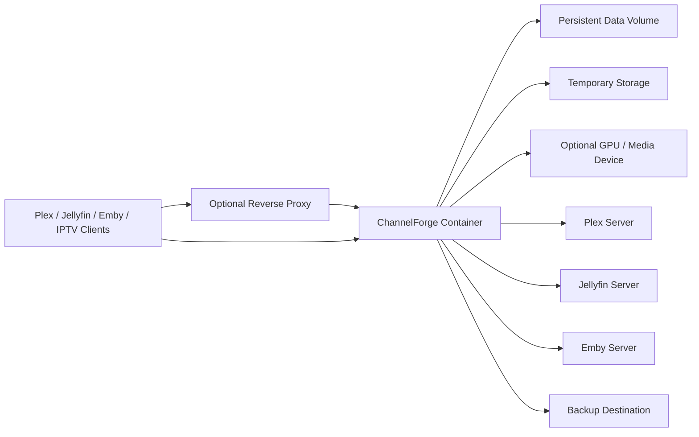

# ChannelForge Deployment Specification

- **Specification version:** 0.1
- **Status:** Draft
- **Last updated:** 2026-07-27

## Purpose

This document defines deployment architecture and operational requirements for
ChannelForge version 1.

It specifies:

- Supported deployment models
- Docker image requirements
- Docker Compose requirements
- Unraid template requirements
- Persistent storage
- Configuration
- Secrets
- Networking
- Reverse proxies
- TLS
- HDHomeRun-compatible discovery
- Hardware acceleration
- CPU and memory limits
- Health checks
- Startup
- Shutdown
- Migrations
- Upgrades
- Rollback
- Backup
- Restore
- Logging
- Observability
- Security hardening
- Release artifacts
- Air-gapped operation
- Troubleshooting
- Support bundles
- Operational runbooks

This document does not define:

- Internal database schema
- Public API field contracts
- Schedule-generation algorithms
- Plugin extension contracts
- Exact user-interface behavior
- Exact CI implementation
- Exact cloud hosting products

Those concerns are defined in other architecture specifications.

## Deployment Mission

ChannelForge must be straightforward to install on a home server while remaining
predictable, recoverable, and secure.

The supported deployment must:

- Start from one documented container image
- Preserve all durable state in mounted storage
- Survive container recreation
- Avoid requiring an external database
- Support Docker Compose
- Support Unraid
- Support Plex, Jellyfin, and Emby connectivity
- Support XMLTV, M3U, IPTV, and HDHomeRun-compatible output
- Support optional hardware acceleration
- Expose reliable health checks
- Run as a non-root user where practical
- Support backup and restore
- Support controlled upgrades
- Avoid hidden host dependencies
- Produce actionable diagnostics

## Scope

Version 1 officially targets:

- Docker Engine on Linux
- Docker Compose
- Unraid Community Applications-style template deployment
- Single-container ChannelForge application
- SQLite persistence
- Managed local filesystem storage
- Optional reverse proxy
- Optional GPU or media-device access
- Local network clients
- Plex, Jellyfin, and Emby on the same or reachable networks

Version 1 may run in other environments, but they are not primary support
targets unless documented.

## Non-Goals

Version 1 does not require:

- Kubernetes
- Nomad
- Docker Swarm
- Multi-node active-active deployment
- Managed cloud database
- Distributed filesystem
- Object storage
- External message queue
- Separate transcoder nodes
- Windows service installation
- macOS native service installation
- Rootless-container support on every platform
- High-availability failover
- Automatic horizontal scaling

These may be considered later.

## Deployment Principles

1. Durable state lives outside the container image.
2. The container is replaceable.
3. SQLite remains local to supported storage.
4. Startup performs validation before accepting normal traffic.
5. Migrations are controlled and backed up.
6. The application runs with least privilege.
7. Device access is explicit.
8. Network exposure is explicit.
9. Public access is disabled by default.
10. Health checks distinguish liveness from readiness.
11. Backups are part of normal operation.
12. Upgrades are reversible where schema compatibility permits.
13. Logs go to standard output and managed files only when configured.
14. Secrets are not embedded in images or Compose files by default.
15. Unraid and Compose express the same architecture.
16. Host networking is optional and justified only by discovery needs.
17. Storage paths are documented and inspectable.
18. Container restarts do not erase editorial state.
19. Operators can identify the running application version.
20. Support bundles redact secrets.

## Supported Topology



## Primary Deployment Unit

The primary deployment unit is one ChannelForge container.

It contains:

- Web application
- REST API
- Scheduling engine
- Integration adapters
- Playout runtime
- FFmpeg supervisor
- SQLite client
- Background Job workers
- XMLTV and M3U generators
- HDHomeRun-compatible HTTP service
- Optional discovery service
- Plugin runtime broker

## Single-Container Requirement

Version 1 must not require operators to deploy separate services for:

- Database
- Queue
- Scheduler
- Artifact generator
- Transcoder coordinator
- Web UI

Internal processes or workers may still exist inside the container.

## Process Model

The container may run:

- One application process
- Child FFmpeg processes
- Optional isolated plugin processes
- Internal worker threads

The container entrypoint must remain the parent supervisor for application
lifecycle.

## Application Image

The official image must:

- Contain the ChannelForge application
- Contain or provide a supported FFmpeg build
- Contain required runtime dependencies
- Use a minimal supported base image
- Declare application version metadata
- Expose documented ports
- Define a health check or documented external probe
- Run as non-root where practical
- Avoid unnecessary package managers and build tools in final image
- Support amd64
- Support arm64 when release validation permits
- Include license and notice material
- Produce a software bill of materials where practical

## Image Tags

Recommended tag classes:

- Immutable release tag
- Major-minor convenience tag
- Stable channel
- Beta channel
- Development or edge channel
- Digest reference

Examples:

```text
channel-forge/channel-forge:1.0.0
channel-forge/channel-forge:1.0
channel-forge/channel-forge:stable
channel-forge/channel-forge:beta
```

Exact registry and naming remain implementation decisions.

## Immutable Deployments

Production deployments should prefer:

- Exact version tag
- Image digest
- Recorded release notes

Floating tags simplify updates but reduce reproducibility.

## Image Metadata

The image should publish labels for:

- Application name
- Application version
- Source repository
- Revision
- Build timestamp
- License
- Documentation
- Vendor
- Supported architecture

## Multi-Architecture Images

A multi-architecture manifest may include:

- `linux/amd64`
- `linux/arm64`

Architecture support requires:

- Build success
- Test success
- FFmpeg compatibility
- Native dependency compatibility
- Hardware acceleration documentation

## Base Image

The base image should be:

- Maintained
- Minimal
- Compatible with FFmpeg
- Compatible with native SQLite dependencies
- Compatible with supported hardware drivers
- Scanned for vulnerabilities

## Image Build Stages

Recommended stages:

1. Dependency resolution
2. Application build
3. Test or validation
4. Runtime assembly
5. Metadata and licenses

Build tools should not remain in the final image unless required.

## Reproducible Builds

The build should pin:

- Dependency lockfile
- Runtime version
- Package manager version
- Base image digest where feasible
- FFmpeg source or package version
- Native dependency versions

## FFmpeg Packaging

The image must make FFmpeg availability predictable.

Supported strategies:

- Bundle a tested FFmpeg binary
- Install from a pinned base repository
- Use an official companion package during build

The application must report:

- FFmpeg path
- FFmpeg version
- Enabled encoders
- Enabled decoders
- Enabled protocols
- Hardware capabilities

## FFmpeg Override

Advanced deployments may provide an alternate FFmpeg binary.

An override must:

- Be explicit
- Be validated on startup
- Report version
- Report capabilities
- Produce a warning when untested
- Avoid arbitrary user-controlled command path changes through ordinary UI

## Container User

The container should run as a non-root user.

The runtime user requires:

- Read and write access to ChannelForge data
- Read and write access to temporary storage
- Read access to mapped media paths when used
- Access to configured hardware devices
- Access to backup destination when used

## PUID and PGID

The image may support `PUID` and `PGID` compatibility for Unraid and common home
server workflows.

Behavior must be documented.

Requirements:

- Validate numeric values
- Avoid silently running as root
- Apply ownership only to managed paths
- Avoid recursive ownership changes over large external media libraries
- Report effective UID and GID at startup

## Supplemental Groups

Hardware and media access may require supplemental groups.

Examples:

- `video`
- `render`
- Media-share group

Group IDs should be configurable without rebuilding the image.

## Root Execution

Running as root should:

- Be unnecessary
- Produce a warning
- Be reserved for exceptional troubleshooting
- Not disable application-level security
- Not be required for standard hardware acceleration

## Filesystem Layout

Suggested in-container paths:

```text
/config
/data
/cache
/tmp/channel-forge
/backups
/media
```

Exact paths may be consolidated.

The deployment contract must distinguish:

- Durable configuration and database
- Durable managed assets
- Rebuildable cache
- Temporary runtime files
- Optional backup destination
- Optional read-only media mounts

## Durable Data Root

One mounted durable root is preferred.

Example:

```text
/config
```

It may contain:

```text
/config/
  database/
  assets/
  artifacts/
  plugins/
  secrets/
  logs/
  backups/
  state/
```

Exact directory names are implementation details.

## Durable Data Requirements

Durable storage must preserve:

- SQLite database
- Managed files
- Artwork
- Branding
- Presentation assets
- Plugin packages
- Plugin state
- Output artifacts
- Secret ciphertext
- Audit
- Migration metadata
- Backup metadata

## Rebuildable Data

Rebuildable storage may include:

- Search projections
- Provider artwork cache
- Temporary transcode cache
- Temporary HLS segments
- Generated diagnostics
- Download staging
- Upload staging

## Temporary Storage

Temporary storage must support:

- FFmpeg pipes or intermediate files
- HLS segments
- Upload staging
- Backup staging
- Restore staging
- Plugin temporary files
- Artifact generation

## Temporary Storage Requirements

Temporary storage must:

- Be writable
- Have sufficient free space
- Be cleaned on startup and shutdown
- Be bounded
- Be excluded from authoritative backup
- Avoid persistence requirements
- Remain on a filesystem suitable for active workloads

## Memory-Backed Temporary Storage

A `tmpfs` may be used for small temporary workloads.

Risks:

- Memory exhaustion
- Segment loss on restart
- Insufficient capacity for backups
- OOM termination

ChannelForge must not require `tmpfs`.

## SQLite Storage Requirements

SQLite database storage must:

- Be local or provide reliable POSIX-like locking semantics
- Support atomic file replacement
- Support WAL behavior where enabled
- Avoid unsupported network filesystems
- Have sufficient free space
- Be writable by the container user
- Be backed up through SQLite-aware workflow

## Unsupported SQLite Storage

The primary database should not be placed on:

- Unreliable SMB mounts
- Unreliable NFS configurations
- Cloud-synchronized folders
- Object-storage mounts
- Filesystems lacking correct locking
- Temporary container layers

Unless explicitly validated, these are unsupported.

## Unraid Appdata

On Unraid, durable state should use an appdata path such as:

```text
/mnt/user/appdata/channelforge
```

A cache-pool-backed appdata location is preferred for SQLite performance.

The exact host path is operator-configurable.

## Unraid Share Considerations

Unraid documentation should address:

- Cache pool
- Mover behavior
- SQLite locking
- Share allocation
- Backup location
- Permissions
- Case sensitivity
- Direct disk paths versus user shares

## Media Mounts

Media mounts are optional because Plex, Jellyfin, and Emby can provide streams.

Local media mounts are used only when:

- Path Mapping is configured
- The provider reports usable paths
- ChannelForge can read the same files
- Local access is preferred by policy

## Read-Only Media Mounts

Media mounts should be read-only by default.

Example:

```yaml
volumes:
  - /mnt/media:/media:ro
```

## Path Mapping

Host and container path differences must be configured explicitly.

Example:

```text
Provider path: /movies
Container path: /media/movies
```

Windows provider paths may require a mapping such as:

```text
Provider path: D:\Movies
Container path: /media/movies
```

## Mount Propagation

ChannelForge should not require special mount propagation.

## Symlink Behavior

Media symlink handling must be documented.

The default should avoid escaping approved roots.

## File Permissions

The container startup check must verify:

- Data root readable
- Data root writable
- Database directory writable
- Managed asset directory writable
- Temporary directory writable
- Backup destination writable when configured
- Media roots readable when configured

## Disk Capacity

ChannelForge should monitor free space for:

- Data root
- Temporary root
- Backup root
- HLS segment storage

## Disk Thresholds

Suggested states:

- Healthy
- Warning
- Critical
- Write-blocking

Exact thresholds are configurable.

## Disk Exhaustion Behavior

When disk is critically low:

- Stop nonessential artifact generation
- Stop large imports
- Stop backup creation
- Stop plugin cache growth
- Preserve active publication
- Serve prior valid artifacts
- Raise critical health finding
- Avoid repeated failing writes

## Configuration Sources

Configuration may come from:

1. Environment variables
2. Mounted secret files
3. Command-line arguments
4. Persisted instance configuration
5. Safe built-in defaults

## Configuration Precedence

Precedence must be explicit and documented.

Recommended:

```text
Command line
Environment or secret file
Persisted instance configuration
Built-in default
```

Some bootstrap values must remain deployment-controlled and not editable in the
database.

## Bootstrap Configuration

Bootstrap configuration may include:

- Data path
- HTTP bind address
- HTTP port
- Public base URL bootstrap
- Database path
- Temporary path
- Secret key reference
- Log level
- Trusted proxy bootstrap
- Deployment mode

## Persisted Configuration

Persisted settings may include:

- Networks
- Channels
- Media Sources
- Schedule policy
- Output profiles
- Backup policy
- Retention
- Public artifact policy
- Plugin policy

## Environment Variable Naming

Environment variables should use a consistent prefix.

Example:

```text
CHANNELFORGE_
```

## Environment Variable Rules

Environment variables must:

- Have documented type
- Have documented default
- Fail clearly on invalid values
- Avoid silent coercion
- Avoid containing reusable secrets where a secret file is supported
- Be listed in diagnostics without secret values

## Example Bootstrap Variables

Potential variables:

```text
CHANNELFORGE_DATA_DIR
CHANNELFORGE_TEMP_DIR
CHANNELFORGE_HTTP_HOST
CHANNELFORGE_HTTP_PORT
CHANNELFORGE_PUBLIC_BASE_URL
CHANNELFORGE_LOG_LEVEL
CHANNELFORGE_TIME_ZONE
CHANNELFORGE_TRUSTED_PROXIES
CHANNELFORGE_SECRET_KEY_FILE
CHANNELFORGE_PUID
CHANNELFORGE_PGID
```

Exact names remain implementation details.

## Time Zone

The container should normally use UTC internally.

Instance and Channel editorial time zones are stored explicitly.

A deployment time-zone variable may affect:

- Log display
- Backup naming
- Operator-facing defaults

It must not replace Channel IANA time-zone configuration.

## System Clock

The container uses the host clock.

The deployment must provide accurate time.

## Clock Requirements

The host should use reliable time synchronization.

ChannelForge should report:

- Current UTC time
- Detected clock anomalies
- Token validation issues
- Schedule drift risk

## Locale

The runtime should not depend on host locale for:

- Timestamp parsing
- Number parsing
- Duration parsing
- Schedule sorting
- Database ordering

## Secrets Deployment

Secret values should be supplied through:

- Mounted secret files
- Container secrets where available
- Environment variables only when necessary
- Initial UI entry stored through encrypted Secret Service

## Master Key

The secret-encryption master key must be external to the encrypted database
values.

Recommended deployment options:

- Mounted read-only secret file
- Docker secret
- Unraid file with restrictive permissions
- Host keyring integration in future

## Master Key File

The key file should:

- Be readable only by application user
- Be mounted read-only
- Not be stored inside public appdata backup unless intentionally protected
- Be included in disaster-recovery planning
- Be excluded from logs and support bundles

## Missing Master Key

Startup behavior must be explicit.

Possible behavior:

- Fail readiness
- Enter recovery mode
- Permit limited read-only access
- Require key restoration
- Avoid regenerating a new key silently

Silently replacing a missing key is prohibited.

## Docker Compose

A supported Compose example must be maintained with releases.

## Compose Requirements

The Compose definition should include:

- Image
- Container name
- Restart policy
- Port mappings
- Durable volume
- Temporary volume
- Optional backup volume
- Environment
- Secret file
- Health check
- Optional device mappings
- Optional supplemental groups
- Optional reverse-proxy labels separated from core example

## Reference Compose Structure

```yaml
services:
  channelforge:
    image: channel-forge/channel-forge:1.0.0
    container_name: channelforge
    restart: unless-stopped
    ports:
      - "8000:8000"
    volumes:
      - ./config:/config
      - ./tmp:/tmp/channel-forge
      - ./secrets/master-key:/run/secrets/channel-forge-master-key:ro
    environment:
      CHANNELFORGE_DATA_DIR: /config
      CHANNELFORGE_TEMP_DIR: /tmp/channel-forge
      CHANNELFORGE_HTTP_PORT: "8000"
      CHANNELFORGE_SECRET_KEY_FILE: /run/secrets/channel-forge-master-key
    healthcheck:
      test: ["CMD", "channel-forge-healthcheck"]
      interval: 30s
      timeout: 5s
      retries: 5
      start_period: 60s
```

This is conceptual and not a final release file.

## Compose Version

Use current Compose specification syntax rather than depending on obsolete
version keys.

## Restart Policy

Recommended default:

```text
unless-stopped
```

Alternative:

```text
on-failure
```

The operator should understand that automatic restart does not repair:

- Corrupt database
- Missing key
- Invalid migration
- Permission failure
- Disk full

## Compose Profiles

Optional profiles may separate examples for:

- NVIDIA
- Intel or VA-API
- Reverse proxy
- Host networking
- Development
- Backup testing

## Compose Networks

A dedicated bridge network is recommended.

Media servers may be reachable through:

- Same Docker network
- Host LAN address
- DNS name
- Reverse-proxy address

## Container DNS

The deployment must provide DNS resolution for configured Media Sources.

## `host.docker.internal`

This hostname is platform-dependent.

Documentation should not assume it exists on every Linux host.

## Linux Host Gateway

Compose may support a host-gateway mapping when the operator needs to reach a
host service.

## Port Mapping

The application HTTP port is configurable.

Example:

```text
8000/tcp
```

## Port Collision

The operator may map any unused host port to the container port.

Public artifact and stream URLs must use the configured external address.

## Separate Ports

Version 1 should prefer one HTTP port for:

- UI
- Management API
- Streams
- XMLTV
- M3U
- HDHomeRun-compatible HTTP endpoints

A separate discovery UDP port may be required.

## UDP Discovery

HDHomeRun-compatible discovery may require UDP broadcast or multicast behavior.

## Discovery Deployment Modes

Possible modes:

- Disabled
- Bridged network with explicit UDP mapping
- Host network
- Macvlan or ipvlan
- External discovery relay

## Host Networking

Host networking may simplify discovery.

Risks:

- Broader port exposure
- Reduced network isolation
- Port conflicts
- Harder firewall assumptions
- Platform differences

It should not be required for normal M3U or XMLTV use.

## Discovery Interface Selection

The operator should be able to select:

- One interface
- One address
- One subnet
- All interfaces under warning

## Static Tuner Configuration

Clients that allow manual tuner URL entry do not require broadcast discovery.

Documentation should prefer manual configuration when it avoids host networking.

## Docker Desktop

Docker Desktop may be useful for development and testing.

It is not the primary recommended production environment.

Potential differences:

- Host networking
- UDP broadcast
- Filesystem performance
- Device passthrough
- Path mappings
- Clock behavior
- Sleep and resume

## Windows Host Development

On Windows:

- Store the repository on a local filesystem
- Use Linux containers
- Expect path conversion
- Do not rely on Windows paths inside the container
- Use explicit media Path Mappings
- Expect limited hardware and discovery differences

## Unraid Deployment

ChannelForge should provide an Unraid-compatible template.

## Unraid Template Fields

Required fields may include:

- Name
- Repository
- Network type
- Web UI URL
- Icon
- Support URL
- Project URL
- Config path
- Temporary path
- Backup path
- HTTP port
- Discovery port
- PUID
- PGID
- Time zone
- Master key path
- Public base URL
- Log level
- Optional GPU devices

## Unraid Template Defaults

Defaults should:

- Avoid root
- Use appdata
- Avoid public exposure
- Disable discovery unless configured
- Use bridge networking unless host networking is required
- Avoid mounting the whole host filesystem
- Avoid write access to media
- Provide clear descriptions

## Unraid Web UI Link

The template should produce a Web UI link based on:

- Host address
- Mapped HTTP port
- Base path if configured

## Unraid Network Types

Supported examples:

- Bridge
- Host
- Custom Docker network
- Custom IP

Each has different discovery behavior.

## Unraid Custom IP

A custom IP may improve:

- Stable tuner address
- Discovery
- Port isolation

It may complicate:

- Host access
- Routing
- macvlan stability
- Firewall behavior

## Unraid Host Access

When using custom networks, Media Sources running on the Unraid host must remain
reachable.

## Unraid GPU Mapping

The template may support:

- `/dev/dri`
- NVIDIA runtime variables
- Other device paths when validated

## Unraid Appdata Backup

Documentation should integrate with common appdata backup practices while
clarifying that:

- SQLite-aware backup is preferred
- Copying a live database directory may be inconsistent
- ChannelForge's internal backup should be used for authoritative recovery
- External appdata backup should stop the container or use a verified snapshot

## Reverse Proxy

ChannelForge may run behind a reverse proxy.

## Reverse Proxy Responsibilities

A proxy may provide:

- TLS
- Public hostname
- Authentication
- Access logging
- Compression
- IP allowlisting
- Rate limiting
- Request size control

## Reverse Proxy Requirements

The proxy must support:

- Long-lived streaming responses
- Disabled response buffering for streams
- Suitable read timeouts
- WebSocket only if future features require it
- Server-Sent Events if enabled
- Large artifact downloads
- Correct forwarded headers
- No caching of authenticated management responses

## Trusted Proxy Configuration

ChannelForge trusts forwarded headers only from configured proxy addresses.

## Forwarded Headers

Potential headers:

- `Forwarded`
- `X-Forwarded-For`
- `X-Forwarded-Proto`
- `X-Forwarded-Host`

The exact trusted set must be documented.

## Public Base URL

A reverse-proxied deployment should set an explicit public base URL.

Example:

```text
https://tv.example.net
```

This affects:

- M3U stream URLs
- XMLTV links
- HDHomeRun lineup URLs
- Logo URLs
- API links
- Download links

## Base Path

A proxy may host ChannelForge under a base path.

Example:

```text
https://example.net/channelforge
```

Base-path support must be tested across:

- UI
- API
- Static assets
- Streams
- HLS
- XMLTV
- M3U
- HDHomeRun-compatible endpoints

Version 1 may declare root-path deployment as the supported default.

## Proxy Buffering

Proxy buffering must be disabled for:

- MPEG-TS live streams
- HLS segment generation paths where inappropriate
- Server-Sent Events
- Large streaming exports

## Proxy Timeouts

Timeouts must exceed expected:

- Live stream duration
- HLS connection behavior
- Backup download
- Large XMLTV download
- Background Job polling

## Proxy Compression

Compression is appropriate for:

- JSON
- XMLTV
- M3U
- HTML
- JavaScript
- CSS

Compression is unnecessary for:

- Video
- Audio
- Already-compressed images
- Transport streams

## TLS

TLS may terminate at the reverse proxy.

Direct ChannelForge TLS is optional unless implemented.

## HTTPS Recommendation

Remote management access should use HTTPS.

## Local HTTP

Local HTTP may be acceptable on isolated trusted networks.

The UI must warn when secure cookie or token assumptions are weakened.

## Certificate Renewal

Certificate renewal is the proxy or deployment operator's responsibility unless
ChannelForge later manages TLS directly.

## HSTS

Enable HSTS only when the hostname is permanently HTTPS.

## Authentication Proxy

Reverse-proxy authentication is optional.

It requires:

- Trusted proxy addresses
- Header stripping
- Direct-access policy
- User mapping
- Documentation
- Audit

## Network Exposure

The operator must be able to bind:

- Loopback only
- One LAN address
- All addresses

## Default Bind

A container typically binds internally to all interfaces.

Host exposure is controlled through Docker port publishing.

## Public Internet Exposure

Direct public exposure is not recommended without:

- TLS
- Authentication
- Secure proxy
- Firewall
- Updated release
- Strong administrator password
- Backup
- Stream access policy
- Plugin review

## Firewall

Document required ports:

- HTTP TCP
- Optional discovery UDP
- Outbound connections to Media Sources
- Outbound plugin destinations
- Optional backup destination

## Outbound Networking

ChannelForge requires outbound or lateral access to configured integrations.

## Media Source Connectivity

The container must reach:

- Plex server address
- Jellyfin server address
- Emby server address

## DNS Names

Use stable DNS names where possible.

## Address Changes

A Media Source's stable provider identity protects against silent server
replacement when an address changes.

## IPv6

Deployment must document whether:

- HTTP binds IPv6
- Discovery uses IPv6
- Media Sources resolve IPv6
- Firewall protects IPv6

## Air-Gapped Deployment

ChannelForge should remain usable without internet access when:

- Container image is present
- Plex, Jellyfin, or Emby are reachable
- Plugin packages are local
- No external metadata provider is required
- Updates are performed manually

## Air-Gapped Limitations

Potential limitations:

- No online update check
- No remote plugin marketplace
- No external metadata lookup
- No vulnerability feed
- No remote artwork provider

## Proxy Environment Variables

System-wide `HTTP_PROXY` and `HTTPS_PROXY` may affect outbound integrations.

Support must be explicit.

## `NO_PROXY`

Local Media Source addresses may require `NO_PROXY`.

## Source-Specific Proxy

A source-specific proxy is preferable when only one integration requires it.

## Hardware Acceleration

Hardware acceleration is optional.

## Hardware Support Categories

Potential categories:

- Intel Quick Sync
- VA-API
- NVIDIA NVENC and NVDEC
- AMD VA-API
- VideoToolbox in nonprimary environments
- Software fallback

## Hardware Detection

Startup should report:

- Visible devices
- Device permissions
- FFmpeg hardware methods
- Encoders
- Decoders
- Test status
- Configured limits

## Hardware Preflight

A preflight may:

- Open device
- Query capabilities
- Run a short synthetic transcode
- Verify output
- Release device

## Intel and VA-API

Typical Linux access uses:

```text
/dev/dri
```

The container user may need membership in:

- `video`
- `render`

## Device Mapping

Example:

```yaml
devices:
  - /dev/dri:/dev/dri
```

## NVIDIA

NVIDIA deployment may require:

- Compatible host driver
- NVIDIA Container Toolkit
- Runtime configuration
- Device selection
- Driver capabilities
- FFmpeg build with NVIDIA support

## NVIDIA Environment

The exact environment variable pattern depends on the container runtime.

It must be documented in a separate validated example.

## AMD

AMD acceleration may use VA-API through `/dev/dri`.

Support depends on:

- Host driver
- Device generation
- FFmpeg build
- Codec
- Container permissions

## Hardware Device Isolation

Expose only required devices.

## Hardware Concurrency

ChannelForge must enforce configured concurrent hardware sessions.

## Hardware Failure

Hardware failure may:

- Fall back to software
- Fall back to another device
- Reduce output profile
- Fail the session

Deployment health should show hardware degradation.

## Software Transcoding

Software transcoding requires sufficient CPU.

## CPU Sizing

Capacity depends on:

- Codec
- Resolution
- Frame rate
- Bit rate
- Filters
- Subtitle burn-in
- Number of Channels
- Client profile
- Source format

No universal CPU minimum guarantees real-time transcoding.

## Resource Profiles

Documentation may define qualitative profiles:

- Metadata and direct-stream only
- One HD transcode
- Multiple HD transcodes
- 4K transcode
- Always-on multi-Channel

These require benchmark validation.

## CPU Limits

Container CPU limits are optional.

Limits that are too low may cause:

- Stream stalls
- FFmpeg slowdown
- Schedule transition delay
- Background Job delay

## CPU Shares

Background work should yield to active playout.

## Memory Sizing

Memory use includes:

- Application runtime
- SQLite cache
- Catalog projections
- Schedule generation
- FFmpeg
- HLS buffers
- Plugin processes
- Uploads
- Backup staging

## Memory Limits

A hard memory limit should allow peak workload.

## OOM Behavior

On out-of-memory termination:

- Container may restart
- Running sessions become abandoned
- SQLite transactions roll back
- Startup reconciliation runs
- HLS segments are rebuilt
- Health records the abnormal termination when detectable

## Swap

Heavy swap can break real-time playout.

## Process Limits

The deployment may limit:

- PIDs
- Open files
- Threads
- Child processes

Limits must accommodate FFmpeg and plugins.

## File Descriptor Limits

Live clients and provider connections consume file descriptors.

## Network Bandwidth

Required bandwidth includes:

- Media Source input
- Client output
- Multiple simultaneous clients
- Artwork synchronization
- Backups
- HLS overhead

## Shared Streams

Shared Channel Sessions reduce duplicate input and transcode cost.

## Quality Profiles

Output profiles should be chosen according to host capacity.

## Resource Admission

ChannelForge should reject or queue work rather than exceed configured limits.

## Health Checks

Health checks are required for orchestration and operator diagnostics.

## Liveness

Liveness answers whether the application process can respond.

Suggested path:

```text
/health/live
```

Liveness should not depend on:

- Media Sources
- FFmpeg
- Backup destination
- Plugins
- External internet

## Readiness

Readiness answers whether normal service can be accepted.

Suggested path:

```text
/health/ready
```

Readiness may depend on:

- Startup complete
- Database open
- Migrations complete
- Data root writable
- Secret key available
- Critical reconciliation complete
- Not in restore activation
- HTTP service initialized

## Detailed Health

Authenticated detailed health may include:

- Persistence
- Disk
- FFmpeg
- Hardware
- Media Sources
- Plugins
- Output artifacts
- Background Jobs
- Backup freshness
- Clock
- Version

## Container Health Check

The image should include a small health-check command or HTTP client.

It must:

- Avoid requiring `curl` if not otherwise needed
- Have a short timeout
- Return nonzero on failure
- Use localhost
- Avoid authentication for liveness
- Avoid leaking details

## Start Period

The health check should allow time for:

- Database migration
- Integrity checks
- Large reconciliation
- Plugin initialization

## Readiness During Migration

Readiness remains false until migration succeeds.

## Health During Maintenance

Liveness may remain true.

Readiness may be false or degraded depending on maintenance type.

## Startup Sequence

Recommended startup sequence:

1. Initialize process logging.
2. Report build and runtime version.
3. Validate effective user.
4. Validate data and temp paths.
5. Load bootstrap configuration.
6. Load master key.
7. Open SQLite.
8. Apply connection settings.
9. Verify schema.
10. Create pre-migration backup when required.
11. Apply migrations.
12. Run quick integrity check.
13. Reconcile managed files.
14. Reconcile abandoned jobs.
15. Reconcile playout sessions.
16. Validate FFmpeg.
17. Detect hardware.
18. Load plugin registrations.
19. Start enabled plugins.
20. Validate active publications.
21. Validate active artifacts.
22. Start Background Job workers.
23. Start HTTP readiness.
24. Start optional discovery.
25. Mark ready.

## Startup Logs

Startup logs should clearly report:

- Application version
- Build revision
- Database schema version
- Data path
- Effective UID and GID
- HTTP bind
- Public base URL
- FFmpeg version
- Hardware status
- Plugin count
- Migration result
- Readiness result

Secrets must be redacted.

## Startup Failure

A blocking startup failure must:

- Exit nonzero or remain explicitly unready
- Log an actionable reason
- Avoid infinite rapid restart loops where possible
- Preserve data
- Avoid partial migration continuation
- Avoid silently resetting configuration

## Recovery Mode

Certain failures may start a restricted recovery mode.

Examples:

- Missing encryption key
- Restore required
- Plugin framework failure
- Noncritical artifact corruption

Recovery mode must not expose normal privileged operations without
authentication.

## Shutdown Signal

The container must handle normal stop signals.

## Graceful Shutdown

Recommended shutdown sequence:

1. Mark unready.
2. Stop accepting new management mutations.
3. Stop accepting new stream sessions where policy permits.
4. Request Background Job cancellation.
5. Drain bounded plugin calls.
6. Stop discovery.
7. Stop or finalize playout sessions.
8. Terminate FFmpeg processes.
9. Finalize Airing Records.
10. Flush audit and Outbox.
11. Checkpoint SQLite where appropriate.
12. Close database.
13. Remove temporary leases.
14. Exit.

## Shutdown Timeout

Docker stop timeout should exceed the normal graceful shutdown budget.

## Forced Shutdown

If the process is force-killed:

- SQLite should recover committed transactions
- Startup reconciliation handles abandoned jobs and sessions
- Temporary files are cleaned
- Hardware reservations expire
- Previous valid artifacts remain

## Restart Behavior

Container restart must not:

- Create a new instance identity
- Delete schedules
- Delete credentials
- Reset plugins
- Reset channel numbers
- Regenerate master key
- Change public URLs silently

## Restart Policy and Crash Loop

Repeated startup failure should be visible.

Documentation should show how to inspect:

- Container logs
- Health state
- Data permissions
- Master key
- Migration error
- Disk capacity

## Migrations

Database migrations run at startup or through a controlled command.

## Migration Requirements

- Ordered
- Checksum verified
- Exclusive
- Backed up
- Logged
- Fail closed
- Restart-safe where possible

## Pre-Migration Backup

A pre-migration backup should be created when:

- Schema changes are destructive
- Secret format changes
- Plugin framework changes
- Release policy requires it

## Migration Storage Headroom

Migrations may require temporary disk equal to a substantial fraction of
database size.

## Migration Failure

On failure:

- Do not mark ready
- Preserve pre-migration backup
- Preserve database
- Exit or remain in recovery
- Provide migration ID
- Avoid automatic downgrade

## Large Migration

Large data backfills may:

- Run before readiness
- Run in resumable maintenance mode
- Run after startup under compatibility behavior

The release notes must state the impact.

## Upgrade Policy

An upgrade replaces the container image while retaining durable storage.

## Upgrade Workflow

Recommended:

1. Read release notes.
2. Verify current backup.
3. Create fresh backup.
4. Record current image tag or digest.
5. Pull target image.
6. Stop ChannelForge.
7. Start target image with same storage.
8. Monitor migration.
9. Verify readiness.
10. Verify Media Sources.
11. Verify XMLTV and M3U.
12. Verify one Channel stream.
13. Retain prior image until confidence established.

## Automatic Updates

Unattended automatic updates are not recommended by default.

Reasons:

- Schema migration
- Plugin compatibility
- FFmpeg changes
- Hardware regressions
- Output compatibility
- Security-setting changes

## Update Notification

ChannelForge may report that a newer version exists.

It should not automatically install without explicit policy.

## Release Channels

Potential channels:

- Stable
- Beta
- Edge

## Stable Channel

Stable releases require:

- Migration testing
- Compose testing
- Unraid testing
- Plex, Jellyfin, and Emby compatibility checks
- Stream compatibility checks
- Backup and restore test
- Security review
- Release notes

## Beta Channel

Beta releases may contain:

- New architecture
- Incomplete migrations
- Compatibility warnings
- Higher diagnostic verbosity

They should not be recommended for critical always-on deployments without
backup.

## Edge Channel

Edge builds are development artifacts.

They may be unsupported for migration continuity.

## Downgrade

Downgrade is not guaranteed.

## Downgrade Restrictions

A prior image must not start against a newer incompatible schema.

## Rollback

Rollback means returning to a prior application and compatible data state.

## Safe Rollback

Possible when:

- No incompatible migration occurred
- Prior image supports current schema
- No irreversible secret migration occurred
- Plugins remain compatible

## Backup-Based Rollback

When schema changed incompatibly:

1. Stop current container.
2. Preserve failed current data.
3. Restore pre-upgrade backup.
4. Start prior image.
5. Verify.
6. Investigate before retry.

## Rollback Documentation

Every release with migration must document:

- Whether direct rollback is supported
- Whether backup restore is required
- Plugin implications
- Secret key implications
- Artifact implications

## Backup Deployment

ChannelForge's internal backup workflow is authoritative.

## Backup Destination

Version 1 may support:

- Path inside durable storage
- Separate mounted local path
- Mounted network backup destination
- User download

## Separate Backup Mount

A separate backup mount is recommended.

Example:

```text
/backups
```

## Backup Permissions

The container user needs write access only to the intended backup path.

## Backup Scheduling

Backup scheduling is application configuration.

## Host-Level Backup

Host-level backup may supplement internal backups.

It should:

- Stop the container, or
- Use a filesystem snapshot with SQLite consistency, or
- Copy a verified internal backup archive

## Appdata Copy Warning

Copying live SQLite files without WAL awareness is not a guaranteed backup.

## Restore Deployment

Restore may be performed through:

- Authenticated UI
- Controlled CLI
- Recovery-mode command
- Replacement container against staged data

## Restore Staging

Restore requires sufficient storage for:

- Current data
- Backup archive
- Extracted staging data
- Safety backup

## Restore and Container Identity

Restoring data should preserve instance identity unless cross-instance restore
policy changes it.

## Disaster Recovery

Required recovery materials:

- Backup archive
- Master key or backup passphrase
- Container image or version
- Deployment configuration
- Volume paths
- Plugin packages where not embedded
- Documentation

## Disaster Recovery Drill

Operators should periodically verify:

- Backup download
- Backup checksum
- Key availability
- Test restore
- Application startup
- Schedule visibility
- Stream playback

## Logging

Container logs go to standard output and standard error.

## Log Format

Support:

- Human-readable
- Structured JSON

## Log Level

Suggested levels:

- Error
- Warn
- Info
- Debug
- Trace

## Default Log Level

Default should be `INFO`.

## Debug Logging

Debug mode:

- Is temporary
- Preserves redaction
- May increase disk and CPU use
- Should not be left enabled indefinitely

## Docker Logging Driver

The operator is responsible for log-driver configuration.

## Log Rotation

Unbounded Docker JSON logs can consume the host disk.

Documentation must recommend rotation.

## Managed File Logs

ChannelForge may optionally store bounded operational logs in managed storage.

They must not replace standard container logs.

## Access Logs

HTTP access logging should:

- Use route templates
- Redact query tokens
- Omit Authorization
- Bound client-address retention
- Distinguish stream requests

## FFmpeg Logs

FFmpeg logs are:

- Bounded
- Session-associated
- Redacted
- Exposed only to authorized diagnostics

## Plugin Logs

Plugin logs are:

- Namespaced
- Rate-limited
- Redacted
- Bounded

## Observability

Version 1 should provide:

- Health endpoints
- Structured logs
- Internal metrics
- Background Job status
- Runtime status
- Diagnostic bundles

## Metrics Endpoint

A metrics endpoint may be:

- Disabled by default
- Authenticated
- Bound to local interface
- Prometheus compatible

## Metrics Security

Metrics may reveal:

- Channel names
- Source health
- Runtime capacity
- Host details

Exposure must be controlled.

## Tracing

Distributed tracing is optional for version 1.

Local correlation IDs remain required.

## Support Bundle

An operator may generate a support bundle.

## Support Bundle Contents

Potential contents:

- Application version
- Build revision
- Effective nonsecret configuration
- Schema version
- Migration status
- Health summary
- FFmpeg version and capabilities
- Hardware summary
- Plugin manifests
- Recent redacted logs
- Job summaries
- Database integrity result
- Storage capacity
- Network endpoint classification
- Compose or template diagnostics supplied by operator

## Support Bundle Exclusions

Exclude:

- Passwords
- API tokens
- Session tokens
- Provider tokens
- Plugin secrets
- Master key
- Backup passphrases
- Signed source URLs
- Raw cookies
- Private keys

## Support Bundle Size

The bundle is bounded.

Large logs are truncated or sampled.

## Support Bundle Audit

Generating and downloading a bundle is audited.

## Diagnostic Command

The image may include a CLI diagnostic command.

Potential actions:

- Print version
- Validate paths
- Test database
- Test FFmpeg
- List hardware
- Test Media Source reachability
- Verify backup
- Generate support bundle

## CLI Security

CLI commands should not print secrets.

## Deployment Validation

A deployment validation command may check:

- Effective UID
- Writable data root
- Writable temp root
- Master key
- SQLite locking
- FFmpeg
- HTTP port
- Public base URL
- Device access
- Backup path
- DNS
- Trusted proxy configuration

## Monitoring Recommendations

Operators should monitor:

- Container health
- Restart count
- Disk free space
- Database size
- WAL size
- Backup age
- Active sessions
- Transcode capacity
- Source health
- Artifact freshness
- Job failures
- Plugin health

## Alert Recommendations

Potential alerts:

- Container unhealthy
- Repeated restart
- Disk critical
- Backup stale
- Database integrity failure
- Migration failure
- FFmpeg unavailable
- Hardware unavailable
- No active publication
- XMLTV stale
- Plugin quarantined
- Master key missing

## Security Hardening

Recommended Docker security options:

- Non-root user
- No privileged mode
- Drop unnecessary capabilities
- No Docker socket
- Read-only root filesystem where compatible
- No-new-privileges
- Restrictive seccomp
- Device allowlist
- Bounded resources
- Restricted published ports
- Read-only media mounts
- Secret files
- Updated image

## Linux Capabilities

ChannelForge should not require broad Linux capabilities.

## `no-new-privileges`

The deployment should support:

```text
no-new-privileges
```

when hardware and runtime behavior permit.

## Read-Only Root Filesystem

A read-only root filesystem may be supported when writable paths are mounted for:

- Data
- Temp
- Runtime process state

## Seccomp

Default Docker seccomp should remain enabled.

Custom profiles may be considered after validation.

## AppArmor and SELinux

ChannelForge should work with standard confinement where volume labels and
device permissions are configured correctly.

## Privileged Mode

Privileged mode is prohibited for normal deployment.

## Docker Socket

Do not mount:

```text
/var/run/docker.sock
```

## Host Filesystem

Do not mount `/` or broad host paths.

## Secrets in Compose

Avoid committing secrets directly in Compose YAML.

## File Ownership Changes

Startup must not recursively chown large media trees.

## Release Artifacts

A release should include:

- Container image
- Immutable tag
- Digest
- Compose example
- Unraid template or update metadata
- Release notes
- Migration notes
- Upgrade notes
- Rollback notes
- Checksums
- License and notices
- Architecture support statement

## Unraid Template Release

Template changes should be versioned and reviewed.

## Compose Example Validation

CI should validate:

- YAML syntax
- Environment names
- Health check
- Volume paths
- Port mappings
- Optional profiles
- Startup against empty data
- Startup against upgraded data

## Image Validation

CI should validate:

- Non-root execution
- Version reporting
- FFmpeg availability
- SQLite operation
- Health endpoint
- Clean shutdown
- Data persistence
- amd64
- arm64 where supported
- License files
- No unexpected secrets

## Image Vulnerability Scanning

Release images should be scanned.

Severity policy must distinguish:

- Reachable vulnerability
- Build-only dependency
- Runtime dependency
- Base image finding
- FFmpeg finding
- False positive

## Software Bill of Materials

A release may publish an SBOM.

## Provenance

Build provenance should identify:

- Source revision
- Workflow
- Builder
- Dependency lock
- Image digest

## Development Deployment

Development mode may use:

- Bind-mounted source
- Hot reload
- Debug logging
- Development authentication shortcuts
- Development plugin loading
- Mock Media Sources

Development configuration must not be presented as production-safe.

## Development Database

Development should use a separate data directory.

## Test Deployment

Integration tests may launch temporary containers with:

- Temporary SQLite
- Fixture Media Sources
- Mock FFmpeg
- Real FFmpeg
- Simulated hardware
- Temporary network

## Production Mode

Production mode should:

- Disable development plugin loading
- Disable debug endpoints
- Enforce setup completion
- Enforce secure cookie policy when HTTPS is configured
- Enforce migration checks
- Apply bounded logging

## Deployment Modes

Suggested modes:

- `DEVELOPMENT`
- `TEST`
- `PRODUCTION`
- `RECOVERY`

## Mode Selection

Mode is deployment-controlled.

The UI cannot silently switch production into development mode.

## Operational Runbooks

Documentation should include runbooks for:

- First install
- Add Plex
- Add Jellyfin
- Add Emby
- Configure M3U and XMLTV
- Configure Jellyfin Live TV
- Configure Plex-compatible tuner use
- Configure Emby Live TV
- Enable discovery
- Configure reverse proxy
- Enable Intel acceleration
- Enable NVIDIA acceleration
- Create backup
- Restore backup
- Upgrade
- Roll back
- Recover missing master key
- Resolve permission failure
- Resolve database busy
- Resolve disk full
- Generate support bundle

## First Install Runbook

1. Create data directory.
2. Create master key.
3. Apply ownership.
4. Start container.
5. Open Web UI.
6. Complete setup.
7. Create backup policy.
8. Add Media Source.
9. Create Network and Channel.
10. Generate and publish Schedule Plan.
11. Configure client.
12. Verify stream.
13. Verify XMLTV.
14. Record deployment configuration.

## Master Key Creation

The release should provide a safe command or documented method to create a
high-entropy key.

The key must not be generated through weak shell randomness.

## New Install Validation

A new install should verify:

- No existing database
- Master key available
- Setup token available
- Data path writable
- Public access disabled
- Backup warning visible
- Version displayed

## Existing Install Validation

An existing install should verify:

- Instance ID
- Database schema
- Key can decrypt secrets
- Active publication
- Artifact pointers
- Plugin compatibility
- Backup freshness

## Media Source Connectivity Runbook

Check:

- Container DNS
- Route
- Port
- TLS
- Token
- Provider identity
- Library access
- Playback resolution

## Stream Troubleshooting

Check:

- Active publication
- Active Schedule Entry
- Source availability
- FFmpeg
- Output profile
- Hardware
- Reverse-proxy buffering
- Client compatibility
- Token access
- Logs

## Discovery Troubleshooting

Check:

- Discovery enabled
- Interface
- UDP exposure
- Host firewall
- Docker network mode
- Client subnet
- Device ID
- Manual tuner URL

## Permission Troubleshooting

Check:

- Effective UID and GID
- Directory owner
- Mount mode
- Supplemental groups
- SELinux label
- Device permissions
- Read-only mount

## Database Troubleshooting

Check:

- Local filesystem
- Free space
- WAL files
- File ownership
- Busy process
- Integrity check
- Migration state
- Backup availability

## Backup Troubleshooting

Check:

- Destination writable
- Storage space
- Master key
- Archive encryption
- SQLite verification
- Managed-file checksum
- Retention policy

## Restore Troubleshooting

Check:

- Backup format
- Application version
- Schema compatibility
- Key or passphrase
- Staging space
- Plugin packages
- File ownership
- Pre-restore backup

## Performance Troubleshooting

Check:

- Direct play versus transcode
- CPU saturation
- Hardware use
- Memory pressure
- Swap
- Disk latency
- Network throughput
- Source response
- FFmpeg speed
- Client count
- Background Job load

## Capacity Planning

Capacity planning should consider:

- Number of Networks
- Number of Channels
- Catalog size
- Schedule horizon
- Concurrent viewers
- Concurrent unique output profiles
- Direct streams
- Transcodes
- Hardware sessions
- Backup size
- Plugin load
- Artifact size

## Catalog Scale

Large libraries affect:

- Initial synchronization
- SQLite size
- Search projection
- Schedule generation
- Backup duration
- Migration duration

## Schedule Scale

Long horizons and many Channels affect:

- Entry count
- Plan storage
- XMLTV size
- Generation time
- Approval workflow
- Backup size

## Client Scale

Many clients affect:

- Sockets
- Bandwidth
- Shared-session fan-out
- Proxy limits
- File descriptors
- Token validation

## Benchmarking

Benchmarks should report:

- Hardware
- Architecture
- FFmpeg version
- Codec
- Resolution
- Output profile
- Source type
- Client count
- Catalog size
- Database storage
- Container limits

## Deployment API Concepts

The Management API should expose deployment-related information without leaking
secrets.

Potential operations:

- Read build information
- Read effective nonsecret configuration
- Read storage health
- Read FFmpeg capabilities
- Read hardware capabilities
- Read network mode summary
- Read backup status
- Generate support bundle
- Read migration status
- Read update availability
- Run deployment validation

## Deployment Information Resource

May include:

- Version
- Build revision
- Build timestamp
- Runtime architecture
- Database schema version
- FFmpeg version
- Container mode
- Effective UID and GID
- Data root classification
- Hardware summary
- Public base URL
- Reverse-proxy trust state
- Discovery state

## Sensitive Deployment Data

Do not expose:

- Master key path contents
- Secret values
- Provider tokens
- API tokens
- Internal signed URLs
- Unredacted environment
- Host filesystem layout beyond authorized diagnostics

## Audit Requirements

Audit records are required for:

- Public access change
- Reverse-proxy trust change
- Discovery enablement
- Backup configuration
- Restore
- Upgrade migration
- Plugin trust change
- Master key rotation
- Support bundle generation
- Deployment-mode change
- Hardware policy change
- Custom FFmpeg path
- Insecure TLS configuration
- Host-network recommendation acknowledgment where implemented

## Test Strategy

### Image Tests

Required categories:

- Image builds
- Entrypoint runs
- Non-root
- Version command
- FFmpeg command
- Health check
- Empty startup
- Existing startup
- Shutdown
- Restart
- Data persistence
- Secret file
- Missing secret
- Read-only root filesystem where supported

### Compose Tests

Tests should cover:

- Default Compose
- Port override
- Data path override
- Secret file
- Temp mount
- Backup mount
- Bridge network
- Same-network Media Source
- Host Media Source
- Reverse proxy
- Intel profile
- NVIDIA profile where infrastructure permits

### Unraid Tests

Tests should cover:

- Template validity
- Appdata path
- Port mapping
- PUID and PGID
- Bridge
- Host
- Custom network
- Web UI URL
- Device mapping
- Upgrade
- Appdata restore

### Storage Tests

Tests should cover:

- Local filesystem
- Missing directory
- Read-only directory
- Wrong owner
- Disk full
- WAL
- Temporary cleanup
- Backup path
- Media read-only mount
- Symlink escape

### Network Tests

Tests should cover:

- Plex reachable
- Jellyfin reachable
- Emby reachable
- DNS failure
- Host gateway
- Reverse proxy
- Trusted forwarded headers
- Untrusted forwarded headers
- IPv4
- IPv6 where supported
- UDP discovery
- Manual tuner URL

### Hardware Tests

Tests should cover:

- No device
- Intel device
- NVIDIA device
- Device permission denied
- Unsupported encoder
- Hardware preflight
- Concurrent limit
- Hardware failure
- Software fallback

### Health Tests

Tests should cover:

- Live before ready
- Ready after startup
- Migration failure
- Missing key
- Database failure
- Disk critical
- Restore mode
- Graceful shutdown
- Plugin failure
- Media Source failure not blocking liveness

### Upgrade Tests

Tests should cover:

- Same-version recreation
- Patch upgrade
- Minor upgrade
- Schema migration
- Pre-migration backup
- Migration failure
- Plugin incompatibility
- FFmpeg change
- Rollback-compatible release
- Backup-based rollback

### Backup and Restore Tests

Tests should cover:

- Internal backup
- External backup mount
- Encrypted backup
- Verify
- Download
- Restore
- Cross-version restore
- Missing key
- Insufficient staging space
- Container recreation

### Security Tests

Tests should cover:

- Non-root
- No Docker socket
- No privileged mode
- Read-only media
- Secret file permissions
- Public port exposure
- Trusted proxy
- Query-token redaction
- Support-bundle redaction
- Plugin package isolation

### Performance Tests

Tests should measure:

- Startup
- Migration
- Catalog synchronization
- Schedule generation
- XMLTV generation
- Direct stream
- Software transcode
- Hardware transcode
- Multiple clients
- Backup
- Restore
- Disk latency sensitivity

### Property Tests

Useful properties:

- Recreating the container with the same durable volume preserves the instance.
- Recreating the container without the durable volume creates a distinct empty
  installation.
- Missing master key never causes silent key regeneration.
- A failed migration never marks the instance ready.
- A failed upgrade preserves the pre-upgrade backup.
- A container restart does not modify approved Schedule Plans.
- A read-only media mount is sufficient for local playback.
- Temporary storage loss does not remove durable schedule state.
- Public access remains disabled unless explicitly enabled.
- Untrusted forwarded headers do not change authenticated identity.
- Provider credentials do not appear in support bundles.
- The image does not require privileged mode.
- The image does not require Docker socket access.
- Last valid XMLTV and M3U survive container recreation.
- Restore activates only verified data.

## Reference Compose Deployment

Assume:

- Linux host
- ChannelForge data at `/srv/channelforge`
- Temporary data at `/srv/channelforge-tmp`
- Master key at `/srv/secrets/channelforge-master-key`
- HTTP host port `8000`
- Jellyfin at `http://192.168.0.15:8096`

Expected behavior:

- ChannelForge starts as non-root.
- SQLite and managed files remain under durable storage.
- Temporary files use the temporary mount.
- The key is read from the secret mount.
- Jellyfin is configured through the Web UI.
- Container recreation preserves the instance.
- Removing only the container does not remove schedules.
- Removing the durable volume does remove the instance state.

## Reference Unraid Deployment

Assume:

- Appdata path `/mnt/user/appdata/channelforge`
- Backup path `/mnt/user/backups/channelforge`
- Bridge networking
- HTTP host port `8000`
- Jellyfin at a LAN address
- Intel GPU exposed through `/dev/dri`

Expected behavior:

- Appdata stores SQLite and managed files.
- Backup archives use the backup path.
- ChannelForge reaches Jellyfin through the LAN.
- Hardware preflight identifies Intel acceleration.
- Discovery remains disabled until explicitly configured.
- The Unraid Web UI link opens ChannelForge.
- Updating the image preserves appdata.

## Reference Reverse Proxy Deployment

Assume:

- Public URL `https://tv.example.net`
- Proxy terminates TLS
- ChannelForge remains on an internal Docker network
- Proxy buffering is disabled for streams
- Trusted proxy address is configured

Expected behavior:

- Generated M3U URLs use the public URL.
- Secure cookies are used.
- Forwarded scheme is accepted only from the trusted proxy.
- Direct spoofed forwarding headers are ignored.
- Live streams remain connected.
- XMLTV supports conditional requests.
- Management API remains authenticated.

## Reference Upgrade Failure

Assume:

- Current release is healthy.
- New release contains a database migration.
- Migration fails validation.

Expected behavior:

- Readiness remains false.
- Application does not accept normal writes.
- Pre-migration backup remains available.
- Current database is preserved.
- Logs identify migration ID.
- Operator restores backup and starts prior image.
- No automatic destructive downgrade runs.

## Reference Missing Key

Assume:

- Durable database exists.
- Master key file was not mounted.
- Encrypted Media Source credentials exist.

Expected behavior:

- ChannelForge does not generate a replacement key.
- Readiness fails or recovery mode starts.
- Logs state that the configured key is unavailable.
- Secret values remain encrypted.
- Operator remounts the original key.
- Normal startup then continues.

## Version 1 Required Behaviors

The version 1 deployment must:

1. Provide an official Docker image.
2. Support Docker Compose.
3. Support Unraid deployment.
4. Run as non-root where practical.
5. Preserve state in mounted storage.
6. Use SQLite on supported local storage.
7. Separate durable and temporary data.
8. Support mounted secret key material.
9. Report application and FFmpeg versions.
10. Support configurable HTTP port.
11. Support explicit public base URL.
12. Support reverse proxies.
13. Protect trusted forwarded headers.
14. Support optional HDHomeRun-compatible discovery.
15. Support manual tuner configuration without discovery.
16. Support optional Intel or VA-API acceleration.
17. Support optional NVIDIA acceleration when image and host permit.
18. Support software fallback.
19. Enforce resource admission.
20. Provide liveness and readiness.
21. Perform controlled startup reconciliation.
22. Handle graceful shutdown.
23. Run database migrations safely.
24. Create migration backups according to policy.
25. Support controlled upgrades.
26. Document rollback.
27. Support internal backup and restore.
28. Provide structured logs.
29. Provide support bundles with redaction.
30. Avoid privileged mode.
31. Avoid Docker socket access.
32. Support read-only media mounts.
33. Document storage and networking requirements.
34. Support air-gapped local operation.
35. Remain operable as one application container.

## Deployment Invariants

1. Durable state is not stored only in the container writable layer.
2. Container recreation with the same durable storage preserves the instance.
3. Container recreation does not create a new master key.
4. Missing master key does not trigger silent replacement.
5. SQLite uses a supported filesystem.
6. Copying only a live main database file is not considered a verified backup.
7. Migrations complete before readiness.
8. Failed migration prevents normal startup.
9. Pre-migration backup is preserved after failure.
10. Normal deployment does not require root.
11. Normal deployment does not require privileged mode.
12. Normal deployment does not require Docker socket access.
13. Media mounts may remain read-only.
14. Device access is explicit.
15. Public exposure is explicit.
16. Trusted proxy headers are accepted only from trusted proxies.
17. Stream proxy buffering is disabled where required.
18. Public base URL controls generated external links.
19. Discovery is configurable and not required for M3U use.
20. Liveness does not depend on external Media Sources.
21. Readiness depends on database and critical startup state.
22. Graceful shutdown marks the service unready before stopping.
23. Force termination is reconciled on next startup.
24. Temporary file loss does not delete authoritative schedules.
25. Last valid artifacts remain durable.
26. Backup archives are verified.
27. Restore activates only staged and verified data.
28. Support bundles exclude secrets.
29. Logs exclude secret values.
30. Image version and revision are observable.
31. Release images use pinned dependency resolution.
32. Upgrades preserve durable storage.
33. Downgrades do not run against unsupported newer schemas.
34. Unraid and Compose represent the same persistence model.
35. Version 1 does not require an external database or queue.

## Deferred Deployment Decisions

The following decisions remain open:

- Exact image registry
- Exact image repository name
- Exact runtime base image
- Exact supported CPU architectures
- Exact FFmpeg distribution
- Exact in-container path layout
- Exact PUID and PGID implementation
- Exact default HTTP port
- Exact UDP discovery port
- Exact environment variable names
- Exact default log format
- Exact health-check command
- Exact Compose file
- Exact Compose hardware profiles
- Exact Unraid template fields
- Exact Unraid network recommendation
- Exact host-network guidance
- Exact base-path support
- Exact reverse-proxy examples
- Exact metrics endpoint
- Exact hardware support matrix
- Exact GPU concurrency defaults
- Exact resource-sizing guidance
- Exact backup mount defaults
- Exact automatic update policy
- Exact release channels
- Exact rollback compatibility window
- Exact recovery-mode CLI
- Exact support-bundle format
- Exact SBOM format
- Exact signing and provenance format
- Exact rootless-container support
- Exact Kubernetes support threshold
