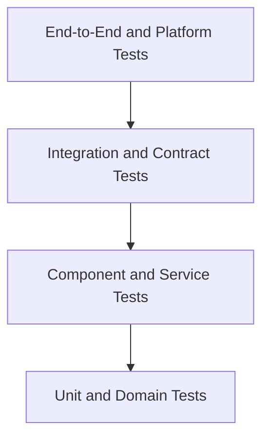

# ChannelForge Testing Specification

- **Specification version:** 0.1
- **Status:** Draft
- **Last updated:** 2026-07-27

## Purpose

This document defines the ChannelForge testing architecture.

It specifies:

- Test strategy
- Deterministic testing
- Unit testing
- Component testing
- Integration testing
- Contract testing
- End-to-end testing
- Platform testing
- Provider compatibility testing
- SQLite testing
- FFmpeg testing
- Playout testing
- Scheduling testing
- API testing
- Plugin testing
- Security testing
- Deployment testing
- Migration testing
- Backup and restore testing
- Performance testing
- Reliability testing
- Fault injection
- Test fixtures
- Test data management
- Test environments
- Continuous integration
- Release gates
- Flaky-test policy
- Coverage expectations
- Test observability
- Defect reproduction
- Long-running validation

This document defines how ChannelForge proves that its architecture behaves as
specified.

It does not define:

- Exact test framework syntax
- Exact CI vendor configuration
- Exact test file names
- Exact production monitoring thresholds
- Exact release cadence
- Exact implementation language
- Exact code coverage tool

Those choices must satisfy the requirements defined here.

## Testing Mission

ChannelForge must prove that it can build television networks deterministically,
play them reliably, survive failures, preserve state, and remain portable across
supported deployment environments.

Testing must:

- Verify domain invariants
- Verify deterministic schedule generation
- Verify persistence safety
- Verify provider isolation
- Verify stream continuity
- Verify output compatibility
- Verify security boundaries
- Verify upgrade and restore behavior
- Verify Docker and Unraid deployment
- Verify supported CPU architectures
- Detect platform-specific defects
- Produce reproducible failures
- Avoid hidden dependence on wall clock or network availability
- Separate authoritative release gates from optional compatibility tests
- Prevent flaky tests from becoming accepted noise

## Scope

Version 1 testing covers:

- Core domain
- Catalog normalization
- Scheduling
- Playout
- Output generation
- Plex integration
- Jellyfin integration
- Emby integration
- SQLite persistence
- REST API
- Authentication and authorization
- Plugin architecture
- Docker images
- Docker Compose
- Unraid template
- FFmpeg
- Hardware acceleration where infrastructure permits
- Backup and restore
- Migration from inherited Tunarr state
- Windows development behavior
- Linux production behavior
- amd64
- arm64 where officially supported

## Testing Principles

1. Determinism is tested explicitly.
2. Domain behavior is tested without infrastructure where possible.
3. Infrastructure behavior is tested against real infrastructure where needed.
4. Provider tests use fixtures and contract servers.
5. Real provider tests are supplemental, not the only verification.
6. Release gates run on Linux.
7. Windows tests remain useful but do not override Linux production truth.
8. A failing authoritative test blocks release.
9. Flaky tests are defects.
10. Test data is versioned.
11. Time is controlled.
12. Randomness is seeded.
13. Ordering is explicit.
14. External calls are mocked only at defined boundaries.
15. Failure behavior is as important as success behavior.
16. Migrations are tested with realistic prior data.
17. Backups are tested by restore.
18. Stream tests inspect actual media behavior.
19. Security tests verify absence of leakage.
20. Test results are observable and attributable.

## Test Pyramid



The largest test count should exist at the unit and component layers.

End-to-end tests should remain smaller, high-value, and stable.

## Test Layers

### Unit Tests

Unit tests verify one pure or narrowly scoped unit.

### Domain Tests

Domain tests verify aggregate behavior and invariants without persistence or
network dependencies.

### Component Tests

Component tests verify one application module with controlled dependencies.

### Integration Tests

Integration tests verify real collaboration between modules or infrastructure.

### Contract Tests

Contract tests verify one side of a stable interface.

### End-to-End Tests

End-to-end tests verify complete workflows through public interfaces.

### Platform Tests

Platform tests verify supported operating systems, architectures, containers,
filesystems, devices, and networking.

### Compatibility Tests

Compatibility tests verify external clients, providers, and inherited behavior.

### Performance Tests

Performance tests measure capacity, latency, throughput, and resource use.

### Reliability Tests

Reliability tests verify recovery, fault containment, and long-running behavior.

## Authoritative Test Environments

The authoritative production-like environment is:

- Linux container
- Supported Docker Engine
- SQLite on local supported storage
- Bundled or supported FFmpeg
- Supported Node.js runtime
- Same application build used for release

## Windows Test Role

Windows is a supported development environment.

Windows tests verify:

- Build
- Type checking
- Pure domain tests
- API component tests where platform-neutral
- PowerShell workflows
- Path handling
- Line-ending safety
- Repository scripts
- Documentation commands

Windows is not the authority for:

- Linux path semantics
- Container devices
- Linux FFmpeg hardware access
- POSIX file locking
- Unraid behavior
- Docker host networking
- Linux signal handling

## Known Windows-Specific Test Classes

Expected Windows-specific differences may include:

- Path separator assertions
- Drive-letter paths
- File-lock timing
- SQLite temporary database cleanup
- `EBUSY` behavior
- Symlink permissions
- Signal behavior
- Docker networking
- Shell command availability

A known platform difference must be documented and isolated.

It must not be hidden through broad test exclusion.

## Linux Release Authority

The Linux release suite must pass before release.

It includes:

- Build
- Type checking
- Unit tests
- Domain tests
- Component tests
- Integration tests
- SQLite tests
- API contract tests
- Security tests
- Docker image tests
- Migration tests
- Backup and restore tests
- Stream smoke tests
- Output validation

## Architecture Matrix

Supported test matrix may include:

```text
linux/amd64
linux/arm64
windows/amd64 development
```

arm64 becomes a release gate only when officially supported.

## Test Determinism

Deterministic tests produce the same result from the same inputs.

Determinism applies to:

- Schedule Plans
- Catalog normalization
- Matching
- Rule evaluation
- Candidate ordering
- Random selection
- Guide output
- M3U output
- API pagination
- Projection rebuild
- Migration result
- Plugin rule behavior
- Artifact checksums

## Sources of Nondeterminism

Common sources include:

- Wall clock
- Time zone
- Daylight-saving transition
- Random number generator
- Database row order
- Hash-map iteration
- Concurrent completion order
- External provider changes
- Network latency
- File enumeration order
- Locale
- Floating-point arithmetic
- Process IDs
- Temporary paths
- UUID generation
- Platform path separators

Tests must control or normalize these inputs.

## Controlled Clock

Application code should depend on a Clock abstraction for testable time.

Tests may set:

- Current UTC instant
- Local time zone
- Clock progression
- Clock rollback
- Clock jump
- Monotonic duration

## Time Zone Fixtures

Required time-zone cases include:

- UTC
- `America/Los_Angeles`
- `America/New_York`
- `Europe/London`
- A zone without daylight saving
- A zone with half-hour offset
- A zone with historical transition where relevant

## Daylight-Saving Tests

Tests must cover:

- Spring-forward missing local time
- Fall-back repeated local time
- Schedule horizon crossing transition
- Recurring local anchor
- Guide timestamps
- Runtime instant lookup
- Backup naming
- Token expiration

## Seeded Randomness

Schedule generation and any randomized selection use explicit seeds.

Tests record:

- Seed
- Generator version
- Rule versions
- Input snapshot
- Expected checksum

## Golden Determinism Test

A golden determinism test should:

1. Load fixed Catalog Snapshot.
2. Load fixed Programming Configuration Revision.
3. Set fixed horizon.
4. Set fixed time zone.
5. Set fixed seed.
6. Generate plan.
7. Validate plan.
8. Serialize canonical plan.
9. Compare checksum or golden fixture.
10. Repeat generation and compare exact output.

## Golden Fixture Policy

Golden fixtures are appropriate for:

- Canonical schedule serialization
- XMLTV
- M3U
- Provider normalization
- API examples
- Migration output
- Plugin manifests
- Error payloads

Golden fixtures must not hide unintended change.

Updating a golden requires review of the semantic difference.

## Canonical Serialization

Golden tests require stable serialization.

Canonicalization must define:

- Field order
- Collection order
- Timestamp precision
- Null handling
- Numeric formatting
- Newline style
- Unicode normalization

## Randomized Property Testing

Property tests may generate many valid inputs while preserving reproducibility.

Every failure records the random seed.

## Test IDs

Long-running or generated tests should emit:

- Test name
- Seed
- Fixture version
- Platform
- Application revision
- Dependency versions

## Unit Testing

Unit tests should be:

- Fast
- Isolated
- Deterministic
- Independent of network
- Independent of real clock
- Independent of filesystem where possible
- Easy to diagnose

## Unit Test Subjects

Examples:

- Value objects
- Identifier validation
- Duration arithmetic
- Time-zone conversion
- Rule evaluation
- Candidate scoring
- Tie-breaking
- Error mapping
- URL validation
- Path mapping
- Permission evaluation
- Retry classification
- Cursor encoding
- ETag generation
- Redaction
- Manifest validation

## Domain Aggregate Tests

Every aggregate should test:

- Creation
- Valid mutation
- Invalid mutation
- Version change
- Archival
- Restoration
- Immutable state
- Event emission
- Invariant protection
- Concurrency expectation

## Network Aggregate Tests

Test:

- Create Network
- Add Channel
- Remove Channel
- Activate Network Profile Revision
- Archive Network
- Restore Network
- Prevent invalid active revision
- Preserve Channel identity

## Channel Aggregate Tests

Test:

- Create Channel
- Assign channel number
- Change display name
- Change time zone
- Activate programming revision
- Publish approved plan
- Archive
- Restore
- Reject invalid publication
- Compare-and-swap publication

## Revision Tests

Test:

- Draft creation
- Draft editing
- Validation
- Approval
- Superseding
- Approved immutability
- Checksum stability
- Version conflict

## Catalog Domain Tests

Test:

- Catalog Item creation
- Source Binding association
- Playback Variant association
- Metadata provenance
- Effective metadata selection
- User override
- Merge
- Split
- Archive
- Restoration
- Availability
- Snapshot creation

## Schedule Plan Domain Tests

Test:

- Plan creation
- Entry order
- Positive durations
- No gap where continuous coverage required
- No overlap
- Carry-In
- Carry-Out
- Approval
- Rejection
- Publication eligibility
- Immutable entries
- Lineage
- Staleness

## Component Testing

Component tests verify a module through its public application interface.

Examples:

- Catalog synchronization service
- Schedule generation service
- Publication service
- Playout decision service
- Backup service
- Plugin lifecycle service
- Authentication service

## Component Test Dependencies

Use:

- In-memory fakes for stable ports
- Temporary SQLite when persistence semantics matter
- Recorded provider fixtures
- Fake clock
- Seeded random source
- Fake secret broker
- Fake file storage
- Mock FFmpeg supervisor

## Mocking Policy

Mocks should verify interaction only when interaction is the contract.

Avoid mocking every internal method.

Prefer:

- Fakes
- Test repositories
- Contract servers
- Real SQLite
- Real serialization

## Boundary Mocking

Mock at:

- External provider HTTP boundary
- FFmpeg process boundary
- Secret store boundary
- Operating-system device boundary
- Clock
- Random source
- Notification delivery
- Plugin process boundary

## Over-Mocking Risk

A test that replaces:

- Repository mapping
- Domain validation
- Serialization
- API schema
- Provider mapping

with mocks may pass while the real integration fails.

## Integration Testing

Integration tests use real implementations of multiple modules.

## Integration Test Categories

- Application plus SQLite
- Adapter plus mock provider server
- API plus application services
- Artifact generator plus managed storage
- FFmpeg supervisor plus real FFmpeg
- Plugin broker plus isolated test plugin
- Backup service plus filesystem
- Restore service plus migration
- Docker image plus health endpoint

## Temporary Database

Integration tests should use isolated temporary SQLite databases.

Each test or suite must avoid state leakage.

## SQLite Test Cleanup

Cleanup must:

- Close connections
- Release prepared statements
- Stop jobs
- Remove WAL and shared-memory files
- Retry bounded cleanup on Windows
- Report leaked handles

## SQLite File Naming

Use unique deterministic or random test paths.

The path should include:

- Test run ID
- Test suite
- Process identity where necessary

## SQLite In-Memory Mode

In-memory SQLite is useful for some tests.

It is insufficient for:

- WAL
- File locking
- Backup
- Restore
- Crash recovery
- Multi-connection behavior
- Filesystem permission
- Disk-full simulation

## SQLite Integration Matrix

Test:

- In-memory database
- Temporary file database
- WAL mode
- Non-WAL mode if supported
- Multiple readers
- Competing writers
- Busy timeout
- Foreign keys
- Migration
- Backup
- Restore
- Integrity checks

## SQLite Concurrency Tests

Required scenarios:

- Reader during writer
- Two writers
- Long reader
- Busy timeout
- Retry success
- Retry exhaustion
- Optimistic conflict
- Background synchronization versus publication
- Backup during reads
- Backup during bounded writes

## SQLite Windows Behavior

Windows integration tests should specifically test:

- Closing all connections
- Deleting database
- Deleting WAL
- Deleting shared-memory file
- Retry on `EBUSY`
- Antivirus-induced delay where reproducible

Known Windows cleanup instability must not weaken Linux release tests.

## Repository Contract Tests

Every repository implementation must satisfy a shared contract.

Contract categories:

- Create
- Read
- Update
- Archive
- Restore
- List
- Stable ordering
- Pagination
- Concurrency
- Unique constraint
- Foreign-key constraint
- Transaction rollback

## Provider Contract Testing

Built-in adapters require provider contract suites.

## Provider Test Server

A provider test server should emulate:

- Authentication
- Server identity
- Library listing
- Item listing
- Item details
- Pagination
- Artwork
- Playback info
- Errors
- Timeouts
- Rate limiting
- Version differences
- Webhooks where applicable

## Recorded Fixture Policy

Provider fixtures may be:

- Synthetic
- Sanitized recorded responses
- Hand-authored edge cases

Fixtures must contain no real credentials or personal data.

## Provider Fixture Metadata

Each fixture records:

- Provider
- Provider version
- Endpoint
- Scenario
- Sanitization version
- Fixture schema version
- Expected normalized result

## Plex Test Coverage

Plex adapter tests must cover:

- Valid token
- Invalid token
- Server identity
- Library sections
- Movie library
- TV library
- Mixed or unsupported library
- Movie metadata
- Series metadata
- Season metadata
- Episode metadata
- Media parts
- Multiple versions
- Artwork
- Provider IDs
- Missing parent
- Missing duration
- Playback URL resolution
- Direct stream
- Provider transcode
- Redirect
- Timeout
- Rate limiting
- Malformed response
- Provider version variation

## Jellyfin Test Coverage

Jellyfin adapter tests must cover:

- Valid API key or token
- Invalid credential
- Server identity
- User identity
- Virtual folders
- Movie library
- TV library
- Movie metadata
- Series hierarchy
- Media Sources
- Media Streams
- PlaybackInfo
- Artwork
- Permission changes
- Missing item
- Pagination
- Provider version variation
- Timeout
- Rate limiting
- Malformed response

## Emby Test Coverage

Emby adapter tests must cover:

- Valid token
- Invalid token
- Server identity
- User scope
- Libraries
- Movie metadata
- Series hierarchy
- Media Sources
- Media Streams
- Playback resolution
- Artwork
- Permission change
- Missing item
- Pagination
- Provider version variation
- Timeout
- Rate limiting
- Malformed response

## Provider Identity Replacement Test

Test:

1. Configure source against provider identity A.
2. Synchronize.
3. Change test server identity to B.
4. Run connection probe.
5. Verify mismatch.
6. Verify synchronization block.
7. Verify existing bindings remain attached to A.
8. Verify audit finding.

## Provider Permission Change Test

Test:

1. Synchronize visible libraries.
2. Remove provider permission.
3. Return fewer items.
4. Run incremental synchronization.
5. Verify no immediate destructive deletion.
6. Queue full reconciliation.
7. Apply grace policy.

## Provider Cursor Tests

Test:

- Initial cursor
- Next cursor
- Cursor resume
- Expired cursor
- Invalid cursor
- Adapter version change
- Full reconciliation fallback

## Real Provider Compatibility Tests

Optional controlled tests may run against real:

- Plex
- Jellyfin
- Emby

They are supplemental because:

- Versions change
- Setup is expensive
- Network may fail
- Data may vary
- Credentials are sensitive

## Real Provider Test Requirements

- Dedicated test server
- Dedicated credential
- Synthetic library
- Known media files
- Recorded provider version
- No personal data
- No production mutation
- Secret handling
- Cleanup
- Skippable outside compatibility environment

## Provider Compatibility Report

A compatibility run should report:

- Provider version
- Server platform
- Authentication mode
- Libraries
- Item count
- Playback mode
- Passed scenarios
- Failed scenarios
- Warnings
- ChannelForge revision

## Catalog Synchronization Testing

Test modes:

- Initial
- Full
- Incremental
- Targeted item
- Webhook-triggered
- Resume
- Cancellation
- Source disable
- Library exclusion
- Provider outage

## Catalog Batch Tests

Verify:

- Bounded batch size
- Transaction commit
- Checkpoint update
- Failure rollback
- Next page outside transaction
- Duplicate item idempotency
- Provenance
- Variant update
- Missing reconciliation only after completion

## Catalog Matching Tests

Test:

- Exact provider ID
- Exact qualified identity
- Title and year candidate
- Series hierarchy
- Duplicate movie
- Multiple cuts
- Ambiguous match
- User override
- Merge
- Split
- Provider ID conflict

## Catalog Golden Fixtures

Golden normalized Catalog Items should cover:

- Movie
- Series
- Season
- Episode
- Special
- Multiple versions
- Multi-part file
- Missing metadata
- Conflicting metadata
- Archived source
- Unavailable source

## Scheduling Test Architecture

Scheduling is one of the highest-risk deterministic subsystems.

## Scheduling Test Classes

- Rule unit tests
- Candidate selection tests
- Block placement tests
- Daypart tests
- Rotation tests
- Repeat-window tests
- Marathon tests
- Episode ordering tests
- Filler tests
- Alignment tests
- Regeneration tests
- Locked-entry tests
- Plan validation tests
- Determinism tests
- Scale tests

## Schedule Input Fixture

A complete schedule fixture includes:

- Catalog Snapshot
- Network Profile Revision
- Programming Configuration Revision
- Channel time zone
- Horizon
- Seed
- Generator version
- Rule versions
- Prior plan where applicable
- Locked entries
- Maintenance intervals
- Expected warnings

## Schedule Output Verification

Verify:

- Coverage
- No illegal gaps
- No illegal overlaps
- Entry sequence
- Duration conservation
- Rule evidence
- Hard-rule compliance
- Soft-rule scoring
- Repeat windows
- Episode sequence
- Block boundaries
- Daypart boundaries
- Carry-In and Carry-Out
- Guide snapshot
- Checksum

## Hard Rule Tests

A hard rule violation must:

- Exclude candidate
- Produce evidence
- Fail generation when no legal candidate exists
- Never silently become a soft penalty

## Soft Rule Tests

A soft rule must:

- Produce deterministic score
- Use fixed-point or stable arithmetic
- Produce explanation
- Respect priority and weight
- Avoid affecting hard eligibility

## Tie-Breaking Tests

Tie-breaking must be explicit.

Test:

- Equal score
- Equal duration
- Equal metadata
- Stable ID tie-break
- Seeded random tie-break where intended
- Database order changes

## Repeat Window Tests

Test:

- Exact boundary
- Just inside window
- Just outside window
- Series-level repeat
- Episode-level repeat
- Franchise-level repeat
- Historical airing input
- Regenerated range

## Episode Ordering Tests

Test:

- Air-date order
- Season and episode order
- Specials
- Missing episode number
- Multi-episode files
- User-defined order
- Restart behavior
- Skipped unavailable episode

## Block Tests

Test:

- Fixed block
- Flexible block
- Nested segment if supported
- Overrun
- Underrun
- Filler
- Boundary alignment
- Locked block
- Regeneration around block

## Daypart Tests

Test:

- Local-time daypart
- Midnight crossing
- DST transition
- Overlapping dayparts
- Missing daypart
- Priority resolution
- Weekend
- Holiday if supported

## Filler Tests

Test:

- Exact-fit filler
- Short filler
- Multiple fillers
- No filler
- Maximum filler chain
- Filler repeat
- Presentation asset
- Dead air policy

## Regeneration Tests

Test:

- Full regeneration
- Range regeneration
- Preserve locked entries
- Preserve outside range
- Carry-In continuity
- Carry-Out continuity
- Seed behavior
- Staleness
- Approval invalidation
- Lineage

## Schedule Validation Tests

Validate:

- Entry duration
- Entry order
- Timeline continuity
- Catalog availability
- Rule compliance
- Asset availability
- Guide data
- Publication eligibility
- Warning acknowledgement
- Horizon requirements

## Schedule Snapshot Tests

A Catalog Snapshot used for generation must remain immutable.

Test that later Catalog changes do not alter a previously generated plan.

## Schedule Scale Tests

Test representative sizes:

- 1 Channel, 1 day
- 1 Channel, 7 days
- 10 Channels, 7 days
- Large catalog
- Episodic-heavy catalog
- Many rules
- Long repeat history
- Large number of locked entries

## Playout Testing

Playout tests verify actual runtime behavior.

## Playout Test Layers

- Decision unit tests
- Session component tests
- FFmpeg process integration
- Stream protocol tests
- Client compatibility tests
- Long-running soak tests

## Playout Decision Tests

Test:

- Active entry lookup
- Runtime offset
- Source selection
- Variant selection
- Stream mode
- Hardware selection
- Failure penalty
- Retry
- Fallback
- Maintenance content
- No publication
- No available source

## Runtime Offset Tests

Test:

- Entry start
- Middle of entry
- Near end
- Negative offset rejection
- Offset beyond duration
- Late client join
- Server restart mid-entry
- Plan handoff

## Source Selection Tests

Test:

- Preferred local path
- Provider direct stream
- Provider direct play
- Provider transcode
- Alternate source
- Unavailable source
- Expired signed URL
- Source penalty
- Health recovery

## Shared Session Tests

Test:

- First client creates session
- Second compatible client joins
- Incompatible output creates another session
- One client disconnects
- Last client disconnects
- Session idle timeout
- Session restart
- Shared failure
- Fan-out backpressure

## Stream Continuity Tests

Measure:

- Startup latency
- Packet continuity
- Timestamp monotonicity
- Audio presence
- Video presence
- Transition between entries
- Late join
- Recovery slate
- Client disconnect
- Reconnect

## FFmpeg Test Harness

The FFmpeg harness should:

- Run real FFmpeg
- Capture exit code
- Capture bounded logs
- Probe output
- Measure duration
- Apply timeout
- Clean processes
- Clean temporary files
- Report command plan without secrets

## Synthetic Media Fixtures

Create versioned fixtures for:

- H.264/AAC MP4
- H.265/AAC
- MPEG-2 transport stream
- Variable frame rate
- Multiple audio tracks
- Subtitle tracks
- Interlaced video
- 4:3 content
- 16:9 content
- Short bumper
- Corrupt file
- Truncated file
- Multi-part content
- Unusual time base

## Media Fixture Licensing

Test media must be:

- Project-created
- Public domain
- Appropriately licensed
- Small enough for repository or artifact storage

## Media Fixture Checksums

Every media fixture has:

- Checksum
- Codec metadata
- Duration
- Resolution
- Frame rate
- Audio layout
- License

## FFprobe Verification

Use FFprobe or equivalent to verify:

- Container
- Streams
- Duration
- Codec
- Resolution
- Frame rate
- Audio
- Start time
- Packet timestamps

## Direct Stream Tests

Test:

- No unnecessary transcode
- Correct input
- Correct output container
- Runtime seek
- Multiple clients
- Client disconnect
- Source timeout

## Transcode Tests

Test:

- Software transcode
- Resolution change
- Bitrate change
- Audio transcode
- Subtitle burn-in
- Deinterlace
- Scale
- Frame-rate handling
- Runtime offset
- Entry transition

## Hardware Transcode Tests

Where infrastructure permits:

- Intel Quick Sync
- VA-API
- NVIDIA NVENC
- AMD VA-API

## Hardware Test Requirements

Record:

- Device
- Driver
- Kernel
- FFmpeg
- Encoder
- Decoder
- Concurrent sessions
- Output probe
- Fallback behavior

## Hardware Test Tiers

### Tier 1

Capability detection only.

### Tier 2

Single synthetic transcode.

### Tier 3

Multiple concurrent transcodes.

### Tier 4

Long-running soak and recovery.

## Hardware CI Limitation

Hardware acceleration may not be available in ordinary CI.

Hardware tests may run in dedicated scheduled infrastructure.

Release support claims require recent hardware validation.

## FFmpeg Failure Tests

Inject:

- Nonzero exit
- Hang
- Slow output
- Broken pipe
- Corrupt input
- Missing codec
- Hardware failure
- Disk full
- Permission denied
- Network interruption

## FFmpeg Process Cleanup Tests

Verify:

- Child exits on client disconnect
- Child exits on application shutdown
- Child exits on timeout
- No orphan process
- Pipe cleanup
- Temporary cleanup
- Hardware reservation release

## MPEG-TS Tests

Verify:

- Correct content type
- PAT and PMT presence
- Packet size
- Timestamp progression
- Stream continuity
- Channel transition
- Client late join
- Proxy pass-through

## HLS Tests

If HLS is supported, verify:

- Master playlist
- Media playlist
- Segment order
- Segment duration
- Sliding window
- Discontinuity markers
- Cleanup
- Late join
- Cache headers
- Restart behavior

## XMLTV Testing

XMLTV output must be schema- and client-compatible.

## XMLTV Tests

Verify:

- Valid XML
- Stable channel IDs
- Channel names
- Logos
- Programme start and stop
- Time-zone offset
- Titles
- Subtitles
- Descriptions
- Episode numbering
- Categories
- Ratings
- Credits where included
- Special characters
- Empty optional fields
- Large horizon
- ETag
- Last valid artifact behavior

## XMLTV Golden Tests

Golden fixtures should cover:

- Movie
- Series episode
- Special
- Unknown episode
- Multiple Channels
- DST transition
- Unicode title
- Missing artwork
- Carry-In
- Carry-Out

## XMLTV Validation Tools

Use:

- XML parser
- XMLTV-compatible validator where available
- Consumer smoke tests
- Schema checks
- Canonical diff

## M3U Testing

Verify:

- Valid header
- Channel ID
- Channel number
- Channel name
- Group title
- Logo URL
- Stream URL
- Public base URL
- Token policy
- No provider credential
- Stable ordering
- ETag
- Unicode

## HDHomeRun-Compatible Testing

Verify:

- Discovery response
- Device ID
- Base URL
- Lineup URL
- Lineup status
- Channel list
- Guide number
- Guide name
- Stream URL
- Tuner count
- Capacity error
- Stable identity
- Manual configuration
- Discovery disabled behavior

## Client Compatibility Testing

Potential clients:

- Jellyfin Live TV
- Emby Live TV
- Plex-compatible tuner workflow
- VLC
- Kodi
- IPTV clients
- Browser player where supported

## Client Compatibility Test Policy

Client tests should record:

- Client version
- Configuration
- Protocol
- Stream format
- XMLTV behavior
- Channel scan
- Startup latency
- Playback result
- Known limitations

## Jellyfin Live TV Test

End-to-end workflow:

1. Start ChannelForge.
2. Publish Channel.
3. Configure M3U or tuner.
4. Configure XMLTV.
5. Refresh guide.
6. Confirm Channel.
7. Start playback.
8. Seek or late join where supported.
9. Observe transition.
10. Verify stop.

## Emby Live TV Test

Equivalent workflow with Emby.

## Plex Compatibility Test

Test the supported Plex integration path without claiming unsupported behavior.

Record the exact supported tuner or playlist mechanism.

## API Testing

API tests must verify contract and behavior.

## API Test Layers

- Schema unit tests
- Route component tests
- Application integration tests
- OpenAPI conformance
- End-to-end workflows
- Authorization matrix

## API Contract Tests

Verify:

- Method
- Path
- Authentication
- Permission
- Request schema
- Response schema
- Status
- Headers
- Error code
- Request ID
- ETag
- Idempotency
- Pagination
- Sensitive-field omission

## OpenAPI Drift Test

CI must fail when:

- Implemented route missing from OpenAPI
- Documented route missing from implementation
- Runtime request differs from schema
- Runtime response differs from schema
- Security scheme differs
- Error response differs

## API Golden Examples

Golden examples may cover:

- Create Channel
- Concurrency conflict
- Start synchronization
- Generate schedule
- Approve plan
- Publish plan
- Read Background Job
- Authentication failure
- Permission denial
- Validation error

## Authorization Matrix Testing

For every protected command, test:

- Administrator
- Program Director
- Operator
- Read Only
- Viewer where applicable
- API token with scope
- API token without scope
- Disabled user
- Revoked session

## Idempotency Tests

Verify:

- Same key and same request
- Same key and different request
- Concurrent duplicate requests
- Successful command replay
- Accepted Background Job replay
- Failure replay policy
- Expired key
- Actor isolation

## ETag Tests

Verify:

- ETag present
- Correct If-Match
- Stale If-Match
- Missing required If-Match
- Conditional GET
- 304
- Representation variation
- Immutable artifact ETag

## Pagination Tests

Verify:

- Default order
- Next cursor
- Previous cursor where supported
- Limit
- Maximum limit
- Invalid cursor
- Filter binding
- Sort binding
- Mutation between pages
- Stable ID tie-break

## Upload Tests

Verify:

- Valid file
- Oversized file
- MIME mismatch
- Signature mismatch
- Path-like filename
- Interrupted upload
- Temporary cleanup
- Unauthorized upload
- SVG policy
- Archive bomb

## Authentication Testing

Test:

- Initial setup
- First administrator
- Login
- Logout
- Session expiration
- Session revocation
- Password change
- API token creation
- API token revocation
- Reverse-proxy authentication
- Direct bypass protection

## Security Testing

Security testing is defined in `11-security.md` and is a release gate.

## Security Test Categories

- Authentication bypass
- Authorization bypass
- CSRF
- CORS
- XSS
- SSRF
- Command injection
- SQL injection
- Path traversal
- Upload abuse
- Secret leakage
- Plugin escape
- Stream token abuse
- Webhook replay
- Backup exposure
- Reverse-proxy spoofing

## Secret Leakage Tests

Search outputs for seeded sentinel secrets.

Inject unique test values into:

- Provider token
- Plugin secret
- API token
- Session token
- Master key fixture
- Webhook secret
- Stream signing key

Verify absence from:

- Logs
- Errors
- API responses
- XMLTV
- M3U
- Support bundle
- Audit
- FFmpeg diagnostics

## Redaction Regression Test

A redaction suite should scan structured outputs for known sentinel patterns.

## Plugin Testing

Plugin testing follows `10-plugins.md`.

## Plugin Test Package Set

Maintain test plugins:

- Valid declarative plugin
- Valid isolated plugin
- Metadata plugin
- Scheduling rule plugin
- Notification plugin
- Crashing plugin
- Hanging plugin
- Permission-violating plugin
- Invalid-signature plugin
- Migration plugin
- Upgrade plugin
- Storage-quota plugin

## Plugin Lifecycle Tests

Verify:

- Upload
- Validate
- Install
- Configure
- Grant permission
- Enable
- Call contribution
- Disable
- Upgrade
- Rollback
- Quarantine
- Uninstall
- Retain state
- Purge

## Plugin Permission Tests

Verify:

- Required permission
- Optional permission
- Revocation
- Network host constraint
- Secret scope
- Storage namespace
- UI contribution
- Job execution
- Audit

## Plugin Rule Determinism

Run the same plugin rule:

- Multiple times
- Different process
- Different platform
- Different insertion order

Expected output must remain identical.

## Plugin Crash Tests

Verify:

- Core remains alive
- Plugin becomes failed
- Jobs reconcile
- Contributions unregister
- Secrets revoke
- Crash loop quarantines
- Audit records event

## Plugin Upgrade Tests

Verify:

- Same Plugin ID
- New version
- Permission increase
- Configuration migration
- State migration
- Failed migration
- Prior version preservation
- Rollback

## Persistence Testing

Persistence tests follow `08-persistence.md`.

## Migration Test Corpus

Maintain database fixtures for:

- Empty Tunarr baseline
- Small existing Tunarr instance
- Multiple Channels
- Multiple Media Sources
- Existing schedules
- Existing Plex configuration
- Existing Jellyfin configuration
- Existing Emby configuration
- Invalid legacy row
- Duplicate legacy identity
- Large catalog
- Interrupted migration state
- Prior ChannelForge schema versions

## Migration Fixture Rules

Fixtures must:

- Be versioned
- Contain no real credentials
- Use synthetic secrets
- Record source schema
- Record expected target schema
- Be checksum protected
- Remain immutable

## Migration Tests

For every migration:

- Apply to empty database
- Apply to prior fixture
- Verify schema
- Verify data
- Verify foreign keys
- Verify indexes
- Verify migration checksum
- Verify idempotent tracking
- Verify failure behavior
- Verify backup creation
- Verify restart behavior

## Migration Interruption Tests

Inject failure:

- Before transaction
- During schema change
- During backfill
- Before verification
- Before migration record
- After migration record
- During backup

Verify recovery or fail-closed behavior.

## Legacy Tunarr Migration Tests

Verify preservation of:

- Channel identity mapping
- Source configuration
- Media references
- Existing schedule intent
- Output settings
- Active Channels
- User data where applicable
- Attribution and compatibility state

## Backup Testing

A backup is valid only when it restores successfully.

## Backup Test Matrix

Test:

- Empty instance
- Configured instance
- Large catalog
- Active publication
- Plugin state
- Encrypted secrets
- Managed artwork
- Output artifacts
- Background Job history
- Audit
- WAL activity

## Backup Tests

Verify:

- Consistent SQLite copy
- WAL awareness
- Managed files
- Manifest
- Checksums
- Encryption
- Compression
- Cancellation
- Disk full
- Destination failure
- Retention
- Verification

## Restore Tests

Verify:

- Same version
- Older backup into newer version
- Newer backup into older version blocked
- Wrong passphrase
- Missing key
- Corrupt archive
- Missing managed file
- Staging
- Pre-restore backup
- Atomic activation
- Plugin compatibility
- Session invalidation
- Stream key rotation where required

## Disaster Recovery Test

A full disaster-recovery test should:

1. Create configured instance.
2. Publish Channel.
3. Create encrypted backup.
4. Destroy container and data volume.
5. Recreate deployment.
6. Supply required key.
7. Restore backup.
8. Verify users.
9. Verify Media Sources.
10. Verify Catalog.
11. Verify Schedule Plan.
12. Verify XMLTV.
13. Verify M3U.
14. Verify stream.
15. Verify plugin state.

## Deployment Testing

Deployment tests follow `12-deployment.md`.

## Docker Image Smoke Test

Test:

- Pull or load image
- Start with empty storage
- Read liveness
- Complete setup
- Read readiness
- Stop
- Restart
- Verify persistence

## Docker Image Static Tests

Verify:

- Entrypoint
- Non-root user
- Exposed ports
- Labels
- Version
- License files
- FFmpeg
- No build secrets
- No unexpected package manager
- Expected architecture

## Container Security Tests

Verify:

- No privileged requirement
- No Docker socket requirement
- Works with dropped capabilities
- Works with `no-new-privileges`
- Works with read-only root where supported
- Data volume only writable path
- Media mount read-only
- Device mapping explicit

## Compose Tests

Validate:

- YAML
- Environment
- Secret mount
- Data mount
- Temp mount
- Backup mount
- Health check
- Restart
- Network
- Hardware profiles

## Unraid Template Tests

Validate:

- XML or template format
- Repository
- Port
- Config path
- PUID
- PGID
- Web UI
- Icon
- Network mode
- GPU options
- Upgrade behavior

## Network Platform Tests

Test:

- Bridge network
- Same Docker network
- Host gateway
- LAN address
- Reverse proxy
- Host network where documented
- Custom IP where possible
- IPv4
- IPv6 where supported
- UDP discovery
- Manual tuner URL

## Reverse Proxy Tests

Test with representative proxies or a standards-compliant fixture:

- TLS termination
- Forwarded host
- Forwarded scheme
- Trusted proxy
- Untrusted proxy
- Stream buffering disabled
- Long timeout
- XMLTV compression
- M3U
- Base URL
- Direct bypass

## Filesystem Platform Tests

Test on:

- Local ext4 or equivalent
- XFS where supported
- Unraid cache-pool filesystem
- Unsupported network share warning
- Read-only media
- Permission mismatch
- Case-sensitive behavior
- Symlink behavior

## arm64 Testing

When arm64 is supported, test:

- Image build
- Native dependencies
- FFmpeg
- SQLite
- API
- Schedule generation
- Stream smoke
- Backup and restore
- Provider adapters

## Performance Testing

Performance tests measure, not merely pass.

## Performance Baselines

Maintain baselines for:

- Startup
- Catalog synchronization
- Catalog search
- Schedule generation
- Schedule Plan insert
- XMLTV generation
- M3U generation
- Direct stream startup
- Transcode startup
- API latency
- Backup
- Restore
- Migration
- Projection rebuild

## Benchmark Environment

Record:

- CPU
- Memory
- Storage
- Filesystem
- Operating system
- Architecture
- Container runtime
- FFmpeg
- Application revision
- Catalog size
- Channel count
- Stream profile

## Performance Test Data Sizes

Suggested scales:

- Small: 1,000 Catalog Items
- Medium: 25,000 Catalog Items
- Large: 100,000 Catalog Items
- Very large: defined after observed use

Exact thresholds require implementation measurement.

## Schedule Performance Cases

Test:

- One Channel, one day
- One Channel, seven days
- Ten Channels, seven days
- Large repeat history
- Many selectors
- Many hard rules
- Many soft rules
- Long episodic sequences

## Playout Performance Cases

Test:

- Direct stream
- One software transcode
- Multiple software transcodes
- One hardware transcode
- Multiple hardware transcodes
- Shared clients
- Different output profiles
- Source failover

## Performance Regression Policy

A significant regression requires:

- Investigation
- Explanation
- Baseline update only with approval
- Release-note mention when user-visible

## Load Testing

Load tests may simulate:

- API clients
- Catalog searches
- Background Job polling
- Multiple stream clients
- Webhook bursts
- Synchronization commands
- XMLTV downloads

## Soak Testing

Long-running tests should verify:

- Memory stability
- File descriptor stability
- FFmpeg cleanup
- HLS cleanup
- SQLite WAL growth
- Job queue stability
- Plugin runtime stability
- Provider reconnect
- Stream continuity
- Log growth

## Recommended Soak Durations

Potential tiers:

- 1 hour pre-merge
- 8 hours scheduled
- 24 hours release candidate
- 72 hours milestone validation

Exact durations depend on infrastructure.

## Memory Leak Detection

Measure:

- Process RSS
- Heap
- Native memory
- Child process count
- File descriptors
- Active sessions
- Cached objects

## Reliability Testing

Reliability testing verifies behavior under faults.

## Fault Injection Categories

- Provider timeout
- Provider disconnect
- Provider authentication loss
- Database busy
- Database read-only
- Disk full
- Missing file
- Corrupt file
- FFmpeg crash
- FFmpeg hang
- Hardware disappearance
- Plugin crash
- Plugin hang
- Reverse-proxy disconnect
- Client disconnect
- Container restart
- Clock jump
- DNS failure
- Backup destination failure

## Fault Injection Requirements

A fault test records:

- Fault
- Injection point
- Expected containment
- Expected health state
- Expected audit
- Recovery condition
- Data integrity result

## Provider Outage Test

Verify:

- Existing Catalog preserved
- Health degrades
- Synchronization retries bounded
- Active Schedule Plan preserved
- Runtime uses available cached or alternate source
- No unrelated source changes

## Database Busy Test

Verify:

- Busy timeout
- Bounded retry
- User-facing conflict
- No partial mutation
- Metrics
- Recovery

## Disk Full Test

Verify:

- Critical health
- New large jobs stop
- Active artifact preserved
- Database not corrupted
- Clear operator guidance
- Recovery after space restored

## FFmpeg Crash Test

Verify:

- Attempt recorded
- Recovery policy applies
- Session state updates
- No orphan process
- Hardware reservation releases
- Client behavior defined

## Container Restart Test

Restart during:

- Catalog synchronization
- Schedule generation
- Artifact generation
- Active stream
- Backup
- Plugin job
- Migration where safe fixture permits

Verify reconciliation.

## Clock Jump Test

Inject:

- Forward jump
- Backward jump
- DST transition
- Large NTP correction

Verify:

- Schedule lookup
- Token validation
- Session expiration
- Audit timestamp
- Security finding

## Chaos Testing

Broad chaos testing may be scheduled after core stability.

Chaos must not run against production user data.

## Test Fixtures

Fixtures are versioned project assets.

## Fixture Categories

- Catalog
- Provider
- Schedule
- Media
- Database
- Plugin
- API
- Security
- Deployment
- Backup
- XMLTV
- M3U

## Fixture Directory Principles

Fixtures should be:

- Discoverable
- Named by scenario
- Immutable after release use
- Small where possible
- Sanitized
- Licensed
- Checksum protected
- Documented

## Fixture Versioning

A breaking fixture change creates a new fixture version.

## Fixture Generators

Generated fixtures must be reproducible.

Record generator version and seed.

## Synthetic Catalog Generator

A synthetic catalog generator may produce:

- Movies
- Series
- Seasons
- Episodes
- Specials
- Multiple versions
- Missing metadata
- Conflicts
- Different durations
- Genres
- Ratings
- Availability

## Synthetic Provider Server

A synthetic provider server may expose selectable scenarios through fixed
configuration.

## Secret Sentinels

Security tests should use distinctive sentinel secrets.

Example categories:

- `TEST_PROVIDER_TOKEN_...`
- `TEST_PLUGIN_SECRET_...`
- `TEST_STREAM_KEY_...`

They must never resemble production credentials.

## Test Data Privacy

No real user data should enter the repository or ordinary CI artifacts.

## Sanitization

Recorded provider payloads must remove:

- Usernames
- Emails
- Tokens
- IP addresses
- Library names where sensitive
- File paths
- Device IDs where sensitive
- Viewing history

## Test Database Privacy

Migration fixtures must use synthetic data.

## Test Isolation

Tests must not share mutable state unless the suite explicitly coordinates it.

## Port Allocation

Network tests should use:

- Dynamically allocated ports
- Reserved test ranges
- Conflict detection
- Cleanup

## Process Cleanup

Every test launching a process must:

- Track process
- Apply timeout
- Terminate on failure
- Wait for exit
- Capture bounded logs
- Report leak

## File Cleanup

Every test creating files must:

- Use isolated root
- Clean on success
- Preserve on failure only when configured
- Retry bounded cleanup
- Report leftovers

## Test Timeouts

Every asynchronous test needs a timeout.

Timeout values should be:

- Long enough for expected environment
- Short enough to detect hang
- Different by test tier
- Recorded in failure output

## Retry Policy for Tests

Authoritative tests should not be retried automatically to turn failure into
success.

A retry may be used only to diagnose flakiness and must preserve the first
failure.

## Flaky Test Policy

A flaky test is one that produces inconsistent results without code change.

Flaky tests are defects.

## Flaky Test Handling

When detected:

1. Record failure evidence.
2. Create issue.
3. Identify owner.
4. Quarantine only if it blocks unrelated work.
5. Preserve a separate required signal where possible.
6. Set expiration for quarantine.
7. Fix root cause.
8. Restore to authoritative suite.

## Quarantined Test

A quarantined test:

- Still runs in a nonblocking job
- Reports failures
- Has issue reference
- Has owner
- Has expiration
- Does not count as permanent coverage

## Prohibited Flake Practices

Do not:

- Add arbitrary sleeps
- Increase timeout without analysis
- Retry until pass
- Remove assertion
- Ignore failure
- Skip entire platform broadly
- Depend on test order

## Flake Diagnostics

Capture:

- Seed
- Clock
- Platform
- CPU load
- Memory
- Port
- Temp path
- Logs
- Process list
- Database state
- Provider scenario
- Test duration

## Test Ordering

Tests must pass in:

- Declared order
- Randomized order where practical
- Isolated execution
- Parallel execution where supported

## Parallel Testing

Parallel tests must not share:

- Port
- Database
- Temp path
- Global clock
- Environment mutation
- Provider scenario
- Plugin storage

## Serial Test Classification

Tests may be serial when they require:

- Hardware device
- Host network
- Global resource
- Migration fixture mutation
- Fixed external client
- Resource-intensive soak

Serial classification must be explicit.

## Continuous Integration

CI should provide fast feedback and authoritative release confidence.

## CI Stages

Suggested stages:

1. Repository validation
2. Formatting and lint
3. Type checking
4. Unit and domain tests
5. Component tests
6. Integration tests
7. API and security tests
8. Build
9. Docker image test
10. Migration test
11. Stream smoke test
12. Platform matrix
13. Artifact publication
14. Scheduled compatibility and soak

## Pull Request Gate

A pull request gate should require:

- Formatting
- Lint
- Type check
- Unit tests
- Domain tests
- Component tests
- Selected integration tests
- API contract tests
- Security regression tests
- Build
- Documentation checks

## Main Branch Gate

Main branch should additionally run:

- Full integration
- SQLite concurrency
- Docker image smoke
- Migration fixtures
- Backup and restore smoke
- FFmpeg smoke
- Provider contract suites

## Release Candidate Gate

A release candidate should require:

- All main branch tests
- Multi-architecture image validation
- Full migration corpus
- Full backup and restore
- XMLTV validation
- M3U validation
- HDHomeRun compatibility
- Client smoke tests
- Security scan
- Dependency scan
- Image scan
- Soak test
- Upgrade and rollback rehearsal
- Release artifact verification

## Scheduled Tests

Scheduled suites may include:

- Real provider compatibility
- Hardware acceleration
- Long soak
- Large catalog
- Large schedule horizon
- Dependency updates
- Security scanning
- Fuzzing
- Backup restore drill

## CI Caching

CI may cache:

- Package dependencies
- Build output
- Test media
- Container layers

Caches must not:

- Contain secrets
- Hide missing dependency declarations
- Cross incompatible versions
- Replace lockfile verification

## CI Secrets

CI secrets are scoped to jobs that require them.

Real provider credentials should use dedicated test accounts.

## CI Artifact Retention

Retain:

- Test reports
- Failure logs
- Screenshots
- Golden diffs
- Coverage reports
- Migration diagnostics
- Support bundles
- Image digests

Sensitive artifacts require restricted access and short retention.

## Test Result Format

Use machine-readable test results where possible.

## Failure Summary

A failure summary should include:

- Test
- Layer
- Platform
- Revision
- Seed
- Duration
- Expected
- Actual
- Relevant logs
- Fixture
- Reproduction command

## Coverage

Coverage is one signal, not proof of correctness.

## Coverage Expectations

Coverage should be strongest for:

- Domain invariants
- Scheduling rules
- Security controls
- Error mapping
- Persistence repositories
- API authorization
- Migration logic

## Coverage Exclusions

Generated code and declarative schema may be excluded with justification.

## Branch Coverage

Branch coverage is more useful than line coverage for rule-heavy logic.

## Mutation Testing

Mutation testing may be used for:

- Domain invariants
- Permission evaluation
- Scheduling rules
- Redaction
- Error mapping

It is not required for all code in version 1.

## Coverage Regression

A material coverage drop requires explanation.

## Test Naming

Test names should state:

- Context
- Action
- Expected behavior

## Assertion Quality

Assertions should verify domain outcome, not only that no exception occurred.

## Snapshot Testing

Snapshot tests are useful for stable representations.

They should not be used to approve large opaque output without review.

## Error Message Assertions

Tests should prefer stable error codes over exact human message text unless text
is itself a contract.

## Test Documentation

Complex suites should document:

- Purpose
- Fixture
- Environment
- Expected runtime
- Failure interpretation
- Reproduction
- Ownership

## Reproduction Commands

Every CI suite should have a local reproduction command where practical.

## PowerShell Reproduction

Windows documentation should provide PowerShell commands.

## Linux Reproduction

Container and release documentation should provide shell commands where
appropriate.

## Test Environment Information

A test run should record:

- OS
- Architecture
- Runtime
- Package manager
- SQLite version
- FFmpeg version
- Container runtime
- Filesystem where relevant
- GPU where relevant

## Dependency Version Tests

Critical compatibility may be tested against:

- Minimum supported runtime
- Current pinned runtime
- Future candidate runtime

## Database Version

SQLite is embedded or library-provided.

The effective version must be reported.

## FFmpeg Version Matrix

Release support should define:

- Bundled version
- Optional compatible versions
- Minimum version if override allowed
- Known incompatible versions

## Browser Testing

The first-party web UI should be tested on supported browsers.

Potential baseline:

- Current Chromium
- Current Firefox
- Current Safari where infrastructure permits
- Mobile Chromium
- iPad Safari where practical

Exact browser support is defined later.

## UI Test Categories

- Authentication
- Setup
- Media Source creation
- Catalog search
- Network creation
- Channel creation
- Programming configuration
- Schedule generation
- Schedule review
- Approval
- Publication
- Runtime status
- Backup
- Plugin management
- Error states

## Accessibility Testing

Automated accessibility checks should cover:

- Labels
- Keyboard navigation
- Focus
- Contrast
- Dialogs
- Forms
- Error messages
- Tables
- Timeline controls

Manual accessibility review remains necessary.

## Visual Regression Testing

Visual regression may be used for stable key screens.

It should not block on minor platform font differences without normalization.

## End-to-End Workflow Tests

High-value end-to-end workflows include:

### Fresh Install to Live Channel

1. Start empty instance.
2. Complete setup.
3. Create administrator.
4. Add mock Media Source.
5. Synchronize.
6. Create Network.
7. Create Channel.
8. Create programming revision.
9. Generate schedule.
10. Validate.
11. Approve.
12. Publish.
13. Fetch XMLTV.
14. Fetch M3U.
15. Start stream.
16. Verify media.

### Upgrade Existing Instance

1. Start prior release fixture.
2. Configure source and Channel.
3. Publish plan.
4. Create backup.
5. Upgrade image.
6. Apply migration.
7. Verify readiness.
8. Verify source.
9. Verify plan.
10. Verify stream.
11. Verify backup.

### Provider Failure Recovery

1. Start active stream.
2. Fail preferred provider.
3. Resolve alternate source.
4. Continue or recover.
5. Restore provider.
6. Verify health recovery.
7. Preserve schedule.

### Plugin Failure Containment

1. Install test plugin.
2. Enable contribution.
3. Trigger crash.
4. Verify core remains ready.
5. Verify plugin disabled or quarantined.
6. Verify audit.
7. Verify unrelated stream.

## Defect Reproduction

Every defect fix should include a regression test when practical.

## Regression Test Requirements

A regression test should:

- Fail before fix
- Pass after fix
- Reproduce the actual boundary
- Avoid overfitting to implementation
- Include issue reference where useful

## Production Incident Tests

After an incident:

- Capture sanitized reproduction
- Add regression test
- Add failure-mode test
- Update runbook
- Update monitoring if needed

## Test Ownership

Each major subsystem has an owner responsible for:

- Suite health
- Fixture updates
- Flake triage
- Coverage
- Compatibility
- Release sign-off

## Test Review

Code review should ask:

- What behavior changed?
- What invariant is protected?
- What failure mode is tested?
- Is the test deterministic?
- Is the test at the correct layer?
- Does it use a real boundary where needed?
- Does it leak secrets?
- Does it create flake risk?
- Does it need migration coverage?
- Does it need platform coverage?

## Test Debt

Known missing coverage must be tracked explicitly.

## Test Debt Categories

- Missing provider version
- Missing hardware
- Missing platform
- Missing migration fixture
- Missing security case
- Missing performance baseline
- Missing client compatibility
- Quarantined flake

## Release Waiver

A failed authoritative test may be waived only through explicit release decision.

The waiver must include:

- Test
- Reason
- Risk
- Mitigation
- Owner
- Expiration
- Follow-up issue

## Prohibited Release Waiver

Do not waive:

- Data corruption
- Secret leakage
- Authentication bypass
- Authorization bypass
- Migration loss
- Backup restore failure
- Broken active publication
- Determinism failure
- Container startup failure on supported platform

## Release Test Report

A release test report should include:

- Revision
- Image digest
- Platforms
- Test suites
- Pass/fail
- Waivers
- Provider versions
- FFmpeg version
- Migration fixtures
- Backup restore result
- Client compatibility
- Security scan
- Known limitations

## Test Observability

Tests themselves should expose useful telemetry.

## Test Metrics

Potential metrics:

- Suite duration
- Test count
- Failure count
- Flake count
- Retry count
- Coverage
- Fixture count
- Provider compatibility age
- Hardware compatibility age
- Soak duration
- Performance regression

## Test Health Dashboard

A project dashboard may show:

- Main branch status
- Quarantined tests
- Old compatibility runs
- Coverage trend
- Performance trend
- Migration corpus status
- Release readiness

## Version 1 Required Behaviors

The version 1 testing system must:

1. Run deterministic domain tests.
2. Control clock and randomness.
3. Test schedule generation with fixed fixtures.
4. Test Catalog normalization.
5. Test Plex adapter contracts.
6. Test Jellyfin adapter contracts.
7. Test Emby adapter contracts.
8. Test SQLite repositories.
9. Test SQLite concurrency.
10. Test migrations.
11. Test backup and restore.
12. Test API contracts.
13. Test authentication and authorization.
14. Test secret redaction.
15. Test plugin lifecycle and permissions.
16. Test FFmpeg integration.
17. Test XMLTV.
18. Test M3U.
19. Test HDHomeRun-compatible output.
20. Test Docker image startup.
21. Test Docker Compose.
22. Test Unraid template validity.
23. Test graceful shutdown.
24. Test container recreation.
25. Test failure containment.
26. Run Linux release gates.
27. Maintain Windows development tests.
28. Record platform-specific exceptions.
29. Track flaky tests as defects.
30. Provide reproducible failure information.
31. Maintain migration fixtures.
32. Maintain licensed synthetic media fixtures.
33. Run performance baselines.
34. Run scheduled compatibility tests.
35. Block release on critical integrity or security failure.

## Testing Invariants

1. Identical deterministic inputs produce identical schedule output.
2. Test results do not depend on unspecified database order.
3. Every randomized failure records its seed.
4. Wall-clock time is controlled in deterministic tests.
5. Provider contract tests require no production provider account.
6. Real provider tests use dedicated synthetic libraries.
7. Test fixtures contain no real secrets.
8. Test fixtures contain no personal user data.
9. SQLite integration tests close connections before cleanup.
10. Migration tests preserve source fixtures.
11. Backup tests include restore.
12. Failed restore never activates unverified data.
13. API authorization is tested server-side.
14. Secret sentinels never appear in logs or artifacts.
15. FFmpeg tests clean child processes.
16. Stream tests inspect actual output.
17. XMLTV tests validate timestamps and stable Channel IDs.
18. M3U tests contain no provider credentials.
19. Plugin tests enforce runtime permission checks.
20. Disabled plugins receive no new calls.
21. Container recreation preserves durable state.
22. Linux release tests are authoritative for Linux production behavior.
23. Windows-specific failures are classified, not ignored.
24. Flaky tests are tracked defects.
25. Quarantined tests have owner and expiration.
26. Automatic retry does not convert a failing authoritative test into a pass.
27. Golden updates require semantic review.
28. Test data generation is reproducible.
29. Parallel tests do not share mutable resources.
30. Every asynchronous test has a timeout.
31. Every spawned process is tracked and cleaned.
32. Performance results record environment.
33. Release reports identify waivers.
34. Critical security failures cannot be waived.
35. Version 1 test architecture supports one-container deployment.

## Deferred Testing Decisions

The following decisions remain open:

- Exact unit test framework
- Exact browser test framework
- Exact property-test library
- Exact fuzzing framework
- Exact CI provider
- Exact coverage thresholds
- Exact performance regression thresholds
- Exact fixture directory structure
- Exact media fixture storage
- Exact real-provider test infrastructure
- Exact hardware test infrastructure
- Exact arm64 release gate timing
- Exact browser support matrix
- Exact accessibility tooling
- Exact visual regression tooling
- Exact mutation-testing scope
- Exact soak durations
- Exact large-catalog sizes
- Exact provider version matrix
- Exact client compatibility matrix
- Exact security scanner set
- Exact SBOM validation
- Exact release-test report format
- Exact flaky-test quarantine duration
- Exact test ownership model
- Exact release waiver process
