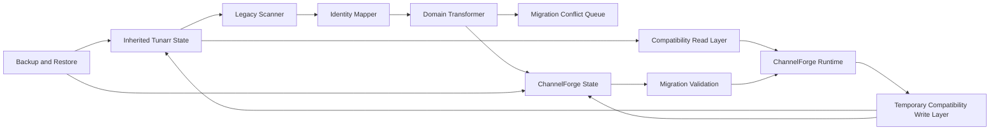

# ChannelForge Migration Specification

- **Specification version:** 0.1
- **Status:** Draft
- **Last updated:** 2026-07-27

## Purpose

This document defines the controlled migration from inherited Tunarr concepts,
data structures, workflows, and runtime behavior into the ChannelForge
architecture.

It specifies:

- Migration goals
- Legacy boundaries
- Compatibility layers
- Identity mapping
- Schema coexistence
- Data transformation
- Runtime continuity
- Incremental cutover
- Read compatibility
- Write ownership
- Validation
- Backups
- Rollback
- Operator visibility
- Conflict handling
- Migration testing
- Legacy removal
- Release sequencing
- Attribution preservation

This document governs the transition from the inherited Tunarr foundation to the
ChannelForge domain model.

It does not define:

- New ChannelForge domain semantics
- Exact physical database schema
- Exact API route shapes
- Exact deployment commands
- Exact provider adapter implementation
- Exact release dates

Those concerns are defined in the domain, persistence, API, integrations, and
deployment specifications.

## Migration Mission

ChannelForge must evolve from Tunarr without corrupting existing installations,
discarding user intent, or allowing inherited implementation details to become
permanent architectural constraints.

Migration must:

- Preserve existing user data
- Preserve working Channel output where possible
- Preserve Media Source connectivity
- Preserve existing Channel identity or map it explicitly
- Preserve schedule continuity
- Preserve existing guide compatibility
- Preserve attribution and license obligations
- Make legacy behavior observable
- Allow staged replacement
- Prevent dual-authority ambiguity
- Support rollback
- Avoid silent destructive conversion
- Provide operator-visible conflicts
- End with ChannelForge-owned domain state

## Scope

The migration covers inherited Tunarr concepts including:

- Channels
- Programs
- Custom shows
- Filler lists
- Media Source configurations
- Plex integration
- Jellyfin integration
- Emby integration
- Scheduling data
- Guide data
- Stream output
- FFmpeg settings
- HDHomeRun-compatible settings
- XMLTV settings
- M3U or IPTV settings
- Persistent identifiers
- Preferences
- Existing runtime defaults
- Existing database content
- Existing container paths
- Existing environment variables
- Existing API compatibility where retained
- Existing attribution and license notices

## Non-Goals

Migration does not guarantee exact preservation of:

- Every undocumented Tunarr internal field
- Every accidental implementation behavior
- Every invalid legacy record
- Every unsupported provider payload
- Every deprecated route
- Every UI layout
- Every temporary cache
- Every transient runtime session
- Every generated artifact
- Every plugin or unofficial modification
- Every direct database edit

Unsupported or corrupt state must be surfaced, not silently fabricated.

## Migration Principles

1. Preserve user intent before preserving implementation shape.
2. ChannelForge identities are authoritative after cutover.
3. Legacy identifiers remain mapped, not reused as canonical identities.
4. Reads may be compatible before writes are migrated.
5. Only one write owner exists for each concept at a time.
6. Dual-write is temporary and explicit.
7. Every migration is observable.
8. Every destructive step requires backup and verification.
9. Rollback strategy is defined before execution.
10. Invalid legacy state becomes a conflict.
11. Generated artifacts are replaceable.
12. Approved migrated state remains auditable.
13. Compatibility code has removal criteria.
14. Migration can pause safely.
15. Migration can resume safely.
16. Historical lineage is preserved.
17. Existing active service remains available where possible.
18. Operator decisions are never guessed.
19. Versioned migrations are deterministic.
20. Attribution remains intact.

## Migration Architecture



## Migration Terms

### Legacy State

Legacy State is any persisted or runtime state inherited from Tunarr.

### Migration Run

A Migration Run is one versioned execution of a migration plan against one
ChannelForge instance.

### Migration Phase

A Migration Phase is one ordered, restart-safe step.

### Migration Item

A Migration Item is one legacy entity or logical group being transformed.

### Identity Mapping

An Identity Mapping connects one legacy identifier to one ChannelForge
identifier.

### Compatibility Read

Compatibility Read allows ChannelForge to interpret legacy state without first
rewriting it.

### Compatibility Write

Compatibility Write temporarily mirrors or translates ChannelForge mutations
into legacy structures.

### Cutover

Cutover transfers authority from legacy state to ChannelForge state.

### Legacy Write Freeze

Legacy Write Freeze prevents new mutations through inherited paths.

### Migration Conflict

A Migration Conflict is legacy state that cannot be transformed safely without
policy or operator input.

### Migration Tombstone

A Migration Tombstone preserves the fact that a legacy entity was retired,
merged, invalid, or intentionally omitted.

### Verification Checkpoint

A Verification Checkpoint records evidence that a phase completed correctly.

### Rollback Point

A Rollback Point is a backup and version boundary from which recovery is
supported.

## Legacy Boundary

The inherited Tunarr codebase is treated as a legacy subsystem during
migration.

New ChannelForge code must not depend directly on:

- Legacy database row shapes
- Legacy scheduling assumptions
- Legacy provider payload types
- Legacy API DTOs
- Legacy identifier semantics
- Legacy UI state
- Legacy generated artifact paths
- Legacy global configuration objects

Access occurs through:

- Legacy repositories
- Compatibility adapters
- Migration services
- Explicit mapping tables

## Legacy Inventory

Before implementing migration, ChannelForge must inventory:

- Tables
- Columns
- Indexes
- Constraints
- Settings
- Environment variables
- Managed files
- Generated files
- Provider credentials
- Channel definitions
- Schedule records
- Runtime state
- API routes
- Internal identifiers
- External identifiers
- Default paths
- FFmpeg settings
- Output settings
- Version markers
- Plugin or extension state where present

## Legacy Inventory Artifact

The inventory should be versioned and stored in:

```text
docs/architecture/migration/
```

It may include:

- Schema snapshot
- Entity map
- Route map
- Settings map
- File map
- Behavior notes
- Known defects
- Unsupported customizations
- Test fixtures

## Source-of-Truth Classification

Every legacy concept must be classified as one of:

- Authoritative
- Derived
- Cache
- Runtime
- Configuration
- Secret
- Historical
- Unknown

## Authoritative Legacy State

Examples may include:

- Channel definitions
- Program assignments
- Custom show membership
- Filler list membership
- Media Source configuration
- Output settings
- User-selected schedule order
- Channel numbers
- Channel names

## Derived Legacy State

Examples may include:

- Generated XMLTV
- Generated M3U
- Search indexes
- Cached provider metadata
- Runtime progress
- Temporary transcode files

Derived state should usually be regenerated rather than migrated.

## Unknown Legacy State

Unknown state must be:

- Inventoried
- Preserved in backup
- Excluded from automatic deletion
- Flagged for review
- Avoided as a hidden dependency

## Migration Ownership Matrix

Every concept must have one authority per phase.

Example:

| Concept | Legacy Read | Legacy Write | ChannelForge Read | ChannelForge Write |
|---|---:|---:|---:|---:|
| Channel identity | Yes | Yes | Compatibility | No |
| Channel identity after cutover | Mapping only | No | Yes | Yes |
| XMLTV artifact | Optional | No | Yes | Yes |
| Provider credentials | Compatibility | No | Yes | Yes |

The matrix must be explicit for every migration phase.

## Prohibition on Ambiguous Authority

At no time may both legacy and ChannelForge stores accept independent writes for
the same concept without deterministic reconciliation.

## Migration Strategy

The recommended strategy is phased replacement:

1. Baseline and freeze architecture assumptions.
2. Inventory legacy state.
3. Add migration metadata.
4. Add ChannelForge identities.
5. Build compatibility reads.
6. Migrate low-risk configuration.
7. Migrate Media Sources.
8. Migrate Catalog identity.
9. Migrate Networks and Channels.
10. Migrate programming configuration.
11. Migrate scheduling state.
12. Migrate publication and output.
13. Switch first-party API and UI.
14. Freeze legacy writes.
15. Validate runtime continuity.
16. Remove legacy write paths.
17. Retain compatibility reads.
18. Remove obsolete legacy state in a later release.

## Migration Release Sequencing

Migration should span multiple controlled releases rather than one unreviewable
rewrite.

Potential release sequence:

- Release A: Inventory and mapping infrastructure
- Release B: Compatibility reads
- Release C: Media Source migration
- Release D: Catalog migration
- Release E: Network and Channel migration
- Release F: Scheduling migration
- Release G: Runtime and output cutover
- Release H: Legacy write removal
- Release I: Legacy read removal

Exact release boundaries may differ.

## Migration Metadata

Persistence must support:

- Migration Run
- Migration Phase
- Migration Item
- Identity Mapping
- Conflict
- Checkpoint
- Rollback Point
- Legacy version
- Target schema version
- Result
- Audit reference

## Migration Run Record

A Migration Run includes:

- `migrationRunId`
- Source application version
- Source schema version
- Target application version
- Target schema version
- Started timestamp
- Completed timestamp
- State
- Current phase
- Actor or startup context
- Backup reference
- Item counts
- Conflict counts
- Warning counts
- Error
- Resume token
- Version

## Migration States

Suggested states:

- `PLANNED`
- `PREPARING`
- `BACKING_UP`
- `SCANNING`
- `MIGRATING`
- `VALIDATING`
- `AWAITING_OPERATOR`
- `PAUSED`
- `SUCCEEDED`
- `SUCCEEDED_WITH_WARNINGS`
- `FAILED`
- `ROLLED_BACK`
- `ABANDONED`

## Migration Phase Record

A phase includes:

- Phase ID
- Migration Run ID
- Phase type
- Sequence
- State
- Started timestamp
- Completed timestamp
- Input checksum
- Output checksum
- Item counts
- Conflict counts
- Checkpoint
- Error
- Retry count

## Phase Idempotency

Re-running a completed phase with the same input must not duplicate effective
state.

## Phase Resume

A phase may resume from a committed checkpoint.

A checkpoint must not point into an uncommitted transaction.

## Migration Item Record

A Migration Item may include:

- Legacy entity type
- Legacy identifier
- ChannelForge entity type
- ChannelForge identifier
- State
- Source checksum
- Target checksum
- Conflict reference
- Warning list
- Migrated timestamp
- Verified timestamp

## Identity Mapping

Identity Mapping is central to controlled migration.

## Identity Mapping Fields

Suggested fields:

- Mapping ID
- Legacy namespace
- Legacy entity type
- Legacy ID
- ChannelForge entity type
- ChannelForge ID
- Source version
- Mapping state
- Created timestamp
- Verified timestamp
- Superseded mapping
- Conflict reference

## Legacy Namespace

The namespace distinguishes identifiers that may collide.

Examples:

- `tunarr.channel`
- `tunarr.program`
- `tunarr.custom-show`
- `tunarr.filler-list`
- `tunarr.media-source`
- `tunarr.schedule-item`

## Mapping States

Suggested states:

- `PROPOSED`
- `MAPPED`
- `VERIFIED`
- `CONFLICT`
- `MERGED`
- `SPLIT`
- `OMITTED`
- `TOMBSTONED`

## Mapping Uniqueness

The database must enforce:

- One active mapping for each qualified legacy identity
- One ChannelForge identity may map from multiple legacy identities only through
  explicit merge semantics
- One legacy identity may map to multiple ChannelForge identities only through
  explicit split semantics

## Canonical Identity

After cutover, ChannelForge ID is canonical.

Legacy ID remains available for:

- Compatibility route resolution
- Audit
- Migration diagnostics
- Historical references
- Operator support

## Legacy ID Exposure

Canonical API responses should not expose legacy IDs by default.

Authorized diagnostics may show them.

## Deterministic ID Generation

ChannelForge IDs may be:

- Newly generated and persisted
- Deterministically derived during migration with namespace and collision check

Once assigned, they must remain stable.

## Deterministic Mapping Benefits

Potential benefits:

- Repeatable migration tests
- Easier rollback comparison
- Stable fixtures

Potential risks:

- Hidden coupling
- Collision
- Provider ID leakage

The chosen strategy must be explicit.

## Mapping Verification

Verification checks:

- Legacy row exists
- Target entity exists
- Type matches
- Required fields match
- Mapping uniqueness holds
- References resolve
- No orphan mapping
- Checksum or semantic comparison passes

## Schema Coexistence

Legacy and ChannelForge schemas may coexist temporarily in one SQLite database.

## Coexistence Requirements

- Table ownership documented
- Migration tables isolated
- Foreign keys remain valid
- New code does not write legacy tables accidentally
- Legacy cleanup is deferred until rollback window closes
- Queries distinguish legacy and canonical state
- Backups include both schemas

## Table Naming

New ChannelForge tables should use consistent naming distinct enough to avoid
confusion with legacy tables.

## Compatibility Repository

A Compatibility Repository may:

- Read ChannelForge state first
- Fall back to legacy state
- Return canonical domain objects
- Materialize mapping lazily
- Record compatibility usage
- Avoid new legacy-only writes

## Read Precedence

Recommended precedence after canonical data exists:

1. ChannelForge canonical state
2. Explicit migration mapping
3. Legacy compatibility read
4. Conflict

Legacy state must not overwrite newer ChannelForge state.

## Compatibility Read Metrics

Track:

- Legacy fallback reads
- Legacy entity type
- Route or service
- Success
- Mapping creation
- Conflict
- Version

## Compatibility Read Removal Criterion

A compatibility read path may be removed when:

- No supported installation requires it
- Migration coverage is complete
- Metrics show no usage across support window
- Rollback window closed
- Fixtures remain for historical migration testing
- Release notes announce removal

## Compatibility Write

Compatibility Write is a temporary mechanism.

It may be needed when:

- Legacy runtime still consumes old tables
- New UI writes canonical state
- Output path still reads legacy structures
- Incremental cutover spans releases

## Dual-Write Requirements

If dual-write is unavoidable:

- ChannelForge command is authoritative
- One transaction or recovery protocol coordinates writes
- Both outputs are derived from one validated command
- Partial failure is detectable
- Reconciliation is available
- Metrics are recorded
- Removal date is planned

## Dual-Write Prohibitions

Do not dual-write:

- Secrets in plaintext
- Approved Schedule Plans
- Audit records through two independent systems
- Runtime URLs
- Provider payloads
- Plugin state

## Dual-Write Failure

On partial failure:

- Do not report success silently.
- Preserve authoritative ChannelForge result only if policy allows.
- Mark compatibility state degraded.
- Queue reconciliation.
- Record audit and health finding.
- Block dependent legacy runtime if inconsistent.

## Legacy Write Freeze

Before final cutover, inherited mutation paths must be disabled.

Freeze may apply to:

- Legacy API routes
- Legacy UI forms
- Legacy background jobs
- Legacy direct schedule writers
- Legacy output generators
- Legacy provider sync writers

## Freeze Enforcement

Enforcement must occur server-side.

Hiding legacy UI is insufficient.

## Freeze Error

A frozen legacy mutation returns:

- Controlled error
- Replacement route or workflow
- Request ID
- Deprecation information

## Migration Backup

Every migration run that may modify authoritative state requires a verified
backup.

## Backup Contents

Backup includes:

- SQLite database
- Legacy tables
- ChannelForge tables
- Managed files
- Plugin state
- Secret ciphertext
- Migration metadata
- Manifest
- Checksums
- Application version
- Schema version
- Master-key requirements

## Preflight

Migration preflight checks:

- Supported source version
- Supported source schema
- Database integrity
- Foreign-key status
- Disk capacity
- Backup destination
- Master key
- Managed-file consistency
- Running jobs
- Active playout
- Plugin state
- Unsupported modifications
- Existing incomplete migration
- Application version

## Unsupported Source Version

An unsupported source version must:

- Block automatic migration
- Preserve data
- Explain required intermediate upgrade
- Avoid guessing schema shape

## Database Integrity Before Migration

Migration must not proceed automatically when the source database is corrupt.

## Disk Capacity Preflight

Estimate space for:

- Backup
- New tables
- Backfill
- Indexes
- Temporary files
- Rollback copy

## Active Runtime Preflight

Migration policy must decide whether to:

- Stop streams
- Enter maintenance
- Allow read-only output
- Defer migration
- Use last valid artifacts

## Plugin Preflight

Check:

- Installed plugin compatibility
- Plugin schema state
- External modifications
- Unsupported plugin tables
- Required plugin disablement

## Migration Lock

Only one migration run may modify an instance at a time.

## Lock Scope

The lock covers:

- Schema changes
- Data backfill
- Cutover pointers
- Legacy write freeze
- Rollback activation

## Lock Recovery

An abandoned lock is reconciled through:

- Lease expiration
- Process identity
- Startup recovery
- Operator confirmation for uncertain state

## Migration Transactions

Use bounded transactions.

## Transaction Rules

- External provider calls are prohibited inside migration write transactions.
- Large backfills use batches.
- Checkpoints commit after each safe batch.
- Schema changes use transaction where SQLite permits.
- Cutover pointer changes are atomic.
- Audit and migration state update together where practical.

## External Calls

Migration should not depend on live Plex, Jellyfin, or Emby responses for basic
identity conversion.

Provider calls may be used later for verification.

## Offline Migration

A valid backup should be migratable without provider availability.

## Validation Classes

Migration validation includes:

- Structural validation
- Referential validation
- Semantic validation
- Count validation
- Checksum validation
- Runtime validation
- Output validation
- Operator validation

## Structural Validation

Checks:

- Required tables
- Required columns
- Indexes
- Foreign keys
- Migration records
- Mapping tables
- Target schema version

## Referential Validation

Checks:

- Channel references
- Program references
- Media Source references
- Schedule references
- Artifact references
- Mapping references
- Plugin references

## Semantic Validation

Checks:

- Channel number
- Channel name
- Duration
- Program ordering
- Custom show membership
- Filler membership
- Source identity
- Output settings
- Schedule horizon
- Guide identity

## Count Validation

Compare:

- Legacy Channels
- Migrated Channels
- Legacy program references
- Catalog Items
- Media Sources
- Schedule items
- Custom shows
- Filler lists
- Output profiles
- Unresolved items

Count differences require classification.

## Checksum Validation

Checksums may compare:

- Legacy normalized projection
- Target normalized projection
- Schedule sequence
- Membership list
- Settings document
- Artifact output

## Runtime Validation

After cutover:

- Application ready
- Media Sources connect
- Catalog reads
- Schedule reads
- XMLTV generates
- M3U generates
- Stream starts
- Runtime transitions
- Background Jobs run
- Backup works

## Operator Validation

Some ambiguities require operator review.

Examples:

- Duplicate Channel number
- Duplicate provider server
- Invalid path mapping
- Ambiguous program identity
- Conflicting custom show membership
- Unsupported filler behavior
- Missing secret
- Unknown output setting

## Migration Conflict Queue

Conflicts are first-class records.

## Conflict Fields

A conflict includes:

- Conflict ID
- Migration Run
- Phase
- Legacy entity
- Target entity if proposed
- Conflict type
- Severity
- Evidence
- Suggested resolutions
- Blocking state
- Created timestamp
- Resolved timestamp
- Resolved by
- Resolution
- Audit reference

## Conflict Severity

Suggested levels:

- `INFO`
- `WARNING`
- `BLOCKING`
- `CRITICAL`

## Conflict Types

Potential types:

- Duplicate identity
- Missing parent
- Missing secret
- Invalid URL
- Invalid path
- Unsupported media kind
- Ambiguous program match
- Invalid duration
- Invalid channel number
- Duplicate channel number
- Unsupported schedule mode
- Missing source
- Corrupt JSON
- Unknown enumeration
- Orphan record
- Legacy plugin data
- Output compatibility risk

## Blocking Conflict

A blocking conflict prevents cutover for the affected concept.

## Partial Migration

Migration may succeed partially only when unaffected concepts remain safe and
the partial state is explicit.

## Conflict Resolution

Resolution types may include:

- Map to existing
- Create new
- Merge
- Split
- Omit
- Repair source
- Enter replacement credential
- Configure path mapping
- Accept warning
- Defer
- Abort migration

## Automated Resolution

Automated resolution requires deterministic, documented policy.

## Manual Resolution

Manual decisions are audited and versioned.

## Conflict Preview

The UI should show:

- Legacy values
- Proposed ChannelForge values
- Dependencies
- Impact
- Reversibility
- Suggested action

## Migration of Instance Identity

Existing instance identity should be preserved where stable and useful.

If no legacy instance identity exists, ChannelForge creates one and records the
migration event.

## Migration of Users

If inherited Tunarr has user or access state:

- Preserve supported users
- Map roles
- Rehash or reset credentials where incompatible
- Invalidate legacy sessions
- Create API-token migration conflicts when secrets cannot be recovered
- Protect last administrator

If no compatible authentication exists, first startup requires secure setup.

## Session Migration

Active sessions should generally not migrate.

They are revoked at cutover.

## API Token Migration

Raw legacy API tokens should not be imported unless:

- Format is secure
- Scope can be mapped
- Hash verification remains valid
- Operator approves

Otherwise issue replacement tokens.

## Media Source Migration

Media Source migration includes:

- Provider type
- Display name
- Base address
- Credential reference
- Stable provider identity
- Library inclusion
- Path mappings
- Transcode policy
- Health state
- Sync policy

## Media Source Identity Mapping

Legacy source IDs map to ChannelForge `mediaSourceId`.

## Credential Migration

Credential values must be:

- Read through legacy secret boundary
- Encrypted into ChannelForge Secret Service
- Verified
- Redacted
- Removed from deprecated plaintext storage when rollback policy permits

## Plaintext Credential Detection

If legacy plaintext credentials exist:

- Flag security finding
- Encrypt during migration
- Do not log
- Avoid including plaintext in diagnostics
- Retain source backup securely
- Plan cleanup after rollback window

## Missing Credential

A source with missing credential may migrate as disabled.

## Provider Identity Verification

After basic migration, verify:

- Provider reachable
- Credential valid
- Stable server identity
- Library access

Provider identity mismatch creates conflict.

## Duplicate Media Sources

Duplicate sources may be:

- Merged
- Preserved separately
- Disabled
- Marked conflict

Automatic merge requires matching stable provider identity and compatible
configuration.

## Library Inclusion Migration

Existing selected libraries should remain selected.

Unknown or removed libraries become warnings.

## Path Mapping Migration

Legacy path mappings must be normalized.

Check:

- Platform style
- Prefix overlap
- Container target
- Read access
- Traversal
- Case sensitivity

## Catalog Migration

Legacy program-like records become:

- Catalog Items
- Source Bindings
- Playback Variants
- Metadata provenance
- Collections
- Custom group relationships

## Catalog Identity Strategy

Catalog migration should prefer:

1. Stable provider-qualified identity
2. Existing explicit provider ID
3. Legacy media identity
4. Deterministic provisional identity with conflict state

## Program Deduplication

Legacy duplicates must not be merged solely by title.

Merge evidence may include:

- Provider ID
- Stable external key
- File identity
- Series hierarchy
- Year
- Duration
- Existing legacy relationship

## Ambiguous Program

Ambiguous items remain separate or enter conflict queue.

## Provider-Specific Identity

Plex, Jellyfin, and Emby IDs remain qualified by Media Source.

## Playback Variant Migration

Legacy media file or stream options become Playback Variants.

Preserve:

- Provider source
- Technical metadata
- Duration
- File path or key
- Version
- Availability

Do not persist expired signed URLs as identity.

## Metadata Provenance Migration

Legacy effective values may be imported with provenance:

- Legacy Tunarr
- Provider observation
- User override
- Migration inference

Inferred fields must be marked as inferred.

## User Overrides

Explicit user choices must outrank provider refresh after migration.

## Custom Show Migration

A legacy custom show may become:

- Curated Collection
- Programming Collection
- Ordered programming source
- Template input

The exact mapping depends on semantics.

## Custom Show Identity

Preserve:

- Name
- Membership
- Order
- Duplicate allowance
- Source references
- Usage by Channels

## Custom Show Conflict

Conflicts include:

- Missing member
- Duplicate ambiguous member
- Invalid order
- Unsupported nested structure
- Unknown source

## Filler List Migration

A filler list may become:

- Filler Collection
- Presentation Asset Collection
- Programming selector source

Preserve:

- Membership
- Order where meaningful
- Weight
- Cooldown
- Duration constraints
- Channel usage

## Filler Item Migration

Filler items must map to:

- Catalog Item
- Presentation Asset
- Missing-item conflict

## Channel Migration

Legacy Channel becomes ChannelForge Channel.

Preserve:

- Channel number
- Name
- Time zone
- Guide identity
- Icon or logo
- Enabled state
- Output profile
- Schedule source
- Runtime settings

## Network Assignment

Tunarr may not have ChannelForge Network as a first-class concept.

Migration may:

- Create one default Network
- Group Channels by legacy metadata
- Prompt operator
- Use one Network per legacy grouping
- Preserve Channels under a migration-created Network

## Default Migrated Network

A default Network should have:

- Stable generated identity
- Clear name
- Migration provenance
- Draft profile revision
- Operator-editable branding

## Channel Number Conflicts

Duplicate or invalid numbers create conflict.

Automatic renumbering is prohibited unless explicit policy is selected.

## Channel Time Zone

If legacy Channel has no explicit time zone:

- Use instance configured zone
- Record inferred provenance
- Require review where schedule semantics may change

## Channel Logo Migration

Logo files should be:

- Copied into managed storage
- MIME validated
- Checksum calculated
- Mapped to Channel
- Regenerated from provider only when missing

## Channel Lifecycle

Legacy disabled state maps to Channel lifecycle or output state.

## Programming Configuration Migration

Legacy scheduling configuration becomes a ChannelForge Programming
Configuration Revision.

## Draft Versus Approved

Migrated configuration should initially be:

- Approved automatically only when verified and policy allows, or
- Draft requiring operator review

The migration policy must state which.

## Programming Revision Provenance

Record:

- Legacy source
- Legacy version
- Migration version
- Transformation notes
- Warnings
- Input checksum

## Legacy Scheduling Concepts

Potential inherited concepts include:

- Program sequence
- Flex
- Filler
- Redirect
- Custom shows
- Time slots
- Randomization
- Repeat handling
- Padding
- Offline content

Each must map explicitly.

## Unsupported Scheduling Behavior

Unsupported behavior becomes:

- Blocking conflict
- Compatibility rule
- Transitional legacy scheduler mode
- Documented semantic change

## Legacy Scheduler Compatibility Mode

A temporary compatibility scheduler may reproduce inherited behavior.

Requirements:

- Isolated extension
- Explicit mode
- Versioned
- Tested
- No new feature dependence
- Removal plan

## Schedule Migration

Existing generated schedules may be:

- Imported as immutable legacy Schedule Plans
- Used only for short continuity horizon
- Discarded and regenerated
- Preserved as historical artifacts

## Schedule Import Criteria

Import only when legacy records provide enough information for:

- Entry identity
- Start and end
- Program reference
- Channel
- Ordering
- Runtime offset semantics

## Legacy Plan Status

Imported plans should be marked with:

- Legacy origin
- Migration version
- Validation status
- Approval status
- Publication eligibility
- Known limitations

## Schedule Regeneration

A fresh ChannelForge plan should be generated after programming configuration
migration.

## Continuity Window

To avoid service interruption, migration may preserve a short legacy schedule
window while new plans are generated.

## Carry-In

If cutover occurs mid-program:

- Preserve current airing
- Calculate runtime offset
- Create Carry-In entry or runtime bridge
- Avoid restarting content unnecessarily where possible

## Carry-Out

A legacy plan ending after the cutover horizon may produce a Carry-Out boundary
for the new plan.

## Schedule Approval

Migrated legacy schedules should not be treated as fully approved without
validation.

Possible states:

- `LEGACY_IMPORTED`
- `VALIDATED`
- `APPROVED_FOR_CONTINUITY`
- `SUPERSEDED`

## Publication Migration

Active legacy Channel output must map to ChannelForge publication state.

## Active Publication Mapping

Create:

- Schedule Publication
- Active Channel pointer
- Artifact references
- Runtime handoff state
- Migration audit

## Publication Cutover

Cutover should be atomic per Channel or per controlled group.

## Per-Channel Cutover

Advantages:

- Lower blast radius
- Easier rollback
- Progressive validation

Risks:

- Mixed runtime modes
- More compatibility complexity

## All-at-Once Cutover

Advantages:

- Simpler authority
- Shorter coexistence

Risks:

- Larger outage
- Larger rollback scope

Version 1 should prefer staged per-Channel cutover where architecture supports
it.

## Output Migration

Output migration covers:

- XMLTV
- M3U
- HDHomeRun-compatible identity
- Stream URLs
- Channel logos
- Tuner count
- Public base URL
- Access tokens
- Output profile

## XMLTV Migration

Preserve:

- Stable Channel IDs where clients depend on them
- Channel numbers
- Guide names
- Programme continuity
- Time-zone semantics

## XMLTV Identity Compatibility

A mapping may retain legacy XMLTV channel identifiers as aliases.

Canonical ChannelForge IDs should be introduced without breaking existing
clients where possible.

## M3U Migration

Preserve:

- Channel order
- Channel number
- Channel name
- Group
- Logo
- Stream reachability

Provider credentials must not be copied into output.

## Stream URL Migration

Compatibility redirects may preserve old stream URLs.

They should:

- Resolve legacy Channel ID through mapping
- Enforce current access policy
- Emit deprecation metadata where possible
- Avoid provider credential exposure

## HDHomeRun Device Identity

Changing device identity may force client reconfiguration.

Migration should preserve legacy device identity where safe and valid.

## Tuner Count Migration

Existing tuner count should be preserved subject to resource validation.

## Output Profile Migration

Map:

- Container
- Codec
- Resolution
- Bit rate
- Audio
- Hardware preference
- Transcode policy
- Direct stream policy

Unsupported settings create warnings or conflicts.

## FFmpeg Configuration Migration

Preserve safe typed settings.

Do not import arbitrary command fragments automatically.

## Unsafe FFmpeg Arguments

Legacy arbitrary FFmpeg arguments must be:

- Parsed
- Classified
- Rejected if unsafe
- Replaced with typed configuration
- Shown to operator

## Managed File Migration

Managed files may include:

- Logos
- Bumpers
- Offline slates
- Custom artwork
- Generated XMLTV
- Generated M3U
- Plugin packages
- Backups

## File Migration Workflow

1. Inventory file.
2. Classify authoritative or derived.
3. Validate path.
4. Validate MIME.
5. Calculate checksum.
6. Copy to managed storage.
7. Create metadata.
8. Verify.
9. Preserve legacy file until rollback window closes.

## Missing File

A missing authoritative file creates conflict.

A missing derived file is regenerated.

## File Path Changes

Container path changes require mapping or copy.

## Secrets Migration

Secrets migration includes:

- Provider tokens
- API tokens
- Webhook secrets
- Stream tokens
- Plugin secrets
- Backup credentials

## Secret Re-encryption

Legacy encrypted secrets may need decryption and re-encryption.

Requirements:

- Old key available
- New key available
- No plaintext persistence
- Bounded memory lifetime
- Verification
- Audit metadata without value

## Unrecoverable Secret

If the old format cannot be decrypted:

- Migrate resource disabled
- Require secret reentry
- Preserve metadata
- Do not fabricate a value

## API Migration

Legacy API routes may remain through compatibility aliases.

## API Compatibility Categories

- Exact compatible
- Translated compatible
- Deprecated
- Read-only
- Removed
- Unsupported

## Compatibility Route Requirements

- Authentication preserved or strengthened
- Legacy IDs resolved through mapping
- Canonical services invoked
- Structured deprecation
- No direct legacy writes after freeze
- Metrics
- Removal plan

## Legacy API Write Translation

A legacy mutation route may translate into a ChannelForge command.

It must not bypass:

- Validation
- Authorization
- Concurrency
- Audit
- Revision semantics

## Legacy Response Shape

Compatibility routes may return legacy response shapes.

Canonical API remains ChannelForge v1.

## First-Party UI Migration

The first-party UI should move to ChannelForge API before legacy API removal.

## UI Cutover

UI cutover should be feature-based:

- Media Sources
- Catalog
- Networks
- Channels
- Scheduling
- Publication
- Runtime
- Backups
- Plugins

## Hidden Legacy Dependency

Instrumentation should detect UI calls to legacy routes.

## Environment Variable Migration

Existing environment variables may be:

- Retained
- Aliased
- Deprecated
- Removed

## Environment Alias

An alias maps legacy variable to canonical setting.

Rules:

- Canonical variable wins when both set
- Conflict warning
- Deprecation log
- No secret value in log
- Removal version documented

## Container Path Migration

Legacy volume paths must be mapped to ChannelForge paths.

## Path Compatibility

Options:

- Continue supporting legacy path
- Detect and migrate
- Mount both temporarily
- Require operator change

## Data Directory Detection

Startup may detect legacy database in known path.

It must not migrate arbitrary files found elsewhere without explicit
configuration.

## Unraid Template Migration

Unraid template updates should preserve:

- Appdata path
- Port mapping
- PUID
- PGID
- Network mode
- GPU device
- Existing variables

## Compose Migration

Compose documentation should show:

- Image name change
- Volume continuity
- Environment aliases
- Port continuity
- Master key mount
- Backup step

## Application Name Change

The transition from Tunarr branding to ChannelForge must not imply data
incompatibility.

## Attribution

Attribution requirements include:

- Preserve zlib license
- Preserve Tunarr notice
- Preserve source history
- Preserve repository history
- Document inherited runtime foundation
- Avoid implying clean-room origin

## License Files

Required files remain in the repository and release image.

## Database Attribution

No license text needs to be embedded in every migrated row.

Migration documentation should identify the inherited source.

## Migration Audit

Audit records are required for:

- Migration start
- Backup creation
- Phase completion
- Conflict creation
- Conflict resolution
- Credential migration
- Legacy write freeze
- Channel cutover
- Runtime cutover
- Rollback
- Legacy table removal
- Compatibility route removal

## Migration Logs

Logs include:

- Migration Run ID
- Phase
- Item type
- Counts
- Duration
- Checkpoint
- Warning
- Error code
- Request or startup context

Logs must not include secret values.

## Migration Metrics

Suggested metrics:

- Items scanned
- Items migrated
- Items skipped
- Conflicts
- Warnings
- Phase duration
- Batch duration
- Legacy fallback reads
- Legacy writes
- Cutover Channels
- Rollbacks
- Validation failures
- Remaining legacy entities

## Migration Dashboard

The UI should show:

- Current phase
- Progress
- Backup
- Conflicts
- Warnings
- Estimated work remaining where defensible
- Cutover status
- Rollback availability
- Legacy dependency count

## Migration Health

Suggested states:

- `NOT_REQUIRED`
- `READY`
- `IN_PROGRESS`
- `PAUSED`
- `AWAITING_OPERATOR`
- `DEGRADED`
- `FAILED`
- `COMPLETE`
- `ROLLBACK_AVAILABLE`

## Background Jobs

Long migration work uses Background Jobs.

## Job Types

Potential jobs:

- Legacy inventory
- Identity mapping
- Media Source migration
- Catalog migration
- Custom show migration
- Filler migration
- Channel migration
- Programming migration
- Schedule import
- Output migration
- Validation
- Legacy cleanup

## Job Priority

Migration jobs should not starve active playout.

## Migration and Playout

Possible operational modes:

- Online migration with active playout
- Read-only output during migration
- Maintenance cutover
- Full maintenance

Each phase declares required mode.

## Online-Safe Phases

Examples:

- Inventory
- Mapping table creation
- Compatibility reads
- Catalog backfill
- File checksum scan

## Maintenance-Required Phases

Examples:

- Schema cutover
- Legacy write freeze
- Publication pointer switch
- Secret format replacement
- Destructive cleanup
- Restore rollback

## Pause

An operator may pause migration at safe checkpoints.

## Cancellation

Cancellation is not always equivalent to rollback.

A phase declares:

- Cancellable
- Pause only
- Rollback required
- Noninterruptible bounded step

## Migration Rollback

Rollback returns to a supported prior state.

## Rollback Levels

- Phase rollback
- Channel cutover rollback
- Compatibility-mode rollback
- Full backup restore

## Phase Rollback

Possible when:

- Phase is reversible
- Prior data retained
- No later dependent phase completed
- State migration supports reverse transform

## Cutover Rollback

A Channel may return to legacy runtime when:

- Legacy state remains current enough
- Compatibility writes succeeded
- Legacy runtime remains installed
- Output identity remains valid

## Full Rollback

Full rollback uses pre-migration backup and prior application image.

## Rollback Preconditions

- Backup verified
- Prior image available
- Master key available
- Plugin compatibility known
- Operator authorized
- Current state preserved for diagnosis

## Rollback Data Loss

Rollback may discard ChannelForge changes made after backup.

The UI must show that impact.

## Rollback Audit

Rollback records:

- Reason
- Actor
- Source version
- Target version
- Backup
- Discarded change window
- Result

## Roll-Forward

After fixing a failed migration, the preferred recovery may be roll-forward from
preserved source state.

## Migration Failure

Failure handling:

- Stop affected phase.
- Roll back current transaction.
- Preserve checkpoint.
- Preserve backup.
- Mark migration unready or paused.
- Keep unaffected output operational where safe.
- Record conflict or error.
- Avoid repeated automatic destructive retries.

## Failure Categories

- Unsupported source schema
- Corrupt source data
- Constraint violation
- Disk full
- Permission failure
- Missing key
- Missing file
- Provider credential failure
- Identity conflict
- Plugin incompatibility
- Output validation failure
- Runtime handoff failure
- Migration code defect

## Retryable Failure

Retryable examples:

- Temporary disk mount issue
- Database busy
- Provider verification timeout
- Temporary file lock
- Background Job interruption

## Non-Retryable Failure

Examples:

- Unsupported schema
- Corrupt required row
- Invalid secret format
- Duplicate canonical identity without policy
- Missing required migration code
- Checksum mismatch

## Migration Repair

A repair tool may:

- Re-run validation
- Rebuild mapping
- Reconcile dual-write
- Re-copy managed file
- Reset safe checkpoint
- Resolve orphan
- Re-enter secret
- Re-run artifact generation

It must not perform undocumented SQL edits.

## Direct Database Editing

Direct database edits are unsupported as a normal migration workflow.

## Repair Audit

Every repair is audited.

## Legacy Cleanup

Legacy cleanup begins only after:

- Canonical cutover
- Runtime validation
- Backup verification
- Rollback window closure
- Compatibility metrics near zero
- Release support decision

## Cleanup Stages

1. Disable legacy writes.
2. Remove legacy background jobs.
3. Remove legacy UI.
4. Deprecate legacy API.
5. Remove legacy API writes.
6. Remove legacy API reads.
7. Archive legacy tables.
8. Remove obsolete tables in later migration.
9. Remove compatibility code.
10. Retain migration fixtures and documentation.

## Archive Legacy Tables

Before deletion, legacy tables may be:

- Renamed
- Copied to migration archive
- Exported
- Left read-only
- Included in backup

## Legacy Table Removal

Removal requires:

- Explicit migration
- Pre-removal backup
- Verification
- Release note
- No supported rollback dependency
- No compatibility read dependency

## Legacy Column Removal

The same criteria apply to columns.

## Compatibility Code Removal

Removal requires:

- No supported installation depends on it
- Metrics confirm no usage
- Migration fixtures remain
- Documentation updated
- API deprecation completed
- Tests removed or converted deliberately

## Legacy Test Retention

Historical migration tests remain even after runtime compatibility removal.

## Data Retention

Migration metadata should be long-lived.

## Migration Conflict Retention

Resolved conflicts remain for audit.

## Legacy Mapping Retention

Identity mappings remain indefinitely or until all historical references can be
resolved safely.

## Migration Tombstones

Tombstones preserve omitted or retired legacy identities.

## Migration Support Window

The project should define how many prior versions can upgrade directly.

## Intermediate Upgrades

Older installations may require stepping through intermediate releases.

## Unsupported Direct Upgrade

The application must detect and explain the required path.

## Release Notes

Every migration release should document:

- Source versions supported
- Target version
- Backup requirement
- Downtime
- Expected duration
- Disk space
- Plugin impact
- Output impact
- Rollback
- Known conflicts
- Deprecated settings
- Removed routes

## Migration Documentation

Operator documentation should include:

- Preparation
- Backup
- Upgrade
- Conflict resolution
- Validation
- Rollback
- Support bundle
- Recovery

## Support Bundle

Migration support bundle may include:

- Application version
- Source schema version
- Target schema version
- Migration Run
- Phase status
- Counts
- Conflicts
- Warnings
- Redacted logs
- Mapping summary
- Integrity results
- Plugin compatibility
- Output validation

## Support Bundle Exclusions

Exclude:

- Provider tokens
- Passwords
- API tokens
- Master key
- Signed URLs
- Raw secret fields
- Personal provider data

## Security

Migration has elevated access to historical data and secrets.

## Security Requirements

- Administrator authorization
- Reauthentication for manual migration
- Secret redaction
- Backup protection
- Key availability
- Plugin disablement where required
- No provider credential logging
- No arbitrary migration scripts from user input
- Signed release migration code
- Audit

## Migration Code Trust

Only migration code shipped with the ChannelForge release may modify core
schema automatically.

## Plugin Migrations

Plugin migrations remain scoped to plugin state.

They do not modify core legacy tables directly.

## Imported Migration Scripts

Arbitrary user-supplied SQL migration scripts are prohibited.

## Privacy

Migration should not increase retained personal data.

## Data Minimization

Do not copy:

- Unused legacy sessions
- Temporary client addresses
- Obsolete logs
- Expired signed URLs
- Provider response caches not needed for correctness

unless required for audit or rollback.

## Migration Testing Strategy

Migration testing is a release gate.

## Test Corpus

Maintain fixtures for:

- Empty Tunarr baseline
- One Channel
- Multiple Channels
- Plex source
- Jellyfin source
- Emby source
- Mixed sources
- Custom shows
- Filler lists
- Existing schedule
- Existing XMLTV settings
- Existing HDHomeRun settings
- Existing FFmpeg settings
- Invalid row
- Duplicate identity
- Missing source
- Missing file
- Missing credential
- Large library
- Interrupted migration
- Prior ChannelForge migration state

## Fixture Requirements

Fixtures must:

- Be versioned
- Be immutable
- Use synthetic data
- Contain no real secrets
- Record source application version
- Record source schema version
- Record expected target state
- Include checksums

## Migration Unit Tests

Test:

- Legacy parser
- Mapping
- Field conversion
- Enumeration conversion
- Duration conversion
- Time-zone inference
- Conflict classification
- Checksum
- Resume token
- Environment alias
- Path mapping

## Migration Integration Tests

Test:

- Real SQLite source fixture
- New schema creation
- Batch migration
- Mapping persistence
- Conflict persistence
- Validation
- Backup
- Resume
- Rollback
- Cleanup

## End-to-End Migration Test

1. Start prior Tunarr-compatible fixture.
2. Verify legacy Channel output.
3. Create backup.
4. Upgrade to ChannelForge migration release.
5. Run migration.
6. Resolve expected conflicts.
7. Verify Media Sources.
8. Verify Catalog.
9. Verify Channels.
10. Generate new Plan.
11. Publish.
12. Verify XMLTV.
13. Verify M3U.
14. Verify stream.
15. Restart container.
16. Verify state.
17. Roll back in a separate test.
18. Verify prior image and backup.

## Migration Idempotency Tests

Run each phase:

- Once
- Twice
- After interruption
- After restart
- After partial conflict resolution

Expected effective state remains singular and correct.

## Migration Determinism Tests

Given identical source fixture and migration version, output mappings and
canonical state must match.

## Migration Performance Tests

Measure:

- Inventory scan
- Catalog migration
- Mapping insert
- File migration
- Index creation
- Validation
- Backup
- Total downtime
- Peak disk use
- Peak memory

## Large Fixture Tests

Test:

- Large catalog
- Many Channels
- Many schedule items
- Many custom shows
- Many filler items
- Multiple providers
- Large artwork set

## Failure Injection Tests

Inject:

- Crash after backup
- Crash during mapping
- Crash during batch
- Crash before checkpoint
- Crash after checkpoint
- Disk full
- Permission failure
- Database busy
- Missing key
- Corrupt file
- Invalid provider identity
- Output generation failure
- Runtime cutover failure

## Rollback Tests

Verify:

- Phase rollback
- Cutover rollback
- Full restore
- Prior image startup
- Secret availability
- Plugin state
- Output continuity
- Audit

## Compatibility Route Tests

Verify:

- Legacy ID resolution
- Read translation
- Write translation before freeze
- Write rejection after freeze
- Authentication
- Authorization
- Deprecation
- No direct legacy writes
- Metrics

## Environment Migration Tests

Verify:

- Legacy variable only
- Canonical variable only
- Both same
- Both conflicting
- Secret variable redaction
- Removed variable
- Invalid value

## Unraid Migration Tests

Verify:

- Existing appdata path
- Existing port
- Existing PUID and PGID
- Network mode
- GPU mapping
- Template update
- Container recreation
- Backup

## Compose Migration Tests

Verify:

- Old image to new image
- Same volume
- New secret mount
- Environment aliases
- Port continuity
- Health
- Rollback

## Property Tests

Useful properties:

- A legacy identity maps to one canonical identity unless an explicit split is
  recorded.
- Re-running a completed phase does not duplicate canonical state.
- Failed migration does not delete source state.
- Migration does not log plaintext secrets.
- Legacy provider IDs remain qualified by Media Source.
- User overrides remain stronger than provider refresh.
- Channel numbers do not change without explicit conflict resolution.
- Approved migrated state is immutable after approval.
- Legacy writes are rejected after freeze.
- Compatibility reads never overwrite newer canonical state.
- Failed output migration preserves prior valid artifacts.
- Rollback uses verified backup.
- Cleanup never runs before rollback criteria are satisfied.
- Attribution files remain present after migration.
- Imported Schedule Plans record legacy provenance.

## Migration Observability Tests

Verify:

- Progress
- Counts
- Conflict visibility
- Logs
- Metrics
- Health
- Audit
- Support bundle
- No secret leakage

## Release Gate

A migration release cannot ship when:

- Source fixture loses authoritative data
- Identity mappings are unstable
- Migration is not restart-safe
- Backup restore fails
- Rollback fails for supported path
- Secrets leak
- Channel output cannot be validated
- Unsupported schema is silently accepted
- Legacy writes remain ambiguous
- Required attribution is missing

## Reference Media Source Migration

Assume:

- One legacy Jellyfin server
- Stable server ID
- API token stored in legacy configuration
- Two selected libraries
- One path mapping
- Existing Channel references its programs

Expected behavior:

- Create one ChannelForge Media Source.
- Encrypt token through Secret Service.
- Create identity mapping.
- Preserve selected libraries.
- Normalize path mapping.
- Create Source Bindings for migrated programs.
- Verify provider identity.
- Preserve Channel references through Catalog mapping.
- Remove plaintext legacy credential only after rollback policy permits.

## Reference Duplicate Channel Number Conflict

Assume:

- Two legacy Channels both use number `101`.
- ChannelForge requires uniqueness.

Expected behavior:

- Migrate both Channel identities into proposed state.
- Create blocking conflict.
- Do not silently renumber.
- Show names and IDs.
- Operator selects new number or archives one Channel.
- Record resolution.
- Continue cutover only after uniqueness holds.

## Reference Missing Credential

Assume:

- Legacy Plex source exists.
- Credential value is missing.
- Channel references Plex content.

Expected behavior:

- Create disabled Media Source with migration provenance.
- Preserve Catalog identity where possible.
- Create blocking or high-severity conflict.
- Require credential reentry.
- Do not delete Channel.
- Do not fabricate token.
- Existing plan remains visible but source availability is degraded.

## Reference Mid-Program Cutover

Assume:

- A Channel is currently 18 minutes into a 42-minute episode.
- Legacy runtime is active.
- New ChannelForge publication is ready.

Expected behavior:

- Determine current program mapping.
- Create or select Carry-In semantics.
- Start ChannelForge runtime at equivalent offset.
- Preserve guide identity.
- Record handoff.
- Stop legacy runtime after successful start.
- Fall back to legacy runtime if new start fails and rollback is still safe.

## Reference Failed Catalog Batch

Assume:

- Catalog migration processes 500 items per batch.
- Batch 12 contains a constraint violation.

Expected behavior:

- Batch 12 transaction rolls back.
- Batches 1 through 11 remain committed.
- Checkpoint remains at batch 11.
- Conflict or error identifies the failing source item.
- Migration pauses.
- Resume restarts at batch 12 after repair.
- No duplicate Catalog Items are created.

## Reference Legacy API Call After Freeze

Assume:

- A client calls a legacy Channel update route after cutover.

Expected behavior:

- Server rejects the legacy mutation.
- Response identifies deprecation and replacement route.
- No legacy or canonical state changes.
- Request is counted in compatibility metrics.
- Audit or operational log records the attempt according to policy.

## Reference Full Rollback

Assume:

- Scheduling migration succeeds.
- Runtime cutover fails across several Channels.
- Operator chooses full rollback.

Expected behavior:

- Enter maintenance.
- Preserve failed migrated data for diagnosis.
- Restore verified pre-migration backup.
- Start prior supported image.
- Verify legacy Channels and outputs.
- Record rollback reason and result.
- Do not reuse partially migrated database as authoritative.

## Version 1 Required Behaviors

The version 1 migration subsystem must:

1. Inventory inherited Tunarr state.
2. Classify authoritative and derived data.
3. Create verified pre-migration backups.
4. Support versioned Migration Runs.
5. Support restart-safe phases.
6. Persist checkpoints.
7. Persist identity mappings.
8. Preserve legacy IDs for compatibility.
9. Create ChannelForge-owned canonical IDs.
10. Support schema coexistence.
11. Support compatibility reads.
12. Avoid ambiguous dual authority.
13. Limit dual-write to explicit temporary paths.
14. Support legacy write freeze.
15. Migrate Media Sources.
16. Encrypt migrated credentials.
17. Migrate Catalog identity.
18. Migrate custom shows and filler semantics.
19. Migrate Channels.
20. Create or map Networks.
21. Migrate programming configuration.
22. Preserve schedule continuity where possible.
23. Generate fresh ChannelForge Schedule Plans.
24. Preserve XMLTV and M3U compatibility where possible.
25. Preserve HDHomeRun-compatible identity where safe.
26. Support operator conflict resolution.
27. Validate migrated state.
28. Support rollback.
29. Preserve attribution.
30. Remove legacy write paths only after verified cutover.
31. Retain migration fixtures.
32. Expose migration progress and health.
33. Audit privileged migration actions.
34. Avoid secret leakage.
35. Remain operable in one Docker container.

## Migration Invariants

1. Source state is backed up before destructive migration.
2. Legacy state is never silently discarded.
3. Every legacy identity has at most one active mapping unless explicit split is
   recorded.
4. Every canonical merge is explicit.
5. ChannelForge IDs are authoritative after cutover.
6. Legacy IDs remain resolvable during the compatibility window.
7. Re-running a phase does not duplicate effective state.
8. Checkpoints refer only to committed work.
9. External provider calls do not occur inside migration write transactions.
10. Partial batch failure does not corrupt prior committed batches.
11. User intent outranks implementation convenience.
12. User overrides survive provider resynchronization.
13. Channel numbers do not change silently.
14. Provider identifiers remain qualified by Media Source.
15. Credentials are not migrated into plaintext storage.
16. Unrecoverable credentials require reentry.
17. Derived artifacts may be regenerated.
18. Missing authoritative files create conflicts.
19. Legacy writes stop before final authority cutover.
20. Compatibility reads do not overwrite canonical state.
21. Approved migrated revisions are immutable.
22. Imported legacy Schedule Plans record provenance.
23. Failed artifact generation preserves prior valid artifacts.
24. Runtime cutover is reversible while rollback criteria remain valid.
25. Cleanup does not run before rollback window closes.
26. Unsupported source schema blocks automatic migration.
27. Corrupt source database blocks automatic migration.
28. Migration conflicts are persisted and auditable.
29. Manual resolutions are never inferred silently.
30. Rollback activates only verified backup state.
31. Compatibility code has explicit removal criteria.
32. Legacy table removal requires a separate migration.
33. Attribution and license files remain present.
34. Migration logs exclude secrets.
35. Version 1 migration remains deterministic for fixed input.

## Deferred Migration Decisions

The following decisions remain open:

- Exact Tunarr schema inventory
- Exact migration phase boundaries
- Exact ChannelForge ID generation strategy
- Exact legacy table naming
- Exact compatibility repository implementation
- Exact dual-write requirements
- Exact cutover granularity
- Exact default Network creation policy
- Exact custom show mapping
- Exact filler list mapping
- Exact legacy scheduler compatibility mode
- Exact imported Schedule Plan approval state
- Exact XMLTV alias retention
- Exact legacy stream URL retention
- Exact HDHomeRun device ID retention
- Exact unsafe FFmpeg argument handling
- Exact environment variable alias list
- Exact container path migration
- Exact Unraid template migration flow
- Exact rollback support window
- Exact number of directly supported source versions
- Exact legacy table archival format
- Exact compatibility route removal version
- Exact migration dashboard design
- Exact conflict-resolution UI
- Exact migration support-bundle format
- Exact milestone for removing legacy reads
