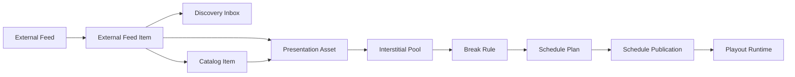

# ChannelForge Interstitial Programming and External Video Feeds Specification

- **Specification version:** 0.1
- **Status:** Draft
- **Last updated:** 2026-07-27
- **Related ADR:** `docs/architecture/adr/0002-interstitial-programming-and-external-video-feeds.md`

## Purpose

This document defines ChannelForge architecture for:

- Bumpers
- Commercials
- Promos
- Station identifications
- Public-service announcements
- Trailers
- Technical slates
- Short filler
- Network continuity material
- Externally published video metadata
- YouTube Channel and playlist discovery
- RSS and Atom video feeds
- Discovery Inbox workflows
- Feed-to-Catalog matching
- Deterministic interstitial scheduling
- Rights and playability policy
- Runtime availability and fallback

The two primary capabilities are:

1. **Interstitial Programming**
2. **External Video Feeds**

They share Catalog, scheduling, publication, playout, API, security, and
observability boundaries.

They remain separate domain concepts.
## Architecture Mission

- Make bumps, commercials, promos, IDs, slates, and similar continuity material first-class programming assets.
- Avoid treating every short asset as generic filler.
- Allow Networks and Channels to define deterministic break behavior.
- Allow external publishers to contribute newly discovered metadata without becoming authoritative media stores.
- Allow YouTube Channels and playlists to act as discovery feeds.
- Prevent a public watch URL from being treated as a direct IPTV playout source.
- Require an authorized playable source before an external item becomes eligible for linear playout.
- Preserve the separation between schedule planning and runtime playout.
- Preserve deterministic schedule generation.
- Make rights, availability, provenance, and policy visible.
- Contain external network and plugin risk.

## Scope

- Presentation Assets
- Presentation Asset kinds
- Presentation Asset source association
- Rights Status
- Playability Status
- Interstitial Pools
- Break Rules
- Break Windows
- Duration targeting
- Frequency caps
- Repeat cooldowns
- Deterministic selection
- External Feeds
- External Feed Items
- YouTube Channel discovery
- YouTube playlist discovery
- RSS and Atom video discovery
- Feed synchronization
- Discovery Inbox
- Catalog matching
- Channel and Network assignment
- Automatic eligibility policies
- Publication and runtime behavior
- API and UI foundations
- Security and audit
- Plugin extension boundary
- Migration from inherited filler-like behavior
- Testing and release validation

## Non-Goals

- YouTube video downloading in ChannelForge core
- YouTube stream extraction
- YouTube-to-FFmpeg restreaming
- Circumvention of provider playback controls
- Removal of provider branding or required player behavior
- BumpWorthy scraping
- BumpWorthy downloading
- Automatic assumption of playback rights
- Advertising auctions
- Ad impression billing
- Ad sales
- Revenue reporting
- Dynamic ad insertion marketplace
- Viewer behavioral profiling
- Per-viewer targeted advertising
- Arbitrary remote URL playback
- Arbitrary shell-command downloaders

## Core Principles

1. Interstitial Programming is broader than commercials.
2. A Presentation Asset is not automatically a Catalog Item.
3. An External Feed Item is not automatically playable.
4. Metadata discovery and media playback are separate concerns.
5. A public URL does not establish playback rights.
6. Linear playout requires a supported playable source.
7. Official provider contracts are preferred over HTML scraping.
8. Schedule generation uses immutable planning snapshots.
9. Interstitial selection is deterministic.
10. Runtime failures do not rewrite approved Schedule Plans.
11. Rights and playability are explicit states.
12. Network and Channel scope is explicit.
13. Provider identity remains qualified.
14. ChannelForge owns canonical internal identity.
15. Security controls apply to every remote request.
16. Plugins extend bounded ports only.
17. Operator intent is not guessed.
18. Unavailable external content becomes an explicit condition.
19. Local and Media Source-backed assets remain the preferred linear sources.
20. External discovery may continue even when playback is unavailable.

## Terminology

### Presentation Asset

Playable or reference media used for network presentation rather than as an ordinary episodic or feature program.

### Interstitial Programming

The placement and selection of Presentation Assets around or between ordinary programs.

### Interstitial Pool

A scoped collection of eligible Presentation Assets with deterministic selection and repeat policy.

### Break Rule

A Programming Configuration rule that defines where and how an Interstitial Pool may be used.

### Break Window

A bounded schedule interval reserved or eligible for one or more Presentation Assets.

### External Feed

A configured publisher-controlled source of newly released video metadata.

### External Feed Item

One discovered external publication associated with an External Feed.

### Discovery Inbox

Operator-visible queue of newly discovered or changed External Feed Items.

### Rights Status

Operator- or provider-supported classification describing permission confidence.

### Playability Status

Classification describing whether ChannelForge has a supported playout source.

### External Metadata Provenance

Qualified provider identity and source information retained for discovered metadata.

### Web-Player Eligible

Eligible for an official provider web player but not necessarily for linear IPTV output.

### Linear-Playout Eligible

Eligible for ChannelForge FFmpeg-based output through an authorized playable source.

## Capability Separation



An External Feed Item may remain metadata-only.

A Presentation Asset may exist without any External Feed identity.

A Catalog Item may be associated with an External Feed Item without becoming an
interstitial.

A Break Rule selects only eligible Presentation Assets.
## Presentation Asset Aggregate

### Identity

- Every Presentation Asset has one ChannelForge-owned `presentationAssetId`.
- The ID remains stable across metadata edits.
- Provider IDs and file paths are not canonical identity.
- Merging or replacing a source does not silently reuse another asset ID.

### Conceptual Fields

```text
presentationAssetId
kind
title
description
durationMs
sourceType
sourceReference
catalogItemId
externalFeedItemId
rightsStatus
playabilityStatus
availabilityState
tags
networkScope
channelScope
validFrom
validUntil
maximumTotalPlays
maximumPlaysPerDay
minimumRepeatIntervalMs
activeState
createdAt
updatedAt
version
```
### Lifecycle States

- `DRAFT`
- `ACTIVE`
- `INACTIVE`
- `ARCHIVED`
- `BLOCKED`

### Presentation Asset Kinds

### BUMP

Short continuity item, often used between programs or episodes.
- Kind is stable and versioned.
- Unknown future values are handled safely.
- Kind does not itself establish rights or playability.
- Kind may be included or excluded by Pool policy.

### COMMERCIAL

Advertisement or commercial-form programming asset.
- Kind is stable and versioned.
- Unknown future values are handled safely.
- Kind does not itself establish rights or playability.
- Kind may be included or excluded by Pool policy.

### PROMO

Promotion for a Network, Channel, program, event, or block.
- Kind is stable and versioned.
- Unknown future values are handled safely.
- Kind does not itself establish rights or playability.
- Kind may be included or excluded by Pool policy.

### STATION_ID

Identity or legal-identification-style asset.
- Kind is stable and versioned.
- Unknown future values are handled safely.
- Kind does not itself establish rights or playability.
- Kind may be included or excluded by Pool policy.

### PSA

Public-service announcement.
- Kind is stable and versioned.
- Unknown future values are handled safely.
- Kind does not itself establish rights or playability.
- Kind may be included or excluded by Pool policy.

### TRAILER

Preview or trailer.
- Kind is stable and versioned.
- Unknown future values are handled safely.
- Kind does not itself establish rights or playability.
- Kind may be included or excluded by Pool policy.

### FILLER

Short media used primarily to fill a bounded gap.
- Kind is stable and versioned.
- Unknown future values are handled safely.
- Kind does not itself establish rights or playability.
- Kind may be included or excluded by Pool policy.

### TECHNICAL_SLATE

Technical message, maintenance card, or signal slate.
- Kind is stable and versioned.
- Unknown future values are handled safely.
- Kind does not itself establish rights or playability.
- Kind may be included or excluded by Pool policy.

### OFF_AIR_SLATE

Presentation used during intentional Off-Air periods.
- Kind is stable and versioned.
- Unknown future values are handled safely.
- Kind does not itself establish rights or playability.
- Kind may be included or excluded by Pool policy.

### Source Types

- `LOCAL_FILE`: User-managed local file.
- `MANAGED_UPLOAD`: ChannelForge-managed uploaded file.
- `MEDIA_SOURCE_ITEM`: Playable item exposed through Plex, Jellyfin, Emby, or another supported adapter.
- `DIRECT_MEDIA_URL`: Provider-authorized direct media object that passes security and policy validation.
- `EXTERNAL_REFERENCE`: Metadata or research reference with no supported playout source.

### Source Requirements

- Source identity is qualified.
- Source duration is known or probed.
- Source availability can be checked without mutating schedule state.
- Secrets are represented through Secret References.
- Paths are normalized and security-checked.
- Direct remote URLs require an approved provider or policy.
- External references remain metadata-only.

## Rights Status

### USER_OWNED

Operator asserts ownership or possession of an authorized original.

### LICENSED

Operator or provider records a license permitting intended use.

### PUBLIC_DOMAIN

Asset is classified as public domain under operator responsibility.

### PROVIDER_AUTHORIZED

Provider contract explicitly permits the intended playback mode.

### UNKNOWN

No sufficient rights assertion exists.

### RESTRICTED

Policy or known restrictions prohibit intended use.

### Rights Rules

- `UNKNOWN` is the default when no supported assertion exists.
- `RESTRICTED` blocks automatic scheduling.
- Changing Rights Status is auditable.
- Rights Status is not inferred from public accessibility.
- Rights Status may be scoped to a playback mode.
- ChannelForge does not provide legal adjudication.
- The UI must not imply that metadata import establishes permission.

## Playability Status

### PLAYABLE

A supported source is currently available for the requested output class.

### METADATA_ONLY

Metadata is available but no supported playable source exists.

### WEB_PLAYER_ONLY

Official web-player use is permitted, but linear output is not.

### REQUIRES_LOCAL_COPY

A playable local or Media Source-backed copy is required.

### TEMPORARILY_UNAVAILABLE

Previously playable source is currently unavailable.

### BLOCKED_BY_POLICY

Security, rights, provider, or operator policy blocks playback.

### Output-Class Awareness

- Playability may differ between first-party web playback and linear IPTV output.
- A browser embed does not imply FFmpeg eligibility.
- A direct-play source may be playable for one Output Profile and not another.
- Planning snapshots record the relevant output-class eligibility.

## Availability State

- `AVAILABLE`
- `MISSING`
- `REMOVED`
- `PRIVATE`
- `EXPIRED`
- `UNKNOWN`
- `ERROR`

## Interstitial Pool Aggregate

### Purpose

An Interstitial Pool groups eligible Presentation Assets for one Network,
Channel, block, daypart, or reusable programming policy.

Pools replace ad hoc lists of filler when the editorial intent is presentation
or continuity.
### Conceptual Fields

```text
interstitialPoolId
name
description
networkId
channelId
allowedKinds
requiredTags
excludedTags
selectionPolicy
repeatPolicy
durationPolicy
validityPolicy
rightsPolicy
activeState
createdAt
updatedAt
version
```
### Scope

- Global reusable template scope where explicitly supported
- Network scope
- Channel scope
- Programming Configuration Revision reference
- Block or daypart filter through Break Rule

### Selection Policies

- `SEEDED_RANDOM`
- `WEIGHTED_SEEDED_RANDOM`
- `ROUND_ROBIN`
- `LEAST_RECENTLY_USED` with deterministic tie-breaking
- `ORDERED`
- `TAG_ROTATION`

### Repeat Policies

- Minimum time since last planned play
- Minimum number of intervening assets
- Maximum plays per planning horizon
- Maximum plays per day
- Maximum plays per block
- Global versus Channel-scoped history
- Asset-kind-specific cooldown

### Duration Policies

- Exact target
- Minimum and maximum duration
- Best fit without overrun
- Permit bounded underrun
- Permit bounded overrun only when rule allows
- Maximum item count
- Minimum item count
- Prefer single asset
- Prefer varied asset kinds

## Break Rule

### Purpose

A Break Rule is immutable once its Programming Configuration Revision is
approved.

It defines placement and selection intent.

It does not execute FFmpeg or select live runtime sources.
### Conceptual Fields

```text
breakRuleId
programmingConfigurationRevisionId
placementType
poolId
minimumDurationMs
targetDurationMs
maximumDurationMs
maximumItems
frequencyCap
cooldownMs
priority
constraintClass
boundaryPolicy
availabilityPolicy
activeState
version
```
### Placement Types

### BEFORE_PROGRAM

Immediately before an eligible ordinary program.
- Boundary behavior is explicit.
- Eligibility filters are explicit.
- Duration behavior is explicit.
- Evidence records why the placement occurred.

### AFTER_PROGRAM

Immediately after an eligible ordinary program.
- Boundary behavior is explicit.
- Eligibility filters are explicit.
- Duration behavior is explicit.
- Evidence records why the placement occurred.

### BETWEEN_EPISODES

Between adjacent episodic entries.
- Boundary behavior is explicit.
- Eligibility filters are explicit.
- Duration behavior is explicit.
- Evidence records why the placement occurred.

### BLOCK_BOUNDARY

At the start or end of a Programming Block.
- Boundary behavior is explicit.
- Eligibility filters are explicit.
- Duration behavior is explicit.
- Evidence records why the placement occurred.

### DAYPART_BOUNDARY

At a daypart transition.
- Boundary behavior is explicit.
- Eligibility filters are explicit.
- Duration behavior is explicit.
- Evidence records why the placement occurred.

### EXACT_LOCAL_TIME

At an exact local-time anchor.
- Boundary behavior is explicit.
- Eligibility filters are explicit.
- Duration behavior is explicit.
- Evidence records why the placement occurred.

### BREAK_WINDOW

Inside a configured reserved interval.
- Boundary behavior is explicit.
- Eligibility filters are explicit.
- Duration behavior is explicit.
- Evidence records why the placement occurred.

### GAP_FILL

Fill a bounded unallocated schedule gap.
- Boundary behavior is explicit.
- Eligibility filters are explicit.
- Duration behavior is explicit.
- Evidence records why the placement occurred.

### BEFORE_FIXED_EVENT

Before a fixed event without displacing it.
- Boundary behavior is explicit.
- Eligibility filters are explicit.
- Duration behavior is explicit.
- Evidence records why the placement occurred.

### AFTER_FIXED_EVENT

After a fixed event.
- Boundary behavior is explicit.
- Eligibility filters are explicit.
- Duration behavior is explicit.
- Evidence records why the placement occurred.

### Constraint Classes

- `HARD_REQUIRED`
- `HARD_FORBIDDEN`
- `SOFT_PREFERRED`
- `SOFT_AVOIDED`

### Frequency Caps

- Per ordinary program
- Per episode
- Per hour
- Per block
- Per daypart
- Per Channel day
- Per planning horizon

## Break Window

- Uses a half-open interval.
- Has a stable local or UTC anchor.
- Has minimum, target, and maximum duration.
- May be reserved by a fixed schedule rule.
- May permit one or multiple Presentation Assets.
- May remain empty when no eligible combination exists and policy allows.
- Cannot silently displace a fixed event.

## Deterministic Interstitial Selection

### Input Set

- Programming Configuration Revision
- Catalog Snapshot
- Presentation Asset snapshot
- Interstitial Pool revision
- Break Rule revision
- Schedule horizon
- Channel time zone
- Prior committed progression or play history where specified
- Rule versions
- PRNG version
- Seed

### Candidate Eligibility

- Active Presentation Asset
- Allowed kind
- Required tags present
- Excluded tags absent
- Network and Channel scope match
- Within validity dates
- Rights Status permits intended output
- Playability Status permits intended output
- Availability snapshot is acceptable
- Duration is known
- Repeat and frequency caps pass
- Content restrictions pass

### Candidate Ordering

1. Apply hard exclusions.
2. Normalize deterministic candidate identity.
3. Calculate rule-specific score.
4. Apply seeded random stream only at declared decision points.
5. Use stable tie-break ordering.
6. Record rejected candidates and reasons where evidence policy requires.

### Duration Packing

1. Determine target break duration.
2. Determine allowed interval.
3. Generate eligible candidate set.
4. Select candidates under repeat and frequency policy.
5. Evaluate combinations using deterministic ordering.
6. Prefer policy-defined best fit.
7. Reject combinations that exceed hard maximum.
8. Record underrun or allowed overrun.
9. Emit a planned break entry set and evidence.

### Selection Evidence

```text
breakRuleId
interstitialPoolId
presentationAssetId
candidateSnapshotId
rightsStatus
playabilityStatus
availabilityState
durationMs
selectionPolicy
score
seedStream
repeatHistoryReference
frequencyCapResult
durationFitResult
placementReason
rejectionReasons
```
### Determinism Requirement

The same canonical inputs and seed must produce the same:

- Break windows
- Presentation Asset order
- Duration totals
- Selection evidence
- Schedule Plan checksum

A provider refresh after the planning snapshot must not retroactively change an
approved plan.
## Schedule Representation

- Presentation Assets use explicit Schedule Entry classification.
- Break groups may have a stable group identifier.
- Guide inclusion is configurable by kind and output policy.
- Ordinary program progression does not advance because an interstitial aired.
- Interstitial history may advance only after approved publication or actual airing according to policy.
- Carry-In and Carry-Out rules apply when a break crosses a horizon boundary.

## Guide Policy

### HIDDEN

Asset does not create an XMLTV programme entry.

### GROUPED_BREAK

One guide entry represents the whole break.

### INDIVIDUAL

Each Presentation Asset may appear individually.

### CURRENT_PROGRAM_CONTINUES

Guide retains ordinary program display while presentation material plays, only when policy explicitly permits.

### Guide Requirements

- Guide behavior is deterministic.
- Guide identity remains stable.
- Commercial or bump metadata is not fabricated.
- Hidden guide behavior does not change actual Airing Records.
- Client compatibility is tested.

## External Feed Aggregate

### Purpose

An External Feed discovers publisher-controlled video metadata.

It is not a playable Media Source by default.
### Conceptual Fields

```text
externalFeedId
feedKind
displayName
providerReference
sourceUrl
credentialReference
syncPolicy
defaultEligibilityPolicy
networkId
channelId
activeState
lastSuccessfulSyncAt
lastAttemptAt
nextSyncAt
syncCursor
createdAt
updatedAt
version
```
### Feed Kinds

### YOUTUBE_CHANNEL

Official YouTube Channel discovery.
- Uses a qualified provider identity.
- Has adapter-specific configuration.
- Has bounded synchronization.
- Has explicit playback implications.

### YOUTUBE_PLAYLIST

Official YouTube playlist discovery.
- Uses a qualified provider identity.
- Has adapter-specific configuration.
- Has bounded synchronization.
- Has explicit playback implications.

### RSS_VIDEO

RSS feed containing video enclosures or references.
- Uses a qualified provider identity.
- Has adapter-specific configuration.
- Has bounded synchronization.
- Has explicit playback implications.

### ATOM_VIDEO

Atom feed containing video entries or references.
- Uses a qualified provider identity.
- Has adapter-specific configuration.
- Has bounded synchronization.
- Has explicit playback implications.

### GENERIC_PROVIDER_FEED

Bounded adapter-defined external video feed.
- Uses a qualified provider identity.
- Has adapter-specific configuration.
- Has bounded synchronization.
- Has explicit playback implications.

### Sync Policies

- Manual only
- Scheduled polling
- Provider event hint plus verification
- Polling interval
- Maximum items per run
- Backfill horizon
- Removal verification
- Privacy-state verification
- Retry and backoff
- Quota budget

## External Feed Item

### Conceptual Fields

```text
externalFeedItemId
externalFeedId
providerItemId
title
description
publishedAt
updatedAtProvider
durationMs
thumbnailReference
publisherName
canonicalWatchUrl
embeddable
rightsStatus
playabilityStatus
availabilityState
catalogItemId
presentationAssetId
firstDiscoveredAt
lastObservedAt
lastValidatedAt
metadataVersion
```
### Identity

- Qualified provider item identity is unique within one adapter namespace.
- Canonical ChannelForge identity remains separate.
- Provider deletion does not permit ID reuse.
- Reappearing items reconcile through the same qualified identity.

### Metadata Provenance

- Provider name
- Provider item ID
- Provider Channel or playlist ID
- Canonical watch URL
- Published timestamp
- Observation timestamp
- Adapter version
- Raw payload checksum or bounded reference where retained

## Feed Synchronization

### Synchronization Job

1. Load External Feed and credential reference.
2. Validate feed configuration.
3. Apply rate and quota budget.
4. Resolve provider identity.
5. Load cursor or backfill boundary.
6. Fetch bounded provider metadata.
7. Normalize items.
8. Deduplicate by qualified provider identity.
9. Create or update External Feed Items.
10. Reconcile removed, private, or unavailable states.
11. Attempt Catalog and Presentation Asset matching.
12. Evaluate default eligibility policy.
13. Create Discovery Inbox events.
14. Commit checkpoint.
15. Produce synchronization report.

### Synchronization States

- `QUEUED`
- `RUNNING`
- `SUCCEEDED`
- `SUCCEEDED_WITH_WARNINGS`
- `RATE_LIMITED`
- `QUOTA_EXHAUSTED`
- `AUTHENTICATION_FAILED`
- `FAILED`
- `CANCELLED`

### Cursor Requirements

- Opaque to core where provider-specific.
- Stored with adapter version.
- Restart-safe.
- Does not skip items when a page repeats.
- Supports bounded backfill.
- Reset requires explicit operator action or adapter migration.

### Deletion and Privacy Transitions

- Removed item
- Private item
- Unlisted item where observable
- Age-restricted item where observable
- Region-restricted item where observable
- Embeddability change
- Duration or metadata correction

A provider transition updates availability and eligibility.

It does not delete historical schedule or Airing Record references.

## YouTube Adapter

### Discovery Responsibilities

- Resolve a YouTube Channel identity.
- Resolve or use the Channel uploads playlist.
- List newly observed uploads.
- Read bounded public metadata.
- Record canonical watch URLs.
- Record publish timestamps.
- Record duration when available through the official API.
- Detect removed or private state when observable.
- Respect quota and retry policy.

### Credential Model

- API key or approved OAuth credential is stored through Secret Service.
- Credential value is never returned through ordinary API reads.
- Quota failures are operator-visible.
- Credential rotation is supported.
- Provider requests are attributable to one External Feed or adapter instance.

### Primary Contract

- The official provider API is the primary metadata contract.
- HTML scraping is not the primary adapter behavior.
- Provider API version and adapter version are recorded.
- Unknown provider fields remain adapter-local.

### Playback Boundary

- A YouTube watch URL is not a direct media URL.
- A YouTube embed is not an FFmpeg source.
- ChannelForge core does not download or extract YouTube media.
- ChannelForge core does not remove provider controls, branding, or required behavior.
- YouTube metadata may remain provenance for a separately authorized playable copy.

### YouTube Modes

### DISCOVERY_ONLY

Metadata and canonical watch link are available; no ChannelForge playback.
- Mode is explicit.
- Mode is auditable.
- Mode may change when source or policy changes.
- Mode does not silently expand rights.

### WEB_PLAYER_ELIGIBLE

Official provider player may be used in a separate web-only experience.
- Mode is explicit.
- Mode is auditable.
- Mode may change when source or policy changes.
- Mode does not silently expand rights.

### LINEAR_PLAYOUT_ELIGIBLE

A separate supported and authorized source exists for ChannelForge output.
- Mode is explicit.
- Mode is auditable.
- Mode may change when source or policy changes.
- Mode does not silently expand rights.

## RSS and Atom Adapters

- Validate feed URL and response type.
- Apply SSRF controls.
- Parse bounded XML.
- Disable external entity resolution.
- Validate enclosures.
- Treat ordinary links as metadata references.
- Require approved direct media enclosure for linear eligibility.
- Record feed and item GUID identity.
- Handle missing or unstable GUIDs through adapter policy.
- Respect caching headers where safe.

## Generic Provider Feed

- Implemented through built-in adapter or plugin extension point.
- Must emit normalized External Feed observations.
- Must declare credential and network requirements.
- Must declare whether direct media references are provider-authorized.
- Cannot bypass rights or playability policy.
- Cannot write directly to Catalog or Schedule Plan.

## Discovery Inbox

### Purpose

The Discovery Inbox separates automatic discovery from automatic scheduling.

New external publications become visible without immediately altering Channel
programming.
### Inbox States

- `NEW`
- `REVIEWING`
- `APPROVED`
- `MATCHED`
- `IGNORED`
- `BLOCKED`
- `UNAVAILABLE`

### Inbox Actions

- Open canonical provider page
- Approve metadata candidate
- Match to Catalog Item
- Match to Presentation Asset
- Create local-copy requirement
- Assign tags
- Assign Network or Channel
- Set rights status
- Set playability policy
- Ignore
- Block provider item

### Default Policy

The default External Feed policy is:

```text
DISCOVERY_INBOX
```

Automatic scheduling is opt-in.
## Automatic Feed Policies

### DISCOVERY_INBOX

Create or update inbox item only.
- Policy is scoped.
- Policy is versioned.
- Policy changes are audited.
- Existing approved Schedule Plans do not change retroactively.

### AUTO_CREATE_CATALOG_CANDIDATE

Create normalized candidate without asserting playability.
- Policy is scoped.
- Policy is versioned.
- Policy changes are audited.
- Existing approved Schedule Plans do not change retroactively.

### AUTO_ADD_WHEN_PLAYABLE

Add to an eligible collection or pool after supported source matching.
- Policy is scoped.
- Policy is versioned.
- Policy changes are audited.
- Existing approved Schedule Plans do not change retroactively.

### AUTO_SCHEDULE_WHEN_PLAYABLE

Make item eligible for configured rules after all gates pass.
- Policy is scoped.
- Policy is versioned.
- Policy changes are audited.
- Existing approved Schedule Plans do not change retroactively.

### MANUAL_APPROVAL_REQUIRED

Require explicit approval for every discovered item.
- Policy is scoped.
- Policy is versioned.
- Policy changes are audited.
- Existing approved Schedule Plans do not change retroactively.

## Feed-to-Catalog Matching

### Matching Signals

- Qualified provider identity
- Canonical title
- Publisher identity
- Published timestamp
- Duration
- Episode or release number
- External IDs
- User-provided mapping

### Matching Outcomes

- `EXACT`
- `PROBABLE`
- `AMBIGUOUS`
- `NO_MATCH`
- `BLOCKED`

### Matching Rules

- Exact qualified identity takes precedence.
- Automatic probable matching requires configured confidence.
- Ambiguity creates an operator-visible conflict.
- Matching does not establish rights.
- Matching does not automatically change Catalog canonical identity.
- Manual decisions are durable and auditable.

## Feed-to-Presentation-Asset Matching

- A local file may be linked to an External Feed Item.
- A Media Source item may be linked to an External Feed Item.
- Provider metadata may enrich title, description, thumbnail, and publication time.
- Local technical metadata remains authoritative for playout.
- The playable source may survive after the external item becomes unavailable.
- Provenance remains visible.

## Scheduling Eligibility

1. External Feed Item exists.
2. Item is active and not blocked.
3. Catalog Item or Presentation Asset link exists.
4. Duration is known.
5. Supported playable source exists.
6. Rights policy permits output.
7. Playability policy permits output.
8. Availability snapshot is acceptable.
9. Network and Channel assignment matches.
10. Content, age, and tag filters pass.
11. Repeat and frequency policies pass.
12. Planning snapshot captures all relevant state.

## Channel and Network Assignment

- External Feed may be Network-scoped.
- External Feed may be Channel-scoped.
- One feed may contribute to multiple Channels only through explicit assignment.
- Presentation Assets may be reusable across a Network.
- Break Rules remain revision-owned.
- Assignment changes do not rewrite approved plans.

## Programming Examples

### Adult Swim-Style Bump Pool

```text
Pool: Classic Adult Swim Bumps
Kinds: BUMP, STATION_ID, PROMO
Required tags: adult-swim
Cooldown: 6 hours
Placement: AFTER_PROGRAM
Target duration: 30 seconds
Maximum items: 2
Selection: SEEDED_RANDOM
Guide mode: HIDDEN
```
### Toonami Block

```text
Pool: Toonami Continuity
Required tags: toonami
Placement: BETWEEN_EPISODES and BLOCK_BOUNDARY
Valid block: Toonami
Cooldown: 4 hours
Selection: TAG_ROTATION
```
### Creator Feed

```text
External Feed: Creator Uploads
Kind: YOUTUBE_CHANNEL
Sync: every 6 hours
Policy: DISCOVERY_INBOX
Channel assignment: Creator Showcase
Auto-schedule: only when a local or licensed playable copy is matched
```
## BumpWorthy Reference Boundary

- BumpWorthy may be recorded as a research reference.
- A BumpWorthy URL may be stored as metadata provenance or an operator note.
- ChannelForge core does not scrape BumpWorthy.
- ChannelForge core does not download from BumpWorthy.
- A BumpWorthy page does not establish rights.
- Locally held or otherwise authorized files may be imported as Presentation Assets.
- Tags and descriptions are operator-managed.

## Publication

- Approved Schedule Plans contain explicit Presentation Asset entries.
- Publication verifies continued referential integrity.
- Publication does not require live provider metadata refresh.
- Publication may warn when an external source is stale.
- Metadata-only entries cannot activate as linear playout entries.
- Artifact generation follows configured guide visibility.

## Runtime Playout

- Runtime resolves the Presentation Asset source late.
- Playout Decision records source, mode, and fallback policy.
- Direct, remux, or transcode behavior follows Output Profile.
- Break transitions are explicit.
- Runtime does not mutate Schedule Plan.
- Actual result is recorded in Airing Record.

### Unavailable Asset Recovery

1. Record failed source resolution.
2. Apply configured Presentation Asset fallback.
3. Try deterministic fallback pool when permitted.
4. Use technical slate or Off-Air slate when required.
5. Preserve original planned entry identity.
6. Record actual aired asset and reason.
7. Do not advance planned repeat history incorrectly.

### Fallback Policies

- `SKIP`
- `USE_POOL_FALLBACK`
- `USE_TECHNICAL_SLATE`
- `USE_OFF_AIR_SLATE`
- `FAIL_SESSION`

## Web-Only Provider Playback

- Separate output class from IPTV output.
- Use official provider player where implemented.
- Do not represent embedded playback as HDHomeRun-compatible output.
- Do not include web-only items in M3U linear streams.
- Do not create FFmpeg source descriptors from embeds.
- Expose provider attribution and canonical link.
- Apply provider and browser security policy.

## API Surface

### Presentation Assets

- Uses ChannelForge-owned opaque IDs.
- Has explicit authorization.
- Uses structured errors.
- Uses optimistic concurrency where mutable.
- Omits secrets.
- Has audit behavior.
- Has OpenAPI coverage.

### Interstitial Pools

- Uses ChannelForge-owned opaque IDs.
- Has explicit authorization.
- Uses structured errors.
- Uses optimistic concurrency where mutable.
- Omits secrets.
- Has audit behavior.
- Has OpenAPI coverage.

### Break Rules

- Uses ChannelForge-owned opaque IDs.
- Has explicit authorization.
- Uses structured errors.
- Uses optimistic concurrency where mutable.
- Omits secrets.
- Has audit behavior.
- Has OpenAPI coverage.

### External Feeds

- Uses ChannelForge-owned opaque IDs.
- Has explicit authorization.
- Uses structured errors.
- Uses optimistic concurrency where mutable.
- Omits secrets.
- Has audit behavior.
- Has OpenAPI coverage.

### External Feed Items

- Uses ChannelForge-owned opaque IDs.
- Has explicit authorization.
- Uses structured errors.
- Uses optimistic concurrency where mutable.
- Omits secrets.
- Has audit behavior.
- Has OpenAPI coverage.

### Discovery Inbox

- Uses ChannelForge-owned opaque IDs.
- Has explicit authorization.
- Uses structured errors.
- Uses optimistic concurrency where mutable.
- Omits secrets.
- Has audit behavior.
- Has OpenAPI coverage.

### Feed synchronization jobs

- Uses ChannelForge-owned opaque IDs.
- Has explicit authorization.
- Uses structured errors.
- Uses optimistic concurrency where mutable.
- Omits secrets.
- Has audit behavior.
- Has OpenAPI coverage.

### Feed matching decisions

- Uses ChannelForge-owned opaque IDs.
- Has explicit authorization.
- Uses structured errors.
- Uses optimistic concurrency where mutable.
- Omits secrets.
- Has audit behavior.
- Has OpenAPI coverage.

### Rights decisions

- Uses ChannelForge-owned opaque IDs.
- Has explicit authorization.
- Uses structured errors.
- Uses optimistic concurrency where mutable.
- Omits secrets.
- Has audit behavior.
- Has OpenAPI coverage.

### Playability decisions

- Uses ChannelForge-owned opaque IDs.
- Has explicit authorization.
- Uses structured errors.
- Uses optimistic concurrency where mutable.
- Omits secrets.
- Has audit behavior.
- Has OpenAPI coverage.

### Suggested Commands

```text
POST /api/v1/presentation-assets
POST /api/v1/interstitial-pools
POST /api/v1/external-feeds
POST /api/v1/external-feeds/{externalFeedId}/synchronize
POST /api/v1/external-feed-items/{itemId}/approve
POST /api/v1/external-feed-items/{itemId}/match
POST /api/v1/external-feed-items/{itemId}/ignore
POST /api/v1/presentation-assets/{assetId}/activate
```

Exact paths remain implementation decisions until API contracts are finalized.
## User Interface

### Presentation Asset library

- Shows authoritative state.
- Shows errors and request IDs.
- Preserves concurrency tokens.
- Does not expose secrets.
- Explains automatic decisions.
- Supports keyboard and responsive use.

### Asset upload and source linking

- Shows authoritative state.
- Shows errors and request IDs.
- Preserves concurrency tokens.
- Does not expose secrets.
- Explains automatic decisions.
- Supports keyboard and responsive use.

### Rights and playability status

- Shows authoritative state.
- Shows errors and request IDs.
- Preserves concurrency tokens.
- Does not expose secrets.
- Explains automatic decisions.
- Supports keyboard and responsive use.

### Interstitial Pool editor

- Shows authoritative state.
- Shows errors and request IDs.
- Preserves concurrency tokens.
- Does not expose secrets.
- Explains automatic decisions.
- Supports keyboard and responsive use.

### Break Rule editor

- Shows authoritative state.
- Shows errors and request IDs.
- Preserves concurrency tokens.
- Does not expose secrets.
- Explains automatic decisions.
- Supports keyboard and responsive use.

### Break preview

- Shows authoritative state.
- Shows errors and request IDs.
- Preserves concurrency tokens.
- Does not expose secrets.
- Explains automatic decisions.
- Supports keyboard and responsive use.

### External Feed setup

- Shows authoritative state.
- Shows errors and request IDs.
- Preserves concurrency tokens.
- Does not expose secrets.
- Explains automatic decisions.
- Supports keyboard and responsive use.

### YouTube Channel and playlist resolver

- Shows authoritative state.
- Shows errors and request IDs.
- Preserves concurrency tokens.
- Does not expose secrets.
- Explains automatic decisions.
- Supports keyboard and responsive use.

### Feed synchronization history

- Shows authoritative state.
- Shows errors and request IDs.
- Preserves concurrency tokens.
- Does not expose secrets.
- Explains automatic decisions.
- Supports keyboard and responsive use.

### Discovery Inbox

- Shows authoritative state.
- Shows errors and request IDs.
- Preserves concurrency tokens.
- Does not expose secrets.
- Explains automatic decisions.
- Supports keyboard and responsive use.

### Catalog matching

- Shows authoritative state.
- Shows errors and request IDs.
- Preserves concurrency tokens.
- Does not expose secrets.
- Explains automatic decisions.
- Supports keyboard and responsive use.

### Channel assignment

- Shows authoritative state.
- Shows errors and request IDs.
- Preserves concurrency tokens.
- Does not expose secrets.
- Explains automatic decisions.
- Supports keyboard and responsive use.

### Eligibility explanation

- Shows authoritative state.
- Shows errors and request IDs.
- Preserves concurrency tokens.
- Does not expose secrets.
- Explains automatic decisions.
- Supports keyboard and responsive use.

### Runtime break diagnostics

- Shows authoritative state.
- Shows errors and request IDs.
- Preserves concurrency tokens.
- Does not expose secrets.
- Explains automatic decisions.
- Supports keyboard and responsive use.

## Authorization

- `PRESENTATION_ASSET_READ`
- `PRESENTATION_ASSET_MANAGE`
- `PRESENTATION_ASSET_RIGHTS_MANAGE`
- `INTERSTITIAL_POOL_READ`
- `INTERSTITIAL_POOL_MANAGE`
- `EXTERNAL_FEED_READ`
- `EXTERNAL_FEED_MANAGE`
- `EXTERNAL_FEED_CREDENTIAL_MANAGE`
- `EXTERNAL_FEED_SYNCHRONIZE`
- `DISCOVERY_INBOX_REVIEW`
- `EXTERNAL_ITEM_MATCH`

## Persistence

- Presentation Asset
- Presentation Asset Source
- Interstitial Pool
- Interstitial Pool Membership
- Break Rule within Programming Configuration Revision
- External Feed
- External Feed Item
- External Feed Synchronization Run
- External Feed Cursor
- Discovery Inbox State
- Feed Match Decision
- Rights Decision
- Playability Decision
- Provider Quota State where durable

### Persistence Rules

- Provider credentials are Secret References.
- Canonical IDs are ChannelForge-owned.
- External URLs are normalized and redacted where sensitive.
- Approved revisions are immutable.
- Historical feed items are not deleted merely because provider content disappears.
- Synchronization is restart-safe.
- Pool membership and policy are versioned.
- Migration mappings preserve legacy filler identity where needed.

## Security

- URL scheme allowlist
- DNS and address validation
- SSRF protection
- Redirect limit
- Response-size limit
- Timeout
- Content-type validation
- XML parser hardening
- Credential isolation
- Provider quota controls
- Rate limiting
- Secret redaction
- Audit
- No arbitrary shell execution
- No unsupported automatic download
- No arbitrary FFmpeg source creation

### Remote Media URL Policy

- Direct media URL support is provider- or policy-gated.
- Ordinary webpage URLs are metadata references.
- Redirected host and address are revalidated.
- Credentials are not forwarded across unapproved hosts.
- Private and link-local address access is denied unless explicitly required by a trusted local adapter.
- Content length and streaming behavior are bounded.

## Plugin Extension Boundary

### Extension Point

Suggested plugin extension point:

```text
EXTERNAL_VIDEO_FEED_ADAPTER
```
### Plugin Responsibilities

- Resolve provider feed identity.
- Fetch bounded metadata.
- Emit normalized External Feed Item observations.
- Declare permissions.
- Declare outbound destinations.
- Declare credential schemas.
- Normalize provider errors.
- Support cancellation and timeout.
- Provide contract fixtures.

### Plugin Prohibitions

- No direct Catalog writes.
- No direct Schedule Plan writes.
- No core table access.
- No undeclared network access.
- No arbitrary downloader execution.
- No bypass of rights or playability policy.
- No raw provider credentials in logs.

## Observability

- External Feed count
- Active Feed count
- Synchronization attempts
- Synchronization duration
- Items discovered
- Items updated
- Items removed or private
- Quota remaining where exposed safely
- Authentication failures
- Discovery Inbox depth
- Automatic match count
- Ambiguous match count
- Playable match count
- Metadata-only count
- Presentation Asset count by kind
- Break count
- Break duration
- Fallback count
- Unavailable asset count

### Synchronization Report

```text
externalFeedId
synchronizationRunId
adapterVersion
startedAt
completedAt
state
requestCount
quotaCost
itemsObserved
itemsCreated
itemsUpdated
itemsUnavailable
itemsMatched
warnings
failureCode
checkpoint
```
## Audit Events

- External Feed created or archived
- Credential changed
- Synchronization requested
- Automatic policy changed
- External item approved, ignored, or blocked
- Catalog or Presentation Asset match changed
- Rights Status changed
- Playability Status changed
- Presentation Asset activated or blocked
- Interstitial Pool changed
- Programming revision containing Break Rule activated

## Failure Handling

### Provider Authentication Failure

Keep prior observations; mark feed degraded; require credential remediation.

### Provider Quota Exhaustion

Pause synchronization until reset or operator action; do not delete items.

### Provider Rate Limit

Back off and preserve cursor.

### Malformed Feed

Reject bounded response and preserve last successful state.

### External Item Removed

Update availability; preserve history.

### Playable Source Missing

Mark unavailable and apply runtime fallback.

### Rights Policy Failure

Block scheduling and explain reason.

### Duration Unknown

Keep metadata-only or require probe before scheduling.

### Ambiguous Catalog Match

Create conflict; do not auto-link.

### Pool Exhaustion

Record no eligible combination and follow Break Rule failure policy.

## Migration from Inherited Behavior

- Inventory inherited filler lists.
- Inventory flex and gap-filling behavior.
- Inventory custom shows used as bump collections.
- Inventory commercial-like metadata.
- Inventory remote URL support.
- Inventory YouTube or web-video references.
- Classify each inherited item as ordinary program, Presentation Asset, External Reference, or conflict.
- Create stable mappings.
- Do not infer rights.
- Preserve unsupported references in migration evidence.

### Migration Outcomes

- `MIGRATED_PRESENTATION_ASSET`
- `MIGRATED_INTERSTITIAL_POOL`
- `MIGRATED_CATALOG_ITEM`
- `METADATA_ONLY_REFERENCE`
- `REQUIRES_OPERATOR_REVIEW`
- `UNSUPPORTED`

## Testing

### Presentation Asset Tests

- Create and update
- Rights transition
- Playability transition
- Source replacement
- Archive and restore
- Scope enforcement

### Interstitial Pool Tests

- Membership
- Tag filtering
- Kind filtering
- Cooldown
- Frequency cap
- Duration policy
- Deterministic tie-break

### Break Rule Tests

- Before and after program
- Between episodes
- Block boundary
- Daypart boundary
- Exact local time
- Gap fill
- Fixed event boundary

### Determinism Tests

- Same seed same selection
- Candidate order independence
- Stable checksum
- Repeat history snapshot
- DST boundary
- Cross-platform canonical output

### External Feed Tests

- Create
- Manual sync
- Scheduled sync
- Cursor resume
- Deduplication
- Removal
- Private transition
- Quota exhaustion
- Authentication failure

### YouTube Adapter Tests

- Channel resolution
- Playlist resolution
- New upload
- Duplicate page
- Removed item
- Metadata update
- Quota failure
- Discovery-only enforcement

### RSS and Atom Tests

- Valid enclosure
- Metadata-only link
- Malformed XML
- External entity rejection
- Redirect rejection
- Oversized feed

### Catalog Matching Tests

- Exact provider ID
- Duration match
- Ambiguous title
- Manual override
- No match
- Historical mapping

### Runtime Tests

- Presentation Asset direct play
- Remux
- Transcode
- Unavailable asset
- Fallback pool
- Technical slate
- Airing Record

### Security Tests

- SSRF
- Redirect to private address
- Credential redaction
- Unsupported download rejection
- Arbitrary FFmpeg source rejection
- Permission denial

## Golden Fixtures

- Presentation Asset canonical serialization
- Interstitial Pool canonical serialization
- Break Rule canonical serialization
- Schedule Plan with break entries
- Selection evidence
- YouTube normalized metadata
- RSS normalized metadata
- Discovery Inbox item
- Migration output
- XMLTV guide modes

## Platform Validation

- Linux authoritative synchronization
- Windows development fixture tests
- Docker outbound network policy
- Unraid persistent Feed and Pool state
- Secret persistence
- Provider quota recovery
- Container restart during synchronization
- FFmpeg playback of local Presentation Assets
- Hardware and software transcoding paths

## Version 1 Requirements

- Local-file Presentation Assets
- Managed-upload Presentation Assets
- Media Source-backed Presentation Assets
- Presentation Asset kinds
- Rights and Playability Status
- Interstitial Pools
- Break Rules
- Deterministic insertion
- Cooldowns and frequency caps
- Duration targeting
- YouTube Channel discovery through official metadata API
- YouTube playlist discovery
- RSS and Atom discovery
- Discovery Inbox
- Feed synchronization reports
- Feed-to-Catalog and Feed-to-Presentation-Asset matching
- Auto-add and auto-schedule only when separately playable
- Runtime fallback
- Permissions and audit

## Version 1 Exclusions

- YouTube downloading
- YouTube extraction tools
- YouTube-to-FFmpeg restreaming
- BumpWorthy scraping or downloading
- Advertising marketplace
- Billing and revenue reporting
- Per-viewer targeting
- Unsupported arbitrary remote media URLs

## Implementation Roadmap Handoff

### Milestone 01

- Inventory filler, flex, custom shows, remote URLs, commercial-like content, and web-video references.
- Add characterization coverage only.

### Milestone 05

- Implement Presentation Asset source association.
- Implement External Feed, Feed Item, synchronization, matching, rights, and playability.

### Milestone 06

- Implement Network- and Channel-scoped Pools.
- Implement Break Rules in Programming Configuration revisions.

### Milestone 07

- Implement deterministic break insertion.
- Implement duration targeting, frequency caps, cooldowns, and evidence.

### Milestone 08

- Implement Presentation Asset playout and break transitions.
- Implement runtime fallback and Airing Records.

### Milestone 09

- Implement management API, UI, permissions, credentials, Discovery Inbox, and plugin adapter boundary.

### Milestone 10

- Validate Docker, Unraid, provider failure, security, determinism, and break continuity.

## Completion Gates

1. Presentation Asset terminology is accepted.
2. External Feed terminology is accepted.
3. Rights and Playability Status are accepted.
4. Presentation Asset aggregate contract exists.
5. Interstitial Pool aggregate contract exists.
6. Break Rule contract exists.
7. External Feed aggregate contract exists.
8. External Feed Item contract exists.
9. Discovery Inbox contract exists.
10. Deterministic selection inputs are defined.
11. Duration packing policy is defined.
12. Repeat and frequency policy is defined.
13. Guide modes are defined.
14. YouTube discovery boundary is explicit.
15. YouTube linear-playout exclusion is explicit.
16. RSS and Atom security policy is defined.
17. BumpWorthy boundary is explicit.
18. API resources are identified.
19. Permissions are identified.
20. Persistence entities are identified.
21. Plugin extension point is identified.
22. Migration outcomes are identified.
23. Testing matrix exists.
24. Roadmap amendments are prepared.

## Architecture Invariants

1. Interstitial Programming is not modeled as an advertising marketplace.
2. A Presentation Asset is not automatically an ordinary program.
3. An External Feed Item is not automatically a Catalog Item.
4. An External Feed Item is not automatically playable.
5. A YouTube watch URL is not a direct FFmpeg source.
6. A web embed is not linear IPTV output.
7. A public URL does not establish rights.
8. Linear playout requires a supported playable source.
9. Provider metadata remains qualified.
10. ChannelForge owns canonical IDs.
11. Planning uses immutable snapshots.
12. Selection is deterministic.
13. Runtime does not rewrite approved plans.
14. Unavailable items remain historically referencable.
15. Secrets remain in Secret Service.
16. Remote requests use SSRF controls.
17. Plugins do not write directly to Catalog or Schedule Plans.
18. Legacy migration does not infer rights.
19. BumpWorthy is a reference boundary, not a core adapter.
20. Automatic scheduling is opt-in.

## Deferred Decisions

- Exact embedded web-player implementation
- Exact YouTube credential mode
- Exact provider quota storage
- Exact break-packing optimization algorithm
- Exact guide default for hidden interstitials
- Exact Presentation Asset upload limits
- Exact rights-attestation UI
- Exact external-feed polling defaults
- Exact RSS enclosure policy
- Exact direct-media provider allowlist
- Exact plugin adapter protocol
- Advertising sales or billing
- Per-viewer targeting

## Decision Status

This specification remains **Draft** until:

1. ADR 0002 is reviewed.
2. This specification is reviewed.
3. Architecture indexes are updated.
4. Implementation roadmap amendments are merged.
5. Version 1 scope is accepted.

Implementation must not introduce unsupported YouTube downloading, YouTube
restreaming, or BumpWorthy scraping as an implicit shortcut.
