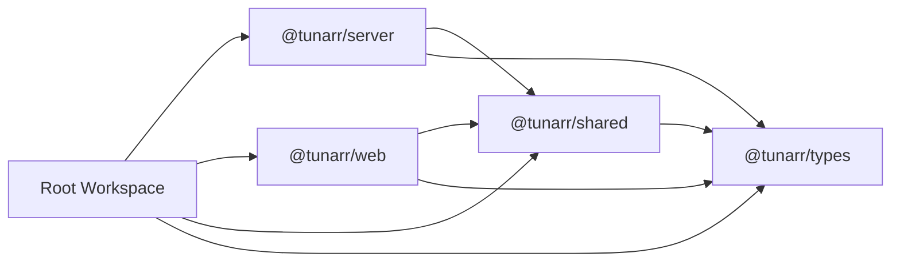

# Milestone 01: Baseline and Change Control

- **Roadmap version:** 0.1
- **Milestone status:** In Progress
- **Last updated:** 2026-07-27
- **Risk classification:** Foundation / Moderate
- **Implementation authority:** Documentation and characterization only

## Purpose

This milestone establishes the verified implementation baseline for
ChannelForge before architectural restructuring begins.

It defines:

- Repository baseline
- Source-control rules
- Workspace inventory
- Toolchain inventory
- Package inventory
- Dependency inventory
- Runtime subsystem inventory
- Persistence inventory
- API inventory
- Media-provider inventory
- Scheduling inventory
- Playout and output inventory
- Configuration inventory
- Deployment inventory
- Test baseline
- Platform-specific test classification
- Characterization-test requirements
- Architecture-traceability rules
- Pull-request scope rules
- Change-risk classification
- Evidence retention
- Entry and completion gates
- Rollback expectations

This milestone does not implement new ChannelForge runtime behavior.

Its purpose is to make the inherited Tunarr foundation measurable before it is
adapted, moved, renamed, or replaced.

## Governing Specifications

This milestone is governed by:

- `docs/architecture/spec/01-terminology.md`
- `docs/architecture/spec/02-system-context.md`
- `docs/architecture/spec/03-domain-model.md`
- `docs/architecture/spec/04-scheduling-model.md`
- `docs/architecture/spec/05-media-catalog.md`
- `docs/architecture/spec/06-playout-and-output.md`
- `docs/architecture/spec/07-integrations.md`
- `docs/architecture/spec/08-persistence.md`
- `docs/architecture/spec/09-api.md`
- `docs/architecture/spec/10-plugins.md`
- `docs/architecture/spec/11-security.md`
- `docs/architecture/spec/12-deployment.md`
- `docs/architecture/spec/13-testing.md`
- `docs/architecture/spec/14-migration.md`
- `docs/architecture/spec/15-interstitial-programming-and-external-video-feeds.md`

The implementation roadmap index also governs this milestone:

- `docs/implementation/README.md`

## Milestone Mission

ChannelForge must not begin architectural replacement from an assumed
understanding of the inherited runtime.

The baseline milestone must:

- Record exactly what exists
- Record what builds
- Record what tests pass
- Classify existing failures
- Identify current write authorities
- Identify current runtime entry points
- Identify current persistent state
- Identify current provider boundaries
- Identify current output contracts
- Identify hidden coupling
- Identify platform-sensitive behavior
- Add characterization coverage around high-risk inherited behavior
- Establish change-control rules
- Prevent accidental rebranding from masking semantic changes
- Produce evidence sufficient to begin module-boundary work

## Product Principle

The governing ChannelForge principle remains:

> Build television networks, not playlists.

This milestone does not attempt to enforce the final product model in runtime
code.

It identifies where the inherited runtime conflicts with or falls short of that
principle.

## Baseline Anchor

The implementation baseline is anchored to:

```text
Repository: BMJ812/ChannelForge
Main merge commit: f77cb75f
Architecture pull request: #2
Architecture specification version: 0.1 Draft
```

The baseline commit contains the merged ChannelForge architecture
specification.

The implementation-roadmap branch begins from that baseline.

## Baseline Immutability

The baseline anchor must not move silently.

If `main` advances before Milestone 01 completes:

1. Record the new main commit.
2. Compare it to `f77cb75f`.
3. Classify the intervening changes.
4. Decide whether the baseline remains valid.
5. Update baseline evidence deliberately.
6. Do not rewrite historical results.

## Baseline Record

Milestone implementation should create a machine-readable baseline record.

Suggested path:

```text
docs/implementation/baseline/repository-baseline.json
```

Suggested fields:

```json
{
  "repository": "BMJ812/ChannelForge",
  "baselineCommit": "f77cb75f",
  "architectureVersion": "0.1",
  "nodeVersion": "22.20.0",
  "pnpmVersion": "10.28.0",
  "platform": "windows-amd64-development",
  "recordedAt": "2026-07-27T00:00:00Z"
}
```

The exact timestamp should be generated when the record is created.

## Current Workspace Baseline

The inherited monorepo currently defines four workspace packages:

```text
server
web
types
shared
```

The baseline must inventory all four.

## Root Package Baseline

The root package currently identifies itself as:

```text
name: tunarr
version: 1.2.0-dev.1
license: Zlib
type: module
node engine: 22
package manager: pnpm 10.28.0
```

The root scripts include:

- `build`
- `dev`
- `fmt`
- `lint-staged`
- `lint-changed`
- `test`
- `preinstall`
- `should-semantic-release`
- `generate-docs-script`
- `knip`

The root package identity is inherited state.

It must not be renamed during Milestone 01.

## Workspace Package Baseline

### Server Package

Current package identity:

```text
@tunarr/server
```

Current baseline responsibilities inferred from package metadata and runtime
dependencies include:

- Fastify HTTP server
- OpenAPI generation
- SQLite access
- Kysely
- Drizzle
- Better SQLite3
- Dependency injection
- Provider integrations
- XMLTV
- SSDP
- Scheduling
- FFmpeg process integration
- Search integration
- Background processing
- Logging
- Bundling and standalone binary creation

This list is an inventory hypothesis.

Milestone work must verify actual source ownership.

### Web Package

Current package identity:

```text
@tunarr/web
```

Current baseline includes:

- React
- Vite
- Material UI
- TanStack Router
- TanStack Query
- TanStack forms
- Lingui localization
- Generated OpenAPI client
- HLS playback
- Vitest
- Testing Library

### Types Package

Current package identity:

```text
@tunarr/types
```

Current exported areas include:

- Shared schemas
- Plex types
- Jellyfin types
- Emby types
- API types

This package currently mixes provider contracts and application API contracts.

Milestone 02 will decide final boundaries.

Milestone 01 only records the current shape.

### Shared Package

Current package identity:

```text
@tunarr/shared
```

Current responsibilities include:

- Shared utility functions
- Constants
- Shared types
- Search-related utilities
- Randomness utilities
- Zod-based shared validation

The package depends on `@tunarr/types`.

This dependency must be included in the baseline graph.

## Turbo Task Baseline

The current task graph includes:

- `topo`
- `clean`
- `build`
- `build-dev`
- `lint`
- `lint-fix`
- `dev`
- `test`
- `test:watch`

The current development task explicitly depends on:

```text
@tunarr/types#build
@tunarr/shared#build
```

Milestone 01 must record the effective task graph.

## Required Workspace Inventory Artifact

Create:

```text
docs/implementation/baseline/workspace-inventory.md
```

It should include:

| Package | Current name | Current purpose | Direct workspace dependencies | Build command | Test command |
| --- | --- | --- | --- | --- | --- |
| Root | `tunarr` | Monorepo orchestration | All workspaces | `pnpm build` | `pnpm test` |
| Server | `@tunarr/server` | Runtime server | Shared, Types | Package build | Package test |
| Web | `@tunarr/web` | First-party UI | Shared, Types | Package build | Package test |
| Types | `@tunarr/types` | Schemas and provider/API types | None or external | Package build | Inventory required |
| Shared | `@tunarr/shared` | Shared utilities | Types | Package build | Package test |

The final artifact must use verified commands and dependencies.

## Package Identity Policy

During Milestone 01:

- Do not rename root package.
- Do not rename workspace packages.
- Do not rewrite all imports.
- Do not replace `@tunarr/*` identifiers.
- Do not change release metadata.
- Do not change container image identity.
- Do not change default data paths.
- Do not change public API paths.
- Do not change provider behavior.

Package rebranding is deferred until dependency boundaries and migration
compatibility are defined.

## Toolchain Baseline

The verified local development baseline is:

```text
Operating system: Windows
Shell: PowerShell
Node.js: 22.20.0
pnpm: 10.28.0
Git: 2.53.0
```

The repository declares:

```text
Node engine: 22
Package manager: pnpm@10.28.0
TypeScript catalog: 5.9.3
Vitest catalog: 4.1.5
```

The exact installed dependency graph is defined by the lockfile.

## Toolchain Inventory Artifact

Create:

```text
docs/implementation/baseline/toolchain-inventory.md
```

It must record:

- Declared Node version
- Tested Node version
- Declared pnpm version
- Tested pnpm version
- TypeScript version
- Vitest version
- Turbo version
- Vite version
- Fastify version
- SQLite library version
- FFmpeg version
- Operating system
- Architecture
- Shell
- Docker version where available
- Docker Compose version where available
- Git version

## Toolchain Command Evidence

Suggested PowerShell evidence commands:

```powershell
node --version
pnpm --version
git --version
pnpm exec turbo --version
pnpm exec tsc --version
pnpm exec vitest --version
ffmpeg -version
docker version
docker compose version
```

Commands that are unavailable must be recorded as unavailable.

They must not be silently omitted.

## Lockfile Policy

The lockfile is authoritative for dependency resolution.

Milestone 01 must not update the lockfile except when:

- A characterization-test dependency is essential
- The dependency addition is isolated
- The reason is documented
- The change is reviewed separately
- The baseline before and after is recorded

## Dependency Inventory

Create:

```text
docs/implementation/baseline/dependency-inventory.md
```

The inventory should classify dependencies into:

- Runtime framework
- Persistence
- Provider integration
- Media processing
- Scheduling
- Search
- Validation
- Logging
- Security
- API documentation
- UI framework
- UI state
- Testing
- Build tooling
- Packaging
- Localization
- Utility

## Dependency Risk Classification

Each significant dependency should be classified:

- **Foundation:** Difficult to replace without broad impact
- **Boundary:** Should remain behind a module interface
- **Adapter:** Provider- or platform-specific
- **Utility:** Narrow, replaceable helper
- **Development only:** No production runtime effect
- **Candidate for removal:** Present but potentially obsolete
- **Unknown:** Requires source-use verification

## Foundation Dependency Candidates

Likely foundation dependencies include:

- Node.js
- TypeScript
- Fastify
- SQLite
- Better SQLite3
- Kysely
- React
- Vite
- Zod
- Turbo
- pnpm

This is not an approval of permanent use.

It is a baseline classification.

## Adapter Dependency Candidates

Likely adapter dependencies include:

- XMLTV libraries
- SSDP
- Provider API clients or generated provider types
- FFmpeg wrappers
- Meilisearch
- HLS playback
- File metadata libraries

## Dependency Use Verification

A package listed in `package.json` is not proof of active use.

The baseline must verify:

- Import count
- Runtime path
- Build path
- Test-only use
- Dead dependency possibility
- Transitive dependence
- Platform constraints

## Dependency Graph

Create a workspace-level dependency graph.

Suggested artifact:

```text
docs/implementation/baseline/workspace-dependency-graph.mmd
```

Example starting point:



The graph must be verified against package manifests and source imports.

## Source Tree Inventory

Milestone 01 must inventory source directories without moving them.

Suggested artifact:

```text
docs/implementation/baseline/source-tree-inventory.md
```

For each top-level source directory, record:

- Path
- Current responsibility
- Public entry points
- Direct dependencies
- Persistence access
- Network access
- File-system access
- Process spawning
- Background jobs
- API routes
- Known tests
- Suspected target module
- Risk
- Notes

## Source Inventory Rules

Do not infer final architecture solely from folder names.

Verify through:

- Imports
- Dependency injection bindings
- Route registration
- Repository use
- Database queries
- Background-job registration
- Runtime startup
- Tests

## Runtime Entry-Point Inventory

Identify:

- Main server process entry
- CLI entry
- OpenAPI generation entry
- Development entry
- Bundle entry
- Standalone binary entry
- Web development entry
- Web production bundle entry
- Docker entry point
- Migration startup entry
- FFmpeg child-process entry
- Search-service startup
- Graceful-shutdown registration

## Entry-Point Artifact

Create:

```text
docs/implementation/baseline/runtime-entry-points.md
```

For each entry point, record:

- Command
- File
- Environment
- Side effects
- Long-running processes
- Shutdown behavior
- Required configuration
- Ports
- Persistent writes

## Build Baseline

The inherited baseline build has been executed successfully on Windows.

Milestone 01 must preserve that result as evidence.

## Required Build Commands

At minimum, evaluate:

```powershell
pnpm install --frozen-lockfile
pnpm build
```

Package-level commands should also be recorded where practical:

```powershell
pnpm --filter @tunarr/types build
pnpm --filter @tunarr/shared build
pnpm --filter @tunarr/server build
pnpm --filter @tunarr/web build
```

## Build Evidence Artifact

Create:

```text
docs/implementation/baseline/build-baseline.md
```

Record:

- Commit
- Platform
- Tool versions
- Command
- Start timestamp
- End timestamp
- Exit code
- Result
- Warnings
- Generated outputs
- Notes

## Build Warning Policy

Warnings must be classified:

- Harmless platform warning
- Deprecation
- Security concern
- Future compatibility concern
- Build correctness concern
- Unknown

Warnings must not be normalized as harmless without review.

## Test Baseline

The known inherited Windows baseline is:

```text
Passed: 1,069
Failed: 43
```

The failures observed during the initial foundation verification were associated
primarily with:

- Windows path expectations
- SQLite temporary database cleanup
- File locking
- `EBUSY`
- Platform-specific semantics

This count is historical evidence for the current baseline.

It must be reproduced or deliberately superseded with a newer recorded run.

## Test Baseline Authority

Linux container behavior is authoritative for production.

Windows remains an important development environment.

A Windows failure may not be dismissed merely because Linux is authoritative.

It must be classified.

## Test Result Classification

Every inherited failure must receive one classification:

- `PRODUCT_DEFECT`
- `TEST_DEFECT`
- `PLATFORM_DIFFERENCE`
- `FLAKY`
- `ENVIRONMENT`
- `MISSING_DEPENDENCY`
- `EXPECTED_UNSUPPORTED`
- `UNKNOWN`

## Windows Test Baseline Artifact

Create:

```text
docs/implementation/baseline/windows-test-baseline.md
```

Include:

- Full command
- Total tests
- Passed
- Failed
- Skipped
- Duration
- Failure names
- Failure files
- Classification
- Reproduction command
- Owner
- Planned treatment

## Linux Test Baseline Artifact

Create:

```text
docs/implementation/baseline/linux-test-baseline.md
```

Run in a production-like Linux environment.

Record:

- Container or host
- Distribution
- Architecture
- Node
- pnpm
- SQLite
- Filesystem
- Command
- Results
- Failures
- Duration

## Test Baseline Prohibitions

Do not:

- Delete failing tests
- Add broad platform skips
- Add arbitrary sleeps
- Retry until green
- Change assertions merely to match current output
- Hide output
- Reclassify unknown failure as harmless
- combine test fixes with major refactoring

## Characterization Testing

Characterization tests record existing behavior before replacement.

They are not endorsements of that behavior.

## Characterization-Test Objectives

Characterization coverage must protect:

- Data interpretation
- Identifier behavior
- Provider normalization
- Scheduling output
- Stream decisions
- XMLTV
- M3U
- HDHomeRun-compatible responses
- API response shapes
- Configuration defaults
- Migration inputs
- File paths
- Runtime error behavior

## Characterization-Test Label

Inherited-behavior tests should be identifiable.

Possible conventions:

```text
*.characterization.test.ts
```

or:

```text
describe("legacy characterization", ...)
```

The exact convention must be documented.

## Characterization-Test Rule

A characterization test should state:

- Current behavior
- Why the behavior matters
- Whether ChannelForge intends to preserve or replace it
- Governing architecture section
- Removal or conversion condition

## Characterization Coverage Matrix

Create:

```text
docs/implementation/baseline/characterization-matrix.md
```

Suggested columns:

| Subsystem | Behavior | Existing coverage | Required coverage | Preserve or replace | Risk | Owner |
| --- | --- | --- | --- | --- | --- | --- |

## High-Risk Characterization Areas

Priority areas:

1. SQLite schema and migration startup
2. Channel identifiers
3. Program identifiers
4. Provider source identifiers
5. Scheduling order and duration behavior
6. Existing guide generation
7. Existing M3U generation
8. Existing stream route behavior
9. FFmpeg command planning
10. Media Source credentials
11. Path mapping
12. Active Channel runtime lookup
13. XMLTV Channel IDs
14. HDHomeRun-compatible device identity
15. Backup behavior

## Characterization Golden Files

Golden files may be used for:

- XMLTV
- M3U
- API payloads
- Provider normalization
- Schedule output
- Migration output
- Configuration serialization

Golden files must be human-reviewed.

## Characterization Versus Final Contract

A characterization test may later be:

- Retained as a compatibility test
- Converted into a ChannelForge contract test
- Replaced by a new specification test
- Deleted after legacy retirement

Deletion requires proof that no supported path depends on it.

## Persistence Inventory

The baseline must inventory all persistent state.

## Persistence Artifact

Create:

```text
docs/implementation/baseline/persistence-inventory.md
```

For every table or durable document, record:

- Name
- Storage engine
- Current owner
- Read paths
- Write paths
- Primary key
- Foreign keys
- Unique constraints
- Indexes
- Data volume estimate
- Authoritative or derived
- Secret content
- Migration risk
- Target ChannelForge concept
- Retention policy

## SQLite Inventory

At minimum, inventory:

- Database file path
- Journal mode
- WAL behavior
- Foreign-key configuration
- Busy timeout
- Connection lifecycle
- Migration framework
- Schema version tracking
- Backup mechanism
- Restore mechanism
- Temporary databases
- Test database creation
- Test database cleanup
- Read/write concurrency
- Direct SQL access
- Kysely access
- Drizzle access
- Better SQLite3 access

## Multiple Persistence Abstractions

The current server dependencies include:

- Better SQLite3
- Kysely
- Drizzle ORM
- LowDB

Milestone 01 must determine:

- Which are active
- Which data each owns
- Whether they overlap
- Whether any are migration-only
- Whether any are obsolete
- Whether direct database access bypasses repositories

## Persistence Write Authority Matrix

Create:

```text
docs/implementation/baseline/persistence-write-authority.md
```

Suggested columns:

| Concept | Current store | Current writer | Other writers | Transaction boundary | Risk |
| --- | --- | --- | --- | --- | --- |

## Direct Database Access Search

The inventory should identify:

- Raw SQL
- Kysely queries
- Drizzle queries
- Better SQLite3 statements
- Transaction calls
- Schema migrations
- Database path construction
- Test database setup

## Persistence Baseline Invariants

Milestone 01 must verify or record uncertainty around:

- Foreign keys
- Unique constraints
- Stable identifiers
- Deletion semantics
- Archive semantics
- Cascade behavior
- Transaction behavior
- Migration idempotency
- Backup consistency

## API Inventory

Create:

```text
docs/implementation/baseline/api-inventory.md
```

For every route, record:

- Method
- Path
- Route module
- Handler
- Request schema
- Response schema
- Authentication
- Authorization
- Persistence writes
- Provider calls
- File access
- Process spawning
- Legacy identifier use
- First-party UI caller
- External client use
- Target ChannelForge route
- Compatibility category

## API Compatibility Categories

Use:

- `PRESERVE_EXACT`
- `TRANSLATE`
- `DEPRECATE`
- `READ_ONLY`
- `REMOVE_LATER`
- `INTERNAL_ONLY`
- `UNKNOWN`

## OpenAPI Baseline

Record:

- OpenAPI generation command
- Generated file location
- Route coverage
- Schema drift
- Client generation command
- Web client generation location
- Undocumented routes

## API Golden Baseline

Generate or retain representative payloads for:

- Channel list
- Channel detail
- Program list
- Media Source list
- Provider library list
- Schedule
- Guide
- Stream endpoint metadata
- Settings
- Error response

Secrets must be redacted.

## UI Caller Inventory

For each first-party UI feature, record:

- Route
- Generated-client function
- Query key
- Mutation
- Legacy dependency
- Target milestone

## Provider Inventory

Create:

```text
docs/implementation/baseline/provider-inventory.md
```

Provider types:

- Plex
- Jellyfin
- Emby
- Local files
- Other inherited provider or source types

## Provider Inventory Fields

Record:

- Adapter path
- Provider client
- Authentication method
- Stable server identity
- Library enumeration
- Item enumeration
- Pagination
- Playback resolution
- Artwork
- Metadata mapping
- Technical metadata
- Error mapping
- Retry
- Rate-limit behavior
- Cache
- Webhook support
- Tests
- Target ChannelForge adapter

## Provider Contract Fixtures

Milestone 01 should identify existing fixtures and missing fixtures for:

- Authentication success
- Authentication failure
- Server identity
- Movie library
- Television library
- Pagination
- Missing metadata
- Multiple playback versions
- Provider error
- Timeout
- Permission change
- Deleted item

## Provider Credential Inventory

Record:

- Storage location
- Encryption state
- Environment-variable use
- API exposure
- Log exposure risk
- Backup behavior
- Migration requirement

Do not record credential values.

## Provider Identity Baseline

Characterize how the inherited runtime distinguishes:

- Two servers of the same provider type
- Reinstalled provider server
- Changed base URL
- Duplicate library IDs
- Same media item across providers
- Provider item ID reuse

## Catalog-Like State Inventory

The inherited runtime may not yet have the final ChannelForge Catalog model.

Milestone 01 must identify current representations of:

- Movie
- Series
- Season
- Episode
- Track
- Music video
- Local file
- Custom show
- Filler item
- Provider program
- Cached program
- Playback file
- Media version

## Program Identity Inventory

Record:

- ID format
- Source qualification
- Serialization
- Database key
- API exposure
- Schedule references
- Guide references
- Stream references
- Deduplication behavior
- Collision risk

## Scheduling Inventory

Create:

```text
docs/implementation/baseline/scheduling-inventory.md
```

Record:

- Scheduling entry points
- Scheduler types
- Slot models
- Random selection
- Time-slot behavior
- Random-slot behavior
- Custom shows
- Filler
- Flex
- Redirect
- Padding
- Repeat behavior
- Episode order
- Persistence writes
- Seed handling
- Time-zone handling
- DST behavior
- Runtime mutation
- Existing tests
- Known nondeterminism

## Scheduling Characterization Priority

Characterize:

- Identical input repeated execution
- Database row-order changes
- Seed changes
- Time-zone changes
- DST boundary
- Empty candidates
- Filler insertion
- Exact duration fit
- Overrun
- Underrun
- Episode order
- Repeat prevention
- Program deletion
- Missing file
- Channel disable
- Regeneration

## Determinism Baseline

Milestone 01 must determine whether current scheduling is:

- Fully deterministic
- Seed-dependent
- Database-order-dependent
- Clock-dependent
- Process-order-dependent
- Random without seed
- Mixed

The result should be evidence, not assumption.

## Scheduling Output Snapshot

Create at least one sanitized schedule fixture representing:

- One Channel
- One day
- Movies
- Episodes
- Filler
- Known durations
- Fixed time zone
- Fixed source data

Store the input and output checksums.

## Playout Inventory

Create:

```text
docs/implementation/baseline/playout-inventory.md
```

Record:

- Stream request entry
- Channel resolution
- Active-program resolution
- Runtime offset
- Provider source resolution
- Local-path resolution
- FFmpeg command planning
- Process creation
- Process supervision
- Client disconnect handling
- Shared-session behavior
- Tuner-capacity behavior
- Recovery behavior
- Error handling
- Logging
- Cleanup

## FFmpeg Baseline

Record:

- FFmpeg discovery
- Bundled versus system FFmpeg
- Version
- ffprobe use
- Command builders
- Hardware detection
- Direct stream
- Transcode
- Audio handling
- Subtitle handling
- Scaling
- Deinterlace
- Temporary files
- Environment variables
- Exit-code handling
- Log redaction
- Process cleanup

## FFmpeg Characterization Fixtures

Use small licensed or generated media fixtures for:

- H.264/AAC
- H.265/AAC
- MPEG-TS
- Multiple audio tracks
- Subtitle track
- Interlaced content
- Short bumper
- Corrupt file
- Missing file

Milestone 01 may inventory fixture needs without adding every fixture.

## Output Inventory

Create:

```text
docs/implementation/baseline/output-inventory.md
```

Output types:

- XMLTV
- M3U
- HDHomeRun-compatible discovery and lineup
- MPEG-TS
- HLS where present
- Browser playback
- Logos and artwork
- Generated configuration files

## XMLTV Baseline

Record:

- Route
- Generator
- Channel ID
- Start and stop formatting
- Time zone
- Episode numbering
- Categories
- Ratings
- Artwork
- Caching
- ETag
- Failure behavior
- Last-valid behavior
- Tests

## M3U Baseline

Record:

- Route
- Channel order
- Channel ID
- Channel number
- Group
- Logo
- Stream URL
- Access token
- Public base URL
- Caching
- Tests

## HDHomeRun-Compatible Baseline

Record:

- SSDP discovery
- Device identity
- Base URL
- Discover response
- Lineup response
- Lineup status
- Tuner count
- Capacity behavior
- Stream URL
- Client assumptions
- Tests

## Configuration Inventory

Create:

```text
docs/implementation/baseline/configuration-inventory.md
```

Configuration sources:

- Environment variables
- SQLite settings
- JSON or LowDB documents
- Command-line arguments
- Container environment
- Provider credentials
- UI settings
- Generated environment module
- Defaults
- Runtime-derived values

## Configuration Field Inventory

For every field, record:

- Name
- Type
- Default
- Source
- Secret
- Validation
- Runtime reload
- Restart requirement
- API exposure
- UI exposure
- Backup inclusion
- Migration target
- Deprecation plan

## Environment Variable Baseline

Record exact current variables for:

- Port
- Host
- Time zone
- Data directory
- FFmpeg
- Logging
- Search
- Provider integration
- Authentication
- Hardware acceleration
- Development
- Testing
- Packaging

## Configuration Precedence

Determine actual precedence among:

1. Command line
2. Environment
3. Persistent setting
4. Generated default
5. Hard-coded default

## Filesystem Inventory

Create:

```text
docs/implementation/baseline/filesystem-inventory.md
```

Record:

- Data root
- Database files
- WAL and shared-memory files
- Logs
- Cache
- Temporary transcode files
- HLS segments
- Logos
- Artwork
- Backups
- Generated XMLTV
- Generated M3U
- Search data
- Plugin data if present
- Bundle files

## Path Semantics

Characterize:

- Windows paths
- POSIX paths
- Container paths
- UNC paths
- Case sensitivity
- Symlinks
- Read-only media mounts
- Path mappings
- Cleanup
- File locking

## Deployment Inventory

Create:

```text
docs/implementation/baseline/deployment-inventory.md
```

Record:

- Dockerfile locations
- Build stages
- Base images
- Entrypoint
- User
- PUID and PGID
- Port
- Data volume
- Temp volume
- Media mounts
- Health check
- Signal handling
- FFmpeg
- Hardware devices
- Compose examples
- Unraid template
- Multi-architecture build
- Release artifact
- Standalone binary

## Deployment Baseline Tests

At minimum:

- Start empty
- Reach liveness
- Reach readiness
- Stop gracefully
- Restart
- Preserve data
- Read media mount
- Generate output
- Start one stream where infrastructure permits

## Search Inventory

The current server includes Meilisearch-related dependencies and installation
scripts.

Milestone 01 must determine:

- Whether Meilisearch is required
- Whether it runs in-process or externally
- Where data is stored
- Startup behavior
- Failure behavior
- Rebuild behavior
- Search fallback
- Container implications
- Migration impact

## Background Job Inventory

Create:

```text
docs/implementation/baseline/background-job-inventory.md
```

For every recurring or asynchronous process, record:

- Name
- Registration
- Trigger
- Schedule
- Input
- Persistence writes
- Provider calls
- Cancellation
- Retry
- Shutdown
- Restart reconciliation
- Observability
- Target ChannelForge job type

## Process Inventory

Record child processes:

- FFmpeg
- ffprobe
- Meilisearch
- Packaging helpers
- Development watchers
- Other binaries

## Logging Inventory

Create:

```text
docs/implementation/baseline/logging-inventory.md
```

Record:

- Logger
- Destinations
- Levels
- File rotation
- Structured fields
- Request IDs
- Child-process output
- Secret redaction
- Provider URLs
- Tokens
- User data
- Support bundle inclusion

## Security Baseline

Milestone 01 does not implement the final security model.

It inventories current controls.

## Security Inventory Artifact

Create:

```text
docs/implementation/baseline/security-inventory.md
```

Record:

- Authentication
- Authorization
- Session handling
- API tokens
- Provider credential storage
- CORS
- CSRF
- Reverse-proxy trust
- File upload
- Path validation
- SSRF protections
- Command construction
- Secret redaction
- Backup protection
- Plugin execution
- Audit
- Security headers

## Secret Sentinel Test

Milestone 01 should establish a test approach using synthetic sentinel values.

Check:

- Logs
- API errors
- XMLTV
- M3U
- FFmpeg diagnostics
- Support output
- Backup metadata

## Test Infrastructure Inventory

Create:

```text
docs/implementation/baseline/test-infrastructure.md
```

Record:

- Vitest configs
- Typecheck configs
- Test setup files
- Global fixtures
- Temporary directories
- Temporary databases
- Mock servers
- Media fixtures
- Provider fixtures
- Snapshot files
- Golden files
- Coverage configuration
- CI commands
- Platform skips
- Retry behavior
- Timeouts
- Parallelization

## Test Ownership

Every major suite should have a conceptual owner even in a single-maintainer
project.

Suggested ownership groups:

- Domain
- Persistence
- Providers
- Scheduling
- Playout
- Output
- API
- UI
- Migration
- Deployment

## Platform Baseline

Required platforms:

- Windows development
- Linux production container
- Linux amd64
- Linux arm64 when officially supported

## Windows Baseline

Record:

- NTFS behavior
- File-lock behavior
- Path separators
- Drive letters
- PowerShell commands
- Docker Desktop behavior where used
- SQLite cleanup behavior
- Symlink permissions

## Linux Baseline

Record:

- Filesystem
- Signal handling
- User and group
- Device access
- Host networking
- UDP discovery
- FFmpeg hardware access
- SQLite locking
- Container shutdown

## Architecture Conformance Baseline

Milestone 01 should create a map from existing source to target modules.

Suggested artifact:

```text
docs/implementation/baseline/architecture-conformance-map.md
```

Columns:

| Current path | Current role | Target module | Direct legacy dependency | Risk | Milestone |
| --- | --- | --- | --- | --- | --- |

## Conformance Categories

- `ALIGNED`
- `ADAPTABLE`
- `LEGACY`
- `CROSS_CUTTING`
- `UNKNOWN`
- `REMOVE_LATER`

## Dependency-Direction Baseline

Measure current imports among:

- Server layers
- Web layers
- Types
- Shared
- Provider code
- Persistence code
- Scheduling code
- Playout code
- Output code

Milestone 02 will enforce target rules.

Milestone 01 records violations.

## Circular Dependency Baseline

Identify:

- Workspace cycles
- Source-level cycles
- Dependency-injection cycles
- Runtime initialization cycles

Do not break cycles in the inventory pull request unless required to run the
inventory.

## Change-Control Policy

Milestone 01 establishes mandatory change-control rules for later work.

## Change Request Fields

Every implementation pull request should state:

- Roadmap milestone
- Work item
- Governing architecture documents
- Current behavior
- Target behavior
- Data authority
- Persistence impact
- API impact
- UI impact
- Provider impact
- Scheduling impact
- Playout impact
- Security impact
- Deployment impact
- Migration
- Rollback
- Tests
- Deferred cleanup

## Pull-Request Template

Create or update:

```text
.github/pull_request_template.md
```

The template should not be introduced inside the roadmap documentation PR unless
the roadmap PR explicitly includes process artifacts.

A later implementation-planning PR may add it.

## Risk Levels

### Low

Examples:

- Documentation
- Additive test fixture
- Additive pure type
- Non-runtime lint rule
- Internal script with no production use

Required review:

- Scope
- Correctness
- No unintended generated changes

### Moderate

Examples:

- Additive module interface
- Additive repository
- New read-only endpoint
- New compatibility metric
- Characterization tests
- Additive migration metadata

Required review:

- Boundary
- Tests
- Compatibility
- Observability

### High

Examples:

- New table
- Write-path change
- Provider mapping
- Scheduling behavior
- FFmpeg command change
- Stream-route change
- Credential handling
- API contract change

Required review:

- Migration
- Rollback
- Integration tests
- Security
- Operator impact

### Critical

Examples:

- Active publication cutover
- Legacy write freeze
- Database conversion
- Backup restore
- Secret re-encryption
- Device identity change
- Legacy table deletion
- Release migration

Required review:

- Verified backup
- Rollback rehearsal
- Failure injection
- Release note
- Explicit approval

## Scope-Control Rules

A pull request must not combine:

- Dependency upgrades and domain migration
- Package rename and behavior change
- Formatting rewrite and persistence change
- UI redesign and API cutover
- Scheduler replacement and playout replacement
- Credential migration and unrelated settings work
- Legacy deletion and new feature work

Exceptions require explicit explanation.

## Naming Change Control

ChannelForge terminology should be introduced first in:

- New domain interfaces
- New modules
- New documentation
- New API v1 contracts

Existing inherited names may remain behind compatibility boundaries until
migration.

## Rebranding Prohibition

Milestone 01 must not perform broad replacements of:

- `Tunarr`
- `tunarr`
- `@tunarr`
- Legacy data directories
- Legacy environment variables
- Legacy routes
- Legacy database names

Such replacements would make behavioral review harder.

## Formatting Control

Do not run repository-wide formatting during baseline work.

Only touched files should be formatted.

## Generated File Control

Generated files must be:

- Identified
- Reproducible
- Separated from hand-authored changes where practical
- Reviewed through source generator changes

## Baseline Evidence Directory

Recommended structure:

```text
docs/implementation/baseline/
├── repository-baseline.json
├── workspace-inventory.md
├── toolchain-inventory.md
├── dependency-inventory.md
├── workspace-dependency-graph.mmd
├── source-tree-inventory.md
├── runtime-entry-points.md
├── build-baseline.md
├── windows-test-baseline.md
├── linux-test-baseline.md
├── characterization-matrix.md
├── persistence-inventory.md
├── persistence-write-authority.md
├── api-inventory.md
├── provider-inventory.md
├── scheduling-inventory.md
├── playout-inventory.md
├── output-inventory.md
├── configuration-inventory.md
├── filesystem-inventory.md
├── deployment-inventory.md
├── background-job-inventory.md
├── logging-inventory.md
├── security-inventory.md
├── test-infrastructure.md
└── architecture-conformance-map.md
```

Not every artifact must be hand-written.

Generated inventories are acceptable when reproducible.

## Inventory Generator Policy

A generator must:

- Be checked into the repository
- Be deterministic
- Avoid secrets
- Record source commit
- Produce stable ordering
- Fail on unreadable inputs
- Avoid modifying runtime state
- Use read-only database access unless explicitly testing a copy
- Be documented

## Suggested Inventory Scripts

Potential paths:

```text
scripts/implementation-baseline/
├── inventory-workspaces.ts
├── inventory-dependencies.ts
├── inventory-routes.ts
├── inventory-database.ts
├── inventory-environment.ts
├── inventory-tests.ts
└── inventory-source-imports.ts
```

The exact implementation language may differ.

## Inventory Script Safety

Scripts must not:

- Connect to a production provider by default
- Print credentials
- Mutate the primary database
- Delete files
- Update package manifests
- Start FFmpeg
- Start migrations
- Depend on internet access
- produce unstable ordering

## Baseline Database Copy

Persistence inventory should run against:

- Schema source files
- A synthetic fixture
- A copied local development database where authorized

Never inventory a live database through mutation.

## Sensitive Data Handling

Any copied database must be:

- Synthetic, or
- Sanitized before commit

Do not commit:

- Provider credentials
- Usernames
- Email addresses
- Private library names
- Private file paths
- Viewing history
- Device identifiers
- API tokens

## Evidence Naming

Evidence should include:

- Baseline commit
- Platform
- Date
- Command
- Result

Example:

```text
windows-test-baseline-f77cb75f-2026-07-27.txt
```

Large raw logs may remain outside Git and be summarized.

## Evidence Retention

Commit:

- Summaries
- Sanitized fixtures
- Reproduction commands
- Stable generated inventories

Do not commit:

- Huge transient logs
- Node modules
- Build caches
- Private media
- Secret-bearing configuration
- User databases

## Baseline Issue Register

Create:

```text
docs/implementation/baseline/issue-register.md
```

Fields:

| ID | Area | Finding | Classification | Risk | Blocks milestone | Planned milestone |
| --- | --- | --- | --- | --- | --- | --- |

## Finding IDs

Suggested format:

```text
BASE-001
BASE-002
BASE-003
```

## Finding Classifications

- Defect
- Test defect
- Platform difference
- Architecture gap
- Security risk
- Migration risk
- Unknown behavior
- Missing coverage
- Dead code candidate
- Documentation gap
- Dependency risk

## Blocking Finding

A finding blocks Milestone 01 completion when it prevents:

- Reliable build
- Reliable authoritative test run
- Persistence inventory
- Write-authority identification
- Route inventory
- Provider-boundary identification
- Safe next milestone
- Secret-safe evidence collection

## Nonblocking Finding

A finding may be deferred when:

- It is understood
- It is recorded
- It has an owner
- It has a target milestone
- It does not compromise baseline accuracy

## Baseline Review Checklist

Reviewers should verify:

- Baseline commit is correct
- Workspace list is complete
- Tool versions are recorded
- Build result is reproducible
- Test failures are classified
- Database stores are inventoried
- Write authorities are identified
- Routes are inventoried
- Providers are inventoried
- Scheduling behavior is characterized
- Playout behavior is characterized
- Output identities are recorded
- Credentials are not exposed
- Deployment paths are recorded
- Unknowns are explicit
- No runtime behavior changed unintentionally

## Interstitial Programming and External Video Feeds Amendment

### Purpose

Milestone 01 must inventory and characterize inherited behavior that may later
map to Presentation Assets, Interstitial Pools, Break Rules, External Feeds, or
External Feed Items.

This amendment does not add new runtime behavior.

### Required Inventory Additions

Inventory inherited Tunarr behavior related to:

- Filler lists
- Flex and gap-filling entries
- Commercial-like content
- Bumpers and station-identification media
- Custom shows used as short-form presentation collections
- Trailers, promos, slates, and other continuity media
- Remote media URLs
- Generic web-video references
- YouTube references or integrations
- RSS or Atom video-feed behavior
- Guide handling for filler and short-form entries
- Repeat and cooldown behavior
- Runtime fallback when short-form media is unavailable

### Required Baseline Artifacts

Add or extend baseline evidence so it records:

- Current filler and flex domain concepts
- Current persistence tables and columns used by those concepts
- Current API routes and UI callers
- Current scheduling entry points
- Current playout entry points
- Current XMLTV treatment
- Current source-resolution behavior
- Current remote URL validation
- Current credential or secret handling
- Current automatic refresh or synchronization behavior
- Current provider restrictions
- Known nondeterministic selection behavior
- Known missing characterization coverage

### Characterization Requirements

Characterization coverage should preserve observable inherited behavior for:

- Filler selection
- Flex insertion
- Short-gap handling
- Repeat avoidance
- Duration fitting
- Guide output
- Source failure fallback
- Remote URL rejection or acceptance
- Provider reference persistence

Tests must not add YouTube downloading, extraction, or restreaming.

### Issue Register Classification

Findings should identify whether inherited behavior is:

- Reusable behind a ChannelForge boundary
- A migration input
- A compatibility-only behavior
- A security risk
- A rights-policy risk
- A nondeterminism source
- A removal candidate
- Unsupported for ChannelForge version 1

### Milestone 01 Completion Additions

Milestone 01 cannot be marked Complete until:

1. Filler, flex, and presentation-like behavior is inventoried.
2. Remote and web-video references are inventoried.
3. Scheduling and playout entry points are identified.
4. Guide behavior is characterized.
5. Rights and playability gaps are recorded.
6. Unsupported download or extraction behavior is explicitly classified.
7. Findings are assigned to Milestones 05 through 10.
8. No new interstitial or External Feed runtime behavior was introduced.

## Recommended Milestone Pull-Request Sequence

Milestone 01 should be implemented through several narrow pull requests.

## PR 01A: Baseline Capture Scripts

Scope:

- Read-only inventory scripts
- Stable output ordering
- Secret redaction
- Script tests
- Documentation for running scripts

No runtime imports should be changed.

## PR 01B: Repository and Toolchain Inventory

Scope:

- Repository baseline
- Workspace inventory
- Toolchain inventory
- Dependency inventory
- Workspace dependency graph
- Source-tree inventory

## PR 01C: Persistence and API Inventory

Scope:

- Persistence inventory
- Write-authority matrix
- Route inventory
- OpenAPI baseline
- Configuration inventory
- Filesystem inventory

## PR 01D: Provider, Scheduling, and Playout Inventory

Scope:

- Provider inventory
- Catalog-like state inventory
- Scheduling inventory
- Playout inventory
- Output inventory
- Background-job inventory

## PR 01E: Change-Control and Contribution Rules

Scope:

- ChannelForge contribution guide
- Pull-request template
- Change-control policy
- Risk-classification guide
- Architecture-traceability requirements
- Issue register
- No runtime behavior change

## PR 01F: Characterization Test Foundation

Scope:

- Characterization convention
- Test fixture policy
- Fixed clock test helper if additive
- Seeded random test helper if additive
- Provider contract fixture scaffold
- Golden file review rules
- No behavior replacement

## PR 01G: Baseline Test Reports and Completion

Scope:

- Windows test baseline
- Linux test baseline
- Failure classification
- Platform matrix
- Flake register
- Security and deployment baseline closure
- Milestone 01 completion report

This sequence intentionally adopts change control before adding or classifying
the remaining characterization and platform evidence.

The semantic separation must remain.

## Pull-Request Acceptance for Inventory Work

Every inventory pull request must:

- Use read-only access
- Avoid secret output
- Produce deterministic ordering
- Include reproduction command
- Include sample output
- State baseline commit
- Pass build
- Pass relevant tests
- Avoid broad formatting

## Pull-Request Acceptance for Characterization Tests

Every characterization-test pull request must:

- Fail when the characterized behavior changes
- Use controlled time
- Use controlled randomness
- Avoid external network
- Use sanitized fixtures
- State preserve or replace intent
- State conversion/removal condition

## Baseline Completion Report

Create:

```text
docs/implementation/baseline/completion-report.md
```

It should summarize:

- Baseline commit
- Build status
- Test status
- Platform status
- Inventory status
- Characterization coverage
- Blocking findings
- Deferred findings
- Risks entering Milestone 02
- Approval

## Entry Gates

Milestone 01 may begin because:

- Architecture specification v0.1 exists
- Architecture PR #2 is merged
- Main is clean
- Roadmap branch exists
- Roadmap index exists
- Baseline build has previously passed
- Initial Windows test behavior is known
- Tunarr attribution is preserved

## Completion Gates

Milestone 01 is Complete when:

1. Baseline commit is recorded.
2. Workspace inventory exists.
3. Toolchain inventory exists.
4. Dependency inventory exists.
5. Source-tree inventory exists.
6. Runtime entry points are identified.
7. Build baseline is reproducible.
8. Windows test failures are classified.
9. Linux authoritative test baseline exists.
10. Persistence stores are inventoried.
11. Current write authorities are identified.
12. API routes are inventoried.
13. First-party UI callers are mapped.
14. Provider adapters are inventoried.
15. Credential storage is inventoried.
16. Current program identity is documented.
17. Scheduling entry points are inventoried.
18. Nondeterminism sources are identified.
19. Playout entry points are inventoried.
20. FFmpeg command planning is characterized.
21. XMLTV behavior is characterized.
22. M3U behavior is characterized.
23. HDHomeRun-compatible behavior is characterized.
24. Configuration sources are inventoried.
25. Filesystem paths are inventoried.
26. Deployment paths are inventoried.
27. Background jobs are inventoried.
28. Security baseline exists.
29. Characterization matrix exists.
30. High-risk missing coverage is recorded.
31. Change-control rules are adopted.
32. Issue register exists.
33. No secrets are committed.
34. No unintended runtime behavior changed.
35. Completion report approves Milestone 02 entry.

## Completion Evidence

A milestone completion commit should link:

- Inventory artifacts
- Test reports
- Issue register
- Characterization matrix
- Baseline commit
- Completion report

## Milestone Status Update

When completion gates pass, update:

```text
docs/implementation/README.md
```

from:

```text
Draft
```

or:

```text
In Progress
```

to:

```text
Complete
```

The exact status progression must reflect actual work.

## Rollback

Milestone 01 should contain no intentional production runtime change.

Rollback is normally:

- Revert documentation commit
- Revert inventory script
- Revert characterization-only test
- Remove generated baseline artifacts if invalid

## Rollback Requirement

A baseline artifact should be replaced, not silently edited, when its source
commit differs materially.

Historical evidence should remain available through Git.

## Failure Handling

If baseline work reveals a critical defect:

1. Record the defect.
2. Determine whether evidence collection is safe.
3. Stop dependent inventory if state may be corrupted.
4. Create a focused repair branch.
5. Fix separately.
6. Re-run the baseline.
7. Preserve both old and new results.

## Critical Baseline Defects

Examples:

- Database corruption
- Secret leakage
- Backup invalidity
- Unbounded child-process leak
- Authentication bypass
- Provider token exposed in M3U
- Destructive startup migration
- Nonrepeatable schema migration
- Unrecoverable active-state mutation

## Risks

### Inventory Drift

Source may change while inventory is being written.

Mitigation:

- Record source commit
- Keep PRs narrow
- Regenerate deterministic artifacts
- Review main divergence

### False Confidence

A green build does not prove runtime correctness.

Mitigation:

- Characterization tests
- Integration tests
- Platform tests
- Explicit unknowns

### Over-Characterization

Tests may freeze defects unnecessarily.

Mitigation:

- Mark preserve or replace intent
- Tie tests to compatibility need
- Convert tests during replacement

### Secret Exposure

Inventory scripts may print sensitive values.

Mitigation:

- Schema-only inventory
- Redaction
- Synthetic fixtures
- Secret sentinel tests
- Review generated output

### Scope Creep

Baseline work may become refactoring.

Mitigation:

- No behavior replacement
- Separate repair branches
- PR scope checks
- Risk classification

### Rename Churn

Premature ChannelForge renaming may obscure real changes.

Mitigation:

- Defer broad branding
- Introduce new names only at new boundaries
- Preserve compatibility aliases

### Platform Bias

Windows or Linux behavior may be treated as universally correct.

Mitigation:

- Separate reports
- Linux production authority
- Windows development support
- Explicit platform classifications

### Hidden Write Paths

Inventory may miss direct writes.

Mitigation:

- Static search
- Runtime tracing
- Database query instrumentation
- Tests
- Review

### Generated Inventory Staleness

Generated artifacts may stop matching source.

Mitigation:

- Source commit
- Regeneration command
- CI drift check in later milestone

## Milestone Invariants

1. Milestone 01 does not intentionally change runtime semantics.
2. The baseline commit is recorded.
3. Every generated inventory has stable ordering.
4. Inventory tools are read-only by default.
5. Inventory output contains no secrets.
6. Package identities remain unchanged.
7. Public API routes remain unchanged.
8. Database schema remains unchanged unless a separate approved repair is
   required.
9. Provider behavior remains unchanged.
10. Scheduling behavior remains unchanged.
11. Playout behavior remains unchanged.
12. Output identities remain unchanged.
13. Characterization tests identify inherited behavior explicitly.
14. Unknown behavior remains labeled unknown.
15. Windows failures are classified.
16. Linux release behavior is measured independently.
17. Test retries do not hide failure.
18. Broad test skips are prohibited.
19. Broad formatting changes are prohibited.
20. Dependency upgrades are isolated.
21. Direct legacy dependencies are inventoried.
22. Current write authorities are identified.
23. Current persistent stores are identified.
24. Current routes are identified.
25. Current background jobs are identified.
26. Current child processes are identified.
27. Current configuration sources are identified.
28. Current filesystem paths are identified.
29. Current secret storage is identified.
30. Current output contracts are characterized.
31. Attribution remains intact.
32. Findings are tracked.
33. Blocking findings prevent completion.
34. Completion evidence is reviewable.
35. Milestone 02 does not begin canonical restructuring before Milestone 01
   completion gates are met.

## Deferred Decisions

The following decisions are intentionally deferred:

- Final package names
- Final workspace count
- Final source-directory layout
- Final dependency-injection strategy
- Final repository implementation
- Final Kysely versus Drizzle usage
- Final LowDB disposition
- Final Meilisearch disposition
- Final API route names
- Final authentication implementation
- Final ChannelForge container image
- Final data directory name
- Final environment-variable names
- Final package publishing strategy
- Final standalone binary naming
- Final UI branding
- Final migration cutover sequence
- Final legacy route removal
- Final legacy table removal
- Final provider-client implementation
- Final scheduling engine structure
- Final playout session architecture
- Final plugin process model
- Final CI provider
- Final coverage thresholds
- Final performance thresholds

## Immediate Next Milestone

After this milestone is completed, proceed to:

```text
docs/implementation/02-module-boundaries.md
```

That milestone will define and enforce the modular-monolith boundaries that new
ChannelForge implementation work must follow.
