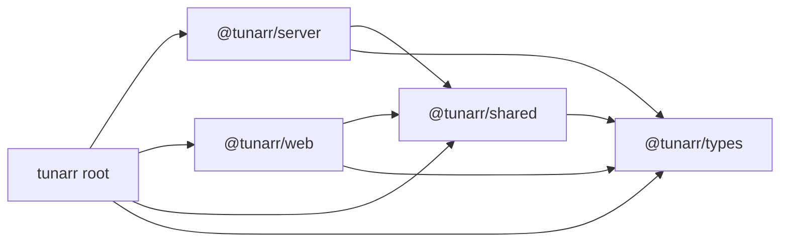
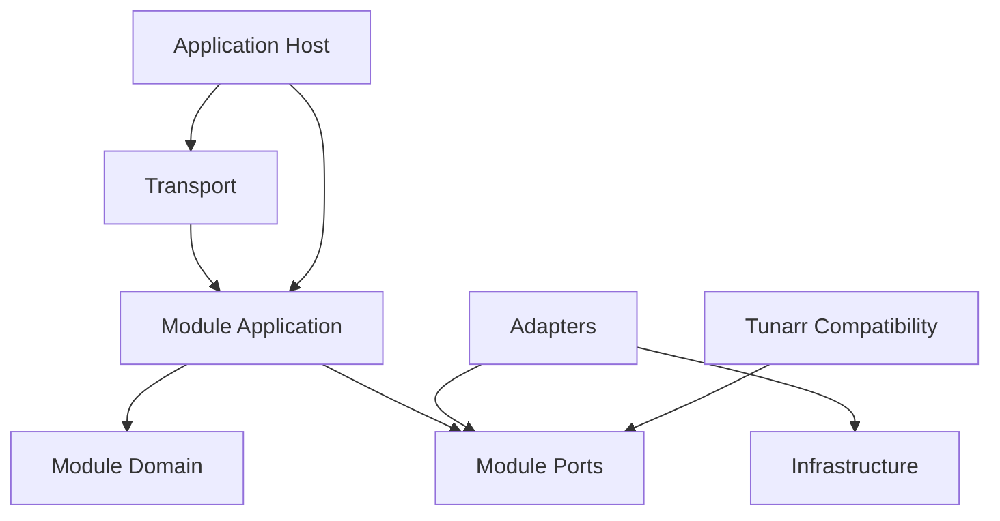
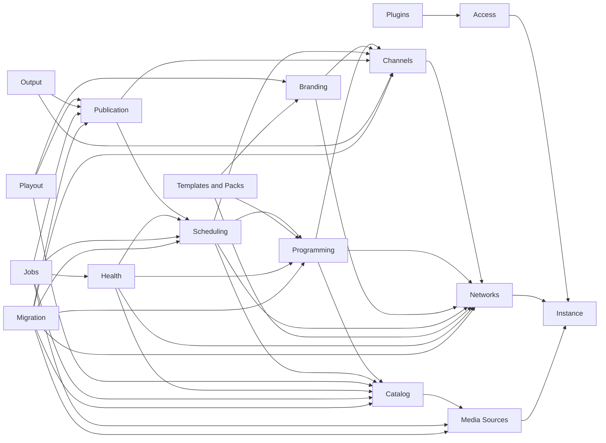

# Milestone 02: Module Boundaries

- **Roadmap version:** 0.1
- **Milestone status:** In Progress
- **Last updated:** 2026-07-28
- **Risk classification:** Foundation / High
- **Implementation authority:** Additive module boundaries and dependency enforcement
- **Current implementation unit:** PR 02C - Public Contract Classification and Enforcement

## Purpose

This milestone defines the modular-monolith boundaries that ChannelForge
implementation work must follow.

It translates the architecture specification into an enforceable source-code
structure.

It defines:

- Canonical application modules
- Module ownership
- Public module interfaces
- Dependency direction
- Import restrictions
- Application-service boundaries
- Domain-service boundaries
- Repository boundaries
- Query boundaries
- Transport boundaries
- Provider adapter boundaries
- Runtime process boundaries
- Cross-module communication
- Shared-kernel limits
- Compatibility-layer placement
- Package and directory migration
- Architecture tests
- Pull-request sequence
- Entry and completion gates
- Rollback
- Risks
- Deferred decisions

This milestone does not implement the final ChannelForge domain behavior.

It creates the structure in which that behavior will be implemented.

## Governing Specifications

This milestone is governed by:

- `docs/architecture/spec/01-terminology.md`
- `docs/architecture/spec/02-system-context.md`
- `docs/architecture/spec/03-domain-model.md`
- `docs/architecture/spec/05-media-catalog.md`
- `docs/architecture/spec/06-playout-and-output.md`
- `docs/architecture/spec/07-integrations.md`
- `docs/architecture/spec/08-persistence.md`
- `docs/architecture/spec/09-api.md`
- `docs/architecture/spec/10-plugins.md`
- `docs/architecture/spec/11-security.md`
- `docs/architecture/spec/13-testing.md`
- `docs/architecture/spec/14-migration.md`
- `docs/implementation/README.md`
- `docs/implementation/01-baseline-and-change-control.md`

## Milestone Mission

ChannelForge must remain a single deployable application for version 1 while
behaving internally as a set of explicit modules.

The module-boundary milestone must:

- Prevent route handlers from becoming application cores
- Prevent domain code from depending on Fastify
- Prevent domain code from depending on SQLite
- Prevent scheduling from depending on FFmpeg
- Prevent playout from modifying editorial configuration
- Prevent output adapters from inventing separate channel identities
- Prevent provider integrations from leaking provider payloads into the domain
- Prevent new ChannelForge code from importing legacy row shapes directly
- Prevent the shared package from becoming a dumping ground
- Define one owner for each aggregate and capability
- Permit incremental migration from inherited Tunarr code
- Preserve one-container deployment
- Keep the build and test baseline intact
- Establish automated architecture enforcement

## Product Principle

The governing product principle remains:

> Build television networks, not playlists.

Module boundaries must reinforce this principle.

A playlist-oriented inherited implementation may remain behind compatibility
interfaces during migration.

New ChannelForge modules must use network-first terminology and ownership.

## Architectural Context

ChannelForge version 1 is a modular monolith.

It runs initially as:

- One Node.js application process
- One Fastify API host
- One browser application
- One SQLite database
- One persistent data volume
- One background-job runtime
- Managed FFmpeg child processes
- Output protocol adapters
- Optional provider and metadata integrations

A modular monolith is not a collection of arbitrary folders.

A module must have:

- A named purpose
- Owned domain concepts
- Owned use cases
- Owned persistence interfaces
- A public API
- Hidden internals
- Explicit dependencies
- Tests
- Migration ownership

## Current Repository Baseline

The inherited workspace currently contains:

```text
server
web
types
shared
```

Current package identities include:

```text
tunarr
@tunarr/server
@tunarr/web
@tunarr/types
@tunarr/shared
```

The current workspace shape is an inherited packaging boundary.

It is not the final ChannelForge domain boundary.

## Current Dependency Baseline

The current workspace dependency direction includes:



Milestone 02 must not require an immediate multi-package explosion.

The first enforcement target may remain inside `server`.

## Target Structural Strategy

The recommended version 1 strategy is:

1. Keep the existing workspace packages during early migration.
2. Introduce explicit modules inside `server/src`.
3. Give each module one public entry point.
4. Hide internal files from cross-module imports.
5. Add architecture tests.
6. Move legacy code behind compatibility adapters.
7. Split workspace packages only when a measurable need exists.
8. Rename packages only after compatibility and release implications are defined.

## Recommended Server Layout

The target conceptual layout is:

```text
server/src/
├── app/
│   ├── bootstrap/
│   ├── composition/
│   ├── config/
│   └── shutdown/
├── modules/
│   ├── access/
│   ├── instance/
│   ├── media-sources/
│   ├── catalog/
│   ├── networks/
│   ├── channels/
│   ├── branding/
│   ├── programming/
│   ├── scheduling/
│   ├── publication/
│   ├── playout/
│   ├── output/
│   ├── templates/
│   ├── health/
│   ├── jobs/
│   ├── plugins/
│   └── migration/
├── infrastructure/
│   ├── database/
│   ├── filesystem/
│   ├── logging/
│   ├── clock/
│   ├── randomness/
│   ├── process/
│   ├── http/
│   ├── security/
│   └── telemetry/
├── compatibility/
│   └── tunarr/
├── transport/
│   ├── http/
│   ├── hdhr/
│   ├── xmltv/
│   ├── m3u/
│   └── streaming/
└── index.ts
```

This is a target organization.

Exact paths may change during implementation if the same dependency rules are
preserved.

## Structural Categories

ChannelForge source code is divided into:

- Application host
- Business modules
- Infrastructure
- Compatibility
- Transport
- Shared kernel
- Web client
- Public contracts

## Application Host

The application host owns process composition.

It may know every module.

No business module may depend on the application host.

The application host owns:

- Process startup
- Configuration bootstrap
- Dependency composition
- Module registration
- Fastify startup
- Background runtime startup
- Migration runner startup
- Health registration
- Graceful shutdown
- Process signal handling
- Top-level diagnostics

## Business Module

A business module owns one coherent capability.

It contains:

- Domain
- Application
- Ports
- Internal adapters
- Tests
- Public exports

A business module does not expose its persistence records.

## Infrastructure

Infrastructure implements technical capabilities.

Examples:

- SQLite
- Filesystem
- Logging
- System clock
- Random source
- Process spawning
- Cryptography
- HTTP clients
- Metrics
- Tracing

Infrastructure does not own product decisions.

## Compatibility

Compatibility translates inherited Tunarr concepts into ChannelForge ports and
contracts.

Compatibility code is temporary by design.

It must be measurable and removable.

## Transport

Transport adapts external protocols to application use cases.

Examples:

- Fastify REST
- Stream HTTP
- XMLTV
- M3U
- HDHomeRun-compatible endpoints
- Browser assets

Transport does not own domain state.

## Shared Kernel

The shared kernel contains only concepts that genuinely span modules and have
one stable meaning.

The shared kernel must remain small.

## Canonical Module Set

The initial ChannelForge module set is:

1. Access
2. Instance
3. Media Sources
4. Catalog
5. Networks
6. Channels
7. Branding
8. Programming
9. Scheduling
10. Publication
11. Playout
12. Output
13. Templates and Packs
14. Health and Recommendations
15. Jobs and Operations
16. Plugins
17. Migration

## Module Classification

Modules are classified as:

- Core domain
- Supporting domain
- Generic subsystem
- Operational subsystem
- Compatibility subsystem

## Core Domain Modules

Core domain modules are:

- Networks
- Channels
- Programming
- Scheduling
- Publication

These modules express the network-first product.

## Supporting Domain Modules

Supporting domain modules are:

- Media Sources
- Catalog
- Branding
- Playout
- Output
- Templates and Packs
- Health and Recommendations

## Generic Subsystem Modules

Generic subsystem modules are:

- Access
- Instance
- Jobs and Operations
- Plugins

## Compatibility Subsystem

Migration owns compatibility coordination.

The concrete inherited Tunarr adapter code lives under the compatibility
boundary.

## Access Module

### Purpose

The Access module owns management identities and authorization policy.

### Owned Concepts

- User
- Role Assignment
- API Credential
- Session reference
- Authentication identity reference
- Authorization decision
- Permission
- Scope

### Owned Commands

- Create initial administrator
- Invite user
- Activate user
- Suspend user
- Archive user
- Assign role
- Remove role
- Create API credential
- Revoke API credential
- Authenticate management request
- Authorize application action

### Owned Queries

- Get current user
- List users
- Get user permissions
- List credentials
- Evaluate authorization

### Does Not Own

- Provider credentials
- Plugin secrets
- Media Source authentication
- Reverse-proxy configuration
- Network configuration
- Channel stream access policy implementation outside declared ports

### Public Port Examples

```ts
export interface AccessCommandService {
  createApiCredential(command: CreateApiCredentialCommand): Promise<ApiCredentialCreated>;
  revokeApiCredential(command: RevokeApiCredentialCommand): Promise<void>;
}

export interface AuthorizationService {
  requirePermission(
    principal: Principal,
    permission: Permission,
    resource?: ResourceReference,
  ): Promise<void>;
}
```

### Forbidden Dependencies

The Access domain must not import:

- Fastify request objects
- SQLite row types
- Provider clients
- FFmpeg
- Scheduling rules
- XMLTV structures
- React types

## Instance Module

### Purpose

The Instance module owns installation-wide configuration and lifecycle.

### Owned Concepts

- Instance
- Setup state
- Instance settings
- Default locale
- Default time zone
- Feature flag references
- Retention-policy references
- Public base URL policy
- Instance identity

### Owned Commands

- Initialize instance
- Complete setup
- Update instance settings
- Enable feature
- Disable feature
- Update default time zone
- Update public base URL

### Owned Queries

- Get instance
- Get effective instance settings
- Get feature availability

### Does Not Own

- User credentials
- Media Source secrets
- Channel-specific output settings
- Scheduling revisions
- Runtime stream sessions

## Media Sources Module

### Purpose

The Media Sources module owns configured external media-server connections.

### Owned Concepts

- Media Source
- Source type
- Library Binding
- Source Capability Snapshot
- Connection state
- Synchronization policy
- Secret reference

### Owned Commands

- Add Media Source
- Test connection
- Update Media Source
- Enable Media Source
- Disable Media Source
- Archive Media Source
- Select libraries
- Request synchronization

### Owned Queries

- List Media Sources
- Get Media Source
- Get capabilities
- List external libraries
- Get synchronization state

### Owned Ports

- Provider adapter registry
- Source secret resolver
- Synchronization request publisher
- Source repository

### Does Not Own

- Catalog Item identity
- Provider-neutral metadata decisions
- Schedule eligibility
- Stream session lifecycle
- Provider credential encryption implementation

### Adapter Rule

Plex, Jellyfin, and Emby implementations are adapters to Media Source ports.

Provider payload types do not cross the module boundary.

## Catalog Module

### Purpose

The Catalog module owns normalized programmable media.

### Owned Concepts

- Catalog Item
- Source Binding
- Playback Variant
- Metadata Value
- Provenance
- Catalog availability
- Catalog hierarchy
- Catalog Snapshot

### Owned Commands

- Reconcile source observation
- Apply user metadata override
- Archive Catalog Item
- Restore Catalog Item
- Merge duplicate candidates
- Split incorrect match
- Record source missing
- Record source available

### Owned Queries

- Search Catalog
- Get Catalog Item
- Resolve eligible items
- Resolve playback variants
- Get hierarchy
- Build Catalog Snapshot

### Owned Ports

- Catalog repository
- Catalog query service
- Source observation input
- Matching policy
- Catalog snapshot builder

### Does Not Own

- Provider HTTP authentication
- Schedule placement
- Network editorial policy
- FFmpeg command selection
- Stream URL lifetime
- XMLTV formatting

### Source Observation Boundary

Media Sources produce normalized observations.

Catalog consumes observations.

Catalog does not call provider clients directly from its domain layer.

## Networks Module

### Purpose

The Networks module owns editorial network identity.

### Owned Concepts

- Network
- Network lifecycle
- Network Profile Revision
- Network metadata
- Network time zone
- Network defaults
- Network archive state

### Owned Commands

- Create Network
- Rename Network
- Revise Network Profile
- Archive Network
- Restore Network
- Set Network defaults

### Owned Queries

- List Networks
- Get Network
- Get active Network Profile Revision
- Get Network history

### Does Not Own

- Channel stream endpoint implementation
- Schedule generation
- Media Source credentials
- XMLTV serialization
- FFmpeg
- User authentication

## Channels Module

### Purpose

The Channels module owns tuneable broadcast identities.

### Owned Concepts

- Channel
- Channel number
- Channel Profile Revision
- Call sign
- Channel lifecycle
- Network membership
- Output-facing identity reference

### Owned Commands

- Create Channel
- Assign Channel to Network
- Change Channel number
- Revise Channel Profile
- Enable Channel
- Disable Channel
- Archive Channel
- Restore Channel

### Owned Queries

- List Channels
- Get Channel
- Get active Channel Profile Revision
- Resolve Channel by canonical identifier
- Resolve active lineup identity

### Does Not Own

- Schedule selection
- Approved plan publication
- FFmpeg execution
- XMLTV formatting
- M3U formatting
- HDHomeRun transport formatting

### Identity Rule

Channels owns the canonical ChannelForge channel identifier.

Output adapters consume it.

Output adapters do not generate alternate canonical identities.

## Branding Module

### Purpose

The Branding module owns reusable visual and on-air presentation configuration.

### Owned Concepts

- Branding Profile
- Branding revision
- Logo reference
- Typography reference
- Color settings
- Presentation asset reference
- Overlay policy
- Bumper policy
- Ident policy

### Owned Commands

- Create Branding Profile
- Revise Branding Profile
- Attach asset
- Detach asset
- Archive Branding Profile

### Owned Queries

- Get Branding Profile
- Resolve effective branding for Network
- Resolve effective branding for Channel
- Resolve presentation assets

### Does Not Own

- Managed file storage implementation
- FFmpeg filter construction
- Schedule placement
- Pack import validation
- Network lifecycle

## Programming Module

### Purpose

The Programming module owns editorial configuration used to generate schedules.

### Owned Concepts

- Programming Configuration Revision
- Daypart
- Programming Block
- Rule configuration
- Filler policy
- Repeat policy
- Episode-order policy
- Alignment policy
- Approval policy
- Eligibility reference

### Owned Commands

- Create Programming Configuration
- Create revision
- Add daypart
- Add block
- Add rule
- Change policy
- Activate revision
- Archive draft

### Owned Queries

- Get active Programming Configuration Revision
- Get revision history
- Validate programming configuration
- Explain effective configuration

### Does Not Own

- Candidate selection execution
- Schedule Plan persistence
- FFmpeg
- Provider synchronization
- Catalog metadata normalization

### Revision Rule

Programming Configuration Revisions are immutable after activation.

Scheduling consumes revision identifiers.

## Scheduling Module

### Purpose

The Scheduling module generates deterministic Schedule Plans.

### Owned Concepts

- Schedule Plan
- Schedule Entry
- Schedule horizon
- Generation request
- Generation evidence
- Rule evaluation
- Candidate set
- Seed
- Validation result
- Locked entry
- Carry-In
- Carry-Out

### Owned Commands

- Generate Schedule Plan
- Regenerate Schedule Plan
- Validate Schedule Plan
- Approve plan request handoff
- Lock entry
- Unlock entry
- Cancel generation request

### Owned Queries

- Get Schedule Plan
- Get generation evidence
- Compare plans
- Explain placement
- Get validation results

### Inputs

Scheduling consumes:

- Network identifier
- Channel identifier
- Programming Configuration Revision
- Catalog Snapshot
- Planning horizon
- Seed
- Existing approved schedule state
- Locked entries
- Schedule history snapshot

### Outputs

Scheduling produces:

- Draft Schedule Plan
- Schedule Entries
- Generation evidence
- Validation results
- Diagnostics

### Does Not Own

- Active publication pointer
- FFmpeg
- Provider stream URL
- Live session
- XMLTV serialization
- Network profile mutation
- Catalog mutation

### Determinism Rule

Scheduling may depend on:

- Explicit input values
- Explicit clock snapshot
- Explicit seed
- Stable ordered collections

Scheduling must not depend on:

- Wall clock read during pure planning
- Unordered database iteration
- Process-global randomness
- Fastify request state
- FFmpeg availability
- Active client connections

## Publication Module

### Purpose

The Publication module controls which approved Schedule Plan downstream systems
consume.

### Owned Concepts

- Schedule Publication
- Active-plan pointer
- Publication revision
- Publication validation
- Published artifact reference
- Publication status
- Last-known-good reference

### Owned Commands

- Publish Schedule Plan
- Replace active publication
- Withdraw future publication
- Regenerate published artifacts
- Retain last-known-good
- Roll back publication

### Owned Queries

- Get active publication
- Resolve published plan for Channel and instant
- Get publication history
- Get published artifact metadata

### Does Not Own

- Schedule generation
- FFmpeg
- Provider playback resolution
- XMLTV serialization implementation
- Channel editorial identity

### Atomicity Rule

Publication changes the active reference only after validation succeeds.

A failed publication must not replace the last valid publication.

## Playout Module

### Purpose

The Playout module converts published schedule state into active stream
sessions.

### Owned Concepts

- Playout Session
- Runtime playback decision
- Session state
- Recovery event
- Runtime offset
- Variant selection result
- Tuner allocation reference
- Session diagnostics

### Owned Commands

- Start session
- Join session
- Stop session
- Recover session
- Advance runtime
- Release tuner allocation

### Owned Queries

- Get session
- Get active sessions
- Get session diagnostics
- Get tuner usage

### Inputs

Playout consumes:

- Published schedule entry
- Catalog playback variants
- Effective branding
- Output profile
- Runtime clock
- Client capability hint
- Recovery policy

### Outputs

Playout produces:

- Process plan
- Stream session
- Recovery event
- Runtime diagnostics

### Does Not Own

- Network editorial policy
- Programming Configuration Revision
- Schedule generation
- Catalog normalization
- Active publication selection
- Provider credential storage

### Process Boundary

Playout may request FFmpeg execution through a process port.

The domain does not spawn child processes directly.

## Output Module

### Purpose

The Output module exposes canonical ChannelForge state through supported
formats and protocols.

### Owned Concepts

- Output Profile
- Guide artifact
- Playlist artifact
- Device presentation
- Output cache metadata
- Artifact checksum
- ETag
- Output validation result

### Initial Adapters

- XMLTV
- M3U
- HDHomeRun-compatible discovery
- HDHomeRun-compatible lineup
- Live stream route coordination

### Owned Commands

- Generate guide artifact
- Generate playlist artifact
- Refresh device metadata
- Validate artifact
- Publish artifact reference

### Owned Queries

- Get XMLTV
- Get M3U
- Get discovery document
- Get lineup
- Resolve stream route metadata

### Does Not Own

- Canonical Channel identity
- Schedule generation
- Active publication selection
- FFmpeg process lifecycle
- Network editorial configuration

### Identity Rule

Every output adapter uses the Channel identifier supplied by Channels and the
published schedule supplied by Publication.

## Templates and Packs Module

### Purpose

The Templates and Packs module owns reusable, portable configuration content.

### Owned Concepts

- Template
- Template Revision
- Programming Pack
- Pack manifest
- Imported asset manifest
- Staged import
- Validation result
- Application plan

### Owned Commands

- Create Template
- Revise Template
- Export Pack
- Stage Pack
- Validate Pack
- Apply Template
- Apply Pack
- Reject staged import

### Owned Queries

- List Templates
- Inspect Pack
- Preview changes
- Get validation result

### Does Not Own

- Active Network mutation without application command
- Filesystem extraction implementation
- Plugin execution
- User authorization
- Schedule generation

## Health and Recommendations Module

### Purpose

The Health module calculates evidence and recommendations.

### Owned Concepts

- Health Snapshot
- Health metric
- Recommendation
- Recommendation evidence
- Recommendation status
- Recommendation application request

### Owned Commands

- Calculate health
- Generate recommendation
- Dismiss recommendation
- Accept recommendation request
- Archive snapshot

### Owned Queries

- Get Network health
- List recommendations
- Explain recommendation
- Get evidence

### Does Not Own

- Silent Network mutation
- Silent Programming mutation
- Schedule generation
- Provider synchronization
- Playout

### Explainability Rule

Recommendations must expose evidence.

They must not silently alter active configuration.

## Jobs and Operations Module

### Purpose

The Jobs module owns asynchronous execution state and operational coordination.

### Owned Concepts

- Background Job
- Job attempt
- Job lease
- Job progress
- Job result
- Job failure
- Reconciliation state
- Operational task type

### Owned Commands

- Enqueue job
- Start job
- Record progress
- Complete job
- Fail job
- Cancel job
- Reconcile interrupted jobs
- Retry job

### Owned Queries

- Get job
- List jobs
- Get job diagnostics
- Get queue health

### Does Not Own

- Domain-specific decision logic
- Provider normalization
- Schedule selection
- Publication semantics
- FFmpeg policy

### Job Handler Rule

A job handler calls an application service owned by another module.

Jobs owns execution state.

The target module owns the business operation.

## Plugins Module

### Purpose

The Plugins module owns plugin registration, permission evaluation, and
contribution routing.

### Owned Concepts

- Plugin manifest
- Plugin installation
- Plugin permission grant
- Plugin status
- Contribution registration
- Plugin-owned data namespace
- Plugin diagnostic

### Owned Commands

- Install plugin
- Validate plugin
- Enable plugin
- Disable plugin
- Grant permission
- Revoke permission
- Register contribution
- Uninstall plugin

### Owned Queries

- List plugins
- Get plugin
- Get permissions
- Get contributions
- Get diagnostics

### Does Not Own

- Arbitrary database access
- Arbitrary filesystem access
- Arbitrary process execution
- Secret access outside declared capability
- Core domain aggregate writes

## Migration Module

### Purpose

The Migration module coordinates controlled transition from inherited Tunarr
concepts.

### Owned Concepts

- Migration Run
- Migration checkpoint
- Legacy identity mapping
- Reconciliation finding
- Conflict
- Cutover state
- Rollback marker
- Legacy usage metric

### Owned Commands

- Preflight migration
- Start migration
- Resume migration
- Pause migration
- Reconcile migration
- Resolve conflict
- Freeze legacy write path
- Roll back migration
- Complete migration

### Owned Queries

- Get migration status
- Get mappings
- List conflicts
- Get usage metrics
- Get rollback eligibility

### Does Not Own

- Final Network behavior
- Final Catalog behavior
- Final Schedule behavior
- Final Playout behavior
- Provider HTTP logic

### Compatibility Relationship

Migration coordinates compatibility.

The concrete inherited Tunarr implementation remains under:

```text
server/src/compatibility/tunarr/
```

or an equivalent isolated path.

## Public Module Shape

Each module should expose one public entry point.

Suggested structure:

```text
modules/catalog/
├── index.ts
├── domain/
├── application/
├── ports/
├── adapters/
└── tests/
```

Only `index.ts` is importable by other modules.

## Public Export Rule

A module public entry point may export:

- Command service interfaces
- Query service interfaces
- Command types
- Query types
- Result types
- Stable identifiers
- Domain events intended for cross-module use
- Port interfaces intentionally implemented elsewhere
- Registration function for the application host

It should not export:

- ORM rows
- SQL
- Repository implementation
- Internal entity constructors
- Private domain helpers
- Provider payloads
- Fastify route handlers
- FFmpeg command builders
- Internal test utilities

## Recommended Internal Layering

A business module may contain:

```text
module/
├── domain/
├── application/
├── ports/
├── adapters/
├── transport/
└── tests/
```

Not every module requires every directory.

## Domain Layer

The domain layer owns:

- Entities
- Value objects
- Aggregates
- Domain services
- Domain policies
- Invariants
- Domain events
- Pure decision logic

The domain layer may depend on:

- Language standard library
- Small approved shared-kernel types
- Module-local domain types

The domain layer must not depend on:

- Fastify
- React
- SQLite
- Kysely
- Drizzle
- Better SQLite3
- Axios
- FFmpeg
- Filesystem
- Process environment
- Concrete logger
- System clock directly
- Random generator directly
- Other module internals

## Application Layer

The application layer owns:

- Use cases
- Command handlers
- Query orchestration
- Authorization invocation
- Transaction boundaries
- Cross-module coordination
- Idempotency
- Result mapping
- Domain-event publication

The application layer may depend on:

- Its module domain
- Its module ports
- Other modules' public application interfaces
- Shared-kernel contracts

The application layer must not import another module's internals.

## Ports Layer

Ports define technical or cross-boundary needs.

Examples:

- Repository
- Query service
- Clock
- Random source
- Provider client
- Secret store
- Process runner
- File store
- Event publisher
- Transaction coordinator
- Audit sink

Ports are owned by the module that needs them.

## Adapters Layer

Adapters implement ports.

Examples:

- SQLite repository
- Plex provider adapter
- Local filesystem store
- FFmpeg process adapter
- Pino logging adapter
- Fastify transport adapter

An adapter may depend on infrastructure libraries.

It must translate external or persistence types before returning through a port.

## Transport Layer

Transport adapts incoming or outgoing protocol data.

Incoming transport responsibilities:

- Parse
- Validate
- Authenticate
- Authorize through application boundary
- Call one application use case
- Map result
- Normalize error

Outgoing transport responsibilities:

- Serialize
- Set protocol metadata
- Apply caching headers
- Stream bytes
- Preserve canonical identities

## Query Model

A module may expose read models separately from aggregates.

Read models must be immutable to callers.

A read model may be assembled through optimized SQL inside a query adapter.

It must not become a write shortcut.

## Command Model

Commands represent intent.

A command should include:

- Actor or principal reference
- Target identifier
- Expected revision where applicable
- Idempotency key where applicable
- Input values
- Correlation identifier

Commands should not include:

- Fastify request
- Database connection
- ORM object
- Provider client
- Logger instance
- FFmpeg process

## Cross-Module Dependencies

Cross-module dependencies must be declared against public interfaces.

## Allowed Cross-Module Patterns

Allowed patterns:

1. Application service calls public application service.
2. Application service calls public query interface.
3. Module publishes a stable domain event.
4. Module consumes an event through a registered handler.
5. Module stores an identifier owned by another module.
6. Application host coordinates module startup.
7. Compatibility adapter translates legacy behavior into a public port.

## Forbidden Cross-Module Patterns

Forbidden patterns:

- Importing another module's repository implementation
- Importing another module's ORM record
- Importing another module's private entity class
- Writing another module's tables directly
- Calling another module's route handler
- Using another module's dependency-injection symbol without public export
- Mutating another module's aggregate object
- Reading private module files by relative path
- Sharing a mutable singleton
- Passing provider payloads between modules
- Passing Fastify request objects between modules

## Identifier Reference Rule

Cross-module references use identifiers.

Example:

```ts
type ChannelReference = {
  channelId: ChannelId;
};
```

A Schedule Entry references:

- Channel ID
- Catalog Item ID
- Playback Variant reference where appropriate
- Programming Configuration Revision ID

It does not own mutable Channel or Catalog objects.

## Dependency Direction

The high-level direction is:



Domain code remains inward.

Technical details remain outward.

## Module Dependency Graph

The intended business dependency graph is:



This graph describes conceptual dependencies.

Implementation should minimize direct synchronous edges.

## Dependency Matrix

Legend:

- `A`: Allowed public application dependency
- `Q`: Allowed public query dependency
- `E`: Event-only preferred
- `I`: Identifier reference only
- `-`: No dependency

| From \ To | Access | Instance | Sources | Catalog | Networks | Channels | Branding | Programming | Scheduling | Publication | Playout | Output | Templates | Health | Jobs | Plugins | Migration |
| --- | --- | --- | --- | --- | --- | --- | --- | --- | --- | --- | --- | --- | --- | --- | --- | --- | --- |
| Access | - | Q | - | - | - | - | - | - | - | - | - | - | - | - | E | - | - |
| Instance | Q | - | - | - | - | - | - | - | - | - | - | - | - | - | E | - | I |
| Sources | Q | Q | - | - | - | - | - | - | - | - | - | - | - | - | E | I | I |
| Catalog | Q | Q | Q | - | - | - | - | - | - | - | - | - | - | - | E | I | I |
| Networks | Q | Q | - | - | - | - | - | - | - | - | - | - | - | - | E | I | I |
| Channels | Q | Q | - | - | Q | - | - | - | - | - | - | - | - | - | E | I | I |
| Branding | Q | Q | - | - | I | I | - | - | - | - | - | - | - | - | E | I | I |
| Programming | Q | Q | - | Q | I | I | - | - | - | - | - | - | - | - | E | I | I |
| Scheduling | Q | Q | - | Q | I | I | Q | Q | - | - | - | - | - | - | E | I | I |
| Publication | Q | Q | - | - | I | I | - | - | Q | - | - | - | - | - | E | I | I |
| Playout | Q | Q | Q | Q | I | I | Q | - | - | Q | - | - | - | - | E | I | I |
| Output | Q | Q | - | Q | I | Q | Q | - | - | Q | Q | - | - | - | E | I | I |
| Templates | Q | Q | - | Q | A | A | A | A | - | - | - | - | - | - | E | I | I |
| Health | Q | Q | - | Q | Q | Q | - | Q | Q | Q | - | - | - | - | E | I | I |
| Jobs | Q | Q | A | A | A | A | A | A | A | A | A | A | A | A | - | A | A |
| Plugins | Q | Q | Q | Q | Q | Q | Q | Q | Q | Q | Q | Q | Q | Q | E | - | I |
| Migration | Q | Q | A | A | A | A | A | A | A | A | - | - | - | - | E | I | - |

The matrix is an initial enforcement target.

A direct dependency not listed must be reviewed.

## Dependency Ownership Principle

The consumer owns the port it needs.

Example:

Playout needs published schedule lookup.

Playout may define:

```ts
export interface PublishedScheduleReader {
  findCurrentEntry(
    channelId: ChannelId,
    instant: Instant,
  ): Promise<PublishedScheduleEntry | undefined>;
}
```

Publication supplies an adapter or public service satisfying the need.

## Synchronous Versus Asynchronous Coordination

Use synchronous calls when:

- The caller needs an immediate result
- The operation is local
- The transaction boundary is clear
- Failure must be returned immediately
- The dependency is stable and narrow

Use events or jobs when:

- Work may be delayed
- Work may be retried
- Multiple modules react
- The initiating transaction should remain short
- Provider calls are required
- Artifact generation is expensive
- Reconciliation may be required

## Domain Events

A domain event records a completed fact.

Examples:

- `MediaSourceEnabled`
- `CatalogItemAvailabilityChanged`
- `NetworkArchived`
- `ChannelNumberChanged`
- `ProgrammingRevisionActivated`
- `SchedulePlanGenerated`
- `SchedulePlanApproved`
- `SchedulePublicationActivated`
- `PlayoutSessionFailed`
- `GuideArtifactPublished`
- `MigrationConflictDetected`

## Event Rules

Events must:

- Use ChannelForge identifiers
- Be immutable
- Have a stable event name
- Include occurrence time
- Include correlation identifier
- Include schema version
- Avoid secrets
- Avoid ORM records
- Avoid provider payloads
- Avoid mutable object references

## Event Delivery

Version 1 may use in-process delivery.

The event interface must not assume a distributed broker.

Delivery semantics must be documented:

- Immediate
- After commit
- At least once
- Best effort
- Retryable job
- Rebuildable projection

## Transactional Event Rule

An event representing committed state must not be published before the
transaction commits.

An outbox may be introduced later if required.

## Application Events

Application events may represent operational outcomes.

Examples:

- Synchronization requested
- Schedule generation queued
- Guide regeneration requested
- Backup requested

Application events must not be mistaken for committed domain facts.

## Repository Boundary

Each aggregate root has one repository owner.

Examples:

- Access owns User repository.
- Media Sources owns Media Source repository.
- Catalog owns Catalog Item repository.
- Networks owns Network repository.
- Channels owns Channel repository.
- Programming owns Programming Configuration Revision repository.
- Scheduling owns Schedule Plan repository.
- Publication owns Schedule Publication repository.
- Playout owns Playout Session repository.
- Jobs owns Background Job repository.
- Migration owns Migration Run repository.

## Repository Interface Rule

Repository interfaces live with the owning module.

Repository implementations live in adapters or infrastructure.

## Repository Return Rule

Repositories return:

- Domain aggregates
- Module-owned read models
- Stable identifiers
- Pagination results

Repositories do not return:

- Raw SQLite rows
- Kysely result records
- Drizzle records
- Better SQLite3 statements
- Shared mutable query builders

## Query Service Rule

Cross-aggregate reporting may use query services.

A query service must remain read-only.

It may use optimized joins.

It must not bypass command invariants.

## Transaction Boundary

Application services define transactions.

Repositories do not begin hidden nested transactions unless explicitly
supported.

## Cross-Module Transaction Rule

A command that touches multiple modules should prefer:

1. Validate references.
2. Execute the owner command.
3. Commit owner state.
4. Publish event.
5. Let other modules react.

A single SQLite transaction across modules may be used only when:

- Consistency requires it
- The application service owns coordination
- The boundary is documented
- External calls are absent
- Lock duration remains short

## No Provider Call in Write Transaction

Provider HTTP calls must occur outside SQLite write transactions.

This rule is absolute unless superseded by an ADR.

## No FFmpeg in Write Transaction

FFmpeg discovery, probing, command execution, or waiting must not occur inside a
database write transaction.

## Shared Kernel

The shared kernel may contain:

- Branded identifier wrappers
- Instant and duration primitives
- Pagination primitives
- Result and error primitives
- Correlation identifiers
- Revision token
- Checksum
- Stable event envelope
- Basic validation helpers
- Test-only deterministic clock interface
- Test-only seeded random interface

## Shared Kernel Prohibitions

The shared kernel must not contain:

- Catalog Item
- Network
- Channel
- Schedule Plan
- Provider payload
- Fastify route schema
- SQLite row
- FFmpeg option
- React component
- Business rule
- Repository implementation
- Feature-specific constants
- Legacy Tunarr model
- Convenience service locator

## Shared Package Migration

The current `@tunarr/shared` package must be audited.

Each export should be classified:

- Shared kernel
- Module-owned
- Web-only
- Server-only
- Legacy compatibility
- Remove
- Unknown

## Types Package Migration

The current `@tunarr/types` package mixes:

- Provider types
- Schemas
- API types

Milestone 02 should define target ownership:

- Provider types move behind provider adapters.
- Domain types live with modules.
- Public API contracts live in a dedicated contract boundary.
- Shared primitives live in the shared kernel.
- Legacy API contracts remain compatibility exports until retired.

## Public Contracts Package

A future package may be introduced:

```text
contracts
```

or:

```text
@channelforge/contracts
```

Milestone 02 does not require package renaming.

The logical contract boundary must still be defined.

## Contract Categories

Public contracts may include:

- REST request schemas
- REST response schemas
- Error schemas
- Event envelopes
- Plugin SDK contracts
- Output metadata contracts
- Generated client contracts

Public contracts must not expose persistence implementation.

## Web Boundary

The web application communicates through the application API.

The web package must not import server module internals.

Allowed web dependencies:

- Public contracts
- Generated API client
- UI-only utilities
- Stable presentation models

Forbidden web dependencies:

- Server repository types
- SQLite types
- Provider credentials
- FFmpeg command types
- Server dependency-injection symbols
- Domain aggregate implementations

## API Route Boundary

A route should:

1. Parse path, query, headers, and body.
2. Validate contract.
3. Resolve authenticated principal.
4. Call one application use case.
5. Map result.
6. Normalize errors.
7. Return protocol response.

A route should not:

- Query SQLite directly
- Open transactions directly
- Apply scheduling rules
- Call FFmpeg
- Normalize provider metadata
- Compose XMLTV
- Mutate multiple aggregates without application service
- Read secrets directly

## API Schema Ownership

API schemas belong to the transport or public-contract boundary.

Domain validation remains in domain types.

Transport validation does not replace domain invariants.

## Provider Adapter Boundary

Provider adapter structure:

```text
modules/media-sources/adapters/
├── plex/
├── jellyfin/
└── emby/
```

or equivalent isolated paths.

## Provider Adapter Inputs

Provider adapters receive:

- Media Source configuration reference
- Resolved secret
- Request parameters
- Correlation identifier
- Cancellation signal

## Provider Adapter Outputs

Provider adapters return normalized observations:

- Server identity
- Capability observation
- Library observation
- Item observation
- Playback observation
- Artwork reference
- Provider error

## Provider Payload Containment

Raw provider payloads may be stored in:

- Adapter-local fixtures
- Debug capture with redaction
- Provenance snapshot storage where required

They must not become Catalog domain objects.

## FFmpeg Boundary

FFmpeg is accessed through ports.

Suggested ports:

```ts
export interface MediaProbe {
  probe(input: MediaProbeInput): Promise<MediaProbeResult>;
}

export interface StreamProcessRunner {
  start(plan: StreamProcessPlan): Promise<RunningStreamProcess>;
}
```

## FFmpeg Command Ownership

Playout owns the playback decision.

An FFmpeg adapter owns command translation.

Infrastructure owns process spawning.

No other module starts FFmpeg.

## Filesystem Boundary

Business modules use file-storage ports.

They do not use arbitrary filesystem paths directly.

## File Store Categories

Potential file-store ports:

- Branding asset store
- Pack staging store
- Published artifact store
- Backup store
- Temporary stream store
- Diagnostic bundle store

## Secret Boundary

Business modules store secret references.

The secret infrastructure stores secret material.

## Logging Boundary

Modules use a logging port or approved structured logger facade.

They must not construct global loggers.

## Clock Boundary

Domain logic that depends on time receives an explicit clock or instant.

## Randomness Boundary

Scheduling receives an explicit seeded random source.

Other modules must not reuse scheduling randomness as a convenience utility.

## Error Boundary

Errors are classified by layer.

## Domain Errors

Examples:

- Invariant violation
- Invalid lifecycle transition
- Duplicate Channel number
- Invalid Programming revision
- Invalid planning horizon

## Application Errors

Examples:

- Resource not found
- Revision conflict
- Authorization denied
- Idempotency conflict
- Dependency unavailable

## Adapter Errors

Examples:

- Provider timeout
- SQLite busy
- Filesystem denied
- FFmpeg exited
- XML serialization failed

## Transport Errors

Transport maps errors to protocol responses.

Transport must not expose stack traces or secrets.

## Error Translation

Adapters translate technical errors into stable port errors.

Application services translate port errors into application outcomes.

Transport translates application outcomes into HTTP or protocol responses.

## Dependency Injection

The application host composes modules.

Modules may expose registration functions.

Example:

```ts
export interface CatalogModule {
  commands: CatalogCommandService;
  queries: CatalogQueryService;
}

export function createCatalogModule(
  dependencies: CatalogModuleDependencies,
): CatalogModule;
```

## Dependency Injection Prohibitions

Avoid:

- Global service locator
- Mutable registry available to domain code
- Import-time side effects
- Hidden singleton database connection
- Route-level object graph construction
- Direct container lookup inside entities
- String-based untyped dependencies where avoidable

## Inversify Baseline

The inherited server currently includes Inversify.

Milestone 02 must inventory actual use.

Possible outcomes:

- Retain for application composition
- Constrain to host and adapters
- Replace incrementally
- Remove later

Domain code must not depend on Inversify decorators or container APIs.

## Module Registration

Each module registration should declare:

- Module name
- Public services
- Required ports
- Provided ports
- Route registration
- Job handlers
- Health checks
- Shutdown hooks
- Migration ownership
- Feature flags

## Module Manifest

A machine-readable module manifest may be introduced.

Suggested fields:

```ts
export type ModuleManifest = {
  name: string;
  version: string;
  owns: readonly string[];
  requires: readonly string[];
  provides: readonly string[];
};
```

This is an implementation option.

It is not required if static architecture tests provide equivalent enforcement.

## Import Enforcement

Milestone 02 must introduce automated import-boundary checks.

Possible mechanisms:

- ESLint restricted imports
- Dependency-cruiser
- Madge
- Custom TypeScript AST script
- Knip configuration
- Vitest architecture test
- Package exports
- TypeScript path restrictions

The exact tool is an implementation decision.

## Initial Enforcement Preference

Prefer existing tooling before adding dependencies.

The repository already includes:

- ESLint
- TypeScript
- Knip
- Vitest

A custom architecture test or ESLint rule may be sufficient.

## Import Rule Categories

Rules should enforce:

1. Domain cannot import transport.
2. Domain cannot import infrastructure.
3. Domain cannot import compatibility.
4. Domain cannot import another module's internals.
5. Application cannot import another module's internals.
6. Transport can import public application contracts only.
7. Adapters can import owned ports.
8. Compatibility can implement public ports.
9. Web cannot import server internals.
10. New modules cannot import legacy database records directly.

## Deep Import Prohibition

Given:

```text
modules/catalog/index.ts
modules/catalog/domain/catalog-item.ts
```

Allowed:

```ts
import { CatalogQueryService } from "../catalog";
```

Forbidden:

```ts
import { CatalogItem } from "../catalog/domain/catalog-item";
```

for callers outside Catalog.

## Relative Import Policy

Within a module, relative imports are allowed.

Across modules, import through aliases or public entry points.

## Path Alias Strategy

Possible aliases:

```text
@server/modules/catalog
@server/modules/scheduling
@server/infrastructure
@server/compatibility
@server/shared-kernel
```

Exact aliases must avoid conflict with inherited `@tunarr/*` packages.

## Circular Dependency Rule

Business-module cycles are prohibited unless explicitly approved.

A cycle indicates:

- Misplaced ownership
- Over-broad interface
- Hidden shared concept
- Bidirectional lifecycle coupling
- Transport leakage

## Cycle Resolution Strategies

Resolve cycles by:

- Identifier reference
- Public query interface
- Domain event
- Application coordinator
- Shared primitive extraction
- Ownership correction
- Compatibility translation

Do not resolve cycles by:

- Global singleton
- Dynamic import
- `any`
- Hidden callback registry
- Moving everything to shared

## Architecture Test Inputs

Architecture tests should scan:

- TypeScript imports
- Path aliases
- Package manifests
- Public exports
- Workspace dependencies
- Module manifests if used

## Architecture Test Output

Failure should report:

- Importing file
- Imported path
- Violated rule
- Owning module
- Allowed alternative
- Rule identifier

## Rule Identifiers

Suggested identifiers:

```text
MOD-001 Domain cannot import transport
MOD-002 Domain cannot import infrastructure
MOD-003 Cross-module deep import prohibited
MOD-004 Web cannot import server internals
MOD-005 Scheduling cannot import playout
MOD-006 Scheduling cannot import FFmpeg
MOD-007 Playout cannot import programming internals
MOD-008 Output cannot define canonical Channel identity
MOD-009 New module cannot import legacy row type
MOD-010 Shared kernel cannot contain feature domain
MOD-011 Route cannot import repository implementation
MOD-012 Provider payload cannot cross adapter boundary
```

## Architecture Waivers

A temporary waiver requires:

- Rule identifier
- File
- Reason
- Owner
- Creation date
- Expiration milestone
- Removal issue
- Test coverage

Waivers must be explicit.

## Waiver Storage

Suggested path:

```text
docs/implementation/module-boundaries/architecture-waivers.json
```

## Waiver Prohibitions

Do not use waivers for:

- Convenience
- Broad legacy directories
- Entire modules
- Permanent unknown ownership
- Avoiding a narrow public interface

## Legacy Compatibility Boundary

Inherited Tunarr code must be classified:

- Retained runtime foundation
- Adapted
- Wrapped
- Moved
- Replaced
- Deprecated
- Removed later
- Unknown

## Compatibility Namespace

Recommended namespace:

```text
server/src/compatibility/tunarr/
```

The boundary may initially wrap code in place rather than moving it.

## Compatibility Port Rule

New ChannelForge modules call a compatibility port.

They do not import inherited implementation directly.

## Anti-Corruption Layer

Compatibility acts as an anti-corruption layer.

It translates:

- Legacy IDs
- Legacy Channel rows
- Legacy program rows
- Legacy custom shows
- Legacy filler lists
- Legacy scheduling configuration
- Legacy settings
- Legacy output identity
- Legacy errors

into ChannelForge contracts.

## Legacy Write Rule

Milestone 02 does not freeze legacy writes.

It identifies and constrains them.

Write freeze occurs in later milestones.

## Legacy Metric Rule

Compatibility paths should emit usage evidence when practical.

Examples:

- Legacy repository reads
- Legacy route calls
- Legacy write calls
- Legacy scheduler invocation
- Legacy guide generator invocation
- Legacy stream path invocation

## Compatibility Error Rule

Legacy errors are translated before crossing into ChannelForge modules.

## Persistence Boundary Enforcement

New domain and application code must not import:

- Better SQLite3
- Kysely
- Drizzle ORM
- Raw SQL helper
- Database schema row type
- Migration table definition

## Persistence Adapter Placement

Recommended structure:

```text
modules/catalog/adapters/persistence/sqlite/
modules/networks/adapters/persistence/sqlite/
```

or:

```text
infrastructure/database/repositories/catalog/
```

Both are acceptable when ownership remains clear.

## Repository Implementation Ownership

Preferred principle:

The business module owns the repository interface.

The concrete SQLite implementation may live:

- Inside the module adapter directory, or
- In infrastructure grouped by technical concern

The public import path must remain module-owned.

## Database Connection Ownership

Database connection lifecycle belongs to infrastructure and the application
host.

Modules receive transaction or repository abstractions.

## Query Builder Containment

Kysely and Drizzle query builders remain inside persistence adapters.

They do not cross module boundaries.

## Database Record Naming

Persistence records should be clearly named:

```text
CatalogItemRecord
ChannelRecord
SchedulePlanRecord
```

They must not use the same exported name as domain entities.

## Transport Registration

Transport routes may be organized by module.

Example:

```text
modules/catalog/transport/http/
```

or centrally:

```text
transport/http/catalog/
```

The route must still call the Catalog application interface.

## Route Registration Ownership

The application host registers routes.

A module may provide a route-registration function.

## Streaming Route Exception

Streaming routes may require long-lived response handling.

They still delegate:

- Channel resolution
- Publication resolution
- Session start
- Capacity decision

to application services.

## Output Protocol Boundary

XMLTV, M3U, and HDHomeRun-compatible outputs may be implemented as transport
adapters under Output.

They consume read models.

They do not query unrelated tables directly.

## Background Job Boundary

A job handler is an adapter.

Example:

```ts
class SynchronizeMediaSourceJobHandler {
  constructor(
    private readonly synchronizeMediaSource: SynchronizeMediaSource,
  ) {}
}
```

The handler does not contain synchronization business rules.

## Scheduling Job Boundary

The job handler queues or runs Schedule generation through Scheduling.

It does not implement scheduling inside Jobs.

## Health Check Boundary

Operational health checks belong to host or operations infrastructure.

Business health metrics belong to Health and Recommendations.

Do not conflate:

- Process readiness
- Database health
- Provider connectivity
- Network programming quality

## Configuration Boundary

The application host reads raw environment variables.

Business modules receive validated typed configuration.

## Environment Access Rule

Only approved bootstrap or infrastructure files may read:

```ts
process.env
```

Module domain and application code must not read it directly.

## Filesystem Access Rule

Only infrastructure or adapter code may import filesystem APIs.

## Network Access Rule

Only provider, metadata, plugin, or infrastructure adapters may make outbound
network calls.

Domain code must not use Axios or fetch directly.

## Process Access Rule

Only process infrastructure may spawn child processes.

## Security Boundary

Authentication adapters may inspect HTTP details.

Authorization decisions are invoked through Access.

Business modules receive a Principal or Actor reference.

## Principal Rule

Domain entities do not store mutable authentication session objects.

Audit references may store stable user or service identifiers.

## Audit Boundary

Application services emit audit records through an audit port.

Audit infrastructure persists records.

## Observability Boundary

Modules emit structured telemetry through ports or approved facades.

Telemetry must not become a dependency on one monitoring vendor.

## Correlation Rule

Transport creates or accepts a correlation identifier.

It passes the identifier through application calls, jobs, events, logs, and
adapter calls.

## Cancellation Rule

Long-running application operations accept cancellation.

Cancellation tokens do not become persisted domain state.

## Testing Boundaries

Every module must support isolated testing.

## Domain Tests

Domain tests:

- Use no database
- Use no network
- Use no filesystem
- Use no FFmpeg
- Use deterministic time
- Use deterministic randomness where relevant

## Application Tests

Application tests use:

- In-memory fakes
- Port mocks
- Transaction fake
- Authorization fake
- Event capture
- Explicit clock

## Adapter Tests

Adapter tests verify:

- Mapping
- Errors
- External contract
- Persistence
- Serialization
- Process behavior

## Architecture Tests

Architecture tests verify dependency rules.

## Contract Tests

Contract tests verify public module interfaces and external adapters.

## Integration Tests

Integration tests verify multiple real adapters.

They must not bypass public application interfaces without an explicit
persistence test purpose.

## Test Utility Placement

Module-specific test builders stay with the module.

Cross-module test primitives may live in:

```text
server/test-support/
```

They must not become production dependencies.

## Fixture Ownership

Provider fixtures belong to Media Sources adapters.

Catalog fixtures belong to Catalog.

Scheduling golden fixtures belong to Scheduling.

Output golden fixtures belong to Output.

## Web Tests

Web tests mock or call public API contracts.

They do not import server internals.

## Migration Test Boundary

Migration tests may access compatibility and target module interfaces.

They may inspect persistence through dedicated verification helpers.

## Build Boundary

Module boundaries must not require multiple deployable services.

The root build remains:

```text
pnpm build
```

## Development Boundary

The root development workflow remains operational.

## Package Split Criteria

A module should become a separate workspace package only when at least one
criterion applies:

- Shared by server and web as a public contract
- Requires independent build output
- Requires independent versioning
- Requires plugin SDK distribution
- Has measurable build-performance need
- Needs package exports to enforce boundaries
- Is independently testable and stable
- Has no circular package dependence

## Package Split Non-Criteria

Do not create a package merely because:

- A folder is large
- A module exists
- A name looks cleaner
- Microservices might exist later
- The inherited repository already uses workspaces

## Suggested Future Packages

Potential future packages:

```text
contracts
shared-kernel
plugin-sdk
scheduler-core
```

These are deferred until justified.

## Scheduler Core Package

A pure scheduler package may be justified because it needs:

- No Fastify
- No SQLite
- No FFmpeg
- Deterministic tests
- Stable inputs
- Stable outputs

Milestone 02 defines the purity boundary.

Milestone 07 decides whether to split the package.

## Public API Compatibility

Module restructuring must not silently change external routes.

Existing routes remain through:

- Legacy handlers
- Compatibility handlers
- New handlers with compatibility adapters

## Internal API Versus External API

A module public interface is not automatically a public REST API.

It is an internal application contract.

## Schema Compatibility

Moving a type between modules must not alter serialized shape without an
explicit contract change.

## Source Move Policy

Move code in narrow steps:

1. Add target module.
2. Add public entry point.
3. Add architecture test.
4. Wrap existing implementation.
5. Move one cohesive unit.
6. Update imports.
7. Verify behavior.
8. Remove old path only when unused.

## Rename Policy

Avoid simultaneous move and semantic rewrite.

Preferred sequence:

1. Move unchanged.
2. Verify tests.
3. Rename.
4. Verify tests.
5. Change behavior.
6. Add specification tests.

## Git History Preservation

Use `git mv` for clear source moves where practical.

Do not combine broad formatting with moves.

## Module Documentation

Each module should contain:

```text
README.md
```

The module README should state:

- Purpose
- Owned concepts
- Public interfaces
- Dependencies
- Forbidden dependencies
- Persistence ownership
- Events
- Jobs
- Routes
- Tests
- Migration status

## Module Ownership Manifest

Create:

```text
docs/implementation/module-boundaries/module-ownership.md
```

It should map:

| Concept | Owning module | Public interface | Persistence owner | Migration owner |
| --- | --- | --- | --- | --- |

## Current-to-Target Map

Create:

```text
docs/implementation/module-boundaries/current-to-target-map.md
```

Suggested columns:

| Current path | Current responsibility | Target module | Migration strategy | Risk | Owner |
| --- | --- | --- | --- | --- | --- |

## Import Rule Document

Create:

```text
docs/implementation/module-boundaries/import-rules.md
```

It should list every enforceable rule and exception.

## Architecture Test Document

Create:

```text
docs/implementation/module-boundaries/architecture-tests.md
```

It should document:

- Tool
- Scope
- Rules
- Failure format
- Waivers
- CI command
- Local command

## Module Graph Artifact

Create:

```text
docs/implementation/module-boundaries/module-graph.mmd
```

## Boundary Decision Register

Create:

```text
docs/implementation/module-boundaries/decision-register.md
```

Record local implementation decisions that do not require ADRs.

## ADR Threshold

An ADR is required when changing:

- Canonical module ownership
- Modular-monolith deployment
- Scheduling/playout separation
- Persistence authority
- Public API versioning
- Plugin trust boundary
- Cross-module transaction policy
- Package split affecting distribution

## Implementation Sequence

Module boundaries must be introduced incrementally.

## Phase 1: Enforcement Scaffold

Add:

- Module path convention
- Public entry-point convention
- Architecture-test harness
- Initial rules
- Waiver mechanism
- Documentation

No runtime behavior changes.

## Phase 2: Shared Kernel

Create the minimal shared kernel.

Move only stable primitives.

Do not move feature concepts.

## Phase 3: Compatibility Boundary

Create the inherited Tunarr compatibility namespace.

Wrap one representative legacy read path.

Measure use.

## Phase 4: Foundation Modules

Create shells for:

- Access
- Instance
- Jobs
- Migration

Only public interfaces and registration may be added.

## Phase 5: Media Foundation Modules

Create shells for:

- Media Sources
- Catalog

Add ports around current provider and catalog-like behavior.

## Phase 6: Editorial Modules

Create shells for:

- Networks
- Channels
- Branding
- Programming

## Phase 7: Schedule Lifecycle Modules

Create shells for:

- Scheduling
- Publication

Enforce no scheduling dependency on playout.

## Phase 8: Runtime Modules

Create shells for:

- Playout
- Output

Wrap FFmpeg and output behavior behind ports.

## Phase 9: Supporting Modules

Create shells for:

- Templates and Packs
- Health and Recommendations
- Plugins

## Phase 10: Web and Contract Boundaries

Define:

- Public REST contracts
- Generated client boundary
- Web import restrictions

## Initial Module Shell

A module shell may contain:

```text
index.ts
README.md
application/
domain/
ports/
tests/
```

It need not contain behavior immediately.

## Module Shell Acceptance

A shell is acceptable when:

- Purpose is documented
- Public entry point exists
- No forbidden imports
- Architecture test includes it
- Empty directories are avoided
- No fake production behavior is introduced

## Recommended Pull-Request Sequence

## PR 02A: Boundary Policy and Architecture Test Harness

Scope:

- Module naming convention
- Directory convention
- Architecture test command
- Initial import rules
- Waiver format
- Documentation

No source moves.

## PR 02B: Shared-Kernel Classification

Scope:

- Audit `@tunarr/shared`
- Audit shared exports
- Define shared-kernel public entry
- Move or re-export only stable primitives
- Add prohibitions

## PR 02C: Public Contract Classification

Scope:

- Audit `@tunarr/types`
- Classify provider, API, and shared schemas
- Define public-contract boundary
- Add deep-import restrictions
- Preserve compatibility exports

## PR 02D: Compatibility Namespace

Scope:

- Create Tunarr compatibility boundary
- Add first compatibility port
- Add usage metric
- Add architecture rule blocking new direct legacy imports

## PR 02E: Access and Instance Module Shells

Scope:

- Public interfaces
- Registration
- Module documentation
- Existing behavior adapters where needed
- No authentication redesign

## PR 02F: Media Sources and Catalog Module Shells

Scope:

- Provider adapter ports
- Catalog observation ports
- Existing implementation wrappers
- No new catalog persistence yet

## PR 02G: Networks, Channels, Branding, and Programming Shells

Scope:

- Public ownership interfaces
- Identifier contracts
- Compatibility adapters
- No schema cutover

## PR 02H: Scheduling and Publication Shells

Scope:

- Schedule generation port
- Publication read port
- Dependency rule
- No scheduler replacement

## PR 02I: Playout and Output Shells

Scope:

- Published schedule reader
- Playback resolver
- FFmpeg process port
- Output read models
- Existing runtime wrappers

## PR 02J: Jobs, Templates, Health, Plugins, and Migration Shells

Scope:

- Remaining public interfaces
- Registration
- Dependency graph completion
- No marketplace or migration cutover

## PR 02K: Web Boundary Enforcement

Scope:

- Generated client boundary
- Web import restrictions
- Contract exports
- Existing UI compatibility

## PR 02L: Boundary Completion Report

Scope:

- Module ownership matrix
- Current-to-target map
- Architecture test report
- Waiver report
- Cycle report
- Milestone completion evidence

## Pull-Request Requirements

Each module-boundary pull request must state:

- Modules affected
- New public exports
- New dependencies
- Removed dependencies
- Compatibility effect
- Import-rule changes
- Architecture-test changes
- Runtime behavior effect
- Rollback
- Deferred moves

## Boundary PR Prohibitions

Do not combine:

- Module shell and database migration
- Module shell and scheduler replacement
- Module shell and UI redesign
- Module shell and package rebranding
- Import enforcement and repository-wide formatting
- Compatibility wrapper and legacy deletion
- FFmpeg port and transcode behavior redesign

## Architecture Test Command

A stable root command should be added.

Suggested name:

```text
pnpm test:architecture
```

Alternative names are acceptable if documented.

## CI Integration

Architecture tests should run:

- Locally
- In pull requests
- Before build or alongside lint
- On Linux
- On Windows where path rules are platform-sensitive

## Architecture Test Performance

The architecture test should complete quickly enough for routine use.

Target:

```text
under 30 seconds on a normal development machine
```

This is a planning target.

## Architecture Test Determinism

Results must not depend on filesystem enumeration order.

## Existing Violations

Inherited code will likely violate target rules.

Milestone 02 may use:

- Baseline allowlist
- Path-specific waiver
- Legacy directory exclusion
- Progressive rule scope

## Progressive Enforcement Rule

New module paths receive strict enforcement immediately.

Legacy paths may receive staged enforcement.

## Baseline Allowlist Rule

An allowlist entry must identify exact imports.

Broad wildcard allowlists are discouraged.

## New-Code Rule

No new direct dependency may be added from a ChannelForge module to an inherited
legacy internal path unless a waiver is approved.

## Violation Burn-Down

Track:

- Total waivers
- New waivers
- Removed waivers
- Expired waivers
- Violations by module
- Violations by rule

## Completion Target

Milestone 02 may complete with legacy waivers when:

- All new modules are protected
- Every waiver is explicit
- Every waiver has removal milestone
- No critical architectural invariant is waived

## Critical Rules That Cannot Be Waived

- Scheduling cannot start FFmpeg.
- Playout cannot rewrite editorial configuration.
- Web cannot access SQLite.
- Domain code cannot access provider credentials.
- Output cannot define a separate canonical Channel identity.
- New domain code cannot use provider IDs as ChannelForge IDs.
- Secrets cannot cross ordinary module contracts.
- Compatibility code cannot become the new domain source of truth.

## Observability

Module boundaries should be visible in logs and metrics.

Suggested fields:

- `module`
- `operation`
- `correlationId`
- `actorId`
- `resourceType`
- `resourceId`
- `jobId`
- `migrationRunId`

## Module Health

Operational health may report:

- Registered
- Ready
- Degraded
- Unavailable
- Disabled

A module's business data health is separate from runtime readiness.

## Shutdown Ordering

The application host must define shutdown ordering.

Suggested order:

1. Stop accepting new management writes.
2. Stop accepting new stream sessions.
3. Stop scheduling new jobs.
4. Cancel or drain jobs.
5. Stop stream sessions.
6. Terminate FFmpeg children.
7. Flush output artifacts.
8. Close provider clients.
9. Close database connections.
10. Stop HTTP server.

Module internals should expose shutdown ports where required.

## Startup Ordering

Suggested order:

1. Load bootstrap configuration.
2. Initialize logging.
3. Open database.
4. Run migration preflight.
5. Run approved schema migrations.
6. Initialize secret infrastructure.
7. Compose modules.
8. Register routes.
9. Reconcile jobs.
10. Start background runtime.
11. Mark readiness.
12. Accept requests.

## Feature Flags

Feature flags may select between:

- Legacy implementation
- ChannelForge adapter
- Shadow read
- Dual comparison
- New implementation

Feature flags must not hide data authority.

## Shadow Read

A shadow read compares legacy and new results without changing the response.

It must:

- Avoid secrets
- Avoid writes
- Record mismatch
- Bound performance cost
- Be removable

## Dual Write

Dual write is discouraged.

It may be used only with:

- Explicit authority
- Reconciliation
- Idempotency
- Failure behavior
- Rollback
- Migration ownership

## Strangler Pattern

The migration strategy follows a strangler pattern:

1. Introduce port.
2. Wrap legacy implementation.
3. Route callers through port.
4. Add new implementation.
5. Compare behavior.
6. Cut over.
7. Retire wrapper.

## Module Boundary Security Review

Review:

- Secret exposure
- Authorization bypass
- Cross-module write bypass
- Provider payload exposure
- File access
- Process execution
- Plugin capability escalation
- Audit coverage

## Performance Review

Boundaries must not cause:

- Unbounded object copying
- Full catalog loading for simple queries
- N+1 module calls
- Long write transactions
- Excessive serialization
- Duplicate provider calls
- Duplicate FFmpeg sessions

## Caching Rule

Cache ownership follows data ownership.

Examples:

- Catalog owns Catalog query cache.
- Publication owns active-publication cache.
- Output owns artifact cache.
- Playout owns active-session cache.

A cache must not become authoritative.

## Cache Invalidation

Cross-module invalidation should prefer events.

## In-Memory State

In-memory state must have:

- Owner
- Rebuild behavior
- Shutdown behavior
- Restart behavior
- Consistency expectation

## Static State

Avoid mutable module-level static state.

## Compatibility With Single Container

All modules run in one container for version 1.

Module interfaces must not assume network serialization.

They should remain serializable where practical for future separation.

## Future Extraction

A module may be extractable later when:

- Public interface is stable
- Persistence ownership is clear
- Event contracts are stable
- No shared transaction is required
- Operational benefit exists

Future extraction is not a version 1 goal.

## Documentation Deliverables

Milestone 02 implementation should create:

```text
docs/implementation/module-boundaries/
├── module-ownership.md
├── current-to-target-map.md
├── import-rules.md
├── architecture-tests.md
├── module-graph.mmd
├── decision-register.md
├── architecture-waivers.json
└── completion-report.md
```

## Module README Template

Each module README should include:

```markdown
# Module Name

## Purpose

## Owned Concepts

## Public Commands

## Public Queries

## Published Events

## Consumed Events

## Required Ports

## Provided Ports

## Persistence Ownership

## Dependencies

## Forbidden Dependencies

## Compatibility Status

## Tests
```

## Module Public API Review

A public module export must be:

- Necessary
- Stable enough for cross-module use
- Named in ChannelForge terminology
- Free of persistence details
- Free of transport details
- Free of secrets
- Tested

## Export Budget

Modules should expose the smallest practical public surface.

## Internal by Default

A file is internal unless exported from the module entry point.

## Type-Only Dependency

Type-only imports still create conceptual coupling.

They are subject to boundary rules.

## Generated Code

Generated provider or API code must live in a clearly owned adapter or contract
boundary.

## Code Generation

Code generation must not overwrite hand-authored module entry points.

## Lint Rule Ownership

Architecture lint configuration belongs to root development tooling.

Module-specific exceptions belong in the waiver registry.

## TypeScript Project References

TypeScript project references may be introduced later.

They are not required for initial module enforcement.

## Knip

Knip may help detect:

- Unused exports
- Unused dependencies
- Dead module surfaces

It does not replace dependency-direction tests.

## Dependency Cruiser

Dependency Cruiser may be adopted if existing tooling cannot enforce the
required graph.

Adding it requires:

- Separate dependency change
- Documented command
- Windows verification
- Linux verification
- Performance measurement

## ESLint Restricted Imports

ESLint may enforce path patterns.

Path rules must work on Windows and POSIX paths.

## Custom AST Rule

A custom script may provide richer module ownership messages.

It must be:

- Tested
- Deterministic
- Fast
- Documented
- Platform-neutral

## Boundary Test Fixtures

Architecture-test fixtures should include:

- Allowed same-module import
- Allowed public cross-module import
- Forbidden deep import
- Forbidden domain-to-infrastructure import
- Forbidden scheduling-to-playout import
- Forbidden web-to-server import
- Allowed compatibility implementation
- Expired waiver

## Baseline Failure Policy

Initial architecture tests may report known violations.

The adopted CI mode must be one of:

- Strict for new modules, report-only for legacy
- Baseline snapshot with no regression
- Path-scoped strict enforcement

The chosen mode must be documented.

## No-Regression Metric

At minimum:

```text
new architecture violations = 0
```

## Entry Gates

Milestone 02 may begin when:

1. Milestone 01 baseline document exists.
2. Baseline commit is recorded.
3. Workspace packages are known.
4. Current build passes.
5. Current test failures are classified or tracked.
6. Current source inventory is sufficient to identify initial boundaries.
7. Current persistence access is inventoried enough to prevent accidental
   bypass.
8. Roadmap branch is clean.
9. No unresolved architecture contradiction blocks boundary design.

## Completion Gates

Milestone 02 is Complete when:

1. Canonical module set is accepted.
2. Module ownership matrix exists.
3. Current-to-target map exists.
4. Public entry-point convention exists.
5. Domain-layer dependency rules exist.
6. Application-layer dependency rules exist.
7. Adapter-layer dependency rules exist.
8. Transport-layer dependency rules exist.
9. Persistence boundary rules exist.
10. Provider adapter rules exist.
11. FFmpeg boundary rules exist.
12. Web boundary rules exist.
13. Shared-kernel policy exists.
14. `@tunarr/shared` exports are classified.
15. `@tunarr/types` exports are classified.
16. Compatibility namespace exists.
17. At least one legacy path is wrapped through a compatibility port.
18. New module shells exist for the agreed initial modules.
19. Module public entry points exist.
20. Architecture-test command exists.
21. Architecture tests run on Windows.
22. Architecture tests run on Linux.
23. New module deep imports are prohibited.
24. Domain-to-infrastructure imports are prohibited.
25. Scheduling-to-FFmpeg imports are prohibited.
26. Playout-to-programming-internal imports are prohibited.
27. Web-to-server-internal imports are prohibited.
28. New direct legacy-row imports are prohibited.
29. Architecture waivers are explicit.
30. Waivers have expiration milestones.
31. No critical rule is waived.
32. Build passes.
33. Existing runtime behavior remains characterized.
34. No public route changes unintentionally.
35. No persistence schema change is introduced unintentionally.
36. No package rebranding is introduced unintentionally.
37. No broad formatting churn is introduced.
38. Completion report exists.
39. Milestone 03 entry is approved.

## Completion Evidence

The completion report should include:

- Module graph
- Ownership matrix
- Architecture-test command
- Architecture-test results
- Cycle report
- Waiver count
- Waiver list
- Current-to-target map
- New public module exports
- Compatibility wrapper example
- Build result
- Test result
- Known risks

## Rollback

Most Milestone 02 changes are additive.

Rollback may:

- Remove architecture-test configuration
- Revert module shell
- Revert public re-export
- Restore direct legacy call
- Remove compatibility wrapper
- Revert path alias

## Rollback Constraint

Do not remove a compatibility wrapper after callers have migrated without
restoring the prior call path.

## Source Move Rollback

A source move should be reversible through Git.

Avoid data migration in the same pull request.

## Boundary Enforcement Failure

If a boundary rule blocks urgent maintenance:

1. Confirm rule correctness.
2. Prefer adding a public interface.
3. Prefer moving ownership.
4. Use a narrow temporary waiver only when necessary.
5. Record expiration.
6. Do not disable the architecture test globally.

## Risks

### Over-Fragmentation

Too many modules may create ceremony without isolation.

Mitigation:

- Group cohesive concepts
- Keep one deployable process
- Avoid package-per-module
- Measure cross-module calls

### Under-Fragmentation

Large modules may recreate the inherited monolith.

Mitigation:

- Aggregate ownership
- Public surfaces
- Import tests
- Current-to-target map

### Shared-Kernel Expansion

Shared may absorb feature logic.

Mitigation:

- Export budget
- Ownership review
- Rule MOD-010
- Module-local value objects

### Compatibility Permanence

Temporary wrappers may become permanent.

Mitigation:

- Usage metrics
- Expiration milestone
- Waiver review
- Migration ownership

### Import Rule Fatigue

Too many false positives may cause developers to bypass enforcement.

Mitigation:

- Clear rules
- Actionable errors
- Stable aliases
- Narrow waivers
- Fast tests

### Circular Dependencies

Domain concepts may be too coupled.

Mitigation:

- Identifier references
- Events
- Application coordinator
- Ownership correction

### Premature Package Split

Workspace package growth may complicate builds.

Mitigation:

- Package split criteria
- Folder-first modules
- Turbo baseline preservation

### Hidden Persistence Coupling

Legacy code may query tables from many locations.

Mitigation:

- Inventory
- Wrappers
- Architecture test
- Query tracing
- Milestone 03 repositories

### Route-Centric Architecture

Fastify handlers may remain the actual orchestration layer.

Mitigation:

- Application services
- Route rules
- Route tests
- Public use-case interfaces

### Provider Leakage

Generated provider types may remain globally shared.

Mitigation:

- Adapter-local types
- Normalized observations
- Contract classification

### Scheduling/Playout Recombination

Runtime convenience may pull scheduling into stream handling.

Mitigation:

- Critical import rule
- Published schedule reader
- Pure scheduler interface
- Runtime tests

### Rebranding Churn

Package renaming may obscure boundary work.

Mitigation:

- Defer broad rename
- Preserve compatibility exports
- Separate PRs

### Build Performance

Architecture tests and module aliases may slow development.

Mitigation:

- Fast scanner
- Cache where safe
- Measure command duration
- Avoid unnecessary packages

### Type Duplication

Strict ownership may create duplicate similar types.

Mitigation:

- Share only semantic primitives
- Translate at boundaries
- Accept intentional anti-corruption duplication

### Event Misuse

Events may become untyped global callbacks.

Mitigation:

- Stable event envelope
- Ownership
- Schema version
- Explicit handlers
- Delivery semantics

### Cross-Module Transaction Expansion

SQLite convenience may lead to broad transactions.

Mitigation:

- Application orchestration
- Short transactions
- Event handoff
- Milestone 03 transaction rules

## Milestone Invariants

1. ChannelForge remains a modular monolith.
2. Version 1 remains one deployable application.
3. The application host may depend on modules.
4. Modules do not depend on the application host.
5. Domain code does not depend on Fastify.
6. Domain code does not depend on React.
7. Domain code does not depend on SQLite libraries.
8. Domain code does not depend on provider clients.
9. Domain code does not spawn processes.
10. Domain code receives time explicitly.
11. Scheduling receives randomness explicitly.
12. API routes delegate to application services.
13. API routes do not own transactions.
14. API routes do not implement scheduling.
15. API routes do not start FFmpeg.
16. The web application does not access server internals.
17. The web application does not access SQLite.
18. Media Source adapters contain provider payloads.
19. Catalog owns normalized media identity.
20. Channels owns canonical Channel identity.
21. Networks owns editorial Network identity.
22. Programming owns editorial rule revisions.
23. Scheduling owns Schedule Plans.
24. Publication owns active-plan selection.
25. Playout consumes published schedules.
26. Playout does not alter editorial configuration.
27. Output consumes canonical Channel identity.
28. Output does not create a second canonical identity.
29. Jobs owns execution state, not business decisions.
30. Health recommendations are explainable.
31. Recommendations do not silently mutate configuration.
32. Plugins receive only declared capabilities.
33. Migration coordinates compatibility.
34. Compatibility code is isolated.
35. New modules do not import legacy rows directly.
36. Repositories are owned by aggregate modules.
37. Repository implementations do not cross public boundaries.
38. Provider calls do not occur in write transactions.
39. FFmpeg does not run in write transactions.
40. Cross-module references use identifiers.
41. Another module's internals are not imported.
42. Shared kernel remains small.
43. Feature domains do not move into shared.
44. Package splits require evidence.
45. Package rebranding is deferred.
46. Architecture tests are deterministic.
47. New architecture violations are zero.
48. Waivers are narrow and expiring.
49. Critical rules cannot be waived.
50. Runtime behavior remains compatible during boundary introduction.
51. Persistence schema remains unchanged unless separately approved.
52. Public API routes remain compatible unless separately approved.
53. Attribution remains intact.
54. Build remains green.
55. Linux and Windows boundary tests are supported.
56. Every module has a public purpose.
57. Every module has an owner.
58. Every module has a public entry point.
59. Every cross-module dependency is intentional.
60. Milestone 03 begins only after boundary completion gates pass.

## Deferred Decisions

The following decisions remain deferred:

- Final package names
- Final `@channelforge/*` scope
- Exact number of workspace packages
- Exact folder spelling
- Exact dependency-injection framework
- Inversify retention
- Exact architecture-test tool
- Dependency Cruiser adoption
- TypeScript project references
- Exact shared-kernel package
- Exact contracts package
- Scheduler-core package split
- Plugin SDK package split
- Event bus implementation
- Outbox implementation
- Distributed event transport
- Separate worker process
- Microservice extraction
- Final route layout
- Final OpenAPI package
- Final database repository implementation
- Kysely versus Drizzle disposition
- Final logger facade
- Final telemetry backend
- Final secret-store adapter
- Final authorization framework
- Final package rebranding sequence
- Final legacy path naming
- Final compatibility removal date

## Immediate Next Milestone

After this milestone is completed, proceed to:

```text
docs/implementation/03-identity-persistence-and-migrations.md
```

That milestone will introduce ChannelForge-owned identifiers, repository
implementations, transaction coordination, SQLite schema additions, migration
metadata, and concurrency controls within the module boundaries established
here.
