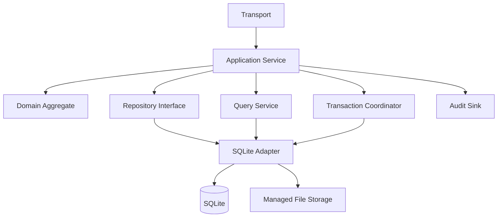

# Milestone 03: Identity, Persistence, and Migrations

- **Roadmap version:** 0.1
- **Milestone status:** Complete
- **Last updated:** 2026-08-18
- **Risk classification:** Persistence / Critical
- **Implementation authority:** Additive ChannelForge persistence scaffolding

## Purpose

This milestone introduces the first ChannelForge-owned persistence and identity
foundation.

It defines:

- ChannelForge identifier policy
- Identifier types
- Revision identifiers
- External identifier qualification
- Legacy identifier mapping
- SQLite schema additions
- Migration metadata
- Migration runner behavior
- Repository contracts
- Repository implementations
- Query services
- Transaction coordination
- Unit-of-work semantics
- Optimistic concurrency
- Write serialization
- Busy handling
- WAL and connection initialization
- Integrity enforcement
- Audit foundations
- Backup preflight
- Restore compatibility
- Restart-safe migration
- Rollback boundaries
- Compatibility reads
- Migration evidence
- Pull-request sequence
- Entry and completion gates
- Risks
- Deferred decisions

This milestone does not yet make ChannelForge persistence authoritative for every
domain.

It creates additive foundations that later milestones can adopt safely.

## Governing Specifications

This milestone is governed by:

- `docs/architecture/spec/01-terminology.md`
- `docs/architecture/spec/02-system-context.md`
- `docs/architecture/spec/03-domain-model.md`
- `docs/architecture/spec/05-media-catalog.md`
- `docs/architecture/spec/06-playout-and-output.md`
- `docs/architecture/spec/07-integrations.md`
- `docs/architecture/spec/08-persistence.md`
- `docs/architecture/spec/09-api.md`
- `docs/architecture/spec/11-security.md`
- `docs/architecture/spec/12-deployment.md`
- `docs/architecture/spec/13-testing.md`
- `docs/architecture/spec/14-migration.md`
- `docs/implementation/README.md`
- `docs/implementation/01-baseline-and-change-control.md`
- `docs/implementation/02-module-boundaries.md`

## Milestone Mission

ChannelForge must establish stable internal identity before domain migration.

The persistence milestone must:

- Introduce ChannelForge-owned opaque identifiers
- Preserve legacy identifiers through explicit mappings
- Keep inherited data readable
- Avoid destructive schema conversion
- Keep schema evolution ordered and auditable
- Ensure migrations are restart-safe
- Ensure migrations are backup-aware
- Keep provider calls outside write transactions
- Keep FFmpeg outside write transactions
- Keep transactions short
- Enforce foreign keys
- Enforce explicit deterministic ordering
- Support optimistic concurrency
- Support immutable revisions
- Support immutable Schedule Plans
- Support one primary SQLite writer
- Support concurrent reads
- Preserve historical references
- Preserve rollback until cutover gates close
- Make repository ownership align with module ownership
- Prevent new domain code from depending on raw tables
- Record every migration decision and result

## Product Principle

The governing product principle remains:

> Build television networks, not playlists.

Stable ChannelForge identity allows Networks, Channels, Catalog Items,
Programming Revisions, and Schedule Plans to exist independently of inherited
playlist-oriented data structures.

## Current Persistence Baseline

The inherited runtime currently uses SQLite and includes multiple persistence
libraries.

Known server dependencies include:

- Better SQLite3
- Kysely
- Drizzle ORM
- LowDB

Milestone 01 must identify actual ownership and use.

Milestone 03 must not assume every listed dependency remains necessary.

## Version 1 Persistence Decision

SQLite remains the authoritative version 1 database.

Version 1 does not require:

- PostgreSQL
- MySQL
- Redis
- Distributed transactions
- Distributed locks
- Multi-primary writes
- Horizontal application scaling
- External message queue
- Event sourcing as the primary persistence model

## Persistence Principles

1. Domain services depend on repositories.
2. Repositories do not expose raw database rows.
3. SQLite remains implementation detail.
4. Transactions align with application use cases.
5. External network calls do not occur in write transactions.
6. FFmpeg does not execute in write transactions.
7. Immutable revisions remain immutable.
8. Approved Schedule Plans remain immutable.
9. Migrations are ordered.
10. Migrations are tracked.
11. Migrations are restart-safe.
12. Migrations are observable.
13. Backups precede critical conversion.
14. Rollback is explicit.
15. Historical references survive archival.
16. Derived projections can be rebuilt.
17. Read ordering is deterministic.
18. Foreign keys are enabled.
19. Database connections are bounded.
20. Write lock duration is minimized.
21. Legacy data remains preserved until retirement approval.
22. Provider identifiers never become unqualified ChannelForge identity.
23. Human-readable keys are not primary keys.
24. Audit references survive lifecycle changes.
25. Secret material is not stored in ordinary domain tables.

## Scope

Milestone 03 covers:

- Additive schema
- Identifier scaffolding
- Migration metadata
- Legacy identity mappings
- Repository infrastructure
- Transaction coordination
- Concurrency
- Integrity
- Backup preflight
- Migration execution
- Persistence testing
- Compatibility support

## Non-Goals

Milestone 03 does not require:

- Final Media Source schema
- Final Catalog schema
- Final Network schema
- Final Channel schema
- Final Scheduling schema
- Final Publication schema
- Final Playout schema
- Legacy write freeze
- Legacy table deletion
- Full provider migration
- Full API migration
- Full UI migration
- PostgreSQL abstraction completion
- Distributed outbox
- Multi-process worker
- Public release migration

## Identity Foundation

Every persistent entity owned by ChannelForge must have a ChannelForge-owned
identifier.

## Identifier Properties

A ChannelForge identifier must be:

- Opaque
- Stable
- Collision resistant
- Independent of row order
- Independent of provider identity
- Independent of legacy Tunarr identity
- Safe to expose where authorization permits
- Serializable
- Comparable for equality
- Preservable through export and import where supported
- Validatable without database access

## Identifier Non-Properties

A ChannelForge identifier must not be assumed to be:

- Sequential
- Numeric
- Time sortable
- Human meaningful
- Provider meaningful
- Globally unique outside documented scope
- Reusable after deletion
- Mutable

## Identifier Format Decision

Recommended initial format:

```text
UUID
```

Acceptable UUID variants include:

- UUIDv4
- UUIDv7

The exact variant requires one implementation decision.

## Identifier Variant Criteria

Choose based on:

- Collision safety
- Library support
- SQLite indexing behavior
- API compatibility
- Export compatibility
- Test determinism
- Operational readability
- Future migration

## UUIDv4 Considerations

Advantages:

- Broad library support
- Opaque
- Mature
- No embedded time
- Easy generation

Tradeoffs:

- Random insertion order
- Larger B-tree locality cost
- No natural creation ordering

## UUIDv7 Considerations

Advantages:

- Time-ordered insertion
- Better index locality
- Broadening ecosystem support
- Still opaque enough for API use

Tradeoffs:

- Timestamp information
- Newer library ecosystem
- Potential accidental ordering assumptions

## Identifier ADR Threshold

An ADR is required when selecting a non-UUID identifier format.

## Identifier Type Safety

Identifiers should use branded TypeScript types.

Example:

```ts
declare const networkIdBrand: unique symbol;

export type NetworkId = string & {
  readonly [networkIdBrand]: true;
};
```

## Identifier Constructors

Each identifier type should expose:

- `generate`
- `parse`
- `tryParse`
- `toString`
- Optional test fixture constructor

## Identifier Constructor Rule

Parsing validates syntax.

Parsing does not verify database existence.

## Identifier Examples

Initial identifier types include:

- `InstanceId`
- `UserId`
- `ApiCredentialId`
- `MediaSourceId`
- `LibraryBindingId`
- `CatalogItemId`
- `SourceBindingId`
- `PlaybackVariantId`
- `NetworkId`
- `NetworkProfileRevisionId`
- `ChannelId`
- `ChannelProfileRevisionId`
- `BrandingProfileId`
- `BrandingRevisionId`
- `ProgrammingConfigurationId`
- `ProgrammingConfigurationRevisionId`
- `SchedulePlanId`
- `ScheduleEntryId`
- `SchedulePublicationId`
- `PlayoutSessionId`
- `BackgroundJobId`
- `HealthSnapshotId`
- `TemplateId`
- `TemplateRevisionId`
- `ProgrammingPackId`
- `PluginInstallationId`
- `MigrationRunId`
- `MigrationConflictId`
- `AuditRecordId`
- `ArtifactId`

## Identifier Ownership

The owning module defines its identifier type.

The shared kernel may define generic identifier primitives.

The shared kernel must not own every feature-specific identifier.

## Identifier Storage

Recommended SQLite representation:

```text
TEXT
```

The exact representation must be consistent.

## Identifier Storage Invariants

- Non-null for owned persistent entities
- Unique where entity identity requires it
- Never silently regenerated
- Never derived from mutable fields
- Never reused
- Foreign keys reference the exact stored value
- Case normalization is explicit

## Case Policy

Canonical identifiers should use one case representation.

For UUIDs:

```text
lowercase canonical text
```

is recommended.

## Identifier Validation

Database constraints should reject malformed identifiers where practical.

Application parsing remains mandatory.

## Human-Readable Keys

Human-readable keys include:

- Network slug
- Channel number
- Call sign
- Display name
- Template name
- Artifact file name

They are not primary identifiers.

## Human-Key Uniqueness

Uniqueness is scope-specific.

Examples:

- Active Channel number unique within an instance
- Network slug unique among non-archived Networks
- Template name may repeat across publishers
- Artifact file name may repeat across generations

## External Identifiers

External identifiers must be qualified.

## External Identifier Components

A qualified external identity includes:

- Provider type
- Configured Media Source instance
- External entity type
- External identifier value
- Optional external parent identity
- Optional external version token

## External Identifier Value Object

Example:

```ts
export type QualifiedExternalId = {
  mediaSourceId: MediaSourceId;
  providerType: MediaProviderType;
  entityType: ExternalEntityType;
  value: string;
};
```

## External Identifier Invariants

- Value cannot be interpreted without source instance
- Provider type must match Media Source
- Empty values are invalid
- Normalization is provider-specific
- Case sensitivity is provider-specific
- Same value may exist on multiple sources
- Provider reinstall behavior is explicit
- External value never replaces ChannelForge identity

## Legacy Identifiers

Legacy identifiers are compatibility references.

They remain necessary during migration.

## Legacy Identifier Components

A legacy mapping includes:

- Legacy namespace
- Legacy entity type
- Legacy identifier value
- ChannelForge entity type
- ChannelForge identifier
- Mapping status
- Source migration run
- Created timestamp
- Verified timestamp
- Conflict reference
- Notes or evidence reference

## Legacy Namespace

Initial namespace:

```text
tunarr
```

Future namespaces may include:

- Import pack
- External backup
- Earlier ChannelForge version
- Third-party migration tool

## Legacy Mapping Table

Suggested conceptual table:

```text
legacy_identity_mapping
```

## Legacy Mapping Fields

```text
mapping_id
legacy_namespace
legacy_entity_type
legacy_identifier
channelforge_entity_type
channelforge_identifier
mapping_status
migration_run_id
created_at
verified_at
conflict_id
metadata_json
```

## Mapping Unique Constraints

Recommended constraints:

```text
UNIQUE (
  legacy_namespace,
  legacy_entity_type,
  legacy_identifier
)
```

and:

```text
UNIQUE (
  legacy_namespace,
  legacy_entity_type,
  channelforge_entity_type,
  channelforge_identifier
)
```

The second constraint may require refinement for split or merge mappings.

## Mapping Cardinality

Supported mapping cardinalities must be explicit:

- One legacy to one ChannelForge
- Many legacy to one ChannelForge
- One legacy to many ChannelForge
- Unmapped
- Conflict
- Ignored

## Mapping Status

Suggested values:

- `PENDING`
- `MAPPED`
- `VERIFIED`
- `CONFLICT`
- `IGNORED`
- `SUPERSEDED`
- `ROLLED_BACK`

## Mapping Conflict

A conflict occurs when:

- One legacy ID maps to multiple active targets unexpectedly
- One target receives incompatible legacy identities
- Entity type does not match
- Legacy data is incomplete
- Required parent mapping is missing
- Uniqueness constraint would be violated
- Existing verified mapping disagrees

## Mapping Immutability

Verified mappings should not be edited in place casually.

Correction should record:

- Prior mapping
- New mapping
- Reason
- Actor
- Migration run
- Timestamp

## Revision Identity

Mutable configuration uses immutable revisions.

## Revision Concepts

Revisioned concepts include:

- Network Profile
- Channel Profile
- Branding Profile
- Programming Configuration
- Output Profile where applicable

## Revision Fields

Recommended common fields:

```text
revision_id
owner_id
revision_number
status
created_at
created_by
activated_at
supersedes_revision_id
content_hash
```

## Revision Number

Revision number may be sequential within one owner.

It is not the primary identifier.

## Revision Status

Suggested values:

- `DRAFT`
- `ACTIVE`
- `SUPERSEDED`
- `ARCHIVED`
- `INVALID`

## Revision Immutability

After activation:

- Content cannot change
- Hash cannot change
- Parent reference cannot change
- Created timestamp cannot change

Status metadata may transition according to lifecycle policy.

## Revision Hash

A deterministic content hash supports:

- Change detection
- Generation evidence
- Duplicate detection
- Audit
- Migration verification

## Canonical Serialization

Hashing requires canonical serialization.

Canonical serialization must define:

- Property ordering
- Array ordering
- Number formatting
- Time formatting
- Null handling
- Omitted fields
- Identifier case
- Unicode normalization

## Revision Concurrency

Creating a new revision should require the caller's expected active revision.

## Optimistic Concurrency

ChannelForge uses optimistic concurrency for mutable aggregates.

## Concurrency Token

A mutable aggregate should expose:

- Revision number
- Version integer
- Updated timestamp
- ETag
- Or equivalent token

## Recommended Token

Recommended persistence token:

```text
version INTEGER NOT NULL
```

## Update Pattern

Example:

```sql
UPDATE network
SET
  display_name = ?,
  version = version + 1,
  updated_at = ?
WHERE
  network_id = ?
  AND version = ?;
```

## Concurrency Result

If affected rows equal zero:

- Resource may be missing
- Expected version may be stale
- Authorization may have changed
- Lifecycle state may reject update

The repository must distinguish outcomes where practical.

## ETag Mapping

API ETags may derive from:

- Version integer
- Revision identifier
- Content hash
- Stable combination

The mapping must be documented.

## Immutable Entity Concurrency

Immutable entities do not use update concurrency.

Creation uniqueness and idempotency protect them.

## Idempotency

Critical creation commands should support idempotency.

## Idempotency Record

Suggested conceptual table:

```text
idempotency_record
```

## Idempotency Fields

```text
idempotency_key
scope
actor_id
request_hash
result_reference
status
created_at
expires_at
```

## Idempotency Scope

Examples:

- API credential creation
- Network creation
- Schedule generation request
- Publication request
- Migration start
- Backup request

## Idempotency Collision

Same key with different request hash returns conflict.

## Persistence Architecture

The target persistence flow is:



## Persistence Module Placement

Recommended infrastructure paths:

```text
server/src/infrastructure/database/
├── connection/
├── migrations/
├── transactions/
├── integrity/
├── backup/
├── query/
└── testing/
```

Module-owned repositories may live under:

```text
server/src/modules/<module>/adapters/persistence/sqlite/
```

## Repository Interface Placement

Repository interfaces live in the owning module.

Example:

```text
server/src/modules/networks/ports/network-repository.ts
```

## Repository Implementation Placement

Repository implementation may live:

```text
server/src/modules/networks/adapters/persistence/sqlite-network-repository.ts
```

or:

```text
server/src/infrastructure/database/repositories/sqlite-network-repository.ts
```

The implementation must satisfy the module-owned port.

## Repository Contract

A repository contract should define:

- Get by ID
- Require by ID where appropriate
- Save new aggregate
- Update mutable aggregate with expected version
- Archive or lifecycle operation
- Existence check
- Pagination only when aggregate listing is part of ownership

## Repository Non-Responsibilities

Repositories do not:

- Authorize requests
- Call providers
- Generate schedules
- Start FFmpeg
- Serialize HTTP responses
- Compose XMLTV
- Publish domain events before commit
- Hide long-running transactions

## Query Services

Read-heavy workflows may use query services.

## Query Service Responsibilities

- Projection reads
- Joined reads
- Search
- Pagination
- Reporting
- Guide read models
- Operational diagnostics
- Migration verification

## Query Service Restrictions

Query services are read-only.

They do not mutate through query-builder side effects.

## Domain Mapping

Persistence adapters map:

- Database record to domain
- Domain to database write
- Database error to persistence error

## Mapping Rule

Database nullability does not automatically define domain optionality.

Domain invariants remain authoritative.

## Record Naming

Persistence records use explicit suffixes:

- `NetworkRecord`
- `ChannelRecord`
- `CatalogItemRecord`
- `SchedulePlanRecord`
- `MigrationRunRecord`

## SQL Naming

Recommended table naming:

```text
snake_case
```

Recommended column naming:

```text
snake_case
```

## Timestamp Storage

Persisted instants use UTC.

Recommended representation:

```text
ISO 8601 UTC text
```

or:

```text
integer epoch milliseconds
```

The exact format must be consistent.

## Timestamp Decision Criteria

- Ordering
- Precision
- Human inspection
- SQLite functions
- JavaScript safety
- Migration compatibility
- Time-zone neutrality

## Duration Storage

Durations should use integer milliseconds unless stronger precision is required.

## Boolean Storage

SQLite boolean values use integer constraints.

Example:

```sql
enabled INTEGER NOT NULL CHECK (enabled IN (0, 1))
```

## Enum Storage

Enums use text with validation.

Possible enforcement:

- `CHECK`
- Application validation
- Both

## JSON Storage

JSON may be used for:

- Immutable snapshots
- Provenance payload
- Migration metadata
- Adapter-specific capability observations
- Diagnostics

JSON must not replace queryable relational structure without justification.

## JSON Invariants

- Schema version required where long-lived
- Canonical serialization where hashed
- Size bounded
- Secrets excluded
- Validation required on read
- Migration strategy defined

## Table Categories

ChannelForge tables fall into:

- Authoritative aggregate tables
- Immutable revision tables
- Immutable plan tables
- Mapping tables
- Job tables
- Audit tables
- Migration tables
- Derived projection tables
- Idempotency tables
- Operational lease tables

## Initial Additive Tables

Milestone 03 may introduce:

- `cf_instance`
- `cf_schema_migration`
- `cf_migration_run`
- `cf_migration_step`
- `cf_migration_checkpoint`
- `cf_migration_conflict`
- `cf_legacy_identity_mapping`
- `cf_idempotency_record`
- `cf_audit_record`
- `cf_outbox_event` only if approved
- `cf_integrity_check`
- `cf_backup_record`

The `cf_` prefix is an implementation option during coexistence.

## Prefix Decision

A temporary prefix helps distinguish ChannelForge-owned tables from inherited
tables.

The exact prefix must be documented.

## Prefix Tradeoffs

Advantages:

- Clear coexistence
- Easier inventory
- Easier rollback
- Easier accidental query detection

Tradeoffs:

- Naming cleanup later
- Longer SQL
- Potential permanent temporary naming

## Prefix Removal

Prefix removal is not required for version 1.

## Schema Ownership

Every ChannelForge table has one owning module.

## Schema Ownership Registry

Create:

```text
docs/implementation/persistence/schema-ownership.md
```

Suggested columns:

| Table | Owning module | Authoritative | Mutable | Migration owner | Retention |
| --- | --- | --- | --- | --- | --- |

## Migration Metadata Tables

Migration execution must be durable.

## Schema Migration Table

Conceptual fields:

```text
migration_id
migration_name
checksum
status
started_at
completed_at
failed_at
application_version
baseline_commit
error_summary
```

## Schema Migration Status

Suggested values:

- `PENDING`
- `RUNNING`
- `APPLIED`
- `FAILED`
- `ROLLED_BACK`
- `SKIPPED`

## Migration Checksum

Migration source checksum detects modified applied migrations.

## Applied Migration Immutability

An applied migration file must not be edited.

Corrections require a new migration.

## Migration Run

A Migration Run tracks one higher-level data transition.

## Migration Run Fields

```text
migration_run_id
migration_type
status
source_version
target_version
started_at
completed_at
failed_at
initiated_by
backup_id
baseline_commit
application_version
current_step
statistics_json
error_summary
```

## Migration Run Status

Suggested values:

- `PLANNED`
- `PREFLIGHT`
- `READY`
- `RUNNING`
- `PAUSED`
- `FAILED`
- `ROLLING_BACK`
- `ROLLED_BACK`
- `COMPLETED`
- `COMPLETED_WITH_WARNINGS`
- `ABORTED`

## Migration Step

A Migration Run consists of steps.

## Migration Step Fields

```text
migration_step_id
migration_run_id
step_key
sequence_number
status
started_at
completed_at
attempt_count
input_cursor
output_cursor
processed_count
success_count
warning_count
failure_count
error_summary
```

## Migration Step Status

- `PENDING`
- `RUNNING`
- `PAUSED`
- `FAILED`
- `COMPLETED`
- `SKIPPED`
- `ROLLED_BACK`

## Migration Checkpoint

A checkpoint stores restart position.

## Checkpoint Fields

```text
migration_run_id
step_key
cursor_type
cursor_value
last_source_identity
last_target_identity
processed_count
updated_at
```

## Checkpoint Rules

- Persist after bounded batch
- Persist after each critical mapping
- Persist before external side effect
- Persist after transaction commit
- Must be idempotent
- Must not contain secrets
- Must survive restart

## Migration Conflict

A conflict is durable operator-review state.

## Conflict Fields

```text
migration_conflict_id
migration_run_id
step_key
conflict_type
source_reference
candidate_targets_json
status
detected_at
resolved_at
resolved_by
resolution
evidence_json
```

## Conflict Status

- `OPEN`
- `AUTO_RESOLVED`
- `OPERATOR_RESOLVED`
- `IGNORED`
- `SUPERSEDED`
- `ROLLED_BACK`

## Migration Statistics

Statistics should include:

- Source rows inspected
- Rows mapped
- Rows created
- Rows updated
- Rows skipped
- Conflicts
- Warnings
- Failures
- Duration
- Batch count
- Checkpoint count

## Migration Runner

The migration runner owns schema and controlled data migration execution.

## Migration Runner Responsibilities

- Discover migrations
- Order migrations
- Verify checksum
- Acquire migration exclusivity
- Run preflight
- Verify backup requirement
- Apply step
- Record status
- Record failure
- Release exclusivity
- Resume restart-safe work
- Prevent downgrade
- Expose diagnostics

## Migration Runner Non-Responsibilities

- Provider synchronization
- Schedule generation
- FFmpeg
- HTTP route orchestration
- Silent conflict resolution
- Legacy deletion without approval

## Migration Exclusivity

Only one schema migration process may run at a time.

## Exclusivity Mechanisms

Possible mechanisms:

- SQLite exclusive transaction
- Durable migration lease
- Process-level lock plus database record
- File lock plus database verification

Exact mechanism must be tested on:

- Windows
- Linux
- Docker volume
- Unraid storage

## Exclusivity Failure

If lock cannot be obtained:

- Startup must not run migration concurrently
- Readiness remains false
- Diagnostics identify lock owner where possible
- Operator action is clear

## Startup Migration Policy

Startup may apply safe schema migrations automatically.

Critical data migrations may require explicit operator approval.

## Automatic Migration Criteria

An automatic migration must be:

- Additive
- Bounded
- Restart-safe
- Tested
- Backup-compatible
- Non-destructive
- Fast enough for startup policy
- Observable

## Manual Migration Criteria

Manual approval required for:

- Large data rewrite
- Legacy write freeze
- Identity remap
- Secret migration
- Destructive cleanup
- Long-running backfill
- Backup format change
- Active publication cutover

## Migration Preflight

Preflight checks occur before mutation.

## Preflight Checks

- Database exists
- Database writable
- Required free space
- SQLite integrity
- Foreign keys
- Journal mode compatibility
- Application version
- Source schema version
- Target schema version
- Migration checksum
- No conflicting migration
- Backup availability
- Backup verification
- Required files accessible
- Required permissions
- No unsupported downgrade
- No unresolved critical conflict
- No active write freeze conflict

## Free-Space Policy

Preflight should estimate:

- Database growth
- WAL growth
- Backup size
- Temporary file use
- Asset migration size

## Integrity Preflight

Recommended checks:

```sql
PRAGMA quick_check;
PRAGMA foreign_key_check;
```

A full integrity check may run based on risk.

## Backup Preflight

Critical migrations require a backup record.

## Backup Record Fields

```text
backup_id
created_at
created_by
application_version
schema_version
database_path
database_size
asset_manifest_hash
backup_path
backup_size
checksum
verification_status
retention_until
migration_run_id
```

## Backup Verification Status

- `CREATING`
- `CREATED`
- `VERIFYING`
- `VERIFIED`
- `FAILED`
- `EXPIRED`
- `DELETED`

## Backup Requirements

A migration backup must include:

- SQLite database
- WAL state handled consistently
- Managed assets required by migrated state
- Manifest
- Checksums
- Version metadata
- Restore instructions

## SQLite Backup Mechanism

Preferred options:

- SQLite online backup API
- `VACUUM INTO`
- Checkpoint plus safe copy where validated

Raw file copy while active is prohibited unless validated for the exact journal
mode and checkpoint procedure.

## Backup Naming

Backup names should include:

- Timestamp
- Application version
- Schema version
- Migration Run ID

## Backup Retention

Retention must preserve rollback through the supported window.

## Restore Compatibility

A backup manifest must declare:

- Minimum restore application
- Maximum tested restore application
- Schema version
- Required assets
- Checksum algorithm
- Encryption state

## Migration Batch Processing

Large data migrations use bounded batches.

## Batch Criteria

Choose batch size based on:

- Lock duration
- Row size
- WAL growth
- Checkpoint cost
- Test performance
- Memory
- Retry behavior

## Batch Transaction Rule

Each batch:

1. Reads bounded source records.
2. Translates outside write transaction where possible.
3. Begins write transaction.
4. Writes target records.
5. Writes mappings.
6. Writes checkpoint.
7. Commits.
8. Emits progress after commit.

## Provider Call Prohibition

No provider call occurs during schema or data migration transaction.

## File Operation Rule

File copy or hash may occur outside database write transaction.

Database references become authoritative only after file verification.

## Idempotent Migration Step

A migration step is idempotent when re-execution:

- Does not duplicate target entity
- Does not duplicate mapping
- Does not overwrite verified state incorrectly
- Resumes from checkpoint
- Produces same final state
- Detects incompatible prior partial state

## Idempotency Strategies

- Unique constraints
- Upsert with expected state
- Mapping lookup
- Content hash
- Checkpoint
- Deterministic target ID
- Run-scoped work table

## Deterministic Target ID

A migration may generate target identifiers once and persist mappings.

It should not regenerate new IDs on retry.

## Deterministic ID Derivation

Deriving UUIDs from legacy identity may be considered.

Tradeoffs:

- Stable retries
- Reproducible mapping
- Potential identity correlation
- Namespace management
- Collision policy

The default strategy should be generated ID plus durable mapping.

## Migration Resume

On startup:

1. Detect incomplete run.
2. Verify application compatibility.
3. Verify migration checksum.
4. Verify backup record.
5. Verify last checkpoint.
6. Reconcile last batch.
7. Resume or require operator action.

## Last Batch Reconciliation

A crash may occur after commit but before checkpoint reporting.

The migration must distinguish:

- Target committed
- Mapping committed
- Checkpoint committed
- Progress event emitted

## Transaction Atomicity

Target write, mapping write, and checkpoint update should share one transaction
when they represent one batch.

## Migration Failure

On failure:

- Record error summary
- Preserve detailed sanitized diagnostics
- Mark step failed
- Mark run failed or paused
- Keep backup
- Keep mappings
- Keep checkpoint
- Do not continue silently
- Do not delete source state

## Migration Pause

Long migrations may support pause between batches.

## Migration Cancellation

Cancellation must be safe.

A cancellation request:

- Stops after current transaction
- Records checkpoint
- Marks status
- Preserves backup
- Does not roll back committed batches automatically

## Migration Rollback

Rollback must be defined per migration.

## Rollback Categories

- Metadata-only rollback
- Target-table cleanup
- Mapping rollback
- Active-pointer rollback
- Backup restore
- Forward-fix only

## Forward-Fix Migration

Some migrations may be forward-fix only after cutover.

This requires:

- Explicit declaration
- Backup
- Approval
- Release note
- Tested recovery

## Rollback Preconditions

- Supported rollback window open
- Backup available
- No incompatible new writes
- Target state not externally depended upon
- Operator authorized
- Application version compatible

## Rollback Evidence

Record:

- Requested by
- Started at
- Completed at
- Restored backup
- Rows removed
- Mappings reverted
- Conflicts
- Verification result

## Schema Migration File Naming

Suggested pattern:

```text
YYYYMMDDHHMMSS_description.ts
```

or:

```text
0001_description.ts
```

The repository should use one ordered convention.

## Schema Migration Interface

Example:

```ts
export interface SchemaMigration {
  id: string;
  description: string;
  checksum: string;
  up(context: MigrationContext): Promise<void>;
  down?: (context: MigrationContext) => Promise<void>;
}
```

## Down Migration Policy

Production rollback should not assume every migration has a `down`.

A backup restore may be safer.

## Migration Checksum Generation

Checksum includes canonical migration source or declared SQL content.

## Modified Applied Migration

If applied checksum differs:

- Readiness fails
- Migration does not proceed
- Diagnostic names migration
- Operator must restore original or apply documented repair

## Schema Version

The Instance aggregate records active schema version.

Migration metadata remains the authoritative history.

## Application Version Compatibility

Startup must verify:

- Application supports current schema
- Schema is not ahead beyond supported range
- Required migrations are available
- Downgrade is not implicit

## Database Naming

During coexistence, ChannelForge-owned tables should use explicit naming.

## Database Connection Initialization

Every connection must apply required pragmas.

## Required Pragmas

At minimum evaluate:

- `foreign_keys`
- `journal_mode`
- `busy_timeout`
- `synchronous`
- `temp_store`
- `cache_size`
- `wal_autocheckpoint`

## Foreign Keys

Foreign-key enforcement must be enabled for every connection.

## Foreign-Key Verification

Initialization should verify:

```sql
PRAGMA foreign_keys;
```

Expected:

```text
1
```

## Foreign-Key Failure

If enforcement cannot be confirmed:

- Writes must not proceed
- Readiness remains false
- Diagnostics identify cause

## Journal Mode

WAL is preferred where deployment storage supports it.

## WAL Validation

Validate:

- Local filesystem
- Docker bind mount
- Docker named volume
- Unraid share
- Network filesystem if supported
- Windows development filesystem

## Unsupported WAL Storage

If storage does not support safe WAL behavior:

- Use documented alternative
- Warn operator
- Adjust concurrency expectations
- Test backup behavior
- Record health finding

## Busy Timeout

Every connection uses a bounded busy timeout.

## Busy Retry

Busy retry should be:

- Bounded
- Jittered where useful
- Logged at debug or warning threshold
- Classified
- Not applied to every error
- Not unbounded

## Write Serialization

Version 1 assumes one application instance.

Within the process, writes may be coordinated.

## Write Coordinator

A write coordinator may provide:

- Queue
- Priority
- Cancellation
- Timeout
- Metrics
- Shutdown drain

## Write Priority

Possible priorities:

- Critical publication
- Migration
- User command
- Background synchronization
- Cleanup
- Projection rebuild

Priority policy must avoid starvation.

## Read Connections

Read connections should:

- Remain bounded
- Use short transactions
- Avoid blocking checkpoint indefinitely
- Use stable ordering
- Use indexes

## Write Connection

The write connection should:

- Be owned by infrastructure
- Apply required pragmas
- Use explicit transactions
- Close on shutdown
- Avoid hidden nesting

## Connection Pool

SQLite may use:

- Single shared connection
- One write plus bounded reads
- Connection-per-operation with strict initialization

Exact model requires testing.

## Transaction Coordinator

The application layer requests transactions through a coordinator.

## Transaction Coordinator Interface

Example:

```ts
export interface TransactionCoordinator {
  run<T>(
    operation: (context: TransactionContext) => Promise<T>,
    options?: TransactionOptions,
  ): Promise<T>;
}
```

## Transaction Context

Contains:

- Transaction-scoped repositories
- Correlation ID
- Optional actor reference
- Start time
- Deadline
- Retry metadata

## Transaction Options

Possible fields:

- Mode
- Timeout
- Retry policy
- Name
- Read-only
- Priority

## Transaction Modes

SQLite modes may include:

- Deferred
- Immediate
- Exclusive

Use must be explicit.

## Default Write Mode

`IMMEDIATE` may be appropriate for predictable write-lock acquisition.

The exact default requires testing.

## Nested Transactions

Nested transactions are prohibited unless implemented through savepoints.

## Savepoints

Savepoints may support module-local composition.

They must not hide long transactions.

## External Call Guard

Transaction context should not expose provider clients.

Code review and architecture tests should enforce no provider calls during
transactions.

## Transaction Duration

Set a target threshold.

Suggested initial warning threshold:

```text
250 milliseconds
```

This is a planning target, not a universal failure threshold.

## Long Transaction Metrics

Record:

- Operation
- Duration
- Lock wait
- Rows affected
- Retry count
- Correlation ID

## Transaction Error Categories

- Busy
- Constraint
- Foreign key
- Unique
- Check
- Not null
- Corruption
- I/O
- Disk full
- Permission
- Interrupted
- Unknown

## Persistence Error Translation

Adapters translate SQLite errors into stable persistence errors.

## Constraint Translation

Examples:

- Duplicate Channel number
- Duplicate Network slug
- Stale version
- Missing parent
- Invalid lifecycle state
- Duplicate legacy mapping

## Query Ordering

Every query that influences behavior must include explicit order.

## Behavioral Ordering

Behavioral queries include:

- Scheduling candidates
- Episode order
- Channel lineup
- Migration batches
- Job queue
- Publication selection
- Fallback selection
- Artifact listing

## Pagination

Use stable pagination.

Recommended:

- Cursor-based for large mutable collections
- Offset only for bounded administrative lists

## Cursor Composition

Cursor should include:

- Ordered field
- Unique tie-breaker
- Optional filter fingerprint

## Projection Tables

Derived projections may support:

- Catalog search
- Channel guide
- Active publication lookup
- Health metrics
- Operational dashboard

## Projection Rebuild

A projection must define:

- Source tables
- Rebuild command
- Rebuild status
- Failure behavior
- Cutover
- Verification

## Projection Authority

Projection is never authoritative unless explicitly specified.

## Audit Foundation

Milestone 03 introduces audit persistence scaffolding.

## Audit Record Fields

```text
audit_record_id
occurred_at
actor_type
actor_id
action
resource_type
resource_id
correlation_id
request_id
result
metadata_json
```

## Audit Exclusions

Do not store:

- Raw credential
- Provider token
- Session secret
- Plugin secret
- Private key
- Full media path unless policy permits

## Audit Immutability

Audit records are append-only.

## Audit Retention

Retention policy is configured and documented.

## Audit Failure

Critical security actions may fail closed when audit cannot be recorded.

Exact policy requires security milestone integration.

## Integrity Checks

Persistence infrastructure should support:

- Quick check
- Full integrity check
- Foreign-key check
- Orphan scan
- Managed-file verification
- Mapping consistency
- Revision hash verification
- Publication reference verification

## Integrity Check Record

Suggested table:

```text
cf_integrity_check
```

## Integrity Check Fields

```text
integrity_check_id
check_type
status
started_at
completed_at
database_version
finding_count
summary_json
```

## Integrity Status

- `RUNNING`
- `PASSED`
- `PASSED_WITH_WARNINGS`
- `FAILED`
- `CANCELLED`

## Integrity Finding

Findings should be durable when they require action.

## Managed File References

Database records may reference managed files.

## Managed File Fields

- Artifact ID
- Logical type
- Relative path
- Checksum
- Size
- Created timestamp
- Owner reference
- Retention state
- Encryption state

## Path Rule

Store relative managed paths, not arbitrary host absolute paths, where possible.

## File Commit Protocol

For authoritative file publication:

1. Write temporary file.
2. Flush and close.
3. Validate.
4. Compute checksum.
5. Move atomically into managed path.
6. Commit database reference.
7. Delete previous file only after retention policy permits.

## Database/File Atomicity

SQLite and filesystem cannot share one transaction.

Use staged state and reconciliation.

## File State

Suggested values:

- `STAGING`
- `READY`
- `ACTIVE`
- `SUPERSEDED`
- `MISSING`
- `CORRUPT`
- `DELETED`

## Secret Storage Reference

Domain tables store secret references.

Secret material remains behind Secret Service.

## Secret Reference Fields

- Secret reference ID
- Secret type
- Owner module
- Owner entity ID
- Version
- Created timestamp
- Rotated timestamp
- Archived timestamp

## Secret Migration

Secret migration requires:

- Separate critical work item
- Encryption verification
- No plaintext logs
- Backup policy
- Rollback
- Sentinel test

## Compatibility Reads

Milestone 03 may introduce repositories that read:

- ChannelForge table first
- Legacy table second
- Mapping table to resolve identity

## Read Strategy

Possible strategies:

- New-first fallback
- Legacy-first shadow new
- Dual read compare
- Legacy-only adapter
- New-only

Strategy must be explicit per concept.

## Write Strategy

Possible strategies:

- Legacy authoritative
- ChannelForge authoritative
- Temporary dual write
- ChannelForge write with legacy projection
- Read-only migration

## Write Authority Matrix

Create:

```text
docs/implementation/persistence/write-authority.md
```

Suggested columns:

| Concept | Legacy writer | ChannelForge writer | Current authority | Cutover gate | Rollback |
| --- | --- | --- | --- | --- | --- |

## Dual Write Policy

Dual write is exceptional.

## Dual Write Requirements

- One authority identified
- Idempotency
- Reconciliation
- Failure behavior
- Metrics
- Rollback
- Removal milestone

## Partial Dual Write Failure

If one write succeeds and the other fails:

- Record reconciliation finding
- Return explicit outcome
- Do not pretend atomicity
- Retry safely
- Preserve authoritative state

## Legacy Projection

A compatibility projection may translate ChannelForge state into legacy shape.

It must be derived and rebuildable.

## Shadow Read

Shadow reads compare legacy and ChannelForge data.

## Shadow Read Finding

Record:

- Concept
- Legacy identity
- ChannelForge identity
- Legacy hash
- ChannelForge hash
- Difference category
- Timestamp
- Correlation ID

## Shadow Read Categories

- Equal
- Formatting difference
- Expected semantic difference
- Missing legacy
- Missing ChannelForge
- Identity mismatch
- Data mismatch
- Error

## Migration Metadata API

Administrative APIs may expose:

- Migration status
- Step status
- Progress
- Conflict count
- Backup status
- Rollback eligibility

They must not expose secrets.

## Migration Authorization

Only authorized administrators may:

- Start critical migration
- Pause
- Resume
- Resolve conflict
- Roll back
- Complete cutover

## Migration Audit

Every administrative migration action is audited.

## Persistence Observability

Required metrics include:

- Connection count
- Read latency
- Write latency
- Lock wait
- Busy retries
- Transaction duration
- Transaction failures
- Migration status
- Migration throughput
- Checkpoint age
- WAL size
- Checkpoint duration
- Backup duration
- Integrity findings
- Query slow count

## Persistence Logs

Structured fields:

- `module`
- `repository`
- `operation`
- `transactionName`
- `durationMs`
- `lockWaitMs`
- `retryCount`
- `rowsAffected`
- `migrationRunId`
- `migrationStep`
- `correlationId`

## SQL Logging

Production SQL logging must avoid:

- Secret values
- Tokens
- Passwords
- Full private paths
- Large metadata payloads

## Slow Query Threshold

Initial threshold may be:

```text
500 milliseconds
```

Exact threshold requires measurement.

## Backup Observability

Record:

- Start
- End
- Source size
- Backup size
- Checksum
- Verification
- Failure
- Retention

## Migration Progress

Progress should report:

- Step
- Batch
- Processed
- Remaining estimate
- Warnings
- Conflicts
- Throughput

## Estimate Policy

Progress estimates must be labeled estimates.

## SQLite Health

Health states:

- `HEALTHY`
- `DEGRADED`
- `READ_ONLY`
- `MIGRATION_REQUIRED`
- `MIGRATION_FAILED`
- `CORRUPT`
- `UNAVAILABLE`

## Readiness

Readiness should fail when:

- Required migration failed
- Schema ahead unsupported
- Foreign keys disabled
- Database unavailable
- Integrity critical failure
- Migration lock conflict
- Required backup preflight failed

## Liveness

Liveness may remain true during recoverable migration failure if process is
responsive.

## Persistence Testing

Milestone 03 requires dedicated persistence test layers.

## Unit Tests

Unit tests cover:

- Identifier parse
- Identifier generation shape
- Qualified external ID
- Mapping rules
- Revision hash
- Concurrency token
- Migration state transitions
- Error translation
- Canonical serialization

## Repository Contract Tests

Every repository implementation runs shared contract tests.

## Repository Contract Cases

- Save
- Get
- Not found
- Duplicate
- Update
- Stale version
- Archive
- Foreign key
- Transaction rollback
- Deterministic list order

## Transaction Tests

Test:

- Commit
- Rollback
- Busy retry
- Timeout
- Constraint failure
- Nested call
- Savepoint if supported
- Cancellation
- Long transaction metric
- Shutdown

## Migration Tests

Test:

- Empty database
- Current legacy fixture
- Prior supported fixture
- Interrupted migration
- Resume
- Modified checksum
- Duplicate mapping
- Conflict
- Batch restart
- Backup required
- Backup failure
- Disk full simulation
- Read-only database
- Foreign keys off
- Schema ahead
- Unsupported downgrade
- Rollback

## Windows Migration Tests

Test:

- File locking
- Backup path
- Rename
- Temporary file cleanup
- SQLite EBUSY
- Drive-letter paths
- Long paths where relevant

## Linux Migration Tests

Test:

- Container volume
- Signal interruption
- User permissions
- WAL
- Backup
- Atomic rename
- Restart

## Failure Injection

Inject:

- Crash after target write
- Crash after mapping write
- Crash before checkpoint
- Crash after checkpoint
- Busy database
- Corrupt row
- Missing parent mapping
- Disk full
- Permission denied
- Checksum mismatch

## Golden Migration Fixtures

Maintain sanitized fixtures for:

- Empty install
- Minimal legacy install
- Multiple Channels
- Custom shows
- Filler
- Provider sources
- Duplicate identifiers
- Archived records
- Invalid references
- Partial migration
- Completed migration

## Fixture Versioning

Fixture manifest includes:

- Source application version
- Source schema version
- Expected migration target
- Checksum
- Sanitization statement
- Expected findings

## Migration Determinism

The same fixture and migration version should produce equivalent canonical
target state.

Generated identifiers may differ only when mapping is persisted and canonical
comparison excludes allowed variance.

## Canonical Migration Comparison

Compare:

- Entity counts
- Mappings
- Content hashes
- Relationships
- Lifecycle
- Ordering
- Conflict set
- Publication references where included

## Performance Tests

Measure:

- Migration throughput
- Peak memory
- WAL growth
- Lock duration
- Backup duration
- Restore duration
- Large mapping lookup
- Repository query latency

## Performance Baselines

Record by fixture size:

- Small
- Medium
- Large
- Stress

## Data Volume Assumptions

Do not hard-code home-server scale without measurement.

## Query Plans

Critical queries should inspect:

```sql
EXPLAIN QUERY PLAN
```

## Index Policy

Indexes support:

- Primary lookup
- Foreign key traversal
- Unique constraints
- Active records
- Revision lookup
- Migration batch cursor
- Mapping lookup
- Job queue
- Publication lookup

## Index Review

Every index should state:

- Query served
- Selectivity
- Write cost
- Retention
- Migration impact

## Partial Indexes

Use where beneficial for:

- Active records
- Open conflicts
- Pending jobs
- Current revisions
- Unexpired idempotency

## Archive Semantics

Archive preserves identity and history.

## Hard Delete

Hard delete is restricted.

## Hard Delete Criteria

- Never referenced draft
- Temporary artifact
- Expired idempotency record
- Explicit retention cleanup
- Verified safe child ownership
- User removal policy where permitted

## Historical Reference Rule

Schedule, publication, migration, audit, and playout history must not disappear
because an entity is archived.

## Cascades

Cascade only for strictly owned child records.

## Default Foreign-Key Actions

- `RESTRICT` for historical references
- `CASCADE` for owned children
- `SET NULL` only where meaningful
- No accidental orphan

## Retention

Retention workers use bounded batches.

## Retention Audit

Critical deletion records:

- Policy
- Count
- Cutoff
- Actor or job
- Timestamp
- Verification

## Database Restore

Restore is an operator workflow.

## Restore Steps

1. Stop writes.
2. Validate backup manifest.
3. Verify checksum.
4. Preserve current failed state.
5. Restore database and assets.
6. Start compatible application version.
7. Run integrity checks.
8. Verify schema version.
9. Verify mappings.
10. Verify active publication.
11. Resume service.

## Restore Rehearsal

Critical migration cannot ship without tested restore.

## Restore Finding

Any mismatch creates a durable finding.

## Database Export

Export may be added later.

Milestone 03 only defines identity preservation expectations.

## Import Identity

Import may preserve ChannelForge ID when:

- Explicitly supported
- No collision
- Instance policy permits
- References are complete
- Audit records decision

Otherwise generate new ID and mapping.

## Multi-Instance Identity

ChannelForge IDs are unique within an instance.

Exports should include Instance ID and namespace.

## Instance Identity

Exactly one active Instance exists per deployment.

## Instance Bootstrap

Initial bootstrap must be idempotent.

## Instance Table

Suggested fields:

```text
instance_id
display_name
default_time_zone
setup_state
schema_version
application_version
created_at
updated_at
version
```

## Instance Bootstrap Rule

If no instance exists:

- Create one
- Persist generated ID
- Do not create second on retry

## Instance Duplicate

More than one active instance is integrity failure.

## Schema Scaffold Implementation

Milestone 03 should begin with infrastructure tables, not every domain table.

## Initial Migration Sequence

Suggested:

1. Migration metadata
2. Instance identity
3. Legacy identity mappings
4. Backup records
5. Integrity records
6. Audit foundation
7. Idempotency
8. Module repository support
9. First representative aggregate table

## Representative Aggregate

Choose one low-risk aggregate to prove repository patterns.

Candidates:

- Instance
- Migration Run
- Background Job metadata

Avoid using Network or Channel as first proof if it forces early cutover.

## Repository Proof

The representative repository must demonstrate:

- Branded ID
- Insert
- Read
- Version update
- Transaction rollback
- Error translation
- Contract test
- SQLite mapping

## Migration Proof

The representative migration must demonstrate:

- Ordered migration
- Checksum
- Applied status
- Restart
- Rollback or backup recovery
- Windows
- Linux

## Documentation Deliverables

Milestone 03 implementation should create:

```text
docs/implementation/persistence/
├── identifier-policy.md
├── schema-ownership.md
├── write-authority.md
├── transaction-policy.md
├── migration-runner.md
├── migration-state-machine.md
├── backup-and-restore.md
├── concurrency-policy.md
├── integrity-policy.md
├── legacy-identity-mapping.md
├── repository-contracts.md
├── query-ordering.md
├── decision-register.md
└── completion-report.md
```

## Identifier Policy Document

Must include:

- Format
- Case
- Storage
- Parsing
- Generation
- Export
- Import
- Test fixtures
- External ID qualification
- Legacy mapping

## Transaction Policy Document

Must include:

- Connection model
- Transaction modes
- Retry
- Timeout
- Nested transaction policy
- External call prohibition
- Metrics
- Shutdown

## Migration State Machine Document

Must include state transitions for:

- Run
- Step
- Conflict
- Backup
- Rollback

## Repository Contract Document

Must include:

- Naming
- Methods
- Error semantics
- Concurrency
- Transaction context
- Pagination
- Contract tests

## Recommended Pull-Request Sequence

## PR 03A: Identifier Primitives

Scope:

- Shared identifier primitive
- Module-owned branded identifiers
- Parse and generation
- Tests
- No schema change

## PR 03B: SQLite Connection Initialization

Scope:

- Connection factory
- Required pragmas
- Foreign-key verification
- Busy timeout
- Shutdown
- Tests on Windows and Linux

## PR 03C: Migration Metadata Schema

Scope:

- Migration table
- Migration Run
- Migration Step
- Checkpoint
- Conflict
- Checksums
- Additive migration only

## PR 03D: Migration Runner

Scope:

- Discovery
- Ordering
- Exclusivity
- Status
- Resume
- Failure recording
- Diagnostics
- No legacy data migration yet

## PR 03E: Backup Preflight

Scope:

- Backup record
- Backup creation
- Verification
- Manifest
- Restore test
- Critical migration gate

## PR 03F: Transaction Coordinator

Scope:

- Transaction interface
- SQLite implementation
- Retry
- Timeout
- Metrics
- Tests

## PR 03G: Repository Contract Harness

Scope:

- Repository conventions
- Contract-test utilities
- Error types
- Query ordering
- Representative repository

## PR 03H: Legacy Identity Mapping

Scope:

- Mapping table
- Mapping repository
- Cardinality
- Conflict
- Verification
- Tests

## PR 03I: Optimistic Concurrency

Scope:

- Version token
- Stale update handling
- ETag mapping policy
- Contract tests

## PR 03J: Audit and Integrity Foundations

Scope:

- Audit record
- Integrity record
- Quick check
- Foreign-key check
- No full security policy cutover

## PR 03K: Compatibility Read Proof

Scope:

- One representative new-first or legacy-first repository
- Mapping lookup
- Shadow comparison
- Metrics
- No write freeze

## PR 03L: Migration Fixture Suite

Scope:

- Sanitized fixtures
- Restart tests
- Failure injection
- Windows
- Linux
- Restore rehearsal

## PR 03M: Completion Report

Scope:

- Schema ownership
- Write authority
- Repository coverage
- Migration coverage
- Backup evidence
- Concurrency evidence
- Known risks

## Pull-Request Requirements

Every persistence pull request must state:

- Tables affected
- Owning module
- Migration ID
- Forward behavior
- Restart behavior
- Rollback
- Backup requirement
- Concurrency impact
- Lock impact
- Query ordering
- Test fixture
- Windows result
- Linux result
- Compatibility impact

## Persistence PR Prohibitions

Do not combine:

- Schema migration and broad UI work
- Migration runner and provider refactor
- Identifier change and package rebrand
- Backup implementation and legacy deletion
- Transaction coordinator and scheduler replacement
- Repository scaffold and full domain cutover
- Concurrency change and unrelated dependency update

## Entry Gates

Milestone 03 may begin when:

1. Milestone 01 baseline exists.
2. Milestone 02 boundaries exist or are accepted as implementation target.
3. Persistence stores are inventoried.
4. Current write authorities are known enough to avoid accidental cutover.
5. Current build passes.
6. Current test failures are tracked.
7. SQLite remains accepted for version 1.
8. Backup path is known.
9. No unresolved architecture contradiction blocks persistence work.
10. Roadmap branch remains documentation-only.

## Completion Gates

Milestone 03 is Complete when:

1. Identifier format is accepted.
2. Identifier parsing exists.
3. Identifier generation exists.
4. Module-owned branded identifiers exist for initial modules.
5. External identifiers are qualified.
6. Legacy mapping schema exists.
7. Mapping uniqueness is enforced.
8. Mapping conflicts are durable.
9. Revision identity policy exists.
10. Canonical serialization policy exists.
11. Optimistic concurrency policy exists.
12. Representative versioned aggregate works.
13. SQLite connection initialization exists.
14. Foreign keys are enabled and verified.
15. Busy timeout is configured.
16. Journal mode policy is implemented.
17. Connection count is bounded.
18. Transaction coordinator exists.
19. Nested transaction policy is enforced.
20. External calls are excluded from write transactions.
21. FFmpeg is excluded from write transactions.
22. Repository interfaces are module-owned.
23. Representative SQLite repository passes contract tests.
24. Query ordering policy is enforced.
25. Schema migration metadata exists.
26. Applied migration checksum is verified.
27. Migration exclusivity exists.
28. Failed migration is durable.
29. Incomplete migration is detected on restart.
30. Migration checkpoint exists.
31. Batch resume is tested.
32. Conflict state exists.
33. Backup preflight exists.
34. Backup verification exists.
35. Restore rehearsal passes.
36. Integrity checks exist.
37. Audit foundation exists.
38. Idempotency foundation exists or is explicitly deferred.
39. One compatibility read path uses mappings.
40. Shadow comparison is observable.
41. No legacy table is deleted.
42. No unsupported downgrade occurs.
43. Windows persistence tests pass or classified failures are tracked.
44. Linux persistence tests pass.
45. Failure injection passes.
46. Disk-full behavior is tested or recorded.
47. Permission failure behavior is tested.
48. Migration fixture suite exists.
49. Schema ownership registry exists.
50. Write-authority matrix exists.
51. Transaction policy exists.
52. Migration state machine exists.
53. Backup and restore documentation exists.
54. Completion report exists.
55. Milestone 04 entry is approved.

## Completion Evidence

The completion report should include:

- Active schema version
- Applied migrations
- Migration checksums
- Identifier decision
- Repository contract results
- Transaction test results
- Backup result
- Restore result
- Integrity result
- Windows result
- Linux result
- Mapping test result
- Failure injection result
- Open conflicts
- Deferred risks

## Rollback

Milestone 03 is additive by default.

Rollback options:

- Revert application code
- Leave unused additive tables
- Restore pre-migration backup
- Mark migration rolled back
- Remove unreferenced target records
- Restore legacy read path

## Additive Table Rollback

Dropping additive tables is not required immediately.

Unused tables may remain until cleanup approval.

## Identifier Rollback

Once a ChannelForge ID is exposed or referenced, do not regenerate it during
rollback.

Preserve mapping.

## Migration Runner Rollback

An older application must not silently ignore newer migration metadata.

## Backup Rollback

A backup restore must preserve:

- Database
- Managed assets
- Manifest
- Schema compatibility
- Mapping consistency

## Failure Handling

## Migration Failure

- Fail readiness where required
- Record run failure
- Preserve checkpoint
- Preserve backup
- Preserve source
- Expose operator action

## Database Corruption

- Stop writes
- Mark health corrupt
- Preserve files
- Run diagnostics
- Require restore or repair workflow

## Disk Full

- Roll back current transaction
- Mark operation failed
- Preserve database integrity
- Stop migration
- Expose required free space

## Busy Exhaustion

- Return stable unavailable or conflict outcome
- Record retry count
- Avoid indefinite wait

## Foreign-Key Failure

- Roll back
- Record violated relation
- Do not disable enforcement as workaround

## Checksum Mismatch

- Stop migration
- Mark integrity finding
- Require operator correction

## Risks

### Premature Authority Cutover

New tables may accidentally become authoritative.

Mitigation:

- Write-authority matrix
- Feature flags
- Compatibility read strategy
- No implicit fallback

### Identifier Instability

Retries may generate duplicate identities.

Mitigation:

- Durable mapping
- Idempotency
- Unique constraints
- Transactional checkpoint

### Dual Write Divergence

Legacy and ChannelForge writes may disagree.

Mitigation:

- Avoid dual write
- One authority
- Reconciliation
- Metrics
- Explicit failure

### SQLite Lock Contention

New repositories may increase write contention.

Mitigation:

- Short transactions
- Write coordinator
- Busy timeout
- Batch size
- Metrics

### WAL Storage Compatibility

Unraid or network-backed storage may behave differently.

Mitigation:

- Platform testing
- Health checks
- Alternative journal policy
- Documentation

### Backup Invalidity

Backup may appear successful but not restore.

Mitigation:

- Manifest
- Checksum
- Restore rehearsal
- Version metadata

### Migration Non-Idempotency

Restart may duplicate or corrupt.

Mitigation:

- Unique constraints
- Mapping
- Checkpoint
- Failure injection

### Checksum Drift

Applied migration source may change.

Mitigation:

- Immutable migration files
- Checksum verification
- New corrective migration

### Repository Leakage

Raw records may escape.

Mitigation:

- Module-owned ports
- Architecture tests
- Record suffix
- Public export review

### Shared Transaction Expansion

Application services may create large cross-module transactions.

Mitigation:

- Ownership
- Event handoff
- Duration metrics
- Review

### Provider Call in Transaction

Synchronization may hold write lock during network work.

Mitigation:

- Staged observation
- Architecture review
- Transaction API design

### Identifier Correlation

Time-ordered identifiers may expose creation time.

Mitigation:

- Decide explicitly
- Document API exposure
- UUIDv4 fallback

### Schema Prefix Permanence

Temporary `cf_` names may remain.

Mitigation:

- Accept if harmless
- Avoid cosmetic rename without value
- Document

### Test Fixture Privacy

Legacy fixture may contain private data.

Mitigation:

- Synthetic fixtures
- Sanitization
- Review
- Checksums

### Restore Version Mismatch

Backup may require different application version.

Mitigation:

- Manifest
- Compatibility matrix
- Release archive

### Managed File Orphaning

Database and filesystem may diverge.

Mitigation:

- Staged file state
- Checksums
- Reconciliation
- Retention delay

## Milestone Invariants

1. SQLite remains the version 1 authority.
2. New domain code does not depend on raw SQLite.
3. Repositories are module-owned.
4. Repository implementations do not expose rows.
5. ChannelForge identifiers are opaque.
6. ChannelForge identifiers are stable.
7. ChannelForge identifiers are provider-independent.
8. ChannelForge identifiers are legacy-independent.
9. Human-readable keys are not primary identifiers.
10. External IDs are source-qualified.
11. Legacy mappings are durable.
12. Verified mappings are not silently rewritten.
13. Mapping conflicts are durable.
14. Immutable revisions remain immutable.
15. Approved plans remain immutable.
16. Persisted instants are UTC.
17. Transactions are short.
18. Provider calls do not occur in write transactions.
19. FFmpeg does not run in write transactions.
20. Foreign keys are enabled.
21. Required pragmas are verified.
22. Busy retry is bounded.
23. Connection count is bounded.
24. Query ordering is explicit.
25. Behavioral queries use stable tie-breakers.
26. Applied migrations are immutable.
27. Migration checksums are verified.
28. Migrations are ordered.
29. Migrations are restart-safe.
30. Migrations are observable.
31. Migration progress is durable.
32. Migration checkpoints are transactional with batch writes where required.
33. Critical migrations require backup.
34. Backups are verified.
35. Restore is tested.
36. Source data is preserved.
37. Legacy tables are not deleted in this milestone.
38. Unsupported downgrade is blocked.
39. Partial failure is recorded.
40. Dual write is exceptional.
41. Write authority is explicit.
42. Audit records are append-only.
43. Secrets are excluded from ordinary tables.
44. Managed file references use checksums.
45. Database/file divergence is reconcilable.
46. Integrity checks are available.
47. Windows behavior is tested.
48. Linux behavior is authoritative for production.
49. Failure injection is included.
50. Migration fixtures are sanitized.
51. Package rebranding is not mixed with persistence.
52. Broad UI changes are not mixed with persistence.
53. Provider behavior is not redesigned here.
54. Scheduling behavior is not redesigned here.
55. Playout behavior is not redesigned here.
56. Attribution remains intact.
57. Build remains green.
58. Milestone 04 does not freeze legacy writes before Milestone 03 completion.
59. Critical conflicts block cutover.
60. Completion evidence is reviewable.

## Deferred Decisions

The following decisions remain deferred:

- UUIDv4 versus UUIDv7
- Binary UUID storage
- Final table prefix
- Final timestamp representation
- Final duration precision
- Final Kysely versus Drizzle allocation
- LowDB disposition
- Exact connection-pool shape
- Exact write coordinator
- Exact transaction warning threshold
- Exact slow-query threshold
- Outbox implementation
- Distributed event delivery
- PostgreSQL support
- Encryption-at-rest mechanism
- Secret Service implementation
- Full audit retention
- Final backup encryption
- Remote backup targets
- Automatic critical migration approval
- Final legacy write freeze
- Final legacy table deletion
- Final import/export identity policy
- Multi-instance merge behavior
- Final idempotency expiration
- Full projection rebuild framework
- Final managed-file table
- Final archive retention
- Final hard-delete policy
- Public migration API
- Operator conflict-resolution UI

## Immediate Next Milestone

After this milestone is completed, proceed to:

```text
docs/implementation/04-legacy-compatibility.md
```

That milestone will use the identity mappings, repositories, migration metadata,
and transaction infrastructure defined here to control compatibility reads,
temporary write translation, legacy route handling, usage measurement, and
legacy write-freeze preparation.
