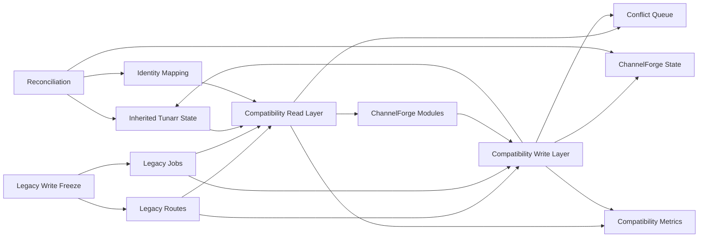
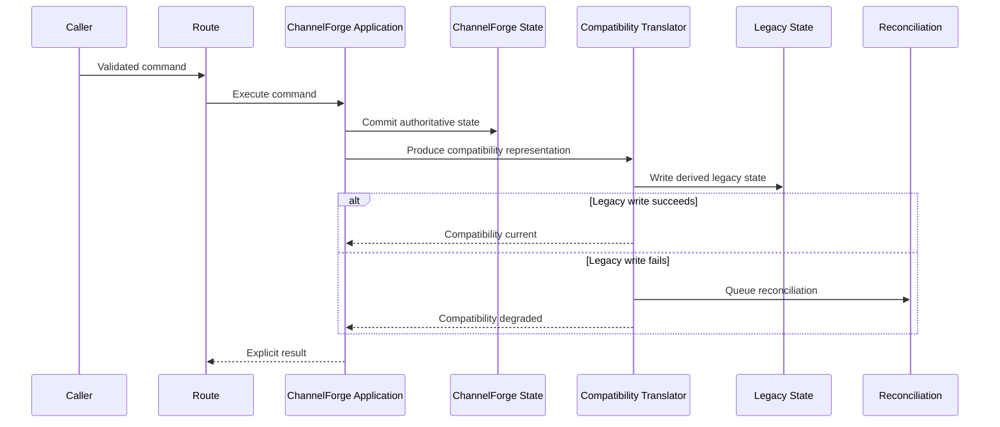
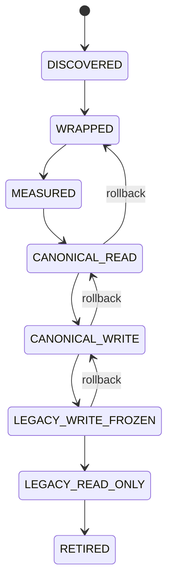

# Milestone 04: Legacy Compatibility

- **Roadmap version:** 0.1
- **Milestone status:** Draft
- **Last updated:** 2026-07-27
- **Risk classification:** Compatibility / Critical
- **Implementation authority:** Compatibility reads, temporary write translation, route isolation, and legacy dependency measurement

## Purpose

This milestone defines how ChannelForge continues to operate while inherited
Tunarr state, routes, jobs, persistence, identifiers, and runtime behavior are
replaced incrementally.

It defines:

- Legacy subsystem boundaries
- Compatibility read architecture
- Compatibility read precedence
- Legacy identifier resolution
- Lazy mapping
- Mapping conflict handling
- Compatibility query behavior
- Compatibility write architecture
- Single-write-authority rules
- Temporary write translation
- Dual-write restrictions
- Partial-failure recovery
- Reconciliation
- Legacy route classification
- Route isolation
- Route deprecation
- Compatibility response translation
- Legacy error translation
- Legacy background-job handling
- Legacy scheduling containment
- Legacy output containment
- Legacy provider-sync containment
- Legacy write freeze preparation
- Server-side freeze enforcement
- Compatibility metrics
- Usage evidence
- Support-window rules
- Compatibility removal criteria
- Operator diagnostics
- Testing
- Pull-request sequencing
- Entry and completion gates
- Rollback
- Risks
- Deferred decisions

This milestone does not complete final migration.

It establishes controlled coexistence.

## Governing Specifications

This milestone is governed by:

- `docs/architecture/spec/01-terminology.md`
- `docs/architecture/spec/02-system-context.md`
- `docs/architecture/spec/03-domain-model.md`
- `docs/architecture/spec/04-scheduling-model.md`
- `docs/architecture/spec/05-media-catalog.md`
- `docs/architecture/spec/06-playout-and-output.md`
- `docs/architecture/spec/07-integrations.md`
- `docs/architecture/spec/08-persistence.md`
- `docs/architecture/spec/09-api.md`
- `docs/architecture/spec/11-security.md`
- `docs/architecture/spec/12-deployment.md`
- `docs/architecture/spec/13-testing.md`
- `docs/architecture/spec/14-migration.md`
- `docs/implementation/README.md`
- `docs/implementation/01-baseline-and-change-control.md`
- `docs/implementation/02-module-boundaries.md`
- `docs/implementation/03-identity-persistence-and-migrations.md`

## Milestone Mission

ChannelForge must preserve working installations while replacing inherited
implementation details.

The compatibility milestone must:

- Preserve user intent
- Preserve active Channel output where possible
- Preserve Media Source connectivity
- Preserve guide compatibility
- Preserve stream compatibility
- Preserve legacy identifiers through mappings
- Keep legacy behavior observable
- Keep legacy authority explicit
- Prevent ambiguous write ownership
- Prevent new ChannelForge modules from importing legacy row shapes
- Prevent legacy state from overwriting newer canonical state
- Allow compatibility reads before canonical writes exist
- Allow temporary write translation only when required
- Make partial compatibility failures visible
- Reconcile divergent state
- Isolate inherited routes
- Deprecate routes deliberately
- Freeze legacy writes server-side before cutover
- Retain rollback
- Define removal criteria before removal
- Preserve attribution and license obligations

## Product Principle

The governing product principle remains:

> Build television networks, not playlists.

Compatibility may expose inherited playlist-oriented behavior temporarily.

New ChannelForge contracts must remain network-first.

Compatibility translates legacy concepts.

It does not redefine the ChannelForge domain around legacy shapes.

## Core Compatibility Principles

1. Preserve user intent before implementation shape.
2. ChannelForge identities become canonical after cutover.
3. Legacy identifiers remain mapped.
4. Reads may migrate before writes.
5. One write owner exists per concept per phase.
6. Dual-write is temporary and explicit.
7. Compatibility behavior is observable.
8. Compatibility code has removal criteria.
9. Legacy state never overwrites newer canonical state.
10. Invalid legacy state becomes conflict.
11. Operator decisions are not guessed.
12. Generated artifacts may be regenerated.
13. Runtime continuity is preserved where practical.
14. Compatibility can pause safely.
15. Compatibility can fail safely.
16. Compatibility can be rolled back.
17. Historical lineage remains available.
18. Legacy routes are isolated.
19. Legacy jobs are isolated.
20. Legacy direct database access is not available to new modules.

## Scope

This milestone covers inherited Tunarr concepts including:

- Channels
- Programs
- Custom shows
- Filler lists
- Media Source configurations
- Plex settings
- Jellyfin settings
- Emby settings
- Scheduling configuration
- Schedule records
- Guide data
- Stream routes
- FFmpeg settings
- HDHomeRun-compatible settings
- XMLTV settings
- M3U settings
- Persistent identifiers
- Preferences
- Runtime defaults
- Database state
- Container paths
- Environment variables
- API routes
- First-party UI callers
- Background jobs
- Search indexes
- Generated artifacts
- Attribution notices

## Non-Goals

This milestone does not guarantee exact preservation of:

- Undocumented internal fields
- Invalid records
- Corrupt records
- Temporary caches
- Runtime sessions
- Generated temporary files
- Unsupported provider payloads
- Unofficial modifications
- Direct database edits
- Deprecated routes beyond their support policy
- Old UI layout
- Accidental behavior
- Unsupported plugin state

Unsupported state must be preserved in backup and surfaced.

It must not be fabricated.

## Legacy Subsystem Definition

The inherited Tunarr codebase is a legacy subsystem during migration.

Legacy subsystem content includes:

- Legacy database records
- Legacy persistence helpers
- Legacy scheduling logic
- Legacy provider models
- Legacy route DTOs
- Legacy API handlers
- Legacy UI state contracts
- Legacy identifiers
- Legacy output generators
- Legacy global settings
- Legacy background jobs
- Legacy file paths
- Legacy container defaults
- Legacy error structures
- Legacy process-control code

## Compatibility Boundary

New ChannelForge code may access legacy behavior only through:

- Legacy repositories
- Compatibility adapters
- Compatibility application services
- Migration services
- Identity mapping repositories
- Explicit projections
- Explicit route adapters

## Forbidden Direct Dependencies

New ChannelForge modules must not depend directly on:

- Legacy database row types
- Legacy query builders
- Legacy ORM records
- Legacy global settings objects
- Legacy provider payloads
- Legacy route DTOs
- Legacy scheduling classes
- Legacy output artifact paths
- Legacy UI state
- Legacy process singletons
- Legacy identifiers as canonical IDs

## Compatibility Namespace

Recommended path:

```text
server/src/compatibility/tunarr/
```

Possible structure:

```text
server/src/compatibility/tunarr/
├── index.ts
├── README.md
├── metrics/
├── identity/
├── persistence/
├── routes/
├── providers/
├── scheduling/
├── playout/
├── output/
├── settings/
├── jobs/
├── filesystem/
├── errors/
└── testing/
```

## Compatibility Public Entry Point

The compatibility namespace exposes only approved adapters.

Other modules must not deep-import compatibility internals.

## Compatibility Module Ownership

The Migration module coordinates compatibility state.

The owning ChannelForge module owns the target contract.

Example:

- Channels owns Channel contract.
- Compatibility implements Channel legacy read adapter.
- Migration owns identity mapping and conflict.
- Output owns XMLTV contract.
- Compatibility implements legacy XMLTV fallback.
- Media Sources owns source contract.
- Compatibility implements legacy source adapter.

## Anti-Corruption Layer

Compatibility is an anti-corruption layer.

It translates:

- Legacy identity to ChannelForge identity
- Legacy Channel to Channel read model
- Legacy program to Catalog observation
- Legacy custom show to programming input
- Legacy filler list to filler policy input
- Legacy schedule item to schedule compatibility record
- Legacy output settings to output profile input
- Legacy errors to stable application errors
- Legacy route requests to ChannelForge commands
- ChannelForge results to legacy route responses where supported

## Translation Direction

Translation direction must be explicit.

Possible directions:

- Legacy to ChannelForge
- ChannelForge to legacy
- Bidirectional temporary translation
- Read-only projection
- Diagnostic-only comparison

## Translation Rule

Translation must not silently lose fields required to preserve user intent.

Unsupported fields become:

- Warning
- Conflict
- Preserved opaque metadata
- Explicit omission

## Compatibility Architecture



## Compatibility Modes

A concept may be in one compatibility mode:

- `LEGACY_ONLY`
- `LEGACY_READ_CANONICAL_WRITE`
- `CANONICAL_READ_LEGACY_FALLBACK`
- `CANONICAL_ONLY`
- `DUAL_COMPARE`
- `TEMPORARY_WRITE_TRANSLATION`
- `FROZEN_LEGACY_WRITE`
- `RETIRED`

## Mode Definitions

### `LEGACY_ONLY`

Legacy state is authoritative.

ChannelForge reads through an adapter.

No ChannelForge write path exists.

### `LEGACY_READ_CANONICAL_WRITE`

ChannelForge writes canonical state.

Legacy reads may still exist.

Legacy runtime may require projection.

### `CANONICAL_READ_LEGACY_FALLBACK`

Read canonical first.

Fallback to legacy only when canonical state is absent.

### `CANONICAL_ONLY`

Only ChannelForge state is used.

Legacy state remains for rollback or historical diagnostics.

### `DUAL_COMPARE`

Both states are read for comparison.

One result remains authoritative.

### `TEMPORARY_WRITE_TRANSLATION`

One validated command writes authoritative state and produces a required
compatibility representation.

### `FROZEN_LEGACY_WRITE`

Legacy mutation paths are blocked server-side.

### `RETIRED`

Compatibility path is removed from active runtime.

Historical fixtures remain.

## Compatibility Mode Registry

Create:

```text
docs/implementation/compatibility/mode-registry.md
```

Suggested columns:

| Concept | Current mode | Read authority | Write authority | Fallback | Cutover gate | Removal milestone |
| --- | --- | --- | --- | --- | --- | --- |

## Source-of-Truth Classification

Every legacy concept must be classified:

- Authoritative
- Derived
- Cache
- Runtime
- Configuration
- Secret
- Historical
- Unknown

## Authoritative Legacy Examples

Potential examples:

- Channel definitions
- Channel numbers
- Channel names
- Program assignments
- Custom show membership
- Filler membership
- Media Source configuration
- Output settings
- User-selected order

The baseline inventory decides actual authority.

## Derived Legacy Examples

Potential examples:

- XMLTV artifact
- M3U artifact
- Search index
- Cached provider metadata
- Runtime progress
- Temporary transcode file

Derived state should normally be regenerated.

## Unknown Legacy State

Unknown state must be:

- Inventoried
- Backed up
- Excluded from deletion
- Flagged
- Assigned an owner
- Kept out of hidden runtime dependency

## Compatibility Read

A Compatibility Read interprets legacy state without rewriting it first.

## Compatibility Read Goals

- Keep old installation usable
- Permit staged migration
- Produce ChannelForge contracts
- Resolve legacy identity
- Record fallback use
- Detect conflicts
- Avoid mutation
- Avoid provider calls where unnecessary
- Avoid hidden caching
- Keep deterministic behavior

## Compatibility Repository

A compatibility repository may:

- Read ChannelForge state first
- Resolve explicit mapping
- Fall back to legacy state
- Translate to canonical domain or read model
- Create a proposed mapping where policy permits
- Record metrics
- Record conflict
- Avoid legacy-only writes

## Recommended Read Precedence

After canonical data exists:

1. ChannelForge canonical state
2. Verified identity mapping
3. Legacy compatibility read
4. Conflict
5. Not found

## Canonical Precedence Rule

Legacy state must never overwrite newer ChannelForge state.

## Read Strategy by Concept

Each concept defines:

- Canonical table
- Legacy table
- Mapping namespace
- Fallback eligibility
- Lazy mapping eligibility
- Conflict behavior
- Cache behavior
- Metrics
- Removal gate

## Read Context

Compatibility reads should receive:

- Actor or service identity where applicable
- Correlation ID
- Route or operation name
- Requested identifier
- Allowed fallback policy
- Diagnostic mode
- Cancellation signal

## Read Result

A compatibility read result may include:

```ts
export type CompatibilityReadResult<T> =
  | {
      source: "CANONICAL";
      value: T;
      mappingId?: string;
    }
  | {
      source: "LEGACY_FALLBACK";
      value: T;
      mappingId?: string;
      warningCodes: readonly string[];
    }
  | {
      source: "CONFLICT";
      conflictId: string;
    }
  | {
      source: "NOT_FOUND";
    };
```

## Read Result Exposure

Ordinary public APIs should not expose internal compatibility metadata by
default.

Authorized diagnostics may expose:

- Source
- Mapping
- Warning
- Conflict
- Legacy namespace
- Legacy ID

## Legacy ID Lookup

Legacy IDs may resolve through:

- Mapping table
- Compatibility route parameter
- Legacy row lookup
- Historical reference
- Import manifest

## Legacy ID Non-Canonical Rule

A legacy ID is never returned as the canonical `id` after cutover.

## Lazy Mapping

A compatibility read may materialize a mapping lazily when:

- Legacy identity is unambiguous
- Target entity already exists
- Type matches
- Uniqueness holds
- Policy allows lazy mapping
- The mapping write is idempotent
- Audit is recorded
- The read can tolerate the mapping transaction

## Lazy Mapping Prohibitions

Do not lazily map when:

- Multiple targets exist
- Parent mapping is missing
- Legacy record is corrupt
- Mapping changes authority
- Mapping requires operator judgment
- Mapping would merge entities
- Mapping would split entity
- Secret material is involved
- Active publication identity changes

## Lazy Mapping Failure

A lazy mapping failure must not silently return an incorrect target.

Possible outcomes:

- Return translated legacy read without mapping
- Return conflict
- Return unavailable
- Retry mapping
- Queue reconciliation

Policy is concept-specific.

## Mapping Verification

Verify:

- Legacy row exists
- Target entity exists
- Types match
- Required fields match
- Mapping uniqueness holds
- Parent references resolve
- No orphan mapping
- Semantic comparison passes
- Mapping is not tombstoned

## Mapping State

Supported mapping states:

- `PROPOSED`
- `MAPPED`
- `VERIFIED`
- `CONFLICT`
- `MERGED`
- `SPLIT`
- `OMITTED`
- `TOMBSTONED`
- `SUPERSEDED`
- `ROLLED_BACK`

## Mapping Conflict

A mapping conflict is durable.

It contains:

- Qualified legacy identity
- Candidate ChannelForge identities
- Reason
- Evidence
- Affected route or service
- First observed
- Last observed
- Occurrence count
- Migration run
- Operator status

## Mapping Conflict Behavior

A conflict must not be resolved by arbitrary first match.

## Tombstone

A migration tombstone records that legacy state was:

- Retired
- Merged
- Invalid
- Omitted
- Replaced
- Deleted according to policy

## Tombstone Read

A tombstoned legacy ID returns a controlled result.

It must not create a new entity automatically.

## Compatibility Read Metrics

Track:

- Legacy fallback read count
- Canonical read count
- Mapping lookup count
- Mapping creation count
- Mapping conflict count
- Legacy entity type
- Route template
- Service operation
- Success
- Failure
- Latency
- Application version
- Source schema version
- Caller class
- Fallback reason

## Metric Cardinality

Do not use raw identifiers as high-cardinality metric labels.

Raw IDs may appear in structured diagnostic logs with access controls.

## Compatibility Read Logging

Structured fields:

- `compatibilityMode`
- `legacyNamespace`
- `legacyEntityType`
- `source`
- `routeTemplate`
- `operation`
- `mappingState`
- `conflictId`
- `correlationId`
- `durationMs`

## Compatibility Read Health

Health states:

- `UNUSED`
- `HEALTHY`
- `DEGRADED`
- `CONFLICTED`
- `FAILED`
- `FROZEN`
- `RETIRED`

## Compatibility Read Removal Criterion

A compatibility read path may be removed when:

- All supported source versions migrate
- Migration coverage is complete
- Usage metrics show no supported use
- Support window has elapsed
- Rollback window is closed
- Historical fixtures remain
- Release notes announce removal
- First-party callers are migrated
- External caller policy is satisfied
- Operator diagnostics no longer require active path

## Compatibility Query

Compatibility queries are read-only.

They may join legacy and mapping state.

They must use explicit deterministic ordering.

## Compatibility Cache

A compatibility cache may improve expensive legacy reads.

It must:

- Be derived
- Be bounded
- Include source version
- Include invalidation
- Not become authoritative
- Not hide fallback usage
- Be clear on restart

## Shadow Read

Shadow Read compares legacy and canonical representations.

## Shadow Read Goals

- Detect translation mismatch
- Measure migration quality
- Detect stale canonical data
- Detect hidden legacy behavior
- Build cutover confidence

## Shadow Read Authority

One side is always designated authoritative.

Comparison does not create dual authority.

## Shadow Read Output

Record:

- Concept
- Authority
- Legacy checksum
- Canonical checksum
- Difference class
- Route or operation
- Timestamp
- Correlation ID
- Severity

## Difference Classes

- `EQUAL`
- `EXPECTED_FORMATTING_DIFFERENCE`
- `EXPECTED_SEMANTIC_DIFFERENCE`
- `LEGACY_MISSING`
- `CANONICAL_MISSING`
- `IDENTITY_MISMATCH`
- `VALUE_MISMATCH`
- `ORDER_MISMATCH`
- `ERROR_MISMATCH`
- `UNKNOWN`

## Shadow Read Sampling

High-volume paths may use sampling.

Sampling must not be used for critical identity validation.

## Shadow Read Performance

Shadow reads must be:

- Bounded
- Cancelable
- Measured
- Disableable
- Non-mutating

## Compatibility Write

Compatibility Write is temporary.

It translates one authoritative command into required legacy representation.

## Compatibility Write Goals

- Keep legacy runtime working
- Permit new UI/API adoption
- Keep one command authority
- Detect partial failure
- Reconcile divergence
- Preserve rollback
- Remove itself later

## Write Authority

Every concept has exactly one write authority per phase.

## Write Authority Registry

Create:

```text
docs/implementation/compatibility/write-authority.md
```

Suggested columns:

| Concept | Phase | Authoritative writer | Compatibility target | Failure policy | Freeze gate |
| --- | --- | --- | --- | --- | --- |

## Authority Examples

### Before Cutover

```text
Channel identity:
  legacy write authority
  ChannelForge compatibility read
```

### During Temporary Translation

```text
Channel identity:
  ChannelForge command authority
  legacy representation derived
```

### After Cutover

```text
Channel identity:
  ChannelForge read/write authority
  legacy mapping read-only
```

## Ambiguous Authority Prohibition

Legacy and ChannelForge stores may not accept independent writes for the same
concept.

## Temporary Write Translation

Temporary translation is permitted when:

- Legacy runtime still consumes old tables
- First-party UI writes new contracts
- Output still reads legacy shape
- Cutover spans releases
- A required external client still depends on legacy route

## Translation Command Flow



## Authoritative Commit Order

Preferred order:

1. Validate command.
2. Authorize command.
3. Commit ChannelForge authoritative state.
4. Record audit.
5. Translate to compatibility representation.
6. Write legacy representation.
7. Record compatibility status.
8. Queue reconciliation on failure.
9. Return explicit result.

Some concepts may require one transaction across schemas in one SQLite database.

That exception must be documented.

## Single-Transaction Translation

A single SQLite transaction may update canonical and legacy tables when:

- Both tables share one database
- No external call occurs
- Lock duration remains bounded
- Mapping and status update are included
- Rollback semantics are clear
- One command remains authoritative

## Recovery-Protocol Translation

Use a recovery protocol when:

- Filesystem is involved
- Separate store is involved
- Long transformation is involved
- Legacy representation is derived asynchronously
- Atomicity is unavailable

## Dual-Write Definition

Dual-write means one command produces both canonical and legacy writes.

It does not mean two independent clients may write both stores.

## Dual-Write Requirements

When unavoidable:

- ChannelForge command is authoritative after declared cutover phase
- One validated command produces both outputs
- Idempotency exists
- Partial failure is detectable
- Compatibility status is durable
- Reconciliation exists
- Metrics exist
- Removal milestone exists
- Rollback exists
- Tests inject partial failure

## Dual-Write Prohibitions

Do not dual-write:

- Plaintext secrets
- Approved Schedule Plans
- Audit records through independent authorities
- Runtime stream URLs
- Provider payloads
- Plugin internal state
- Temporary sessions
- Raw tokens
- Ephemeral FFmpeg state

## Partial Failure

Partial failure occurs when:

- Canonical write succeeds and legacy write fails
- Legacy write succeeds and canonical write fails
- Mapping write fails
- Compatibility status write fails
- File projection fails
- Reconciliation enqueue fails

## Partial Failure Rule

Do not report uncomplicated success silently.

## Partial Failure Result

Possible explicit outcomes:

- Success with compatibility warning
- Accepted with reconciliation job
- Failure with canonical commit retained
- Failure with transaction rolled back
- Service degraded
- Legacy runtime blocked
- Operator action required

## Partial Failure Policy

Policy is concept-specific.

It must state:

- Authority retained
- Caller response
- Runtime effect
- Retry
- Reconciliation
- Audit
- Health
- Rollback

## Compatibility Status Record

Suggested conceptual fields:

```text
compatibility_status_id
concept_type
channelforge_id
legacy_namespace
legacy_id
mode
state
canonical_version
legacy_version
last_attempt_at
last_success_at
failure_count
last_error_code
reconciliation_job_id
```

## Compatibility Status State

- `CURRENT`
- `PENDING`
- `DEGRADED`
- `FAILED`
- `CONFLICT`
- `FROZEN`
- `RETIRED`

## Reconciliation

Reconciliation compares and repairs compatibility representation.

## Reconciliation Inputs

- Canonical entity
- Legacy representation
- Mapping
- Compatibility status
- Expected translation version
- Previous findings
- Policy

## Reconciliation Output

- Equal
- Legacy repaired
- Canonical repair required
- Conflict
- Unsupported
- Retry
- Operator action

## Reconciliation Authority

Reconciliation must not overwrite canonical state from legacy without an
explicit migration command.

## Reconciliation Job

A reconciliation job:

- Is idempotent
- Uses bounded batches
- Is restart-safe
- Records progress
- Records findings
- Uses mapping
- Avoids provider calls inside write transactions
- Does not start FFmpeg
- Can be canceled safely

## Reconciliation Finding

Fields:

- Finding ID
- Concept
- Canonical ID
- Legacy ID
- Difference
- Severity
- Repair action
- Attempt count
- Status
- First observed
- Last observed
- Resolved timestamp

## Reconciliation Severity

- `INFO`
- `WARNING`
- `ERROR`
- `CRITICAL`

## Reconciliation Metrics

- Items compared
- Equal
- Repaired
- Conflicts
- Failed
- Duration
- Retry count
- Oldest unresolved age

## Reconciliation Schedule

Possible triggers:

- After write failure
- On startup
- Periodic
- Before cutover
- Operator request
- Before legacy freeze
- Before release validation

## Legacy Route Inventory

Create:

```text
docs/implementation/compatibility/legacy-route-inventory.md
```

For each route, record:

- Method
- Path
- Handler
- Request DTO
- Response DTO
- Authentication
- Authorization
- Read/write
- Current callers
- First-party caller
- External caller evidence
- Legacy identifiers
- Legacy persistence access
- Target ChannelForge route
- Compatibility classification
- Deprecation date
- Removal gate

## Legacy Route Classification

Use:

- `PRESERVE_EXACT`
- `ADAPT_READ`
- `ADAPT_WRITE`
- `TRANSLATE_RESPONSE`
- `DEPRECATE`
- `FREEZE_WRITE`
- `INTERNAL_ONLY`
- `OUTPUT_PROTOCOL`
- `STREAM_PROTOCOL`
- `REMOVE_LATER`
- `UNKNOWN`

## Preserve Exact

Use only when protocol compatibility requires exact behavior.

Examples may include:

- HDHomeRun-compatible endpoints
- Existing M3U endpoint
- Existing XMLTV endpoint
- Stream route used by configured clients

Exact preservation must not imply legacy internal ownership.

## Adapt Read

Legacy route calls ChannelForge query.

Response is translated to legacy shape.

## Adapt Write

Legacy route translates request to ChannelForge command.

ChannelForge command remains authoritative.

## Translate Response

New application service result is serialized into old DTO.

## Deprecate

Route remains active during support period.

It provides replacement guidance.

## Freeze Write

Route remains resolvable but rejects mutation after cutover.

## Internal Only

Route is used only by inherited first-party UI and can be removed after UI
migration.

## Output Protocol

Route follows external client protocol rather than management API convention.

## Stream Protocol

Route has long-lived response behavior and separate error rules.

## Route Isolation

Legacy routes must register under an explicit compatibility registration path.

Suggested:

```text
server/src/compatibility/tunarr/routes/
```

## Route Registration

The application host registers legacy routes separately from ChannelForge v1
routes.

## Route Tagging

OpenAPI or route metadata should tag:

```text
legacy
deprecated
compatibility
```

where applicable.

## Legacy Route Handler Rule

A legacy route handler may:

- Parse legacy request
- Authenticate
- Authorize
- Translate identifiers
- Call ChannelForge application service
- Translate result
- Add deprecation metadata
- Record usage

It must not:

- Query legacy tables directly after an adapter exists
- Implement domain logic
- Start FFmpeg directly
- Generate schedule directly
- Write both stores independently
- Expose secrets
- Guess conflict resolution

## Route Deprecation

A deprecated route must document:

- Replacement
- Support window
- Behavior differences
- Identifier differences
- Error differences
- Removal gate
- Migration guidance

## Deprecation Headers

Where practical, use:

- `Deprecation`
- `Sunset`
- `Link`
- Warning headers
- Documentation link

Exact header support must be validated against clients.

## Deprecation Response Metadata

Management JSON responses may include authorized migration guidance.

Protocol endpoints should avoid breaking response shape.

## Route Usage Metrics

Track:

- Route template
- Method
- Status
- Caller class
- Version
- Deprecation
- Compatibility mode
- Legacy identifier use
- Replacement route availability
- Latency
- Error code

## Caller Classification

Possible caller classes:

- First-party web
- Plex
- Jellyfin
- Emby
- IPTV client
- Browser
- Automation
- Unknown
- Health probe

## Caller Privacy

Do not fingerprint clients beyond operational need.

## Route Removal Criterion

A legacy route may be removed when:

- First-party caller is migrated
- Supported external clients no longer require it
- Usage is zero across support window
- Replacement is documented
- Release notes announce removal
- Metrics are trustworthy
- Rollback window is closed
- Historical contract tests remain
- Removal does not break output protocol compatibility

## Compatibility Error Translation

Legacy errors translate to stable application errors.

## Error Translation Table

Create:

```text
docs/implementation/compatibility/error-translation.md
```

Fields:

| Legacy error | ChannelForge error | Legacy route response | Canonical route response | Retryable |
| --- | --- | --- | --- | --- |

## Error Translation Rule

Do not expose:

- Stack trace
- SQL
- Provider token
- Authorization header
- Signed URL
- Filesystem secret
- Process command with secret
- Internal mapping detail to unauthorized caller

## Legacy Error Preservation

Where clients rely on status semantics, preserve status during support period.

Message text is not a stable contract unless documented.

## Frozen Write Error

A frozen legacy mutation returns:

- Controlled status
- Stable error code
- Replacement route or workflow
- Request ID
- Deprecation information
- No partial mutation

Suggested error code:

```text
LEGACY_WRITE_FROZEN
```

## Compatibility Authorization

Compatibility does not bypass security.

## Authorization Rule

Legacy route authorization maps to current permissions.

Hiding UI is insufficient.

## Legacy Authentication

Inherited authentication may remain temporarily.

It must translate to a ChannelForge Principal before application service use.

## Principal Mapping

Record:

- Legacy identity
- ChannelForge User ID
- Role mapping
- Scope mapping
- Conflict
- Last verified

## Anonymous Output Routes

Output and stream routes may remain unauthenticated according to configured
policy.

That does not grant management access.

## Compatibility Secrets

Secret values must never be translated through ordinary compatibility DTOs.

## Provider Credentials

Compatibility may resolve legacy credential storage through Secret Service
adapter.

It must not copy plaintext into ordinary tables.

## Provider Compatibility

Media Source compatibility must preserve:

- Source identity
- Base URL
- Selected libraries
- Credentials
- Provider type
- Connectivity
- Path mapping
- Playback settings
- Synchronization policy

## Provider Compatibility Read

Legacy provider configuration becomes a ChannelForge Media Source read model.

## Provider Compatibility Write

Avoid writing provider credentials to both stores.

Preferred strategy:

- Secret Service authoritative
- Legacy secret adapter resolves reference
- Legacy runtime consumes controlled resolver
- No plaintext projection

## Provider Sync Containment

Legacy provider synchronization may remain temporarily.

It must be invoked through a compatibility job handler.

## Provider Sync Write Authority

Per phase, state whether legacy sync writes:

- Legacy only
- Canonical observations
- Temporary projection
- Disabled

## Provider Payload Rule

Raw provider payload remains inside adapter or compatibility boundary.

## Scheduling Compatibility

Legacy scheduling must remain isolated.

## Legacy Scheduler Modes

- Legacy authoritative
- Shadow compare
- Compatibility input provider
- Disabled
- Retired

## Scheduling Read Compatibility

Legacy schedule state may be translated to:

- Compatibility schedule read model
- Historical schedule entry
- Migration input
- Published fallback

## Scheduling Write Compatibility

Do not independently write approved Schedule Plans to legacy and canonical
systems.

Approved Schedule Plans are canonical immutable state.

## Scheduler Shadow Compare

When comparing legacy and ChannelForge schedules:

- Fix input
- Fix horizon
- Fix time zone
- Fix seed where possible
- Normalize IDs
- Normalize expected formatting differences
- Compare ordering
- Compare durations
- Compare continuity
- Record difference

## Legacy Scheduler Freeze

Before scheduling cutover:

- Disable legacy generation commands
- Disable legacy background generation
- Disable direct schedule writers
- Preserve read access
- Keep active published schedule
- Expose replacement

## Playout Compatibility

Legacy playout may remain active while publication migrates.

## Playout Authority

Playout consumes one active publication authority.

It must not choose between independent legacy and canonical schedules
implicitly.

## Playout Fallback

A fallback may use legacy schedule only when:

- Compatibility mode permits
- Canonical publication absent
- Mapping resolves
- Policy is explicit
- Usage is recorded

## FFmpeg Compatibility

Legacy FFmpeg settings may be translated to an output or transcode profile.

## FFmpeg Write Rule

Do not write FFmpeg runtime process state to canonical persistence as
configuration.

## Output Compatibility

Output compatibility includes:

- XMLTV
- M3U
- HDHomeRun-compatible discovery
- HDHomeRun-compatible lineup
- Stream URLs
- Channel logos
- Device identity

## Output Identity

All output adapters must converge on canonical Channel ID after cutover.

## Legacy Output Fallback

Legacy output may remain last-known-good artifact.

## Artifact Precedence

Recommended:

1. Valid canonical artifact
2. Last valid canonical artifact
3. Supported legacy artifact
4. Controlled unavailable result

## Artifact Regeneration

Derived legacy artifacts should normally be regenerated.

## Output Route Stability

Protocol-compatible routes may keep legacy path while using canonical state.

## Device Identity

Changing HDHomeRun-compatible device identity can cause client reconfiguration.

Treat it as a separate compatibility decision.

## Channel Number Compatibility

Preserve Channel numbers where valid.

Conflicts require operator-visible resolution.

## Stream URL Compatibility

Existing configured stream URLs should remain valid during support window where
practical.

## Stream Redirect

Redirect may be used only if client compatibility is verified.

## Stream Token Compatibility

Do not expose provider credentials in compatibility stream URLs.

## Guide Identity Compatibility

XMLTV Channel IDs must remain stable or explicitly mapped.

## Legacy Background Jobs

Inventory every legacy job.

## Legacy Job Classification

- Read-only
- Legacy write
- Compatibility projection
- Provider synchronization
- Schedule generation
- Artifact generation
- Cleanup
- Backup
- Unknown

## Legacy Job Handler

A legacy job handler may:

- Call compatibility service
- Record job status
- Translate input
- Record usage

It must not retain hidden write authority after freeze.

## Legacy Job Freeze

Freeze applies server-side to:

- Enqueue
- Start
- Retry
- Reschedule
- Startup recovery

## Interrupted Legacy Job

On cutover, an interrupted job must be:

- Completed safely
- Canceled
- Reconciled
- Marked abandoned
- Migrated

Policy is job-specific.

## Legacy Settings Compatibility

Inventory:

- Environment variables
- Database settings
- JSON settings
- Defaults
- Container paths
- UI settings

## Settings Read Precedence

Recommended:

1. ChannelForge explicit setting
2. Migrated setting
3. Supported legacy setting
4. ChannelForge default

## Settings Write Authority

New setting writes should target ChannelForge state.

Legacy projection is temporary where runtime requires it.

## Environment Variable Compatibility

Existing variables may remain aliases.

## Environment Alias Rules

An alias must define:

- Canonical variable
- Legacy variable
- Precedence
- Conflict behavior
- Deprecation
- Removal gate

## Environment Conflict

If both canonical and legacy variables are set differently:

- Fail or warn according to risk
- State which wins
- Do not guess silently

## Path Compatibility

Existing data paths may remain aliases or migration sources.

## Path Rules

- Preserve existing mounts
- Avoid moving data automatically without backup
- Resolve one canonical data root
- Record legacy root
- Avoid duplicating mutable database files
- Keep managed file ownership explicit

## Container Compatibility

Existing Docker and Unraid configurations should remain operable through
documented aliases where possible.

## Container Compatibility Fields

- Image name
- Container name
- Port
- Data volume
- Time zone
- PUID
- PGID
- Device mappings
- Environment variables
- Health checks
- Network mode

## Package Identity Compatibility

Package rebranding is not part of this milestone.

## First-Party UI Compatibility

The inherited UI may call legacy routes temporarily.

## UI Caller Migration

For each UI feature:

1. Identify route.
2. Identify legacy DTO.
3. Identify canonical use case.
4. Add canonical client.
5. Compare behavior.
6. Switch UI.
7. Record route usage decline.
8. Remove legacy caller.
9. Keep route for external support window if needed.

## UI Feature Flag

A feature flag may select:

- Legacy UI path
- Canonical UI path
- Shadow read
- Read-only preview

## UI Write Rule

A UI must not submit to both legacy and canonical mutation routes.

## Compatibility Feature Flags

Feature flags may control:

- Canonical read
- Legacy fallback
- Shadow compare
- Temporary write translation
- Legacy route registration
- Legacy job registration
- Legacy write freeze
- Canonical output

## Feature Flag Requirements

- Default documented
- Scope documented
- Persisted or deployment controlled
- Observable
- Safe restart
- No hidden authority
- Removal milestone

## Compatibility State Machine

Suggested states:

- `DISCOVERED`
- `WRAPPED`
- `MEASURED`
- `CANONICAL_READ`
- `CANONICAL_WRITE`
- `LEGACY_WRITE_FROZEN`
- `LEGACY_READ_ONLY`
- `RETIRED`

## State Transition Rules



## Transition Evidence

Every transition records:

- Concept
- Previous state
- New state
- Actor
- Application version
- Migration run
- Metrics snapshot
- Validation
- Rollback point
- Timestamp

## Legacy Write Freeze

Legacy Write Freeze disables inherited mutation paths.

## Freeze Scope

Freeze may apply to:

- Legacy management routes
- Legacy UI forms
- Legacy background jobs
- Legacy direct database writers
- Legacy schedule writers
- Legacy provider sync writers
- Legacy output generators
- Legacy settings writers
- Legacy cleanup jobs

## Freeze Enforcement

Freeze must be server-side.

UI hiding is insufficient.

## Freeze Registry

Create:

```text
docs/implementation/compatibility/freeze-registry.md
```

Fields:

| Write path | Concept | Enforcement point | Replacement | Validation | Rollback |
| --- | --- | --- | --- | --- | --- |

## Freeze Preflight

Before freeze:

- Canonical writer passes tests
- Mapping coverage complete
- Reconciliation current
- Compatibility status healthy
- Backup verified
- Rollback point recorded
- First-party caller migrated
- Jobs drained
- Active streams policy decided
- Output policy decided
- Operator notified

## Freeze Activation

Freeze activation should be atomic where practical.

## Freeze Activation Record

Record:

- Freeze ID
- Scope
- Activated at
- Activated by
- Migration run
- Application version
- Backup
- Validation
- Rollback eligibility

## Freeze Runtime Behavior

A frozen writer:

- Performs no mutation
- Returns stable error
- Records usage
- Provides replacement
- Does not enqueue hidden work
- Does not partially translate

## Freeze Rollback

Rollback may re-enable legacy writes only when:

- Canonical writes are paused
- Reconciliation confirms state
- Mapping remains valid
- Backup exists
- Operator approves

## Freeze Validation

After freeze:

- Legacy write attempts fail
- Canonical writes succeed
- Legacy reads still work where supported
- Output continues
- Streams continue according to policy
- Jobs use canonical services
- Metrics record attempts
- No direct database writer bypasses freeze

## Direct Write Detection

Architecture tests and runtime instrumentation should detect legacy direct
writes.

## Write Detection Strategies

- Static import rules
- Repository wrappers
- SQLite update hooks where available
- Query logging
- Table triggers for diagnostics where safe
- Test-only instrumentation
- Code search
- Feature-gated writer registry

## SQLite Trigger Caution

Diagnostic triggers must not become permanent business logic.

## Compatibility Metrics

Create a compatibility dashboard or diagnostic report.

## Required Metrics

- Legacy fallback reads
- Canonical reads
- Shadow comparisons
- Shadow mismatches
- Legacy route calls
- Deprecated route calls
- Legacy write attempts
- Frozen write attempts
- Temporary translation successes
- Temporary translation failures
- Reconciliation queue depth
- Oldest reconciliation finding
- Mapping conflicts
- Lazy mappings
- Unmapped legacy IDs
- Compatibility latency
- Compatibility errors
- Legacy job executions
- Legacy output fallbacks

## Metric Dimensions

Bounded dimensions:

- Concept
- Entity type
- Route template
- Operation
- Compatibility mode
- Result
- Application version
- Source schema version

## Compatibility Diagnostic API

Authorized diagnostics may expose:

- Mode registry
- Write authority
- Route usage
- Fallback count
- Mapping health
- Conflict count
- Reconciliation state
- Freeze state
- Removal readiness

## Diagnostic Security

Do not expose:

- Raw credentials
- Full provider URLs with tokens
- Private media paths
- Raw database rows
- Session secrets
- Arbitrary SQL

## Compatibility Support Bundle

A support bundle may include:

- Version
- Schema version
- Mode registry
- Metrics summary
- Conflict summary
- Route inventory
- Freeze state
- Mapping counts
- Sanitized logs
- Checksums

## Removal Readiness Report

Create:

```text
docs/implementation/compatibility/removal-readiness.md
```

For each path:

- Current usage
- Last observed use
- Supported source versions
- First-party callers
- External callers
- Replacement
- Test fixtures
- Rollback window
- Release note
- Ready or blocked

## Support Window

A compatibility path remains through a defined support window.

## Support Window Inputs

- Release cadence
- Supported upgrade paths
- Client behavior
- External API users
- Migration fixture coverage
- Rollback policy
- Operator impact

## Zero Usage

Zero observed usage is necessary but not always sufficient.

Metrics may be incomplete.

## Removal Approval

Removal requires:

- Evidence
- Review
- Release note
- Upgrade guidance
- Fixture retention
- Explicit PR

## Legacy Read Retention

Compatibility reads may remain longer than write paths.

## Legacy State Retention

Legacy tables may remain after runtime retirement.

Deletion occurs later.

## Attribution Preservation

Compatibility and migration must preserve:

- Tunarr zlib license
- Notice
- Git history
- Attribution documentation
- Inherited source headers where applicable

## Testing Strategy

Milestone 04 requires:

- Unit tests
- Translation tests
- Repository tests
- Route contract tests
- Shadow-read tests
- Partial-failure tests
- Reconciliation tests
- Freeze tests
- Upgrade tests
- Rollback tests
- Protocol compatibility tests
- Windows tests
- Linux tests

## Translation Unit Tests

Test:

- Valid legacy record
- Missing optional field
- Unknown field
- Invalid field
- Legacy default
- Identity mapping
- Parent mapping
- Tombstone
- Conflict
- Unsupported value
- Deterministic output

## Compatibility Read Tests

Test:

- Canonical hit
- Mapping hit
- Legacy fallback
- Not found
- Conflict
- Lazy mapping
- Lazy mapping race
- Canonical precedence
- Legacy stale state
- Metrics
- Cancellation
- Ordering

## Compatibility Write Tests

Test:

- Canonical commit
- Legacy projection success
- Legacy projection failure
- Mapping failure
- Status failure
- Idempotent retry
- Partial failure
- Reconciliation enqueue
- Caller response
- Audit
- Metrics

## Dual-Write Failure Injection

Inject:

- Failure before canonical commit
- Failure after canonical commit
- Failure before legacy write
- Failure during legacy write
- Failure after legacy write
- Failure before status update
- Failure before reconciliation enqueue

## Reconciliation Tests

Test:

- Equal
- Repair legacy
- Conflict
- Unsupported
- Retry
- Restart
- Batch checkpoint
- Cancellation
- Operator resolution
- Metrics

## Legacy Route Tests

Every legacy route requires:

- Authentication
- Authorization
- Request compatibility
- Response compatibility
- Error compatibility
- Deprecation metadata
- Usage metric
- Frozen write behavior
- Replacement guidance
- Secret omission

## OpenAPI Tests

Verify:

- Deprecated routes marked
- Legacy routes isolated
- Canonical routes documented
- Replacement links
- Security declarations
- Response schemas

## Freeze Tests

Test:

- Route blocked
- UI hidden but server still enforces
- Job blocked
- Direct writer blocked
- No partial mutation
- Error stable
- Usage recorded
- Rollback re-enables correctly
- Canonical writer remains active

## Protocol Compatibility Tests

Validate:

- XMLTV
- M3U
- HDHomeRun discovery
- HDHomeRun lineup
- Stream URL
- Channel identity
- Device identity
- Tuner limits
- Last-valid artifact

## Upgrade Tests

Test supported source releases through:

- Compatibility wrapper
- Canonical read
- Write translation
- Freeze
- Rollback

## Downgrade Tests

Verify older application does not silently mutate newer state.

## First-Party UI Tests

Test:

- Legacy route mode
- Canonical route mode
- Feature-flag switch
- No double submit
- Error guidance
- Conflict display
- Frozen write

## Performance Tests

Measure:

- Fallback read overhead
- Shadow read overhead
- Mapping lookup
- Translation
- Route adapter
- Reconciliation batch
- Output fallback

## Performance Budget

Compatibility must not create unbounded per-request scanning.

## Compatibility Fixture Suite

Fixtures should include:

- Minimal legacy Channel
- Multiple Channels
- Duplicate Channel number
- Custom show
- Filler list
- Plex source
- Jellyfin source
- Emby source
- Legacy schedule
- XMLTV settings
- M3U settings
- HDHomeRun settings
- Missing mapping
- Conflicting mapping
- Tombstone
- Partial write
- Frozen route

## Fixture Privacy

Fixtures are synthetic or sanitized.

## Documentation Deliverables

Milestone 04 implementation should create:

```text
docs/implementation/compatibility/
├── README.md
├── mode-registry.md
├── write-authority.md
├── legacy-route-inventory.md
├── legacy-job-inventory.md
├── error-translation.md
├── environment-aliases.md
├── path-compatibility.md
├── freeze-registry.md
├── reconciliation-policy.md
├── removal-readiness.md
├── architecture-waivers.json
├── decision-register.md
└── completion-report.md
```

## Compatibility README

Must include:

- Purpose
- Boundaries
- Modes
- Metrics
- Removal policy
- Support window
- Ownership

## Recommended Pull-Request Sequence

## PR 04A: Compatibility Core Contracts

Scope:

- Compatibility mode
- Read result
- Write status
- Error types
- Metrics interface
- No runtime cutover

## PR 04B: Legacy Identity Resolver

Scope:

- Mapping lookup
- Tombstone lookup
- Conflict result
- Metrics
- Tests

## PR 04C: First Compatibility Read

Scope:

- One low-risk concept
- Canonical-first fallback
- Translation
- Metrics
- No lazy write unless separately approved

## PR 04D: Lazy Mapping

Scope:

- Proposed mapping
- Idempotency
- Race handling
- Conflict
- Audit
- Tests

## PR 04E: Shadow Read Framework

Scope:

- Canonical comparison
- Difference classification
- Sampling
- Metrics
- Diagnostics

## PR 04F: Legacy Route Registry

Scope:

- Route inventory
- Classification
- Separate registration
- Tags
- Usage metrics

## PR 04G: Route Adapter Proof

Scope:

- One legacy read route
- One legacy write route
- Canonical application service
- Response translation
- Deprecation metadata

## PR 04H: Compatibility Write Status

Scope:

- Status persistence
- Partial failure
- Reconciliation enqueue
- Metrics
- Tests

## PR 04I: Reconciliation Framework

Scope:

- Job type
- Findings
- Batch
- Restart
- Operator visibility

## PR 04J: Provider Compatibility

Scope:

- Media Source read translation
- Credential reference
- Provider configuration
- No plaintext dual-write

## PR 04K: Scheduling Compatibility

Scope:

- Legacy schedule read adapter
- Scheduler containment
- Shadow comparison
- No final cutover

## PR 04L: Output Compatibility

Scope:

- XMLTV
- M3U
- HDHomeRun-compatible identity
- Last-valid artifact
- Existing route paths

## PR 04M: Legacy Job Registry

Scope:

- Job inventory
- Classification
- Compatibility handlers
- Usage metrics

## PR 04N: Freeze Infrastructure

Scope:

- Freeze registry
- Server-side guard
- Stable error
- Audit
- Rollback
- No broad freeze activation

## PR 04O: First Write Freeze

Scope:

- One low-risk legacy writer
- Replacement verified
- Reconciliation current
- Backup
- Metrics
- Rollback

## PR 04P: First-Party UI Caller Migration

Scope:

- One feature
- Canonical API
- Feature flag
- No double submit
- Route metric decline

## PR 04Q: Completion Report

Scope:

- Mode registry
- Authority matrix
- Route inventory
- Job inventory
- Metrics
- Freeze readiness
- Risks

## Pull-Request Requirements

Every compatibility PR must state:

- Legacy path
- Target module
- Compatibility mode
- Read authority
- Write authority
- Mapping namespace
- Fallback
- Partial failure
- Reconciliation
- Metrics
- Freeze gate
- Removal gate
- Rollback
- Tests

## Compatibility PR Prohibitions

Do not combine:

- Compatibility wrapper and legacy deletion
- Route deprecation and unrelated UI redesign
- Write translation and provider redesign
- Freeze infrastructure and all-route freeze
- Scheduler compatibility and scheduler replacement
- Output compatibility and device identity change
- Environment alias and broad container rebrand
- Mapping logic and package rename

## Entry Gates

Milestone 04 may begin when:

1. Baseline inventory exists.
2. Module boundaries exist.
3. ChannelForge identifier policy exists.
4. Mapping repository exists.
5. Migration metadata exists.
6. Transaction coordinator exists.
7. Backup preflight exists.
8. Current write authorities are known.
9. Legacy routes are inventoried enough to choose first adapter.
10. Legacy jobs are inventoried enough to avoid hidden writes.
11. Build passes.
12. Persistence tests pass.
13. No critical unresolved mapping defect blocks compatibility.
14. Roadmap branch remains documentation-only.

## Completion Gates

Milestone 04 is Complete when:

1. Compatibility namespace exists.
2. Compatibility README exists.
3. Compatibility mode registry exists.
4. Write-authority registry exists.
5. Legacy route inventory exists.
6. Legacy job inventory exists.
7. Error translation exists.
8. Environment alias registry exists.
9. Path compatibility registry exists.
10. Freeze registry exists.
11. Reconciliation policy exists.
12. Removal-readiness policy exists.
13. New ChannelForge modules use compatibility ports.
14. No new module imports legacy rows directly.
15. Canonical-first read path exists.
16. Legacy fallback is measured.
17. Mapping lookup is used.
18. Mapping conflicts are durable.
19. Lazy mapping policy exists.
20. Lazy mapping races are tested.
21. Shadow-read framework exists.
22. Shadow differences are classified.
23. At least one legacy read route delegates to ChannelForge service.
24. At least one legacy write route delegates to ChannelForge command.
25. Route usage is measured.
26. Deprecated routes are tagged.
27. Replacement guidance exists.
28. Compatibility write status is durable.
29. Partial failure is explicit.
30. Reconciliation job exists.
31. Reconciliation is restart-safe.
32. Provider compatibility preserves credentials safely.
33. Legacy scheduler is isolated.
34. Scheduling shadow comparison exists or is explicitly deferred.
35. Output compatibility preserves required protocol behavior.
36. Canonical Channel identity is available to output adapter.
37. Legacy job registration is explicit.
38. Freeze infrastructure is server-side.
39. Frozen writer performs no mutation.
40. Frozen write returns stable error.
41. Frozen write usage is measured.
42. Freeze rollback is tested.
43. First-party UI does not double-submit.
44. Compatibility metrics are available.
45. Diagnostic API or report is authorized.
46. Support bundle is secret-safe.
47. Removal criteria are documented.
48. Historical fixtures are retained.
49. Windows tests pass or classified failures are tracked.
50. Linux tests pass.
51. Protocol compatibility tests pass.
52. Upgrade path tests pass.
53. Rollback tests pass.
54. No legacy table is deleted.
55. No unsupported route is removed.
56. No attribution is removed.
57. Completion report exists.
58. Milestone 05 entry is approved.

## Completion Evidence

The completion report should include:

- Compatibility modes
- Write authorities
- Route classifications
- Job classifications
- Mapping counts
- Conflict counts
- Fallback usage
- Deprecated route usage
- Frozen write attempts
- Reconciliation queue
- Shadow mismatch summary
- Protocol compatibility result
- Windows result
- Linux result
- Removal blockers
- Rollback evidence

## Rollback

Compatibility changes should preserve prior read paths.

## Read Adapter Rollback

Rollback may:

- Disable canonical-first flag
- Restore legacy read authority
- Preserve mappings
- Stop shadow reads
- Revert route adapter

## Write Translation Rollback

Before rollback:

- Pause canonical writes
- Reconcile
- Verify legacy representation
- Verify mapping
- Restore legacy writer
- Record authority transition

## Freeze Rollback

Re-enable legacy writes only through explicit migration action.

## Route Rollback

A removed route should not be required in this milestone.

A deprecated route adapter can be reverted to prior handler if data authority
remains safe.

## Output Rollback

Preserve last valid artifacts and prior route paths.

## Failure Handling

## Compatibility Read Failure

- Return stable error
- Record fallback failure
- Preserve canonical state
- Create conflict if identity ambiguous
- Do not fabricate result

## Compatibility Write Failure

- Preserve declared authority
- Record degraded status
- Queue reconciliation
- Return explicit outcome
- Block dependent legacy runtime if unsafe

## Mapping Failure

- Do not choose arbitrary target
- Record conflict
- Preserve legacy state
- Require operator action where necessary

## Freeze Guard Failure

Fail closed for critical mutation paths.

## Metrics Failure

Metrics failure should not mutate authority.

Critical audit failure may fail closed according to security policy.

## Reconciliation Failure

- Preserve finding
- Increment attempts
- Backoff
- Expose health
- Stop retry on permanent conflict

## Risks

### Compatibility Permanence

Temporary code may become permanent.

Mitigation:

- Removal gates
- Usage metrics
- Expiration milestone
- Readiness report

### Ambiguous Authority

Both stores may accept independent writes.

Mitigation:

- Authority registry
- Server-side guards
- Architecture tests
- Reconciliation

### Hidden Legacy Writer

A job or route may bypass compatibility.

Mitigation:

- Inventory
- Static scan
- Runtime instrumentation
- Freeze tests

### Partial Failure

Canonical and legacy state may diverge.

Mitigation:

- Durable status
- Explicit result
- Reconciliation
- Failure injection

### Route Breakage

External clients may depend on undocumented behavior.

Mitigation:

- Metrics
- Protocol tests
- Support window
- Preserve exact route where required

### Metric Blindness

Zero usage may reflect missing instrumentation.

Mitigation:

- Coverage validation
- First-party caller inventory
- Logs
- Conservative removal

### Provider Credential Leakage

Translation may expose tokens.

Mitigation:

- Secret references
- Sentinel tests
- No plaintext dual-write
- Redaction

### Scheduler Contamination

Legacy scheduling assumptions may leak into new domain.

Mitigation:

- Compatibility input
- Shadow comparison
- No direct imports
- Milestone 07 replacement

### Output Identity Drift

XMLTV, M3U, and HDHomeRun may disagree.

Mitigation:

- Canonical Channel ID
- Cross-output tests
- Mapping
- Last-valid artifact

### Freeze Bypass

UI may be hidden but server writer remains active.

Mitigation:

- Server-side guard
- Job guard
- Direct writer detection
- Tests

### Reconciliation Damage

Repair may overwrite canonical state.

Mitigation:

- Canonical authority
- Dry run
- Findings
- Operator review
- Idempotency

### Compatibility Latency

Fallback and shadow reads may slow routes.

Mitigation:

- Metrics
- Sampling
- Bounded queries
- Cache
- Disable flag

### Legacy Path Rebrand

Renaming may break mounts or automation.

Mitigation:

- Alias registry
- Separate branding milestone
- Upgrade tests

### Rollback Drift

Canonical writes may make legacy rollback unsafe.

Mitigation:

- Write translation
- Reconciliation
- Backup
- Rollback eligibility

## Milestone Invariants

1. Compatibility is an explicit subsystem.
2. New modules do not import legacy rows directly.
3. New modules do not use legacy IDs as canonical IDs.
4. Legacy identifiers resolve through mappings.
5. Legacy state does not overwrite newer canonical state.
6. One write owner exists per concept.
7. Dual-write is temporary.
8. Dual-write derives from one validated command.
9. Partial failure is detectable.
10. Partial failure is not silent.
11. Reconciliation is available.
12. Reconciliation does not overwrite canonical state from legacy implicitly.
13. Compatibility reads are measured.
14. Compatibility writes are measured.
15. Legacy routes are isolated.
16. Legacy jobs are isolated.
17. Deprecated routes are documented.
18. Deprecated route usage is measured.
19. Route replacement is explicit.
20. Frozen writes are enforced server-side.
21. Hiding UI is insufficient.
22. Frozen writers perform no mutation.
23. Frozen write errors are stable.
24. Provider secrets do not cross ordinary compatibility DTOs.
25. Raw provider payloads stay inside adapters.
26. Scheduling compatibility does not start FFmpeg.
27. Playout consumes one publication authority.
28. Output adapters converge on canonical Channel identity.
29. XMLTV compatibility is tested.
30. M3U compatibility is tested.
31. HDHomeRun compatibility is tested.
32. Stream compatibility is tested.
33. Last-valid artifacts remain available.
34. Legacy settings have explicit precedence.
35. Environment aliases have explicit conflict policy.
36. Existing data paths are preserved until migration.
37. First-party UI does not double-submit.
38. Compatibility feature flags do not hide authority.
39. Mode transitions are recorded.
40. Freeze transitions are recorded.
41. Rollback transitions are recorded.
42. Support windows are defined.
43. Removal requires evidence.
44. Zero usage alone is not sufficient when metrics are uncertain.
45. Historical fixtures remain after removal.
46. Legacy tables are not deleted in this milestone.
47. Unsupported state is not fabricated.
48. Unknown state is not deleted.
49. Backups include legacy and canonical state.
50. Windows behavior is tested.
51. Linux behavior is authoritative for production.
52. Route logs exclude secrets.
53. Diagnostic APIs require authorization.
54. Attribution remains intact.
55. Build remains green.
56. Public API changes are deliberate.
57. Package rebranding is not mixed with compatibility.
58. Final provider migration is deferred.
59. Final scheduler replacement is deferred.
60. Final output cutover is deferred.
61. Milestone 05 begins only after compatibility completion gates pass.

## Deferred Decisions

The following decisions remain deferred:

- Exact support-window duration
- Exact deprecation-header combination
- Exact compatibility status table
- Exact route prefix
- Exact metrics backend
- Exact shadow-read sampling rate
- Exact lazy mapping policy by entity
- Exact dual-write transaction protocol
- Exact reconciliation schedule
- Exact freeze activation UI
- Exact operator conflict UI
- Exact legacy route removal release
- Exact legacy job removal release
- Exact environment variable rename
- Exact data directory rename
- Exact package rename
- Exact container image rename
- Exact HDHomeRun device identity policy
- Exact XMLTV ID migration policy
- Exact stream redirect policy
- Exact legacy authentication removal
- Exact provider credential migration
- Exact scheduler shadow tolerance
- Exact output comparison tolerance
- Exact database trigger diagnostics
- Exact support-bundle format
- Exact external API customer policy
- Final legacy table deletion

## Immediate Next Milestone

After this milestone is completed, proceed to:

```text
docs/implementation/05-media-sources-and-catalog.md
```

That milestone will use the compatibility ports, identity mappings, repository
foundation, and reconciliation framework defined here to implement canonical
Media Sources, provider adapters, normalized Catalog Items, Source Bindings,
Playback Variants, and synchronization.
