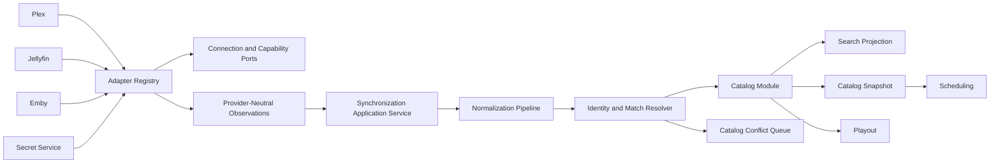

# Milestone 05: Media Sources and Catalog

- **Roadmap version:** 0.1
- **Milestone status:** Draft
- **Last updated:** 2026-07-27
- **Risk classification:** Domain / Integration / High
- **Implementation authority:** Canonical Media Sources, normalized Catalog, provider adapters, and synchronization

## Purpose

This milestone implements the provider-independent media foundation used by
ChannelForge scheduling and playout.

It defines:

- Media Source aggregate implementation
- Provider adapter registry
- Plex adapter
- Jellyfin adapter
- Emby adapter
- Credential-reference handling
- Connection probing
- Provider identity verification
- Capability discovery
- Library discovery
- Library inclusion
- Path mapping
- Provider-neutral observations
- Catalog Item aggregate implementation
- Catalog hierarchy
- Source Bindings
- Playback Variants
- Metadata provenance
- User metadata overrides
- Normalization
- Matching
- Deduplication
- Merge and split lineage
- Availability
- Artwork
- Synchronization jobs
- Full reconciliation
- Incremental synchronization
- Webhook hints
- Conflict handling
- Search and projections
- Catalog revision
- Catalog Snapshots
- Historical preservation
- Legacy migration
- API and UI foundations
- Testing
- Pull-request sequencing
- Entry and completion gates
- Rollback
- Risks
- Deferred decisions

This milestone does not implement the deterministic scheduling engine.

It produces the stable, normalized inputs that scheduling requires.

## Governing Specifications

This milestone is governed by:

- `docs/architecture/spec/01-terminology.md`
- `docs/architecture/spec/02-system-context.md`
- `docs/architecture/spec/03-domain-model.md`
- `docs/architecture/spec/04-scheduling-model.md`
- `docs/architecture/spec/05-media-catalog.md`
- `docs/architecture/spec/06-playout-and-output.md`
- `docs/architecture/spec/07-integrations.md`
- `docs/architecture/spec/08-persistence.md`
- `docs/architecture/spec/09-api.md`
- `docs/architecture/spec/11-security.md`
- `docs/architecture/spec/12-deployment.md`
- `docs/architecture/spec/13-testing.md`
- `docs/architecture/spec/14-migration.md`
- `docs/architecture/spec/15-interstitial-programming-and-external-video-feeds.md`
- `docs/implementation/README.md`
- `docs/implementation/01-baseline-and-change-control.md`
- `docs/implementation/02-module-boundaries.md`
- `docs/implementation/03-identity-persistence-and-migrations.md`
- `docs/implementation/04-legacy-compatibility.md`

## Milestone Mission

ChannelForge must own a normalized programming inventory without becoming a live
proxy for one media server.

The Media Sources and Catalog milestone must:

- Preserve provider connectivity
- Preserve credentials securely
- Preserve provider identity and provenance
- Prevent provider IDs from becoming canonical identity
- Keep provider payloads behind adapter boundaries
- Normalize Plex, Jellyfin, and Emby observations
- Support multiple configured servers of the same provider type
- Support multiple libraries per server
- Support multiple source copies of one logical title
- Support multiple playback variants per title
- Preserve historical references when sources disappear
- Reconcile deletions safely
- Avoid destructive synchronization
- Keep user overrides authoritative
- Make matching explainable
- Make merge and split reversible where practical
- Keep stream URLs out of canonical Catalog state
- Resolve stream access only at runtime
- Expose deterministic, stable Catalog queries
- Produce immutable Catalog Snapshots
- Support migration from inherited Tunarr program records
- Keep external calls outside database write transactions
- Keep synchronization restart-safe
- Keep one failed source from corrupting unrelated sources
- Preserve Docker and Unraid deployment assumptions

## Product Principle

The governing product principle remains:

> Build television networks, not playlists.

A network-first scheduling system requires a provider-independent Catalog.

The Catalog represents programmable media.

It does not represent one provider's playlist, library tree, or API payload.

## Core Principles

1. ChannelForge owns canonical Catalog Item identity.
2. ChannelForge owns Media Source identity.
3. Provider identifiers are qualified external identities.
4. Provider payloads do not become domain objects.
5. Metadata and playback availability are separate.
6. User overrides remain authoritative.
7. Synchronization is additive and reconciling.
8. Historical references survive source deletion.
9. Final playback URLs are resolved at playout time.
10. The scheduler reads local normalized state.
11. Provider failures remain isolated.
12. Deduplication is explainable.
13. Merge and split lineage is preserved.
14. Catalog queries are deterministically ordered.
15. Catalog Snapshots support reproducible planning.
16. External calls are bounded and cancelable.
17. Synchronization is idempotent.
18. Full reconciliation remains authoritative.
19. Webhooks are hints.
20. Provider credentials remain inside restricted boundaries.

## Scope

Version 1 includes built-in Media Source adapters for:

- Plex
- Jellyfin
- Emby

Version 1 Catalog may represent:

- Movies
- Series
- Seasons
- Episodes
- Specials
- Trailers
- Music videos
- Bumpers
- Idents
- Advertisements
- Filler
- Slates
- Other media

The first UI may expose a narrower subset.

The domain must not assume all programmable media are movies or episodes.

## Non-Goals

This milestone does not require:

- Automatic media acquisition
- Filesystem crawling outside configured adapters
- Public catalog federation
- Cloud-hosted catalog
- Cross-instance universal media IDs
- Machine-learning matching
- Final metadata-provider ecosystem
- DRM circumvention
- Permanent provider stream URLs
- Final FFmpeg command construction
- Final playback session management
- Final scheduling algorithms
- Final public release UI
- Plugin-provided source adapters
- Music-library scheduling
- Photo-library scheduling
- Full person-identity graph
- Distributed synchronization workers
- PostgreSQL
- Removal of every inherited Tunarr program table

## Current Baseline

The inherited runtime already supports Plex, Jellyfin, and Emby connectivity.

The inherited workspace exposes provider types through shared packages.

The current implementation likely mixes:

- Provider DTOs
- Program models
- Persistence records
- Scheduling models
- API contracts
- Playback details

Milestone 05 must route this behavior through the Media Sources and Catalog
module boundaries established in Milestone 02.

## Target Architecture



## Module Ownership

### Media Sources Owns

- Media Source
- Source Descriptor
- Provider type
- Credential Reference
- Connection policy
- Trust policy
- Library Binding
- Capability Snapshot
- Integration health
- Adapter selection
- Synchronization policy
- Provider Cursor
- Provider identity observation
- Source lifecycle
- Source-level diagnostics

### Catalog Owns

- Catalog Item
- Catalog hierarchy
- Source Binding
- Playback Variant
- Metadata provenance
- Effective normalized metadata
- User override
- Availability
- Match decision
- Catalog conflict
- Merge lineage
- Split lineage
- Artwork reference
- Custom Collection
- Catalog label
- Franchise relation
- Search projection
- Catalog revision
- Catalog Snapshot

### Jobs Owns

- Synchronization job execution state
- Retry
- Progress
- Cancellation
- Checkpoint
- Job failure
- Reconciliation job state

### Secret Service Owns

- Provider credential material
- Credential version
- Encryption
- Rotation
- Revocation
- Secret access audit

### Playout Owns

- Runtime playback-source selection
- Runtime URL resolution request
- Active stream decision
- FFmpeg process planning
- Stream sessions

## Module Boundary Rule

Media Sources produces normalized provider observations.

Catalog consumes observations.

Catalog domain logic does not call Plex, Jellyfin, or Emby directly.

## Media Source Aggregate

A Media Source represents one configured provider instance.

## Media Source Fields

Required conceptual fields:

```text
mediaSourceId
providerType
displayName
sourceDescriptor
credentialReference
enabledState
trustPolicy
connectionPolicy
synchronizationPolicy
preferredMetadataPriority
playbackPriority
healthState
activeCapabilitySnapshotId
adapterVersion
createdAt
updatedAt
archivedAt
version
```

## Provider Type

Initial built-in values:

- `PLEX`
- `JELLYFIN`
- `EMBY`

Future values may include:

- `LOCAL_INDEX`
- `GENERIC_HTTP`
- `CUSTOM_PLUGIN`

Provider type values are stable domain identifiers.

They are not inferred from display name or URL.

## Media Source Identity

Every Media Source has a ChannelForge-owned `mediaSourceId`.

Changing any of these does not automatically create a new Media Source:

- Display name
- Hostname
- Port
- Scheme
- Credential
- Internal address
- External address
- Metadata priority
- Playback priority
- Included libraries

A new Media Source is required when the provider instance should be treated as
independently addressable, auditable, and synchronized.

## Source Identity Verification

A provider adapter should return a provider identity observation.

Possible fields:

- Provider server identifier
- Provider machine identifier
- Product name
- Server name
- Provider version
- Installation identifier
- Owner identity where safe
- Account scope
- Observed timestamp

## Source Identity Change

A provider identity change may indicate:

- Server reinstall
- Wrong URL
- Restored provider database
- Reverse-proxy target change
- Credential switched to different server
- Provider bug

The operator must not be silently moved to a different provider instance when
identity changes materially.

## Source Identity Conflict

Possible outcomes:

- Accept identity change
- Treat as new Media Source
- Revert configuration
- Mark conflict
- Disable synchronization
- Continue read-only diagnostics

## Source Descriptor

A Source Descriptor includes:

- Provider type
- Internal base URI
- External base URI where needed
- Client-facing base URI where needed
- Credential Reference
- TLS policy
- Proxy policy
- Timeout policy
- Redirect policy
- Allowed custom headers
- Included library IDs
- Excluded library IDs
- Source labels
- Enabled state

## Address Purposes

A Media Source may require separate addresses for:

- Server-to-server calls
- Container-to-host calls
- Client-visible URLs
- Reverse-proxy calls
- Local-LAN calls
- Remote provider calls

Address purpose must be explicit.

## Base URI Validation

Validation must include:

- Allowed scheme
- Host
- Port range
- Path normalization
- No embedded credentials
- No fragment where unsupported
- No unsupported protocol
- Trusted-host policy
- Loopback policy
- Link-local policy
- Metadata-service address protection
- Redirect policy
- DNS rebinding policy
- Credential forwarding policy

## Local Deployment Policy

ChannelForge must support ordinary local deployment without requiring a reverse
proxy.

## TLS Policy

Supported policy may include:

- Standard validation
- Custom trust store
- Explicit self-signed trust
- Certificate pinning
- Source-scoped insecure mode

## Insecure TLS Mode

Insecure mode must:

- Be disabled by default
- Be source-specific
- Display a warning
- Be audited
- Never apply globally
- Never disable unrelated provider security

## Proxy Policy

A Source may use:

- Direct connection
- Instance proxy
- Source-specific proxy
- No proxy for local addresses

Proxy credentials are secret material.

## Redirect Policy

Adapters define:

- Maximum redirects
- Cross-host redirects
- Scheme downgrade
- Credential forwarding
- Signed URL behavior

Authorization headers must not be forwarded to unrelated hosts.

## Credential Reference

Media Source records store a Credential Reference.

They do not store decrypted secret material.

## Provider Credential Types

Possible types:

- API token
- Access token
- Username and password
- Device authorization result
- Refresh credential
- Client certificate
- Custom header secret

Version 1 should prefer provider-issued tokens over reusable passwords.

## Credential Access

An adapter receives secret material only for the duration of the provider
operation.

## Credential Prohibitions

Secrets must not be:

- Stored in Catalog tables
- Returned through ordinary API responses
- Included in Schedule Plans
- Included in XMLTV
- Included in ordinary M3U
- Logged
- Embedded in exceptions
- Embedded in audit notes
- Included in support bundles without redaction
- Included in provider-neutral observations
- Included in search indexes

## Credential Rotation

Rotation must:

1. Store new secret material atomically.
2. Preserve Media Source ID.
3. Increment credential version.
4. Run connection verification.
5. Recalculate source health.
6. Record audit.
7. Avoid deleting Catalog state on transient failure.
8. Retain rollback according to secret policy.
9. Invalidate old HTTP clients.
10. Avoid exposing old or new secret.

## Credential Revocation

Revocation:

- Blocks new provider operations
- Marks authentication state
- Preserves Catalog state
- Preserves approved plans
- Preserves history
- May permit bounded cached runtime access only if policy explicitly allows it

## Media Source Lifecycle

Suggested states:

- `UNCONFIGURED`
- `UNVERIFIED`
- `AVAILABLE`
- `DEGRADED`
- `UNAVAILABLE`
- `AUTHENTICATION_FAILED`
- `DISABLED`
- `ARCHIVED`
- `CONFLICT`

## Source Activation

A Media Source becomes active only after:

- Configuration validates
- Provider identity resolves
- Credential validates
- Adapter supports provider version
- At least one supported library exists or source purpose is explicit
- No blocking identity conflict exists
- Required security policy passes

## Source Disable

Disabling a Media Source:

- Stops new synchronization
- Stops new runtime selection
- Preserves Catalog Items
- Preserves Source Bindings
- Preserves history
- Recalculates availability
- May mark future plans stale
- Does not delete credentials automatically

## Source Archive

Archiving:

- Disables source
- Preserves identity
- Preserves Source Bindings
- Preserves history
- Hides source from ordinary lists
- Requires explicit restoration
- Does not hard-delete credentials until retention policy permits

## Connection Setup Workflow

1. Select provider type.
2. Enter address.
3. Provide or authorize credential.
4. Validate address.
5. Run connection probe.
6. Display provider identity.
7. Run capability discovery.
8. Discover libraries.
9. Select libraries.
10. Save source configuration.
11. Queue initial synchronization.
12. Establish health state.

## Connection Test

Connection Test must not mutate the Catalog.

It may persist:

- Test timestamp
- Reachability
- Authentication result
- Provider identity
- Provider version
- Capability observation
- Latency
- TLS observation
- Warning
- Error classification

## Adapter Registry

The Adapter Registry maps provider type and adapter version to an
implementation.

## Adapter Registration

Each registration includes:

- Provider type
- Adapter version
- Supported ports
- Configuration schema
- Capability declarations
- Provider-version range
- Fixture version
- Migration support
- Deprecation state
- Health-check support
- Playback-resolution support
- Webhook support

## Unknown Adapter

An unknown provider type or adapter version cannot be activated.

## Adapter Version

Adapter version changes when behavior affecting normalized observations changes.

## Adapter Upgrade

An adapter upgrade may trigger:

- Capability refresh
- Full synchronization
- Observation reparse
- Search projection rebuild
- Conflict review
- Catalog revision change
- Migration

## Adapter Ports

Core ports include:

```text
ConnectionProbePort
ProviderIdentityPort
CapabilityDiscoveryPort
LibraryDiscoveryPort
CatalogEnumerationPort
CatalogItemDetailPort
ArtworkAccessPort
PlaybackResolutionPort
ChangeFeedPort
WebhookVerificationPort
ProviderHealthPort
```

An adapter implements only supported ports.

## Connection Probe Port

Input:

- Source Descriptor
- Credential Reference
- Timeout
- Cancellation
- Correlation ID

Output:

- Reachability
- Authentication result
- Provider identity
- Provider version
- Server time
- Latency
- TLS observation
- Warnings
- Error classification

## Capability Discovery Port

Returns a normalized Capability Snapshot.

Potential capability values:

- Library enumeration
- Incremental updates
- Webhooks
- Artwork access
- Direct stream
- Provider transcode
- Byte ranges
- Offset seek
- Multiple media parts
- Multiple versions
- Audio selection
- Subtitle selection
- User-scoped visibility
- Deletion events
- Update tokens
- Item version tokens
- Remote access
- Local path exposure

## Capability State

Values:

- `SUPPORTED`
- `UNSUPPORTED`
- `UNKNOWN`
- `DEGRADED`
- `REQUIRES_CONFIGURATION`

## Capability Snapshot

Fields:

```text
capabilitySnapshotId
mediaSourceId
adapterVersion
providerVersion
observedAt
capabilities
confidence
warnings
expiresAt
contentChecksum
```

Capabilities are observations.

They are not permanent provider assumptions.

## Library Discovery Port

Returns normalized Library Descriptors.

## Library Descriptor

Fields:

- External library ID
- Name
- Library type
- Included media kinds
- Item count estimate
- Enabled or hidden state
- Provider update timestamp
- Parent scope
- Access state
- Provider metadata
- Warning list

## Normalized Library Types

- `MOVIES`
- `TV`
- `MIXED`
- `MUSIC`
- `PHOTOS`
- `OTHER`

Version 1 Catalog import may exclude unsupported library types.

Unsupported libraries should remain visible for diagnostics where practical.

## Library Binding

A Library Binding records operator inclusion and synchronization policy.

Fields:

```text
libraryBindingId
mediaSourceId
externalLibraryId
libraryType
displayName
inclusionState
synchronizationPolicy
importFilters
lastDiscoveredAt
lastSynchronizedAt
archivedAt
version
```

## Library Inclusion State

- `PENDING_REVIEW`
- `INCLUDED`
- `EXCLUDED`
- `UNSUPPORTED`
- `MISSING`
- `ARCHIVED`

## Library Inclusion

Library inclusion is explicit.

A newly discovered library defaults according to instance policy.

Changing inclusion queues synchronization and recalculates availability.

## Library Removal

A missing library:

- Is not deleted immediately
- Enters grace state
- Preserves Source Bindings
- Preserves Catalog history
- Creates source health finding
- May mark future plans stale

## Path Mapping

Path mapping translates provider paths to ChannelForge-accessible paths where
direct file access is permitted.

## Path Mapping Fields

- Media Source ID
- Provider path prefix
- ChannelForge path prefix
- Platform
- Case policy
- Separator policy
- Priority
- Enabled state
- Validation state
- Last verified
- Notes

## Path Mapping Invariants

- Mapping is source-scoped
- Mapping does not escape approved roots
- Mapping preserves relative suffix
- Most specific matching prefix wins
- Ordering is deterministic
- Mapping is validated on Windows and Linux
- Provider path remains preserved
- Failed mapping does not delete variant
- Direct path is not required for provider-mediated playback

## Path Mapping Security

Prevent:

- Directory traversal
- Unapproved host paths
- Secret paths in API
- Writable media mount assumption
- Symlink escape
- Case-fold collision
- UNC misuse
- Container-host confusion

## Provider-Neutral Observation

Adapters emit normalized observations.

They do not emit provider DTOs to Catalog.

## Source Item Observation

Conceptual fields:

```text
mediaSourceId
adapterVersion
providerVersion
externalLibraryId
externalItemType
externalItemId
externalParentIds
sourceVersionToken
observedAt
fieldObservations
artworkObservations
playbackVariantObservations
warnings
rawPayloadReference
```

## Field Observation

Fields:

- Field name
- Raw value
- Normalized candidate
- Source field
- Locale
- Precision
- Confidence
- Warning
- Observed timestamp

## Observation Invariants

- External identity is qualified
- Source values are preserved
- Invalid values are recorded as warnings
- Secrets are absent
- Output is deterministic for the same provider payload and adapter version
- Provider-specific semantics stay inside adapter
- Observation schema is versioned

## Provider Error

Adapters translate failures into stable categories.

## Error Categories

- `INVALID_CONFIGURATION`
- `AUTHENTICATION_FAILED`
- `AUTHORIZATION_FAILED`
- `NOT_FOUND`
- `TIMEOUT`
- `RATE_LIMITED`
- `PROVIDER_UNAVAILABLE`
- `UNSUPPORTED_PROVIDER_VERSION`
- `INVALID_RESPONSE`
- `PARTIAL_RESPONSE`
- `CONNECTION_RESET`
- `TLS_FAILED`
- `CANCELLED`
- `UNKNOWN`

## Retryability

Retryability is explicit.

Likely retryable:

- Timeout
- Temporary unavailable
- Rate limit
- Connection reset
- Selected server error
- Transient cursor failure

Likely non-retryable:

- Invalid configuration
- Authentication failure
- Authorization failure
- Unsupported provider version
- Invalid permanent ID
- Explicit item not found

## Timeout Policy

Timeout classes:

- Connection timeout
- Request timeout
- Streaming response timeout
- Idle read timeout
- Operation budget

Large synchronization must not use one unbounded request.

## Cancellation

Every job-bound external operation accepts cancellation.

Cancellation must:

- Stop pagination
- Close response bodies
- Release sockets
- Preserve completed checkpoints
- Mark job state
- Avoid Catalog corruption

## Retry Policy

Fields:

- Maximum attempts
- Initial delay
- Maximum delay
- Backoff
- Jitter
- Retryable categories
- Rate-limit policy
- Operation budget
- Cancellation

## Rate Limiting

Per-source rate-limit handling may use:

- Provider `Retry-After`
- Quota reset
- Remaining request count
- Adapter defaults
- ChannelForge limiter

## Request Concurrency

Per-source concurrency is bounded.

Separate limits may apply to:

- Catalog listing
- Item detail
- Artwork
- Playback resolution
- Health
- Webhook verification

## HTTP Client Boundary

Adapters use a controlled HTTP client abstraction supporting:

- Timeouts
- Cancellation
- Redaction
- Correlation IDs
- Retry hooks
- Metrics
- TLS policy
- Proxy policy
- Response-size limits
- Streaming
- Test substitution

## Response Size Limits

Bound:

- Metadata responses
- Error bodies
- Artwork
- Webhooks
- Pagination pages

## Catalog Aggregate

Catalog Item is the principal Catalog aggregate root.

It represents one logical programmable unit.

## Catalog Item Fields

Conceptual fields:

```text
catalogItemId
mediaKind
canonicalTitle
sortTitle
originalTitle
alternateTitles
summary
longDescription
tagline
releaseDate
releaseYear
originalAirDate
durationMs
contentRating
genres
tags
languages
countries
studios
credits
seriesId
seasonId
seasonNumber
episodeNumber
absoluteEpisodeNumber
availabilityState
metadataCompletenessState
artworkState
contentRevision
createdAt
updatedAt
archivedAt
```

Fields that do not apply remain absent.

They are not fabricated.

## Catalog Item Identity

Every Catalog Item has a ChannelForge-owned `catalogItemId`.

It remains stable through:

- Title correction
- Metadata correction
- Source URL change
- Source server change
- Library move
- Path change
- Encoding replacement
- Artwork change
- Source archival
- Provider migration

## Identity Is Not Title

Title changes do not create new Catalog Items automatically.

## Identity Is Not Provider Location

Provider path, URL, library, and media-part location are Source Binding or
Playback Variant concerns.

## Media Kind

Initial values:

- `MOVIE`
- `SERIES`
- `SEASON`
- `EPISODE`
- `SPECIAL`
- `TRAILER`
- `MUSIC_VIDEO`
- `BUMPER`
- `IDENT`
- `ADVERTISEMENT`
- `FILLER`
- `SLATE`
- `OTHER`

## Media Kind Change

A kind change may require:

- Hierarchy validation
- Scheduling eligibility recalculation
- Source Binding review
- Conflict
- Audit
- Catalog revision change

A kind change must not rewrite approved historical Schedule Entries.

## Catalog Hierarchy

Normal episodic hierarchy:

```text
Series
  -> Season
    -> Episode
```

## Hierarchy Rules

- Season belongs to one Series
- Episode belongs to one Series
- Episode may belong to one Season
- Special may belong to a Series without ordinary Season
- Movie requires no Series
- Presentation media requires no episodic hierarchy
- Hierarchy uses ChannelForge IDs
- Provider parent IDs remain in Source Bindings or observations

## Hierarchy State

- `RESOLVED`
- `PENDING_PARENT`
- `CONFLICT`
- `ORPHANED`
- `MANUALLY_ASSIGNED`

## Missing Parent

Missing parent records:

- Do not fabricate identity
- Create warning
- May create placeholder parent if policy explicitly permits
- Exclude item from ordered series scheduling where unsafe
- Remain eligible for standalone programming if policy permits

## Hierarchy Correction

Correction:

- Preserves Catalog Item ID where possible
- Records previous relationship
- Updates progression indexes
- Marks dependent draft plans stale
- Does not mutate approved Schedule Entries

## Title Model

### Canonical Title

Default precedence:

1. User override
2. Accepted manual resolution
3. ChannelForge normalized decision
4. Preferred metadata provider
5. Preferred Media Source
6. Other Media Source
7. Generated placeholder

### Sort Title

Sort Title:

- Supports deterministic ordering
- May remove leading articles
- May normalize punctuation
- May be locale-aware
- May be overridden
- Is not identity

### Original Title

Preserves original-language title where known.

### Alternate Titles

Records:

- Value
- Locale
- Type
- Provenance
- Confidence
- Active state

## Description Model

Fields:

- Summary
- Long description
- Tagline

Generated text must be identified as generated or derived.

## Date Model

Possible fields:

- Release date
- Original air date
- Digital release date
- Physical release date
- Year-only fallback

Partial precision must be retained.

## Duration

Duration is scheduling-critical.

## Duration Sources

Potential sources:

- Provider item duration
- Playback Variant duration
- Measured probe duration
- User override
- Imported legacy duration

## Duration Precedence

Recommended:

1. User override
2. Verified measured duration
3. Preferred available Playback Variant
4. Trusted provider duration
5. Migrated legacy duration
6. Unknown

## Duration Conflict

A material duration mismatch creates:

- Warning
- Conflict when above tolerance
- Availability or playout preflight impact
- Catalog revision change
- Possible plan staleness

## Duration Precision

Store integer milliseconds unless stronger precision is proven necessary.

## Rating Model

Content ratings should preserve:

- Rating system
- Region
- Value
- Source
- Unrated state
- Unknown state

Missing rating does not mean unrestricted.

## Genre and Tag Model

Provider labels are preserved.

Canonical genres and tags may map provider values.

Mappings are:

- Versioned
- Reversible
- Auditable
- Non-destructive

## Credits

Credits may include:

- Name
- Role
- Character
- Billing order
- Source
- External person ID
- Provenance

Version 1 does not require a full person graph.

## Studio and Network Metadata

Original broadcast network metadata remains descriptive Catalog metadata.

It is not a ChannelForge Network entity.

## Language

Use standard language tags where practical.

Preserve unknown raw source values.

## Country

Use stable normalized codes where practical.

Do not infer country solely from language.

## Source Binding

A Source Binding connects one Catalog Item to one item on one Media Source.

## Source Binding Fields

```text
sourceBindingId
catalogItemId
mediaSourceId
externalItemType
externalItemId
externalLibraryId
externalParentIds
externalPathOrKey
externalVersionToken
sourceMetadataChecksum
sourceAvailabilityState
firstSeenAt
lastSeenAt
lastSynchronizedAt
missingSince
archivedAt
matchState
matchConfidence
matchDecisionId
```

## Source Binding Unique Identity

Default uniqueness:

```text
mediaSourceId
+ externalItemType
+ externalItemId
```

Library scope may be included when provider semantics require it.

## External ID Reuse

Provider reuse of an external ID for a different item creates a conflict.

It must not silently replace the prior binding.

## Source Binding States

- `ACTIVE`
- `MISSING`
- `UNAVAILABLE`
- `DISABLED`
- `CONFLICT`
- `ARCHIVED`

## Source Binding Match State

- `NEW`
- `AUTO_MATCHED`
- `MANUALLY_MATCHED`
- `MANUALLY_CREATED`
- `REVIEW_REQUIRED`
- `REJECTED_MATCH`
- `SPLIT`
- `MERGED`

## Source Snapshot

A synchronization may retain a normalized Source Snapshot.

Fields:

- Source Binding ID
- Adapter version
- Provider version
- Raw payload reference
- Normalized payload reference
- Payload checksum
- Observed timestamp
- Parse warnings
- Field observations
- Parent relationships
- Playback observations

Raw payload retention is bounded.

Normalized provenance required for decisions remains available.

## Playback Variant

A Playback Variant represents one playable realization through one Source
Binding.

## Playback Variant Fields

```text
playbackVariantId
sourceBindingId
externalMediaPartId
container
videoCodec
audioCodecs
subtitleCodecs
width
height
aspectRatio
frameRate
scanType
bitRate
hdrFormat
colorCharacteristics
audioChannelCount
audioTracks
subtitleTracks
durationMs
fileSize
sourcePathOrKey
directPlayObservations
directStreamObservations
transcodeObservations
availabilityState
lastVerifiedAt
variantVersionToken
```

## Playback Variant Identity

A variant remains stable while the provider treats it as the same media part.

Replacing the underlying file may:

- Update variant
- Create new variant
- Archive old variant
- Trigger duration reevaluation
- Trigger capability reevaluation

## Playback Variant States

- `AVAILABLE`
- `UNVERIFIED`
- `MISSING`
- `UNPLAYABLE`
- `DISABLED`
- `ARCHIVED`

## Capability Observation

A Playback capability observation may include:

- Output profile
- Direct play
- Direct stream
- Transcode required
- Container compatibility
- Codec compatibility
- Bit-rate compatibility
- Subtitle burn requirement
- Observed timestamp
- Source version
- ChannelForge version

Final runtime decision occurs in Playout.

## Stream URL Rule

Permanent provider stream URLs are not canonical Playback Variant identity.

Short-lived URLs may be cached only with:

- Expiration
- Source Binding reference
- Security controls
- Redaction
- Runtime-cache classification

## Availability

Catalog Item availability is derived.

## Catalog Availability States

- `AVAILABLE`
- `PARTIALLY_AVAILABLE`
- `UNAVAILABLE`
- `UNKNOWN`
- `ARCHIVED`

## Available

At least one eligible Source Binding has at least one usable Playback Variant.

## Partially Available

At least one usable option remains, but one or more expected bindings or
variants are unavailable.

## Unavailable

No eligible usable Playback Variant remains.

## Unknown

Availability is unverified or synchronization is incomplete.

## Archived

Item remains historical but is excluded from ordinary programming.

## Availability Inputs

- Media Source enabled state
- Source health
- Library inclusion
- Source Binding state
- Playback Variant state
- Manual exclusion
- Output-profile requirements
- Verification age
- Local-path requirement
- Codec or container requirement

## Availability Change

When availability changes:

- Recalculate Catalog Item
- Increment scheduling-relevant Catalog revision
- Emit event
- Affect future plans
- Mark dependent draft plans stale
- Do not mutate approved plans
- Permit Playout to choose alternate variant
- Recalculate health findings

## Metadata Provenance

Every effective field must be explainable.

## Provenance Types

- `USER_OVERRIDE`
- `SOURCE`
- `METADATA_PROVIDER`
- `DERIVED`
- `MIGRATED`
- `PACK_IMPORT`
- `SYSTEM_DEFAULT`

## Provenance Fields

```text
provenanceId
catalogItemId
fieldName
valueReference
provenanceType
sourceEntity
sourceField
observedAt
confidence
precedence
acceptedState
supersededAt
decisionId
```

## Default Metadata Precedence

1. User override
2. Accepted manual resolution
3. ChannelForge normalized decision
4. Preferred metadata provider
5. Preferred Media Source
6. Other Media Sources
7. Derived value
8. System fallback

Precedence may differ by field.

## Field-Specific Precedence

Examples:

- Duration may prefer measured variant
- Artwork may prefer user upload
- Rating may prefer regional provider
- Episode order may prefer configured order source
- Summary may preserve local provider edits

## User Override

A user override records:

- Target field or relationship
- Prior effective value
- New value
- Actor
- Timestamp
- Note
- Active state

Synchronization cannot overwrite an active user override.

## Override Removal

Removing an override recalculates effective value from remaining provenance.

## Normalization Pipeline

Canonical sequence:

```text
1. Fetch source records
2. Parse provider payload
3. Validate source identity
4. Emit provider-neutral observations
5. Normalize field candidates
6. Resolve hierarchy
7. Resolve or create Catalog Item identity
8. Upsert Source Binding
9. Upsert Playback Variants
10. Recalculate effective metadata
11. Recalculate availability
12. Detect conflicts
13. Commit bounded transaction
14. Emit events after commit
15. Update projections
16. Advance checkpoint
```

## Normalization Requirements

Normalization is:

- Deterministic
- Versioned
- Idempotent
- Source-aware
- Locale-aware where required
- Non-destructive
- Explainable
- Safe under partial data
- Testable from fixtures

## Normalization Version

A normalization version identifies behavior affecting canonical output.

A version change may require:

- Reprocessing observations
- Catalog revision change
- Conflict review
- Search rebuild
- Snapshot invalidation
- Migration

## Text Normalization

May include:

- Unicode normalization
- Whitespace normalization
- Control-character removal
- Safe HTML stripping
- Punctuation normalization
- Search case folding

Original source value remains preserved.

## Date Normalization

Preserve:

- Parsed value
- Precision
- Time zone when supplied
- Source
- Raw value
- Warning

Invalid dates remain raw observations and do not become effective normalized
values.

## Numeric Normalization

Define:

- Unit
- Rounding
- Precision
- Range
- Missing versus zero
- Overflow
- Warning

## Identifier Normalization

External IDs remain strings unless adapter guarantees other stable semantics.

Do not remove leading zeros or change case without provider-specific proof.

## Matching

Matching decides whether a Source Item Observation attaches to an existing
Catalog Item or creates a new item.

## Match Inputs

Potential signals:

- Provider metadata IDs
- Title
- Original title
- Alternate title
- Release year
- Exact date
- Media kind
- Series hierarchy
- Season and episode numbers
- Duration
- Edition
- Library context
- Existing operator decision
- Legacy mapping
- File fingerprint where available

## Match Outputs

- Existing Catalog Item
- New Catalog Item
- Review required
- Conflict
- Rejected match
- Distinct edition

## Match Decision

A Match Decision records:

- Candidate IDs
- Evidence
- Algorithm version
- Confidence
- Threshold
- Decision
- Actor or automatic policy
- Timestamp
- Reversibility
- Conflict reference

## Automatic Match

Automatic match is allowed only above configured confidence and when no
blocking ambiguity exists.

## Manual Match

Manual match requires:

- Source item
- Candidate preview
- Evidence
- Conflict check
- Actor confirmation
- Audit

## Matching Prohibitions

Do not match solely by:

- Title
- Provider row number
- File name
- Library position
- Database order
- First search result
- Unqualified external ID

## Deduplication

Deduplication is explainable and reversible where practical.

## Duplicate Candidate

A duplicate candidate is not a duplicate fact.

It requires evidence and state.

## Duplicate Candidate States

- `PROPOSED`
- `AUTO_ACCEPTED`
- `REVIEW_REQUIRED`
- `ACCEPTED`
- `REJECTED`
- `SUPERSEDED`

## Merge

A merge:

- Chooses surviving Catalog Item ID
- Preserves merged IDs as aliases or tombstones
- Reassigns eligible Source Bindings
- Reassigns provenance
- Preserves audit
- Preserves schedule references
- Records reason
- Creates lineage
- Detects binding collision

## Merge Invariants

- One surviving ID
- No duplicate active Source Binding
- Historical Schedule Entry remains interpretable
- User overrides are reviewed
- Hierarchy remains valid
- Collections update deterministically
- Search index rebuilds
- Catalog revision increments

## Split

A split:

- Preserves original lineage
- Creates one or more new Catalog Items
- Reassigns Source Bindings
- Copies or reassigns metadata deliberately
- Preserves historical references
- Records actor and reason
- Updates conflicts
- Updates projections

## Split Invariants

- Every active binding has one target
- Historical approved schedule is not silently rewritten
- New IDs are stable
- Mapping remains auditable
- Hierarchy is validated
- Availability recalculates

## Catalog Conflict

Conflict types may include:

- External ID reuse
- Ambiguous match
- Hierarchy conflict
- Duration mismatch
- Media-kind mismatch
- Provider identity mismatch
- Binding collision
- Metadata disagreement
- Edition ambiguity
- Missing parent
- Merge collision
- Split ambiguity

## Catalog Conflict State

- `OPEN`
- `AUTO_RESOLVED`
- `OPERATOR_RESOLVED`
- `DISMISSED`
- `SUPERSEDED`

## Conflict Resolution Actions

- Accept match
- Create new Catalog Item
- Merge
- Split
- Reassign Source Binding
- Override field
- Prefer source
- Archive binding
- Mark distinct edition
- Defer
- Dismiss false positive

Every action is audited.

## Artwork

Catalog artwork describes media.

It is distinct from Network or Channel presentation assets.

## Artwork Types

- Poster
- Background
- Banner
- Logo
- Thumbnail
- Episode still
- Square image
- Clear logo
- Icon
- Guide image

## Artwork Fields

```text
artworkId
catalogItemId
artworkType
source
sourceUrlOrKey
managedStorageReference
mimeType
width
height
fileSize
checksum
locale
suitability
preferredState
validationState
firstSeenAt
lastVerifiedAt
archivedAt
```

## Artwork States

- `REMOTE`
- `CACHED`
- `MANAGED`
- `MISSING`
- `INVALID`
- `ARCHIVED`

## Artwork Selection

Stable precedence:

1. User-selected
2. Network or Channel override where applicable
3. Preferred metadata provider
4. Preferred Media Source
5. Best validated dimensions
6. Locale
7. Stable ID tie-break

## Artwork Caching

Artwork may be:

- Proxied
- Cached
- Imported into managed storage
- Referenced remotely

## Artwork Security

Provider credentials must not appear in public artwork URLs.

## Artwork Validation

Validate:

- MIME
- File signature
- Dimensions
- Maximum size
- Corruption
- Path safety
- Animation policy
- Checksum

## Custom Collections

A Custom Collection groups Catalog Items for programming.

## Collection Fields

```text
collectionId
name
description
owner
membershipMode
staticMembers
dynamicSelector
includeOverrides
excludeOverrides
sortPolicy
createdAt
updatedAt
archivedAt
version
```

## Membership Modes

- `STATIC`
- `DYNAMIC`
- `HYBRID`

## Collection Invariants

- Members use Catalog Item IDs
- Provider collection IDs are not canonical
- Dynamic evaluation is deterministic for a Catalog Snapshot
- Historical snapshots retain archived members
- Collection changes increment Catalog revision
- Dependent draft plans may become stale

## Catalog Labels

Labels support programming-specific classification.

Examples:

- Holiday
- Family
- Late-night
- Comfort
- Premiere
- Classic
- Local
- Original
- Short-form
- High-priority

## Label Assignment

Records:

- Catalog Item ID
- Label ID
- Provenance
- Effective date range
- Created timestamp
- Removed timestamp

## Franchise Relationships

Franchise groups related works.

It does not imply Series hierarchy.

## Franchise Uses

- Repeat spacing
- Themed blocks
- Sequel ordering
- Spin-offs
- Shared-universe blocks

## Synchronization

Synchronization converts provider observations into Catalog state.

## Synchronization Types

- Full
- Incremental
- Targeted item
- Library-scoped
- Metadata refresh
- Artwork refresh
- Playback-variant refresh
- Reconciliation
- Migration import

## Synchronization Run

Fields:

```text
synchronizationRunId
mediaSourceId
mode
state
adapterVersion
providerVersion
normalizationVersion
startedAt
completedAt
cursor
checkpoint
observedCount
createdCount
updatedCount
unchangedCount
missingCount
conflictCount
warningCount
failureCount
```

## Synchronization State

- `QUEUED`
- `CONNECTING`
- `DISCOVERING`
- `ENUMERATING`
- `NORMALIZING`
- `COMMITTING`
- `RECONCILING`
- `COMPLETED`
- `COMPLETED_WITH_WARNINGS`
- `PAUSED`
- `CANCELLED`
- `FAILED`

## Full Synchronization

Full synchronization enumerates all included libraries.

## Full Synchronization Sequence

1. Create run.
2. Resolve adapter.
3. Resolve secret.
4. Probe source when required.
5. Capture capability snapshot.
6. Enumerate included libraries.
7. Enumerate items with stable pagination.
8. Normalize observations.
9. Stage bounded batch.
10. Commit Catalog changes.
11. Mark observed bindings.
12. Advance checkpoint.
13. Identify active bindings not observed.
14. Enter missing grace state.
15. Recalculate availability.
16. Detect conflicts.
17. Update search projection.
18. Update Catalog revision.
19. Emit events.
20. Complete run.

## Full Reconciliation Authority

Full reconciliation remains authoritative for detecting absence.

Incremental hints do not permanently replace it.

## Incremental Synchronization

Incremental synchronization may use:

- Provider cursor
- Update timestamp
- Item version token
- Webhook hint
- Library change token
- Provider event feed

## Incremental Rules

- Cursor is provider-specific and opaque
- Cursor is scoped to Media Source and adapter version
- Cursor commits after corresponding Catalog transaction
- Cursor failure does not delete unseen items
- Cursor reset triggers full reconciliation
- Provider omission is not deletion unless contract proves it
- Incremental state is restart-safe

## Webhook Hint

A webhook is a hint.

It may queue:

- Targeted refresh
- Library refresh
- Full reconciliation
- Health check

A webhook does not directly mutate canonical Catalog state.

## Webhook Requirements

- Verify source
- Bound payload
- Deduplicate
- Record event ID
- Return quickly
- Queue job
- Re-read provider state
- Avoid trusting payload as authoritative
- Rate limit

## Bounded Batches

Synchronization writes bounded batches.

## Batch Sequence

1. Fetch outside transaction.
2. Normalize outside transaction where practical.
3. Begin transaction.
4. Upsert Catalog Items.
5. Upsert Source Bindings.
6. Upsert Playback Variants.
7. Write provenance.
8. Write conflicts.
9. Update checkpoint.
10. Commit.
11. Emit progress.
12. Continue.

## Transaction Rules

- No provider call inside write transaction
- No artwork download inside Catalog write transaction
- No FFmpeg probe inside provider-call transaction
- Lock duration bounded
- Checkpoint corresponds to committed batch
- Failure preserves prior committed batches
- Retry is idempotent

## Missing Detection

A Source Binding not observed during full synchronization does not become
archived immediately.

## Missing Grace Period

A binding progresses:

```text
ACTIVE
-> MISSING
-> UNAVAILABLE
-> ARCHIVED
```

according to policy and repeated reconciliation.

## Missing Detection Inputs

- Full synchronization completed
- Library remained included
- Provider query covered relevant scope
- Provider identity unchanged
- No partial-response warning
- No cancellation
- No cursor ambiguity

## Partial Enumeration

A partial enumeration must not mark unseen items missing.

## Source Deletion

A provider deletion hint may:

- Queue targeted verification
- Mark candidate missing
- Preserve prior metadata
- Preserve historical references
- Await reconciliation according to policy

## Synchronization Failure Isolation

One malformed item should not fail the full run unless continuing is unsafe.

## Item Failure

Record:

- Source item identity
- Error category
- Adapter version
- Raw payload reference
- Warning
- Retryability
- Count
- Last occurrence

## Source-Level Failure

Source-level failure:

- Does not mutate unrelated Media Sources
- Does not delete Catalog state
- Updates source health
- Preserves approved plans
- Leaves prior Catalog state inspectable
- Schedules retry according to policy

## Synchronization Idempotency

Reprocessing the same observation set and versions must not duplicate effective
state.

## Idempotency Mechanisms

- Source Binding unique constraint
- Playback Variant identity
- Observation checksum
- Match Decision lookup
- Run checkpoint
- Upsert with expected version
- Provenance deduplication
- Conflict deduplication

## Synchronization Cancellation

Cancellation:

- Stops pagination
- Stops new provider requests
- Completes or rolls back current transaction
- Persists checkpoint
- Marks run canceled
- Preserves committed Catalog state
- Does not mark unseen items missing

## Synchronization Retry

Retry behavior:

- Resumes safe checkpoint
- Reuses run or creates linked attempt
- Respects provider rate limit
- Avoids duplicate mapping
- Avoids duplicate conflicts
- Records attempt

## Synchronization Scheduling

Per-source scheduling policy may define:

- Full interval
- Incremental interval
- Quiet hours
- Retry window
- Maximum duration
- Concurrency
- Maintenance suppression
- Manual-only mode

## Source Synchronization Serialization

Only one full synchronization per Media Source runs at a time.

Targeted refresh may run concurrently only when adapter and persistence policy
permit it.

## Cross-Source Concurrency

Different Media Sources may synchronize concurrently within global limits.

## Health Versus Availability

Integration Health describes provider reachability.

Catalog Availability describes playable inventory.

A temporarily unavailable provider does not immediately erase historical
availability.

## Integration Health Fields

- Reachability
- Authentication
- Authorization
- Provider version support
- Latency
- Error category
- Last success
- Last failure
- Consecutive failure count
- Capability freshness
- Synchronization freshness

## Source Health State

- `HEALTHY`
- `DEGRADED`
- `UNAVAILABLE`
- `AUTHENTICATION_FAILED`
- `UNSUPPORTED`
- `DISABLED`
- `UNKNOWN`

## Playback Resolution

Playback Resolution is an integration port used by Playout.

It does not return permanent Catalog URLs.

## Playback Resolution Input

- Media Source ID
- Source Binding ID
- Playback Variant ID
- Requested offset
- Output capability
- Transcode policy
- Cancellation
- Correlation ID

## Playback Resolution Output

- Access method
- Short-lived URL or direct path
- Required headers
- Expiration
- Seek support
- Provider transcode option
- Security classification
- Diagnostic warnings

## Playback Resolution Security

- Credentials remain server-side
- Signed URL is short-lived
- Logs redact query secrets
- Client receives only ChannelForge stream URL unless policy says otherwise
- Redirect does not forward credentials to unrelated host

## Playback Resolution Failure

Failure updates runtime diagnostics.

It does not delete Catalog Item.

It may update Playback Variant verification state through a separate bounded
command.

## Provider Adapters

## Plex Adapter

The Plex adapter must implement:

- Connection probe
- Provider identity
- Capability discovery
- Library discovery
- Item enumeration
- Item detail
- Hierarchy
- Media parts
- Artwork access
- Playback resolution
- Health
- Change hints where supported

### Plex Identity

Preserve:

- Server identity
- Library identity
- Item identity
- Parent identities
- Media-part identities
- Provider metadata IDs

### Plex Authentication

- Uses provider-issued access credential
- Keeps credential server-side
- Separates acquisition from synchronization
- Redacts token
- Reuses controlled client

### Plex Media Kinds

Normalize:

- Movie
- Series
- Season
- Episode
- Special where inferable
- Trailer or extra when configured
- Other

Provider extras do not automatically enter programming inventory.

### Plex Hierarchy

Preserve enough relationships for:

```text
Series -> Season -> Episode
```

Missing parents create warnings.

### Plex Playback Variants

Preserve:

- Media-part ID
- Container
- Video codec
- Audio codec
- Resolution
- Bit rate
- Duration
- File size
- Streams
- Path or key
- Version token

### Plex Playback Resolution

May return:

- Direct access
- Provider direct stream
- Provider transcode
- Required headers
- Offset parameters

ChannelForge decides whether provider-side transcoding is permitted.

### Plex Full Reconciliation

Provider change hints may accelerate synchronization.

Periodic full reconciliation remains required.

## Jellyfin Adapter

The Jellyfin adapter must implement:

- Connection probe
- Provider identity
- Capability discovery
- Library discovery
- Item enumeration
- User-scoped visibility
- Item detail
- Hierarchy
- Media source options
- Artwork
- Playback information
- Health
- Change hints where supported

### Jellyfin Identity

Preserve:

- Server identity
- Library identity
- Item identity
- Parent identity
- Media source identity
- Provider metadata IDs
- Version observation

### Jellyfin Authentication

The configured account must access included libraries and playback information.

### Jellyfin Hierarchy

Provider virtual folders must not become canonical Seasons without type
validation.

### Jellyfin Playback Variants

Preserve:

- Media source ID
- Path or remote key
- Container
- Protocol
- Runtime
- Bit rate
- Video streams
- Audio streams
- Subtitle streams
- Direct-play observations
- Transcode observations
- Version token

### Jellyfin Playback Resolution

May produce:

- Direct play
- Direct stream
- Provider transcode
- Stream selection
- Required token handling
- Offset behavior
- Container hints

## Emby Adapter

The Emby adapter must implement the same provider-neutral ports where supported.

### Emby Identity

Preserve:

- Server identity
- Library identity
- Item identity
- Parent identity
- Media source identity
- Provider metadata IDs
- Version observation

### Emby Authentication

- Uses provider-supported credential
- Remains server-side
- Has required library scope
- Has playback-information scope where needed

### Emby Hierarchy

Validate Series, Season, Episode, and Special relationships.

### Emby Playback Variants

Normalize provider media-source and stream details into Playback Variant
observations.

### Emby Version Differences

Provider-version-specific behavior remains inside adapter fixtures.

## Provider Contract Consistency

All adapters must produce equivalent semantic observation categories.

Equivalent does not mean identical provider fields.

## Adapter Fixture Suite

Each adapter requires fixtures for:

- Authentication success
- Authentication failure
- Server identity
- Version support
- Library discovery
- Movie
- Series
- Season
- Episode
- Special
- Multiple versions
- Multiple parts
- Missing parent
- Missing metadata
- Artwork
- Pagination
- Rate limit
- Timeout
- Partial response
- Deleted item
- Playback resolution
- Provider transcode
- Unsupported type

## Adapter Contract Test

The shared contract verifies:

- Provider-neutral output
- Qualified IDs
- Secret omission
- Stable pagination
- Error mapping
- Cancellation
- Retry classification
- Versioned fixtures
- No Catalog domain dependency
- Deterministic observation

## Search

Catalog search is a derived projection.

## Search Fields

- Canonical title
- Alternate title
- Series title
- Summary
- Genre
- Tag
- Label
- Cast and crew
- Studio
- Year
- Media kind
- Source
- Availability
- Collection
- Franchise
- External ID
- Catalog Item ID

## Search Normalization

May use:

- Case folding
- Diacritic folding
- Tokenization
- Prefix match
- Phrase match
- Stable ranking

## Search Authority

Search index is derived.

Catalog remains authoritative.

## Search Failure

Search failure must not prevent direct Catalog reads or synchronization commits.

## Search Rebuild

A rebuild:

- Uses Catalog revision
- Is restart-safe
- Has job status
- Uses bounded batches
- Swaps projection after validation where applicable
- Preserves old projection until replacement validates

## Filter Semantics

Filters distinguish:

- Missing
- Empty
- Unknown
- False
- Zero
- Archived
- Unavailable
- Disabled

## Sort Semantics

Stable sorts may include:

- Title
- Sort title
- Release date
- Original air date
- Duration
- Recently added
- Recently synchronized
- Availability
- Series order
- Deterministic randomized order

Every sort ends with Catalog Item ID tie-break.

## Pagination

Cursor pagination is preferred for large mutable Catalog collections.

Cursor includes:

- Sort key
- Catalog Item ID
- Filter fingerprint
- Sort fingerprint
- Catalog revision where required

## Catalog Revision

A scheduling-relevant Catalog revision changes when relevant state changes.

## Scheduling-Relevant Changes

- Catalog Item creation
- Archival
- Media kind
- Duration
- Rating
- Genre
- Tag
- Label
- Hierarchy
- Availability
- Collection membership
- Franchise membership
- Source Binding eligibility
- Playback Variant eligibility
- Effective guide title where snapshots require it

## Non-Scheduling Changes

Pure diagnostic metadata may use separate revision tracking.

## Catalog Snapshot

Scheduling consumes a stable Catalog Snapshot.

## Snapshot Fields

```text
catalogSnapshotId
createdAt
catalogRevisionWatermark
includedCatalogItemIds
metadataRevisionMap
availabilityRevisionMap
selectorEvaluationVersion
normalizationVersion
contentChecksum
retentionState
```

## Snapshot Strategies

Possible implementation:

- Materialized immutable item membership
- Revision watermark plus revision map
- Content-addressed selector result
- Generation input bundle
- SQLite snapshot abstraction

## Snapshot Requirements

A Catalog Snapshot must:

- Be immutable
- Be reproducible
- Use stable ordering
- Identify normalization version
- Identify selector version
- Include effective scheduling metadata
- Include availability decision inputs
- Preserve required lineage
- Have checksum
- Be retainable with approved plans
- Avoid live provider calls

## Snapshot Creation

Snapshot creation:

1. Resolve Catalog revision.
2. Evaluate eligibility.
3. Sort deterministically.
4. Capture IDs and revisions.
5. Calculate checksum.
6. Commit immutable snapshot.
7. Return Snapshot ID.

## Snapshot Staleness

A snapshot is not mutated.

New Catalog changes create a newer revision and snapshot.

## Historical Preservation

Approved Schedule Entries remain interpretable after:

- Title change
- Source Binding disappearance
- Artwork change
- Catalog archival
- Hierarchy correction
- Merge
- Split
- Metadata-provider change

## Historical Mechanisms

- Stable IDs
- Guide metadata snapshots
- Merge aliases
- Split lineage
- Archived provenance
- Tombstones
- Retained Catalog Snapshots

## Archival

Catalog Item archival:

- Removes new scheduling eligibility
- Preserves ID
- Preserves metadata
- Preserves Source Bindings
- Preserves provenance
- Preserves history
- Preserves audit
- Retains artwork according to policy

## Unarchive

Unarchive requires current validation of:

- Metadata
- Hierarchy
- Availability
- Conflicts
- Source Binding eligibility

## Hard Delete

Hard deletion is allowed only when:

- No Schedule Entry references
- No Airing references
- No audit retention
- No active Source Binding
- No collection or franchise dependency
- Policy permits
- Backup and rollback policy permits

Otherwise archive or tombstone.

## Legacy Migration

Inherited Tunarr program records migrate through compatibility and identity
mapping.

## Legacy Migration Inputs

Potential inputs:

- Legacy program ID
- Media source ID
- Provider item ID
- Type
- Title
- Duration
- Series and episode metadata
- File or provider key
- Custom show membership
- Filler membership
- Existing schedule references
- Artwork
- Provider metadata IDs

## Legacy Program Mapping

A legacy program may map to:

- Existing Catalog Item
- New Catalog Item
- Placeholder Catalog Item
- Conflict
- Tombstone
- Omitted unsupported item

## Legacy Mapping Namespace

Examples:

```text
tunarr.program
tunarr.custom-show
tunarr.filler-list
tunarr.media-source
```

## Migration Preservation

Migration must preserve:

- Legacy identity mapping
- Existing Channel references
- Existing schedule history
- User ordering intent
- Custom show membership
- Filler membership
- Provider connection
- Source metadata
- Duration
- Unsupported fields in migration evidence

## Legacy Media Source Migration

Each inherited provider configuration becomes or maps to one Media Source.

## Credential Migration

Credential migration:

- Uses Secret Service
- Never logs plaintext
- Preserves rollback
- Verifies connection
- Does not delete legacy credential until cutover policy permits

## Legacy Catalog Read

During migration:

1. Read canonical Catalog.
2. Resolve mapping.
3. Fall back to legacy program representation.
4. Record usage.
5. Avoid creating duplicate canonical item.
6. Create conflict when ambiguous.

## Migration Validation

Validate:

- Source counts
- Catalog Item counts
- Source Binding counts
- Playback Variant counts
- Custom show membership
- Filler membership
- Hierarchy
- Duration
- Provider identity
- Availability
- Existing schedule references
- Mapping uniqueness

## Catalog API Foundations

Exact routes are defined in API implementation milestone.

Required use cases include:

### Media Sources

- Create Media Source
- Test connection
- Update Source
- Rotate credential
- Enable
- Disable
- Archive
- Restore
- Discover capabilities
- Discover libraries
- Set inclusion
- Start synchronization
- Read synchronization history
- Read health

### Catalog

- List Catalog Items
- Read Catalog Item
- Search
- Filter
- Read Source Bindings
- Read Playback Variants
- Read provenance
- Set override
- Remove override
- Archive
- Restore
- Create manual item
- Resolve hierarchy
- Merge
- Split
- Reassign Source Binding
- Read conflicts
- Resolve conflict
- Manage collections
- Manage labels
- Create Catalog Snapshot

## API Contract Rules

- Use ChannelForge IDs
- Provider IDs remain qualified
- Credentials never returned
- Mutable resources use ETag
- Long synchronization returns Background Job
- Pagination stable
- Errors structured
- Conflicts explicit
- Archived state explicit
- Source health distinct from availability

## UI Foundations

Initial UI workflows:

- Add Media Source
- Test connection
- Review provider identity
- Review capabilities
- Select libraries
- Run synchronization
- View progress
- View source health
- Browse Catalog
- Filter by source and availability
- Inspect Source Bindings
- Inspect Playback Variants
- Inspect provenance
- Set override
- Resolve match conflict
- Merge
- Split
- Archive
- Restore

## UI Conflict Safety

Merge and split require:

- Preview
- Affected Source Bindings
- Affected collections
- Affected plans
- Historical policy
- Confirmation
- Audit note where required

## Observability

## Media Source Metrics

- Connection probes
- Probe latency
- Authentication failures
- Provider version
- Capability age
- Source health
- Request count
- Rate limit
- Retry
- Timeout
- Cancellation
- Per-source concurrency

## Synchronization Metrics

- Runs
- Duration
- Items observed
- Items created
- Items updated
- Items unchanged
- Items missing
- Conflicts
- Warnings
- Failures
- Batches
- Checkpoint age
- Throughput
- Retry
- Cancellation

## Catalog Metrics

- Item count by kind
- Availability
- Source Binding count
- Playback Variant count
- Missing bindings
- Unplayable variants
- Conflict count
- Override count
- Merge count
- Split count
- Catalog revision
- Snapshot count
- Search projection age

## Structured Logs

Fields:

- `module`
- `mediaSourceId`
- `providerType`
- `adapterVersion`
- `providerVersion`
- `libraryId`
- `synchronizationRunId`
- `catalogItemId`
- `sourceBindingId`
- `playbackVariantId`
- `operation`
- `durationMs`
- `retryCount`
- `correlationId`

## Log Prohibitions

Do not log:

- Provider credential
- Authorization header
- Signed URL
- Password
- Refresh token
- Full raw payload by default
- Unredacted private path in ordinary logs

## Health Endpoints

Authorized diagnostics may expose:

- Source health
- Capability freshness
- Synchronization freshness
- Conflict count
- Search freshness
- Snapshot freshness
- Adapter version
- Provider version support

## Testing Strategy

Milestone 05 requires:

- Domain tests
- Adapter contract tests
- Provider fixture tests
- Repository contract tests
- Synchronization tests
- Matching tests
- Conflict tests
- Migration tests
- API contract tests
- UI tests
- Security tests
- Performance tests
- Windows tests
- Linux tests
- Docker tests
- Unraid-relevant path tests

## Media Source Domain Tests

Test:

- Creation
- Invalid provider type
- Invalid address
- Identity change
- Activation
- Disable
- Archive
- Restore
- Credential rotation
- Credential revocation
- Library inclusion
- Version conflict

## Catalog Domain Tests

Test:

- Catalog Item creation
- Media kind validation
- Hierarchy
- Override
- Availability
- Archive
- Restore
- Merge
- Split
- Tombstone
- Provenance
- Revision change

## Source Binding Tests

Test:

- Qualified unique identity
- External ID reuse
- Missing state
- Grace transition
- Disable
- Archive
- Reassignment
- Match state
- Conflict

## Playback Variant Tests

Test:

- Multiple variants
- File replacement
- Duration mismatch
- Unplayable
- Missing
- Variant selection input
- URL exclusion
- Credential omission

## Normalization Tests

Test:

- Text
- Dates
- Partial dates
- Invalid date
- Duration
- Frame rate
- Bit rate
- Zero versus missing
- External ID case
- Unicode
- HTML stripping
- Raw preservation

## Match Tests

Test:

- Strong provider ID
- Same title and year
- Same title different year
- Movie versus trailer
- Episode hierarchy
- Duration disagreement
- Ambiguous result
- Existing manual decision
- Rejected match
- Distinct edition
- Stable result

## Merge Tests

Test:

- Binding reassignment
- Collision
- Provenance
- Override
- Collection
- Historical schedule
- Tombstone
- Search rebuild
- Rollback where supported

## Split Tests

Test:

- New IDs
- Binding assignment
- Metadata copy
- Hierarchy
- Historical schedule
- Conflict
- Audit

## Synchronization Tests

Test:

- Full run
- Incremental run
- Targeted run
- Empty library
- Pagination
- Retry
- Rate limit
- Cancellation
- Checkpoint
- Restart
- Partial response
- Missing detection
- Grace period
- Provider identity change
- Adapter version change
- Normalization version change
- Search update
- Catalog revision
- Event emission

## Synchronization Failure Injection

Inject:

- Failure before provider fetch
- Failure during pagination
- Failure after normalization
- Failure before transaction
- Failure during binding write
- Failure during variant write
- Failure before checkpoint
- Failure after commit
- Failure before event
- Failure before search update
- Process restart
- Disk full
- SQLite busy
- Permission denied

## Provider Contract Tests

Each provider adapter runs the same semantic contract.

## Plex Fixture Tests

Include:

- Valid server
- Invalid token
- Unsupported version
- Movie
- Series hierarchy
- Multiple media parts
- Artwork
- Pagination
- Missing parent
- Provider transcode
- Deleted item
- Partial response

## Jellyfin Fixture Tests

Include:

- Valid server
- Invalid token
- User-scoped library
- Virtual folder
- Multiple media sources
- Stream details
- Artwork
- Pagination
- Provider transcode
- Deleted item
- Partial response

## Emby Fixture Tests

Include equivalent provider-semantic cases.

## Secret Sentinel Tests

Synthetic secret value must not appear in:

- Logs
- Errors
- Catalog records
- Source observations
- Search index
- Snapshot
- XMLTV
- M3U
- Support bundle
- Audit note

## Catalog Snapshot Tests

Test:

- Same state produces same checksum
- Stable ordering
- Revision change
- Availability change
- Override change
- Archived item
- Merge
- Split
- Retention
- Approved-plan reference
- No provider call

## Search Tests

Test:

- Title
- Alternate title
- Diacritics
- Genre
- Tag
- Source
- Availability
- External ID
- Stable ranking
- Pagination
- Rebuild
- Search unavailable fallback

## Migration Tests

Test:

- Legacy Plex source
- Legacy Jellyfin source
- Legacy Emby source
- Legacy program
- Duplicate legacy item
- Custom show
- Filler
- Missing provider item
- Existing schedule reference
- Credential migration
- Mapping retry
- Rollback

## Windows Tests

Focus:

- Path mapping
- Drive letters
- UNC policy
- Separator conversion
- Case handling
- File locking
- SQLite cleanup
- Artwork cache rename

## Linux Tests

Focus:

- Container path
- Read-only media mount
- UID/GID
- Case sensitivity
- Symlink policy
- Signals
- SQLite WAL
- Artwork storage

## Docker Validation

Test:

- Internal provider address
- Host provider address
- Media path mapping
- Persistent Catalog state
- Restart synchronization
- Health
- Secret persistence
- Read-only media
- No provider token exposure

## Unraid Validation

Validate:

- `/config` persistence
- Media mount paths
- PUID
- PGID
- Host or bridge networking
- Local provider access
- Artwork cache
- Restart
- Library scale

## Performance Tests

Measure:

- Large library enumeration
- Observation normalization
- Match resolution
- Batch commit
- Catalog search
- Snapshot creation
- Source Binding lookup
- Variant lookup
- Full reconciliation
- Incremental update
- Search rebuild

## Performance Data Sets

- Small: 1,000 items
- Medium: 25,000 items
- Large: 100,000 items
- Stress: defined from observed home-server upper range

These are planning categories.

Exact supported limits require measurement.

## Performance Invariants

- No full Catalog load for ordinary item read
- No provider call for ordinary Catalog query
- No N+1 provider request pattern
- Bounded synchronization memory
- Bounded write transaction
- Stable pagination
- Indexed Source Binding lookup
- Indexed hierarchy lookup
- Indexed availability filtering

## Documentation Deliverables

Milestone 05 implementation should create:

```text
docs/implementation/media-catalog/
├── README.md
├── media-source-model.md
├── adapter-contract.md
├── provider-version-matrix.md
├── credential-boundary.md
├── library-inclusion.md
├── path-mapping.md
├── observation-schema.md
├── catalog-item-model.md
├── source-binding-model.md
├── playback-variant-model.md
├── provenance-policy.md
├── normalization-policy.md
├── matching-policy.md
├── merge-split-policy.md
├── availability-policy.md
├── synchronization-policy.md
├── conflict-policy.md
├── catalog-snapshot.md
├── migration-map.md
├── decision-register.md
└── completion-report.md
```

## Recommended Pull-Request Sequence

## PR 05A: Media Source Domain

Scope:

- Media Source aggregate
- IDs
- lifecycle
- source descriptor
- library binding
- repository
- tests

No live provider adapter cutover.

## PR 05B: Credential and HTTP Boundaries

Scope:

- Credential Reference
- Secret resolver port
- controlled HTTP client
- timeout
- cancellation
- redaction
- tests

## PR 05C: Adapter Registry and Contracts

Scope:

- Registry
- port interfaces
- capability model
- provider error
- shared contract tests
- fixture versioning

## PR 05D: Connection and Library Discovery

Scope:

- Connection probe
- provider identity
- capabilities
- libraries
- activation workflow
- no Catalog mutation during test

## PR 05E: Catalog Item Domain

Scope:

- Catalog Item
- media kinds
- hierarchy
- metadata
- archive
- repository
- tests

## PR 05F: Source Bindings

Scope:

- Binding schema
- qualified identity
- states
- matching state
- snapshots
- tests

## PR 05G: Playback Variants

Scope:

- Variant schema
- technical metadata
- availability
- URL exclusion
- tests

## PR 05H: Provenance and Overrides

Scope:

- Provenance
- field precedence
- overrides
- canonical serialization
- tests

## PR 05I: Normalization Pipeline

Scope:

- Provider-neutral observation
- normalization version
- text/date/numeric normalization
- deterministic tests

## PR 05J: Match Resolver

Scope:

- Candidate generation
- evidence
- confidence
- decisions
- conflict
- no automatic merge below threshold

## PR 05K: Merge and Split

Scope:

- lineage
- tombstones
- binding reassignment
- historical protection
- tests

## PR 05L: Synchronization Framework

Scope:

- Run model
- job handler
- batching
- checkpoint
- cancellation
- retries
- no provider-specific adapter yet

## PR 05M: Plex Adapter

Scope:

- Provider identity
- libraries
- enumeration
- item detail
- variants
- artwork
- playback-resolution port
- fixtures

## PR 05N: Jellyfin Adapter

Scope:

- Equivalent normalized contracts
- fixtures
- user-scoped visibility
- media-source options

## PR 05O: Emby Adapter

Scope:

- Equivalent normalized contracts
- fixtures
- version compatibility

## PR 05P: Full Reconciliation

Scope:

- Missing detection
- grace policy
- source health
- availability
- full-run tests

## PR 05Q: Incremental Synchronization and Webhooks

Scope:

- Provider cursor
- change hints
- webhook verification
- targeted refresh
- full reconciliation fallback

## PR 05R: Artwork

Scope:

- Artwork records
- proxy/cache
- validation
- secret-safe URLs
- managed storage

## PR 05S: Search and Catalog Projections

Scope:

- Search
- stable sorting
- pagination
- rebuild
- fallback

## PR 05T: Catalog Snapshot

Scope:

- Immutable snapshot
- checksum
- revision watermark
- scheduling input contract
- retention

## PR 05U: Legacy Migration

Scope:

- Legacy Media Source mapping
- program mapping
- custom-show and filler references
- credential migration
- compatibility read

## PR 05V: API Foundations

Scope:

- Management use cases
- schemas
- Background Job responses
- ETags
- errors
- no broad UI migration

## PR 05W: Initial UI Workflows

Scope:

- Add source
- select libraries
- run sync
- browse Catalog
- inspect conflicts
- feature flags
- compatibility caller transition

## PR 05X: Completion Report

Scope:

- Provider matrix
- Catalog metrics
- migration evidence
- snapshot evidence
- platform results
- remaining risks

## Pull-Request Requirements

Every Milestone 05 PR must state:

- Owning module
- Provider impact
- Schema impact
- Migration impact
- Compatibility mode
- Credential impact
- External-call behavior
- Transaction boundary
- Retry and cancellation
- Catalog revision impact
- Snapshot impact
- Historical impact
- Tests
- Rollback

## Pull-Request Prohibitions

Do not combine:

- Provider adapter and scheduler implementation
- Catalog schema and package rebranding
- Credential migration and unrelated security redesign
- Plex, Jellyfin, and Emby in one oversized PR
- Synchronization framework and UI redesign
- Match resolver and automatic destructive merge
- Search engine replacement and Catalog domain creation
- Artwork cache and Network branding redesign
- Catalog Snapshot and Schedule generator implementation
- Legacy migration and legacy table deletion

## Entry Gates

Milestone 05 may begin when:

1. Baseline inventory exists.
2. Module boundaries exist.
3. Media Sources and Catalog module ownership is accepted.
4. ChannelForge ID policy exists.
5. Persistence migration runner exists.
6. Transaction coordinator exists.
7. Legacy identity mapping exists.
8. Compatibility read framework exists.
9. Write authority is documented.
10. Secret boundary exists or has an accepted implementation plan.
11. Current provider adapters are inventoried.
12. Provider fixtures are available or planned.
13. Build passes.
14. Linux persistence tests pass.
15. Windows persistence issues are classified.
16. No critical compatibility conflict blocks source migration.

## Interstitial Programming and External Video Feeds Amendment

### Purpose

Milestone 05 owns the provider-independent media and discovery foundation for
Presentation Assets and External Video Feeds.

### Presentation Asset Foundation

Implement:

- Presentation Asset identity
- Presentation Asset kind
- Presentation Asset source association
- Local-file source support
- Managed-upload source support where approved
- Media Source-backed source support
- External-reference metadata
- Rights Status
- Playability Status
- Availability State
- External metadata provenance
- Duration and technical metadata
- Network and Channel scope references without owning those aggregates

Initial Presentation Asset kinds include:

- `BUMP`
- `COMMERCIAL`
- `PROMO`
- `STATION_ID`
- `PSA`
- `TRAILER`
- `FILLER`
- `TECHNICAL_SLATE`
- `OFF_AIR_SLATE`

### External Feed Foundation

Implement:

- External Feed aggregate
- External Feed Item entity
- Qualified provider identity
- Synchronization cursor
- Synchronization runs
- Discovery Inbox state
- Provider deletion and privacy transitions
- Feed-to-Catalog matching
- Feed-to-Presentation-Asset matching
- Operator-visible ambiguity
- Restart-safe synchronization
- Quota and retry metadata

### Initial Feed Adapters

Implement bounded metadata discovery for:

- YouTube Channels
- YouTube playlists
- RSS video feeds
- Atom video feeds

The official YouTube metadata API is the primary YouTube contract.

HTML scraping must not become the primary adapter behavior.

### Playback Boundary

Milestone 05 must preserve the distinction between:

- Metadata discovery
- Web-player eligibility
- Linear-planning eligibility
- Linear-playout eligibility

A YouTube watch URL is not a direct media source.

Milestone 05 must not add:

- YouTube downloading
- YouTube stream extraction
- YouTube-to-FFmpeg restreaming
- BumpWorthy scraping or downloading
- Arbitrary remote URL playback

### Default Automation Policy

The default External Feed policy is:

```text
DISCOVERY_INBOX
```

Automatic add or scheduling requires:

- A supported playable source
- Known duration
- Permitted Rights Status
- Permitted Playability Status
- Successful matching
- Explicit operator policy

### Suggested Additional Pull Requests

#### PR 05: Presentation Asset Domain

- Identity and persistence
- Source association
- Rights and playability
- Availability
- Unit and repository tests

#### PR 05: External Feed Domain

- Feed and Feed Item identity
- Synchronization state
- Cursor and checkpoint
- Discovery Inbox persistence
- Contract tests

#### PR 05: YouTube Metadata Adapter

- Official API client
- Channel and playlist resolution
- Upload discovery
- Quota handling
- Removal and privacy transitions
- Sanitized provider fixtures

#### PR 05: RSS and Atom Adapters

- Hardened XML parsing
- Feed and enclosure validation
- SSRF controls
- Metadata-only versus playable enclosure classification

#### PR 05: Matching and Eligibility

- Catalog matching
- Presentation Asset matching
- Conflict workflow
- Rights and playability gates
- Eligibility explanation

### Milestone 05 Completion Additions

Milestone 05 cannot be marked Complete until:

1. Presentation Asset identity and persistence exist.
2. Rights and Playability Status are enforced.
3. External Feed and Feed Item persistence exist.
4. Synchronization is deterministic in normalized output and restart-safe.
5. YouTube discovery uses the official metadata contract.
6. RSS and Atom parsing is security-hardened.
7. Discovery Inbox is the default policy.
8. Metadata-only items cannot enter linear planning.
9. Unsupported downloading and restreaming paths do not exist.
10. Provider connectivity for Plex, Jellyfin, and Emby remains intact.

## Completion Gates

Milestone 05 is Complete when:

1. Media Source aggregate exists.
2. Media Source IDs are canonical.
3. Source Descriptor exists.
4. Credentials use Secret References.
5. Secrets are absent from Catalog.
6. Connection Test does not mutate Catalog.
7. Provider identity verification exists.
8. Capability Snapshot exists.
9. Library discovery exists.
10. Library inclusion is explicit.
11. Path mapping is source-scoped.
12. Adapter Registry exists.
13. Provider-neutral ports exist.
14. Provider-neutral observation schema exists.
15. Plex adapter passes contract tests.
16. Jellyfin adapter passes contract tests.
17. Emby adapter passes contract tests.
18. Provider payloads stay behind adapters.
19. Provider errors map to stable categories.
20. Timeouts are bounded.
21. Cancellation works.
22. Retryability is explicit.
23. Per-source concurrency is bounded.
24. Catalog Item aggregate exists.
25. Catalog Item IDs are canonical.
26. Media kinds are implemented.
27. Hierarchy is implemented.
28. Source Binding exists.
29. Binding uniqueness is enforced.
30. External ID reuse creates conflict.
31. Playback Variant exists.
32. Stream URLs are excluded from canonical variants.
33. Metadata provenance exists.
34. User override precedence exists.
35. Normalization is versioned.
36. Normalization is deterministic.
37. Match decisions are explainable.
38. Automatic matching has threshold policy.
39. Merge lineage exists.
40. Split lineage exists.
41. Historical references survive merge and split.
42. Availability is derived.
43. Source disable recalculates availability.
44. Approved plans are not mutated.
45. Synchronization Run exists.
46. Full synchronization works.
47. Bounded batches work.
48. Checkpoints work.
49. Restart works.
50. Cancellation preserves committed work.
51. Partial responses do not mark unseen items missing.
52. Missing grace policy exists.
53. Full reconciliation remains authoritative.
54. Incremental synchronization works where supported.
55. Webhooks are hints.
56. One source failure does not corrupt another.
57. Search projection exists.
58. Stable Catalog sorting exists.
59. Stable pagination exists.
60. Catalog revision exists.
61. Catalog Snapshot exists.
62. Snapshot checksum is deterministic.
63. Snapshot requires no provider call.
64. Legacy Media Sources migrate.
65. Legacy programs map to Catalog.
66. Custom show and filler references are preserved.
67. Credential migration is secret-safe.
68. API use cases exist.
69. Initial UI workflows exist.
70. Secret sentinel tests pass.
71. Windows path tests pass or classified failures are tracked.
72. Linux tests pass.
73. Docker validation passes.
74. Unraid-relevant validation passes.
75. Performance baseline exists.
76. Completion report exists.
77. Milestone 06 entry is approved.

## Completion Evidence

The completion report should include:

- Provider adapter versions
- Supported provider-version ranges
- Media Source counts
- Library counts
- Catalog Item counts
- Source Binding counts
- Playback Variant counts
- Conflict counts
- Override counts
- Full synchronization result
- Incremental result
- Retry result
- Cancellation result
- Restart result
- Snapshot checksum result
- Legacy migration result
- Secret sentinel result
- Windows result
- Linux result
- Docker result
- Unraid result
- Performance result
- Open risks

## Rollback

Milestone 05 must preserve compatibility fallback until cutover gates close.

## Media Source Rollback

Rollback may:

- Disable canonical source mode
- Restore legacy source read
- Preserve Media Source IDs
- Preserve credential references
- Preserve mappings
- Stop canonical synchronization jobs

## Catalog Rollback

Rollback may:

- Return Catalog reads to compatibility adapter
- Preserve canonical Catalog tables
- Preserve mappings
- Preserve conflicts
- Stop canonical writes
- Preserve approved schedule references

## Provider Adapter Rollback

Rollback may select prior adapter version when:

- Fixture compatibility exists
- Schema remains supported
- Cursor is compatible or reset
- Full reconciliation follows

## Synchronization Rollback

Do not roll back committed source observations by deleting source state
automatically.

Use prior snapshot, backup, or corrective synchronization.

## Merge Rollback

Merge rollback requires:

- Lineage
- No incompatible later writes
- Binding history
- Collection repair
- Historical schedule policy
- Operator approval

## Split Rollback

Split rollback requires equivalent lineage and conflict review.

## Snapshot Rollback

Snapshots are immutable.

Rollback selects an older snapshot or publication input.

## Failure Handling

## Provider Authentication Failure

- Mark Source authentication failed
- Stop new provider calls
- Preserve Catalog
- Preserve approved plans
- Expose credential action
- Avoid deleting bindings

## Provider Unavailable

- Mark source degraded or unavailable
- Preserve prior observations
- Avoid destructive reconciliation
- Retry according to policy
- Keep unrelated sources active

## Provider Identity Change

- Stop synchronization
- Create conflict
- Preserve mappings
- Require operator decision
- Avoid attaching new server data to old source silently

## Synchronization Failure

- Preserve committed batches
- Preserve checkpoint
- Mark run failed
- Record source health
- Avoid marking unseen items missing
- Permit resume

## Normalization Failure

- Record item warning or failure
- Preserve raw observation reference
- Continue when safe
- Do not fabricate field

## Match Conflict

- Do not choose first candidate
- Create durable conflict
- Preserve source item
- Exclude from unsafe scheduling where required

## Search Failure

- Keep Catalog reads available
- Mark projection stale
- Queue rebuild
- Preserve old projection when valid

## Artwork Failure

- Preserve prior artwork
- Mark candidate invalid or missing
- Do not expose secret URL
- Continue Catalog synchronization

## Snapshot Failure

- Do not publish partial snapshot
- Preserve prior snapshot
- Record Catalog revision
- Return stable error

## Risks

### Provider Model Leakage

Provider DTOs may become domain types.

Mitigation:

- Observation schema
- Adapter contract
- Import rules
- Fixture tests

### Credential Exposure

Tokens may leak through URLs, logs, or payloads.

Mitigation:

- Secret References
- Redaction
- Sentinel tests
- Controlled HTTP client
- ChannelForge stream proxy

### Destructive Synchronization

Partial provider response may mark items deleted.

Mitigation:

- Full-run completeness flag
- Grace period
- Partial-response state
- Full reconciliation

### Duplicate Identity

Same title across sources may be merged incorrectly.

Mitigation:

- Qualified IDs
- Match evidence
- Threshold
- Conflict
- Manual review
- Lineage

### Fragmented Identity

Same title may remain duplicated.

Mitigation:

- Duplicate candidates
- Explainable merge
- Metadata IDs
- Operator tools

### Duration Drift

Provider durations may disagree.

Mitigation:

- Provenance
- Variant measurement
- Conflict tolerance
- Snapshot revision

### Source Reinstall

Provider identity may change.

Mitigation:

- Identity probe
- Conflict
- Explicit acceptance
- New Source option

### Path Mapping Failure

Container paths may not match provider paths.

Mitigation:

- Source-scoped mapping
- Validation
- Windows/Linux tests
- Provider-mediated playback fallback

### Synchronization Locking

Large imports may hold SQLite write locks.

Mitigation:

- Fetch outside transaction
- Bounded batches
- Checkpoint
- Metrics
- Indexes

### Webhook Overtrust

Provider webhook may be forged or incomplete.

Mitigation:

- Verification
- Deduplication
- Queue refresh
- Full reconciliation

### Adapter Version Drift

Provider API behavior may change.

Mitigation:

- Version matrix
- Capability observations
- Fixture versions
- Unsupported state

### Search Dependency

Search engine failure may block UI.

Mitigation:

- Derived projection
- Direct read fallback
- Rebuild
- Health

### Merge Damage

Incorrect merge may affect history.

Mitigation:

- Preview
- Lineage
- Tombstone
- Audit
- Rollback criteria

### Snapshot Size

Materialized snapshots may be large.

Mitigation:

- Strategy evaluation
- Content addressing
- Revision maps
- Retention

### Legacy Migration Ambiguity

Legacy program records may lack enough identity.

Mitigation:

- Mapping
- Placeholder
- Conflict
- Preserve schedule history
- Operator review

### Unraid Storage Semantics

WAL, paths, and permissions may differ.

Mitigation:

- Docker/Unraid tests
- PUID/PGID
- `/config`
- Read-only media
- storage health

## Milestone Invariants

1. ChannelForge owns Media Source identity.
2. ChannelForge owns Catalog Item identity.
3. Provider IDs are qualified.
4. Provider IDs are not canonical Catalog IDs.
5. Provider payloads remain in adapters.
6. Credentials remain in Secret Service.
7. Secrets do not enter Catalog state.
8. Connection Test does not mutate Catalog.
9. Capabilities are observations.
10. Library inclusion is explicit.
11. Source disable preserves Catalog history.
12. Source archive preserves identity.
13. Provider identity change is not silently accepted.
14. External calls are bounded.
15. External calls are cancelable.
16. Retryability is explicit.
17. Per-source concurrency is bounded.
18. Provider calls do not occur in write transactions.
19. Catalog Item represents one logical programmable unit.
20. Title is not identity.
21. Source location is not identity.
22. Hierarchy uses ChannelForge IDs.
23. Missing parents are not fabricated.
24. Source Binding identity is source-qualified.
25. External ID reuse creates conflict.
26. Playback Variant does not store permanent stream URL.
27. Runtime URL resolution belongs to Playout.
28. Availability is separate from metadata.
29. User overrides win.
30. Every effective field has provenance.
31. Normalization is deterministic.
32. Normalization is versioned.
33. Normalization preserves raw values.
34. Matching is explainable.
35. Automatic matching is threshold-bound.
36. Merge preserves lineage.
37. Split preserves lineage.
38. Approved historical schedules remain interpretable.
39. Synchronization is idempotent.
40. Synchronization uses bounded batches.
41. Checkpoints correspond to committed state.
42. Cancellation does not mark unseen items missing.
43. Partial enumeration is not deletion evidence.
44. Full reconciliation remains authoritative.
45. Webhooks are hints.
46. One source failure does not corrupt another.
47. Search is derived.
48. Search ordering is stable.
49. Catalog pagination is stable.
50. Catalog revision tracks scheduling-relevant change.
51. Catalog Snapshot is immutable.
52. Catalog Snapshot requires no live provider call.
53. Snapshot ordering is deterministic.
54. Legacy mappings are preserved.
55. Credential migration is secret-safe.
56. Legacy tables are not deleted in this milestone.
57. Scheduler implementation is not mixed into this milestone.
58. FFmpeg command construction is not mixed into this milestone.
59. Package rebranding is not mixed into this milestone.
60. Docker and Unraid operation remain supported.
61. Attribution remains intact.
62. Build remains green.
63. Milestone 06 begins only after Catalog completion gates pass.

## Deferred Decisions

The following decisions remain deferred:

- Exact Secret Service implementation
- Exact credential encryption algorithm
- Exact provider-version support ranges
- Exact HTTP client library
- Exact path-mapping UI
- Exact local-file adapter
- Exact metadata-provider adapters
- Exact Catalog table layout
- Exact raw provider payload retention
- Exact duration conflict tolerance
- Exact automatic match threshold
- Exact edition model
- Exact person-identity model
- Exact franchise model
- Exact Search implementation
- Meilisearch retention
- Exact artwork cache policy
- Exact artwork proxy path
- Exact webhook support by provider
- Exact synchronization intervals
- Exact missing grace period
- Exact full reconciliation interval
- Exact Catalog Snapshot strategy
- Exact snapshot retention
- Exact external ID matching providers
- Exact manual Catalog Item UI
- Exact merge rollback support window
- Exact split rollback support window
- Exact provider-side transcoding policy
- Exact direct-file access policy
- Exact Catalog performance limits
- Exact music support
- Exact photo handling
- Plugin-provided sources
- Public catalog federation

## Immediate Next Milestone

After this milestone is completed, proceed to:

```text
docs/implementation/06-networks-and-channels.md
```

That milestone will use canonical Catalog identity and stable Media Source
availability to implement the network-first editorial model, Channel identity,
profile revisions, programming configuration ownership, and migration of
inherited Channels.
