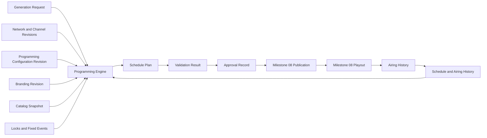

# Milestone 07: Deterministic Scheduling

- **Roadmap version:** 0.1
- **Milestone status:** Draft
- **Last updated:** 2026-07-27
- **Risk classification:** Core Domain / Critical
- **Implementation authority:** Deterministic Schedule Plan generation, rule evaluation, evidence, validation, approval, regeneration, and staleness

## Purpose

This milestone implements the ChannelForge Programming Engine.

It converts immutable editorial configuration and normalized Catalog state into
immutable, reproducible Schedule Plans.

It defines:

- Generation Requests
- Planning Horizons
- Schedule Cursor behavior
- Immutable generation inputs
- Generator versions
- Rule implementation versions
- Deterministic candidate queries
- Candidate pools
- Hard constraints
- Soft preferences
- Weighted selection
- Quotas
- Repetition controls
- Series progression
- Sequencing
- Daypart resolution
- Programming Block resolution
- Fixed events
- Manual placements
- Locked entries
- Boundaries
- Filler
- Presentation insertion
- Carry-In
- Carry-Out
- Bounded backtracking
- Plan validation
- Rule evidence
- Candidate diagnostics
- Generation failure diagnostics
- Draft review
- Approval
- Rejection
- Regeneration
- Range regeneration
- Gap repair
- Extension
- Staleness
- Progression commitment
- Legacy scheduler comparison
- Performance budgets
- Observability
- Testing
- Pull-request sequencing
- Entry and completion gates
- Rollback
- Risks
- Deferred decisions

This milestone does not implement final publication, stream execution, or
FFmpeg process control.

It creates approved Schedule Plans that Milestone 08 can publish and play.

## Governing Specifications

This milestone is governed by:

- `docs/architecture/spec/01-terminology.md`
- `docs/architecture/spec/02-system-context.md`
- `docs/architecture/spec/03-domain-model.md`
- `docs/architecture/spec/04-scheduling-model.md`
- `docs/architecture/spec/05-media-catalog.md`
- `docs/architecture/spec/06-playout-and-output.md`
- `docs/architecture/spec/08-persistence.md`
- `docs/architecture/spec/09-api.md`
- `docs/architecture/spec/11-security.md`
- `docs/architecture/spec/12-deployment.md`
- `docs/architecture/spec/13-testing.md`
- `docs/architecture/spec/14-migration.md`
- `docs/architecture/spec/15-interstitial-programming-and-external-video-feeds.md`
- `docs/implementation/README.md`
- `docs/implementation/01-baseline-and-change-control.md`
- `docs/implementation/02-module-boundaries.md`
- `docs/implementation/03-identity-persistence-and-migrations.md`
- `docs/implementation/04-legacy-compatibility.md`
- `docs/implementation/05-media-sources-and-catalog.md`
- `docs/implementation/06-networks-and-channels.md`

## Milestone Mission

ChannelForge schedules television Networks rather than shuffling playlists.

The Scheduling milestone must:

- Generate one immutable Schedule Plan per Channel and horizon
- Use only immutable or versioned inputs
- Use UTC instants for all planned entry boundaries
- Evaluate editorial time using an IANA time zone
- Handle daylight-saving transitions deterministically
- Resolve Dayparts deterministically
- Resolve Programming Blocks deterministically
- Distinguish hard constraints from soft preferences
- Respect active Network and Channel revisions
- Respect Catalog Snapshot identity and revision
- Respect locks and fixed events
- Respect repeat cooldowns
- Respect series progression
- Respect seasonal policy
- Preserve seasonal titles for year-round rotation unless explicitly excluded
- Use recorded random seeds
- Use a versioned deterministic random generator
- Avoid database-return-order dependence
- Avoid live provider calls in candidate evaluation
- Avoid FFmpeg execution
- Produce human-readable rule evidence
- Produce structured failures
- Use bounded search and backtracking
- Validate before approval
- Keep approval separate from publication
- Preserve active approved output on failure
- Create new plans instead of mutating existing plans
- Detect and classify staleness
- Compare against inherited scheduling behavior during migration
- Remain practical for SQLite and one container

## Product Principle

The governing product principle remains:

> Build television networks, not playlists.

A schedule must express editorial identity across time.

It is not enough to fill empty duration.

The scheduler must account for:

- Network mission
- Audience expectations
- Daypart suitability
- Programming Block intent
- Content boundaries
- Series continuity
- Repeat tolerance
- Seasonal intent
- Catalog depth
- Duration
- Availability
- Presentation identity
- Guide quality
- Fixed events
- Operational policy

## Core Separation

ChannelForge separates:

1. Programming configuration
2. Schedule generation
3. Schedule validation
4. Schedule approval
5. Schedule publication
6. Runtime playout
7. Actual airing history

These stages must not collapse into one mutable playlist.

## Architecture



## Scope

Version 1 supports:

- Continuous linear schedules
- One Schedule Plan per Channel
- Planning Horizons of days or weeks
- Local-time editorial rules
- Repeating Dayparts
- Programming Blocks
- Catalog Selectors
- Hard constraints
- Soft preferences
- Quotas
- Cooldowns
- Series progression
- Deterministic weighted selection
- Fixed boundaries
- Flexible boundaries
- Fixed events
- Manual placements
- Locked entries
- Filler
- Presentation entries
- Explicit Off-Air entries
- Draft generation
- Preview
- Simulation
- Validation
- Manual approval
- Policy-based approval
- Extension
- Range regeneration
- Gap repair
- Staleness
- Structured diagnostics
- Legacy comparison

## Non-Goals

Version 1 does not require:

- Real-time audience optimization
- Personalized schedules per viewer
- Machine-learned recommendations
- Advertising auctions
- Rights-window optimization beyond explicit rules
- Distributed planning
- Multi-node consensus
- Live-event rights management
- Frame-accurate broadcast automation
- Automatic media acquisition
- Dynamic schedule mutation during playback
- FFmpeg command construction
- Runtime source failover implementation
- Client-specific Schedule Plans
- Provider API calls per candidate
- Autonomous creative editorial decisions
- Automatic override of operator locks
- Automatic publication without policy approval

## Scheduling Module Ownership

The Scheduling module owns:

- Generation Request
- Generation Attempt
- Generator version
- Rule registry
- Rule implementation version
- Schedule Plan
- Schedule Entry
- Rule Evidence
- Candidate Evaluation
- Generation diagnostics
- Validation Result
- Plan staleness
- Manual lock
- Fixed-event scheduling representation
- Progression proposal
- Plan comparison
- Generation metrics

## Programming Module Ownership

Programming owns:

- Programming Configuration Revision
- Dayparts
- Programming Blocks
- Rules
- Catalog Selectors
- Repeat policy configuration
- Timing policy configuration
- Filler policy configuration
- Randomization policy configuration
- Seasonal policy configuration

Scheduling consumes those revisions.

Scheduling does not mutate them.

## Catalog Module Ownership

Catalog owns:

- Catalog Items
- Catalog Snapshots
- Availability
- Collections
- Labels
- Series hierarchy
- Franchise relationships
- Duration provenance
- Playback Variant eligibility

Scheduling reads a Catalog Snapshot.

Scheduling does not query providers live.

## Channels Module Ownership

Channels owns:

- Channel ID
- Channel time zone
- Channel Profile Revision
- Output Identity
- Channel lifecycle
- Channel override revision references

## Networks Module Ownership

Networks owns:

- Network ID
- Network Profile Revision
- Editorial Profile
- Audience Profile
- Network lifecycle

## Branding Module Ownership

Branding owns:

- Branding Profile Revision
- Presentation Asset references
- Asset Assignment policy

Scheduling may create presentation Schedule Entries from immutable eligible
assets.

## Publication Module Ownership

Publication owns:

- Active approved-plan selection
- Schedule Publication
- Artifact generation requests
- Last-known-good publication

Scheduling approval does not activate publication.

## Playout Module Ownership

Playout owns:

- Runtime source selection
- Playback Variant resolution
- FFmpeg process plan
- Active session
- Recovery
- Airing Records

Scheduling does not start or control runtime sessions.

## Scheduling Terms

## Planning Horizon

The Planning Horizon is the half-open interval:

```text
[startInstant, endInstant)
```

Start is inclusive.

End is exclusive.

## Requested Horizon

The requested horizon is the interval requested by the command.

## Actual Covered Interval

The actual covered interval may include:

- Carry-In before the requested start
- Carry-Out beyond the requested end

Coverage metrics are calculated against the requested horizon.

## Schedule Cursor

The Schedule Cursor is the next UTC instant requiring a planning decision.

The cursor advances only after one or more draft entries are committed to
Working State.

## Temporal Context

Temporal Context is derived from the cursor and recorded time zone.

It includes:

- UTC instant
- Local date
- Local weekday
- Local wall-clock time
- UTC offset
- DST status
- Holiday membership
- Seasonal membership
- Active Dayparts
- Active Blocks
- Upcoming boundaries

## Candidate

A Candidate is:

- Catalog Item
- Presentation Asset
- Filler Item
- Slate
- Explicit Off-Air option
- Imported fixed segment
- Manual placement

## Eligible Candidate

An Eligible Candidate satisfies every applicable hard constraint.

## Candidate Score

A Candidate Score is the deterministic numeric result of:

- Soft preferences
- Quota pressure
- Sequence preference
- Boundary efficiency
- Novelty
- Repeat penalty
- Seasonal boost
- Selector weight
- Presentation preference
- Deterministic tie-breaking

## Placement

Placement turns a Candidate into one or more proposed Schedule Entries with UTC
start and end instants.

## Coverage

Coverage is the interval set inside the requested horizon occupied by explicit
Schedule Entries.

## Gap

A Gap is an uncovered interval where policy requires coverage.

## Off-Air

Off-Air is an explicit Schedule Entry.

An uncovered gap is not Off-Air.

## Boundary

A Boundary is an editorial or technical instant affecting placement.

Examples:

- Daypart start
- Daypart end
- Programming Block start
- Programming Block end
- Top of hour
- Half hour
- Quarter hour
- Fixed event
- Manual placement
- Planning Horizon end
- Publication handoff

## Lock

A Lock protects an existing Schedule Entry or interval from permitted
regeneration.

## Fixed Event

A Fixed Event requires content or an explicit event representation at a
specific time or interval.

## Generation Request

A Generation Request is the application command starting planning.

## Generation Request Fields

```text
generationRequestId
networkId
channelId
horizonStart
horizonEnd
generationMode
networkProfileRevisionId
channelProfileRevisionId
programmingConfigurationRevisionId
channelOverrideRevisionId
brandingProfileRevisionId
catalogSnapshotId
existingSchedulePlanId
lockedEntryIds
fixedEventReferences
randomSeed
generatorVersion
requestedBy
requestedAt
approvalPolicy
diagnosticVerbosity
runtimeBudgetMs
candidateEvaluationBudget
idempotencyKey
previewOnly
```

## Generation Modes

- `FULL`
- `EXTEND`
- `REGENERATE_RANGE`
- `REPAIR_GAPS`
- `PREVIEW`
- `SIMULATE`

## Full Generation

Creates a new plan for the entire requested horizon.

It does not mutate an existing plan.

## Extend

Preserves an existing prefix and adds entries after its end.

Extension validates:

- Same Channel
- Compatible revision policy
- Exact or allowed boundary
- Relevant history tail
- Existing-plan checksum
- Lock preservation
- No publication conflict

## Regenerate Range

Creates a new plan derived from an existing plan.

Entries outside the selected interval are preserved by immutable copy or
reference.

The result receives a new Schedule Plan ID.

## Repair Gaps

Fills explicit uncovered intervals while preserving surrounding entries.

Repair respects:

- Locked entries
- Fixed events
- Existing boundaries
- Repeat history
- Filler limits
- Neighbor continuity
- Publication freeze windows

## Preview

Generates a complete draft and validation result.

It cannot be approved directly unless promoted through a normal validated
workflow.

## Simulate

Evaluates scheduling behavior and metrics.

Simulation may relax publication or playout constraints according to explicit
policy.

Simulation output is clearly labeled.

## Idempotency

Identical idempotency key and request hash should return the same Generation
Request result.

The seed is not regenerated on retry.

## Required Immutable Inputs

A Generation Request resolves:

- Channel ID
- Network ID
- Horizon
- Editorial time zone
- Network Profile Revision
- Channel Profile Revision
- Programming Configuration Revision
- Channel override revision
- Branding Profile Revision
- Catalog Snapshot
- Relevant Schedule History snapshot
- Relevant Airing History snapshot
- Locks
- Fixed events
- Generator version
- Rule versions
- Randomization version
- Seed
- Generation mode
- Approval policy
- Budgets

## Input Snapshot Rule

All inputs capable of changing output are represented by:

- Immutable ID
- Revision
- Snapshot
- Version
- Content checksum

The generator does not repeatedly read mutable live configuration.

## Snapshot Consistency

Paged Catalog and history loads must belong to the same snapshot or watermark.

## Configuration Fingerprint

The generator records one deterministic configuration fingerprint covering:

- Network Profile
- Channel Profile
- Programming Configuration
- Channel overlay
- Branding
- Time zone
- Rule versions
- Catalog Snapshot
- Generator version

## Input Resolution

Input resolution validates:

- Entity existence
- Entity lifecycle
- Revision activation
- Revision immutability
- Revision ownership
- Channel ownership
- Time zone
- Catalog Snapshot availability
- Lock ownership
- Fixed-event ownership
- Horizon bounds
- Generator compatibility
- Rule compatibility
- Seed presence

## Generation Attempt

A Generation Attempt records execution even when no valid plan results.

## Generation Attempt Fields

```text
generationAttemptId
generationRequestId
backgroundJobId
state
startedAt
completedAt
generatorVersion
inputFingerprint
seed
failureStage
failureCode
failureSummary
diagnosticReference
metricsReference
```

## Generation Attempt States

- `QUEUED`
- `RESOLVING_INPUTS`
- `GENERATING`
- `VALIDATING`
- `PERSISTING`
- `COMPLETED`
- `FAILED`
- `CANCELLED`
- `TIMED_OUT`

## Schedule Plan

A Schedule Plan is an immutable generated result for one Channel and horizon.

## Schedule Plan Fields

```text
schedulePlanId
generationRequestId
networkId
channelId
requestedStart
requestedEnd
actualCoveredStart
actualCoveredEnd
editorialTimeZone
status
networkProfileRevisionId
channelProfileRevisionId
programmingConfigurationRevisionId
channelOverrideRevisionId
brandingProfileRevisionId
catalogSnapshotId
historySnapshotId
generatorVersion
ruleVersionManifest
randomizationVersion
seed
configurationFingerprint
contentChecksum
createdAt
createdBy
validationResultId
stalenessState
sourcePlanId
```

## Schedule Plan Status

- `GENERATING`
- `GENERATED`
- `VALIDATED`
- `REJECTED`
- `APPROVED`
- `SUPERSEDED`
- `FAILED`

A failed Generation Attempt need not persist an invalid Schedule Plan.

## Schedule Plan Immutability

After persistence:

- Entries do not change
- Input references do not change
- Seed does not change
- Generator versions do not change
- Checksum does not change
- Guide snapshots do not change

Status and approval metadata may be separate records.

## Schedule Entry

A Schedule Entry represents one planned interval.

## Schedule Entry Fields

```text
scheduleEntryId
schedulePlanId
sequenceNumber
startInstant
endInstant
durationMs
entryKind
catalogItemId
presentationAssetId
sourceBindingHint
playbackVariantHint
programmingBlockId
daypartIds
ruleEvidenceReference
presentationInstructions
continuityMetadata
guideMetadataSnapshot
fallbackClassification
lockState
lineageReference
```

## Entry Kinds

- `PROGRAM`
- `BUMPER`
- `IDENT`
- `PROMO`
- `ADVERTISEMENT`
- `FILLER`
- `SLATE`
- `OFF_AIR`
- `CARRY_IN`
- `CARRY_OUT`
- `FIXED_EVENT`
- `MANUAL`

## Entry Duration

Every entry has positive duration.

## Entry Ordering

Entries are ordered by:

1. Start instant
2. Sequence number
3. Schedule Entry ID

Generation never depends on database default ordering.

## Entry Overlap

Overlaps are prohibited unless a separately defined overlay model explicitly
permits them.

Version 1 ordinary linear Schedule Plans do not require overlapping entries.

## Guide Metadata Snapshot

Approved plans retain guide-facing metadata.

Potential fields:

- Title
- Episode title
- Series title
- Description
- Rating
- Genres
- Season number
- Episode number
- Original air date
- Artwork reference
- Entry kind
- Language

## Working State

The generator maintains mutable in-memory Working State.

The persisted result remains immutable.

## Working State Fields

- Current cursor
- Active Daypart stack
- Active Block stack
- Upcoming boundaries
- Selected entries
- Working repeat history
- Working progression state
- Quota counters
- Presentation cooldown state
- Backtracking checkpoints
- Candidate evaluation count
- Warning list
- Runtime budget remaining

## Working State Determinism

Working State uses:

- Stable collection ordering
- Versioned data structures where serialization matters
- Explicit integer arithmetic
- Explicit random streams
- No process-global mutable state

## Time Model

## UTC Storage

Every entry boundary is stored as a UTC instant.

## Editorial Time Zone

Dayparts, local dates, weekdays, holidays, and seasonal rules use the Channel's
recorded IANA time zone.

## Local-Time Derivation

For each cursor instant derive:

- Local date
- Weekday
- Local time
- Offset
- DST status
- Holiday
- Season
- Daypart membership
- Block membership

## Spring DST Transition

When a local interval does not exist:

- It contributes no elapsed schedulable duration
- A block entirely inside the gap is skipped unless relocation is configured
- Fixed local starts require resolution policy
- Default relocation moves to first valid instant after transition
- Warning is recorded

## Fall DST Transition

When a local interval occurs twice:

- Each occurrence is a distinct UTC interval
- Recurring Dayparts apply to both unless configured otherwise
- Fixed starts use explicit fold policy

## Fold Policies

- `FIRST_OCCURRENCE`
- `SECOND_OCCURRENCE`
- `BOTH`
- `REJECT_AMBIGUOUS`

## Duration Precision

Scheduling uses integer milliseconds or finer integer units.

Floating-point accumulation must not determine boundaries.

## Horizon Validation

The horizon must:

- Start before end
- Fit configured min and max
- Fit supported timestamp range
- Respect generation budget
- Align with regeneration policy
- Match locked-entry scope
- Avoid unsupported publication overlap

## Horizon Defaults

A practical initial default is several days to two weeks.

Exact defaults remain Instance settings.

## Scheduling Pipeline

```text
1. Validate Generation Request
2. Resolve immutable inputs
3. Verify versions and checksums
4. Load Catalog Snapshot
5. Load bounded relevant history
6. Build temporal context
7. Resolve active Dayparts
8. Resolve active Programming Blocks
9. Resolve fixed events and locks
10. Build Candidate set
11. Apply hard constraints
12. Calculate soft scores
13. Apply quota adjustments
14. Apply deterministic tie-breaking
15. Select Candidate
16. Attempt placement
17. Insert required presentation entries
18. Update Working State
19. Advance cursor
20. Backtrack when allowed
21. Repeat until complete or terminal failure
22. Validate complete plan
23. Compute content checksum
24. Persist immutable plan and evidence
25. Emit post-commit events
```

## Temporal Resolution

## Daypart Resolution

At each cursor:

1. Convert cursor to local context.
2. Find matching Dayparts.
3. Apply date restrictions.
4. Apply weekday restrictions.
5. Apply time interval.
6. Resolve overlap precedence.
7. Produce stable ordered Daypart stack.

## Daypart Precedence

Suggested precedence:

1. Explicit Channel override
2. Specific date range
3. Higher priority
4. Narrower interval
5. Stable Daypart ID

The exact rule is versioned.

## Cross-Midnight Daypart

A Daypart crossing midnight must define which local date owns the occurrence.

## Programming Block Resolution

Blocks may be activated by:

- Daypart
- Explicit local window
- Fixed UTC window
- Calendar date
- Seasonal range
- Recurrence
- Manual event

## Block Stack

Multiple Blocks may apply.

The scheduler resolves:

- Primary Block
- Overlay rules
- Presentation policy
- Selector union or intersection
- Boundary behavior
- Priority

## Block Precedence

Suggested order:

1. Fixed event
2. Manual placement
3. Explicit Channel Block
4. Network Block with specific date
5. Higher priority
6. Narrower scope
7. Stable Block ID

## Block Conflict

An irreconcilable conflict produces validation or generation failure.

It does not use arbitrary first match.

## Seasonal Rules

Seasonal rules are evaluated using recorded local date and calendar version.

## Seasonal Default

Seasonal labels and seasonal collections do not make items ineligible outside
the season.

## Seasonal Boost

Inside an active range, a seasonal boost may increase:

- Candidate score
- Selector priority
- Quota target
- Repeat tolerance
- Presentation frequency

## Season-Only Rule

A season-only restriction is an explicit hard constraint.

## Holiday Calendar

A Holiday Calendar must have:

- Calendar version
- Locale or region
- Time-zone interpretation
- Date set
- Source
- Content checksum

## Candidate Query

Candidate querying begins from Catalog Snapshot data.

## Candidate Query Inputs

- Active selectors
- Media kinds
- Availability
- Duration limits
- Hierarchy
- Labels
- Collections
- Franchise
- Rating
- Language
- Explicit include
- Explicit exclude
- Block scope
- Local context

## Candidate Query Invariants

- No live provider calls
- Stable ordering
- Catalog Snapshot consistency
- Explicit pagination
- Stable tie-break
- Bounded candidate count
- Explainable exclusion

## Candidate Set

The raw Candidate set contains candidates before hard constraints.

## Candidate Pool

A bounded Candidate Pool may be used for expensive scoring.

Pool policy is versioned.

## Candidate Pool Selection

Pool formation may prioritize:

- Selector priority
- Basic eligibility
- Duration fit
- Progression relevance
- Low repeat penalty
- Stable deterministic sample

## Candidate Set Empty

If no Candidates exist, the generator proceeds according to:

- Filler policy
- Off-Air policy
- Backtracking policy
- Failure policy

## Hard Constraints

A hard constraint determines eligibility.

Failure cannot be overridden by score.

## Hard Constraint Examples

- Catalog Item unavailable
- Content rating exceeds limit
- Media kind not allowed
- Explicit exclusion
- Duration cannot fit hard boundary
- Item aired within hard cooldown
- Series progression requires another episode
- Required language absent
- Required daypart mismatch
- Fixed event conflict
- Locked interval conflict
- Season-only rule inactive
- Maximum airings exceeded
- Missing required presentation asset
- Invalid guide metadata when required

## Hard Constraint Result

```text
PASS
FAIL
NOT_APPLICABLE
ERROR
```

## Hard Constraint Evidence

Records:

- Rule ID
- Rule version
- Candidate ID
- Result
- Reason code
- Relevant values
- Scope
- Evaluation duration

## Hard Constraint Ordering

Evaluate cheap indexed constraints before expensive ones.

## Constraint Error

An evaluator error is not treated as pass.

Policy may:

- Fail candidate
- Fail generation
- Mark rule invalid
- Continue only when rule is explicitly optional

## Soft Preferences

Soft preferences adjust score.

## Soft Preference Examples

- Prefer unseen item
- Prefer underrepresented genre
- Prefer chronological progression
- Prefer seasonal item in season
- Prefer exact boundary fit
- Prefer unused presentation asset
- Prefer target runtime distribution
- Prefer less recently aired title
- Prefer source diversity
- Prefer desired movie-to-episode balance

## Score Model

A score is computed with deterministic integer or fixed-point arithmetic.

## Floating-Point Policy

Floating point must not create platform-dependent ordering.

Use:

- Integers
- Fixed-point values
- Decimal library with deterministic semantics
- Explicit rounding

## Score Components

Each component records:

- Rule ID
- Version
- Raw value
- Normalized value
- Weight
- Contribution
- Bound
- Explanation

## Score Bounds

Every soft rule should have bounded contribution unless documented otherwise.

## Score Tie

Ties are resolved deterministically.

## Quotas

Quotas track targets across a scope.

## Quota Scopes

- Block
- Daypart
- Local day
- Local week
- Horizon
- Network coordination window

## Quota Dimensions

- Media kind
- Genre
- Series
- Franchise
- Collection
- Label
- Rating
- Duration band
- Seasonal content
- Presentation share
- Filler share

## Hard Quota

A hard quota is allowed only when feasibility can be evaluated sufficiently.

An impossible hard quota produces failure or validation error.

It does not silently become soft.

## Soft Quota

A soft quota adjusts score according to deficit or surplus.

Adjustment is bounded.

## Quota State

Records:

- Rule ID
- Scope
- Target
- Current amount
- Remaining duration
- Remaining candidate capacity
- Projected deficit
- Projected surplus

## Repetition Controls

## Repeat Dimensions

Repeat policy may apply to:

- Catalog Item
- Episode
- Movie
- Series
- Season
- Franchise
- Genre
- Collection
- Block
- Presentation Asset
- Guide title
- Custom grouping key

## History Sources

- `PLANNED`
- `AIRED`
- `PLANNED_AND_AIRED`
- `APPROVED_ONLY`
- `ANY_GENERATED`

## Default History Source

Viewer-facing repeat policy should default to planned and aired history with
duplicate lineage deduplicated.

## Cooldown

A cooldown may be:

- Hard
- Soft
- Exact-item
- Series-level
- Franchise-level
- Daypart-specific
- Block-specific
- Seasonal-adjusted

## Repeat Window

Repeat windows evaluate backward from proposed start.

Working State entries already generated are included.

## Maximum Airings

Examples:

- No more than twice per local week
- No more than once per 48 hours
- No more than three episodes from one Series per Block
- No more than one ident every 30 minutes

## Minimum Separation

May use:

- Elapsed duration
- Intervening entries
- Intervening unique titles
- Local days
- Block occurrences

## Presentation Repeat Policy

Presentation assets use independent cooldowns.

Their short duration must not permit excessive repetition.

## Repeat Evidence

Records:

- Dimension
- Candidate key
- History source
- Last occurrence
- Window
- Count
- Threshold
- Result
- Penalty or failure

## Series Progression

## Series Policies

- `CHRONOLOGICAL`
- `AIR_DATE`
- `DVD_ORDER`
- `ABSOLUTE_ORDER`
- `RANDOM_EPISODE`
- `RANDOM_SEASON_THEN_EPISODE`
- `SHUFFLED_CYCLE`
- `MANUAL_QUEUE`
- `LATEST_UNAIRED`
- `CUSTOM`

## Progression Scope

Progression may be scoped to:

- Network
- Channel
- Block
- Selector
- Template application

Version 1 default should be Channel plus Selector or Block.

## Progression Cursor

Fields:

```text
progressionCursorId
scopeKey
seriesId
orderingPolicy
lastSelectedEpisodeId
nextExpectedEpisodeId
cycleNumber
lastCommittedSchedulePlanId
lastAiringRecordId
resetPolicy
version
```

## Planned Versus Aired Progression

Version 1 default:

- Planning uses latest approved progression
- Working State advances provisionally
- Draft generation does not commit progression
- Approval commits planned progression lineage
- Failed airing records create exceptions
- Publication and actual airing remain distinct

## Missing Episode

Policy may:

- Stop progression
- Skip temporarily
- Select another Series
- Select later episode
- Insert filler
- Fail Block

Skipping is recorded.

Skipping does not mark the episode complete.

## Series Cycle

When a Series completes:

- Stop
- Restart
- Restart after cooldown
- Start deterministic shuffled cycle
- Exclude from Selector
- Require operator action

## Progression Proposal

A generated plan records proposed progression updates.

Approval commits them atomically with approval metadata or through a coordinated
transaction.

## Progression Race

Approval verifies expected progression version.

## Sequencing Rules

Sequencing evaluates adjacency and recent order.

## Sequencing Examples

- Avoid two movies consecutively
- Alternate comedy and drama
- Place bumper after two episodes
- Place ident before first program of hour
- Keep multipart episodes together
- Pair short with feature
- Avoid same Series in adjacent Blocks
- Preserve double-feature order

## Sequencing Classification

- Hard
- Soft
- Placement-producing
- Presentation-producing

## Sequence Evidence

Records:

- Prior entries
- Rule
- Expected pattern
- Candidate effect
- Result
- Explanation

## Candidate Ranking

Default stable ordering:

1. Hard-constraint eligibility
2. Total preference score
3. Explicit Selector priority
4. Boundary efficiency
5. Sequence preference
6. Deterministic random tie-break
7. Stable Catalog Item ID

## Ranking Version

The ranking model is part of generator versioning.

## Deterministic Randomization

## Seed

Every Generation Request has one stored seed.

Seed may be:

- User supplied
- Derived from idempotency key
- Generated once and persisted
- Derived from Channel and horizon under configured policy

## Seed Storage

The actual seed used is stored verbatim in plan metadata.

## Random Algorithm

The pseudo-random algorithm is versioned.

## Random Streams

Independent streams should exist for:

- Candidate tie-break
- Weighted selection
- Filler selection
- Presentation selection
- Template variation
- Backtracking branch order

## Random Stream Derivation

A stream may derive from:

- Root seed
- Channel ID
- Horizon
- Cursor instant
- Block ID
- Concern name
- Candidate ID
- Generator version

## Random Independence

Adding one random decision in one concern should not shift all later decisions
in unrelated concerns.

## Deterministic Tie-Break

The tie-break must not depend on:

- Database row order
- Thread scheduling
- Object hash randomization
- Current wall clock
- Unordered map iteration
- Process-global state
- Host platform

## Weighted Selection

Weighted selection:

- Uses deterministic random source
- Uses stable Candidate ordering
- Uses nonnegative weights
- Defines zero-weight behavior
- Records selected weight
- Records draw
- Records pool checksum

## Weight Semantics

Weights are not probabilities until normalized in the current pool.

## Reproducibility Contract

Given identical:

- Generator version
- Rule versions
- Randomization version
- Input revisions
- Catalog Snapshot
- History snapshot
- Horizon
- Seed
- Generation mode
- Locks
- Fixed events
- Budgets

ChannelForge must produce the same ordered Schedule Entries and relevant
diagnostics.

## Placement

## Placement Inputs

- Candidate duration
- Cursor
- Upcoming boundaries
- Required lead-in
- Required lead-out
- Block policy
- Daypart policy
- Trim eligibility
- Overrun tolerance
- Minimum useful gap
- Filler availability
- Locked intervals
- Fixed events

## Placement Result

```text
entries
newCursor
boundaryInteraction
fillerRequirement
presentationEntries
warnings
appliedPolicy
rejectionReason
```

## Exact Placement

Starts at cursor and uses full scheduling duration.

## Aligned Placement

Targets:

- Top of hour
- Half hour
- Quarter hour
- Block start
- Fixed-event start

Filler may be inserted before aligned content.

## Trimmed Placement

Only explicitly trim-safe media may be trimmed.

Ordinary movies and episodes are not trim-safe by default.

## Overrun Placement

Overrun policy defines:

- Maximum duration
- Allowed media kinds
- Boundary types
- Following-block adjustment
- Guide behavior
- Approval warning

## Carry-In

Carry-In represents content begun before the requested horizon.

It records:

- Original entry reference
- Original start
- Visible start
- Remaining duration
- Continuity evidence

## Carry-Out

Carry-Out extends beyond requested horizon when policy permits.

Full entry interval is retained.

Coverage uses intersection with requested horizon.

## Boundary Policies

- `HARD_STOP`
- `MUST_START_AT`
- `MUST_END_AT`
- `PREFER_START_AT`
- `PREFER_END_AT`
- `ALLOW_OVERRUN`
- `FILL_TO_BOUNDARY`
- `IGNORE`

## Hard Stop

No ordinary entry crosses the boundary.

## Must Start At

Target content begins exactly at boundary.

Preceding interval must be filled or explicitly Off-Air.

## Must End At

Selected sequence ends exactly at boundary.

## Prefer Start or End

Alignment affects score.

Violation records warning.

## Fill to Boundary

Filler or presentation content fills remaining interval.

## Fixed Events

A Fixed Event may represent:

- Scheduled movie premiere
- Imported special
- Manual event
- Live-event placeholder
- Maintenance window
- Network launch
- Holiday special

## Fixed Event Fields

```text
fixedEventId
channelId
startInstant
endInstant
entryDefinition
priority
lockPolicy
conflictPolicy
createdBy
createdAt
revision
```

## Fixed Event Conflict

Conflict may:

- Fail generation
- Move soft event
- Backtrack earlier placement
- Insert filler
- Require operator resolution

Hard Fixed Events are never silently displaced.

## Manual Placements

Manual placement creates an explicit required entry or locked segment.

## Lock Types

- Entry lock
- Interval lock
- Start-time lock
- Content lock
- Sequence lock
- Boundary lock

## Lock Preservation

Regeneration preserves locks unless:

- Actor explicitly unlocks
- Lock is invalid
- Lock references missing data and policy allows conflict handling

## Lock Evidence

Plan records lock source and preservation outcome.

## Filler

Filler provides intentional coverage.

## Filler Kinds

- Shorts
- Trailers
- Promos
- Bumpers
- Idents
- Music videos
- Slates
- Loopable media
- Explicit Off-Air

## Filler Policy

Includes:

- Eligible selectors
- Minimum interval
- Maximum interval
- Repeat policy
- Priority
- Trim behavior
- Loop behavior
- Audio policy
- Guide representation
- Maximum filler share
- Failure fallback

## Filler Selection

Considers:

- Remaining gap
- Asset duration
- Repeat cooldown
- Presentation role
- Network identity
- Exact-fit preference
- Entry-count limit
- Trim capability
- Loop capability

## Filler Packing

Version 1 may use bounded deterministic heuristics:

1. Exact fit
2. Largest valid item leaving fillable remainder
3. Smallest remainder
4. Lowest repeat penalty
5. Stable deterministic tie-break

## Packing Budget

Search depth and candidate count are bounded.

## Filler Failure

If no fill exists:

- Backtrack
- Insert Off-Air if configured
- Permit overrun if configured
- Fail interval

## Explicit Off-Air

Off-Air requires:

- Start
- End
- Guide representation
- Playout behavior
- Optional slate
- Policy or reason

## Presentation Insertion

Presentation roles may occur:

- Before program
- After program
- Between programs
- At hour boundary
- At Block start
- At Daypart start
- During maintenance
- During fallback

## Presentation Asset Selection

Selection uses:

- Branding revision
- Asset assignment
- Date range
- Daypart
- Placement role
- Cooldown
- Priority
- Weight
- Duration fit
- Deterministic random stream

## Presentation Entry Rule

Presentation entries are explicit Schedule Entries.

They are not hidden runtime behavior when editorial timing depends on them.

## Presentation Duration

Use verified media duration.

## Missing Presentation Asset

Policy may:

- Skip optional asset
- Use fallback asset
- Use slate
- Fail Block
- Record warning

## Bounded Backtracking

Greedy placement may fail even when a valid schedule exists.

Version 1 supports bounded backtracking.

## Backtracking Checkpoint

A checkpoint may capture:

- Cursor
- Entry count
- Working history
- Progression state
- Quota state
- Candidate exclusions
- Random stream positions
- Remaining budget

## Backtracking Triggers

- Hard boundary cannot be met
- Fixed Event conflict
- Unfillable gap
- Hard quota failure
- Sequence dead end
- Progression dead end
- Filler packing failure

## Backtracking Limits

Limits include:

- Maximum depth
- Maximum branches
- Maximum elapsed time
- Maximum candidate evaluations
- Maximum checkpoint count

## Backtracking Determinism

Branch order is stable and versioned.

## Terminal Failure

When bounded search cannot find a valid plan, generation fails with structured
diagnostics.

## Generation Failure

## Failure Fields

```text
failureCode
stage
cursor
localContext
activeDayparts
activeBlocks
upcomingBoundaries
candidatePoolSize
hardExclusionSummary
placementFailureSummary
backtrackingAttempts
earliestCheckpoint
budgetUsage
suggestedRemediation
```

## Failure Codes

Potential codes:

- `NO_ELIGIBLE_CANDIDATE`
- `UNFILLABLE_GAP`
- `HARD_BOUNDARY_CONFLICT`
- `FIXED_EVENT_CONFLICT`
- `LOCK_CONFLICT`
- `HARD_QUOTA_IMPOSSIBLE`
- `SERIES_PROGRESSION_BLOCKED`
- `MISSING_REQUIRED_ASSET`
- `INVALID_CONFIGURATION`
- `CATALOG_SNAPSHOT_INVALID`
- `HISTORY_SNAPSHOT_INVALID`
- `BUDGET_EXHAUSTED`
- `CANCELLED`
- `INTERNAL_ERROR`

## Failure Remediation

Diagnostics may suggest:

- Add filler
- Broaden Selector
- Relax hard constraint
- Move Fixed Event
- Unlock entry
- Permit Off-Air
- Increase horizon budget
- Fix missing episode
- Resolve Catalog availability
- Correct invalid rule

Suggestions are diagnostic.

They do not mutate configuration.

## Rule Registry

Rule implementations are registered through a typed internal registry.

## Rule Registration

Includes:

- Rule type
- Rule version
- Classification
- Parameter schema
- Evaluator
- Explanation formatter
- Cost classification
- Compatibility range
- Migration function

## Unknown Rule

Unknown rule type cannot activate.

Imported unknown rule may remain preserved and disabled.

## Rule Cost Classification

- `CHEAP`
- `MODERATE`
- `EXPENSIVE`
- `HISTORY_HEAVY`
- `CANDIDATE_SET_WIDE`

## Rule Evaluation Order

The engine should evaluate cheap hard constraints before expensive work.

## Rule Parameter Security

Rule parameters are untrusted input.

They must not enable:

- Arbitrary code execution
- Recursive unbounded expressions
- Arbitrary SQL
- Arbitrary file access
- Arbitrary provider access
- Secret lookup
- Unbounded candidate expansion

## Algorithm Versioning

The plan records:

- Overall generator version
- Candidate-query version
- Constraint version
- Scoring version
- Quota version
- Progression version
- Randomization version
- Placement version
- Filler version
- Backtracking version
- Validator version

## Version Change

A version change capable of altering output must be visible in plan metadata.

## Compatibility Range

Rule and generator versions declare supported Programming Configuration
Revision ranges.

## Schedule Validation

Validation is separate from generation.

## Validation Result

```text
validationResultId
schedulePlanId
validatorVersion
planChecksum
state
findings
coverageMetrics
ruleComplianceMetrics
guideCompletenessMetrics
outputCompatibilityMetrics
createdAt
```

## Validation States

- `VALID`
- `VALID_WITH_WARNINGS`
- `INVALID`
- `ERROR`

## Validation Checks

- Horizon coverage
- Entry duration
- Entry order
- No unintended overlap
- Gap policy
- Boundary policy
- Fixed Event placement
- Lock preservation
- Catalog references
- Availability policy
- Rule compliance
- Daypart compliance
- Block compliance
- Progression
- Repeat policy
- Quotas
- Guide metadata
- Presentation assets
- Output compatibility
- Time-zone context
- Checksum
- Revision existence
- Staleness

## Coverage Validation

Required coverage intervals must be occupied by:

- Program
- Presentation
- Filler
- Slate
- Off-Air
- Carry-In
- Carry-Out intersection

## Gap Validation

Every gap is classified:

- Intended Off-Air
- Allowed gap
- Invalid gap
- Publication handoff
- Outside requested horizon

## Validation Finding

Fields:

- Code
- Severity
- Entry IDs
- Interval
- Rule ID
- Message
- Evidence
- Suggested action
- Acknowledgement requirement

## Finding Severity

- `INFO`
- `WARNING`
- `ERROR`
- `BLOCKING`

## Validation Determinism

Same plan and validator version produce same findings.

## Validation Checksum

Validation records the plan checksum.

Approval verifies the checksum.

## Approval

Approval is an explicit application command.

## Approval Record

```text
approvalRecordId
schedulePlanId
planChecksum
validationResultId
approvedBy
approvedAt
approvalMode
warningAcknowledgements
note
expectedProgressionVersions
expectedPublicationRevision
```

## Approval Modes

- `MANUAL`
- `AUTOMATIC_POLICY`
- `MIGRATION`
- `EMERGENCY_OVERRIDE`

## Approval Preconditions

- Plan status eligible
- Validation matches checksum
- No blocking finding
- Required warnings acknowledged
- Staleness policy satisfied
- Expected progression versions match
- Authorization succeeds
- Approval mode permitted

## Automatic Approval

Automatic approval is permitted only by explicit policy.

It still creates Approval Record.

## Approval Effects

Approval:

- Marks plan approved through immutable status record or equivalent
- Commits progression proposals
- Preserves plan checksum
- Emits approval event
- Does not publish automatically unless a separate policy command follows
- Does not mutate entries

## Approval Race

Approval verifies:

- Plan still eligible
- Validation still current
- No conflicting approval
- Progression version
- Publication precondition
- Staleness state

## Rejection

A plan may be rejected.

## Rejection Record

- Plan ID
- Actor
- Timestamp
- Reason
- Findings
- Replacement request
- Audit

Rejected plan remains historical.

## Publication Separation

Approval does not equal publication.

Milestone 08 activates Schedule Publication.

## Existing Output Safety

Failed generation, failed validation, or rejected approval must not replace the
active published plan.

## Regeneration

Regeneration creates a new Plan ID.

## Regeneration Inputs

- Source Plan ID
- Selected range
- Locks
- New revisions
- New Catalog Snapshot
- New seed or preserved seed
- Reason
- Actor
- Policy

## Full Regeneration

Creates an entirely new plan.

## Range Regeneration

Preserves outside entries.

## Regeneration Freeze Window

A freeze window protects near-term published entries.

Override requires:

- Permission
- Reason
- Audit
- Acknowledgement
- Publication coordination

## Seed Policy During Regeneration

Policy may:

- Preserve original root seed
- Derive range seed from original
- Use new seed
- Use actor-supplied seed

Actual seed is recorded.

## Regeneration Lineage

New plan records source plan and regenerated interval.

## Lock Copy

Locks outside range are preserved.

Locks inside range remain unless explicitly removed.

## Gap Repair

Gap repair creates a new plan with explicit lineage.

It never patches the approved plan in place.

## Staleness

A plan may become stale after generation.

## Staleness States

- `CURRENT`
- `CONFIGURATION_STALE`
- `CATALOG_STALE`
- `AVAILABILITY_STALE`
- `BRANDING_STALE`
- `OUTPUT_STALE`
- `HISTORY_STALE`
- `ALGORITHM_STALE`
- `MULTIPLE`

## Configuration Stale

Relevant active revision changed.

## Catalog Stale

Scheduling-relevant Catalog revision changed after Snapshot.

## Availability Stale

Required Catalog Item or variant eligibility changed.

## Branding Stale

Required Presentation Asset became invalid or unavailable.

## Output Stale

Output compatibility profile changed.

## History Stale

New approved or aired history changes repeat or progression interpretation.

## Algorithm Stale

Generator or rule implementation version changed.

## Staleness Severity

- Informational
- Warning
- Approval-blocking
- Publication-blocking
- Runtime-critical

## Approved Plan Staleness

An approved plan remains immutable.

Staleness may:

- Trigger regeneration recommendation
- Block publication
- Warn operator
- Permit publication under policy
- Trigger runtime fallback preparation

## Plan Comparison

Comparison should identify:

- Entry additions
- Entry removals
- Time changes
- Content changes
- Presentation changes
- Boundary changes
- Rule explanation changes
- Filler share
- Repeat metrics
- Quota metrics
- Guide changes
- Staleness changes

## Legacy Scheduler Compatibility

Inherited Tunarr scheduling remains isolated behind compatibility.

## Migration Flow

A migrated Channel may:

1. Retain current operational schedule.
2. Receive Network and Channel IDs.
3. Receive Draft Programming Configuration Revision.
4. Generate preview ChannelForge plan.
5. Compare legacy and ChannelForge output.
6. Validate.
7. Approve.
8. Publish through later explicit cutover.

## Legacy Generation Mode

A temporary legacy generation mode may remain.

It must:

- Be clearly identified
- Use compatibility adapters
- Record usage
- Not define ChannelForge canonical rule model
- Have removal criteria

## Legacy Comparison

Comparison may normalize:

- IDs
- Guide formatting
- Known boundary differences
- Known filler differences
- Legacy random behavior

## Legacy Comparison Metrics

- Coverage
- Entry count
- Program share
- Filler share
- Repeat intervals
- Series order
- Daypart compliance
- Boundary alignment
- Guide continuity
- Availability failures

## Legacy Cutover Gate

Do not switch publication until:

- Preview generated
- Validation passes
- Critical comparison differences understood
- Required locks preserved
- Operator approves
- Rollback exists
- Last-known-good plan remains

## Persistence

Scheduling persistence owns:

- Generation Requests
- Generation Attempts
- Schedule Plans
- Schedule Entries
- Rule Evidence
- Validation Results
- Approval Records
- Rejection Records
- Locks
- Fixed Events
- Progression proposals
- Plan lineage
- Staleness records
- Metrics summaries

## Persistence Rule

Generation should avoid long write transactions.

## Plan Persistence

Preferred sequence:

1. Generate in memory or explicit checkpoint store.
2. Validate draft representation.
3. Begin bounded transaction.
4. Insert Plan metadata.
5. Insert entries in bounded or optimized form.
6. Insert evidence references.
7. Insert validation.
8. Commit.
9. Emit completion event.

## Generation Checkpointing

Long generation may support internal checkpoints.

Checkpoint must not expose partially valid plan as publishable.

## Immutable Entry Storage

Schedule Entries are never updated after plan persistence.

## Plan Checksum

Checksum covers semantic fields including:

- Ordered entries
- Input revision IDs
- Catalog Snapshot
- Seed
- Versions
- Time zone
- Horizon
- Locks
- Fixed events

## Evidence Storage

Evidence may be:

- Per-entry normalized records
- Compressed structured document
- Hybrid summary plus diagnostic archive

## Evidence Retention

Approved-plan evidence must remain sufficient for explanation.

Full rejected-candidate matrices may use bounded retention.

## Concurrency

## Per-Channel Generation Lock

Only one publication-changing generation workflow should own a Channel at a
time.

## Preview Concurrency

Preview and simulation may run concurrently within resource limits.

## Configuration Change During Generation

Generation uses immutable revisions.

Later activation does not alter running job.

Result may be stale.

## Catalog Change During Generation

Catalog Snapshot keeps Candidate set stable.

## Approval Concurrency

Approval uses optimistic concurrency.

## Progression Concurrency

Approval commits expected progression versions.

## Cancellation

A Generation Job accepts cancellation.

Cancellation:

- Stops candidate loops
- Stops further backtracking
- Preserves Attempt diagnostics
- Does not persist partial valid Plan
- Releases Channel generation lease
- Preserves active publication

## Runtime Budget

Generation Request may specify maximum runtime.

## Candidate Evaluation Budget

Generation Request may specify maximum Candidate evaluations.

## Budget Exhaustion

Produces structured terminal failure.

It does not silently return partial plan as valid.

## Performance Requirements

Representative targets include:

- Tens of thousands of Catalog Items
- Dozens of Channels
- Horizons of days or weeks
- Thousands of entries per Channel
- Multiple Sources
- Controlled concurrent jobs

## Performance Principles

- Filter indexed hard constraints first
- Load bounded history
- Cache immutable rule inputs during generation
- Use bounded Candidate Pools
- Bound backtracking
- Bound diagnostics
- Avoid external calls
- Avoid long write transactions
- Measure stages
- Use deterministic fixtures

## Candidate Query Performance

Required indexes should support:

- Media kind
- Availability
- Duration
- Series
- Genre
- Label
- Collection
- Rating
- Catalog Snapshot membership
- Stable ID ordering

## History Query Performance

Load only windows required by active repeat and progression rules.

## Memory Bound

Do not require entire Catalog in memory for every generation.

## Multi-Channel Coordination

Version 1 may coordinate multiple Channel requests through an application
service.

Each Plan remains one Channel.

## Cross-Channel Rules

Cross-Channel coordination is deferred unless explicitly implemented.

Examples:

- Avoid same movie on sibling Channels
- Share premieres
- Stagger time-shift feed
- Network-wide franchise quota

Any cross-Channel state must remain deterministic and versioned.

## Security

Scheduling commands require authorization.

## Untrusted Inputs

- Rule parameters
- Selector definitions
- Imported schedules
- Pack templates
- Manual guide metadata
- Time-zone IDs
- Calendar expressions
- Asset references
- Horizon
- Budgets

## Security Validation

Prevent:

- Unbounded recursive expressions
- Excessive Candidate expansion
- Arbitrary code
- Arbitrary SQL
- Path injection
- Secret disclosure
- Resource-exhaustion horizons
- Oversized diagnostics
- Unauthorized locks
- Unauthorized approval

## Audit

Audit records are required for:

- Generation Request
- Lock
- Unlock
- Fixed Event changes
- Plan approval
- Plan rejection
- Range regeneration
- Gap repair
- Stale-plan override
- Freeze-window override
- Automatic policy action
- Legacy cutover comparison

## Audit References

Use immutable IDs and checksums.

## Observability

## Generation Logs

Structured fields:

- `generationRequestId`
- `generationAttemptId`
- `backgroundJobId`
- `networkId`
- `channelId`
- `schedulePlanId`
- `generatorVersion`
- `seed`
- `stage`
- `cursor`
- `candidateCount`
- `eligibleCount`
- `backtrackingCount`
- `warningCode`
- `failureCode`
- `durationMs`
- `correlationId`

## Log Prohibitions

Do not log:

- Provider credentials
- Signed URLs
- Secret headers
- Unbounded Candidate matrices
- Full private paths
- Arbitrary imported text without sanitization

## Metrics

- Generation duration
- Input-resolution duration
- Candidate query duration
- Candidate evaluations
- Eligible ratio
- Hard exclusions by rule
- Score evaluation duration
- Backtracking count
- Failure rate
- Validation failure rate
- Filler share
- Off-Air share
- Stale-plan count
- Approval latency
- Plan entry count
- Plan checksum mismatch
- Legacy comparison difference

## Tracing

Potential spans:

- Input resolution
- Snapshot loading
- Temporal context
- Candidate query
- Hard constraints
- Scoring
- Selection
- Placement
- Filler packing
- Backtracking
- Validation
- Persistence

## Diagnostic Levels

- `NONE`
- `SUMMARY`
- `STANDARD`
- `VERBOSE`
- `TRACE`

## Diagnostic Retention

High-volume diagnostics use bounded retention.

Approved-plan rule explanations remain.

## API Foundations

## Generation Commands

- Generate full plan
- Extend plan
- Regenerate range
- Repair gaps
- Preview
- Simulate
- Cancel generation
- Lock entry
- Unlock entry
- Create Fixed Event
- Update Fixed Event
- Remove Fixed Event
- Validate plan
- Approve plan
- Reject plan
- Recalculate staleness

## Generation Queries

- Get Generation Request
- Get Generation Attempt
- Get Plan
- List Plans
- Get entries
- Get validation
- Get evidence
- Compare plans
- Get failure diagnostics
- Get staleness
- Get locks
- Get Fixed Events
- Get metrics
- Get legacy comparison

## Long-Running Command

Generation returns Background Job and Generation Request reference.

## API Idempotency

Generation mutation endpoints should accept idempotency keys.

## Plan Read Pagination

Entries use stable sequence pagination.

## Plan Immutability API

No endpoint edits a persisted Schedule Entry.

Manual changes create:

- Lock
- Fixed Event
- New Generation Request
- New Plan

## Approval API

Approval requires:

- Plan ID
- Plan checksum
- Validation Result ID
- Expected progression versions
- Warning acknowledgements
- Expected publication revision where applicable

## Structured Errors

Errors include:

- Code
- Message
- Request ID
- Resource
- Retryability
- Findings
- Remediation where safe

## UI Foundations

Initial Scheduling UI:

- Channel planning dashboard
- Horizon selector
- Generate
- Preview
- Simulation
- Job progress
- Timeline
- Daypart overlays
- Block overlays
- Fixed Events
- Locks
- Rule explanation
- Candidate exclusion summary
- Validation findings
- Plan comparison
- Staleness
- Approve
- Reject
- Regenerate range
- Repair gap
- Legacy comparison

## Timeline

Timeline should show:

- UTC and local time
- Entry kind
- Program
- Block
- Daypart
- Boundary
- Lock
- Fixed Event
- Warning
- Stale state
- Carry-In
- Carry-Out

## Rule Explanation UI

For a selected entry show:

- Selector
- Hard constraints passed
- Soft score components
- Repeat history
- Progression decision
- Boundary fit
- Random tie-break
- Filler or presentation reason
- Rejected alternatives summary where retained

## Failure UI

Show:

- Failed interval
- Active Block
- Upcoming boundary
- Candidate counts
- Top exclusion reasons
- Backtracking attempts
- Budget usage
- Suggested remediation

## Plan Comparison UI

Show:

- Added entries
- Removed entries
- Changed content
- Changed time
- Changed filler
- Changed presentation
- Coverage
- Repeat metrics
- Quotas
- Guide changes

## Approval UI

Show:

- Validation state
- Blocking findings
- Warnings
- Staleness
- Revision IDs
- Catalog Snapshot
- Generator version
- Seed
- Checksum
- Legacy comparison
- Publication impact

## Testing Strategy

Milestone 07 requires:

- Unit tests
- Determinism tests
- Property tests
- Golden schedule tests
- Repository tests
- Job tests
- Integration tests
- Migration tests
- API tests
- UI tests
- Security tests
- Performance tests
- Windows tests
- Linux tests
- Docker tests

## Unit Test Categories

- Horizon
- Cursor
- Local time
- DST
- Daypart membership
- Cross-midnight Daypart
- Block precedence
- Selector evaluation
- Hard constraints
- Soft scoring
- Quotas
- Repeat history
- Series progression
- Sequencing
- Deterministic random
- Boundary fit
- Fixed Events
- Locks
- Filler packing
- Presentation insertion
- Backtracking
- Validation
- Staleness

## Determinism Tests

Fixed input fixtures assert:

- Same entry sequence
- Same times
- Same Catalog IDs
- Same presentation entries
- Same warnings
- Same explanation values
- Same checksum
- Same failure diagnostics

## Order-Independence Tests

Shuffle:

- Database rows
- Candidate arrays
- Map insertion
- History rows
- Selector results

Output must remain identical after canonical ordering.

## Cross-Platform Determinism

Same fixture must produce same semantic checksum on:

- Windows
- Linux
- Docker

## Property Tests

Properties:

- Positive durations
- No entry ends before start
- Hard boundaries not crossed
- Required coverage complete
- Approved plan uses activated revisions
- Same seed and inputs yield same result
- Different row order does not change result
- Filler does not exceed gap without allowed loop or Carry-Out
- Locks preserved
- Regeneration does not mutate source plan
- Hard constraints never overridden by score
- Off-Air is explicit

## Golden Scenarios

Required:

- Continuous mixed Network
- Chronological Series Channel
- Movie Channel with top-of-hour alignment
- Children's Daypart restrictions
- Weekend marathon
- Seasonal Block
- Seasonal title outside season remains ordinarily eligible
- Sparse Catalog with filler
- Missing episode
- Media Source outage
- Spring DST
- Fall DST
- Fixed Event
- Range regeneration with locks
- Hard quota impossible
- Backtracking required
- Stale configuration
- Time-shift feed input
- Explicit Off-Air
- Presentation-heavy Channel
- Legacy comparison

## Reference Scenario

Example:

- Time zone: `America/Los_Angeles`
- Horizon: Monday 18:00 to Tuesday 02:00 local
- Prime Time: 18:00 to 22:00
- Late Night: 22:00 to 02:00
- Fixed movie: 20:00
- Movie duration: 110 minutes
- Episodes: 42 minutes
- Bumpers: 30 seconds
- Filler: 5, 10, and 15 minutes

A valid result may include:

```text
18:00:00  Episode A
18:42:00  Bumper
18:42:30  Episode B
19:24:30  Bumper
19:25:00  15-minute filler
19:40:00  10-minute filler
19:50:00  10-minute filler
20:00:00  Fixed Movie
21:50:00  Bumper
21:50:30  9.5-minute trim-safe filler
22:00:00  Late Night begins
```

The explanation identifies:

- Selection reasons
- Runtime-fit exclusions
- Filler reasons
- Fixed-event precedence
- Boundary alignment
- Quota impact

## Reference Failure Scenario

Assume:

- Hard Fixed Event at 21:00
- Cursor at 20:20
- Only eligible program is 55 minutes
- No filler
- No Off-Air
- No overrun
- Program not trim-safe

Generation fails for:

```text
20:20 through 21:00
```

Failure reports:

- Active Block
- Fixed Event
- Candidate count
- Duration exclusion
- Missing filler policy
- Backtracking
- Checkpoint
- Remediation

## Integration Tests

Cover:

- SQLite repositories
- Background Jobs
- Revision loading
- Catalog Snapshot loading
- History loading
- Plan persistence
- Validation
- Approval
- Progression commit
- Restart recovery
- Migration preview
- Publication handoff contract

## Job Tests

- Queue
- Start
- Progress
- Cancellation
- Timeout
- Restart
- Abandoned job
- Per-Channel lease
- Preview concurrency
- Retry

## Failure Injection

Inject:

- Input load failure
- Snapshot checksum mismatch
- History query failure
- Cancellation
- Budget exhaustion
- Persistence failure
- Failure after plan insert
- Failure before entries commit
- Failure before validation
- Approval race
- Progression race
- SQLite busy
- Disk full
- Process restart

## Security Tests

- Unauthorized generation
- Unauthorized lock
- Unauthorized approval
- Oversized horizon
- Oversized Rule parameters
- Recursive Selector
- Malformed time zone
- Malicious guide text
- Arbitrary expression
- Secret sentinel
- Diagnostic redaction

## Performance Tests

Measure:

- Input resolution
- Candidate query
- Constraint filtering
- Scoring
- Quota calculation
- Repeat history
- Progression
- Placement
- Filler packing
- Backtracking
- Validation
- Persistence

## Performance Data Sets

- 1,000 Catalog Items
- 25,000 Catalog Items
- 100,000 Catalog Items
- 1 Channel
- 25 Channels
- 100 Channels
- 1-day horizon
- 7-day horizon
- 14-day horizon
- Sparse Catalog
- Dense Catalog
- High-rule configuration

## Performance Baseline

Record:

- Runtime
- Peak memory
- Candidate evaluations
- Database reads
- Entry count
- Backtracking
- Persistence duration
- Checksum duration

## Windows Tests

Focus:

- IANA time-zone support
- DST
- deterministic checksum
- SQLite temp files
- file locking
- cancellation
- line endings in golden fixtures

## Linux Tests

Focus:

- IANA time-zone data
- deterministic checksum
- signal cancellation
- SQLite WAL
- Docker resource constraints
- concurrent jobs

## Docker Validation

Test:

- Generation after restart
- Catalog Snapshot load
- Job progress
- Cancellation
- Plan persistence
- Approval
- Time zones
- Determinism
- No provider calls
- No FFmpeg

## Unraid Validation

Validate:

- `/config` persistence
- long-running generation
- restart
- resource usage
- time-zone data
- SQLite behavior
- logs
- Background Job recovery

## Documentation Deliverables

Milestone 07 implementation should create:

```text
docs/implementation/scheduling/
├── README.md
├── generation-request.md
├── immutable-inputs.md
├── time-model.md
├── daypart-resolution.md
├── block-resolution.md
├── rule-registry.md
├── hard-constraints.md
├── scoring.md
├── quotas.md
├── repetition.md
├── series-progression.md
├── sequencing.md
├── deterministic-randomization.md
├── placement.md
├── boundaries.md
├── fixed-events-and-locks.md
├── filler.md
├── presentation-insertion.md
├── backtracking.md
├── validation.md
├── approval.md
├── regeneration.md
├── staleness.md
├── legacy-comparison.md
├── performance-baseline.md
├── decision-register.md
└── completion-report.md
```

## Recommended Pull-Request Sequence

## PR 07A: Scheduling Core Types

Scope:

- Generation Request
- Planning Horizon
- Schedule Cursor
- Temporal Context
- Working State interfaces
- No generator behavior

## PR 07B: Immutable Input Resolver

Scope:

- Revision loading
- Snapshot loading
- Fingerprint
- version checks
- validation
- tests

## PR 07C: Time Model

Scope:

- UTC
- IANA time zone
- local derivation
- DST gap
- DST fold
- tests

## PR 07D: Daypart Resolution

Scope:

- membership
- cross-midnight
- overlap precedence
- seasonal date ranges
- tests

## PR 07E: Block Resolution

Scope:

- active Blocks
- precedence
- boundaries
- conflicts
- tests

## PR 07F: Rule Registry

Scope:

- typed registry
- versions
- schemas
- explanation
- cost
- unknown rule handling

## PR 07G: Candidate Query

Scope:

- Catalog Snapshot
- stable ordering
- Selector evaluation
- Candidate Pool
- diagnostics

## PR 07H: Hard Constraints

Scope:

- evaluator contract
- common constraints
- evidence
- cheap-first ordering
- tests

## PR 07I: Soft Scoring

Scope:

- fixed-point score
- components
- bounds
- explanations
- tests

## PR 07J: Quotas

Scope:

- quota state
- hard feasibility
- soft pressure
- scopes
- tests

## PR 07K: Repeat History

Scope:

- history snapshot
- cooldown
- count
- separation
- planned and aired deduplication
- tests

## PR 07L: Series Progression

Scope:

- progression cursor
- chronological policy
- missing episode
- cycle
- approval proposal
- tests

## PR 07M: Sequencing

Scope:

- adjacency
- pattern
- presentation-producing rules
- evidence
- tests

## PR 07N: Deterministic Randomization

Scope:

- PRNG
- seed
- streams
- tie-break
- weighted selection
- cross-platform fixtures

## PR 07O: Placement and Boundaries

Scope:

- exact
- aligned
- trim-safe
- overrun
- Carry-In
- Carry-Out
- tests

## PR 07P: Fixed Events and Locks

Scope:

- Fixed Event
- Lock
- conflicts
- preservation
- audit
- tests

## PR 07Q: Filler Packing

Scope:

- policy
- deterministic packing
- Off-Air
- limits
- tests

## PR 07R: Presentation Insertion

Scope:

- Branding inputs
- asset cooldown
- deterministic selection
- explicit entries
- tests

## PR 07S: Bounded Backtracking

Scope:

- checkpoints
- triggers
- limits
- branch ordering
- diagnostics
- tests

## PR 07T: Schedule Plan Persistence

Scope:

- Plan
- Entry
- checksum
- evidence
- immutable repositories
- contract tests

## PR 07U: Validation

Scope:

- validator
- findings
- coverage
- compliance
- checksum
- tests

## PR 07V: Approval and Progression Commit

Scope:

- Approval Record
- warnings
- optimistic concurrency
- progression proposal commit
- no publication activation

## PR 07W: Regeneration

Scope:

- full
- range
- gap repair
- extend
- locks
- lineage
- freeze windows

## PR 07X: Staleness

Scope:

- classification
- events
- approval policy
- publication handoff
- UI read model

## PR 07Y: Background Job and Observability

Scope:

- job lifecycle
- cancellation
- budgets
- metrics
- tracing
- restart recovery

## PR 07Z: Legacy Scheduler Comparison

Scope:

- compatibility adapter
- preview
- comparison metrics
- cutover gates
- no publication switch

## PR 07AA: API Foundations

Scope:

- generation commands
- plan queries
- approval
- errors
- idempotency
- authorization

## PR 07AB: Initial Scheduling UI

Scope:

- timeline
- progress
- explanations
- validation
- comparison
- approval
- regeneration

## PR 07AC: Golden and Performance Suite

Scope:

- scenarios
- determinism
- cross-platform checksum
- benchmark evidence

## PR 07AD: Completion Report

Scope:

- determinism evidence
- validation evidence
- approval evidence
- platform results
- remaining risks

## Pull-Request Requirements

Every Milestone 07 PR must state:

- Scheduling component
- Generator version impact
- Rule version impact
- Determinism impact
- Input revision impact
- Catalog Snapshot impact
- History impact
- Persistence impact
- API impact
- Compatibility impact
- Performance impact
- Tests
- Rollback

## Pull-Request Prohibitions

Do not combine:

- Scheduler implementation and FFmpeg
- Plan generation and publication cutover
- Rule registry and provider adapter redesign
- Randomization and unrelated dependency update
- Placement and broad UI redesign
- Approval and automatic publication
- Legacy comparison and legacy schedule deletion
- Performance optimization and semantic algorithm changes without versioning
- Golden fixture updates and unexplained output changes
- Schedule persistence and mutable-entry endpoints

## Entry Gates

Milestone 07 may begin when:

1. Baseline inventory exists.
2. Module boundaries exist.
3. Identifier policy exists.
4. Persistence foundations exist.
5. Compatibility framework exists.
6. Media Sources and Catalog exist.
7. Catalog Snapshot contract exists.
8. Network and Channel aggregates exist.
9. Profile revisions exist.
10. Programming Configuration Revisions exist.
11. Dayparts and Blocks exist.
12. Rule classifications exist.
13. Branding revisions exist.
14. Legacy schedule inventory exists.
15. Build passes.
16. Linux Catalog and Network tests pass.
17. Windows issues are classified.
18. No critical revision or Catalog conflict blocks deterministic input resolution.

## Interstitial Programming and External Video Feeds Amendment

### Purpose

Milestone 07 owns deterministic planning of Presentation Assets and eligibility
of externally discovered items.

### Break Planning

Implement deterministic planning for:

- Break Window creation
- Interstitial Pool candidate selection
- Duration targeting
- Minimum and maximum duration
- Maximum item count
- Repeat cooldowns
- Frequency caps
- Tag rotation
- Weighted seeded selection
- Stable tie-breaking
- Fixed-event boundaries
- Carry-In and Carry-Out behavior

### Planning Inputs

Planning snapshots must include:

- Presentation Asset state
- Rights Status
- Playability Status
- Availability State
- Interstitial Pool revision
- Break Rule revision
- External Feed Item eligibility
- Catalog or Presentation Asset match
- Duration
- Prior progression or play history where policy requires it
- PRNG version
- Seed

### External Feed Eligibility

An External Feed Item may enter planning only when:

- It has a canonical Catalog Item or Presentation Asset association.
- Duration is known.
- A supported playable source exists.
- Rights and Playability Status permit the intended output.
- Availability is acceptable in the planning snapshot.
- Network and Channel assignment matches.
- Content and tag filters pass.
- Automatic scheduling is explicitly enabled.

### Selection Evidence

Evidence must identify:

- Break Rule
- Interstitial Pool
- Presentation Asset
- Candidate snapshot
- Rights and playability result
- Availability result
- Repeat and frequency result
- Duration-fit result
- Seed stream
- Score and tie-break
- Rejected-candidate reasons where required

### Determinism

The same canonical inputs and seed must produce the same:

- Break Windows
- Presentation Asset order
- Break duration totals
- Selection evidence
- Schedule Plan checksum

Provider changes after the planning snapshot must not retroactively change the
approved plan.

### Suggested Additional Pull Requests

#### PR 07: Break Window Model

- Placement boundaries
- Half-open intervals
- Fixed-event protection
- Validation

#### PR 07: Interstitial Candidate Selection

- Eligibility
- Seed streams
- Stable ordering
- Cooldowns and caps
- Evidence

#### PR 07: Deterministic Duration Packing

- Exact and bounded targets
- Underrun policy
- Overrun prohibition or explicit allowance
- Combination selection
- Golden fixtures

#### PR 07: External Feed Eligibility Snapshot

- Playability and rights gates
- Availability state
- Match state
- Snapshot serialization

### Milestone 07 Completion Additions

Milestone 07 cannot be marked Complete until:

1. Break planning is independent from playout.
2. Interstitial selection is deterministic.
3. Duration packing has golden fixtures.
4. Repeat cooldowns and frequency caps are enforced.
5. External Feed Items cannot bypass playability and rights gates.
6. Fixed events cannot be displaced silently.
7. Every selected Presentation Asset has explanation evidence.
8. Cross-platform canonical plans match.

## Completion Gates

Milestone 07 is Complete when:

1. Generation Request exists.
2. Generation modes exist.
3. Idempotency exists.
4. Immutable input resolution exists.
5. Configuration fingerprint exists.
6. Generator version exists.
7. Rule versions exist.
8. Randomization version exists.
9. Planning Horizon uses half-open interval.
10. Schedule Cursor exists.
11. UTC entry storage exists.
12. Editorial IANA time zone exists.
13. DST gap behavior is deterministic.
14. DST fold behavior is deterministic.
15. Daypart resolution is deterministic.
16. Block resolution is deterministic.
17. Seasonal rules use local calendar.
18. Seasonal boost works.
19. Seasonal titles remain ordinarily eligible outside season.
20. Candidate query uses Catalog Snapshot.
21. Candidate query is stable.
22. No live provider calls occur in scoring.
23. Hard constraints exist.
24. Hard constraints cannot be bypassed by score.
25. Soft scoring exists.
26. Scoring uses deterministic numeric semantics.
27. Quotas exist.
28. Impossible hard quota fails explicitly.
29. Repeat history exists.
30. Cooldowns work.
31. Series progression exists.
32. Draft generation does not commit progression.
33. Approval commits progression.
34. Missing episode behavior is explicit.
35. Sequencing rules exist.
36. Candidate ranking is deterministic.
37. Seed is persisted.
38. PRNG is versioned.
39. Independent random streams exist.
40. Weighted selection is deterministic.
41. Cross-platform determinism passes.
42. Exact placement exists.
43. Aligned placement exists.
44. Trim only applies to trim-safe media.
45. Overrun policy exists.
46. Carry-In exists.
47. Carry-Out exists.
48. Boundary policies exist.
49. Fixed Events exist.
50. Locks exist.
51. Regeneration preserves locks.
52. Filler policy exists.
53. Filler packing is bounded.
54. Off-Air is explicit.
55. Presentation entries are explicit.
56. Backtracking is bounded.
57. Terminal failure is structured.
58. Schedule Plan is immutable.
59. Schedule Entries are immutable.
60. Plan checksum exists.
61. Rule Evidence exists.
62. Validation exists.
63. Validation is deterministic.
64. Approval verifies checksum.
65. Approval is separate from publication.
66. Automatic approval creates record.
67. Failed generation preserves active output.
68. Rejection preserves plan history.
69. Full regeneration creates new plan.
70. Range regeneration creates new plan.
71. Gap repair creates new plan.
72. Extension works.
73. Staleness classification exists.
74. Approved plans remain immutable when stale.
75. Legacy preview works.
76. Legacy comparison exists.
77. Legacy publication is not switched automatically.
78. Per-Channel generation lease exists.
79. Preview concurrency is controlled.
80. Cancellation works.
81. Runtime budget works.
82. Candidate budget works.
83. Observability exists.
84. API foundations exist.
85. Initial UI exists.
86. Unit tests pass.
87. Determinism tests pass.
88. Property tests pass.
89. Golden tests pass.
90. Windows determinism passes or classified failures are tracked.
91. Linux tests pass.
92. Docker validation passes.
93. Unraid-relevant validation passes.
94. Performance baseline exists.
95. Completion report exists.
96. Milestone 08 entry is approved.

## Completion Evidence

The completion report should include:

- Generator version
- Rule version manifest
- Randomization version
- Golden fixture checksums
- Windows checksum
- Linux checksum
- Docker checksum
- Entry counts
- Candidate evaluation counts
- Backtracking counts
- Failure scenarios
- Validation result
- Approval result
- Progression commit result
- Regeneration result
- Staleness result
- Legacy comparison result
- Performance result
- Open risks

## Rollback

Milestone 07 remains non-authoritative for output until Milestone 08 publication
cutover.

## Generator Rollback

Rollback may:

- Disable ChannelForge generation
- Restore legacy scheduling mode
- Preserve generated plans
- Preserve revisions
- Preserve Catalog Snapshots
- Preserve mappings
- Preserve evidence

## Algorithm Rollback

Select prior supported generator version only when:

- Rule versions remain compatible
- Fixtures pass
- Plan metadata supports it
- Operator policy permits

## Plan Rollback

Plans are immutable.

Rollback means selecting another approved plan later through Publication.

## Approval Rollback

Approval is historical.

A rejected or superseded approval does not mutate plan.

## Progression Rollback

Progression rollback requires:

- Approval lineage
- Expected version
- No incompatible later approval
- Audit
- Operator authorization

## Regeneration Rollback

Retain source plan.

Do not delete it when replacement is created.

## Failure Handling

## Input Failure

- No plan persisted
- Attempt records failure
- Active publication preserved
- Actionable diagnostics returned

## Candidate Failure

- Record exclusion summary
- Try filler or backtracking
- Fail explicitly if terminal

## Budget Exhaustion

- Cancel generation path
- Preserve diagnostics
- No partial valid plan
- Active output preserved

## Persistence Failure

- Roll back plan transaction
- Preserve Attempt
- Do not expose partial plan
- Permit safe retry

## Validation Failure

- Preserve generated plan where useful
- Mark invalid
- Block approval
- Return findings

## Approval Failure

- Preserve plan
- Preserve validation
- Do not commit progression
- Do not publish

## Progression Conflict

- Reject approval
- Recalculate or regenerate
- Preserve plan and evidence

## Legacy Comparison Failure

- Preserve legacy output
- Preserve ChannelForge preview
- Record comparison error
- Block cutover where required

## Risks

### Hidden Nondeterminism

Unordered data structures or database order may alter output.

Mitigation:

- Canonical sorting
- Cross-platform fixtures
- Checksums
- Architecture review

### Floating-Point Drift

Scores or durations may vary by platform.

Mitigation:

- Integer durations
- Fixed-point scoring
- explicit rounding
- property tests

### Rule Explosion

Too many rules may make behavior opaque.

Mitigation:

- Typed registry
- precedence
- explanations
- validation
- cost classification

### Hard/Soft Confusion

A preference may accidentally exclude content.

Mitigation:

- Separate evaluator contracts
- explicit classifications
- UI distinction
- tests

### Seasonal Exclusion Error

Seasonal content may vanish outside season.

Mitigation:

- Soft boost default
- explicit season-only hard rule
- golden test
- UI labeling

### Backtracking Explosion

Complex constraints may create exponential search.

Mitigation:

- Budgets
- bounded pools
- checkpoints
- cost metrics
- structured failure

### Repeat History Cost

Large history windows may slow generation.

Mitigation:

- bounded queries
- indexes
- precomputed summaries
- rule-specific windows

### Progression Race

Concurrent approvals may advance same Series twice.

Mitigation:

- expected version
- atomic commit
- per-Channel approval coordination

### Snapshot Size

Catalog Snapshot may be large.

Mitigation:

- revision maps
- content addressing
- stable paging
- retention

### Filler Dead End

Greedy packing may leave impossible remainder.

Mitigation:

- deterministic bounded packing
- backtracking
- Off-Air
- diagnostics

### Fixed Event Conflict

Hard event may make preceding interval impossible.

Mitigation:

- lookahead
- filler
- backtracking
- validation
- operator remediation

### Lock Abuse

Too many locks may make regeneration impossible.

Mitigation:

- validation
- visualization
- permission
- failure diagnostics

### Stale Approval

Configuration may change before approval.

Mitigation:

- staleness policy
- checksum
- revision references
- warnings

### Legacy Semantic Difference

New Network-first scheduler will not exactly match inherited behavior.

Mitigation:

- preview
- comparison
- operator approval
- rollback
- explicit differences

### Diagnostic Volume

Candidate evidence may be large.

Mitigation:

- levels
- summaries
- bounded retention
- approved-entry evidence priority

### SQLite Persistence Cost

Large Plan insert may hold lock.

Mitigation:

- optimized transaction
- batches if safe
- indexes
- metrics
- generation outside transaction

## Milestone Invariants

1. A Schedule Plan belongs to one Channel.
2. A plan records requested horizon.
3. Horizon is half-open.
4. Every entry has positive duration.
5. Entry ordering is deterministic.
6. Entry times are UTC.
7. Editorial rules use recorded IANA time zone.
8. DST ambiguity is explicit.
9. Inputs are immutable or versioned.
10. Generator does not reread mutable configuration during one run.
11. Catalog Snapshot is stable.
12. No provider call occurs per Candidate.
13. No FFmpeg occurs in Scheduling.
14. Hard constraints cannot be bypassed by score.
15. Soft preferences do not silently become hard.
16. Hard quotas fail when impossible.
17. Scores are deterministic.
18. Database order does not affect output.
19. Seed is persisted.
20. Random algorithm is versioned.
21. Independent random streams are used.
22. Same inputs produce same output.
23. Repeat history source is explicit.
24. Progression scope is explicit.
25. Draft generation does not commit progression.
26. Approval commits progression.
27. Missing episode skip is recorded.
28. Locks survive permitted regeneration.
29. Fixed Events resolve deterministically or fail.
30. Ordinary programs are not trim-safe by default.
31. Off-Air is explicit.
32. Filler obeys duration and repeat rules.
33. Presentation entries are explicit when timing-relevant.
34. Backtracking is bounded.
35. Budget exhaustion is explicit failure.
36. Failure does not replace active publication.
37. Plan is immutable.
38. Entries are immutable.
39. Plan checksum is stable.
40. Validation precedes approval.
41. Approval is separate from publication.
42. Unapproved plans cannot publish.
43. Approved plans are immutable.
44. Regeneration creates new plan.
45. Catalog changes do not mutate existing plans.
46. Runtime recovery does not rewrite plan.
47. Actual airing is separate from planned entry.
48. Guide metadata is reproducible.
49. Gaps are explicit and validated.
50. Seasonal boost does not imply season-only exclusion.
51. Seasonal titles remain eligible year-round by default.
52. Legacy scheduling remains isolated.
53. Legacy output remains until cutover.
54. Legacy comparison is measurable.
55. Rule versions are recorded.
56. Algorithm changes are versioned.
57. Diagnostics exclude secrets.
58. Authorization protects generation and approval.
59. Audit uses immutable IDs.
60. Windows and Linux determinism are tested.
61. SQLite and one-container operation remain supported.
62. Attribution remains intact.
63. Build remains green.
64. Milestone 08 begins only after completion gates pass.

## Deferred Decisions

The following decisions remain deferred:

- Exact PRNG algorithm
- Exact fixed-point score scale
- Exact Candidate Pool size
- Exact backtracking depth
- Exact runtime budget defaults
- Exact Candidate budget defaults
- Exact history snapshot representation
- Exact Catalog Snapshot representation
- Exact Rule Evidence storage
- Exact candidate diagnostic retention
- Exact progression commit transaction
- Exact hard-quota feasibility algorithm
- Exact filler packing algorithm
- Exact cross-Channel coordination
- Exact holiday calendar provider
- Exact seasonal calendar provider
- Exact guide completeness thresholds
- Exact output compatibility validator
- Exact approved-plan staleness policy
- Exact freeze window
- Exact automatic approval policy
- Exact legacy comparison tolerance
- Exact benchmark targets
- Scheduler-core workspace package split
- Web Worker or worker-thread planning
- Distributed scheduling
- Live-event scheduling
- Frame-accurate timing
- Dynamic advertising
- Per-viewer schedules

## Immediate Next Milestone

After this milestone is completed, proceed to:

```text
docs/implementation/08-publication-playout-and-output.md
```

That milestone will activate approved Schedule Plans through atomic Schedule
Publication, generate guide and lineup artifacts, resolve runtime playback
sources, execute FFmpeg through controlled process adapters, manage sessions,
provide recovery, and preserve last-known-good output.
