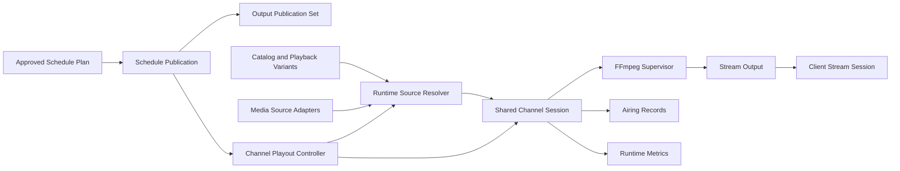

# Milestone 08: Publication, Playout, and Output

- **Roadmap version:** 0.1
- **Milestone status:** Draft
- **Last updated:** 2026-07-27
- **Risk classification:** Runtime / Output / Critical
- **Implementation authority:** Schedule Publication, runtime Playout Decisions, FFmpeg supervision, streaming, XMLTV, M3U, and HDHomeRun-compatible output

## Purpose

This milestone implements the runtime and publication boundary that turns
approved Schedule Plans into stable live television output.

It defines:

- Schedule Publication
- Publication activation
- Active-plan pointers
- Publication revisions
- Publication handoff
- Published Artifacts
- Output Publication Sets
- Atomic artifact replacement
- Last-known-good output
- M3U generation
- XMLTV generation
- HDHomeRun-compatible discovery
- HDHomeRun-compatible lineup
- Canonical Output Identity
- Stream endpoint behavior
- Shared Channel Sessions
- Client Stream Sessions
- Runtime Offset
- Source Binding resolution
- Playback Variant resolution
- Direct proxy
- Remux
- Transcode
- Output Profiles
- Audio and subtitle selection
- FFmpeg command construction
- FFmpeg process supervision
- Hardware acceleration
- Resource reservations
- Tuner allocation
- Runtime recovery
- Continuity boundaries
- Presentation playback
- Filler playback
- Off-Air
- Error slates
- Maintenance output
- Airing Records
- Now/Next status
- Health and diagnostics
- Runtime security
- Legacy output compatibility
- Testing
- Pull-request sequencing
- Entry and completion gates
- Rollback
- Risks
- Deferred decisions

This milestone does not modify editorial Schedule Entries during runtime.

It consumes approved schedule state and records what actually occurred.

## Governing Specifications

This milestone is governed by:

- `docs/architecture/spec/01-terminology.md`
- `docs/architecture/spec/02-system-context.md`
- `docs/architecture/spec/03-domain-model.md`
- `docs/architecture/spec/04-scheduling-model.md`
- `docs/architecture/spec/05-media-catalog.md`
- `docs/architecture/spec/06-playout-and-output.md`
- `docs/architecture/spec/07-integrations.md`
- `docs/architecture/spec/08-persistence.md`
- `docs/architecture/spec/09-api.md`
- `docs/architecture/spec/11-security.md`
- `docs/architecture/spec/12-deployment.md`
- `docs/architecture/spec/13-testing.md`
- `docs/architecture/spec/14-migration.md`
- `docs/architecture/spec/15-interstitial-programming-and-external-video-feeds.md`
- `docs/implementation/README.md`
- `docs/implementation/01-baseline-and-change-control.md`
- `docs/implementation/02-module-boundaries.md`
- `docs/implementation/03-identity-persistence-and-migrations.md`
- `docs/implementation/04-legacy-compatibility.md`
- `docs/implementation/05-media-sources-and-catalog.md`
- `docs/implementation/06-networks-and-channels.md`
- `docs/implementation/07-deterministic-scheduling.md`

## Milestone Mission

ChannelForge must deliver stable linear television from approved plans.

The Publication, Playout, and Output milestone must:

- Publish only approved Schedule Plans
- Keep approval separate from publication
- Change active publication atomically
- Preserve the prior valid publication on failure
- Preserve the last valid guide and playlist artifacts
- Keep XMLTV, M3U, HDHomeRun, and stream identity consistent
- Resolve the active Schedule Entry deterministically
- Start at the correct Runtime Offset
- Allow clients to join in progress
- Share one Channel timeline across compatible viewers
- Resolve source access as late as practical
- Prefer viable direct or remux paths
- Transcode only when required by policy
- Keep credentials and signed source URLs private
- Supervise FFmpeg as an external process
- Detect stalls and timing drift
- Bound CPU, memory, process, bandwidth, and storage use
- Recover from source and process failures through explicit policy
- Preserve editorial Schedule Entries during recovery
- Record every Playout Decision
- Record what actually aired
- Keep one client disconnect from becoming a Channel failure
- Preserve live output during artifact regeneration
- Support Docker and Unraid
- Remain operable with one application container and SQLite
- Keep inherited Tunarr output available until cutover is validated

## Product Principle

The governing product principle remains:

> Build television networks, not playlists.

Playout is operational machinery.

It does not decide what the Network should program.

Publication says what should be consumed.

Playout decides how to execute the approved Schedule Entry with current runtime
resources.

## Core Separation

ChannelForge separates:

1. Approved Schedule Plan
2. Schedule Publication
3. Output artifacts
4. Runtime source resolution
5. Channel Session
6. Client Stream Session
7. FFmpeg or direct proxy execution
8. Airing Records

## Architecture



## Core Principles

1. Playout consumes approved Schedule Publication state.
2. Playout never rewrites Schedule Entries.
3. Publication activation is atomic.
4. A failed publication does not replace active output.
5. Runtime source choice is separate from scheduling identity.
6. Final source URLs are resolved late.
7. One logical Channel timeline is shared across viewers.
8. Joining does not restart the program.
9. Runtime Offset derives from the planned timeline.
10. FFmpeg is supervised and attributable.
11. Every recovery action is explicit and recorded.
12. Output identity is consistent across protocols.
13. Guide output and actual airing are distinct.
14. Credentials remain inside restricted runtime structures.
15. Artifact replacement is atomic.
16. Last-known-good artifacts remain available.
17. Resource limits are enforced.
18. Client failures are isolated.
19. Runtime state is reconstructable where practical.
20. Legacy output remains until explicit cutover.

## Scope

Version 1 supports:

- One active logical Channel timeline per Channel
- One active Schedule Publication per Channel
- Shared Channel Sessions
- Multiple attached clients
- Dedicated sessions where required
- On-demand startup
- Optional prewarming
- Optional always-on Channels
- Direct controlled proxy
- Remux
- Video transcode
- Audio transcode
- MPEG-TS over HTTP
- HLS where enabled
- IPTV M3U
- XMLTV
- HDHomeRun-compatible discovery
- HDHomeRun-compatible lineup
- Presentation assets
- Filler
- Off-Air
- Maintenance slates
- Error slates
- Source fallback
- Playback Variant fallback
- FFmpeg supervision
- Hardware acceleration
- Tuner and resource limits
- Airing Records
- Now/Next
- Output health
- Legacy output comparison and cutover

## Non-Goals

Version 1 does not require:

- Distributed multi-host playout
- Multi-region failover
- Frame-accurate broadcast automation
- SDI output
- SCTE-35 insertion
- DRM removal
- Per-viewer personalized schedules
- Cloud transcoding
- Commercial ad auctions
- Automatic rights enforcement
- Viewer analytics beyond operational session metrics
- Recording or DVR
- Catch-up television
- Time-shift playback controlled by individual viewers
- Dynamic schedule rewriting
- Arbitrary user-supplied FFmpeg arguments
- Automatic hardware overclocking
- Public unauthenticated management APIs
- Final legacy code deletion

## Module Ownership

## Publication Module Owns

- Schedule Publication
- Publication revision
- Active publication pointer
- Publication activation
- Publication withdrawal
- Publication handoff
- Output Publication Set
- Published Artifact metadata
- Artifact active pointers
- Last-known-good policy
- Artifact validity
- Publication consistency

## Playout Module Owns

- Channel Playout Controller
- Shared Channel Session
- Client Stream Session
- Runtime Offset
- Playout Decision
- Continuity boundary
- Runtime recovery
- Session state
- Airing Record
- Now/Next runtime projection
- Resource request
- Tuner allocation

## Output Module Owns

- Output Profile
- Stream protocol
- M3U generation
- XMLTV generation
- HDHomeRun-compatible output
- Stream endpoint contracts
- HLS segment policy
- MPEG-TS output policy
- Output identity serialization
- Artifact validation
- Artifact caching headers

## Integrations Own

- Provider-specific playback access resolution
- Signed URL acquisition
- Provider headers
- Provider cookies
- Seek behavior
- Provider-side transcode option
- Source health observations

## Catalog Owns

- Catalog Item
- Source Binding
- Playback Variant
- Variant technical metadata
- Variant availability
- Preferred source hints

## Channels Own

- Channel ID
- Canonical Output Identity
- Channel number
- Output configuration reference
- Active publication reference
- Channel lifecycle

## Scheduling Owns

- Approved Schedule Plan
- Schedule Entries
- Guide metadata snapshots
- Presentation instructions
- Locks and fixed events
- Plan checksum

## Secret Service Owns

- Media Source credentials
- Proxy credentials
- Hardware API credentials where applicable
- Signing secrets
- Token material

## Schedule Publication

Schedule Publication controls which approved plan downstream systems consume.

## Schedule Publication Fields

```text
schedulePublicationId
channelId
approvedSchedulePlanId
state
effectiveStart
effectiveEnd
publishedAt
publishedBy
publicationRevision
supersededPublicationId
outputPublicationSetId
lastSuccessfulArtifactGenerationAt
lastPublicationError
createdAt
updatedAt
version
```

## Publication States

- `PENDING`
- `PREPARING`
- `READY`
- `ACTIVE`
- `SUPERSEDED`
- `WITHDRAWN`
- `FAILED`

## Pending

Publication exists but is not yet active.

## Preparing

Artifacts and runtime preflight are being prepared.

## Ready

Validation and artifact generation succeeded.

The publication is eligible for activation.

## Active

Downstream guide, lineup, and playout resolve this publication.

## Superseded

A newer publication replaced it.

## Withdrawn

Operator or policy removed it from active use.

## Failed

Preparation failed.

The active publication remains unchanged.

## Publication Preconditions

A plan may be published only when:

- Plan exists
- Plan is approved
- Plan checksum matches Approval Record
- Channel matches
- Network and Channel are not archived
- Publication horizon is valid
- Required guide metadata exists
- Required Output Identity exists
- Required assets exist or fallback is configured
- Staleness policy allows publication
- Freeze-window policy allows change
- Expected active publication revision matches
- Authorization succeeds
- No blocking conflict exists

## Publication Request

Conceptual fields:

```text
publicationRequestId
channelId
schedulePlanId
expectedActivePublicationRevision
effectiveStart
effectiveEnd
publicationMode
artifactPolicy
prewarmPolicy
requestedBy
requestedAt
idempotencyKey
```

## Publication Modes

- `IMMEDIATE`
- `SCHEDULED`
- `HANDOFF_AT_BOUNDARY`
- `MAINTENANCE`
- `MIGRATION`

## Immediate Publication

Activation occurs as soon as preparation succeeds.

## Scheduled Publication

Activation occurs at a future UTC instant.

## Handoff at Boundary

Activation occurs at a safe Schedule Entry or configured continuity boundary.

## Maintenance Publication

The active Channel timeline may be replaced by maintenance output according to
explicit policy.

## Migration Publication

Used for controlled cutover from inherited runtime.

## Publication Preparation

Preparation:

1. Validate plan and approval.
2. Resolve Channel Output Identity.
3. Validate guide horizon.
4. Validate required assets.
5. Generate XMLTV candidate.
6. Generate M3U candidate.
7. Generate HDHomeRun lineup candidate.
8. Validate artifacts.
9. Calculate checksums.
10. Store artifacts in staging.
11. Create Output Publication Set.
12. Run optional playout preflight.
13. Mark publication Ready.
14. Await activation.

## Atomic Publication Activation

Activation must atomically update:

- Channel active publication reference
- Publication state
- Superseded publication state
- Output Publication Set active pointer
- Publication revision
- Audit record or durable event reference

## Activation Compare-and-Swap

Activation verifies expected active publication revision.

## Activation Failure

Failure leaves the previous active publication unchanged.

## Publication Handoff

At handoff:

- Existing clients may continue current buffered output
- New clients resolve new publication according to cutover policy
- Shared Channel Session may transition at boundary
- HLS discontinuity may be inserted
- Old publication remains historical
- Airing lineage remains clear
- Guide and stream propagation lag is measured

## Mid-Entry Handoff

Mid-entry handoff is discouraged.

It requires explicit policy and records:

- Old entry
- New entry
- Actual handoff instant
- Offset behavior
- Client impact
- Recovery or restart behavior

## Publication Withdrawal

Withdrawal:

- Removes publication from active selection
- Preserves history
- Requires fallback publication, Off-Air, maintenance, or unavailable policy
- Does not delete plan or artifacts
- Is audited

## Publication Rollback

Rollback activates a prior eligible publication through a new activation
command.

It does not mutate historical publication state.

## Publication Revision

Every active-pointer change increments publication revision.

## Publication Idempotency

Same idempotency key and request hash returns the prior result.

## Publication Freeze Window

A near-term freeze window protects currently airing or imminent entries.

Override requires:

- Permission
- Reason
- Audit
- Acknowledgement
- Runtime impact preview

## Output Publication Set

An Output Publication Set groups mutually consistent artifacts.

## Output Publication Set Fields

```text
outputPublicationSetId
channelSetRevision
publicationRevisionMap
m3uArtifactId
xmltvArtifactId
hdHomeRunLineupArtifactId
generatedAt
validFrom
validUntil
generatorVersionManifest
contentChecksum
state
```

## Publication Set States

- `STAGING`
- `VALIDATED`
- `ACTIVE`
- `SUPERSEDED`
- `FAILED`
- `EXPIRED`

## Publication Set Consistency

The set must use:

- Same active Channel identities
- Same Guide Channel IDs
- Same stream paths
- Same publication revision mapping
- Compatible validity interval

## Published Artifact

Published Artifact represents one generated output.

## Artifact Kinds

- `M3U`
- `XMLTV`
- `HDHOMERUN_LINEUP`
- `HDHOMERUN_DISCOVERY`
- `GUIDE_JSON`
- `NOW_NEXT`
- `STATIC_PREVIEW`

## Published Artifact Fields

```text
artifactId
artifactKind
outputPublicationSetId
publicationRevision
channelSetRevision
generatorVersion
generatedAt
validFrom
validUntil
contentChecksum
contentType
byteSize
validationState
storageReference
previousArtifactId
failureReference
```

## Artifact States

- `STAGING`
- `VALID`
- `ACTIVE`
- `SUPERSEDED`
- `INVALID`
- `MISSING`
- `EXPIRED`

## Atomic Artifact Publication

Artifact generation uses:

1. Write temporary content.
2. Flush and close.
3. Validate.
4. Calculate checksum.
5. Persist metadata.
6. Atomically move or replace managed file.
7. Atomically switch active pointer.
8. Retain prior valid artifact.
9. Clean staging after success or bounded failure retention.

## Partial Artifact Failure

A failure in one artifact must not expose a partially inconsistent publication
set.

Policy may:

- Fail entire set
- Reuse prior valid artifact where revision compatibility permits
- Mark degraded
- Block activation

## Last-Known-Good Policy

The most recent valid artifact remains available until a valid replacement is
active.

## Last-Known-Good Requirements

- Immutable checksum
- Known generator version
- Known publication revision
- Known validity interval
- Storage verified
- Referenced by active or fallback pointer

## Artifact Retention

Retention may include:

- Current active artifact
- Previous valid artifact
- Recent historical artifacts
- Failed candidate diagnostics
- Temporary staging files

Retention is bounded by:

- Time
- Count
- Storage bytes
- Historical references
- Active rollback window

## Conditional Requests

Artifacts may support:

- ETag
- Last-Modified
- If-None-Match
- If-Modified-Since

Identical content produces stable checksum.

## Output Identity

Every active Channel has one canonical Output Identity.

## Output Identity Fields

```text
channelId
guideChannelId
tunerLineupId
displayNumber
displayName
shortName
networkName
logoReference
streamPath
activeState
identityRevision
```

## Output Identity Invariants

- M3U guide ID matches XMLTV Channel ID
- HDHomeRun lineup maps to the same Channel ID
- Stream path resolves the same Channel timeline
- Number changes do not change Channel ID
- Archival removes Channel from new artifacts
- Historical artifacts preserve prior identity
- Output adapters do not invent IDs

## Channel Set Revision

Any active-lineup change increments Channel Set Revision.

Triggers:

- Channel activation
- Channel archival
- Number change
- Display-name change
- Guide ID change
- Logo change
- Stream path change
- Output publication policy change

## Public Base URL

Output artifact URL construction uses:

- Configured public base URL, or
- Safe request-aware construction under trusted-proxy policy

## Forwarded Header Rule

Arbitrary forwarded headers are not trusted.

## Base URL Context

Artifact metadata records the base URL context used for generation when content
depends on it.

## M3U Output

ChannelForge publishes M3U or M3U8 describing active Channels.

## M3U Entry

Each entry includes:

- Canonical Channel ID
- Display name
- Channel number
- Network group
- Logo URL
- Stream URL
- Guide Channel ID
- Optional client-compatible metadata

## M3U Ordering

Default ordering:

1. Channel major number
2. Channel minor number
3. Display name
4. Channel ID

## M3U Identity

M3U `tvg-id` or equivalent guide key must match XMLTV Channel ID.

## M3U Stream URL

Stream URL points to ChannelForge.

It must not expose provider source URL or credential.

## M3U Validation

Validate:

- Header
- Entry formatting
- Escaping
- URL construction
- Channel count
- Stable ordering
- Guide ID
- Duplicate stream paths
- Duplicate active numbers
- Size bounds
- Encoding

## M3U Regeneration Triggers

- Channel activation
- Channel archival
- Channel number change
- Name change
- Logo change
- Stream endpoint change
- Access policy change
- Output configuration change
- Public base URL change

## M3U Failure

A failed regeneration does not delete the last valid M3U.

## XMLTV Output

XMLTV describes Channels and approved planned programs.

## XMLTV Channel

Each Channel element derives from canonical Output Identity.

It may include:

- Guide Channel ID
- Display names
- Number
- Icon
- Source metadata where appropriate

## XMLTV Programme

Each Programme derives from approved Schedule Entry guide snapshot.

Potential fields:

- Start
- Stop
- Channel
- Title
- Subtitle
- Description
- Category
- Episode number
- Original air date
- Release year
- Rating
- Icon
- New or repeat
- Credits
- Language
- Previously shown

## Guide Snapshot Authority

The approved Schedule Entry guide snapshot is authoritative for the publication.

Later Catalog metadata changes do not silently alter it.

## XMLTV Time

Timestamps include explicit offset or use normalized UTC according to generator
policy.

DST transitions must remain valid.

## XMLTV Entry Inclusion

Policy decides whether to expose:

- Programs
- Bumpers
- Idents
- Promos
- Advertisements
- Filler
- Off-Air
- Error slates

## Hidden Presentation Entries

Presentation may be merged into adjacent guide intervals only when temporal
consistency remains exact and policy permits.

## XML Safety

- Escape all values
- Normalize or reject invalid controls
- Use safe encoding
- Bound output size
- Avoid untrusted markup injection

## XMLTV Validation

Validate:

- Well-formed XML
- Known Channel IDs
- Valid timestamps
- Positive or nonnegative durations according to entry
- Ordering
- Required title
- Safe encoding
- Size bounds
- Horizon bounds
- No unapproved plans

## Guide Horizon

May include:

- Current program
- Configured previous buffer
- Future approved schedule range
- Configured maximum days

## XMLTV Regeneration Triggers

- Publication activation
- Channel identity change
- Horizon extension
- Explicit guide correction workflow
- Artifact expiration
- Generator version change

## XMLTV Failure

Last valid XMLTV remains available.

## HDHomeRun-Compatible Output

ChannelForge may expose discovery and lineup behavior compatible with supported
clients.

## Device Identity

Fields:

```text
deviceId
friendlyName
modelNumber
firmwareLabel
baseUrl
lineupUrl
tunerCount
authenticationPolicy
identityRevision
```

## Device Identity Ownership

Device identity is ChannelForge-owned.

## Device ID Stability

Changing Device ID may cause client reconfiguration.

It requires explicit operator action and migration warning.

## Discovery

Discovery may include:

- HTTP discovery document
- UDP broadcast response
- Network interface selection
- Stable Device ID
- Base URL
- Tuner count

## UDP Networking

Docker and Unraid documentation must state:

- Required port
- Protocol
- Host versus bridge behavior
- Broadcast limitations
- Firewall expectations
- Multi-interface selection

## Lineup

Each lineup entry includes:

- Channel number
- Channel name
- Stream URL
- Optional guide data
- Optional logo
- DRM state
- Enabled or favorite state where supported

## Lineup Status

May expose:

- Scan state
- Source type
- Channel count
- Last update
- Compatibility status

ChannelForge does not perform physical RF scanning.

## Tuner Count

Advertised tuner count represents supported concurrent capacity.

Advertising unlimited tuners without capacity is prohibited.

## Tuner Allocation

A tuner allocation may represent:

- Shared Channel Session attachment
- Dedicated Client Session
- Hardware reservation
- Stream lease

## Tuner Allocation Fields

```text
tunerAllocationId
deviceId
tunerIndex
channelId
playoutSessionId
clientStreamSessionId
allocatedAt
lastHeartbeat
releasedAt
releaseReason
```

## Tuner Allocation Rules

- Allocation is bounded
- Expired leases are reclaimed
- One tuner may attach to shared output when client semantics permit
- Dedicated output consumes appropriate capacity
- Resource policy remains authoritative
- Allocation state is observable

## Stream Endpoint

A Channel stream endpoint resolves the active Channel timeline.

## Stream Request Flow

1. Authenticate or apply configured anonymous policy.
2. Resolve Channel.
3. Verify active state.
4. Resolve active Schedule Publication.
5. Acquire session coordination.
6. Reuse compatible Channel Session or create one.
7. Allocate tuner or resource lease where required.
8. Create Client Stream Session.
9. Attach output.
10. Stream until disconnect or terminal failure.
11. Record disconnect and release resources.

## Stream Protocols

Potential version 1 protocols:

- MPEG-TS over HTTP
- HLS
- Controlled direct proxy

## MPEG-TS Requirements

- Stable packet flow
- Valid timestamps
- Program map
- Continuity
- Bounded buffering
- Client disconnect detection
- Correct content type

## HLS Requirements

- Master or media playlist as configured
- Segment sequence
- Target duration
- Live window
- Cleanup
- Cache policy
- Discontinuity markers
- No cross-publication segment leakage

## HLS Segment Storage

May be:

- In memory
- Temporary managed storage
- Local segment service

Policy defines:

- Max retained duration
- Max bytes
- Cleanup cadence
- Crash cleanup
- Client grace period

## HLS Discontinuity

Insert when required by:

- Codec change
- Timestamp reset
- Source switch
- FFmpeg restart
- Publication handoff
- Output Profile change

## Range Requests

Range semantics generally do not apply to infinite live Channel output.

Source Range behavior remains internal.

## CORS

Cross-origin stream access is restricted by default.

Trusted origins may be configured.

## Cache Control

Live streams prevent inappropriate intermediary caching.

Artifacts may be conditionally cached.

## Channel Playout Controller

The Controller determines what should currently be airing.

## Controller Inputs

- Channel ID
- Active Publication ID
- Current UTC instant
- Schedule Entry sequence
- Output configuration
- Maintenance override
- Recovery policy
- Session state
- Upcoming boundary

## Active Schedule Resolution

At any instant resolve:

- Active Publication
- Active Schedule Entry
- Entry start
- Entry end
- Entry kind
- Catalog Item
- Presentation Asset
- Runtime Offset
- Upcoming Entry
- Continuity boundary
- Publication revision

## Entry Interval Rule

Entry intervals are half-open.

The exact end instant belongs to the next entry.

## Publication Gap

An uncovered interval is a publication defect.

It is not implicit Off-Air.

## Runtime Offset

Conceptually:

```text
runtimeOffset = currentInstant - scheduleEntry.startInstant
```

## Runtime Offset Rules

- Use persisted UTC boundaries
- Clamp only through explicit recovery policy
- Record requested and actual offset
- Account for source seek behavior
- Account for startup latency
- Account for Carry-In
- Account for resume

## Join in Progress

A joining client receives current program at current timeline position.

Joining does not:

- Restart program
- Create viewer-specific schedule
- Mutate publication
- Advance timeline

## Shared Channel Session

A Channel Session is the shared execution of one Channel timeline.

## Channel Session Fields

```text
playoutSessionId
channelId
activePublicationId
outputProfileId
state
startedAt
currentScheduleEntryId
currentPlayoutDecisionId
ffmpegProcessReference
outputEndpointReference
clientCount
lastActivityAt
recoveryCount
endedAt
endReason
version
```

## Channel Session States

- `IDLE`
- `PREPARING`
- `STARTING`
- `RUNNING`
- `TRANSITIONING`
- `RECOVERING`
- `DRAINING`
- `STOPPING`
- `STOPPED`
- `FAILED`

## Session Identity

A restarted session receives a new `playoutSessionId`.

## Session Coordination

Only one shared session per compatible Channel and Output Profile should own the
timeline.

## On-Demand Startup

1. Authorize.
2. Resolve Channel and publication.
3. Acquire coordination.
4. Reuse compatible session.
5. Resolve active entry.
6. Resolve source and variant.
7. Calculate offset.
8. Reserve resources.
9. Build pipeline.
10. Start process or proxy.
11. Confirm readiness.
12. Attach client.
13. Record session and decision.

## Prewarming

May occur before:

- Expected viewer access
- Fixed event
- Entry boundary
- Publication activation
- Maintenance end

Prewarming may:

- Resolve access
- Reserve hardware
- Start FFmpeg
- Buffer output
- Validate resources

Prewarming must not create duplicate timelines.

## Always-On Channel

An always-on Channel may keep a Session active with zero clients.

## Idle Shutdown

A Session may stop when:

- No clients
- Idle timeout elapsed
- No prewarm
- No monitoring consumer
- Safe boundary
- No hold-open

## Client Stream Session

Fields:

```text
clientStreamSessionId
playoutSessionId
channelId
clientProtocol
clientIdentityReference
remoteAddressClassification
startedAt
lastActivityAt
outputProfileId
bytesSent
disconnectedAt
disconnectReason
```

## Client Privacy

Client identity and remote address follow privacy and retention policy.

## Shared Versus Dedicated

Shared Session is permitted when:

- Protocol compatible
- Output Profile compatible
- Timeline common
- Buffering supports fan-out
- Access policy permits

Dedicated Session may be required for:

- Different codec
- Different resolution
- Different subtitles
- Independent seek
- Incompatible protocol
- Isolation policy

Dedicated Session still follows same Publication timeline.

## One Client Failure

A client disconnect or broken pipe does not automatically fail the shared
Channel Session.

## Output Profile

Fields:

```text
outputProfileId
name
container
transport
videoCodec
audioCodec
maxWidth
maxHeight
maxFrameRate
maxVideoBitRate
audioChannelPolicy
subtitlePolicy
segmentDuration
latencyTarget
hardwareAccelerationPreference
clientCompatibilityLabels
streamModePreference
version
```

## Stream Modes

- `AUTO`
- `DIRECT`
- `REMUX`
- `TRANSCODE`
- `TRANSCODE_VIDEO_ONLY`
- `TRANSCODE_AUDIO_ONLY`

## Compatibility Evaluation

Considers:

- Source container
- Video codec
- Audio codec
- Subtitle format
- Resolution
- Frame rate
- Bit rate
- HDR
- Interlace
- Audio channels
- Client protocol
- Output transport
- Hardware support
- Watermark
- Overlay
- Seek
- Continuity requirements

## Direct Play

Allowed when:

- Required offset is supported
- Container compatible
- Codecs compatible
- Timing stable
- Client or shared output supports it
- No transformation required
- Credentials remain protected
- Monitoring is sufficient

## Controlled Direct Proxy

Benefits:

- Hides source credentials
- Centralizes authorization
- Normalizes endpoint
- Provides metrics
- Supports cancellation

Direct proxy buffering is bounded.

## Remux

Preferred when codecs are compatible but packaging is not.

Possible transformations:

- Container to MPEG-TS
- Container to HLS
- Timestamp normalization
- Stream selection
- Subtitle removal
- Audio selection
- Metadata cleanup

## Transcode

Used when required by:

- Codec mismatch
- Resolution limit
- Bit-rate limit
- Frame-rate limit
- HDR conversion
- Interlace handling
- Audio mismatch
- Subtitle burn
- Watermark
- Overlay
- Seek limitation
- Continuity constraint

## Video Transcode Policy

May define:

- Encoder
- Hardware device
- Pixel format
- Profile
- Level
- Rate control
- Bit rate
- Buffer
- GOP
- Keyframe interval
- Scaling
- Deinterlace
- HDR handling
- Color conversion
- Threads

## Audio Transcode Policy

May define:

- Encoder
- Bit rate
- Channel layout
- Sample rate
- Loudness normalization
- Language
- Downmix
- Passthrough

## Subtitle Policy

- `DISABLED`
- `PASSTHROUGH_WHEN_SUPPORTED`
- `EXTERNAL_WHEN_SUPPORTED`
- `BURN_SELECTED`
- `BURN_FORCED_ONLY`
- `AUTO`

## Audio Track Selection

May consider:

- Preferred language
- Original language
- Default flag
- Commentary exclusion
- Descriptive audio
- Channel count
- Codec
- Channel override

## Subtitle Track Selection

May consider:

- Preferred language
- Forced flag
- Hearing-impaired flag
- Default
- Compatibility
- Burn requirement

## Runtime Source Resolver

The resolver selects eligible Source Binding and Playback Variant.

## Resolver Inputs

- Catalog Item ID
- Output Profile
- Runtime Offset
- Source health
- Binding state
- Variant state
- Recent failures
- Preferred source hint
- Preferred variant hint
- Direct-play capability
- Transcode capability
- Credentials
- Connection limits

## Source Ranking

Recommended order:

1. Eligible and available
2. Compatible
3. Preferred source policy
4. Direct or remux suitability
5. Recent verified success
6. Seekability
7. Variant quality
8. Source load
9. Recent failure penalty
10. Stable deterministic tie-break

## Source Resolution Result

```text
sourceBindingId
playbackVariantId
accessMethod
expiration
requiredHeaders
requiredCookies
seekMethod
compatibilityResult
expectedDuration
selectedStreams
sourceAdapterVersion
resolvedAt
```

Sensitive values stay in restricted runtime memory.

## Source Access Descriptor

May contain:

- URL
- Local path
- Headers
- Cookies
- Token reference
- Protocol
- Expiration
- Seek support
- Range support
- Provider transcode descriptor

## Access Descriptor Security

- Never persist raw credential
- Never expose to client
- Redact logs
- Expire promptly
- Validate protocol
- Validate host
- Validate path
- Avoid forwarding authorization across hosts

## Source Resolution Freshness

Short-lived access is resolved late.

Expired access is refreshed.

## Preferred Hints

Schedule Entry hints are preferences.

They are not immutable runtime mandates when unavailable.

## Variant Fallback

If preferred variant fails:

- Try another compatible variant
- Try another Source Binding
- Try provider transcode
- Try software transcode
- Use fallback content
- Use slate
- Skip according to policy

## Playout Decision

A Playout Decision records how one Schedule Entry was executed.

## Playout Decision Fields

```text
playoutDecisionId
playoutSessionId
schedulePublicationId
scheduleEntryId
catalogItemId
sourceBindingId
playbackVariantId
runtimeOffsetRequested
runtimeOffsetActual
streamMode
outputProfileId
selectedAudioTrack
selectedSubtitleTrack
hardwareDeviceId
decisionReason
compatibilitySummary
fallbackLevel
resolvedAt
endedAt
result
```

## Decision Result

- `PREPARED`
- `STARTED`
- `COMPLETED`
- `FAILED`
- `SKIPPED`
- `FALLBACK`
- `INTERRUPTED`

## Decision Immutability

A decision is append-only.

Recovery creates new decisions or recovery events.

## FFmpeg Boundary

FFmpeg is an external supervised process.

## ChannelForge Owns

- Typed command construction
- Process launch
- Environment
- Standard input
- Standard output
- Standard error
- Progress
- Timeouts
- Termination
- Resource association
- Diagnostics
- Cleanup

## FFmpeg Does Not Own

- Schedule state
- Catalog identity
- Authorization
- Publication decision
- Long-lived credentials
- Recovery policy

## FFmpeg Command Builder

Uses typed input structures.

## Command Builder Inputs

- Source Access Descriptor
- Runtime Offset
- Input format hints
- Selected streams
- Filter graph specification
- Output Profile
- Hardware configuration
- Presentation requirements
- Output transport
- Logging mode
- Progress mode

## Arbitrary Fragment Prohibition

User, template, pack, or plugin text cannot become arbitrary FFmpeg command
fragments without an explicitly sandboxed extension design.

## Argument Safety

Use argument arrays.

Validate against:

- Shell injection
- File access
- Unsupported protocols
- Unsupported network destinations
- Unsafe filters
- Secret leakage
- Path traversal
- Excessive resources

## FFmpeg Environment

Include only required environment variables.

Do not inherit unrelated sensitive host environment.

## FFmpeg Process Record

```text
processReferenceId
operatingSystemPid
playoutSessionId
scheduleEntryId
playoutDecisionId
commandChecksum
startedAt
lastProgressAt
exitedAt
exitCode
terminationReason
state
```

OS PID is not domain identity.

## Process States

- `CREATED`
- `STARTING`
- `RUNNING`
- `STALLED`
- `STOPPING`
- `EXITED`
- `FAILED`
- `ORPHANED`

## Startup Timeout

Detects:

- Source stall
- Hardware initialization failure
- Invalid command
- Missing executable
- Permission failure
- No output

## Progress Reporting

Parse machine-readable progress where possible.

Potential fields:

- Process time
- Output time
- Frames
- Speed
- Bit rate
- Dropped frames
- Duplicated frames
- Total size
- End state

Malformed progress must not crash supervisor.

## Standard Error

- Bounded retention
- Redacted
- Session-associated
- Operator-only
- Excluded from client responses

## Stall Detection

Possible indicators:

- No progress
- Output time not advancing
- No output bytes
- Segment publication stopped
- Source inactive

Static slates require special handling.

## Process Termination

1. Stop new client attachment where required.
2. Request graceful stop.
3. Wait grace period.
4. Send terminate signal.
5. Wait force period.
6. Force kill.
7. Close pipes.
8. Release hardware.
9. Record outcome.

## Orphan Detection

Startup must detect or avoid unmanaged prior FFmpeg processes.

Possible mechanisms:

- Process groups
- PID plus start-time verification
- Parent-death behavior
- Container cleanup
- Session lease
- Command markers

Stale PID alone is insufficient.

## Hardware Acceleration

Potential backends:

- Intel Quick Sync
- VA-API
- NVIDIA NVENC
- VideoToolbox
- Other supported FFmpeg backends

## Hardware Device

Fields:

```text
hardwareDeviceId
deviceType
devicePath
encoderNames
decoderNames
filterCapabilities
maxConcurrentSessions
preferredProfiles
softwareFallback
healthState
lastVerifiedAt
```

## Hardware Reservation

Fields:

```text
hardwareReservationId
hardwareDeviceId
playoutSessionId
encoderClass
startedAt
lastHeartbeat
releasedAt
releaseReason
```

## Hardware Fallback

Policy may:

- Retry
- Use another device
- Fall back to software
- Reduce profile
- Remux
- Fail

Every fallback is recorded.

## Resource Management

Resources include:

- CPU
- Memory
- Encoder slots
- Network bandwidth
- Open files
- Process count
- Segment storage
- Client count
- Source connections

## Resource Policy

May define:

- Max Channel Sessions
- Max dedicated sessions
- Max transcodes
- Max software transcodes
- Per-Channel client limit
- Per-source connection limit
- Queue timeout
- Priority
- Preemption

## Preemption

Version 1 avoids automatic preemption unless configured.

## Session Priority

May consider:

- Always-on Channel
- Viewer count
- Operator priority
- Output cost
- Fixed Event
- Health monitoring
- Preview

## Recovery Policy

Recovery defines action after source, process, or timing failure.

## Recovery Inputs

- Failure type
- Remaining entry time
- Source alternatives
- Variant alternatives
- Output Profile
- Recent failures
- Recovery count
- Resource availability
- Next boundary
- Fallback content
- Maintenance policy

## Recovery Actions

Possible ordered actions:

1. Retry same source
2. Re-resolve access
3. Select another Playback Variant
4. Select another Source Binding
5. Change stream mode
6. Change hardware device
7. Fall back to software
8. Lower Output Profile
9. Insert fallback content
10. Insert error slate
11. Skip to next entry
12. Stop Session

## Recovery Window

Recovery considers remaining scheduled time.

A long retry near entry end may be worse than advancing.

## Maximum Recovery Time

Per-entry limit prevents endless retries.

## Recovery Backoff

Bounded backoff may apply.

## Recent Failure Memory

Track:

- Source
- Variant
- Error
- Count
- Last failure
- Success since failure
- Scope

## Circuit Breaker

A source or variant may be temporarily excluded after repeated failures.

## Circuit Breaker Scope

- Source-wide
- Binding-specific
- Variant-specific
- Hardware-device-specific
- Adapter-specific

## Recovery Does Not Rewrite Schedule

Runtime recovery never mutates the Schedule Entry.

## Error Slate

An Error Slate is a runtime fallback or explicit planned asset.

When used as recovery, Airing Record identifies divergence from plan.

## Maintenance Output

Maintenance mode may use:

- Maintenance slate
- Loopable asset
- Scheduled maintenance publication
- Explicit Off-Air
- Controlled unavailable response

## Continuity Boundary

Transition between entries must account for:

- Planned end
- Actual source end
- Process startup
- Buffer
- Codec change
- HLS discontinuity
- Presentation insertion
- Publication handoff
- Drift

## Pre-Resolution

Upcoming source may be resolved before boundary.

## Pre-Start

Next process may be started early when resource and buffering policy permit.

## Dual-Process Transition

A short overlap in process preparation may occur without overlapping editorial
output.

## Timing Drift

Detect difference between:

- Wall clock
- Monotonic elapsed
- Planned position
- FFmpeg progress
- Segment timestamps

## Drift Policy

May:

- Ignore within tolerance
- Adjust buffer
- Seek or restart
- Shorten recovery content
- Skip ahead
- Record warning
- Fail Session

## Clock Anomaly

Host is responsible for NTP.

ChannelForge warns when host clock threatens alignment.

## Airing Record

Airing Record captures what actually occurred.

## Airing Record Fields

```text
airingRecordId
channelId
schedulePublicationId
schedulePlanId
scheduleEntryId
playoutSessionId
playoutDecisionId
plannedStart
plannedEnd
actualStart
actualEnd
actualCatalogItemId
actualPresentationAssetId
result
completionFraction
runtimeOffsetStart
sourceBindingId
playbackVariantId
fallbackType
failureReference
createdAt
```

## Airing Results

- `COMPLETED`
- `PARTIAL`
- `SKIPPED`
- `FAILED`
- `FALLBACK_CONTENT`
- `ERROR_SLATE`
- `OFF_AIR`
- `INTERRUPTED`

## Airing Record Rule

Actual history is separate from planned history.

## Guide Versus Airing

XMLTV reflects approved plan.

Airing Records reflect runtime outcome.

Version 1 does not rewrite historical XMLTV after every runtime failure.

## Progression Feedback

Later Scheduling may consume Airing Records according to configured history
policy.

## Now/Next Projection

May expose:

- Channel ID
- Planned current entry
- Actual Playout Decision
- Planned start and end
- Actual session state
- Next entry
- Recovery state
- Source health summary
- Publication revision

## Now/Next Security

Do not expose:

- Credential
- Signed source URL
- Raw headers
- Private path
- Secret token

## Output Health

Health may include:

- Publication state
- Artifact state
- Channel Session state
- Active entry
- Runtime Offset
- Source selected
- Stream mode
- FFmpeg progress
- Client count
- Recent recovery
- Drift
- Resource pressure
- Tuner use
- Guide age
- Playlist age
- Lineup age

## Health States

- `HEALTHY`
- `DEGRADED`
- `RECOVERING`
- `MAINTENANCE`
- `UNAVAILABLE`
- `FAILED`
- `UNKNOWN`

## Persistence

Persistence may include:

- Schedule Publications
- Publication Requests
- Output Publication Sets
- Published Artifacts
- Active pointers
- Channel Sessions
- Client Sessions
- Playout Decisions
- FFmpeg Process Records
- Hardware Reservations
- Tuner Allocations
- Recovery Events
- Airing Records
- Now/Next projection
- Health summaries

## Runtime State Persistence

Not every transient byte or process buffer is persisted.

Persist enough to:

- Attribute runtime
- Recover safely
- Detect stale sessions
- Release resources
- Record actual airing
- Diagnose failures

## Session Lease

A Session lease may include:

- Session ID
- Owner process
- Started at
- Heartbeat
- Publication revision
- Current entry
- Expiration

## Startup Recovery

On startup:

1. Load active Publications.
2. Find incomplete Sessions.
3. Verify process ownership.
4. Mark stale resources.
5. Release expired reservations.
6. Close or reconcile Airing Records.
7. Rebuild Now/Next.
8. Prewarm configured Channels.
9. Preserve artifacts.
10. Resume output according to policy.

## Persistence Transaction Rules

- No FFmpeg process start inside SQLite transaction
- No source HTTP call inside write transaction
- No client streaming inside transaction
- State transitions use bounded transactions
- Active pointer changes use compare-and-swap
- Airing Records are append-oriented

## Security

## Stream Authorization

Policy may be:

- Authenticated
- Tokenized
- Network-restricted
- Anonymous local
- Public

Management authorization remains separate.

## Stream Token

A stream token must be:

- Scoped
- Expiring where possible
- Revocable
- Non-provider credential
- Redacted
- Auditable according to policy

## Source Secret Isolation

Provider credentials are not returned to clients.

## Source URL Isolation

Provider source URL is hidden unless an explicit safe direct-redirect policy is
approved.

## FFmpeg Injection Prevention

- Typed options
- Allowlisted protocols
- Allowlisted filters
- Argument arrays
- Path validation
- Resource limits
- No shell string execution

## SSRF Protection

Source resolution and output URL construction must respect:

- Media Source trust policy
- Allowed hosts
- Redirect policy
- Local-address policy
- Credential forwarding policy

## HLS Segment Security

- Randomized or scoped paths where needed
- Expiration
- Cleanup
- Access policy
- No source secrets in names

## XML and M3U Injection

Escape and normalize untrusted values.

## Trusted Proxy

Public URL generation uses trusted-proxy policy.

## Audit

Audit records required for:

- Publication request
- Publication activation
- Publication withdrawal
- Rollback
- Freeze-window override
- Maintenance activation
- Output Profile change
- Tuner policy change
- Hardware configuration change
- Manual Session stop
- Recovery override
- Device identity change
- Legacy output cutover

## Observability

## Publication Logs

Fields:

- `publicationRequestId`
- `schedulePublicationId`
- `schedulePlanId`
- `channelId`
- `publicationRevision`
- `outputPublicationSetId`
- `stage`
- `durationMs`
- `result`
- `correlationId`

## Playout Logs

Fields:

- `playoutSessionId`
- `clientStreamSessionId`
- `scheduleEntryId`
- `playoutDecisionId`
- `sourceBindingId`
- `playbackVariantId`
- `streamMode`
- `outputProfileId`
- `runtimeOffsetMs`
- `recoveryCount`
- `failureCode`
- `durationMs`
- `correlationId`

## FFmpeg Logs

Fields:

- `processReferenceId`
- `playoutSessionId`
- `scheduleEntryId`
- `commandChecksum`
- `state`
- `progressTimeMs`
- `speed`
- `exitCode`
- `terminationReason`

## Log Prohibitions

Do not log:

- Provider token
- Signed URL
- Cookie
- Authorization header
- Stream token
- Private key
- Unredacted command containing secret
- Full support bundle data in normal logs

## Metrics

### Publication

- Preparation duration
- Activation duration
- Artifact generation duration
- Artifact failure
- Last-known-good age
- Publication lag
- Guide/stream revision lag

### Sessions

- Active Channel Sessions
- Active Client Sessions
- Startup latency
- Join latency
- Session duration
- Client count
- Idle shutdown
- Always-on uptime

### FFmpeg

- Process count
- Startup time
- Stall count
- Exit code
- Restart count
- Speed
- Dropped frames
- Encoder use

### Recovery

- Recovery count
- Source fallback
- Variant fallback
- Hardware fallback
- Slate use
- Skip count
- Failure duration

### Resources

- CPU
- Memory
- Encoder slots
- Bandwidth
- Open files
- Segment storage
- Tuner use
- Source connections

### Output

- M3U age
- XMLTV age
- Lineup age
- Artifact checksum
- Stream errors
- HLS segment lag
- MPEG-TS continuity warnings

## Tracing

Potential spans:

- Publication validation
- Artifact generation
- Artifact validation
- Publication activation
- Session startup
- Source resolution
- Compatibility evaluation
- FFmpeg startup
- Client attachment
- Entry transition
- Recovery
- Session shutdown

## API Foundations

Exact route syntax is finalized in Milestone 09.

Required use cases include:

### Publication

- Prepare Publication
- Activate Publication
- Schedule Publication
- Withdraw Publication
- Roll back Publication
- Read Publication
- List Publications
- Read Publication Set
- Regenerate artifacts
- Read artifact status

### Playout

- Start or prewarm Channel Session
- Stop Channel Session
- Read Session
- List Sessions
- Read Client Sessions
- Read Playout Decision
- Read recovery events
- Read Airing Records
- Read Now/Next
- Trigger maintenance
- Clear maintenance

### Output

- Download M3U
- Download XMLTV
- Read HDHomeRun discovery
- Read lineup
- Stream Channel
- Read lineup status
- Read output health
- Read resource status

## Management and Protocol Separation

Management endpoints and protocol endpoints have different contracts.

## Long-Running Operations

Publication preparation and artifact generation return Background Jobs where
appropriate.

## Stream Response

Stream endpoint is long-lived and does not use ordinary JSON success shape.

## Error Mapping

Stream errors map to bounded protocol-compatible responses.

## ETag

Artifacts use checksum ETags.

## UI Foundations

Initial runtime UI includes:

- Publication list
- Active Publication
- Publish approved plan
- Publication preparation progress
- Artifact status
- Guide preview
- M3U preview
- HDHomeRun status
- Channel runtime status
- Current and next entry
- Runtime Offset
- Selected source and variant
- Stream mode
- FFmpeg state
- Client count
- Recovery history
- Resource use
- Tuner allocation
- Maintenance action
- Session stop
- Airing history
- Legacy output comparison

## Publication Preview

Before activation show:

- Plan checksum
- Validation state
- Staleness
- Effective interval
- Artifact checksums
- Channel identity
- Guide horizon
- Current active publication
- Handoff time
- Client impact
- Rollback target

## Runtime Detail

Show:

- Planned entry
- Actual decision
- Selected source
- Selected variant
- Stream mode
- Hardware device
- Offset
- Progress
- Drift
- Fallback level
- Recent errors

## Secret-Safe UI

Never display:

- Credential
- Full signed source URL
- Raw cookie
- Authorization header
- Private filesystem path unless privileged and policy allows

## Testing Strategy

Milestone 08 requires:

- Publication domain tests
- Artifact tests
- M3U tests
- XMLTV tests
- HDHomeRun tests
- Session tests
- Resolver tests
- FFmpeg tests
- Recovery tests
- Airing tests
- API contract tests
- UI tests
- Security tests
- Performance tests
- Windows tests
- Linux tests
- Docker tests
- Unraid tests
- Legacy comparison tests

## Publication Tests

Test:

- Approved plan
- Unapproved plan rejection
- Checksum mismatch
- Preparation
- Ready
- Atomic activation
- Compare-and-swap conflict
- Supersede
- Withdraw
- Rollback
- Scheduled handoff
- Failed artifact generation
- Prior publication preservation
- Idempotency

## Artifact Tests

Test:

- Temporary generation
- Validation
- Checksum
- Atomic move
- Active pointer
- Previous artifact
- Partial set failure
- Conditional request
- Cleanup
- Disk full
- Permission failure
- Crash before pointer switch
- Crash after pointer switch

## M3U Tests

Test:

- Header
- Stable order
- Number
- Name
- Network group
- Logo
- Stream URL
- Guide ID
- Escaping
- Base URL
- Reverse proxy
- Last-known-good

## XMLTV Tests

Test:

- Channel elements
- Programme elements
- UTC or offset format
- DST spring
- DST fall
- XML escaping
- Invalid controls
- Guide snapshot authority
- Presentation inclusion
- Off-Air
- Horizon
- Last-known-good
- Large artifact

## HDHomeRun Tests

Test:

- Device identity
- Device ID stability
- Discovery
- HTTP document
- UDP response
- Lineup
- Tuner count
- Allocation
- Release
- Docker host networking
- Multiple interfaces
- Disabled Channel
- Number order

## Active Entry Tests

Test:

- Half-open interval
- Exact boundary
- Carry-In
- Carry-Out
- Off-Air
- Publication gap
- Scheduled handoff
- Mid-entry handoff policy

## Runtime Offset Tests

Test:

- Join at start
- Join in progress
- Carry-In
- Resume
- Seek unsupported
- Startup latency
- Offset clamp policy

## Shared Session Tests

Test:

- First client starts Session
- Second client joins
- Program does not restart
- One client disconnects
- Session remains
- Idle shutdown
- Always-on
- Prewarm
- Dedicated incompatible client
- Publication transition

## Resolver Tests

Test:

- Preferred variant
- Preferred source unavailable
- Alternate variant
- Alternate source
- Direct play
- Remux
- Transcode
- Offset seek
- Source load
- Failure penalty
- Stable tie-break
- Credential redaction

## Output Profile Tests

Test:

- Container
- Video codec
- Audio codec
- Resolution
- Bit rate
- HDR
- Interlace
- Subtitles
- Hardware preference
- Dedicated session requirement

## FFmpeg Command Tests

Test:

- Typed args
- Offset
- Stream selection
- Direct path
- HTTP source
- Remux
- Transcode
- Video-only transcode
- Audio-only transcode
- Subtitle burn
- Watermark
- HLS
- MPEG-TS
- Command checksum
- Shell injection rejection
- Path traversal rejection
- Protocol rejection
- Secret redaction

## FFmpeg Supervisor Tests

Test:

- Startup
- Progress
- Malformed progress
- Startup timeout
- Stall
- Graceful stop
- Terminate
- Force kill
- Exit code
- Orphan detection
- Restart
- Pipe cleanup
- Hardware release

## Hardware Tests

Test:

- Reservation
- Capacity
- Release
- Heartbeat
- Device unavailable
- Alternate device
- Software fallback
- No fallback
- Stale reservation

## Recovery Tests

Test:

- Retry same source
- Refresh access
- Alternate variant
- Alternate source
- Hardware fallback
- Lower profile
- Error slate
- Skip
- Stop
- Recovery budget
- Near-entry-end behavior
- Circuit breaker
- Recovery record

## Airing Tests

Test:

- Complete
- Partial
- Failed
- Skipped
- Fallback content
- Error slate
- Off-Air
- Interrupted
- Actual versus planned
- Progression history input

## Security Tests

Test:

- Unauthorized stream
- Expired stream token
- Revoked token
- Source URL omission
- Cookie omission
- Authorization-header omission
- SSRF
- Redirect credential forwarding
- FFmpeg injection
- HLS path access
- CORS
- Trusted proxy
- XML injection
- M3U injection
- Support bundle redaction

## Failure Injection

Inject:

- Publication DB failure
- Artifact disk full
- Artifact rename failure
- Process missing
- Process startup stall
- Source timeout
- Source auth failure
- Broken pipe
- HLS segment failure
- Hardware initialization failure
- Client disconnect
- SQLite busy
- Application restart
- Clock jump
- Wall-clock drift
- Orphan process
- Expired signed URL

## Performance Tests

Measure:

- Publication preparation
- M3U generation
- XMLTV generation
- Artifact validation
- Session startup
- Join latency
- Source resolution
- FFmpeg startup
- Entry transition
- HLS segment latency
- Fan-out
- Recovery
- Session shutdown
- Airing write

## Performance Planning Cases

- 10 Channels
- 50 Channels
- 100 Channels
- 1 client per Channel
- 10 clients on one shared Channel
- 4 simultaneous transcodes
- 14-day XMLTV horizon
- 100,000 Programme entries
- Mixed direct, remux, and transcode

Exact supported limits require measurement.

## Cross-Platform Tests

### Windows

Focus:

- Process spawn
- Argument arrays
- Signal behavior
- Force termination
- Path quoting
- Named pipes
- File locks
- Atomic replace
- HLS cleanup
- Hardware enumeration

### Linux

Focus:

- Signals
- Process groups
- Parent-death behavior
- Device paths
- VA-API
- NVIDIA
- Permissions
- Atomic rename
- UDP discovery
- Container networking

## Docker Validation

Test:

- FFmpeg executable
- `/config`
- Temporary storage
- Media mounts
- Device mappings
- Host access
- Stream endpoint
- M3U
- XMLTV
- HDHomeRun HTTP
- HDHomeRun UDP where supported
- Restart recovery
- Orphan cleanup
- Hardware reservation

## Unraid Validation

Validate:

- PUID and PGID
- `/config` persistence
- Read-only media mounts
- GPU device mapping
- Intel `/dev/dri`
- NVIDIA runtime
- Host or bridge networking
- UDP discovery
- Port mappings
- Artifact storage
- HLS storage
- Restart
- Multiple clients

## Legacy Output Compatibility

Inherited Tunarr output remains available during migration.

## Legacy Output Components

- Stream routes
- XMLTV route
- M3U route
- HDHomeRun discovery
- HDHomeRun lineup
- FFmpeg settings
- Active Channel runtime
- Tuner policy
- Device identity
- Public base URL

## Legacy Compatibility Modes

- Legacy authoritative
- ChannelForge artifact shadow
- ChannelForge stream preview
- Dual compare
- ChannelForge publication active
- Legacy fallback
- Legacy output frozen
- Retired

## Shadow Artifact Comparison

Compare:

- Channel count
- Channel order
- Guide IDs
- Stream paths
- Programme count
- Programme times
- Names
- Logos
- Device identity
- Tuner count

## Stream Preview

A preview stream may use ChannelForge playout without replacing legacy public
stream route.

## Cutover Preconditions

- Approved ChannelForge plan
- Active Publication prepared
- Artifact validation passes
- Stream preview passes
- Source resolution passes
- FFmpeg path passes
- Resource limits configured
- Tuner count configured
- Device identity decision recorded
- Client compatibility tested
- Rollback publication available
- Legacy routes measured
- Operator approves

## Cutover

Cutover may switch:

- Active stream handler
- M3U pointer
- XMLTV pointer
- HDHomeRun discovery
- Lineup
- Device identity
- Tuner allocation

Changes should be staged where possible.

## Legacy Output Freeze

After cutover:

- Legacy publication writes freeze
- Legacy artifact generation freezes
- Legacy FFmpeg session startup freezes
- Legacy guide writer freezes
- Legacy lineup writer freezes
- Compatibility reads remain during support window
- Rollback remains available

## Legacy Cutover Rollback

Rollback:

- Stops new ChannelForge Session creation
- Restores legacy artifact pointers
- Restores legacy stream handler
- Preserves ChannelForge Airing and diagnostics
- Releases resources
- Preserves mappings
- Records audit

## Documentation Deliverables

Milestone 08 implementation should create:

```text
docs/implementation/playout-output/
├── README.md
├── publication-model.md
├── publication-activation.md
├── output-publication-set.md
├── artifact-publication.md
├── output-identity.md
├── m3u.md
├── xmltv.md
├── hdhomerun-compatibility.md
├── stream-endpoints.md
├── channel-sessions.md
├── client-sessions.md
├── output-profiles.md
├── runtime-source-resolution.md
├── playout-decisions.md
├── ffmpeg-command-builder.md
├── ffmpeg-supervision.md
├── hardware-acceleration.md
├── resource-policy.md
├── recovery-policy.md
├── continuity.md
├── airing-records.md
├── now-next.md
├── legacy-output-cutover.md
├── performance-baseline.md
├── decision-register.md
└── completion-report.md
```

## Recommended Pull-Request Sequence

## PR 08A: Schedule Publication Domain

Scope:

- Publication aggregate
- states
- repository
- active pointer
- compare-and-swap
- tests

## PR 08B: Publication Preparation

Scope:

- preconditions
- Background Job
- validation
- idempotency
- no activation yet

## PR 08C: Published Artifact Foundation

Scope:

- Artifact model
- staging
- checksum
- validation
- atomic replacement
- last-known-good

## PR 08D: M3U Generator

Scope:

- Output Identity
- ordering
- URLs
- escaping
- validation
- artifact tests

## PR 08E: XMLTV Generator

Scope:

- guide snapshots
- time format
- DST
- escaping
- validation
- last-known-good

## PR 08F: Output Publication Set

Scope:

- consistent artifact grouping
- Channel Set Revision
- publication revision mapping
- activation pointer

## PR 08G: Atomic Publication Activation

Scope:

- activation
- supersede
- rollback
- scheduled handoff
- audit
- race tests

## PR 08H: HDHomeRun HTTP Compatibility

Scope:

- device identity
- discovery document
- lineup
- tuner count
- status
- tests

## PR 08I: HDHomeRun UDP Discovery

Scope:

- broadcast
- interface policy
- Docker and Unraid networking
- tests

## PR 08J: Stream Endpoint Foundation

Scope:

- authorization
- active publication resolution
- protocol response
- disconnect handling
- no FFmpeg yet

## PR 08K: Channel Session Domain

Scope:

- shared Session
- lifecycle
- coordination
- prewarm
- idle shutdown
- always-on

## PR 08L: Client Stream Sessions

Scope:

- attach
- detach
- shared versus dedicated
- privacy
- metrics

## PR 08M: Output Profiles

Scope:

- profile model
- compatibility evaluation
- direct/remux/transcode decision inputs
- tests

## PR 08N: Runtime Source Resolver

Scope:

- Source Binding ranking
- Playback Variant ranking
- access descriptor
- late resolution
- secret boundary
- tests

## PR 08O: Playout Decisions

Scope:

- decision persistence
- runtime offset
- track selection
- decision evidence
- tests

## PR 08P: FFmpeg Command Builder

Scope:

- typed args
- allowlists
- direct/remux/transcode
- HLS
- MPEG-TS
- command checksum
- security tests

## PR 08Q: FFmpeg Supervisor

Scope:

- launch
- progress
- timeout
- stall
- termination
- orphan handling
- diagnostics

## PR 08R: Hardware Acceleration

Scope:

- device model
- reservation
- health
- fallback
- Docker device validation

## PR 08S: Resource Policy and Tuner Allocation

Scope:

- limits
- queue
- tuner lease
- capacity
- metrics
- no automatic preemption by default

## PR 08T: Runtime Recovery

Scope:

- retry
- variant fallback
- source fallback
- profile fallback
- slate
- skip
- circuit breaker
- tests

## PR 08U: Continuity and Entry Transition

Scope:

- boundary
- pre-resolution
- pre-start
- drift
- HLS discontinuity
- publication handoff

## PR 08V: Airing Records

Scope:

- actual outcome
- completion
- fallback
- failure
- history query
- tests

## PR 08W: Now/Next and Health

Scope:

- projection
- status
- diagnostics
- no secrets
- UI read models

## PR 08X: Initial Runtime UI

Scope:

- publication
- artifacts
- sessions
- FFmpeg
- clients
- recovery
- resources
- airing

## PR 08Y: Legacy Artifact Shadowing

Scope:

- M3U compare
- XMLTV compare
- lineup compare
- metrics
- no cutover

## PR 08Z: Legacy Stream Preview

Scope:

- ChannelForge preview stream
- compatibility testing
- no public route switch

## PR 08AA: Legacy Output Cutover

Scope:

- explicit switch
- freeze guards
- rollback
- operator approval
- migration evidence

## PR 08AB: Platform Validation

Scope:

- Windows
- Linux
- Docker
- Unraid
- hardware
- UDP discovery
- artifacts
- restart

## PR 08AC: Performance Suite

Scope:

- startup
- join
- XMLTV
- M3U
- fan-out
- FFmpeg
- recovery
- resource evidence

## PR 08AD: Completion Report

Scope:

- publication evidence
- artifact evidence
- playout evidence
- cutover evidence
- platform results
- remaining risks

## Pull-Request Requirements

Every Milestone 08 PR must state:

- Owning module
- Publication impact
- Output identity impact
- Artifact impact
- Runtime impact
- FFmpeg impact
- Resource impact
- Security impact
- Compatibility impact
- Persistence impact
- Client impact
- Tests
- Rollback

## Pull-Request Prohibitions

Do not combine:

- Publication activation and unrelated scheduler changes
- FFmpeg command builder and arbitrary plugin execution
- XMLTV and broad Catalog metadata redesign
- HDHomeRun identity and package rebranding
- Stream endpoints and management API redesign
- Hardware acceleration and unrelated deployment rewrite
- Recovery and Schedule Entry mutation
- Legacy cutover and legacy table deletion
- Artifact generation and mutable plan editing
- Runtime UI and broad branding redesign

## Entry Gates

Milestone 08 may begin when:

1. Baseline inventory exists.
2. Module boundaries exist.
3. Persistence foundations exist.
4. Compatibility framework exists.
5. Media Sources and Catalog exist.
6. Playback Variants exist.
7. Runtime playback-resolution ports exist.
8. Network and Channel aggregates exist.
9. Canonical Output Identity exists.
10. Approved Schedule Plans exist.
11. Plan validation exists.
12. Approval exists.
13. Plan checksums exist.
14. Legacy output inventory exists.
15. Build passes.
16. Linux Scheduling tests pass.
17. Windows determinism issues are classified.
18. No critical publication or source-resolution conflict blocks implementation.

## Interstitial Programming and External Video Feeds Amendment

### Purpose

Milestone 08 owns publication and runtime execution of planned Presentation
Assets.

### Publication

Implement:

- Explicit Presentation Asset Schedule Entries
- Stable Break group identity
- Referential-integrity checks
- Guide visibility policy
- Metadata-only exclusion
- Stale external metadata warnings
- Publication artifact checksums

### Runtime Playout

Implement:

- Late Presentation Asset source resolution
- Direct play, remux, and transcode decisions
- Break transitions
- Audio and video continuity
- Runtime availability checks
- Playout Decision evidence
- Airing Records for planned and actual assets
- Runtime metrics

### Guide Modes

Support explicit policy for:

- Hidden interstitial entries
- Grouped break entries
- Individual Presentation Asset entries
- Current-program display only where explicitly permitted

Guide policy must not falsify Airing Records.

### Unavailable Asset Recovery

Support configured recovery:

- Skip
- Deterministic fallback Pool
- Technical slate
- Off-Air slate
- Session failure

Recovery must:

- Preserve the original planned entry.
- Record the actual aired asset.
- Record the failure reason.
- Avoid rewriting the approved Schedule Plan.
- Avoid corrupting repeat or progression state.

### External Provider Boundary

Milestone 08 must not create:

- YouTube-to-FFmpeg source resolution
- YouTube stream extraction
- Hidden or modified YouTube embeds
- BumpWorthy playback adapters
- Arbitrary webpage-to-media conversion

A separately authorized playable source may retain YouTube metadata provenance.

### Web-Only Playback

Any future official embedded-player mode is a separate output class.

It is not:

- M3U output
- HDHomeRun-compatible output
- Plex Live TV output
- Jellyfin Live TV output
- Emby Live TV output

### Suggested Additional Pull Requests

#### PR 08: Publication of Presentation Assets

- Schedule Entry serialization
- Break identity
- Guide policy
- Artifact validation

#### PR 08: Presentation Asset Source Resolution

- Local and Media Source-backed assets
- Output Profile selection
- Failure classification

#### PR 08: Break Runtime and Fallback

- Transitions
- Fallback Pool
- Slates
- Airing Records
- Metrics

### Milestone 08 Completion Additions

Milestone 08 cannot be marked Complete until:

1. Presentation Assets publish through the canonical Schedule Plan.
2. Metadata-only external items cannot reach linear playout.
3. Guide behavior is explicit and tested.
4. Runtime fallback preserves planned history.
5. Airing Records identify actual break media.
6. Unsupported YouTube restream paths do not exist.
7. XMLTV, M3U, and HDHomeRun-compatible output remain stable.

## Completion Gates

Milestone 08 is Complete when:

1. Schedule Publication exists.
2. Publication states exist.
3. Only approved plans can publish.
4. Plan checksum is verified.
5. Publication preparation exists.
6. Publication idempotency exists.
7. Publication activation is atomic.
8. Active pointer uses compare-and-swap.
9. Failed activation preserves prior publication.
10. Publication rollback exists.
11. Scheduled handoff exists.
12. Mid-entry handoff requires explicit policy.
13. Output Publication Set exists.
14. Published Artifact exists.
15. Artifact staging exists.
16. Artifact validation exists.
17. Artifact checksum exists.
18. Artifact pointer switch is atomic.
19. Last-known-good artifact remains available.
20. M3U generator exists.
21. M3U order is deterministic.
22. M3U guide IDs match XMLTV.
23. M3U hides source URLs.
24. XMLTV generator exists.
25. XMLTV uses guide snapshots.
26. XMLTV handles DST.
27. XMLTV escaping is safe.
28. XMLTV excludes unapproved plans.
29. HDHomeRun-compatible discovery exists.
30. Device identity is stable.
31. Lineup exists.
32. Tuner count reflects capacity.
33. Tuner allocation exists.
34. Stream endpoint exists.
35. Stream authorization exists.
36. Active entry resolution is deterministic.
37. Entry intervals are half-open.
38. Runtime Offset is correct.
39. Join-in-progress works.
40. Shared Channel Session exists.
41. Program does not restart for new client.
42. Dedicated Session policy exists.
43. One client disconnect does not fail shared Session.
44. Prewarming exists or is explicitly deferred.
45. Idle shutdown exists.
46. Always-on policy exists.
47. Output Profile exists.
48. Compatibility evaluation exists.
49. Direct proxy exists where supported.
50. Remux exists.
51. Transcode exists.
52. Audio selection exists.
53. Subtitle selection exists.
54. Runtime Source Resolver exists.
55. Source ranking is deterministic.
56. Access descriptors remain private.
57. Preferred hints are not hard runtime mandates.
58. Variant fallback exists.
59. Source fallback exists.
60. Playout Decision exists.
61. FFmpeg command builder is typed.
62. Arbitrary command fragments are blocked.
63. FFmpeg argument safety is tested.
64. FFmpeg Supervisor exists.
65. Startup timeout exists.
66. Stall detection exists.
67. Termination sequence exists.
68. Orphan handling exists.
69. Hardware Device model exists.
70. Hardware Reservation exists.
71. Software fallback is explicit.
72. Resource Policy exists.
73. Session limits exist.
74. Source-connection limits exist.
75. Recovery Policy exists.
76. Recovery time is bounded.
77. Circuit breaker exists or is explicitly deferred.
78. Recovery never rewrites Schedule Entry.
79. Error slate exists.
80. Maintenance output exists.
81. Continuity transition exists.
82. Drift detection exists.
83. Airing Record exists.
84. Planned and actual history are distinct.
85. Now/Next exists.
86. Output health exists.
87. Startup recovery exists.
88. Runtime state is attributable.
89. Secrets are absent from logs and clients.
90. SSRF controls exist.
91. XML and M3U injection tests pass.
92. Legacy artifact comparison exists.
93. Legacy stream preview exists.
94. Output cutover is explicit.
95. Legacy write freeze exists after cutover.
96. Rollback to legacy output exists.
97. API foundations exist.
98. Initial runtime UI exists.
99. Windows tests pass or classified failures are tracked.
100. Linux tests pass.
101. Docker validation passes.
102. Unraid-relevant validation passes.
103. Performance baseline exists.
104. Completion report exists.
105. Milestone 09 entry is approved.

## Completion Evidence

The completion report should include:

- Publication activation result
- Publication race result
- Artifact checksums
- Last-known-good test
- M3U validation
- XMLTV validation
- HDHomeRun discovery result
- Lineup result
- Tuner allocation result
- Stream startup latency
- Join latency
- Shared Session result
- Source fallback result
- Variant fallback result
- Direct result
- Remux result
- Transcode result
- FFmpeg timeout result
- FFmpeg stall result
- Hardware fallback result
- Recovery result
- Airing result
- Secret sentinel result
- Legacy comparison result
- Legacy cutover result
- Windows result
- Linux result
- Docker result
- Unraid result
- Performance result
- Open risks

## Rollback

Milestone 08 must preserve a prior valid output path.

## Publication Rollback

Activate a prior eligible Publication through explicit command.

## Artifact Rollback

Switch active pointer to prior valid Publication Set.

## Stream Rollback

Route new stream requests to prior runtime handler or prior active Publication
according to cutover state.

## Session Rollback

Existing Sessions may drain or stop according to policy.

## FFmpeg Rollback

Select prior supported command-builder or runtime version only when compatibility
tests pass.

## Output Profile Rollback

Restore prior profile revision.

Active Session behavior follows explicit restart or boundary policy.

## Device Identity Rollback

Changing Device ID back may still require client rescanning.

Record impact.

## Legacy Rollback

- Freeze new ChannelForge Sessions
- Restore legacy artifact pointers
- Restore legacy public stream route
- Release ChannelForge tuner and hardware leases
- Preserve Airing Records
- Preserve diagnostics
- Preserve mappings
- Record audit

## Failure Handling

## Publication Preparation Failure

- Mark candidate failed
- Preserve active publication
- Preserve active artifacts
- Return diagnostics
- Permit retry

## Artifact Failure

- Preserve previous valid artifact
- Keep staging failure bounded
- Record checksum and error
- Do not switch pointer

## Active Pointer Failure

- Roll back transaction
- Preserve prior pointer
- Do not expose mixed set

## Session Startup Failure

- Record Playout Decision failure
- Try recovery policy
- Release resources
- Preserve publication
- Return bounded client error if terminal

## Source Resolution Failure

- Try alternatives
- Record exclusions
- Apply recovery window
- Use fallback or slate
- Do not alter Schedule Entry

## FFmpeg Failure

- Record process result
- Release hardware
- Apply recovery
- Redact diagnostics
- Preserve planned schedule

## Disk Full

- Stop artifact generation or HLS output safely
- Preserve existing artifact
- Close processes
- Mark health
- Expose required action

## Clock Drift

- Record warning
- Apply configured correction
- Preserve plan
- Avoid negative elapsed duration

## Client Disconnect

- Close Client Session
- Release client lease
- Continue shared Channel Session if appropriate

## Risks

### Publication Race

Two activations may compete.

Mitigation:

- Compare-and-swap
- revision
- transaction
- audit

### Mixed Artifact Set

M3U and XMLTV may refer to different Channel revisions.

Mitigation:

- Output Publication Set
- atomic pointer
- set validation

### Source Credential Leakage

Provider URLs or headers may reach clients or logs.

Mitigation:

- controlled proxy
- restricted descriptor
- redaction
- sentinel tests

### FFmpeg Injection

Untrusted configuration may become command arguments.

Mitigation:

- typed builder
- allowlists
- argument arrays
- no shell

### Runtime Schedule Mutation

Recovery may be tempted to rewrite Schedule Entries.

Mitigation:

- immutable plan
- Playout Decision
- Airing Record
- explicit fallback

### Session Duplication

Concurrent clients may start separate shared timelines.

Mitigation:

- per-Channel coordination
- session lease
- compatibility key

### Join Restart

New client may restart active program.

Mitigation:

- Runtime Offset
- shared Session
- join tests

### HLS Segment Leakage

Old publication segments may appear after handoff.

Mitigation:

- publication-scoped paths
- discontinuity
- cleanup
- sequence validation

### Hardware Exhaustion

Advertised tuner or encoder capacity may exceed host.

Mitigation:

- reservations
- limits
- accurate tuner count
- health

### Process Orphaning

Application restart may leave FFmpeg running.

Mitigation:

- process groups
- lease
- start-time verification
- container lifecycle

### Recovery Loop

Repeated failure may restart indefinitely.

Mitigation:

- recovery budget
- circuit breaker
- max time
- terminal fallback

### Last-Known-Good Loss

Failed generation may delete current guide.

Mitigation:

- immutable artifacts
- pointer switch after validation
- retention

### Guide/Airing Divergence

Runtime failure may differ from XMLTV.

Mitigation:

- Airing Records
- Now/Next actual state
- no silent guide rewrite

### Device Identity Change

Clients may require rescan.

Mitigation:

- stable identity
- warning
- migration decision
- rollback

### UDP Discovery Failure

Bridge networking may block broadcast.

Mitigation:

- host networking documentation
- manual discovery URL
- interface configuration
- tests

### Clock Error

Host time may shift.

Mitigation:

- monotonic timing
- drift detection
- host warning
- NTP documentation

### SQLite Runtime Contention

Frequent session writes may block other operations.

Mitigation:

- bounded transactions
- append-oriented records
- batching
- one writer
- metrics

### Large XMLTV Artifact

Guide generation may consume excessive memory.

Mitigation:

- streaming generation
- size bounds
- background job
- validation
- retention

### Legacy Cutover Failure

Existing Plex or Jellyfin Live TV may lose service.

Mitigation:

- preview
- shadow artifacts
- staged cutover
- rollback
- last-known-good

## Milestone Invariants

1. Only approved plans publish.
2. Approval and publication remain separate.
3. Publication activation is atomic.
4. Failed publication preserves active output.
5. Publication pointers are revisioned.
6. Published artifacts are immutable.
7. Artifact pointer switches after validation.
8. Last-known-good remains available.
9. M3U and XMLTV share Guide Channel IDs.
10. HDHomeRun lineup maps to canonical Channel IDs.
11. Stream paths resolve canonical Channel timelines.
12. Output adapters do not invent identity.
13. Playout follows active Publication.
14. Playout never rewrites Schedule Entries.
15. Active entry lookup is deterministic.
16. Entry intervals are half-open.
17. Runtime Offset derives from persisted schedule time.
18. Joining does not restart content.
19. Shared viewers share one Channel timeline.
20. Dedicated Sessions still follow same Publication.
21. Client disconnect is isolated.
22. Source selection is independent from scheduling identity.
23. Final source access is resolved late.
24. Source credentials remain private.
25. Signed source URLs remain private.
26. Preferred hints may fall back.
27. Playout Decisions are append-only.
28. FFmpeg is external and supervised.
29. FFmpeg does not own schedule state.
30. FFmpeg commands use typed arguments.
31. Arbitrary shell fragments are prohibited.
32. Process startup is bounded.
33. Process stalls are detected.
34. Termination releases resources.
35. Stale PID is not ownership proof.
36. Hardware capacity is reserved.
37. Tuner count reflects configured capacity.
38. Resource use is bounded.
39. Recovery is explicit.
40. Recovery is time-bounded.
41. Recovery does not mutate plan.
42. Error slates are explicit runtime outcomes.
43. Off-Air is explicit.
44. Maintenance is explicit.
45. Continuity transitions are recorded.
46. Timing drift is observable.
47. Airing Records are separate from planned entries.
48. XMLTV uses approved guide snapshots.
49. Catalog changes do not silently rewrite active guide.
50. One failed artifact does not delete prior valid artifact.
51. HLS segments do not leak across publication handoff.
52. Live streams are not inappropriately cached.
53. CORS is restricted by default.
54. Forwarded headers follow trusted-proxy policy.
55. SSRF controls apply.
56. XML and M3U values are escaped.
57. Management and protocol APIs remain separate.
58. Runtime state is attributable.
59. Restart recovery releases stale resources.
60. Legacy output remains until explicit cutover.
61. Legacy output freeze is server-side.
62. Rollback remains available during support window.
63. Windows behavior is tested.
64. Linux behavior is authoritative for production.
65. Docker and Unraid remain supported.
66. Attribution remains intact.
67. Build remains green.
68. Milestone 09 begins only after completion gates pass.

## Deferred Decisions

The following decisions remain deferred:

- Exact Schedule Publication table layout
- Exact Output Publication Set storage
- Exact artifact storage backend
- Exact XMLTV generator library
- Exact M3U extension fields
- Exact XMLTV time-format default
- Exact guide horizon default
- Exact HDHomeRun model string
- Exact Device ID derivation
- Exact UDP discovery implementation
- Exact tuner allocation semantics
- Exact HLS implementation
- Exact MPEG-TS fan-out architecture
- Exact direct proxy library
- Exact FFmpeg binary distribution policy
- Exact FFmpeg version support
- Exact hardware backends shipped
- Exact process-group strategy on Windows
- Exact orphan cleanup strategy
- Exact shared-session buffering
- Exact client token format
- Exact public stream authentication default
- Exact CORS configuration
- Exact stream idle timeout
- Exact prewarm policy
- Exact always-on default
- Exact recovery order
- Exact circuit-breaker thresholds
- Exact drift thresholds
- Exact HLS segment storage
- Exact HLS retention
- Exact Airing Record retention
- Exact Now/Next route
- Exact performance limits
- Final legacy route removal
- Final legacy table deletion
- Distributed playout
- DVR and recording
- Catch-up television

## Immediate Next Milestone

After this milestone is completed, proceed to:

```text
docs/implementation/09-api-ui-security-and-plugins.md
```

That milestone will formalize public and management API contracts, first-party UI
migration, authorization, session and API credential security, audit surfaces,
plugin manifests, plugin capability boundaries, and extension lifecycle.
