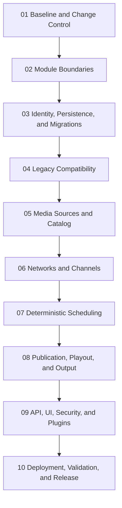

# ChannelForge Implementation Roadmap

- **Version:** 0.1
- **Status:** Draft
- **Project phase:** Implementation planning
- **Last updated:** 2026-07-27

## Purpose

This roadmap translates the accepted ChannelForge architecture specification
into an ordered implementation program.

It defines:

- Implementation sequencing
- Milestone boundaries
- Dependency order
- Pull-request boundaries
- Compatibility requirements
- Verification gates
- Cutover expectations
- Release-readiness criteria
- Deferred work

The governing product principle remains:

> Build television networks, not playlists.

The roadmap is subordinate to:

```text
docs/architecture/spec/
```

When roadmap language conflicts with the architecture specification, the
architecture specification remains authoritative until the discrepancy is
resolved through an explicit documentation change or Architecture Decision
Record.

## Roadmap Mission

The implementation program must transform the inherited Tunarr runtime into
ChannelForge without a big-bang rewrite.

The program must:

- Preserve a working runtime throughout the transition
- Introduce ChannelForge-owned domain boundaries incrementally
- Keep legacy data readable until controlled cutover
- Prevent new code from depending on legacy database shapes
- Establish stable ChannelForge identifiers
- Preserve SQLite for version 1
- Separate scheduling from playout
- Build deterministic scheduling before replacing runtime scheduling behavior
- Preserve Plex, Jellyfin, and Emby integration
- Preserve XMLTV, IPTV, and HDHomeRun-compatible output
- Maintain Docker and Unraid operability
- Keep migration reversible until rollback windows close
- Require tests at each boundary
- Avoid mixing unrelated architectural changes in one pull request
- Preserve Tunarr attribution and license obligations

## Current Repository Baseline

ChannelForge currently inherits the Tunarr monorepo and runtime foundation.

The current workspace contains:

- `server`
- `web`
- `types`
- `shared`

The repository uses:

- Node.js 22
- pnpm 10.28.0
- Turbo
- TypeScript
- Vitest
- Fastify
- SQLite through inherited persistence layers
- FFmpeg-based playout
- Existing Plex, Jellyfin, and Emby integrations

The current package names, scripts, runtime terminology, public README, and many
internal concepts remain Tunarr-derived.

This roadmap treats that state as the implementation baseline, not as the final
ChannelForge architecture.

## Scope

This roadmap covers the work required to reach the first credible ChannelForge
implementation baseline.

That baseline includes:

- Explicit module boundaries
- Stable ChannelForge identity
- ChannelForge persistence scaffolding
- Controlled legacy compatibility
- Normalized Media Sources and Catalog
- Presentation Assets and Interstitial Pools
- External Video Feeds and Discovery Inbox
- Network and Channel domains
- Break Rules and deterministic interstitial scheduling
- Deterministic schedule planning
- Schedule publication
- Runtime playout integration
- XMLTV
- M3U or IPTV output
- HDHomeRun-compatible output
- API migration
- First-party UI migration
- Authentication and authorization
- Plugin boundary scaffolding
- Docker and Unraid validation
- Migration and rollback
- Release readiness

## Non-Goals

This roadmap does not require version 1 to include:

- Plugin marketplace
- Paid marketplace
- Community programming-pack exchange
- Distributed microservices
- PostgreSQL
- Multi-node playout
- Cloud-hosted control plane
- Mobile application
- Public SaaS
- Recommendation machine learning
- Dynamic advertising marketplace
- Multi-tenant hosting
- Complete deletion of all inherited code
- Immediate removal of every compatibility route
- Immediate public release after the first implementation merge

## Implementation Philosophy

### Incremental Replacement

Inherited behavior should be wrapped, measured, and replaced incrementally.

### Stable Main Branch

Every merged pull request must leave `main` buildable and reviewable.

### One Authority Per Concept

At any point in the migration, each concept must have one documented write
authority.

### Compatibility Before Cutover

New ChannelForge code may read through compatibility adapters before legacy
writes are frozen.

### Tests Before Replacement

A legacy subsystem must have characterization or contract coverage before its
behavior is replaced.

### Architecture Before Convenience

Existing code structure does not override the accepted architecture.

### Explicit Deferred Work

A deferred feature must be recorded rather than quietly omitted.

## Branch Strategy

Roadmap documentation is developed on:

```text
docs/implementation-roadmap-v0.1
```

Runtime implementation must use separate implementation branches.

Examples:

```text
feat/module-boundaries
feat/channel-forge-identities
feat/media-source-domain
feat/catalog-normalization
feat/network-channel-domain
feat/deterministic-scheduler
feat/schedule-publication
feat/playout-integration
```

The roadmap branch must remain documentation-only.

## Pull-Request Strategy

Implementation should proceed through narrow pull requests.

A pull request should normally:

- Address one architectural boundary
- Introduce one coherent capability
- Include tests
- Avoid opportunistic rebranding
- Avoid unrelated dependency updates
- Avoid broad formatting churn
- Avoid changing both a legacy implementation and its replacement without
  explicit compatibility tests
- Include migration or rollback notes when persistence changes
- State which roadmap gate it satisfies
- State which architecture documents govern the work

## Pull-Request Size

There is no absolute line-count limit.

A pull request is too large when reviewers cannot answer:

- What architectural boundary changed?
- Which source of truth changed?
- How is compatibility preserved?
- How is rollback performed?
- What tests prove the behavior?
- What remains deferred?

Large generated migrations, fixtures, or schemas may be acceptable when their
semantic scope is narrow.

## Commit Strategy

Implementation commits should remain logically reviewable.

Preferred commit sequence:

1. Characterization tests
2. New boundary or contract
3. New implementation
4. Compatibility adapter
5. Migration or backfill
6. Call-site transition
7. Legacy-path freeze
8. Cleanup

Not every pull request needs all eight commit types.

## Merge Strategy

Use normal merge commits for milestone pull requests when preserving internal
commit sequence improves traceability.

Squash may be used for small corrective pull requests.

## Versioning Strategy

Roadmap version `0.1` describes the initial implementation path.

Roadmap document status terms:

- **Planned:** Milestone document has not been written.
- **Draft:** Milestone document exists but remains open to change.
- **Accepted:** Milestone is approved as an implementation target.
- **In Progress:** Implementation work has begun.
- **Complete:** Completion gates were met and verified.
- **Superseded:** A later roadmap or ADR replaces it.
- **Deferred:** Work remains valid but is intentionally moved out of the current
  implementation program.

## Milestone Documents

| Document | Status | Purpose |
| --- | --- | --- |
| `01-baseline-and-change-control.md` | Draft | Establishes repository baseline, characterization coverage, dependency inventory, and change-control rules |
| `02-module-boundaries.md` | Draft | Defines the modular-monolith package boundaries and dependency enforcement sequence |
| `03-identity-persistence-and-migrations.md` | Draft | Introduces ChannelForge identifiers, persistence scaffolding, repositories, transactions, and migration metadata |
| `04-legacy-compatibility.md` | Draft | Defines compatibility reads, temporary write translation, legacy route handling, and legacy dependency measurement |
| `05-media-sources-and-catalog.md` | Draft | Implements Media Sources, provider adapters, normalized Catalog Items, Source Bindings, Playback Variants, and synchronization |
| `06-networks-and-channels.md` | Draft | Implements Network, Channel, profile revisions, programming configuration revisions, and ownership rules |
| `07-deterministic-scheduling.md` | Draft | Implements deterministic plan generation, rules, evidence, validation, approval, and regeneration |
| `08-publication-playout-and-output.md` | Draft | Implements publication, active-plan pointers, playout decisions, FFmpeg integration, XMLTV, M3U, and HDHomeRun-compatible output |
| `09-api-ui-security-and-plugins.md` | Draft | Migrates first-party API and UI, authorization, secrets, audit, and plugin capability boundaries |
| `10-deployment-validation-and-release.md` | Draft | Completes Docker, Compose, Unraid, migration cutover, platform validation, release gates, and legacy retirement criteria |

## Cross-Cutting Amendment: Interstitial Programming and External Video Feeds

ADR 0002 and architecture specification 15 add two related capabilities:

1. Interstitial Programming
2. External Video Feeds

The implementation remains distributed across existing milestones rather than
creating a separate vertical milestone.

| Milestone | Responsibility |
| --- | --- |
| 01 | Inventory and characterize inherited filler, flex, commercial-like content, remote URLs, and web-video references |
| 05 | Implement Presentation Assets, External Feeds, Feed Items, synchronization, matching, Rights Status, and Playability Status |
| 06 | Implement Network- and Channel-scoped Interstitial Pools, Break Rules, and Feed assignment |
| 07 | Implement deterministic break insertion, duration packing, cooldowns, frequency caps, and selection evidence |
| 08 | Implement Presentation Asset publication, playout, guide behavior, runtime fallback, and Airing Records |
| 09 | Implement API, UI, authorization, Secret Service use, remote-feed security, audit, and plugin adapter boundaries |
| 10 | Validate Docker, Unraid, migration, security, provider failure, determinism, backup, restore, and release documentation |

The default External Feed behavior is discovery-only through the Discovery
Inbox.

A discovered external item cannot enter linear planning or playout unless a
separate supported and authorized playable source exists.

Version 1 explicitly excludes:

- YouTube downloading
- YouTube stream extraction
- YouTube-to-FFmpeg restreaming
- BumpWorthy scraping or downloading
- Arbitrary webpage-to-media conversion
- Advertising marketplace and billing
- Per-viewer targeted advertising

These boundaries are release gates, not optional implementation guidance.

## Milestone Sequence



## Dependency Rule

A milestone may begin exploratory work before the previous milestone is marked
Complete.

A milestone may not become the canonical implementation path until its required
predecessor gates are satisfied.

## Milestone 01 Summary

### Baseline and Change Control

This milestone establishes the verified starting point.

It includes:

- Build baseline
- Test baseline
- Platform-specific failure inventory
- Dependency inventory
- Existing module inventory
- Existing database inventory
- Existing route inventory
- Existing provider adapter inventory
- Existing output inventory
- Characterization tests
- Repository contribution rules
- Architecture-reference rules
- Pull-request template requirements
- Change-risk classification

It does not introduce ChannelForge runtime behavior.

## Milestone 02 Summary

### Module Boundaries

This milestone creates enforceable modular-monolith boundaries.

Candidate modules include:

- Identity and access
- Media Sources
- Catalog
- Networks
- Channels
- Programming
- Scheduling
- Publication
- Playout
- Output
- Plugins
- Operations
- Migration

It includes:

- Package and directory policy
- Public module interfaces
- Dependency direction
- Import restrictions
- Legacy adapter boundary
- Architecture tests
- Shared-kernel limits
- Domain versus transport separation
- Domain versus persistence separation

It must avoid moving the entire codebase at once.

## Milestone 03 Summary

### Identity, Persistence, and Migrations

This milestone introduces ChannelForge-owned identity and persistence
infrastructure.

It includes:

- Stable identifiers
- Revision identifiers
- Migration metadata
- Repository interfaces
- Unit-of-work or transaction boundary
- Optimistic concurrency
- SQLite schema additions
- Schema version tracking
- Migration checkpoints
- Backup preconditions
- Initial mapping tables
- Audit foundations

It must not yet remove inherited tables.

## Milestone 04 Summary

### Legacy Compatibility

This milestone makes legacy dependency explicit.

It includes:

- Legacy repositories
- Compatibility reads
- Legacy ID resolution
- Temporary write translation where unavoidable
- Legacy API categorization
- Deprecation metadata
- Compatibility metrics
- Write-authority matrix
- Legacy write-freeze mechanisms
- Reconciliation jobs
- Rollback points

No new ChannelForge feature may depend directly on legacy row shapes after this
milestone.

## Milestone 05 Summary

### Media Sources and Catalog

This milestone creates the normalized provider-independent media foundation.

It includes:

- Media Source aggregate
- Provider identity
- Provider credentials through Secret Service
- Plex adapter contract
- Jellyfin adapter contract
- Emby adapter contract
- Library selection
- Path mapping
- Catalog Item
- Source Binding
- Playback Variant
- Metadata provenance
- Synchronization jobs
- Full reconciliation
- Incremental synchronization
- Matching and deduplication
- Availability
- Catalog Snapshot

This milestone must preserve current provider connectivity.

## Milestone 06 Summary

### Networks and Channels

This milestone introduces ChannelForge's network-first domain.

It includes:

- Network
- Network Profile Revision
- Channel
- Channel Profile Revision
- Channel number
- Channel identity
- Branding
- Time zone
- Programming Configuration Revision
- Lifecycle
- Archive and restore
- Default migrated Network
- Legacy Channel mappings
- Network and Channel API foundations

This milestone must not rely on playlist terminology as the primary domain
model.

## Milestone 07 Summary

### Deterministic Scheduling

This milestone implements schedule planning independently from playout.

It includes:

- Catalog Snapshot input
- Planning horizon
- Seeded random source
- Rule contracts
- Hard constraints
- Soft preferences
- Candidate selection
- Tie-breaking
- Episode ordering
- Repeat windows
- Dayparts
- Blocks
- Filler
- Alignment
- Schedule Plan
- Schedule Entry
- Evidence
- Validation
- Approval
- Regeneration
- Locked entries
- Carry-In
- Carry-Out
- Golden determinism tests

The same inputs and seed must produce the same canonical plan.

## Milestone 08 Summary

### Publication, Playout, and Output

This milestone connects approved plans to runtime output.

It includes:

- Schedule Publication
- Active-plan pointer
- Publication validation
- Runtime entry lookup
- Runtime offset
- Source selection
- Playback Variant selection
- Stream-mode decision
- Shared sessions
- FFmpeg process supervision
- Recovery content
- XMLTV
- M3U
- HDHomeRun-compatible endpoints
- Artifact generation
- ETags
- Last-valid artifact retention
- Stream continuity
- Runtime health

Playout must consume published plans rather than generate schedules.

## Milestone 09 Summary

### API, UI, Security, and Plugins

This milestone moves first-party workflows to ChannelForge boundaries.

It includes:

- REST API v1
- OpenAPI
- Error contracts
- Pagination
- ETags
- Idempotency
- Authentication
- Role authorization
- API-token scopes
- Secret Service
- Audit
- Security findings
- First-party UI migration
- Legacy route deprecation
- Plugin manifest
- Plugin permissions
- Contribution registration
- Plugin isolation scaffolding

Marketplace implementation remains deferred.

## Milestone 10 Summary

### Deployment, Validation, and Release

This milestone proves the full system and prepares controlled release.

It includes:

- Docker image
- Docker Compose
- Unraid template
- PUID and PGID
- Non-root execution
- Hardware acceleration
- Health checks
- Graceful shutdown
- Backup and restore
- Migration rehearsal
- Rollback rehearsal
- Linux release suite
- Windows development validation
- amd64
- arm64 where supported
- Provider compatibility
- Client compatibility
- Performance baselines
- Soak testing
- Security scans
- Release report
- Legacy retirement decision

Legacy deletion is a separate, explicitly approved act.

## Cross-Cutting Workstreams

Some work spans multiple milestones.

### Documentation

Each implementation change must update affected documentation.

### Testing

Tests grow with every new boundary.

### Security

Authentication, authorization, redaction, and secret handling must be included
when the corresponding capability appears.

### Migration

Migration support begins before cutover and continues through release.

### Observability

Logs, metrics, health, audit, and support data must be added with the subsystem
they describe.

### Deployment

Container compatibility must be preserved through all milestones.

### Attribution

Tunarr license and attribution remain present through implementation and
distribution.

## Architecture Traceability

Every milestone document should identify governing architecture documents.

Examples:

| Roadmap concern | Governing specification |
| --- | --- |
| Terminology | `docs/architecture/spec/01-terminology.md` |
| Runtime boundaries | `docs/architecture/spec/02-system-context.md` |
| Domain entities | `docs/architecture/spec/03-domain-model.md` |
| Schedule generation | `docs/architecture/spec/04-scheduling-model.md` |
| Catalog | `docs/architecture/spec/05-media-catalog.md` |
| Runtime output | `docs/architecture/spec/06-playout-and-output.md` |
| Providers | `docs/architecture/spec/07-integrations.md` |
| SQLite | `docs/architecture/spec/08-persistence.md` |
| REST API | `docs/architecture/spec/09-api.md` |
| Plugins | `docs/architecture/spec/10-plugins.md` |
| Security | `docs/architecture/spec/11-security.md` |
| Deployment | `docs/architecture/spec/12-deployment.md` |
| Testing | `docs/architecture/spec/13-testing.md` |
| Migration | `docs/architecture/spec/14-migration.md` |

## Milestone Document Template

Every milestone document should contain:

1. Purpose
2. Governing specifications
3. Current baseline
4. Target state
5. Non-goals
6. Dependencies
7. Workstreams
8. Data changes
9. API changes
10. UI changes
11. Compatibility behavior
12. Security requirements
13. Observability requirements
14. Testing requirements
15. Recommended pull-request sequence
16. Entry gates
17. Completion gates
18. Rollback
19. Risks
20. Deferred decisions

## Work Item Classification

Roadmap work items should be classified as:

- `FOUNDATION`
- `DOMAIN`
- `PERSISTENCE`
- `MIGRATION`
- `COMPATIBILITY`
- `INTEGRATION`
- `SCHEDULING`
- `PLAYOUT`
- `OUTPUT`
- `API`
- `UI`
- `SECURITY`
- `PLUGIN`
- `DEPLOYMENT`
- `TESTING`
- `DOCUMENTATION`

## Risk Classification

Suggested risk levels:

- **Low:** Isolated documentation, tests, or additive types
- **Moderate:** Additive runtime boundary with no write-authority change
- **High:** Persistence, identity, provider, scheduling, or playout behavior
- **Critical:** Migration cutover, credential handling, active publication,
  backup restore, or legacy deletion

## Critical Change Requirements

A critical change requires:

- Explicit rollback
- Backup plan
- Characterization coverage
- Integration coverage
- Operator impact
- Release note
- Architecture traceability
- Verification evidence

## Entry Gate

A milestone may be marked `In Progress` when:

- Its milestone document is Draft or Accepted
- Governing architecture documents exist
- Required predecessor interfaces exist
- Baseline tests are recorded
- Risks are identified
- No unresolved architecture contradiction blocks the work
- Initial pull-request sequence is defined

## Completion Gate

A milestone may be marked `Complete` when:

- All required workstreams are complete
- Required tests pass
- Migration behavior is verified
- Compatibility behavior is documented
- Rollback is verified where applicable
- Documentation is updated
- No hidden direct legacy dependency remains in the completed boundary
- Deferred items are recorded
- Completion evidence is linked

## Implementation Gate Types

### Gate A: Build

- Workspace installs
- Type checking passes
- Build passes

### Gate B: Unit

- Domain tests pass
- Pure component tests pass

### Gate C: Integration

- SQLite integration passes
- Provider contracts pass
- API integration passes

### Gate D: Runtime

- Stream starts
- Plan lookup works
- Output artifacts validate

### Gate E: Migration

- Prior fixture migrates
- Restart resumes
- Rollback works
- No source data is lost

### Gate F: Deployment

- Docker starts
- Health becomes ready
- Restart preserves state
- Unraid configuration remains valid

### Gate G: Release

- Linux authoritative suite passes
- Security checks pass
- Backup and restore pass
- Compatibility report is current
- Release report is complete

## Definition of Ready for an Implementation Pull Request

A pull request is ready to begin when:

- One roadmap work item is identified
- Governing architecture sections are identified
- Current behavior is understood
- Expected behavior is explicit
- Data ownership is explicit
- Compatibility impact is explicit
- Test plan is explicit
- Rollback or safe failure behavior is explicit
- Scope excludes unrelated cleanup

## Definition of Done for an Implementation Pull Request

A pull request is done when:

- Code is reviewed
- Tests pass
- New public contracts are documented
- Migration is included where required
- No secrets are exposed
- Logs are structured
- Errors are stable
- Compatibility metrics exist where required
- Deferred cleanup is tracked
- Main remains buildable
- Relevant milestone status is updated

## Change-Control Rules

### No Big-Bang Rename

Package, route, type, and directory renaming should be sequenced to avoid hiding
behavioral changes inside naming churn.

### No Big-Bang Persistence Rewrite

New tables and repositories should be additive until migration and rollback are
verified.

### No Unmeasured Compatibility

A legacy path must emit usage evidence before removal.

### No Silent Semantic Change

Changes to scheduling, repeat behavior, guide identity, stream behavior, or
provider matching require explicit tests and release notes.

### No Direct Legacy Access From New Modules

New modules may use compatibility interfaces but should not query legacy tables
directly.

### No Provider Calls Inside Write Transactions

Provider network requests must remain outside SQLite write transactions.

### No Runtime Scheduling

The playout subsystem must not mutate or regenerate the schedule while serving
a stream.

### No Secret in Output

Provider credentials, plugin secrets, API tokens, and master keys must never
appear in XMLTV, M3U, logs, errors, or support bundles.

## Dependency Management

Dependency upgrades should be separate from architecture migration unless the
upgrade is required for the milestone.

A required upgrade must state:

- Why it is required
- Compatibility risk
- Migration impact
- Rollback
- Test coverage

## Branding Transition

Branding should change in controlled layers:

1. Internal ChannelForge domain names
2. New ChannelForge API names
3. First-party UI
4. Container and package metadata
5. Public README and documentation
6. Release artifacts

Attribution to Tunarr remains.

Branding changes must not break:

- Data paths
- Container mounts
- Existing environment variables
- API compatibility
- Client configuration
- Backup restore

## Data Migration Policy

Persistence changes must be:

- Versioned
- Forward-tested
- Restart-safe
- Backed up
- Verified
- Observable
- Reversible where support policy requires

## Legacy Removal Policy

A legacy path may be removed only when:

- Canonical replacement is complete
- First-party callers no longer use it
- Compatibility metrics show no supported use
- Migration fixtures pass
- Rollback window closed
- Release notes announce removal
- An explicit cleanup pull request is reviewed

## Testing Policy

Implementation work follows the testing architecture.

Required categories grow by milestone:

- Characterization
- Unit
- Domain
- Component
- Integration
- Contract
- Migration
- Runtime
- Platform
- Performance
- Security
- Soak

## Platform Policy

Linux container behavior is authoritative for production.

Windows remains a supported development environment.

Windows-specific test differences must be classified rather than ignored.

## Documentation Policy

Roadmap documents should describe implementation order, not replace the
architecture specification.

Implementation pull requests should update:

- Architecture documents when design changes
- Roadmap milestone status
- Operator documentation
- Migration notes
- API documentation
- Release notes where behavior changes

## Decision Policy

A new ADR is required when implementation discovers a need to change:

- Persistence engine
- Domain ownership
- Scheduling determinism
- Schedule versus playout separation
- Plugin isolation model
- Deployment topology
- Public API versioning
- Migration authority
- Security trust boundary

## Roadmap Status Review

The roadmap should be reviewed:

- Before each milestone begins
- After each milestone completes
- When a major architecture decision changes
- Before release-candidate preparation

## Implementation Program Completion

The implementation roadmap is complete when:

- All milestone documents are Complete or explicitly Deferred
- ChannelForge domain boundaries are active
- Stable ChannelForge identities are canonical
- Media Sources and Catalog are canonical
- Networks and Channels are canonical
- Deterministic scheduling produces approved plans
- Playout consumes published plans
- XMLTV, M3U, and HDHomeRun-compatible output validate
- First-party API and UI use ChannelForge contracts
- Authentication, authorization, secrets, and audit are active
- Docker and Unraid deployment validate
- Migration and rollback are verified
- Release gates pass
- Remaining legacy code has documented ownership and retirement criteria

## Immediate Next Document

The first milestone document is:

```text
docs/implementation/01-baseline-and-change-control.md
```

It will define the exact repository baseline, inherited subsystem inventory,
characterization-test requirements, architecture enforcement, risk
classification, and the first implementation pull-request sequence.
