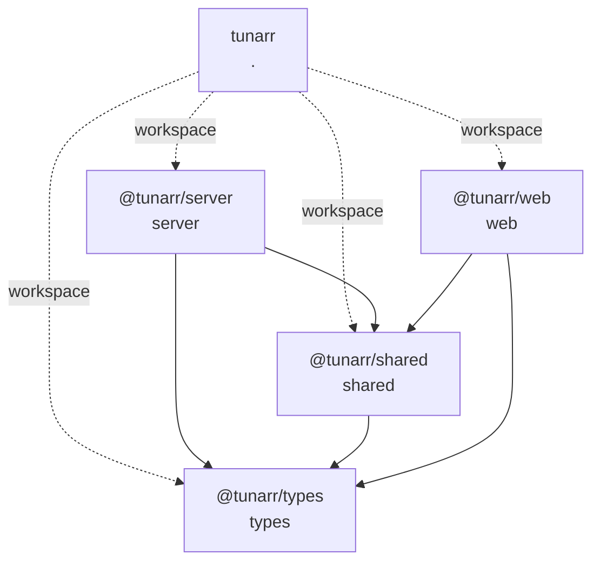

# Workspace Dependency Graph

- **Source commit:** `195a4d04aca082af04362152f56283c139e9eaad`
- **Edge type:** Direct manifest dependency only

## Graph

The dotted root edges represent workspace orchestration, not package imports.
Solid edges represent direct package-manifest dependencies.

## Direct Workspace Edges

| From | To | Declared by |
| --- | --- | --- |
| `@tunarr/server` | `@tunarr/shared` | `server/package.json` |
| `@tunarr/server` | `@tunarr/types` | `server/package.json` |
| `@tunarr/shared` | `@tunarr/types` | `shared/package.json` |
| `@tunarr/web` | `@tunarr/shared` | `web/package.json` |
| `@tunarr/web` | `@tunarr/types` | `web/package.json` |

## Adjacency Matrix

| Package | @tunarr/server | @tunarr/shared | @tunarr/types | @tunarr/web |
| --- | --- | --- | --- | --- |
| `@tunarr/server` | — | Yes | Yes | — |
| `@tunarr/shared` | — | — | Yes | — |
| `@tunarr/types` | — | — | — | — |
| `@tunarr/web` | — | Yes | Yes | — |

## Interpretation Boundary

This graph describes inherited package coupling only. It does not authorize
the final ChannelForge domain graph or module boundaries.
